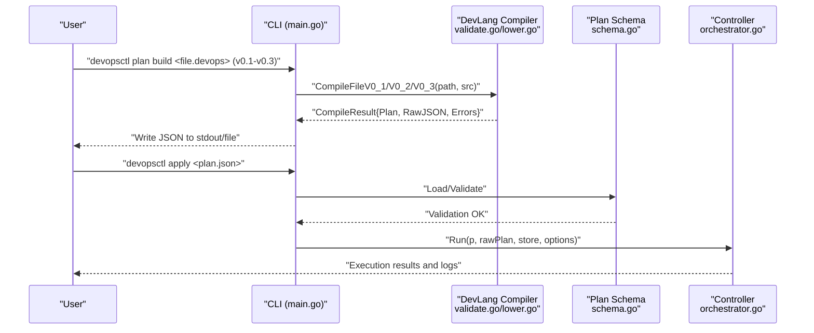
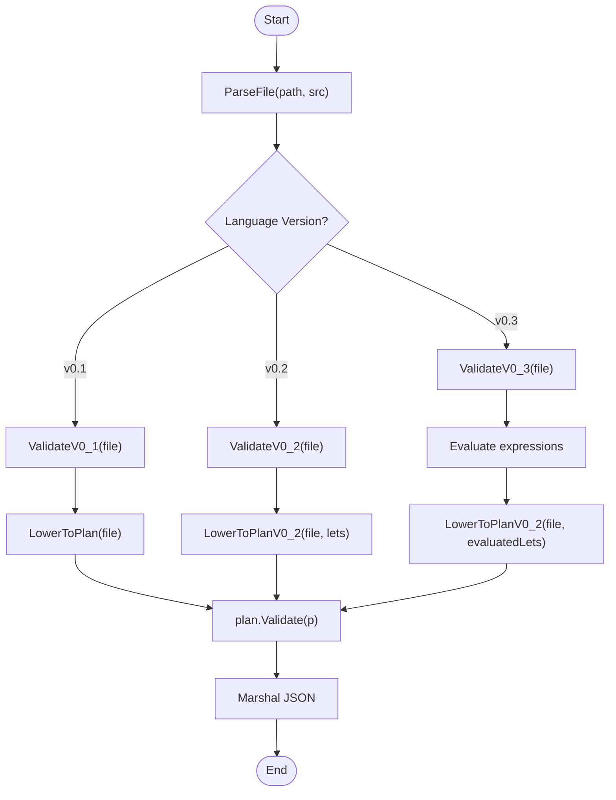
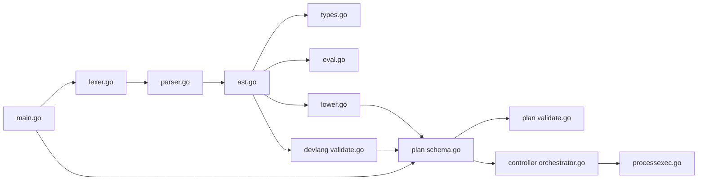

# .devops Language Reference

<cite>
**Referenced Files in This Document**
- [lexer.go](file://internal/devlang/lexer.go)
- [parser.go](file://internal/devlang/parser.go)
- [ast.go](file://internal/devlang/ast.go)
- [lower.go](file://internal/devlang/lower.go)
- [validate.go](file://internal/devlang/validate.go)
- [types.go](file://internal/devlang/types.go)
- [eval.go](file://internal/devlang/eval.go)
- [schema.go](file://internal/plan/schema.go)
- [validate.go](file://internal/plan/validate.go)
- [processexec.go](file://internal/primitive/processexec/processexec.go)
- [orchestrator.go](file://internal/controller/orchestrator.go)
- [main.go](file://cmd/devopsctl/main.go)
- [plan.devops](file://plan.devops)
- [plan.json](file://plan.json)
- [plan_validate_test.go](file://internal/plan/validate_test.go)
- [plan_resume.devops](file://tests/e2e/plan_resume.devops)
- [comprehensive.devops](file://tests/v0_3/valid/comprehensive.devops)
- [logical.devops](file://tests/v0_3/valid/logical.devops)
- [ternary.devops](file://tests/v0_3/valid/ternary.devops)
- [concat.devops](file://tests/v0_3/valid/concat.devops)
- [type_mismatch.devops](file://tests/v0_3/invalid/type_mismatch.devops)
- [unresolved_var.devops](file://tests/v0_3/invalid/unresolved_var.devops)
</cite>

## Update Summary
**Changes Made**
- Added comprehensive v0.3 language support documentation including binary operators (+, &&, ||, ==, !=)
- Added ternary expressions (? :) support and compile-time evaluation with constant folding
- Added advanced type checking system with expression support
- Updated language version support matrix and compilation pipeline
- Enhanced expression grammar and semantic rules
- Added new validation and compilation functions for v0.3

## Table of Contents
1. [Introduction](#introduction)
2. [Project Structure](#project-structure)
3. [Core Components](#core-components)
4. [Architecture Overview](#architecture-overview)
5. [Detailed Component Analysis](#detailed-component-analysis)
6. [Language Versions and Evolution](#language-versions-and-evolution)
7. [Dependency Analysis](#dependency-analysis)
8. [Performance Considerations](#performance-considerations)
9. [Troubleshooting Guide](#troubleshooting-guide)
10. [Conclusion](#conclusion)
11. [Appendices](#appendices)

## Introduction
This document defines the .devops language used to describe infrastructure as code with a programming-first approach. It covers syntax and semantics, grammar, compilation pipeline from .devops to JSON execution plans, validation rules, and practical patterns for file synchronization and process execution across multiple nodes. The language now supports v0.1, v0.2, and v0.3 versions, with v0.3 introducing comprehensive expression support including binary operators, ternary expressions, compile-time evaluation, and advanced type checking.

## Project Structure
The .devops language implementation is organized around a small compiler stack and a runtime controller with support for multiple language versions:
- Language front-end: lexer, parser, AST, lowering, and validation (v0.1-v0.3)
- Execution plan: JSON schema and validation
- Runtime controller: graph building, scheduling, and primitive execution
- CLI entry point: compile-time commands and apply/reconcile workflows

**Diagram sources**
- [lexer.go](file://internal/devlang/lexer.go#L1-L289)
- [parser.go](file://internal/devlang/parser.go#L1-L615)
- [ast.go](file://internal/devlang/ast.go#L1-L159)
- [validate.go](file://internal/devlang/validate.go#L1-L717)
- [types.go](file://internal/devlang/types.go#L1-L184)
- [eval.go](file://internal/devlang/eval.go#L1-L182)
- [lower.go](file://internal/devlang/lower.go#L1-L179)
- [schema.go](file://internal/plan/schema.go#L1-L77)
- [validate.go](file://internal/plan/validate.go#L1-L95)
- [orchestrator.go](file://internal/controller/orchestrator.go#L1-L653)
- [processexec.go](file://internal/primitive/processexec/processexec.go#L1-L83)
- [main.go](file://cmd/devopsctl/main.go#L1-L273)

**Section sources**
- [lexer.go](file://internal/devlang/lexer.go#L1-L289)
- [parser.go](file://internal/devlang/parser.go#L1-L615)
- [ast.go](file://internal/devlang/ast.go#L1-L159)
- [validate.go](file://internal/devlang/validate.go#L1-L717)
- [types.go](file://internal/devlang/types.go#L1-L184)
- [eval.go](file://internal/devlang/eval.go#L1-L182)
- [lower.go](file://internal/devlang/lower.go#L1-L179)
- [schema.go](file://internal/plan/schema.go#L1-L77)
- [validate.go](file://internal/plan/validate.go#L1-L95)
- [orchestrator.go](file://internal/controller/orchestrator.go#L1-L653)
- [processexec.go](file://internal/primitive/processexec/processexec.go#L1-L83)
- [main.go](file://cmd/devopsctl/main.go#L1-L273)

## Core Components
- Lexer: tokenizes source into keywords, identifiers, strings, booleans, and operators including new binary operators and ternary syntax.
- Parser: builds an AST from tokens with support for expressions, binary operators, logical operators, equality comparisons, string concatenation, and ternary expressions.
- AST: typed nodes for targets, nodes, expressions, and declarations with support for BinaryExpr and TernaryExpr.
- Type System: advanced type checking for expressions with compile-time evaluation and constant folding.
- Lowering: transforms AST into the plan.Plan IR with support for evaluated expressions.
- Validation: enforces language version constraints and semantic rules for v0.1, v0.2, and v0.3.
- Plan Schema: JSON structure for targets, nodes, and inputs.
- Controller: schedules nodes respecting dependencies, conditions, and failure policies.

**Section sources**
- [lexer.go](file://internal/devlang/lexer.go#L1-L289)
- [parser.go](file://internal/devlang/parser.go#L451-L615)
- [ast.go](file://internal/devlang/ast.go#L127-L159)
- [types.go](file://internal/devlang/types.go#L1-L184)
- [eval.go](file://internal/devlang/eval.go#L1-L182)
- [lower.go](file://internal/devlang/lower.go#L1-L179)
- [validate.go](file://internal/devlang/validate.go#L493-L717)
- [schema.go](file://internal/plan/schema.go#L1-L77)

## Architecture Overview
The .devops compilation pipeline produces a JSON execution plan consumed by the controller. The pipeline now supports three language versions with increasing complexity and feature support.

**Diagram sources**
- [main.go](file://cmd/devopsctl/main.go#L214-L245)
- [validate.go](file://internal/devlang/validate.go#L417-L717)
- [lower.go](file://internal/devlang/lower.go#L9-L179)
- [schema.go](file://internal/plan/schema.go#L41-L52)
- [validate.go](file://internal/plan/validate.go#L5-L94)
- [orchestrator.go](file://internal/controller/orchestrator.go#L34-L300)

## Detailed Component Analysis

### Language Grammar and Tokens
- Tokens include special markers, identifiers, strings, booleans, and keywords: target, node, let, module, step, for, in.
- **Updated** Binary operators: + (string concatenation), && (logical AND), || (logical OR), == (equality), != (inequality).
- **Updated** Ternary operator: ? : for conditional expressions.
- **Updated** Comments are line-style (double-slash) and whitespace is ignored except for line/column tracking.

Key tokenization behaviors:
- Strings support escapes and unterminated string detection.
- Keywords are recognized and returned as distinct token types.
- Unknown characters produce illegal tokens.
- **Updated** Binary operators are properly tokenized with correct precedence handling.

**Section sources**
- [lexer.go](file://internal/devlang/lexer.go#L6-L39)
- [lexer.go](file://internal/devlang/lexer.go#L101-L130)
- [lexer.go](file://internal/devlang/lexer.go#L205-L241)
- [lexer.go](file://internal/devlang/lexer.go#L243-L280)

### Expressions and Operator Precedence
**Updated** The expression grammar now supports comprehensive operator precedence:
- **Lowest precedence**: Ternary expressions (cond ? true_expr : false_expr)
- **Logical OR**: expr || expr
- **Logical AND**: expr && expr  
- **Equality**: expr == expr, expr != expr
- **String concatenation**: expr + expr (only strings)
- **Highest precedence**: Primary expressions (literals, identifiers, lists)

Expression parsing rules:
- **Updated** Binary expressions support string concatenation (+), logical operations (&&, ||), and equality comparisons (==, !=).
- **Updated** Ternary expressions require boolean condition and matching types for true/false branches.
- **Updated** All expressions are type-checked before evaluation.
- **Updated** Compile-time evaluation performs constant folding for pure expressions.

**Section sources**
- [parser.go](file://internal/devlang/parser.go#L451-L569)
- [parser.go](file://internal/devlang/parser.go#L457-L482)
- [parser.go](file://internal/devlang/parser.go#L484-L502)
- [parser.go](file://internal/devlang/parser.go#L504-L522)
- [parser.go](file://internal/devlang/parser.go#L524-L549)
- [parser.go](file://internal/devlang/parser.go#L551-L569)

### AST Types with Expression Support
**Updated** Core AST nodes now include comprehensive expression support:
- File: container of declarations
- TargetDecl: name and address
- NodeDecl: type, targets, depends_on, failure_policy, inputs
- **Updated** Expr hierarchy expanded: Ident, StringLiteral, BoolLiteral, ListLiteral, BinaryExpr, TernaryExpr
- **Updated** BinaryExpr supports OpAdd, OpAnd, OpOr, OpEq, OpNeq operators
- **Updated** TernaryExpr represents conditional expressions with condition, true branch, and false branch

Positions are tracked for precise diagnostics.

**Section sources**
- [ast.go](file://internal/devlang/ast.go#L14-L83)
- [ast.go](file://internal/devlang/ast.go#L127-L159)

### Advanced Type Checking System
**New** The v0.3 language introduces a sophisticated type checking system:
- **Types**: string, bool, string[] (lists of strings)
- **Type inference**: automatic type deduction for expressions
- **Type safety**: compile-time verification of operator compatibility
- **List validation**: ensures all list elements are strings
- **Comparison restrictions**: prevents list comparisons, allows string/bool comparisons
- **Ternary type matching**: requires true and false branches to have identical types

Type checking rules:
- **Updated** Binary expressions: + requires string operands, &&/|| require bool operands, ==/!= require same types
- **Updated** Ternary expressions: condition must be bool, branches must match types
- **Updated** Identifier resolution: supports let bindings with type checking

**Section sources**
- [types.go](file://internal/devlang/types.go#L5-L25)
- [types.go](file://internal/devlang/types.go#L27-L183)

### Compile-Time Evaluation and Constant Folding
**New** The v0.3 language implements compile-time evaluation:
- **Constant folding**: pure expressions are evaluated at compile time
- **Let binding evaluation**: all let expressions are resolved to literals
- **Type verification**: expressions are type-checked before evaluation
- **Error propagation**: type errors are caught during evaluation phase
- **Literal promotion**: evaluated expressions become static values in the plan

Evaluation rules:
- **Updated** Binary expressions: + concatenates strings, &&/|| perform logical operations, ==/!= compare values
- **Updated** Ternary expressions: evaluate condition, then select appropriate branch
- **Updated** List evaluation: recursively evaluates all elements
- **Updated** Identifier resolution: replaces with let-bound values

**Section sources**
- [eval.go](file://internal/devlang/eval.go#L5-L7)
- [eval.go](file://internal/devlang/eval.go#L49-L182)

### Compilation Pipeline Evolution
**Updated** The compilation pipeline now supports three language versions:

**v0.1 Pipeline**: Basic support for targets and nodes only
1. Parse: Convert source to AST
2. ValidateV0_1: Enforce v0.1 constraints (no expressions, no let bindings)
3. Lower: Transform AST to plan.Plan IR
4. Plan Validate: Structural checks on JSON schema

**v0.2 Pipeline**: Adds let bindings with basic expression support
1. Parse: Convert source to AST
2. ValidateV0_2: Enforce v0.2 constraints (let bindings only, no complex expressions)
3. LowerV0_2: Transform AST with let resolution
4. Plan Validate: Structural checks

**v0.3 Pipeline**: Full expression support with type checking and evaluation
1. Parse: Convert source to AST
2. ValidateV0_3: Enforce v0.3 constraints (full expressions, type checking, evaluation)
3. LowerV0_2: Transform AST with evaluated expressions
4. Plan Validate: Structural checks

**Diagram sources**
- [validate.go](file://internal/devlang/validate.go#L417-L717)
- [lower.go](file://internal/devlang/lower.go#L9-L179)
- [validate.go](file://internal/plan/validate.go#L5-L94)

**Section sources**
- [validate.go](file://internal/devlang/validate.go#L417-L717)
- [lower.go](file://internal/devlang/lower.go#L9-L179)
- [validate.go](file://internal/plan/validate.go#L5-L94)

### Language Semantics and Constraints
**Updated** Language constraints now vary by version:

**v0.1 (Basic)**:
- No let bindings, for loops, steps, or modules
- Only string literals in lists
- Simple target/node declarations

**v0.2 (Let Bindings)**:
- Supports let bindings with string, bool, and string list literals
- No complex expressions in let values
- Targets must reference declared targets, not let bindings

**v0.3 (Full Expressions)**:
- **Updated** Supports full expression language with binary operators, logical operators, equality comparisons, and ternary expressions
- **Updated** Advanced type checking with compile-time evaluation
- **Updated** Constant folding for pure expressions
- **Updated** Comprehensive error reporting with precise positioning

**Section sources**
- [validate.go](file://internal/devlang/validate.go#L196-L315)
- [validate.go](file://internal/devlang/validate.go#L23-L194)
- [validate.go](file://internal/devlang/validate.go#L493-L677)

### JSON Execution Plan Structure
The plan JSON mirrors the AST with normalized values:
- version: string
- targets: array of { id, address }
- nodes: array of { id, type, targets[], depends_on[], when?, failure_policy?, inputs }

**Updated** v0.3 adds support for evaluated expressions in inputs, replacing let identifiers with their computed values.

When condition supports node-level conditional execution. Failure policy controls cascading behavior.

**Section sources**
- [schema.go](file://internal/plan/schema.go#L11-L40)
- [validate.go](file://internal/plan/validate.go#L5-L94)

### Relationship Between .devops and JSON Plan
**Updated** The relationship now varies by language version:

**v0.1**: Direct mapping with string literals only
- target "name" {...} -> targets[]
- node "name" {...} -> nodes[]
- type, targets, depends_on, failure_policy -> node fields
- inputs -> node.inputs (string literals only)

**v0.2**: Let resolution mapping
- let bindings -> resolved values in inputs
- Lists -> arrays of strings

**v0.3**: Full expression mapping with constant folding
- let bindings -> evaluated literals in inputs
- Complex expressions -> computed values
- Ternary expressions -> selected branches

**Section sources**
- [lower.go](file://internal/devlang/lower.go#L92-L179)
- [schema.go](file://internal/plan/schema.go#L11-L40)

### Conditional Execution Patterns
Conditional execution is represented via a when field on nodes:
- when: { node: "<id>", changed: <bool> }
- A node with when evaluates whether the referenced node's change flag matches the expectation; if not, it is skipped.

The controller tracks per-node change flags and propagates them to dependent nodes.

**Section sources**
- [schema.go](file://internal/plan/schema.go#L35-L39)
- [orchestrator.go](file://internal/controller/orchestrator.go#L116-L123)

### Dependency Declarations
- depends_on: array of node IDs; unknown references are rejected.
- The controller builds a directed acyclic graph and executes nodes with zero in-degree first.
- Cascading behavior: if a dependency fails or is skipped, dependents are marked accordingly.

**Section sources**
- [parser.go](file://internal/devlang/parser.go#L229-L240)
- [validate.go](file://internal/plan/validate.go#L53-L57)
- [orchestrator.go](file://internal/controller/orchestrator.go#L84-L155)

### Failure Policy Specifications
- failure_policy: one of halt, continue, rollback
- halt: stop remaining executions and mark others as blocked/skipped.
- continue: continue execution; dependents still cascade skip if conditions are not met.
- rollback: triggers rollback of prior successful changes upon failure.

**Section sources**
- [parser.go](file://internal/devlang/parser.go#L241-L246)
- [validate.go](file://internal/plan/validate.go#L65-L67)
- [orchestrator.go](file://internal/controller/orchestrator.go#L244-L265)

### Supported Primitives and Inputs
- file.sync
  - Required: src (string), dest (string)
  - Optional: delete_extra (bool|string)
- process.exec
  - Required: cmd (non-empty list of strings), cwd (string)
  - Optional: timeout (number)

**Updated** v0.3 allows expressions in primitive inputs, with compile-time evaluation replacing identifiers with computed values.

Runtime behavior:
- file.sync: detects local source tree, compares with remote state, computes changes, streams files if needed, records state.
- process.exec: executes command remotely, captures stdout/stderr, exit code, and error classification.

**Section sources**
- [validate.go](file://internal/devlang/validate.go#L317-L382)
- [validate.go](file://internal/plan/validate.go#L69-L90)
- [processexec.go](file://internal/primitive/processexec/processexec.go#L13-L83)
- [orchestrator.go](file://internal/controller/orchestrator.go#L313-L442)
- [orchestrator.go](file://internal/controller/orchestrator.go#L444-L513)

### Multi-Node Orchestration Example
A multi-node chain with dependencies and conditional execution:
- node_b depends_on node_a
- node_c depends_on node_b; may fail depending on a condition file
- node_d depends_on node_c

The controller respects depends_on edges, halts or continues based on failure_policy, and can reconcile or resume partial runs.

**Section sources**
- [plan_resume.devops](file://tests/e2e/plan_resume.devops#L1-L43)
- [orchestrator.go](file://internal/controller/orchestrator.go#L46-L291)

## Language Versions and Evolution
**New** The .devops language has evolved through three major versions, each adding more expressive power:

### v0.1 - Baseline
- Simple target and node declarations
- No expressions or variables
- String literals only in lists
- Basic validation and compilation

### v0.2 - Let Bindings
- Introduces let declarations with string, bool, and string list literals
- Limited expression support in let values
- Enhanced validation with let resolution

### v0.3 - Full Expressions
- **Complete expression language**: binary operators, logical operators, equality comparisons, ternary expressions
- **Advanced type system**: compile-time type checking and inference
- **Constant folding**: compile-time evaluation of pure expressions
- **Enhanced error reporting**: precise positioning and detailed error messages
- **Backward compatibility**: maintains support for earlier language features

**Section sources**
- [validate.go](file://internal/devlang/validate.go#L417-L717)
- [types.go](file://internal/devlang/types.go#L1-L184)
- [eval.go](file://internal/devlang/eval.go#L1-L182)

## Dependency Analysis
The compiler and runtime components are loosely coupled via the plan schema. The CLI integrates both compilation and execution with version-specific compilation functions.

**Diagram sources**
- [lexer.go](file://internal/devlang/lexer.go#L1-L289)
- [parser.go](file://internal/devlang/parser.go#L1-L615)
- [ast.go](file://internal/devlang/ast.go#L1-L159)
- [types.go](file://internal/devlang/types.go#L1-L184)
- [eval.go](file://internal/devlang/eval.go#L1-L182)
- [validate.go](file://internal/devlang/validate.go#L1-L717)
- [lower.go](file://internal/devlang/lower.go#L1-L179)
- [schema.go](file://internal/plan/schema.go#L1-L77)
- [validate.go](file://internal/plan/validate.go#L1-L95)
- [orchestrator.go](file://internal/controller/orchestrator.go#L1-L653)
- [processexec.go](file://internal/primitive/processexec/processexec.go#L1-L83)
- [main.go](file://cmd/devopsctl/main.go#L1-L273)

**Section sources**
- [main.go](file://cmd/devopsctl/main.go#L43-L66)
- [main.go](file://cmd/devopsctl/main.go#L104-L126)

## Performance Considerations
- Parallelism: controlled via CLI flags; the controller uses a semaphore to cap concurrent target executions.
- Graph traversal: depends_on edges define a DAG; the controller maintains in-degree counts and a ready queue.
- **Updated** Compile-time optimization: constant folding reduces runtime computation.
- **Updated** Expression evaluation: pure expressions are computed once during compilation.
- Streaming: file transfers use chunked messages to reduce memory overhead.
- State persistence: minimal hashing and compact change sets improve resume and reconciliation performance.

## Troubleshooting Guide
**Updated** Common syntax and validation errors across language versions:

**v0.1 Errors**:
- Unexpected token in expression: ensure expressions are strings, booleans, identifiers, or lists.
- Unterminated string or escape sequence: fix quotes and escape sequences.
- Missing target name or body delimiter: ensure target "name" { ... } is properly formed.
- Unknown identifier in target/node body: check spelling and ensure only supported keys are used.
- Duplicate target/node name: rename to be unique.
- Unknown target or node reference: ensure referenced IDs exist.
- Invalid failure_policy: choose among halt, continue, rollback.
- Primitive-specific input errors: file.sync requires src and dest as string literals; process.exec requires cmd as a non-empty list of string literals and cwd as a string literal.

**v0.2 Errors**:
- **Updated** Let binding type errors: ensure let values are string, bool, or list of string literals.
- **Updated** Duplicate let declarations: rename to be unique.
- **Updated** Let in targets: targets must reference declared targets, not let bindings.

**v0.3 Errors**:
- **Updated** Expression type mismatches: verify operator compatibility (e.g., + requires strings, &&/|| require bools).
- **Updated** Ternary type mismatch: true and false branches must have identical types.
- **Updated** Unresolved identifiers: ensure all identifiers are declared or built-in.
- **Updated** List comparison not supported: cannot compare lists with ==/!=.
- **Updated** Complex expression evaluation errors: check for mixed types in expressions.

**Updated** CLI feedback:
- Compile errors are printed with file, line, and column positions.
- Plan validation errors are reported before execution.
- **Updated** v0.3 provides detailed type checking and expression evaluation feedback.

**Section sources**
- [lexer.go](file://internal/devlang/lexer.go#L166-L199)
- [parser.go](file://internal/devlang/parser.go#L451-L467)
- [validate.go](file://internal/devlang/validate.go#L196-L315)
- [validate.go](file://internal/devlang/validate.go#L493-L677)
- [validate.go](file://internal/plan/validate.go#L5-L94)
- [main.go](file://cmd/devopsctl/main.go#L53-L58)
- [main.go](file://cmd/devopsctl/main.go#L113-L118)

## Conclusion
The .devops language offers a progressive, programming-first model for describing infrastructure with three distinct language versions. v0.1 provides a simple baseline, v0.2 adds let bindings for basic configuration, and v0.3 delivers full expression support with advanced type checking, compile-time evaluation, and constant folding. The compiler enforces strong constraints and produces a robust JSON plan consumed by a controller that orchestrates multi-node execution with dependency-aware scheduling, conditional execution, and failure policy enforcement. The comprehensive examples and validations demonstrate practical patterns for file synchronization, process execution, and complex configuration management across all language versions.

## Appendices

### Example: Minimal .devops to JSON
- Source example: [plan.devops](file://plan.devops#L1-L20)
- Compiled JSON: [plan.json](file://plan.json#L1-L25)

**Section sources**
- [plan.devops](file://plan.devops#L1-L20)
- [plan.json](file://plan.json#L1-L25)

### Example: Multi-Node Chain with Dependencies
- Source example: [plan_resume.devops](file://tests/e2e/plan_resume.devops#L1-L43)

**Section sources**
- [plan_resume.devops](file://tests/e2e/plan_resume.devops#L1-L43)

### Example: v0.3 Comprehensive Features
**New** Examples demonstrating v0.3 language capabilities:
- **Comprehensive expressions**: [comprehensive.devops](file://tests/v0_3/valid/comprehensive.devops#L1-L46)
- **Logical operations**: [logical.devops](file://tests/v0_3/valid/logical.devops#L1-L16)
- **Ternary expressions**: [ternary.devops](file://tests/v0_3/valid/ternary.devops#L1-L17)
- **String concatenation**: [concat.devops](file://tests/v0_3/valid/concat.devops#L1-L15)

**Section sources**
- [comprehensive.devops](file://tests/v0_3/valid/comprehensive.devops#L1-L46)
- [logical.devops](file://tests/v0_3/valid/logical.devops#L1-L16)
- [ternary.devops](file://tests/v0_3/valid/ternary.devops#L1-L17)
- [concat.devops](file://tests/v0_3/valid/concat.devops#L1-L15)

### Example: v0.3 Error Cases
**New** Examples demonstrating v0.3 error handling:
- **Type mismatch**: [type_mismatch.devops](file://tests/v0_3/invalid/type_mismatch.devops#L1-L13)
- **Unresolved variable**: [unresolved_var.devops](file://tests/v0_3/invalid/unresolved_var.devops#L1-L13)

**Section sources**
- [type_mismatch.devops](file://tests/v0_3/invalid/type_mismatch.devops#L1-L13)
- [unresolved_var.devops](file://tests/v0_3/invalid/unresolved_var.devops#L1-L13)

### CLI Commands and Options
- plan build: compile .devops to JSON (supports v0.1-v0.3)
- apply/reconcile: execute or reconcile a plan
- agent: start agent daemon
- state list: inspect state store
- rollback: rollback last execution

**Section sources**
- [main.go](file://cmd/devopsctl/main.go#L27-L273)