# Compilation Pipeline

<cite>
**Referenced Files in This Document**
- [main.go](file://cmd/devopsctl/main.go)
- [lexer.go](file://internal/devlang/lexer.go)
- [parser.go](file://internal/devlang/parser.go)
- [ast.go](file://internal/devlang/ast.go)
- [validate.go](file://internal/devlang/validate.go)
- [lower.go](file://internal/devlang/lower.go)
- [eval.go](file://internal/devlang/eval.go)
- [types.go](file://internal/devlang/types.go)
- [schema.go](file://internal/plan/schema.go)
- [validate.go](file://internal/plan/validate.go)
- [processexec.go](file://internal/primitive/processexec/processexec.go)
- [compile_test.go](file://internal/devlang/compile_test.go)
- [comprehensive.devops](file://tests/v0_3/valid/comprehensive.devops)
- [logical.devops](file://tests/v0_3/valid/logical.devops)
- [ternary.devops](file://tests/v0_3/valid/ternary.devops)
- [type_mismatch.devops](file://tests/v0_3/invalid/type_mismatch.devops)
- [unresolved_var.devops](file://tests/v0_3/invalid/unresolved_var.devops)
- [plan.devops](file://plan.devops)
- [plan.json](file://plan.json)
</cite>

## Update Summary
**Changes Made**
- Added comprehensive language version 0.3 support with new ValidateV0_3 function and enhanced compilation workflow
- Introduced advanced type checking system with compile-time type inference and validation
- Implemented sophisticated expression evaluation engine with constant folding capabilities
- Enhanced compilation pipeline with three-stage validation: construct rejection, type checking, and expression evaluation
- Updated CLI integration with v0.3 as default language version and new evaluation engine
- Added extensive test coverage for new 0.3 expression features including string concatenation, boolean logic, equality comparisons, and ternary expressions

## Table of Contents
1. [Introduction](#introduction)
2. [Project Structure](#project-structure)
3. [Core Components](#core-components)
4. [Architecture Overview](#architecture-overview)
5. [Detailed Component Analysis](#detailed-component-analysis)
6. [Language Version Support](#language-version-support)
7. [Dependency Analysis](#dependency-analysis)
8. [Performance Considerations](#performance-considerations)
9. [Troubleshooting Guide](#troubleshooting-guide)
10. [Conclusion](#conclusion)
11. [Appendices](#appendices)

## Introduction
This document explains the .devops language compilation pipeline in four phases: lexical analysis (lexer), parsing (parser), abstract syntax tree construction (AST), and lowering to JSON plan format. The pipeline now supports three language versions: v0.1 (legacy), v0.2 (enhanced), and v0.3 (advanced). Version 0.3 introduces comprehensive expression support with type checking, compile-time constant folding, and sophisticated evaluation capabilities. It describes how source bytes are transformed into executable JSON plans, intermediate representations at each stage, error handling strategies, and the transformation rules from language constructs to plan nodes. Examples demonstrate how high-level constructs evolve into low-level execution instructions across all three language versions.

## Project Structure
The compilation pipeline lives under internal/devlang and integrates with the plan schema in internal/plan. The CLI in cmd/devopsctl invokes the compiler and orchestrates plan validation and execution. The enhanced pipeline now supports v0.1, v0.2, and v0.3 language versions with distinct validation and lowering workflows, each with progressively sophisticated semantic analysis capabilities.

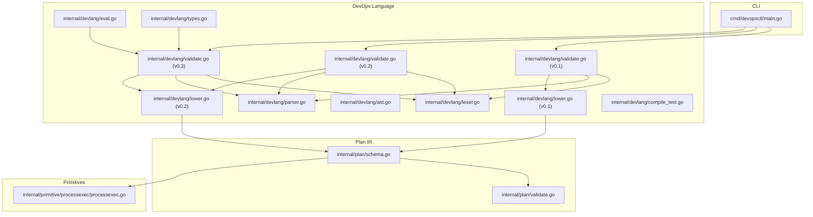

**Diagram sources**
- [main.go](file://cmd/devopsctl/main.go#L54-L63)
- [lexer.go](file://internal/devlang/lexer.go#L42-L100)
- [parser.go](file://internal/devlang/parser.go#L27-L39)
- [ast.go](file://internal/devlang/ast.go#L14-L126)
- [validate.go](file://internal/devlang/validate.go#L197-L315)
- [validate.go](file://internal/devlang/validate.go#L23-L194)
- [validate.go](file://internal/devlang/validate.go#L493-L677)
- [lower.go](file://internal/devlang/lower.go#L9-L179)
- [eval.go](file://internal/devlang/eval.go#L5-L182)
- [types.go](file://internal/devlang/types.go#L27-L184)
- [schema.go](file://internal/plan/schema.go#L11-L39)
- [validate.go](file://internal/plan/validate.go#L5-L94)
- [processexec.go](file://internal/primitive/processexec/processexec.go#L13-L82)

**Section sources**
- [main.go](file://cmd/devopsctl/main.go#L54-L63)
- [lexer.go](file://internal/devlang/lexer.go#L42-L100)
- [parser.go](file://internal/devlang/parser.go#L27-L39)
- [ast.go](file://internal/devlang/ast.go#L14-L126)
- [validate.go](file://internal/devlang/validate.go#L197-L315)
- [validate.go](file://internal/devlang/validate.go#L23-L194)
- [validate.go](file://internal/devlang/validate.go#L493-L677)
- [lower.go](file://internal/devlang/lower.go#L9-L179)
- [eval.go](file://internal/devlang/eval.go#L5-L182)
- [types.go](file://internal/devlang/types.go#L27-L184)
- [schema.go](file://internal/plan/schema.go#L11-L39)
- [validate.go](file://internal/plan/validate.go#L5-L94)
- [processexec.go](file://internal/primitive/processexec/processexec.go#L13-L82)

## Core Components
- **Lexer**: Converts raw bytes into tokens, skipping whitespace and comments, recognizing keywords, operators, strings, booleans, and identifiers.
- **Parser**: Builds hierarchical AST nodes from tokens using a recursive descent approach, enforcing grammar rules and collecting declarations.
- **AST**: Defines typed declarations and expressions (File, TargetDecl, NodeDecl, LetDecl, ForDecl, StepDecl, ModuleDecl, Ident, StringLiteral, BoolLiteral, ListLiteral).
- **Validator (v0.1)**: Enforces legacy language-level semantics (rejects unsupported constructs, validates targets/nodes uniqueness, checks primitive types and attributes).
- **Validator (v0.2)**: Enhanced validation with comprehensive let binding support, expanded construct acceptance, and improved semantic checks.
- **Validator (v0.3)**: Advanced validation with expression support, type checking, compile-time constant folding, and sophisticated semantic analysis.
- **Evaluator**: Performs compile-time expression evaluation and constant folding for v0.3 language version.
- **Type System**: Provides compile-time type inference and validation for v0.3 expressions.
- **Lowerer (v0.1)**: Translates AST into plan.Plan IR, converting expressions to JSON-compatible values and ensuring required fields.
- **Lowerer (v0.2)**: Enhanced lowering with let environment integration, expression resolution, and comprehensive value substitution.
- **Plan Schema**: Describes the JSON plan structure and validates runtime correctness.

**Section sources**
- [lexer.go](file://internal/devlang/lexer.go#L34-L100)
- [parser.go](file://internal/devlang/parser.go#L18-L98)
- [ast.go](file://internal/devlang/ast.go#L9-L126)
- [validate.go](file://internal/devlang/validate.go#L197-L315)
- [validate.go](file://internal/devlang/validate.go#L23-L194)
- [validate.go](file://internal/devlang/validate.go#L493-L677)
- [eval.go](file://internal/devlang/eval.go#L5-L182)
- [types.go](file://internal/devlang/types.go#L27-L184)
- [lower.go](file://internal/devlang/lower.go#L9-L179)
- [schema.go](file://internal/plan/schema.go#L11-L39)

## Architecture Overview
The compilation pipeline is invoked via the CLI with language version selection. It parses .devops source into an AST, validates it against v0.1, v0.2, or v0.3 rules depending on version, performs expression evaluation and constant folding for v0.3, lowers it to a plan.Plan with appropriate workflow, validates the plan IR, and optionally prints JSON. Version 0.3 introduces comprehensive expression support with type checking, compile-time evaluation, and sophisticated semantic validation.

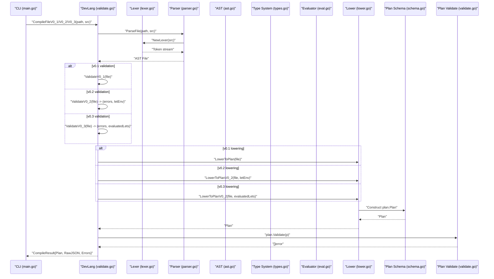

**Diagram sources**
- [main.go](file://cmd/devopsctl/main.go#L54-L63)
- [validate.go](file://internal/devlang/validate.go#L197-L315)
- [validate.go](file://internal/devlang/validate.go#L23-L194)
- [validate.go](file://internal/devlang/validate.go#L493-L677)
- [lexer.go](file://internal/devlang/lexer.go#L49-L57)
- [parser.go](file://internal/devlang/parser.go#L27-L39)
- [ast.go](file://internal/devlang/ast.go#L14-L18)
- [types.go](file://internal/devlang/types.go#L27-L184)
- [eval.go](file://internal/devlang/eval.go#L5-L182)
- [lower.go](file://internal/devlang/lower.go#L9-L179)
- [schema.go](file://internal/plan/schema.go#L11-L16)
- [validate.go](file://internal/plan/validate.go#L5-L94)

## Detailed Component Analysis

### Lexer: Source Bytes to Tokens
- **Responsibilities**:
  - Track position (line, column).
  - Skip whitespace and line comments.
  - Recognize special tokens (operators and punctuation), strings, booleans, and identifiers.
  - Keyword detection for target, node, let, module, step, for.
  - Emit EOF at end-of-file.
- **Error handling**:
  - Illegal character handling returns ILLEGAL tokens with position.
  - Unterminated strings and escapes produce ILLEGAL tokens with position.
- **Intermediate representation**:
  - Stream of Token structs with Type, Lexeme, and Position.

```mermaid
flowchart TD
Start(["Start scan"]) --> WS["Skip whitespace and comments"]
WS --> Eof{"End of input?"}
Eof --> |Yes| EmitEOF["Emit EOF token"]
Eof --> |No| Peek["Peek next rune"]
Peek --> Dispatch{"Character class"}
Dispatch --> |Braces/Brackets/Equal/Comma| EmitPunct["Emit punctuation token"]
Dispatch --> |"\""| ReadStr["Read string literal"]
Dispatch --> |Letter| ReadId["Read identifier or keyword"]
Dispatch --> |Other| EmitIllegal["Emit ILLEGAL token"]
ReadStr --> WS
ReadId --> WS
EmitPunct --> WS
EmitIllegal --> WS
```

**Diagram sources**
- [lexer.go](file://internal/devlang/lexer.go#L59-L100)
- [lexer.go](file://internal/devlang/lexer.go#L124-L154)
- [lexer.go](file://internal/devlang/lexer.go#L163-L199)
- [lexer.go](file://internal/devlang/lexer.go#L201-L238)

**Section sources**
- [lexer.go](file://internal/devlang/lexer.go#L34-L100)
- [lexer.go](file://internal/devlang/lexer.go#L124-L154)
- [lexer.go](file://internal/devlang/lexer.go#L163-L199)
- [lexer.go](file://internal/devlang/lexer.go#L201-L238)

### Parser: Tokens to AST
- **Responsibilities**:
  - Recursive descent parsing over the token stream.
  - Parse declarations: target, node, let, for, step, module.
  - Parse expressions: string, bool, ident, list literals, binary expressions, ternary expressions.
  - Enforce grammar rules and collect errors.
- **Error handling**:
  - Expected token mismatches produce ParseError with path and position.
  - Error recovery skips forward to a likely declaration start.
- **Intermediate representation**:
  - AST nodes implementing Decl and Expr interfaces.

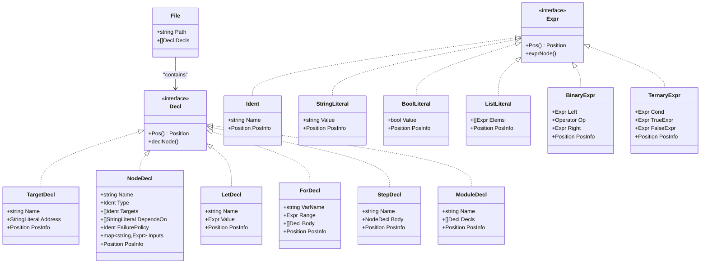

**Diagram sources**
- [ast.go](file://internal/devlang/ast.go#L14-L126)

**Section sources**
- [parser.go](file://internal/devlang/parser.go#L18-L98)
- [parser.go](file://internal/devlang/parser.go#L111-L162)
- [parser.go](file://internal/devlang/parser.go#L164-L254)
- [parser.go](file://internal/devlang/parser.go#L256-L276)
- [parser.go](file://internal/devlang/parser.go#L278-L319)
- [parser.go](file://internal/devlang/parser.go#L321-L413)
- [parser.go](file://internal/devlang/parser.go#L415-L449)
- [parser.go](file://internal/devlang/parser.go#L451-L494)
- [ast.go](file://internal/devlang/ast.go#L9-L126)

### AST: Intermediate Representation
- **Root**: File with Path and Decls.
- **Declarations**: TargetDecl, NodeDecl, LetDecl, ForDecl, StepDecl, ModuleDecl.
- **Expressions**: Ident, StringLiteral, BoolLiteral, ListLiteral, BinaryExpr, TernaryExpr.
- **Position tracking**: Every node exposes Position via Pos().

**Section sources**
- [ast.go](file://internal/devlang/ast.go#L14-L126)

### Validator (v0.1): Legacy Semantic Checks
- **Rejects unsupported constructs**: let, for, step, module declarations with SemanticError.
- **Builds symbol tables**: For targets and nodes; detects duplicates.
- **Validates node-level constraints**:
  - Targets must exist.
  - depends_on must reference existing nodes.
  - Primitive type must be one of allowed set.
  - failure_policy must be one of halt, continue, rollback.
  - Primitive-specific inputs enforced (e.g., file.sync requires src, dest; process.exec requires cmd list and cwd).
- **Returns accumulated errors**.

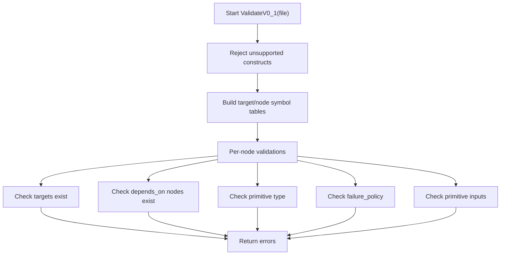

**Diagram sources**
- [validate.go](file://internal/devlang/validate.go#L197-L315)
- [validate.go](file://internal/devlang/validate.go#L317-L382)

**Section sources**
- [validate.go](file://internal/devlang/validate.go#L197-L315)
- [validate.go](file://internal/devlang/validate.go#L317-L382)

### Validator (v0.2): Enhanced Semantic Checks
- **Accepts supported constructs**: let bindings, rejects for, step, module with SemanticError.
- **Collects let bindings**: Builds comprehensive LetEnv with validation:
  - Duplicate let declarations detected.
  - Value types restricted to string, bool, or list of string literals.
  - Identifier values in let expressions are resolved to underlying literals.
- **Enhanced symbol table building**: Separate tracking for targets, nodes, and let bindings.
- **Improved node-level validations**:
  - Targets must exist and cannot reference let bindings.
  - depends_on by node IDs.
  - Primitive type validation.
  - failure_policy validation.
  - Primitive-specific inputs with let resolution.
- **Expression resolution**: resolveLetExpr function resolves identifiers to their bound values.
- **Returns accumulated errors and let environment**.

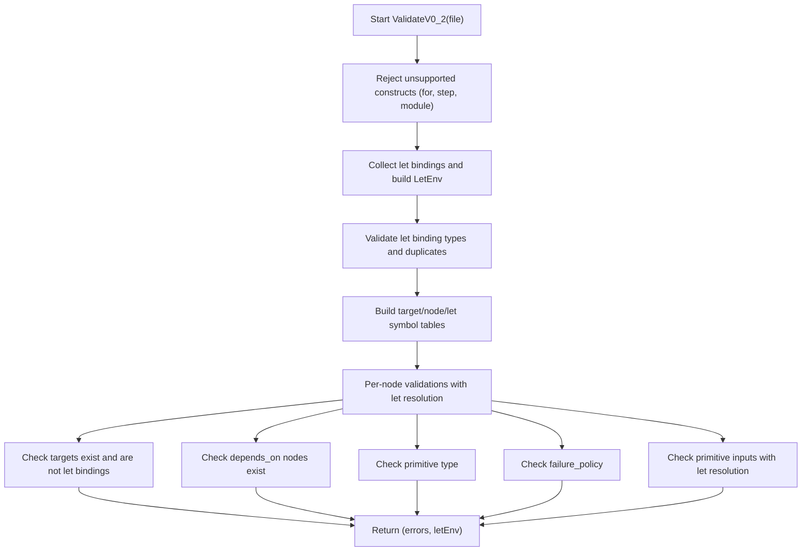

**Diagram sources**
- [validate.go](file://internal/devlang/validate.go#L23-L194)
- [validate.go](file://internal/devlang/validate.go#L396-L408)

**Section sources**
- [validate.go](file://internal/devlang/validate.go#L23-L194)
- [validate.go](file://internal/devlang/validate.go#L396-L408)

### Validator (v0.3): Advanced Semantic Checks
- **Accepts supported constructs**: let bindings with expressions, rejects for, step, module with SemanticError.
- **Three-stage validation process**:
  1. **Construct rejection**: Validates unsupported constructs and builds initial let environment.
  2. **Type checking**: Performs compile-time type inference and validation for all let expressions.
  3. **Expression evaluation**: Evaluates expressions to literals using constant folding.
- **Advanced type system**: Supports string, bool, and string[] types with comprehensive type checking.
- **Expression evaluation**: Handles string concatenation (+), boolean logic (&&, ||), equality comparisons (==, !=), and ternary expressions.
- **Sophisticated error handling**: Provides detailed type mismatch and evaluation errors with precise positioning.
- **Enhanced symbol table building**: Tracks targets, nodes, and evaluated let bindings.
- **Returns accumulated errors and evaluated let environment**.

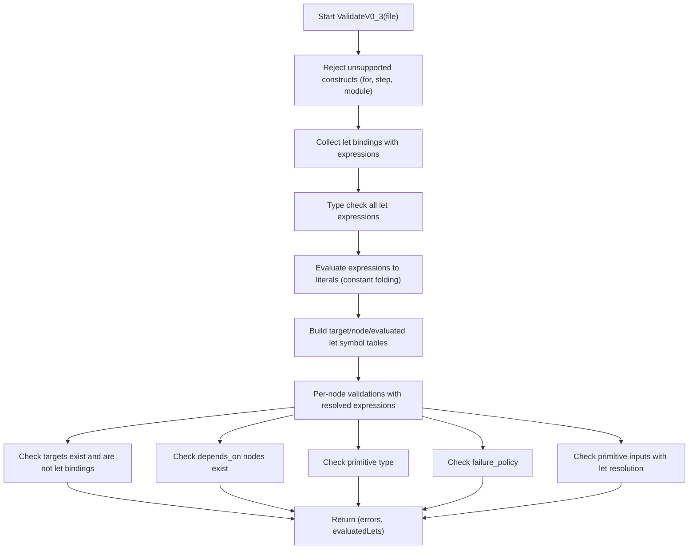

**Diagram sources**
- [validate.go](file://internal/devlang/validate.go#L493-L677)
- [types.go](file://internal/devlang/types.go#L27-L184)
- [eval.go](file://internal/devlang/eval.go#L5-L182)

**Section sources**
- [validate.go](file://internal/devlang/validate.go#L493-L677)
- [types.go](file://internal/devlang/types.go#L27-L184)
- [eval.go](file://internal/devlang/eval.go#L5-L182)

### Evaluator: Compile-Time Expression Evaluation
- **Responsibilities**:
  - Evaluates expressions to compile-time literals using constant folding.
  - Handles string concatenation, boolean logic, equality comparisons, and ternary expressions.
  - Recursively resolves let bindings and nested expressions.
- **Supported operations**:
  - String concatenation (+) between string literals.
  - Logical AND (&&) and OR (||) between boolean literals.
  - Equality (==) and inequality (!=) comparisons between compatible types.
  - Ternary conditional expressions with boolean condition.
- **Error handling**: Provides detailed semantic errors for type mismatches and unresolved identifiers.
- **Intermediate representation**: Returns literal expressions (StringLiteral, BoolLiteral, ListLiteral).

**Section sources**
- [eval.go](file://internal/devlang/eval.go#L5-L182)

### Type System: Compile-Time Type Checking
- **Types**: string, bool, string[] with comprehensive type inference.
- **Type checking rules**:
  - String literals: TypeString
  - Boolean literals: TypeBool
  - List literals: TypeStringList (empty or all string elements)
  - Binary expressions: TypeString for concatenation, TypeBool for logical ops, TypeBool for comparisons
  - Ternary expressions: Requires both branches to have same type
- **Error handling**: Detailed type mismatch errors with operator and operand types.
- **Validation constraints**: List comparison not supported, unresolved identifiers reported with precise positioning.

**Section sources**
- [types.go](file://internal/devlang/types.go#L27-L184)

### Lowerer (v0.1): AST to JSON Plan IR
- **Converts File into plan.Plan**: With Version, Targets, Nodes.
- **For each TargetDecl**: Ensures address is present; copies ID and Address.
- **For each NodeDecl**:
  - Copies ID, Type, Targets, DependsOn, FailurePolicy.
  - Lowers Inputs by converting expressions:
    - StringLiteral -> string
    - BoolLiteral -> bool
    - ListLiteral -> []string (only string elements supported in v0.1)
    - Ident -> error (not supported as a value).
- **Emits errors for unsupported expressions during lowering**.

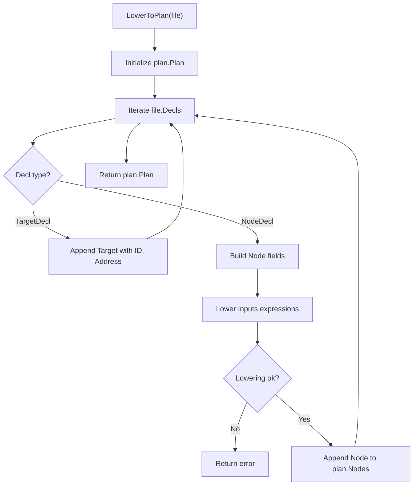

**Diagram sources**
- [lower.go](file://internal/devlang/lower.go#L9-L65)
- [lower.go](file://internal/devlang/lower.go#L67-L90)

**Section sources**
- [lower.go](file://internal/devlang/lower.go#L9-L91)

### Lowerer (v0.2): Enhanced AST to JSON Plan IR
- **Converts File into plan.Plan**: With Version, Targets, Nodes and let environment integration.
- **For each TargetDecl**: Ensures address is present; copies ID and Address.
- **For each NodeDecl**:
  - Copies ID, Type, Targets, DependsOn, FailurePolicy.
  - Lowers Inputs by converting expressions with let resolution:
    - StringLiteral -> string
    - BoolLiteral -> bool
    - ListLiteral -> []string (only string elements supported)
    - Ident -> resolved value from LetEnv (if available).
- **Enhanced expression resolution**: lowerExprV0_2 uses LetEnv for identifier substitution.
- **Emits errors for unresolved identifiers during lowering**.

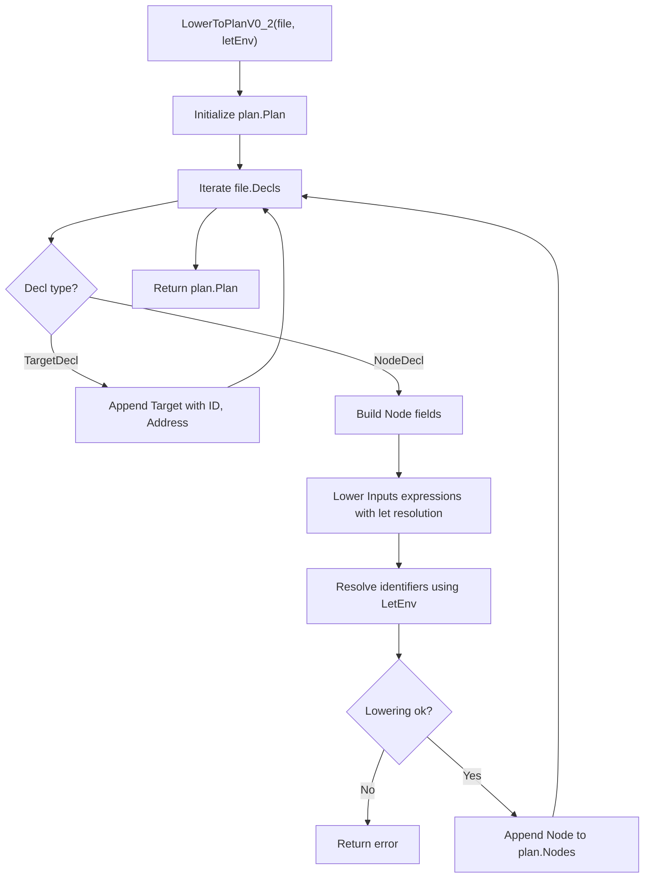

**Diagram sources**
- [lower.go](file://internal/devlang/lower.go#L92-L148)
- [lower.go](file://internal/devlang/lower.go#L150-L179)

**Section sources**
- [lower.go](file://internal/devlang/lower.go#L92-L179)

### Plan Schema and Validation
- **Plan**: Top-level JSON with version, targets, nodes.
- **Node**: id, type, targets, optional depends_on, optional when, optional failure_policy, inputs map.
- **IR validation checks**:
  - Presence of version, non-empty targets and nodes.
  - Non-empty id/address for targets.
  - Non-empty id/type/targets for nodes.
  - References to existing targets and nodes.
  - Allowed failure_policy values.
  - Primitive-specific field requirements.

**Section sources**
- [schema.go](file://internal/plan/schema.go#L11-L39)
- [validate.go](file://internal/plan/validate.go#L5-L94)

## Language Version Support

### Version 0.1 (Legacy)
- **Supported constructs**: target, node, file.sync, process.exec primitives.
- **Unsupported constructs**: let, for, step, module declarations.
- **Let bindings**: Not supported; attempting to use produces SemanticError.
- **Lowering workflow**: Direct expression-to-value conversion without let resolution.
- **CLI integration**: Default language version for backward compatibility.

### Version 0.2 (Enhanced)
- **Supported constructs**: target, node, let, file.sync, process.exec primitives.
- **Unsupported constructs**: for, step, module declarations.
- **Let bindings**: Fully supported with comprehensive validation and resolution.
- **Enhanced lowering workflow**: Let environment integration with expression resolution.
- **CLI integration**: New default language version with explicit version selection.

### Version 0.3 (Advanced)
- **Supported constructs**: target, node, let with expressions, file.sync, process.exec primitives.
- **Unsupported constructs**: for, step, module declarations.
- **Expression support**: Comprehensive expression evaluation with constant folding.
- **Type checking**: Compile-time type inference and validation for all expressions.
- **Advanced features**: String concatenation, boolean logic, equality comparisons, ternary expressions.
- **Enhanced validation**: Three-stage validation process with type checking and evaluation.
- **CLI integration**: Default language version with sophisticated evaluation engine.

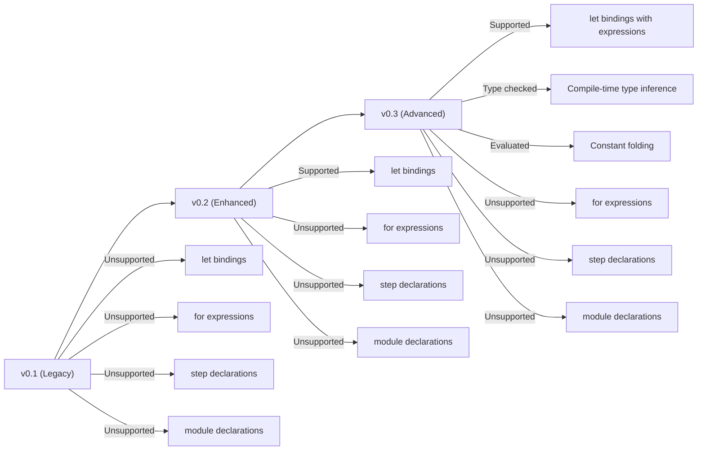

**Diagram sources**
- [validate.go](file://internal/devlang/validate.go#L197-L315)
- [validate.go](file://internal/devlang/validate.go#L23-L194)
- [validate.go](file://internal/devlang/validate.go#L493-L677)

**Section sources**
- [validate.go](file://internal/devlang/validate.go#L197-L315)
- [validate.go](file://internal/devlang/validate.go#L23-L194)
- [validate.go](file://internal/devlang/validate.go#L493-L677)

## Dependency Analysis
- **CLI depends on devlang.CompileFileV0_1/V0_2/V0_3**: Compiles .devops to plan with language version selection.
- **devlang.CompileFileV0_1/V0_2/V0_3**: Orchestrates lexer, parser, validator, evaluator, type checker, lowerer, and plan validation.
- **Lowerer depends on plan schema types**: Both v0.1 and v0.2 lowerers depend on plan schema.
- **Evaluator and Type System**: Used exclusively by v0.3 validation workflow.
- **Primitives consume plan nodes**: For execution regardless of language version.
- **Enhanced dependencies**: v0.2 introduces LetEnv management and expression resolution; v0.3 adds type checking and expression evaluation.

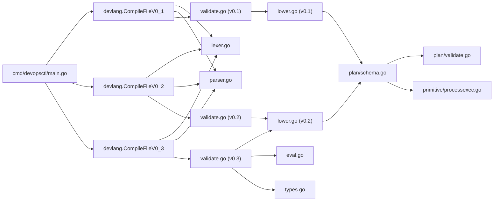

**Diagram sources**
- [main.go](file://cmd/devopsctl/main.go#L54-L63)
- [validate.go](file://internal/devlang/validate.go#L455-L491)
- [validate.go](file://internal/devlang/validate.go#L679-L717)
- [lexer.go](file://internal/devlang/lexer.go#L49-L57)
- [parser.go](file://internal/devlang/parser.go#L27-L39)
- [lower.go](file://internal/devlang/lower.go#L9-L179)
- [eval.go](file://internal/devlang/eval.go#L5-L182)
- [types.go](file://internal/devlang/types.go#L27-L184)
- [schema.go](file://internal/plan/schema.go#L11-L39)
- [validate.go](file://internal/plan/validate.go#L5-L94)
- [processexec.go](file://internal/primitive/processexec/processexec.go#L13-L82)

**Section sources**
- [main.go](file://cmd/devopsctl/main.go#L54-L63)
- [validate.go](file://internal/devlang/validate.go#L455-L491)
- [validate.go](file://internal/devlang/validate.go#L679-L717)
- [lexer.go](file://internal/devlang/lexer.go#L49-L57)
- [parser.go](file://internal/devlang/parser.go#L27-L39)
- [lower.go](file://internal/devlang/lower.go#L9-L179)
- [eval.go](file://internal/devlang/eval.go#L5-L182)
- [types.go](file://internal/devlang/types.go#L27-L184)
- [schema.go](file://internal/plan/schema.go#L11-L39)
- [validate.go](file://internal/plan/validate.go#L5-L94)
- [processexec.go](file://internal/primitive/processexec/processexec.go#L13-L82)

## Performance Considerations
- **Lexer and Parser**: Linear in input size; memory usage proportional to source length and AST depth.
- **Lowering**: O(N) over AST nodes and expressions; list lowering is O(E) per list.
- **v0.2 enhancements**: Additional O(L) for let environment processing where L is number of let bindings.
- **v0.3 enhancements**: Additional O(L) for type checking and expression evaluation where L is number of let bindings.
- **Expression evaluation**: O(E) for each expression with recursive evaluation and identifier resolution.
- **Type checking**: O(E) for each expression with type inference and validation.
- **Plan validation**: O(T + N + E) over targets, nodes, and edges (references).
- **Recommendations**:
  - Keep .devops files modular to limit AST depth.
  - Prefer compact list literals and avoid unnecessary expressions.
  - Use let bindings judiciously to improve maintainability.
  - Leverage constant folding in v0.3 for performance-critical expressions.
  - Validate early to fail fast and reduce downstream work.

## Troubleshooting Guide
### Common Issues and Resolutions
- **Unsupported constructs in v0.1**:
  - let, for, step, module declarations are rejected. Remove or refactor to supported forms.
- **Unsupported constructs in v0.2 and v0.3**:
  - for, step, module declarations are rejected. Use supported constructs or downgrade to v0.1.
- **Duplicate declarations**:
  - Duplicate target, node, or let names cause SemanticError. Rename to be unique.
- **Unknown references**:
  - Using undefined target, node, or let binding triggers SemanticError. Define missing declarations.
- **Let binding validation**:
  - Invalid let value types (non-literal expressions) cause SemanticError.
  - Let bindings cannot be used in targets; use target declarations instead.
- **Type checking errors in v0.3**:
  - Type mismatches in binary operations (e.g., string + bool) cause SemanticError.
  - Unsupported operations like list comparison trigger type errors.
  - Ternary expressions must have matching branch types.
- **Expression evaluation errors in v0.3**:
  - Unresolved identifiers in expressions cause SemanticError.
  - Invalid operator usage in expressions triggers evaluation errors.
- **Primitive input requirements**:
  - file.sync requires src and dest as string literals.
  - process.exec requires cmd as non-empty list of string literals and cwd as string literal.
- **Failure policy**:
  - failure_policy must be one of halt, continue, rollback.
- **Lowering errors**:
  - Identifiers cannot be lowered as values in v0.1; ensure expressions resolve to literals.
  - Unresolved identifiers in v0.2/v0.3 cause lowering errors.

**Section sources**
- [validate.go](file://internal/devlang/validate.go#L25-L53)
- [validate.go](file://internal/devlang/validate.go#L63-L86)
- [validate.go](file://internal/devlang/validate.go#L88-L137)
- [validate.go](file://internal/devlang/validate.go#L142-L207)
- [validate.go](file://internal/devlang/validate.go#L305-L319)
- [validate.go](file://internal/devlang/validate.go#L321-L366)
- [validate.go](file://internal/devlang/validate.go#L493-L677)
- [types.go](file://internal/devlang/types.go#L86-L142)
- [eval.go](file://internal/devlang/eval.go#L60-L149)
- [lower.go](file://internal/devlang/lower.go#L67-L90)
- [lower.go](file://internal/devlang/lower.go#L150-L179)

## Conclusion
The .devops compilation pipeline transforms human-readable source into structured JSON plans through four stages: lexical analysis, parsing, AST construction, and lowering. The enhanced pipeline now supports three language versions with progressively sophisticated capabilities: v0.1 provides basic constructs, v0.2 introduces let bindings with resolution, and v0.3 delivers comprehensive expression support with type checking, compile-time evaluation, and constant folding. The v0.3 pipeline represents a major advancement with its three-stage validation process, advanced type system, and powerful expression evaluation engine. Robust error reporting and validation ensure the resulting plan is executable and consistent across all language versions. The provided examples illustrate how high-level constructs map to concrete plan nodes and inputs, demonstrating the evolution from simple literals to complex evaluated expressions.

## Appendices

### Example: Evolution of a .devops Source Through the Pipeline
#### v0.1 Workflow
- **Source**: A .devops file defines a target and two nodes (file.sync and process.exec).
- **Lexer**: Produces tokens for keywords, identifiers, strings, operators, and punctuation.
- **Parser**: Builds AST nodes representing target and node declarations with typed inputs.
- **Validator**: Enforces v0.1 rules, checking duplicates, references, and primitive inputs.
- **Lowerer**: Converts AST to plan.Plan, mapping declarations to targets and nodes, and expressions to JSON-compatible values.
- **Plan JSON**: Final output suitable for execution and reconciliation.

#### v0.2 Workflow with Let Bindings
- **Source**: A .devops file with let bindings defining reusable values.
- **Lexer**: Same tokenization process as v0.1.
- **Parser**: Builds AST with LetDecl nodes alongside standard declarations.
- **Validator**: Validates let bindings, ensures type safety, and prevents misuse in targets.
- **Lowerer**: Processes let environment, resolves expressions, and generates final plan.
- **Plan JSON**: Contains resolved values ready for execution.

#### v0.3 Workflow with Expression Evaluation
- **Source**: A .devops file with let bindings containing expressions (string concatenation, boolean logic, ternary expressions).
- **Lexer**: Same tokenization process as previous versions.
- **Parser**: Builds AST with LetDecl nodes containing complex expressions.
- **Validator**: Performs three-stage validation: construct rejection, type checking, and expression evaluation.
- **Evaluator**: Performs compile-time constant folding, evaluating expressions to literals.
- **Lowerer**: Processes evaluated let environment and generates final plan with resolved values.
- **Plan JSON**: Contains fully evaluated constants ready for optimal execution performance.

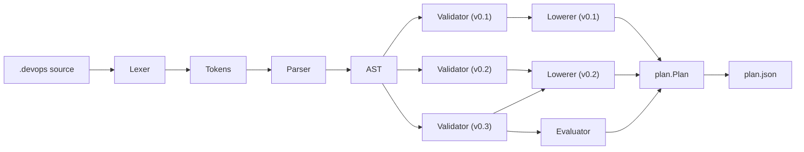

**Diagram sources**
- [plan.devops](file://plan.devops#L1-L20)
- [lexer.go](file://internal/devlang/lexer.go#L59-L100)
- [parser.go](file://internal/devlang/parser.go#L27-L39)
- [ast.go](file://internal/devlang/ast.go#L14-L126)
- [validate.go](file://internal/devlang/validate.go#L197-L315)
- [validate.go](file://internal/devlang/validate.go#L23-L194)
- [validate.go](file://internal/devlang/validate.go#L493-L677)
- [eval.go](file://internal/devlang/eval.go#L5-L182)
- [lower.go](file://internal/devlang/lower.go#L9-L179)
- [schema.go](file://internal/plan/schema.go#L11-L39)
- [plan.json](file://plan.json#L1-L25)

**Section sources**
- [plan.devops](file://plan.devops#L1-L20)
- [plan.json](file://plan.json#L1-L25)
- [compile_test.go](file://internal/devlang/compile_test.go#L211-L257)
- [compile_test.go](file://internal/devlang/compile_test.go#L259-L303)
- [comprehensive.devops](file://tests/v0_3/valid/comprehensive.devops#L1-L46)
- [logical.devops](file://tests/v0_3/valid/logical.devops#L1-L16)
- [ternary.devops](file://tests/v0_3/valid/ternary.devops#L1-L17)
- [type_mismatch.devops](file://tests/v0_3/invalid/type_mismatch.devops#L1-L13)
- [unresolved_var.devops](file://tests/v0_3/invalid/unresolved_var.devops#L1-L13)