# Compilation Pipeline

<cite>
**Referenced Files in This Document**
- [main.go](file://cmd/devopsctl/main.go)
- [lexer.go](file://internal/devlang/lexer.go)
- [parser.go](file://internal/devlang/parser.go)
- [ast.go](file://internal/devlang/ast.go)
- [validate.go](file://internal/devlang/validate.go)
- [lower.go](file://internal/devlang/lower.go)
- [eval.go](file://internal/devlang/eval.go)
- [types.go](file://internal/devlang/types.go)
- [schema.go](file://internal/plan/schema.go)
- [validate.go](file://internal/plan/validate.go)
- [processexec.go](file://internal/primitive/processexec/processexec.go)
- [compile_test.go](file://internal/devlang/compile_test.go)
- [comprehensive.devops](file://tests/v0_3/valid/comprehensive.devops)
- [logical.devops](file://tests/v0_3/valid/logical.devops)
- [ternary.devops](file://tests/v0_3/valid/ternary.devops)
- [type_mismatch.devops](file://tests/v0_3/invalid/type_mismatch.devops)
- [unresolved_var.devops](file://tests/v0_3/invalid/unresolved_var.devops)
- [step_basic.devops](file://tests/v0_4/valid/step_basic.devops)
- [step_comprehensive.devops](file://tests/v0_4/valid/step_comprehensive.devops)
- [step_duplicate.devops](file://tests/v0_4/invalid/step_duplicate.devops)
- [step_undefined.devops](file://tests/v0_4/invalid/step_undefined.devops)
- [step_unknown_primitive.devops](file://tests/v0_4/invalid/step_unknown_primitive.devops)
- [comprehensive.devops](file://tests/v0_5/valid/comprehensive.devops)
- [for_basic.devops](file://tests/v0_5/valid/for_basic.devops)
- [for_with_lets.devops](file://tests/v0_5/valid/for_with_lets.devops)
- [for_multiple_loops.devops](file://tests/v0_5/valid/for_multiple_loops.devops)
- [nested_step_basic.devops](file://tests/v0_5/valid/nested_step_basic.devops)
- [nested_step_cycle_direct.devops](file://tests/v0_5/invalid/nested_step_cycle_direct.devops)
- [for_non_list_range.devops](file://tests/v0_5/invalid/for_non_list_range.devops)
- [param_basic.devops](file://tests/v0_6/valid/param_basic.devops)
- [param_required.devops](file://tests/v0_6/valid/param_required.devops)
- [param_duplicate.devops](file://tests/v0_6/invalid/param_duplicate.devops)
- [param_missing_required.devops](file://tests/v0_6/invalid/param_missing_required.devops)
- [param_manual_expansion.devops](file://tests/v0_6/hash_stability/param_manual_expansion.devops)
- [param_with_default.devops](file://tests/v0_6/hash_stability/param_with_default.devops)
- [plan.devops](file://plan.devops)
- [plan.json](file://plan.json)
</cite>

## Update Summary
**Changes Made**
- Added comprehensive v0.6 compilation stages with step parameters support
- Introduced new LowerToPlanV0_6 function for parameterized step expansion with parameter validation and substitution
- Enhanced validation pipeline with six-stage processing: construct rejection, type checking, parameter validation, step validation, cycle detection, and for-loop validation
- Added support for step parameters with required/optional defaults, parameter substitution during expansion, and parameter conflict detection
- Updated CLI integration with v0.6 support and new compilation workflow
- Added extensive test coverage for parameter features, nested steps, and error conditions

## Table of Contents
1. [Introduction](#introduction)
2. [Project Structure](#project-structure)
3. [Core Components](#core-components)
4. [Architecture Overview](#architecture-overview)
5. [Detailed Component Analysis](#detailed-component-analysis)
6. [Language Version Support](#language-version-support)
7. [Dependency Analysis](#dependency-analysis)
8. [Performance Considerations](#performance-considerations)
9. [Troubleshooting Guide](#troubleshooting-guide)
10. [Conclusion](#conclusion)
11. [Appendices](#appendices)

## Introduction
This document explains the .devops language compilation pipeline in six phases: lexical analysis (lexer), parsing (parser), abstract syntax tree construction (AST), validation with enhanced semantic analysis, parameter processing, and lowering to JSON plan format. The pipeline now supports six language versions: v0.1 (legacy), v0.2 (enhanced), v0.3 (advanced), v0.4 (reusable steps), v0.5 (comprehensive), and v0.6 (parameterized steps). Version 0.6 introduces comprehensive step parameter support with required/optional parameters, default value evaluation, parameter substitution during expansion, and enhanced validation logic. It describes how source bytes are transformed into executable JSON plans, intermediate representations at each stage, error handling strategies, and the transformation rules from language constructs to plan nodes. Examples demonstrate how high-level constructs evolve into low-level execution instructions across all six language versions.

## Project Structure
The compilation pipeline lives under internal/devlang and integrates with the plan schema in internal/plan. The CLI in cmd/devopsctl invokes the compiler and orchestrates plan validation and execution. The enhanced pipeline now supports v0.1, v0.2, v0.3, v0.4, v0.5, and v0.6 language versions with progressively sophisticated semantic analysis capabilities, each with distinct validation and lowering workflows including parameter processing.

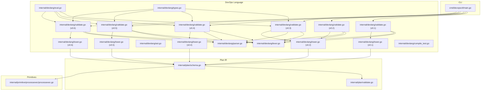

**Diagram sources**
- [main.go](file://cmd/devopsctl/main.go#L54-L63)
- [lexer.go](file://internal/devlang/lexer.go#L42-L100)
- [parser.go](file://internal/devlang/parser.go#L27-L39)
- [ast.go](file://internal/devlang/ast.go#L14-L167)
- [validate.go](file://internal/devlang/validate.go#L197-L315)
- [validate.go](file://internal/devlang/validate.go#L23-L194)
- [validate.go](file://internal/devlang/validate.go#L493-L677)
- [validate.go](file://internal/devlang/validate.go#L717-L1050)
- [validate.go](file://internal/devlang/validate.go#L1052-L1558)
- [validate.go](file://internal/devlang/validate.go#L1560-L1972)
- [lower.go](file://internal/devlang/lower.go#L9-L179)
- [lower.go](file://internal/devlang/lower.go#L180-L283)
- [lower.go](file://internal/devlang/lower.go#L284-L392)
- [lower.go](file://internal/devlang/lower.go#L599-L707)
- [lower.go](file://internal/devlang/lower.go#L709-L831)
- [eval.go](file://internal/devlang/eval.go#L5-L182)
- [types.go](file://internal/devlang/types.go#L27-L184)
- [schema.go](file://internal/plan/schema.go#L11-L39)
- [validate.go](file://internal/plan/validate.go#L5-L94)
- [processexec.go](file://internal/primitive/processexec/processexec.go#L13-L82)

**Section sources**
- [main.go](file://cmd/devopsctl/main.go#L54-L63)
- [lexer.go](file://internal/devlang/lexer.go#L42-L100)
- [parser.go](file://internal/devlang/parser.go#L27-L39)
- [ast.go](file://internal/devlang/ast.go#L14-L167)
- [validate.go](file://internal/devlang/validate.go#L197-L315)
- [validate.go](file://internal/devlang/validate.go#L23-L194)
- [validate.go](file://internal/devlang/validate.go#L493-L677)
- [validate.go](file://internal/devlang/validate.go#L717-L1050)
- [validate.go](file://internal/devlang/validate.go#L1052-L1558)
- [validate.go](file://internal/devlang/validate.go#L1560-L1972)
- [lower.go](file://internal/devlang/lower.go#L9-L179)
- [lower.go](file://internal/devlang/lower.go#L180-L283)
- [lower.go](file://internal/devlang/lower.go#L284-L392)
- [lower.go](file://internal/devlang/lower.go#L599-L707)
- [lower.go](file://internal/devlang/lower.go#L709-L831)
- [eval.go](file://internal/devlang/eval.go#L5-L182)
- [types.go](file://internal/devlang/types.go#L27-L184)
- [schema.go](file://internal/plan/schema.go#L11-L39)
- [validate.go](file://internal/plan/validate.go#L5-L94)
- [processexec.go](file://internal/primitive/processexec/processexec.go#L13-L82)

## Core Components
- **Lexer**: Converts raw bytes into tokens, skipping whitespace and comments, recognizing keywords, operators, strings, booleans, and identifiers.
- **Parser**: Builds hierarchical AST nodes from tokens using a recursive descent approach, enforcing grammar rules and collecting declarations.
- **AST**: Defines typed declarations and expressions (File, TargetDecl, NodeDecl, LetDecl, ForDecl, StepDecl, ModuleDecl, ParamDecl, Ident, StringLiteral, BoolLiteral, ListLiteral).
- **Validator (v0.1)**: Enforces legacy language-level semantics (rejects unsupported constructs, validates targets/nodes uniqueness, checks primitive types and attributes).
- **Validator (v0.2)**: Enhanced validation with comprehensive let binding support, expanded construct acceptance, and improved semantic checks.
- **Validator (v0.3)**: Advanced validation with expression support, type checking, compile-time constant folding, and sophisticated semantic analysis.
- **Validator (v0.4)**: Comprehensive validation with step support, step expansion, enhanced validation rules, and sophisticated semantic analysis.
- **Validator (v0.5)**: Advanced validation with for-loop support, nested step dependencies, cycle detection, and comprehensive semantic analysis.
- **Validator (v0.6)**: Comprehensive validation with step parameters support, parameter validation, parameter substitution, and enhanced semantic analysis.
- **Evaluator**: Performs compile-time expression evaluation and constant folding for v0.3, v0.4, v0.5, and v0.6 language versions.
- **Type System**: Provides compile-time type inference and validation for v0.3, v0.4, v0.5, and v0.6 expressions.
- **Lowerer (v0.1)**: Translates AST into plan.Plan IR, converting expressions to JSON-compatible values and ensuring required fields.
- **Lowerer (v0.2)**: Enhanced lowering with let environment integration, expression resolution, and comprehensive value substitution.
- **Lowerer (v0.4)**: Advanced lowering with step expansion, macro-style transformation, and comprehensive value substitution.
- **Lowerer (v0.5)**: Comprehensive lowering with step expansion, for-loop unrolling, compile-time processing, and enhanced validation.
- **Lowerer (v0.6)**: Advanced parameterized lowering with step parameter validation, parameter substitution, and comprehensive value processing.
- **Plan Schema**: Describes the JSON plan structure and validates runtime correctness.

**Section sources**
- [lexer.go](file://internal/devlang/lexer.go#L34-L100)
- [parser.go](file://internal/devlang/parser.go#L18-L98)
- [ast.go](file://internal/devlang/ast.go#L9-L167)
- [validate.go](file://internal/devlang/validate.go#L197-L315)
- [validate.go](file://internal/devlang/validate.go#L23-L194)
- [validate.go](file://internal/devlang/validate.go#L493-L677)
- [validate.go](file://internal/devlang/validate.go#L717-L1050)
- [validate.go](file://internal/devlang/validate.go#L1052-L1558)
- [validate.go](file://internal/devlang/validate.go#L1560-L1972)
- [eval.go](file://internal/devlang/eval.go#L5-L182)
- [types.go](file://internal/devlang/types.go#L27-L184)
- [lower.go](file://internal/devlang/lower.go#L9-L179)
- [lower.go](file://internal/devlang/lower.go#L180-L283)
- [lower.go](file://internal/devlang/lower.go#L284-L392)
- [lower.go](file://internal/devlang/lower.go#L599-L707)
- [lower.go](file://internal/devlang/lower.go#L709-L831)
- [schema.go](file://internal/plan/schema.go#L11-L39)

## Architecture Overview
The compilation pipeline is invoked via the CLI with language version selection. It parses .devops source into an AST, validates it against v0.1, v0.2, v0.3, v0.4, v0.5, or v0.6 rules depending on version, performs expression evaluation and constant folding for v0.3, v0.4, v0.5, and v0.6, expands steps to regular nodes for v0.4, v0.5, and v0.6, validates step parameters and substitutions for v0.6, unrolls for-loops to generate multiple nodes for v0.5 and v0.6, lowers it to a plan.Plan with appropriate workflow, validates the plan IR, and optionally prints JSON. Version 0.6 introduces comprehensive step parameter support with parameter validation, parameter substitution during expansion, and enhanced validation.

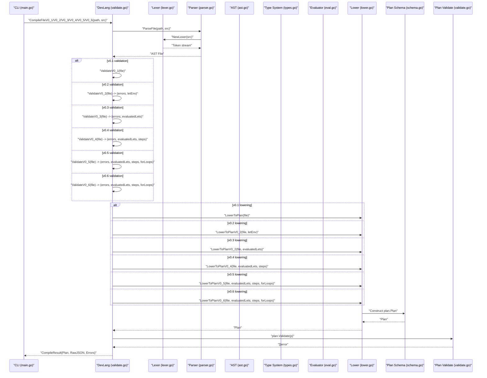

**Diagram sources**
- [main.go](file://cmd/devopsctl/main.go#L54-L63)
- [validate.go](file://internal/devlang/validate.go#L197-L315)
- [validate.go](file://internal/devlang/validate.go#L23-L194)
- [validate.go](file://internal/devlang/validate.go#L493-L677)
- [validate.go](file://internal/devlang/validate.go#L717-L1050)
- [validate.go](file://internal/devlang/validate.go#L1052-L1558)
- [validate.go](file://internal/devlang/validate.go#L1560-L1972)
- [lexer.go](file://internal/devlang/lexer.go#L49-L57)
- [parser.go](file://internal/devlang/parser.go#L27-L39)
- [ast.go](file://internal/devlang/ast.go#L14-L18)
- [types.go](file://internal/devlang/types.go#L27-L184)
- [eval.go](file://internal/devlang/eval.go#L5-L182)
- [lower.go](file://internal/devlang/lower.go#L9-L179)
- [lower.go](file://internal/devlang/lower.go#L180-L283)
- [lower.go](file://internal/devlang/lower.go#L284-L392)
- [lower.go](file://internal/devlang/lower.go#L599-L707)
- [lower.go](file://internal/devlang/lower.go#L709-L831)
- [schema.go](file://internal/plan/schema.go#L11-L16)
- [validate.go](file://internal/plan/validate.go#L5-L94)

## Detailed Component Analysis

### Lexer: Source Bytes to Tokens
- **Responsibilities**:
  - Track position (line, column).
  - Skip whitespace and line comments.
  - Recognize special tokens (operators and punctuation), strings, booleans, and identifiers.
  - Keyword detection for target, node, let, module, step, for, param.
  - Emit EOF at end-of-file.
- **Error handling**:
  - Illegal character handling returns ILLEGAL tokens with position.
  - Unterminated strings and escapes produce ILLEGAL tokens with position.
- **Intermediate representation**:
  - Stream of Token structs with Type, Lexeme, and Position.

```mermaid
flowchart TD
Start(["Start scan"]) --> WS["Skip whitespace and comments"]
WS --> Eof{"End of input?"}
Eof --> |Yes| EmitEOF["Emit EOF token"]
Eof --> |No| Peek["Peek next rune"]
Peek --> Dispatch{"Character class"}
Dispatch --> |Braces/Brackets/Equal/Comma| EmitPunct["Emit punctuation token"]
Dispatch --> |"\""| ReadStr["Read string literal"]
Dispatch --> |Letter| ReadId["Read identifier or keyword"]
Dispatch --> |Other| EmitIllegal["Emit ILLEGAL token"]
ReadStr --> WS
ReadId --> WS
EmitPunct --> WS
EmitIllegal --> WS
```

**Diagram sources**
- [lexer.go](file://internal/devlang/lexer.go#L59-L100)
- [lexer.go](file://internal/devlang/lexer.go#L124-L154)
- [lexer.go](file://internal/devlang/lexer.go#L163-L199)
- [lexer.go](file://internal/devlang/lexer.go#L201-L238)

**Section sources**
- [lexer.go](file://internal/devlang/lexer.go#L34-L100)
- [lexer.go](file://internal/devlang/lexer.go#L124-L154)
- [lexer.go](file://internal/devlang/lexer.go#L163-L199)
- [lexer.go](file://internal/devlang/lexer.go#L201-L238)

### Parser: Tokens to AST
- **Responsibilities**:
  - Recursive descent parsing over the token stream.
  - Parse declarations: target, node, let, for, step, module.
  - Parse step parameters with required and optional parameters.
  - Parse expressions: string, bool, ident, list literals, binary expressions, ternary expressions.
  - Enforce grammar rules and collect errors.
- **Error handling**:
  - Expected token mismatches produce ParseError with path and position.
  - Error recovery skips forward to a likely declaration start.
- **Intermediate representation**:
  - AST nodes implementing Decl and Expr interfaces.

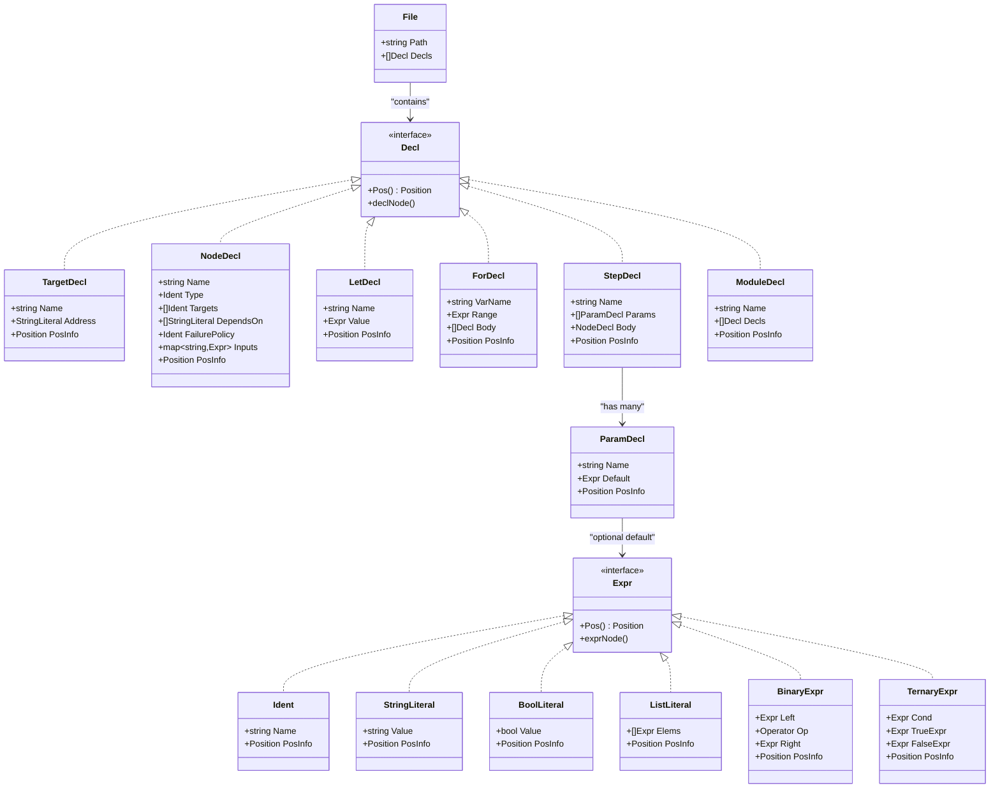

**Diagram sources**
- [ast.go](file://internal/devlang/ast.go#L14-L167)

**Section sources**
- [parser.go](file://internal/devlang/parser.go#L18-L98)
- [parser.go](file://internal/devlang/parser.go#L111-L162)
- [parser.go](file://internal/devlang/parser.go#L164-L254)
- [parser.go](file://internal/devlang/parser.go#L256-L276)
- [parser.go](file://internal/devlang/parser.go#L278-L319)
- [parser.go](file://internal/devlang/parser.go#L321-L413)
- [parser.go](file://internal/devlang/parser.go#L415-L449)
- [parser.go](file://internal/devlang/parser.go#L451-L494)
- [ast.go](file://internal/devlang/ast.go#L9-L167)

### AST: Intermediate Representation
- **Root**: File with Path and Decls.
- **Declarations**: TargetDecl, NodeDecl, LetDecl, ForDecl, StepDecl, ModuleDecl.
- **Step Parameters**: ParamDecl with Name and optional Default expression.
- **Expressions**: Ident, StringLiteral, BoolLiteral, ListLiteral, BinaryExpr, TernaryExpr.
- **Position tracking**: Every node exposes Position via Pos().

**Section sources**
- [ast.go](file://internal/devlang/ast.go#L14-L167)

### Validator (v0.1): Legacy Semantic Checks
- **Rejects unsupported constructs**: let, for, step, module declarations with SemanticError.
- **Builds symbol tables**: For targets and nodes; detects duplicates.
- **Validates node-level constraints**:
  - Targets must exist.
  - depends_on must reference existing nodes.
  - Primitive type must be one of allowed set.
  - failure_policy must be one of halt, continue, rollback.
  - Primitive-specific inputs enforced (e.g., file.sync requires src, dest; process.exec requires cmd list and cwd).
- **Returns accumulated errors**.

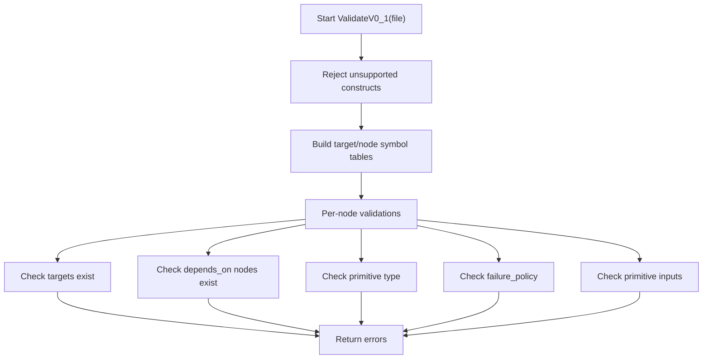

**Diagram sources**
- [validate.go](file://internal/devlang/validate.go#L197-L315)
- [validate.go](file://internal/devlang/validate.go#L317-L382)

**Section sources**
- [validate.go](file://internal/devlang/validate.go#L197-L315)
- [validate.go](file://internal/devlang/validate.go#L317-L382)

### Validator (v0.2): Enhanced Semantic Checks
- **Accepts supported constructs**: let bindings, rejects for, step, module with SemanticError.
- **Collects let bindings**: Builds comprehensive LetEnv with validation:
  - Duplicate let declarations detected.
  - Value types restricted to string, bool, or list of string literals.
  - Identifier values in let expressions are resolved to underlying literals.
- **Enhanced symbol table building**: Separate tracking for targets, nodes, and let bindings.
- **Improved node-level validations**:
  - Targets must exist and cannot reference let bindings.
  - depends_on by node IDs.
  - Primitive type validation.
  - failure_policy validation.
  - Primitive-specific inputs with let resolution.
- **Expression resolution**: resolveLetExpr function resolves identifiers to their bound values.
- **Returns accumulated errors and let environment**.

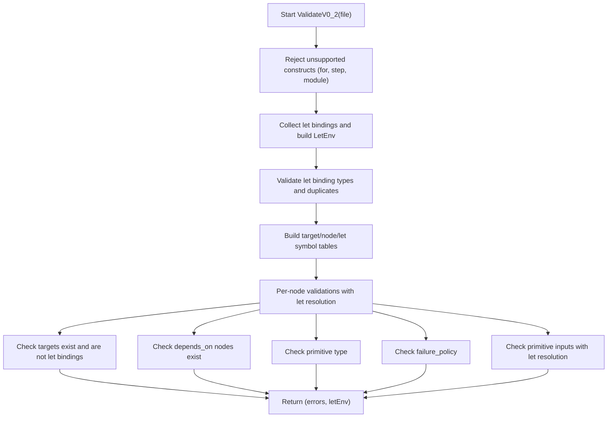

**Diagram sources**
- [validate.go](file://internal/devlang/validate.go#L23-L194)
- [validate.go](file://internal/devlang/validate.go#L396-L408)

**Section sources**
- [validate.go](file://internal/devlang/validate.go#L23-L194)
- [validate.go](file://internal/devlang/validate.go#L396-L408)

### Validator (v0.3): Advanced Semantic Checks
- **Accepts supported constructs**: let bindings with expressions, rejects for, step, module with SemanticError.
- **Three-stage validation process**:
  1. **Construct rejection**: Validates unsupported constructs and builds initial let environment.
  2. **Type checking**: Performs compile-time type inference and validation for all let expressions.
  3. **Expression evaluation**: Evaluates expressions to literals using constant folding.
- **Advanced type system**: Supports string, bool, and string[] types with comprehensive type checking.
- **Expression evaluation**: Handles string concatenation (+), boolean logic (&&, ||), equality comparisons (==, !=), and ternary expressions.
- **Sophisticated error handling**: Provides detailed type mismatch and evaluation errors with precise positioning.
- **Enhanced symbol table building**: Tracks targets, nodes, and evaluated let bindings.
- **Returns accumulated errors and evaluated let environment**.

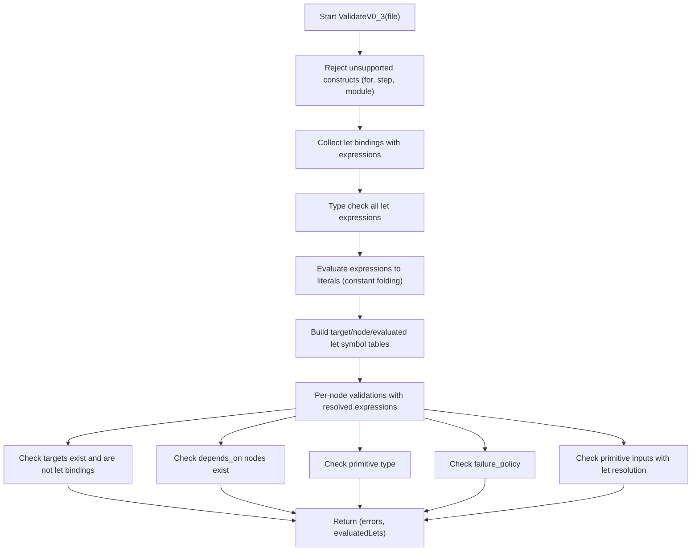

**Diagram sources**
- [validate.go](file://internal/devlang/validate.go#L493-L677)
- [types.go](file://internal/devlang/types.go#L27-L184)
- [eval.go](file://internal/devlang/eval.go#L5-L182)

**Section sources**
- [validate.go](file://internal/devlang/validate.go#L493-L677)
- [types.go](file://internal/devlang/types.go#L27-L184)
- [eval.go](file://internal/devlang/eval.go#L5-L182)

### Validator (v0.4): Comprehensive Step Support
- **Accepts supported constructs**: let bindings with expressions, step definitions, rejects for, module with SemanticError.
- **Four-stage validation process**:
  1. **Construct rejection**: Validates unsupported constructs and builds initial let environment.
  2. **Type checking**: Performs compile-time type inference and validation for all let expressions.
  3. **Step validation**: Validates step definitions and collects step metadata.
  4. **Expression evaluation**: Evaluates expressions to literals using constant folding.
- **Step definition validation**:
  - Duplicate step names detected.
  - Step name collisions with primitive types prevented.
  - Steps cannot specify targets or depends_on (validation enforced).
  - Step type must be a known primitive (not another step).
  - Step failure_policy validation.
- **Step usage validation**:
  - Unknown step references detected.
  - Step type resolution (step vs primitive).
  - Targets and depends_on validation for step-instantiated nodes.
  - Failure_policy override capability.
- **Advanced type system**: Supports string, bool, and string[] types with comprehensive type checking.
- **Expression evaluation**: Handles string concatenation (+), boolean logic (&&, ||), equality comparisons (==, !=), and ternary expressions.
- **Sophisticated error handling**: Provides detailed type mismatch, step definition, and evaluation errors with precise positioning.
- **Enhanced symbol table building**: Tracks targets, nodes, evaluated let bindings, and step definitions.
- **Returns accumulated errors, evaluated let environment, and step definitions**.

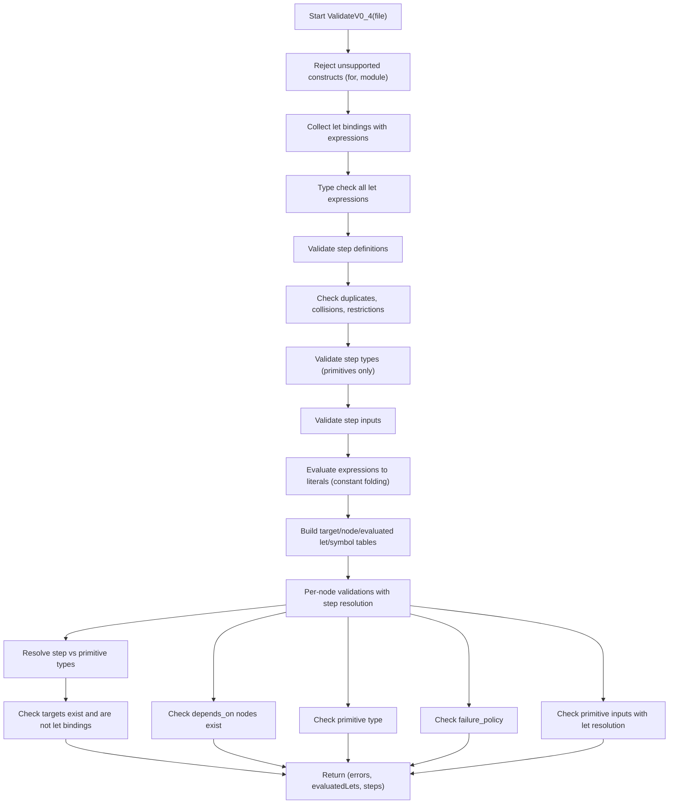

**Diagram sources**
- [validate.go](file://internal/devlang/validate.go#L717-L1050)
- [types.go](file://internal/devlang/types.go#L27-L184)
- [eval.go](file://internal/devlang/eval.go#L5-L182)

**Section sources**
- [validate.go](file://internal/devlang/validate.go#L717-L1050)
- [types.go](file://internal/devlang/types.go#L27-L184)
- [eval.go](file://internal/devlang/eval.go#L5-L182)

### Validator (v0.5): Advanced For-Loop and Nested Step Support
- **Accepts supported constructs**: let bindings with expressions, step definitions, for-loops, rejects module with SemanticError.
- **Five-stage validation process**:
  1. **Construct rejection**: Validates unsupported constructs and builds initial let environment.
  2. **Type checking**: Performs compile-time type inference and validation for all let expressions.
  3. **Expression evaluation**: Evaluates expressions to literals using constant folding.
  4. **Step validation**: Validates step definitions, detects cycles in nested step dependencies, and ensures step types resolve to primitives.
  5. **For-loop validation**: Validates for-loop syntax, range expressions, and body constraints.
- **Step definition validation**:
  - Duplicate step names detected.
  - Step name collisions with primitive types prevented.
  - Steps cannot specify targets or depends_on (validation enforced).
  - Step type validation with recursive resolution to primitives.
  - Step dependency graph built for cycle detection.
- **Nested step support**:
  - Steps can reference other steps (nested steps).
  - Cycle detection using DFS traversal.
  - Recursive step expansion with memoization.
- **For-loop validation**:
  - For-loop syntax validation.
  - Range expression must evaluate to list of string literals.
  - For-loop body limited to node declarations only.
  - Loop variable substitution in node names and string inputs.
- **Advanced type system**: Supports string, bool, and string[] types with comprehensive type checking.
- **Expression evaluation**: Handles string concatenation (+), boolean logic (&&, ||), equality comparisons (==, !=), and ternary expressions.
- **Sophisticated error handling**: Provides detailed type mismatch, step definition, cycle detection, and evaluation errors with precise positioning.
- **Enhanced symbol table building**: Tracks targets, nodes, evaluated let bindings, step definitions, and for-loop declarations.
- **Returns accumulated errors, evaluated let environment, step definitions, and for-loop declarations**.

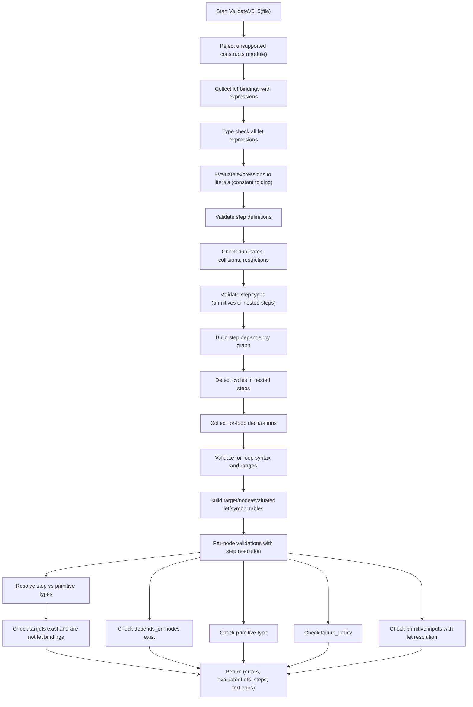

**Diagram sources**
- [validate.go](file://internal/devlang/validate.go#L1052-L1558)
- [types.go](file://internal/devlang/types.go#L27-L184)
- [eval.go](file://internal/devlang/eval.go#L5-L182)

**Section sources**
- [validate.go](file://internal/devlang/validate.go#L1052-L1558)
- [types.go](file://internal/devlang/types.go#L27-L184)
- [eval.go](file://internal/devlang/eval.go#L5-L182)

### Validator (v0.6): Comprehensive Step Parameters Support
- **Accepts supported constructs**: let bindings with expressions, step definitions with parameters, for-loops, rejects module with SemanticError.
- **Six-stage validation process**:
  1. **Construct rejection**: Validates unsupported constructs and builds initial let environment.
  2. **Type checking**: Performs compile-time type inference and validation for all let expressions.
  3. **Expression evaluation**: Evaluates expressions to literals using constant folding.
  4. **Step validation**: Validates step definitions, detects cycles in nested step dependencies, and ensures step types resolve to primitives.
  5. **Parameter validation**: Validates step parameters with uniqueness, default value evaluation, and parameter conflict detection.
  6. **For-loop validation**: Validates for-loop syntax, range expressions, and body constraints.
- **Step definition validation**:
  - Duplicate step names detected.
  - Step name collisions with primitive types prevented.
  - Steps cannot specify targets or depends_on (validation enforced).
  - Step type validation with recursive resolution to primitives.
  - Step dependency graph built for cycle detection.
- **Step parameter validation**:
  - Parameter name uniqueness within step.
  - Parameter default value type checking and evaluation.
  - Required parameters validation (no default).
  - Parameter conflict detection with step inputs.
- **Parameter substitution support**:
  - Parameter environment creation from node inputs and step defaults.
  - Parameter substitution in step bodies and parent steps.
  - Expression substitution with parameter resolution order.
- **For-loop validation**:
  - For-loop syntax validation.
  - Range expression must evaluate to list of string literals.
  - For-loop body limited to node declarations only.
  - Loop variable substitution in node names and string inputs.
- **Advanced type system**: Supports string, bool, and string[] types with comprehensive type checking.
- **Expression evaluation**: Handles string concatenation (+), boolean logic (&&, ||), equality comparisons (==, !=), and ternary expressions.
- **Sophisticated error handling**: Provides detailed type mismatch, step definition, parameter validation, cycle detection, and evaluation errors with precise positioning.
- **Enhanced symbol table building**: Tracks targets, nodes, evaluated let bindings, step definitions, parameter environments, and for-loop declarations.
- **Returns accumulated errors, evaluated let environment, step definitions, and for-loop declarations**.

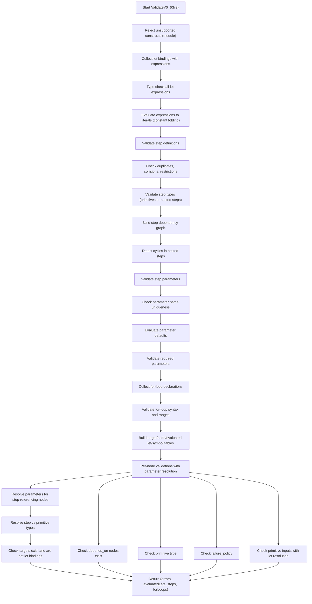

**Diagram sources**
- [validate.go](file://internal/devlang/validate.go#L1560-L1972)
- [types.go](file://internal/devlang/types.go#L27-L184)
- [eval.go](file://internal/devlang/eval.go#L5-L182)

**Section sources**
- [validate.go](file://internal/devlang/validate.go#L1560-L1972)
- [types.go](file://internal/devlang/types.go#L27-L184)
- [eval.go](file://internal/devlang/eval.go#L5-L182)

### Evaluator: Compile-Time Expression Evaluation
- **Responsibilities**:
  - Evaluates expressions to compile-time literals using constant folding.
  - Handles string concatenation, boolean logic, equality comparisons, and ternary expressions.
  - Recursively resolves let bindings and nested expressions.
- **Supported operations**:
  - String concatenation (+) between string literals.
  - Logical AND (&&) and OR (||) between boolean literals.
  - Equality (==) and inequality (!=) comparisons between compatible types.
  - Ternary conditional expressions with boolean condition.
- **Error handling**: Provides detailed semantic errors for type mismatches and unresolved identifiers.
- **Intermediate representation**: Returns literal expressions (StringLiteral, BoolLiteral, ListLiteral).

**Section sources**
- [eval.go](file://internal/devlang/eval.go#L5-L182)

### Type System: Compile-Time Type Checking
- **Types**: string, bool, string[] with comprehensive type inference.
- **Type checking rules**:
  - String literals: TypeString
  - Boolean literals: TypeBool
  - List literals: TypeStringList (empty or all string elements)
  - Binary expressions: TypeString for concatenation, TypeBool for logical ops, TypeBool for comparisons
  - Ternary expressions: Requires both branches to have same type
- **Error handling**: Detailed type mismatch errors with operator and operand types.
- **Validation constraints**: List comparison not supported, unresolved identifiers reported with precise positioning.

**Section sources**
- [types.go](file://internal/devlang/types.go#L27-L184)

### Lowerer (v0.1): AST to JSON Plan IR
- **Converts File into plan.Plan**: With Version, Targets, Nodes.
- **For each TargetDecl**: Ensures address is present; copies ID and Address.
- **For each NodeDecl**:
  - Copies ID, Type, Targets, DependsOn, FailurePolicy.
  - Lowers Inputs by converting expressions:
    - StringLiteral -> string
    - BoolLiteral -> bool
    - ListLiteral -> []string (only string elements supported in v0.1)
    - Ident -> error (not supported as a value).
- **Emits errors for unsupported expressions during lowering**.

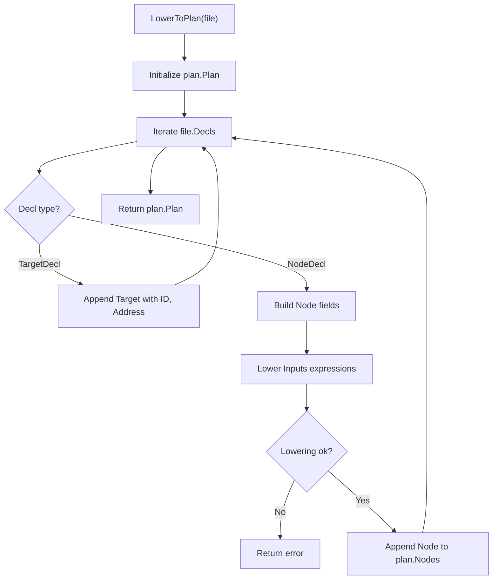

**Diagram sources**
- [lower.go](file://internal/devlang/lower.go#L9-L65)
- [lower.go](file://internal/devlang/lower.go#L67-L90)

**Section sources**
- [lower.go](file://internal/devlang/lower.go#L9-L91)

### Lowerer (v0.2): Enhanced AST to JSON Plan IR
- **Converts File into plan.Plan**: With Version, Targets, Nodes and let environment integration.
- **For each TargetDecl**: Ensures address is present; copies ID and Address.
- **For each NodeDecl**:
  - Copies ID, Type, Targets, DependsOn, FailurePolicy.
  - Lowers Inputs by converting expressions with let resolution:
    - StringLiteral -> string
    - BoolLiteral -> bool
    - ListLiteral -> []string (only string elements supported)
    - Ident -> resolved value from LetEnv (if available).
- **Enhanced expression resolution**: lowerExprV0_2 uses LetEnv for identifier substitution.
- **Emits errors for unresolved identifiers during lowering**.

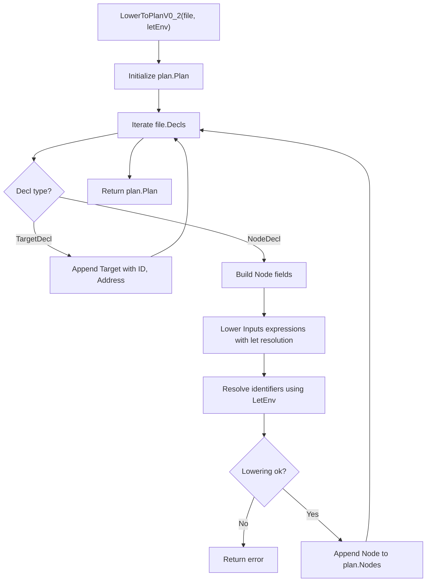

**Diagram sources**
- [lower.go](file://internal/devlang/lower.go#L92-L148)
- [lower.go](file://internal/devlang/lower.go#L150-L179)

**Section sources**
- [lower.go](file://internal/devlang/lower.go#L92-L179)

### Lowerer (v0.4): Advanced Step Expansion
- **Converts File into plan.Plan**: With Version, Targets, Nodes, let environment integration, and step expansion.
- **For each TargetDecl**: Ensures address is present; copies ID and Address.
- **For each NodeDecl**:
  - Determines if node references a step or is a primitive.
  - If step reference: clones step body as base, merges inputs (step defaults + node overrides), applies failure_policy override.
  - If primitive: uses node as-is.
  - Lowers Inputs by converting expressions with let resolution.
- **Step expansion**: Macro-style transformation where step definitions are expanded into regular nodes at compile time.
- **Enhanced expression resolution**: lowerExprV0_2 uses LetEnv for identifier substitution.
- **Emits errors for unresolved identifiers and invalid step usage during lowering**.

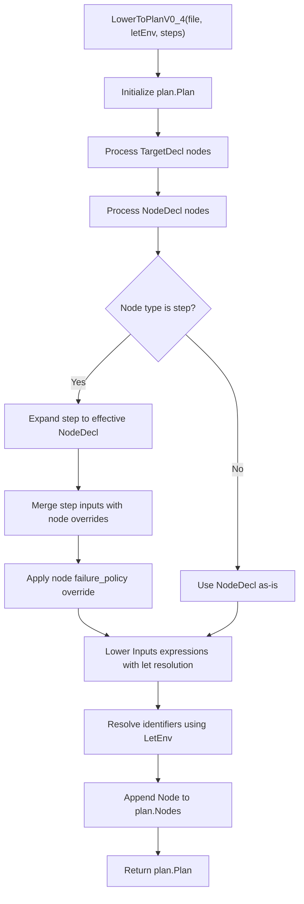

**Diagram sources**
- [lower.go](file://internal/devlang/lower.go#L180-L283)

**Section sources**
- [lower.go](file://internal/devlang/lower.go#L180-L283)

### Lowerer (v0.5): Comprehensive For-Loop Unrolling and Step Expansion
- **Converts File into plan.Plan**: With Version, Targets, Nodes, let environment integration, step expansion, and for-loop unrolling.
- **For each TargetDecl**: Ensures address is present; copies ID and Address.
- **For each NodeDecl**:
  - Recursively expands step definitions to primitive form with memoization.
  - Merges step inputs with node overrides.
  - Applies node-level failure_policy override.
  - Lowers Inputs by converting expressions with let resolution.
- **For-loop unrolling**: Compiles-time expansion of for-loops into multiple node declarations.
  - Resolves loop range to list literal (supports let bindings).
  - Generates one node for each element in the range.
  - Substitutes loop variables (${varName}) with actual values.
- **Enhanced expression resolution**: lowerExprV0_2 uses LetEnv for identifier substitution.
- **Deep cloning**: Prevents aliasing issues when expanding nodes.
- **Substitution functions**: substituteLoopVariable and substituteInExpr handle variable replacement.
- **Emits errors for unresolved identifiers, invalid step usage, and malformed for-loops during lowering**.

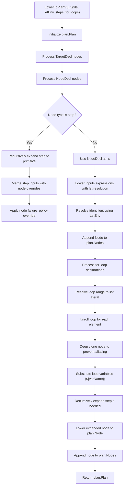

**Diagram sources**
- [lower.go](file://internal/devlang/lower.go#L284-L392)
- [lower.go](file://internal/devlang/lower.go#L394-L479)
- [lower.go](file://internal/devlang/lower.go#L481-L505)
- [lower.go](file://internal/devlang/lower.go#L507-L565)
- [lower.go](file://internal/devlang/lower.go#L567-L597)

**Section sources**
- [lower.go](file://internal/devlang/lower.go#L284-L392)
- [lower.go](file://internal/devlang/lower.go#L394-L479)
- [lower.go](file://internal/devlang/lower.go#L481-L505)
- [lower.go](file://internal/devlang/lower.go#L507-L565)
- [lower.go](file://internal/devlang/lower.go#L567-L597)

### Lowerer (v0.6): Advanced Parameterized Step Expansion
- **Converts File into plan.Plan**: With Version, Targets, Nodes, let environment integration, step expansion, parameter validation, and for-loop unrolling.
- **For each TargetDecl**: Ensures address is present; copies ID and Address.
- **For each NodeDecl**:
  - Builds parameter environment from node inputs and step defaults.
  - Recursively expands step definitions to primitive form with parameter substitution.
  - Merges non-parameter inputs with node overrides.
  - Applies node-level failure_policy override.
  - Lowers Inputs by converting expressions with let resolution.
- **Parameter substitution**: During step expansion, parameter references are replaced with provided values or defaults.
- **For-loop unrolling**: Compiles-time expansion of for-loops into multiple node declarations.
  - Resolves loop range to list literal (supports let bindings).
  - Generates one node for each element in the range.
  - Substitutes loop variables (${varName}) with actual values.
- **Enhanced expression resolution**: lowerExprV0_2 uses LetEnv for identifier substitution.
- **Deep cloning**: Prevents aliasing issues when expanding nodes.
- **Substitution functions**: substituteLoopVariable, substituteInExpr, and substituteParamsInExpr handle variable and parameter replacement.
- **Emits errors for unresolved identifiers, invalid step usage, parameter validation failures, and malformed for-loops during lowering**.

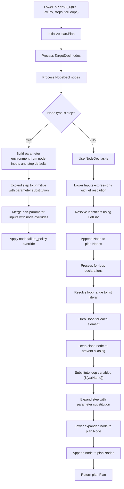

**Diagram sources**
- [lower.go](file://internal/devlang/lower.go#L599-L707)
- [lower.go](file://internal/devlang/lower.go#L709-L831)
- [lower.go](file://internal/devlang/lower.go#L833-L870)

**Section sources**
- [lower.go](file://internal/devlang/lower.go#L599-L707)
- [lower.go](file://internal/devlang/lower.go#L709-L831)
- [lower.go](file://internal/devlang/lower.go#L833-L870)

### Plan Schema and Validation
- **Plan**: Top-level JSON with version, targets, nodes.
- **Node**: id, type, targets, optional depends_on, optional when, optional failure_policy, inputs map.
- **IR validation checks**:
  - Presence of version, non-empty targets and nodes.
  - Non-empty id/address for targets.
  - Non-empty id/type/targets for nodes.
  - References to existing targets and nodes.
  - Allowed failure_policy values.
  - Primitive-specific field requirements.

**Section sources**
- [schema.go](file://internal/plan/schema.go#L11-L39)
- [validate.go](file://internal/plan/validate.go#L5-L94)

## Language Version Support

### Version 0.1 (Legacy)
- **Supported constructs**: target, node, file.sync, process.exec primitives.
- **Unsupported constructs**: let, for, step, module declarations.
- **Let bindings**: Not supported; attempting to use produces SemanticError.
- **Lowering workflow**: Direct expression-to-value conversion without let resolution.
- **CLI integration**: Default language version for backward compatibility.

### Version 0.2 (Enhanced)
- **Supported constructs**: target, node, let, file.sync, process.exec primitives.
- **Unsupported constructs**: for, step, module declarations.
- **Let bindings**: Fully supported with comprehensive validation and resolution.
- **Enhanced lowering workflow**: Let environment integration with expression resolution.
- **CLI integration**: New default language version with explicit version selection.

### Version 0.3 (Advanced)
- **Supported constructs**: target, node, let with expressions, file.sync, process.exec primitives.
- **Unsupported constructs**: for, step, module declarations.
- **Expression support**: Comprehensive expression evaluation with constant folding.
- **Type checking**: Compile-time type inference and validation for all expressions.
- **Advanced features**: String concatenation, boolean logic, equality comparisons, ternary expressions.
- **Enhanced validation**: Three-stage validation process with type checking and evaluation.
- **CLI integration**: Default language version with sophisticated evaluation engine.

### Version 0.4 (Comprehensive)
- **Supported constructs**: target, node, let with expressions, step, file.sync, process.exec primitives.
- **Unsupported constructs**: for, module declarations.
- **Step support**: Comprehensive step definition and usage with macro-style expansion.
- **Step validation**: Duplicate detection, collision prevention, restriction enforcement.
- **Step expansion**: Macro-style transformation of step references to regular nodes.
- **Enhanced validation**: Four-stage validation process with type checking, step validation, and evaluation.
- **Advanced features**: Reusable steps, step inheritance, input merging, failure_policy overrides.
- **CLI integration**: Full support for v0.4 language version with step-aware compilation.

### Version 0.5 (Advanced)
- **Supported constructs**: target, node, let with expressions, step, for, file.sync, process.exec primitives.
- **Unsupported constructs**: module declarations.
- **For-loop support**: Compile-time unrolling of for-loops with variable substitution.
- **Nested step support**: Steps can reference other steps with cycle detection and recursive expansion.
- **Enhanced validation**: Five-stage validation process with type checking, step validation, cycle detection, for-loop validation, and evaluation.
- **Advanced features**: 
  - For-loop unrolling with ${varName} substitution in node names and string inputs.
  - Nested step dependencies with memoized expansion.
  - Comprehensive error handling for cycles, invalid ranges, and malformed loops.
- **CLI integration**: Full support for v0.5 language version with advanced compilation features.

### Version 0.6 (Parameterized Steps)
- **Supported constructs**: target, node, let with expressions, step with parameters, for, file.sync, process.exec primitives.
- **Unsupported constructs**: module declarations.
- **For-loop support**: Compile-time unrolling of for-loops with variable substitution.
- **Step parameters support**: Comprehensive parameter validation with required/optional parameters, default value evaluation, and parameter substitution during expansion.
- **Nested step support**: Steps can reference other steps with cycle detection and recursive expansion.
- **Enhanced validation**: Six-stage validation process with type checking, step validation, parameter validation, cycle detection, for-loop validation, and evaluation.
- **Advanced features**: 
  - Step parameters with required and optional defaults.
  - Parameter environment creation and substitution during step expansion.
  - Parameter conflict detection and validation.
  - For-loop unrolling with ${varName} substitution in node names and string inputs.
  - Nested step dependencies with memoized expansion and parameter propagation.
  - Comprehensive error handling for cycles, invalid ranges, parameter validation, and malformed loops.
- **CLI integration**: Full support for v0.6 language version with advanced compilation features including parameter processing.

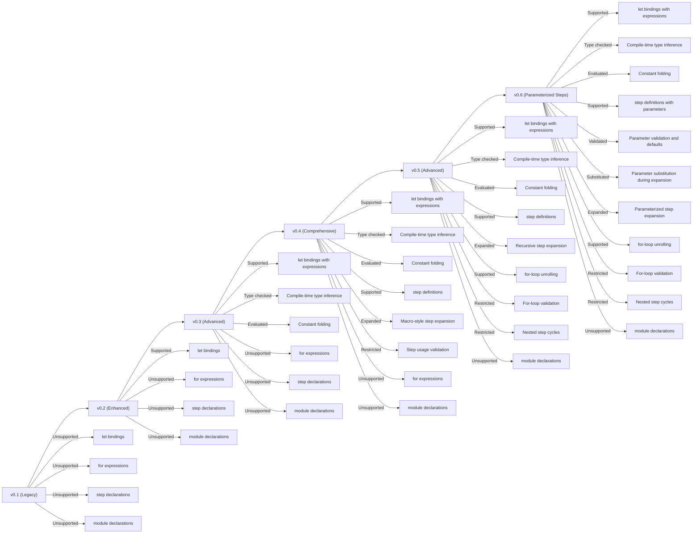

**Diagram sources**
- [validate.go](file://internal/devlang/validate.go#L197-L315)
- [validate.go](file://internal/devlang/validate.go#L23-L194)
- [validate.go](file://internal/devlang/validate.go#L493-L677)
- [validate.go](file://internal/devlang/validate.go#L717-L1050)
- [validate.go](file://internal/devlang/validate.go#L1052-L1558)
- [validate.go](file://internal/devlang/validate.go#L1560-L1972)
- [lower.go](file://internal/devlang/lower.go#L284-L392)
- [lower.go](file://internal/devlang/lower.go#L599-L707)

**Section sources**
- [validate.go](file://internal/devlang/validate.go#L197-L315)
- [validate.go](file://internal/devlang/validate.go#L23-L194)
- [validate.go](file://internal/devlang/validate.go#L493-L677)
- [validate.go](file://internal/devlang/validate.go#L717-L1050)
- [validate.go](file://internal/devlang/validate.go#L1052-L1558)
- [validate.go](file://internal/devlang/validate.go#L1560-L1972)
- [lower.go](file://internal/devlang/lower.go#L284-L392)
- [lower.go](file://internal/devlang/lower.go#L599-L707)

## Dependency Analysis
- **CLI depends on devlang.CompileFileV0_1/V0_2/V0_3/V0_4/V0_5/V0_6**: Compiles .devops to plan with language version selection.
- **devlang.CompileFileV0_1/V0_2/V0_3/V0_4/V0_5/V0_6**: Orchestrates lexer, parser, validator, evaluator, type checker, lowerer, and plan validation.
- **Lowerer depends on plan schema types**: v0.1, v0.2, v0.4, v0.5, and v0.6 lowerers depend on plan schema.
- **Evaluator and Type System**: Used exclusively by v0.3, v0.4, v0.5, and v0.6 validation workflow.
- **Step Expansion**: Used by v0.4, v0.5, and v0.6 lowering workflow for macro-style transformation.
- **For-Loop Unrolling**: Used by v0.5 and v0.6 lowering workflow for compile-time expansion.
- **Parameter Processing**: Used by v0.6 validation and lowering workflow for parameter validation and substitution.
- **Cycle Detection**: Used by v0.5 and v0.6 validation workflow for nested step dependencies.
- **Primitives consume plan nodes**: For execution regardless of language version.
- **Enhanced dependencies**: v0.2 introduces LetEnv management and expression resolution; v0.3 adds type checking and expression evaluation; v0.4 adds step validation and expansion; v0.5 adds for-loop validation, nested step support, and cycle detection; v0.6 adds parameter validation, parameter substitution, and comprehensive parameter processing.

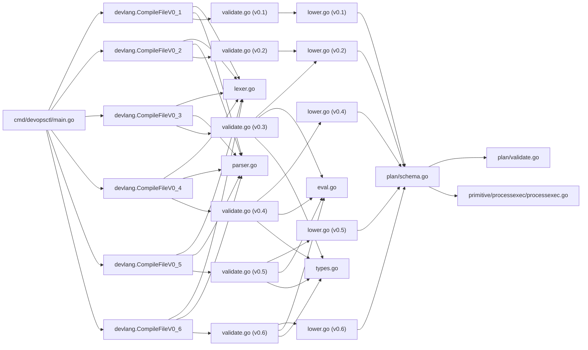

**Diagram sources**
- [main.go](file://cmd/devopsctl/main.go#L54-L63)
- [validate.go](file://internal/devlang/validate.go#L455-L491)
- [validate.go](file://internal/devlang/validate.go#L679-L717)
- [validate.go](file://internal/devlang/validate.go#L1013-L1050)
- [validate.go](file://internal/devlang/validate.go#L1522-L1558)
- [validate.go](file://internal/devlang/validate.go#L1974-L2010)
- [lexer.go](file://internal/devlang/lexer.go#L49-L57)
- [parser.go](file://internal/devlang/parser.go#L27-L39)
- [lower.go](file://internal/devlang/lower.go#L9-L179)
- [lower.go](file://internal/devlang/lower.go#L180-L283)
- [lower.go](file://internal/devlang/lower.go#L284-L392)
- [lower.go](file://internal/devlang/lower.go#L599-L707)
- [eval.go](file://internal/devlang/eval.go#L5-L182)
- [types.go](file://internal/devlang/types.go#L27-L184)
- [schema.go](file://internal/plan/schema.go#L11-L39)
- [validate.go](file://internal/plan/validate.go#L5-L94)
- [processexec.go](file://internal/primitive/processexec/processexec.go#L13-L82)

**Section sources**
- [main.go](file://cmd/devopsctl/main.go#L54-L63)
- [validate.go](file://internal/devlang/validate.go#L455-L491)
- [validate.go](file://internal/devlang/validate.go#L679-L717)
- [validate.go](file://internal/devlang/validate.go#L1013-L1050)
- [validate.go](file://internal/devlang/validate.go#L1522-L1558)
- [validate.go](file://internal/devlang/validate.go#L1974-L2010)
- [lexer.go](file://internal/devlang/lexer.go#L49-L57)
- [parser.go](file://internal/devlang/parser.go#L27-L39)
- [lower.go](file://internal/devlang/lower.go#L9-L179)
- [lower.go](file://internal/devlang/lower.go#L180-L283)
- [lower.go](file://internal/devlang/lower.go#L284-L392)
- [lower.go](file://internal/devlang/lower.go#L599-L707)
- [eval.go](file://internal/devlang/eval.go#L5-L182)
- [types.go](file://internal/devlang/types.go#L27-L184)
- [schema.go](file://internal/plan/schema.go#L11-L39)
- [validate.go](file://internal/plan/validate.go#L5-L94)
- [processexec.go](file://internal/primitive/processexec/processexec.go#L13-L82)

## Performance Considerations
- **Lexer and Parser**: Linear in input size; memory usage proportional to source length and AST depth.
- **Lowering**: O(N) over AST nodes and expressions; list lowering is O(E) per list.
- **v0.2 enhancements**: Additional O(L) for let environment processing where L is number of let bindings.
- **v0.3 enhancements**: Additional O(L) for type checking and expression evaluation where L is number of let bindings.
- **v0.4 enhancements**: Additional O(S) for step validation and O(N) for step expansion where S is number of steps and N is number of nodes.
- **v0.5 enhancements**: Additional O(S) for step dependency graph construction and cycle detection, O(F) for for-loop collection, and O(F×R×N) for for-loop unrolling where F is number of for-loops, R is average range size, and N is number of nodes per loop iteration.
- **v0.6 enhancements**: Additional O(P) for parameter validation and substitution where P is number of parameters, O(S) for step dependency graph construction and cycle detection, O(F) for for-loop collection, and O(F×R×N) for for-loop unrolling where F is number of for-loops, R is average range size, and N is number of nodes per loop iteration.
- **Expression evaluation**: O(E) for each expression with recursive evaluation and identifier resolution.
- **Type checking**: O(E) for each expression with type inference and validation.
- **Step expansion**: O(N × I) for input merging where N is number of nodes and I is average number of inputs per step.
- **For-loop unrolling**: O(R × N) for each loop where R is range size and N is number of nodes in loop body.
- **Parameter processing**: O(P) for parameter validation and substitution where P is number of parameters.
- **Cycle detection**: O(S²) for nested step dependency graph traversal where S is number of steps.
- **Plan validation**: O(T + N + E) over targets, nodes, and edges (references).
- **Recommendations**:
  - Keep .devops files modular to limit AST depth.
  - Prefer compact list literals and avoid unnecessary expressions.
  - Use let bindings judiciously to improve maintainability.
  - Leverage constant folding in v0.3, v0.4, v0.5, and v0.6 for performance-critical expressions.
  - Use steps strategically to reduce code duplication without excessive complexity.
  - Limit for-loop range sizes to prevent excessive unrolling.
  - Validate parameters early to catch errors before expansion.
  - Use parameter defaults judiciously to reduce repetition.
  - Validate early to fail fast and reduce downstream work.

## Troubleshooting Guide
### Common Issues and Resolutions
- **Unsupported constructs in v0.1**:
  - let, for, step, module declarations are rejected. Remove or refactor to supported forms.
- **Unsupported constructs in v0.2 and v0.3**:
  - for, step, module declarations are rejected. Use supported constructs or downgrade to v0.1.
- **Unsupported constructs in v0.4, v0.5, and v0.6**:
  - module declarations are rejected. Use supported constructs or downgrade to v0.1-v0.3.
- **Duplicate declarations**:
  - Duplicate target, node, let, or step names cause SemanticError. Rename to be unique.
- **Unknown references**:
  - Using undefined target, node, let binding, step, or parameter triggers SemanticError. Define missing declarations.
- **Let binding validation**:
  - Invalid let value types (non-literal expressions) cause SemanticError.
  - Let bindings cannot be used in targets; use target declarations instead.
- **Type checking errors in v0.3, v0.4, v0.5, and v0.6**:
  - Type mismatches in binary operations (e.g., string + bool) cause SemanticError.
  - Unsupported operations like list comparison trigger type errors.
  - Ternary expressions must have matching branch types.
- **Expression evaluation errors in v0.3, v0.4, v0.5, and v0.6**:
  - Unresolved identifiers in expressions cause SemanticError.
  - Invalid operator usage in expressions triggers evaluation errors.
- **Step definition errors in v0.4, v0.5, and v0.6**:
  - Duplicate step names cause SemanticError.
  - Step name collisions with primitive types trigger SemanticError.
  - Steps cannot specify targets or depends_on; use node-level instead.
  - Unknown primitive types in step definitions cause SemanticError.
- **Step usage errors in v0.4, v0.5, and v0.6**:
  - Unknown step references cause SemanticError.
  - Step type resolution failures trigger SemanticError.
  - Step input validation errors cause SemanticError.
- **Nested step errors in v0.5 and v0.6**:
  - Circular step dependencies cause SemanticError with cycle path.
  - Steps that don't resolve to primitives cause SemanticError.
- **Parameter validation errors in v0.6**:
  - Duplicate parameter names within a step cause SemanticError.
  - Invalid parameter default types cause SemanticError.
  - Missing required parameters cause SemanticError.
  - Parameter conflicts with step inputs cause SemanticError.
- **For-loop errors in v0.5 and v0.6**:
  - For-loop range must evaluate to list of string literals.
  - For-loop body may only contain node declarations.
  - Invalid loop variable substitution syntax.
- **Primitive input requirements**:
  - file.sync requires src and dest as string literals.
  - process.exec requires cmd as non-empty list of string literals and cwd as string literal.
- **Failure policy**:
  - failure_policy must be one of halt, continue, rollback.
- **Lowering errors**:
  - Identifiers cannot be lowered as values in v0.1; ensure expressions resolve to literals.
  - Unresolved identifiers in v0.2-v0.6 cause lowering errors.
  - Invalid step usage in v0.4, v0.5, and v0.6 causes lowering errors.
  - Parameter validation failures in v0.6 cause lowering errors.
  - Malformed for-loops in v0.5 and v0.6 cause lowering errors.

**Section sources**
- [validate.go](file://internal/devlang/validate.go#L25-L53)
- [validate.go](file://internal/devlang/validate.go#L63-L86)
- [validate.go](file://internal/devlang/validate.go#L88-L137)
- [validate.go](file://internal/devlang/validate.go#L142-L207)
- [validate.go](file://internal/devlang/validate.go#L305-L319)
- [validate.go](file://internal/devlang/validate.go#L321-L366)
- [validate.go](file://internal/devlang/validate.go#L493-L677)
- [validate.go](file://internal/devlang/validate.go#L717-L1050)
- [validate.go](file://internal/devlang/validate.go#L1052-L1558)
- [validate.go](file://internal/devlang/validate.go#L1560-L1972)
- [types.go](file://internal/devlang/types.go#L86-L142)
- [eval.go](file://internal/devlang/eval.go#L60-L149)
- [lower.go](file://internal/devlang/lower.go#L67-L90)
- [lower.go](file://internal/devlang/lower.go#L150-L179)
- [lower.go](file://internal/devlang/lower.go#L180-L283)
- [lower.go](file://internal/devlang/lower.go#L284-L392)
- [lower.go](file://internal/devlang/lower.go#L599-L707)
- [lower.go](file://internal/devlang/lower.go#L709-L831)
- [lower.go](file://internal/devlang/lower.go#L833-L870)

## Conclusion
The .devops compilation pipeline transforms human-readable source into structured JSON plans through six stages: lexical analysis, parsing, AST construction, validation with enhanced semantic analysis, parameter processing, and lowering. The enhanced pipeline now supports six language versions with progressively sophisticated capabilities: v0.1 provides basic constructs, v0.2 introduces let bindings with resolution, v0.3 delivers comprehensive expression support with type checking, compile-time evaluation, and constant folding, v0.4 introduces reusable step support with macro-style expansion and enhanced validation, v0.5 represents the most advanced iteration with for-loop unrolling, nested step dependencies with cycle detection, and comprehensive validation, and v0.6 introduces the most sophisticated feature set with step parameters support, parameter validation, parameter substitution during expansion, and comprehensive parameter processing. The v0.6 pipeline represents the most sophisticated compilation stage with its six-stage validation process, comprehensive step system with recursive expansion and parameter substitution, advanced type system, powerful expression evaluation engine, parameterized step expansion, and compile-time for-loop unrolling. Robust error reporting and validation ensure the resulting plan is executable and consistent across all language versions. The provided examples illustrate how high-level constructs map to concrete plan nodes and inputs, demonstrating the evolution from simple literals to complex evaluated expressions, step-expanded configurations with parameter substitution, and for-loop-unrolled node sets with parameterized step instantiation.

## Appendices

### Example: Evolution of a .devops Source Through the Pipeline
#### v0.1 Workflow
- **Source**: A .devops file defines a target and two nodes (file.sync and process.exec).
- **Lexer**: Produces tokens for keywords, identifiers, strings, operators, and punctuation.
- **Parser**: Builds AST nodes representing target and node declarations with typed inputs.
- **Validator**: Enforces v0.1 rules, checking duplicates, references, and primitive inputs.
- **Lowerer**: Converts AST to plan.Plan, mapping declarations to targets and nodes, and expressions to JSON-compatible values.
- **Plan JSON**: Final output suitable for execution and reconciliation.

#### v0.2 Workflow with Let Bindings
- **Source**: A .devops file with let bindings defining reusable values.
- **Lexer**: Same tokenization process as v0.1.
- **Parser**: Builds AST with LetDecl nodes alongside standard declarations.
- **Validator**: Validates let bindings, ensures type safety, and prevents misuse in targets.
- **Lowerer**: Processes let environment, resolves expressions, and generates final plan.
- **Plan JSON**: Contains resolved values ready for execution.

#### v0.3 Workflow with Expression Evaluation
- **Source**: A .devops file with let bindings containing expressions (string concatenation, boolean logic, ternary expressions).
- **Lexer**: Same tokenization process as previous versions.
- **Parser**: Builds AST with LetDecl nodes containing complex expressions.
- **Validator**: Performs three-stage validation: construct rejection, type checking, and expression evaluation.
- **Evaluator**: Performs compile-time constant folding, evaluating expressions to literals.
- **Lowerer**: Processes evaluated let environment and generates final plan with resolved values.
- **Plan JSON**: Contains fully evaluated constants ready for optimal execution performance.

#### v0.4 Workflow with Step Expansion
- **Source**: A .devops file with step definitions and step usage with macro-style expansion.
- **Lexer**: Same tokenization process as previous versions.
- **Parser**: Builds AST with StepDecl nodes alongside standard declarations.
- **Validator**: Performs four-stage validation: construct rejection, type checking, step validation, and expression evaluation.
- **Evaluator**: Performs compile-time constant folding for expressions in steps and nodes.
- **Lowerer**: Expands step definitions to regular nodes, merges inputs, applies overrides, and generates final plan.
- **Plan JSON**: Contains fully expanded nodes ready for execution with step reuse benefits.

#### v0.5 Workflow with For-Loop Unrolling and Nested Steps
- **Source**: A .devops file with for-loops, nested step definitions, and step usage with compile-time unrolling.
- **Lexer**: Same tokenization process as previous versions.
- **Parser**: Builds AST with ForDecl nodes alongside standard declarations.
- **Validator**: Performs five-stage validation: construct rejection, type checking, expression evaluation, step validation with cycle detection, and for-loop validation.
- **Evaluator**: Performs compile-time constant folding for expressions in steps, nodes, and for-loop contexts.
- **Lowerer**: Unrolls for-loops to generate multiple nodes, recursively expands nested steps with memoization, merges inputs, applies overrides, and generates final plan.
- **Plan JSON**: Contains fully expanded nodes with compile-time for-loop unrolling and nested step resolution, ready for optimal execution performance.

#### v0.6 Workflow with Step Parameters and Parameter Substitution
- **Source**: A .devops file with step parameters, parameter defaults, and parameter usage with compile-time substitution.
- **Lexer**: Same tokenization process as previous versions.
- **Parser**: Builds AST with ParamDecl nodes alongside standard declarations.
- **Validator**: Performs six-stage validation: construct rejection, type checking, expression evaluation, step validation with parameter validation, cycle detection, and for-loop validation.
- **Evaluator**: Performs compile-time constant folding for expressions in steps, nodes, for-loops, and parameter defaults.
- **Lowerer**: Validates parameter requirements, builds parameter environments, substitutes parameters during step expansion, unrolls for-loops to generate multiple nodes, recursively expands nested steps with parameter propagation, merges non-parameter inputs, applies overrides, and generates final plan.
- **Plan JSON**: Contains fully expanded nodes with compile-time parameter substitution, for-loop unrolling, nested step resolution, and parameterized step instantiation, ready for optimal execution performance.

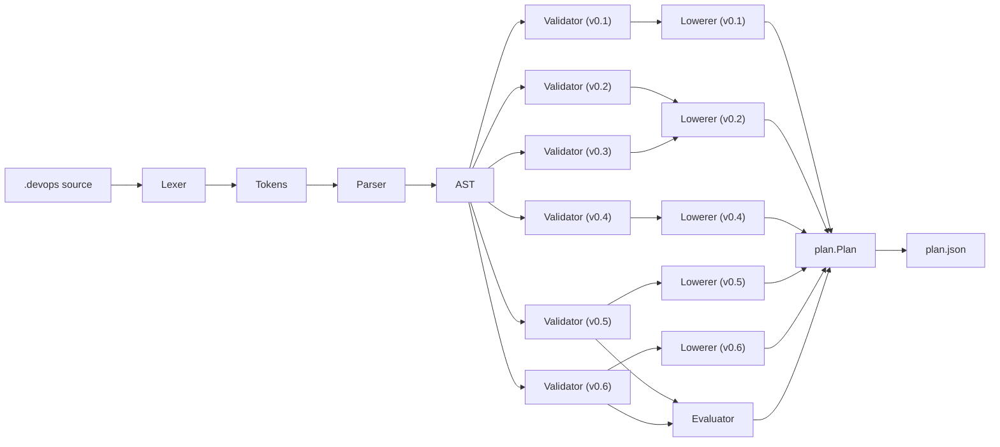

**Diagram sources**
- [plan.devops](file://plan.devops#L1-L20)
- [lexer.go](file://internal/devlang/lexer.go#L59-L100)
- [parser.go](file://internal/devlang/parser.go#L27-L39)
- [ast.go](file://internal/devlang/ast.go#L14-L167)
- [validate.go](file://internal/devlang/validate.go#L197-L315)
- [validate.go](file://internal/devlang/validate.go#L23-L194)
- [validate.go](file://internal/devlang/validate.go#L493-L677)
- [validate.go](file://internal/devlang/validate.go#L717-L1050)
- [validate.go](file://internal/devlang/validate.go#L1052-L1558)
- [validate.go](file://internal/devlang/validate.go#L1560-L1972)
- [eval.go](file://internal/devlang/eval.go#L5-L182)
- [lower.go](file://internal/devlang/lower.go#L9-L179)
- [lower.go](file://internal/devlang/lower.go#L180-L283)
- [lower.go](file://internal/devlang/lower.go#L284-L392)
- [lower.go](file://internal/devlang/lower.go#L599-L707)
- [lower.go](file://internal/devlang/lower.go#L709-L831)
- [schema.go](file://internal/plan/schema.go#L11-L39)
- [plan.json](file://plan.json#L1-L25)

**Section sources**
- [plan.devops](file://plan.devops#L1-L20)
- [plan.json](file://plan.json#L1-L25)
- [compile_test.go](file://internal/devlang/compile_test.go#L211-L257)
- [compile_test.go](file://internal/devlang/compile_test.go#L259-L303)
- [comprehensive.devops](file://tests/v0_3/valid/comprehensive.devops#L1-L46)
- [logical.devops](file://tests/v0_3/valid/logical.devops#L1-L16)
- [ternary.devops](file://tests/v0_3/valid/ternary.devops#L1-L17)
- [type_mismatch.devops](file://tests/v0_3/invalid/type_mismatch.devops#L1-L13)
- [unresolved_var.devops](file://tests/v0_3/invalid/unresolved_var.devops#L1-L13)
- [step_basic.devops](file://tests/v0_4/valid/step_basic.devops#L1-L17)
- [step_comprehensive.devops](file://tests/v0_4/valid/step_comprehensive.devops#L1-L48)
- [step_duplicate.devops](file://tests/v0_4/invalid/step_duplicate.devops#L1-L23)
- [step_undefined.devops](file://tests/v0_4/invalid/step_undefined.devops#L1-L10)
- [step_unknown_primitive.devops](file://tests/v0_4/invalid/step_unknown_primitive.devops#L1-L15)
- [comprehensive.devops](file://tests/v0_5/valid/comprehensive.devops#L1-L39)
- [for_basic.devops](file://tests/v0_5/valid/for_basic.devops#L1-L21)
- [for_with_lets.devops](file://tests/v0_5/valid/for_with_lets.devops#L1-L18)
- [for_multiple_loops.devops](file://tests/v0_5/valid/for_multiple_loops.devops#L1-L27)
- [nested_step_basic.devops](file://tests/v0_5/valid/nested_step_basic.devops#L1-L21)
- [nested_step_cycle_direct.devops](file://tests/v0_5/invalid/nested_step_cycle_direct.devops#L1-L21)
- [for_non_list_range.devops](file://tests/v0_5/invalid/for_non_list_range.devops#L1-L16)
- [param_basic.devops](file://tests/v0_6/valid/param_basic.devops#L1-L18)
- [param_required.devops](file://tests/v0_6/valid/param_required.devops#L1-L19)
- [param_duplicate.devops](file://tests/v0_6/invalid/param_duplicate.devops#L1-L19)
- [param_missing_required.devops](file://tests/v0_6/invalid/param_missing_required.devops#L1-L17)
- [param_manual_expansion.devops](file://tests/v0_6/hash_stability/param_manual_expansion.devops#L1-L11)
- [param_with_default.devops](file://tests/v0_6/hash_stability/param_with_default.devops#L1-L18)