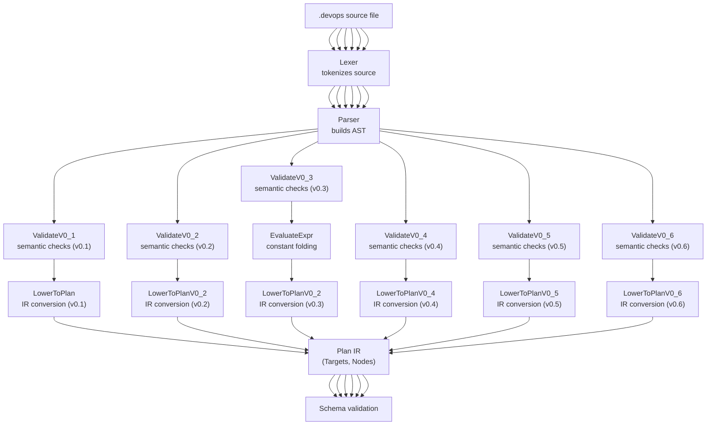
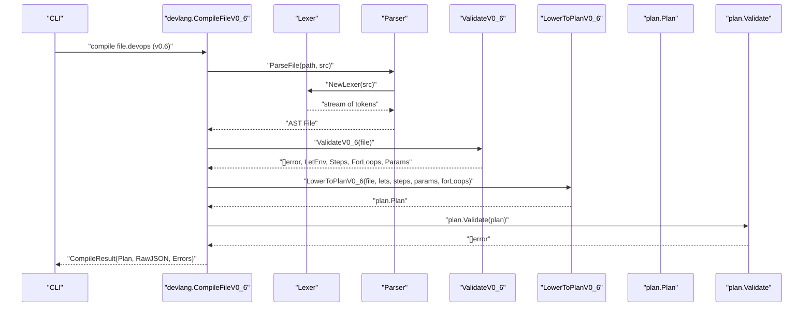
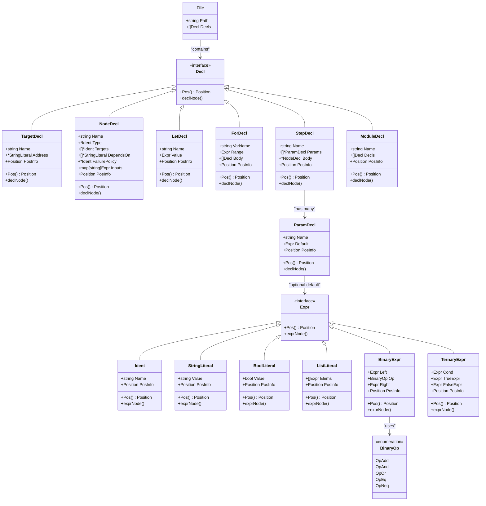
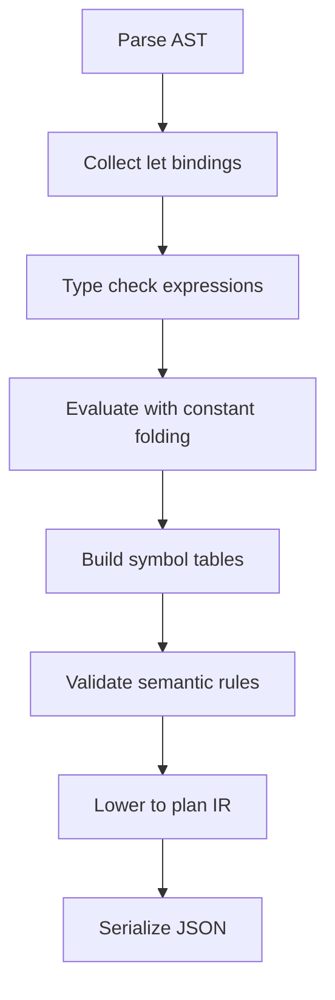
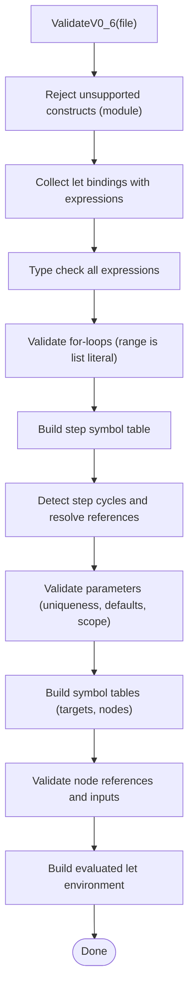
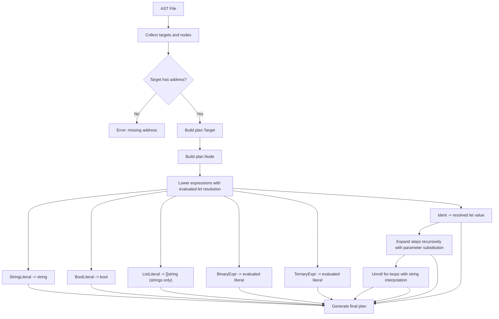
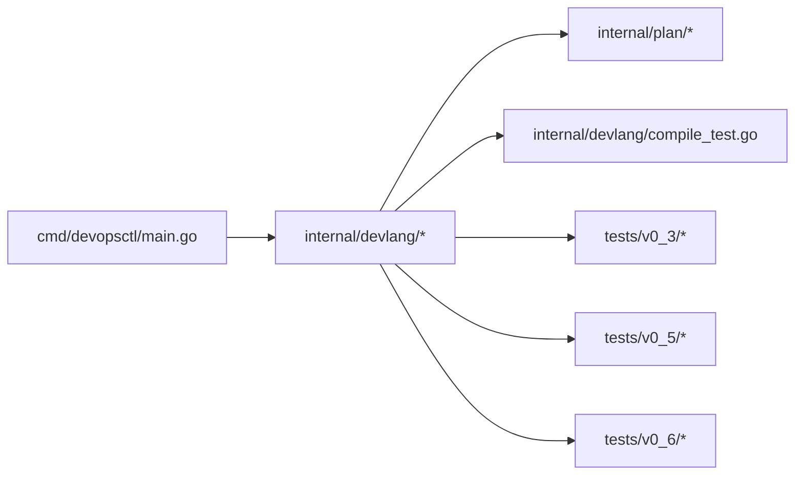

# Language Syntax and Grammar

<cite>
**Referenced Files in This Document**
- [lexer.go](file://internal/devlang/lexer.go)
- [parser.go](file://internal/devlang/parser.go)
- [ast.go](file://internal/devlang/ast.go)
- [eval.go](file://internal/devlang/eval.go)
- [lower.go](file://internal/devlang/lower.go)
- [validate.go](file://internal/devlang/validate.go)
- [types.go](file://internal/devlang/types.go)
- [compile_test.go](file://internal/devlang/compile_test.go)
- [main.go](file://cmd/devopsctl/main.go)
- [plan.devops](file://plan.devops)
- [plan_resume.devops](file://tests/e2e/plan_resume.devops)
- [ternary.devops](file://tests/v0_3/valid/ternary.devops)
- [logical.devops](file://tests/v0_3/valid/logical.devops)
- [concat.devops](file://tests/v0_3/valid/concat.devops)
- [comprehensive.devops](file://tests/v0_3/valid/comprehensive.devops)
- [for_basic.devops](file://tests/v0_5/valid/for_basic.devops)
- [for_with_lets.devops](file://tests/v0_5/valid/for_with_lets.devops)
- [for_multiple_loops.devops](file://tests/v0_5/valid/for_multiple_loops.devops)
- [nested_step_basic.devops](file://tests/v0_5/valid/nested_step_basic.devops)
- [nested_step_deep.devops](file://tests/v0_5/valid/nested_step_deep.devops)
- [nested_step_override.devops](file://tests/v0_5/valid/nested_step_override.devops)
- [for_non_list_range.devops](file://tests/v0_5/invalid/for_non_list_range.devops)
- [nested_step_cycle_direct.devops](file://tests/v0_5/invalid/nested_step_cycle_direct.devops)
- [nested_step_self_reference.devops](file://tests/v0_5/invalid/nested_step_self_reference.devops)
- [param_basic.devops](file://tests/v0_6/valid/param_basic.devops)
- [param_required.devops](file://tests/v0_6/valid/param_required.devops)
- [param_duplicate.devops](file://tests/v0_6/invalid/param_duplicate.devops)
- [param_missing_required.devops](file://tests/v0_6/invalid/param_missing_required.devops)
- [param_with_default.devops](file://tests/v0_6/hash_stability/param_with_default.devops)
- [param_manual_expansion.devops](file://tests/v0_6/hash_stability/param_manual_expansion.devops)
- [LANGUAGE_VERSIONS.md](file://LANGUAGE_VERSIONS.md)
</cite>

## Update Summary
**Changes Made**
- Updated language version coverage to include v0.6 with step parameters support
- Added comprehensive documentation for step parameter syntax, declaration rules, and validation requirements
- Enhanced grammar documentation to include param keyword and parameter syntax patterns
- Updated semantic validation to support parameter declaration uniqueness, default value evaluation, and parameter substitution during expansion
- Added parameter lowering pipeline with compile-time substitution and precedence rules
- Updated examples to demonstrate parameter usage in valid and invalid scenarios

## Table of Contents
1. [Introduction](#introduction)
2. [Project Structure](#project-structure)
3. [Core Components](#core-components)
4. [Architecture Overview](#architecture-overview)
5. [Detailed Component Analysis](#detailed-component-analysis)
6. [Dependency Analysis](#dependency-analysis)
7. [Performance Considerations](#performance-considerations)
8. [Troubleshooting Guide](#troubleshooting-guide)
9. [Conclusion](#conclusion)
10. [Appendices](#appendices)

## Introduction
This document describes the syntax and grammar of the .devops language used by the project. The language now supports six versions: 0.1 (legacy), 0.2 (enhanced with let bindings), 0.3 (fully featured with advanced expression evaluation), 0.4 (steps support), 0.5 (complete feature set with for-loops and nested steps), and 0.6 (complete parameter support for reusable, configurable steps). Version 0.6 introduces comprehensive step parameter support allowing steps to declare typed parameters with optional defaults, enabling compile-time parameter substitution during step expansion. The language covers the complete set of supported tokens (keywords, operators, punctuation, and literals), the lexical analysis process (including whitespace handling, comments, and string literal parsing with escape sequences), and the grammar rules for declarations, expressions, loops, nested steps, and parameterized steps. It also documents reserved words, identifier naming conventions, and position tracking for error reporting. Finally, it provides BNF-style grammar notation, syntax diagrams, and examples drawn from the repository's test files.

## Project Structure
The .devops language is implemented in the internal/devlang package with six version support. The main pipeline now supports all six language versions:
- Lexical analysis: tokenization of source bytes into tokens with positions.
- Parsing: recursive descent parsing into an AST with expression support.
- Validation: semantic checks for language versions 0.1, 0.2, 0.3, 0.4, 0.5, and 0.6 with progressive feature support.
- Evaluation: compile-time expression evaluation with constant folding for v0.3.
- Lowering: conversion of the AST into the plan IR with evaluated let environment support for v0.3, step expansion for v0.4, for-loop unrolling for v0.5, and parameter substitution for v0.6.
- Plan validation and JSON serialization.



**Diagram sources**
- [lexer.go](file://internal/devlang/lexer.go#L41-L100)
- [parser.go](file://internal/devlang/parser.go#L27-L78)
- [validate.go](file://internal/devlang/validate.go#L197-L230)
- [validate.go](file://internal/devlang/validate.go#L24-L93)
- [validate.go](file://internal/devlang/validate.go#L494-L520)
- [validate.go](file://internal/devlang/validate.go#L1052-L1075)
- [validate.go](file://internal/devlang/validate.go#L1660-L1713)
- [eval.go](file://internal/devlang/eval.go#L5-L182)
- [lower.go](file://internal/devlang/lower.go#L9-L65)
- [lower.go](file://internal/devlang/lower.go#L92-L148)
- [lower.go](file://internal/devlang/lower.go#L180-L282)
- [lower.go](file://internal/devlang/lower.go#L284-L392)
- [lower.go](file://internal/devlang/lower.go#L725-L770)
- [schema.go](file://internal/plan/schema.go#L11-L33)

**Section sources**
- [lexer.go](file://internal/devlang/lexer.go#L1-L289)
- [parser.go](file://internal/devlang/parser.go#L1-L673)
- [ast.go](file://internal/devlang/ast.go#L1-L167)
- [eval.go](file://internal/devlang/eval.go#L1-L182)
- [validate.go](file://internal/devlang/validate.go#L1-L2011)
- [lower.go](file://internal/devlang/lower.go#L1-L870)
- [schema.go](file://internal/plan/schema.go#L1-L77)

## Core Components
- Tokens and token types: keywords, operators/punctuation, identifiers, strings, booleans, and binary operators.
- Lexer: recognizes tokens, tracks position, handles whitespace and comments, parses strings with escapes, and supports new binary operators and param keyword.
- Parser: recursive descent over tokens; builds AST nodes for declarations and expressions with precedence climbing.
- AST: typed nodes for declarations and expressions, including BinaryExpr and TernaryExpr for v0.3, ForDecl for v0.5 loops, StepDecl with ParamDecl for v0.6 parameters, and StepDecl for v0.4+ steps.
- Evaluation: compile-time expression evaluation with constant folding for v0.3, supporting string concatenation, logical operations, equality checks, and ternary expressions.
- Validation: enforces language version semantics (v0.1 rejects all advanced features; v0.2 accepts let bindings; v0.3 accepts all features; v0.4 adds steps; v0.5 adds for-loops and nested steps; v0.6 adds step parameters with type checking and default evaluation).
- Lowering: transforms AST into plan IR for execution with evaluated let environment resolution for v0.3, step expansion for v0.4, for-loop unrolling with string interpolation for v0.5, and parameter substitution for v0.6.

**Section sources**
- [lexer.go](file://internal/devlang/lexer.go#L3-L39)
- [parser.go](file://internal/devlang/parser.go#L18-L61)
- [ast.go](file://internal/devlang/ast.go#L9-L167)
- [eval.go](file://internal/devlang/eval.go#L5-L182)
- [validate.go](file://internal/devlang/validate.go#L197-L230)
- [validate.go](file://internal/devlang/validate.go#L24-L93)
- [validate.go](file://internal/devlang/validate.go#L494-L520)
- [validate.go](file://internal/devlang/validate.go#L1052-L1075)
- [validate.go](file://internal/devlang/validate.go#L1669-L1713)
- [lower.go](file://internal/devlang/lower.go#L9-L179)
- [lower.go](file://internal/devlang/lower.go#L180-L392)
- [lower.go](file://internal/devlang/lower.go#L725-L870)

## Architecture Overview
The .devops language pipeline now supports six version processing with enhanced capabilities in v0.6. The lexer produces tokens with precise positions including new binary operators and param keyword. The parser consumes tokens to produce an AST with expression precedence and parameter parsing. Validation ensures only supported constructs are present and that references are correct, with version-specific rules including parameter declaration uniqueness, default value evaluation, and parameter substitution during expansion. Evaluation performs compile-time constant folding for v0.3. Lowering converts the AST into a plan suitable for execution and JSON serialization, with evaluated let environment support for v0.3, step expansion for v0.4, for-loop unrolling with string interpolation for v0.5, and parameter substitution for v0.6.



**Diagram sources**
- [main.go](file://cmd/devopsctl/main.go#L43-L66)
- [parser.go](file://internal/devlang/parser.go#L27-L39)
- [validate.go](file://internal/devlang/validate.go#L1660-L1713)
- [validate.go](file://internal/devlang/validate.go#L1522-L1558)
- [lower.go](file://internal/devlang/lower.go#L284-L392)
- [lower.go](file://internal/devlang/lower.go#L725-L770)
- [schema.go](file://internal/plan/schema.go#L41-L52)

## Detailed Component Analysis

### Lexical Analysis
- Token types include special tokens (EOF, ILLEGAL), identifiers, strings, booleans, keywords (target, node, let, module, step, for, in, **param**), and operators/punctuation (=, {, }, [, ], comma, +, &&, ||, ==, !=, ?, :).
- Position tracking: line and column are maintained during scanning.
- Whitespace: spaces, tabs, carriage returns, and newlines are skipped.
- Comments: line comments start with // and continue to the end of the line.
- String literals: delimited by ", with escape sequences recognized for ", \, n, t; unknown escapes are kept as-is. Unterminated strings and unterminated escape sequences produce illegal tokens with positions.
- Identifier parsing: letters, digits, underscores, and dots are allowed; keywords are recognized by lexeme.
- Binary operators: logical OR (||), logical AND (&&), equality (==), inequality (!=), addition (+), question mark (?), and colon (:) are recognized with proper precedence handling.
- **New in v0.6**: param keyword is recognized as a separate token type for parameter declarations.

```mermaid
flowchart TD
Start(["NextToken"]) --> WS["skipWhitespaceAndComments"]
WS --> EOFCheck{"pos >= len(src)?"}
EOFCheck --> |Yes| ReturnEOF["return EOF token with position"]
EOFCheck --> |No| Peek["peek()"]
Peek --> Switch{"switch on peek"}
Switch --> |{ | EmitLBrace["emit LBRACE"]
Switch --> |} | EmitRBrace["emit RBRACE"]
Switch --> |[ | EmitLBracket["emit LBRACKET"]
Switch --> |] | EmitRBracket["emit RBRACKET"]
Switch --> |= | CheckEquals["check for =="]
Switch --> |, | EmitComma["emit COMMA"]
Switch --> |+ | EmitPlus["emit PLUS"]
Switch --> |? | EmitQuestion["emit QUESTION"]
Switch --> |: | EmitColon["emit COLON"]
Switch --> |& | CheckAmp["check for &&"]
Switch --> || CheckPipe["check for ||"]
Switch --> |! | CheckBang["check for !="]
Switch --> |" | ReadStr["readString()"]
Switch --> |letter/_ | ReadIdentOrKeyword()"]
Switch --> |other| Illegal["advance and emit ILLEGAL"]
CheckEquals --> EmitEquals["emit EQUAL or EQEQ"]
CheckAmp --> EmitAmp["emit ILLEGAL or AMPAMP"]
CheckPipe --> EmitPipe["emit ILLEGAL or PIPEPIPE"]
CheckBang --> EmitBang["emit BANGEQ"]
Illegal --> End
End(["Done"])
```

**Diagram sources**
- [lexer.go](file://internal/devlang/lexer.go#L67-L142)
- [lexer.go](file://internal/devlang/lexer.go#L101-L131)
- [lexer.go](file://internal/devlang/lexer.go#L166-L196)
- [lexer.go](file://internal/devlang/lexer.go#L205-L241)
- [lexer.go](file://internal/devlang/lexer.go#L260-L283)

**Section sources**
- [lexer.go](file://internal/devlang/lexer.go#L34-L39)
- [lexer.go](file://internal/devlang/lexer.go#L59-L100)
- [lexer.go](file://internal/devlang/lexer.go#L101-L131)
- [lexer.go](file://internal/devlang/lexer.go#L166-L196)
- [lexer.go](file://internal/devlang/lexer.go#L205-L241)
- [lexer.go](file://internal/devlang/lexer.go#L260-L283)

### Grammar and Parsing
The language supports declarations and expressions with enhanced support in v0.2, v0.3, v0.4, v0.5, and v0.6. Declarations include target, node, let, for, step, module, and **param**, with version-specific acceptance rules. Expressions now support advanced evaluation with precedence climbing.

BNF-style grammar (informal):
- File = Decl*
- Decl = TargetDecl | NodeDecl | LetDecl | ForDecl | StepDecl | ModuleDecl
- TargetDecl = "target" STRING "{" TargetBody "}"
- TargetBody = (IDENT "=" Expr)*
- NodeDecl = "node" STRING "{" NodeBody "}"
- NodeBody = (IDENT "=" Expr)*
- LetDecl = "let" IDENT "=" Expr
- ForDecl = "for" IDENT "in" Expr "{" Decl* "}"
- StepDecl = "step" STRING "{" StepBody "}"
- StepBody = (ParamDecl | NodeBodyField)*
- ParamDecl = "param" IDENT ("=" Expr)?
- NodeBodyField = ("type" | "targets" | "depends_on" | "failure_policy" | IDENT) "=" Expr
- ModuleDecl = "module" IDENT "{" Decl* "}"
- Expr = TernaryExpr | LogicalOrExpr | LogicalAndExpr | EqualityExpr | ConcatExpr | PrimaryExpr
- TernaryExpr = Expr "?" Expr ":" Expr
- LogicalOrExpr = Expr "||" Expr
- LogicalAndExpr = Expr "&&" Expr
- EqualityExpr = Expr ("==" | "!=") Expr
- ConcatExpr = Expr "+" Expr
- PrimaryExpr = STRING | BOOL | IDENT | ListLiteral
- ListLiteral = "[" Expr ("," Expr)* "]"

Enhanced with binary operators and ternary expressions in v0.3, where expressions support precedence climbing with ternary (?:) having lowest precedence, logical OR (||), logical AND (&&), equality (==, !=), and string concatenation (+) with proper associativity.

**Updated** v0.6 introduces parameter declarations that must appear before step body fields, with syntax supporting both required parameters (param name) and optional parameters with defaults (param name = expression).

Notes:
- Target bodies require identifiers and assignment; only "address" is accepted in all versions.
- Node bodies accept "type", "targets", "depends_on", "failure_policy", and primitive-specific inputs.
- Lists must contain expressions; in v0.1 lowering, only string literals are supported inside lists.
- Let bindings in v0.2 must be literal values (strings, booleans, or string lists); v0.3 allows any evaluatable expression; v0.6 collects but doesn't evaluate let bindings until later stages.
- For loops in v0.5: range must evaluate to a list literal; loop variables are substituted into node names and string inputs; multiple independent loops are supported.
- Step definitions in v0.4+: step bodies reuse node body syntax; steps can reference other steps creating inheritance chains; step types must resolve to primitive types or other steps.
- **v0.6 Parameters**: param declarations must appear before step body fields; parameters can be required (no default) or optional (with default expression); parameter defaults are evaluated once per step definition.
- Module constructs are parsed but rejected in v0.1, v0.2, v0.3, v0.5, and v0.6 (still not supported).
- Expression evaluation: v0.3 supports compile-time constant folding for all expression types.



**Diagram sources**
- [ast.go](file://internal/devlang/ast.go#L65-L81)
- [ast.go](file://internal/devlang/ast.go#L14-L167)

**Section sources**
- [parser.go](file://internal/devlang/parser.go#L63-L78)
- [parser.go](file://internal/devlang/parser.go#L80-L98)
- [parser.go](file://internal/devlang/parser.go#L111-L162)
- [parser.go](file://internal/devlang/parser.go#L164-L254)
- [parser.go](file://internal/devlang/parser.go#L256-L319)
- [parser.go](file://internal/devlang/parser.go#L322-L471)
- [parser.go](file://internal/devlang/parser.go#L415-L494)
- [parser.go](file://internal/devlang/parser.go#L589-L614)
- [ast.go](file://internal/devlang/ast.go#L65-L81)

### Expression Evaluation and Type Checking
v0.3 introduces comprehensive expression evaluation with constant folding:
- String concatenation: `base + "/" + app` evaluates to `"base/app"`
- Logical operations: `is_dev && is_prod` and `is_dev || is_prod` evaluate to boolean literals
- Equality checks: `env == "production"` and `env != "development"` evaluate to boolean literals
- Ternary expressions: `is_prod ? "production" : "development"` evaluate to selected literal
- Type checking ensures operand compatibility before evaluation:
  - Binary addition requires string operands
  - Logical AND/OR require boolean operands
  - Equality/inequality supports both string and boolean comparison
  - Ternary condition must be boolean
Evaluation pipeline: parse → collect let bindings → type check → evaluate → build symbol tables → validate → lower

**Updated** v0.6 parameter default evaluation follows the same pattern, with parameter defaults being type-checked and evaluated once per step definition during validation.



**Diagram sources**
- [validate.go](file://internal/devlang/validate.go#L494-L520)
- [validate.go](file://internal/devlang/validate.go#L1683-L1710)
- [eval.go](file://internal/devlang/eval.go#L5-L182)

**Section sources**
- [validate.go](file://internal/devlang/validate.go#L494-L520)
- [validate.go](file://internal/devlang/validate.go#L1683-L1710)
- [eval.go](file://internal/devlang/eval.go#L5-L182)
- [types.go](file://internal/devlang/types.go#L26-L160)

### Semantic Validation (v0.1 vs v0.2 vs v0.3 vs v0.4 vs v0.5 vs v0.6)
- **Version 0.1**: Unsupported constructs: let, for, step, module are rejected with explicit errors.
- **Version 0.2**: Let bindings are accepted with literal-only constraints; for, step, and module are still rejected.
- **Version 0.3**: All constructs are accepted including advanced expressions with full evaluation support.
- **Version 0.4**: Steps are accepted with basic validation; for-loops and modules are rejected.
- **Version 0.5**: All constructs are accepted including for-loops with range validation, nested steps with cycle detection, and comprehensive compile-time processing.
- **Version 0.6**: All constructs are accepted including step parameters with parameter declaration uniqueness validation, default value type checking and evaluation, and parameter substitution during expansion.
- Duplicate declarations: targets, nodes, and let bindings must be unique.
- References: node.targets must reference declared targets (not let bindings); node.depends_on must reference declared nodes.
- For-loop validation: range must evaluate to a list literal; loop variable substitution occurs during lowering.
- Step validation: step types must resolve to primitive types or other steps; recursive cycles are detected and prevented; steps cannot specify targets or depends_on.
- **v0.6 Parameter validation**:
  - Parameter names must be unique within a step
  - Parameter defaults are type-checked and evaluated once per step definition
  - Parameter defaults must be evaluatable expressions
  - Required parameters must be provided when instantiating steps
  - Parameter scope is limited to step body fields only
- Primitive types: only known primitives are accepted ("file.sync", "process.exec").
- Failure policy: must be one of halt, continue, rollback.
- Primitive inputs: file.sync requires src and dest as string literals; process.exec requires cmd (non-empty list of string literals) and cwd as string literals.

Enhanced validation for v0.6 with comprehensive parameter support including uniqueness checks, default evaluation, and parameter substitution rules.



**Diagram sources**
- [validate.go](file://internal/devlang/validate.go#L1660-L1713)
- [validate.go](file://internal/devlang/validate.go#L149-L1520)

**Section sources**
- [validate.go](file://internal/devlang/validate.go#L197-L230)
- [validate.go](file://internal/devlang/validate.go#L24-L93)
- [validate.go](file://internal/devlang/validate.go#L494-L520)
- [validate.go](file://internal/devlang/validate.go#L1052-L1075)
- [validate.go](file://internal/devlang/validate.go#L149-L1520)
- [validate.go](file://internal/devlang/validate.go#L1669-L1713)

### Lowering and IR Generation (v0.1 vs v0.2 vs v0.3 vs v0.4 vs v0.5 vs v0.6)
- **Version 0.1**: Converts AST into plan.Plan with Targets and Nodes.
- **Version 0.2**: Same conversion but with let environment resolution for value substitution.
- **Version 0.3**: Same conversion but with fully evaluated let environment for immediate value substitution.
- **Version 0.4**: Same conversion but with step expansion to regular nodes at compile time.
- **Version 0.5**: Same conversion but with fully expanded step hierarchy and for-loop unrolling with string interpolation.
- **Version 0.6**: Same conversion but with fully expanded step hierarchy, for-loop unrolling with string interpolation, and parameter substitution during step expansion.
- Enforces that targets have addresses; otherwise, an error is returned with position.
- Validates and lowers expressions:
  - StringLiteral -> string
  - BoolLiteral -> bool
  - ListLiteral -> []string (only string literals allowed in v0.1/v0.2, string literals in v0.3)
  - BinaryExpr -> evaluated literal (after v0.3 evaluation)
  - TernaryExpr -> evaluated literal (after v0.3 evaluation)
  - Identifiers are not lowered as values in v0.1; in v0.2/v0.3, identifiers are resolved through the let environment.
- For-loop processing: resolves range to list literal, iterates through elements, performs string interpolation, and generates expanded nodes.
- Step expansion: recursively expands step hierarchies, merges inputs with proper precedence, and caches results for performance.
- **v0.6 Parameter processing**: builds parameter environment from node inputs and step defaults, performs compile-time parameter substitution, and merges parameter values with step body inputs.
- Produces a plan with version, targets, nodes, and inputs.

Enhanced lowering for v0.6 with comprehensive parameter substitution support and precedence rules.



**Diagram sources**
- [lower.go](file://internal/devlang/lower.go#L9-L91)
- [lower.go](file://internal/devlang/lower.go#L92-L179)
- [lower.go](file://internal/devlang/lower.go#L180-L282)
- [lower.go](file://internal/devlang/lower.go#L284-L392)
- [lower.go](file://internal/devlang/lower.go#L725-L870)

**Section sources**
- [lower.go](file://internal/devlang/lower.go#L9-L91)
- [lower.go](file://internal/devlang/lower.go#L92-L179)
- [lower.go](file://internal/devlang/lower.go#L180-L282)
- [lower.go](file://internal/devlang/lower.go#L284-L392)
- [lower.go](file://internal/devlang/lower.go#L725-L870)
- [schema.go](file://internal/plan/schema.go#L11-L33)

## Dependency Analysis
- The CLI integrates the language pipeline and exposes commands to compile .devops files into JSON plans with version selection.
- The devlang package depends on plan for IR validation and serialization.
- Language version 0.1 restricts constructs to a subset for early adoption.
- Language version 0.2 introduces let binding support with enhanced validation and lowering.
- Language version 0.3 introduces comprehensive expression evaluation with constant folding and advanced type checking.
- Language version 0.4 introduces step support with compile-time expansion.
- Language version 0.5 introduces for-loop support with compile-time unrolling and nested step processing.
- Language version 0.6 introduces step parameter support with compile-time substitution and enhanced validation.

Enhanced dependency analysis to include v0.6 compilation pipeline with advanced parameter processing.



**Diagram sources**
- [main.go](file://cmd/devopsctl/main.go#L43-L66)
- [validate.go](file://internal/devlang/validate.go#L228-L264)
- [lower.go](file://internal/devlang/lower.go#L9-L65)
- [schema.go](file://internal/plan/schema.go#L41-L52)

**Section sources**
- [main.go](file://cmd/devopsctl/main.go#L1-L273)
- [validate.go](file://internal/devlang/validate.go#L228-L264)
- [lower.go](file://internal/devlang/lower.go#L9-L65)
- [schema.go](file://internal/plan/schema.go#L1-L77)

## Performance Considerations
- Lexical analysis is linear in the length of the source.
- Parsing is linear in the number of tokens with expression precedence climbing.
- Expression evaluation adds O(n) complexity for n let bindings with constant folding.
- Validation and lowering are linear in the number of declarations and expressions.
- Position tracking adds minimal overhead and enables precise error reporting.
- Constant folding eliminates runtime computation for v0.3 expressions.
- Step expansion uses memoization to avoid redundant computation.
- For-loop unrolling creates multiple nodes but maintains linear complexity in the total number of generated nodes.
- String interpolation during for-loop processing is O(m*k) where m is string length and k is number of substitutions.
- **v0.6 Parameter processing**: parameter environment building and substitution is O(p) where p is number of parameters, performed once per step expansion.

## Troubleshooting Guide
Common issues and where they are detected:
- Unexpected tokens or malformed constructs: reported by the parser with positions.
- Version 0.1: Unsupported constructs (let, for, step, module) are rejected by semantic validation.
- Version 0.2: Let bindings are accepted but must be literal values; non-literal values are rejected.
- Version 0.3: All constructs are accepted but expressions must be type-checkable and evaluatable.
- Version 0.4: Steps are accepted but must reference valid primitive types or other steps.
- Version 0.5: All constructs are accepted but includes additional validation for for-loops and nested steps.
- Version 0.6: All constructs are accepted but includes additional validation for parameters including uniqueness, default evaluation, and scope restrictions.
- Duplicate declarations: reported by semantic validation for targets, nodes, and let bindings.
- Unknown references (targets, nodes): reported by semantic validation.
- For-loop errors: range must be a list literal; invalid ranges produce errors during validation.
- Step resolution errors: step types must resolve to primitive types or other steps; unknown steps cause errors.
- Step cycle detection: circular dependencies between steps are detected and reported.
- Nested step errors: self-referencing steps and indirect cycles are prevented.
- **v0.6 Parameter errors**:
  - Duplicate parameter names within a step: detected during validation
  - Parameter default type mismatches: detected during type checking
  - Missing required parameters: detected during parameter environment building
  - Parameter scope violations: parameters cannot appear in targets, depends_on, node names, or for-loop ranges
- Expression evaluation errors: type mismatches in binary operations, invalid ternary conditions, unresolved identifiers.
- Invalid primitive types or failure policies: reported by semantic validation.
- Invalid primitive inputs (missing or wrong types): reported by semantic validation.
- Lowering errors (identifiers as values, non-string list elements): reported during lowering.
- Let binding errors: duplicate let declarations, invalid expression types, unresolved let references in targets.
- For-loop unrolling errors: non-list range expressions, invalid loop variable substitutions.
- Parameter substitution errors: unresolved parameter references, type mismatches in substituted expressions.

**Section sources**
- [parser.go](file://internal/devlang/parser.go#L46-L61)
- [validate.go](file://internal/devlang/validate.go#L28-L53)
- [validate.go](file://internal/devlang/validate.go#L66-L86)
- [validate.go](file://internal/devlang/validate.go#L90-L137)
- [validate.go](file://internal/devlang/validate.go#L1052-L1075)
- [validate.go](file://internal/devlang/validate.go#L149-L1520)
- [validate.go](file://internal/devlang/validate.go#L1669-L1713)
- [eval.go](file://internal/devlang/eval.go#L60-L149)
- [lower.go](file://internal/devlang/lower.go#L21-L27)
- [lower.go](file://internal/devlang/lower.go#L67-L90)
- [lower.go](file://internal/devlang/lower.go#L725-L770)

## Conclusion
The .devops language provides a concise, declarative syntax for defining targets and nodes, with robust lexical analysis, precise error reporting, and a clear validation and lowering pipeline. Version 0.6 significantly enhances the language by introducing comprehensive step parameter support, allowing steps to declare typed parameters with optional defaults and enabling compile-time parameter substitution during step expansion. This feature completes the reusable step abstraction, transforming steps from fixed macros into configurable, parameterized macros that can be composed across nested step chains and for-loop iterations. The language maintains its core principles of compile-time determinism and hash stability while providing modern language features for enhanced productivity and maintainability. The six-version architecture maintains backward compatibility while providing a complete macro-based infrastructure language without runtime concepts.

## Appendices

### A. Tokens and Reserved Words
- **Keywords**: target, node, let, module, step, for, in, **param**
- **Operators/Punctuation**: =, {, }, [, ], comma, +, &&, ||, ==, !=, ?, :
- **Literals**: identifiers, strings, booleans
- **Reserved words**: let, for, step, module are parsed but rejected in v0.1; let is accepted in v0.2 with literal-only constraints; all constructs are accepted in v0.3; steps accepted in v0.4; for-loops and nested steps accepted in v0.5; parameters accepted in v0.6.

**Updated** v0.6 introduces param keyword for parameter declarations.

**Section sources**
- [lexer.go](file://internal/devlang/lexer.go#L16-L39)
- [parser.go](file://internal/devlang/parser.go#L80-L98)
- [validate.go](file://internal/devlang/validate.go#L28-L53)

### B. Identifier Naming Conventions
- Identifiers may contain letters, digits, underscores, and dots.
- Keywords and reserved words are not allowed as identifiers.

**Section sources**
- [lexer.go](file://internal/devlang/lexer.go#L243-L280)

### C. String Literals and Escape Sequences
- Strings are enclosed in double quotes.
- Recognized escapes: ", \, n, t; unknown escapes are kept as-is.
- Unterminated strings and unterminated escape sequences produce illegal tokens with positions.

**Section sources**
- [lexer.go](file://internal/devlang/lexer.go#L205-L241)

### D. Expression Evaluation and Advanced Features (v0.3)
Binary operators: `+` (string concatenation), `&&` (logical AND), `||` (logical OR), `==` (equality), `!=` (inequality)
Ternary expressions: `condition ? true_value : false_value` with boolean condition
Constant folding: expressions are evaluated at compile time to produce literals
Type checking: ensures operand compatibility before evaluation
Expression precedence: ternary (?:) lowest, logical OR (||), logical AND (&&), equality (==, !=), string concatenation (+) highest

Comprehensive documentation of advanced expression support introduced in v0.3.

**Section sources**
- [parser.go](file://internal/devlang/parser.go#L451-L587)
- [ast.go](file://internal/devlang/ast.go#L127-L167)
- [eval.go](file://internal/devlang/eval.go#L49-L182)
- [validate.go](file://internal/devlang/validate.go#L494-L520)

### E. Let Binding Syntax and Semantics (v0.2-0.6)
Syntax: `let identifier = expression`
Supported expressions: 
- v0.2: string literals, boolean literals, list literals containing only string literals
- v0.3: any evaluatable expression (strings, booleans, lists, binary operations, ternary expressions)
- v0.6: collects but doesn't evaluate let bindings until validation stage
Constraints: let bindings cannot reference other let bindings; cannot be used in node.targets
Resolution: let values are substituted during lowering for node inputs and targets
v0.3: expressions are evaluated to literals at compile time
v0.6: let bindings are collected and validated but processed during lowering with step expansion

Enhanced let binding documentation to reflect v0.6 collection and delayed evaluation.

**Section sources**
- [parser.go](file://internal/devlang/parser.go#L256-L276)
- [validate.go](file://internal/devlang/validate.go#L56-L92)
- [validate.go](file://internal/devlang/validate.go#L1081-L1100)
- [validate.go](file://internal/devlang/validate.go#L526-L580)
- [lower.go](file://internal/devlang/lower.go#L150-L178)

### F. For-Loop Syntax and Processing (v0.5)
Syntax: `for variable in expression { declaration* }`
Processing rules:
- Range must evaluate to a list literal; non-list ranges are rejected during validation
- Loop variable substitution occurs during lowering in node names and string inputs
- Multiple independent for-loops are supported
- For-loop bodies can contain node declarations with string interpolation using `${variable}`
- For-loops are unrolled at compile time, generating multiple nodes
- Loop variables are string literals and can be used in any string context

Examples demonstrate basic iteration, multiple loops, and let binding usage within loops.

**Section sources**
- [parser.go](file://internal/devlang/parser.go#L278-L320)
- [validate.go](file://internal/devlang/validate.go#L1052-L1075)
- [lower.go](file://internal/devlang/lower.go#L338-L392)
- [for_basic.devops](file://tests/v0_5/valid/for_basic.devops#L1-L21)
- [for_with_lets.devops](file://tests/v0_5/valid/for_with_lets.devops#L1-L18)
- [for_multiple_loops.devops](file://tests/v0_5/valid/for_multiple_loops.devops#L1-L27)
- [for_non_list_range.devops](file://tests/v0_5/invalid/for_non_list_range.devops#L1-L16)

### G. Nested Step Definitions and Expansion (v0.4-0.6)
Syntax: `step "name" { step-body }`
Processing rules:
- Step bodies reuse node body syntax with the same constraints
- Steps can reference other steps creating inheritance chains
- Step types must resolve to primitive types or other steps
- Recursive cycles are detected and prevented during validation
- Steps are expanded to regular nodes at compile time with proper input merging
- Node declarations can reference steps by name, overriding inputs as needed
- Step expansion uses memoization to avoid redundant computation
- **v0.6 Parameters**: parameters are resolved during step expansion with compile-time substitution

Examples demonstrate basic nesting, deep inheritance chains, and input overriding scenarios.

**Section sources**
- [parser.go](file://internal/devlang/parser.go#L322-L471)
- [validate.go](file://internal/devlang/validate.go#L149-L1520)
- [validate.go](file://internal/devlang/validate.go#L1669-L1713)
- [lower.go](file://internal/devlang/lower.go#L394-L479)
- [lower.go](file://internal/devlang/lower.go#L725-L870)
- [nested_step_basic.devops](file://tests/v0_5/valid/nested_step_basic.devops#L1-L21)
- [nested_step_deep.devops](file://tests/v0_5/valid/nested_step_deep.devops#L1-L21)
- [nested_step_override.devops](file://tests/v0_5/valid/nested_step_override.devops#L1-L25)
- [nested_step_cycle_direct.devops](file://tests/v0_5/invalid/nested_step_cycle_direct.devops#L1-L21)
- [nested_step_self_reference.devops](file://tests/v0_5/invalid/nested_step_self_reference.devops#L1-L16)

### H. Step Parameter Syntax and Processing (v0.6)
Syntax: `param name` or `param name = expression`
Processing rules:
- Parameters must appear before step body fields in step declarations
- Required parameters: `param name` with no default value
- Optional parameters: `param name = expression` with default value
- Parameter defaults are evaluated once per step definition during validation
- Parameter names must be unique within a step
- Parameters are resolved during step expansion with compile-time substitution
- Parameter precedence: node-provided values override step defaults
- Parameter scope: parameters are only visible within step body fields
- Parameters cannot appear in targets, depends_on, node names, or for-loop ranges

Examples demonstrate parameter basics, required parameters, and parameter validation.

**Section sources**
- [parser.go](file://internal/devlang/parser.go#L337-L396)
- [parser.go](file://internal/devlang/parser.go#L352-L384)
- [validate.go](file://internal/devlang/validate.go#L1669-L1713)
- [lower.go](file://internal/devlang/lower.go#L725-L770)
- [lower.go](file://internal/devlang/lower.go#L773-L870)
- [param_basic.devops](file://tests/v0_6/valid/param_basic.devops#L1-L18)
- [param_required.devops](file://tests/v0_6/valid/param_required.devops#L1-L19)
- [param_duplicate.devops](file://tests/v0_6/invalid/param_duplicate.devops#L1-L19)
- [param_missing_required.devops](file://tests/v0_6/invalid/param_missing_required.devops#L1-L17)

### I. Examples from Repository
- Basic target and nodes with file synchronization and process execution.
- Node dependencies using depends_on.
- Let binding examples demonstrating string and list literal usage.
- Advanced expression examples showing concatenation, logical operations, equality checks, and ternary expressions.
- For-loop examples demonstrating compile-time iteration, multiple loops, and let binding integration.
- Nested step examples showing inheritance, deep chaining, and input overriding.
- **v0.6 Parameter examples**:
  - Basic parameter usage with defaults and required parameters
  - Parameter validation for duplicates and missing required parameters
  - Parameter hash stability demonstrating manual expansion equivalence
- Invalid construct examples demonstrating proper error reporting for unsupported syntax.

**Section sources**
- [plan.devops](file://plan.devops#L1-L20)
- [plan_resume.devops](file://tests/e2e/plan_resume.devops#L1-L43)
- [compile_test.go](file://internal/devlang/compile_test.go#L211-L257)
- [compile_test.go](file://internal/devlang/compile_test.go#L259-L303)
- [ternary.devops](file://tests/v0_3/valid/ternary.devops#L1-L17)
- [logical.devops](file://tests/v0_3/valid/logical.devops#L1-L16)
- [concat.devops](file://tests/v0_3/valid/concat.devops#L1-L15)
- [comprehensive.devops](file://tests/v0_3/valid/comprehensive.devops#L1-L46)
- [for_basic.devops](file://tests/v0_5/valid/for_basic.devops#L1-L21)
- [for_with_lets.devops](file://tests/v0_5/valid/for_with_lets.devops#L1-L18)
- [for_multiple_loops.devops](file://tests/v0_5/valid/for_multiple_loops.devops#L1-L27)
- [nested_step_basic.devops](file://tests/v0_5/valid/nested_step_basic.devops#L1-L21)
- [nested_step_deep.devops](file://tests/v0_5/valid/nested_step_deep.devops#L1-L21)
- [nested_step_override.devops](file://tests/v0_5/valid/nested_step_override.devops#L1-L25)
- [for_non_list_range.devops](file://tests/v0_5/invalid/for_non_list_range.devops#L1-L16)
- [nested_step_cycle_direct.devops](file://tests/v0_5/invalid/nested_step_cycle_direct.devops#L1-L21)
- [nested_step_self_reference.devops](file://tests/v0_5/invalid/nested_step_self_reference.devops#L1-L16)
- [param_basic.devops](file://tests/v0_6/valid/param_basic.devops#L1-L18)
- [param_required.devops](file://tests/v0_6/valid/param_required.devops#L1-L19)
- [param_duplicate.devops](file://tests/v0_6/invalid/param_duplicate.devops#L1-L19)
- [param_missing_required.devops](file://tests/v0_6/invalid/param_missing_required.devops#L1-L17)
- [param_with_default.devops](file://tests/v0_6/hash_stability/param_with_default.devops#L1-L18)
- [param_manual_expansion.devops](file://tests/v0_6/hash_stability/param_manual_expansion.devops#L1-L11)

### J. Language Version Evolution
The .devops language has evolved through six major versions, each adding orthogonal capabilities while maintaining compile-time determinism and hash stability:

**v0.3 - Expressions & Let Bindings**: Established expression evaluation layer with typed expressions, operators, and let bindings.

**v0.4 - Reusable Steps**: Added step definitions and invocation with merge precedence and memoization.

**v0.5 - For-Loops & Nested Steps**: Completed compile-time macro system with deterministic for-loop iteration and nested step composition.

**v0.6 - Step Parameters**: Completed reusable step abstraction with typed parameters, optional defaults, and compile-time substitution.

Each version maintains the core design principles: compile-time only transformations, deterministic expansion, one-way lowering, stable hashing, and no semantic leakage.

**Section sources**
- [LANGUAGE_VERSIONS.md](file://LANGUAGE_VERSIONS.md#L103-L133)