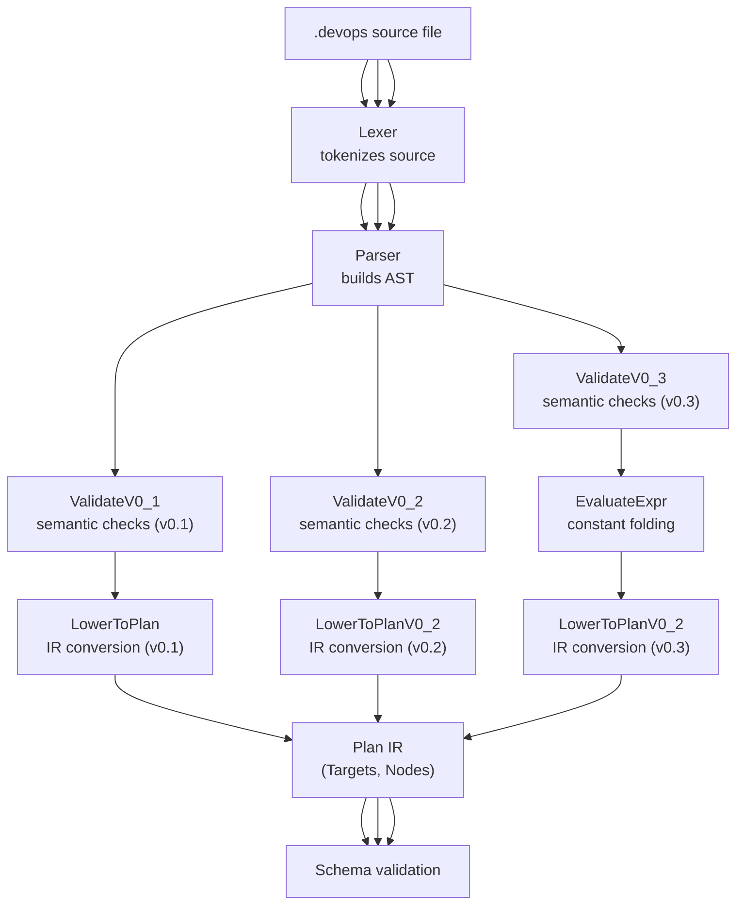
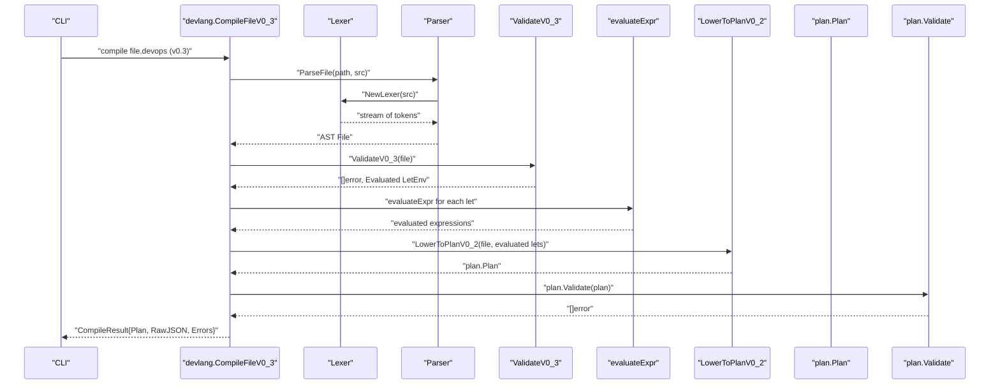
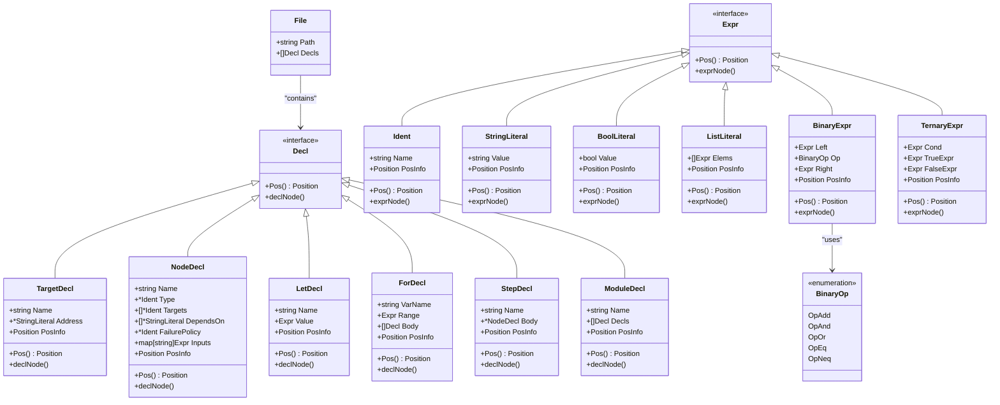
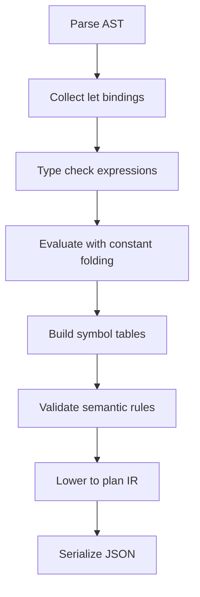
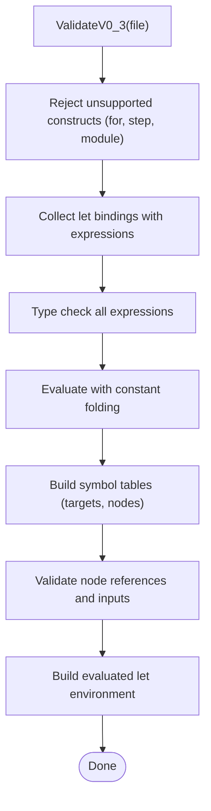
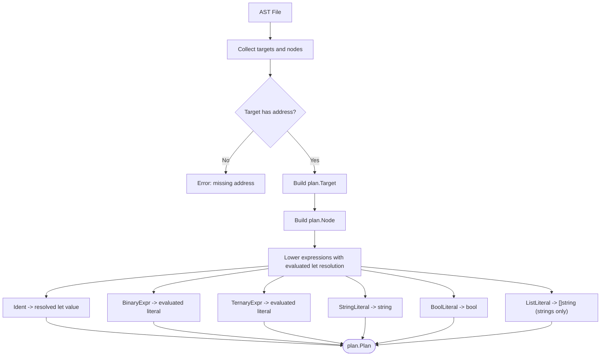
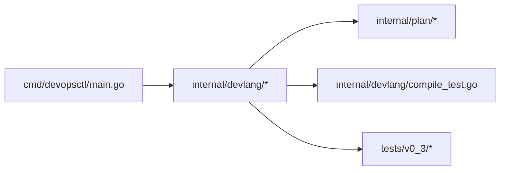

# Language Syntax and Grammar

<cite>
**Referenced Files in This Document**
- [lexer.go](file://internal/devlang/lexer.go)
- [parser.go](file://internal/devlang/parser.go)
- [ast.go](file://internal/devlang/ast.go)
- [eval.go](file://internal/devlang/eval.go)
- [lower.go](file://internal/devlang/lower.go)
- [validate.go](file://internal/devlang/validate.go)
- [types.go](file://internal/devlang/types.go)
- [compile_test.go](file://internal/devlang/compile_test.go)
- [main.go](file://cmd/devopsctl/main.go)
- [plan.devops](file://plan.devops)
- [plan_resume.devops](file://tests/e2e/plan_resume.devops)
- [ternary.devops](file://tests/v0_3/valid/ternary.devops)
- [logical.devops](file://tests/v0_3/valid/logical.devops)
- [concat.devops](file://tests/v0_3/valid/concat.devops)
- [comprehensive.devops](file://tests/v0_3/valid/comprehensive.devops)
</cite>

## Update Summary
**Changes Made**
- Updated language version coverage from 0.2 to 0.3, adding comprehensive binary operators, ternary expressions, and advanced expression evaluation capabilities
- Enhanced semantic validation to support v0.3 expression evaluation with constant folding and type checking
- Updated lowering pipeline to handle v0.3 evaluated let environment processing
- Added new language version compilation pipeline with advanced expression evaluation
- Updated grammar documentation to include binary operators (+, &&, ||, ==, !=), ternary expressions, and enhanced expression evaluation
- Added examples demonstrating advanced expression usage patterns including concatenation, logical operations, equality checks, and ternary expressions

## Table of Contents
1. [Introduction](#introduction)
2. [Project Structure](#project-structure)
3. [Core Components](#core-components)
4. [Architecture Overview](#architecture-overview)
5. [Detailed Component Analysis](#detailed-component-analysis)
6. [Dependency Analysis](#dependency-analysis)
7. [Performance Considerations](#performance-considerations)
8. [Troubleshooting Guide](#troubleshooting-guide)
9. [Conclusion](#conclusion)
10. [Appendices](#appendices)

## Introduction
This document describes the syntax and grammar of the .devops language used by the project. The language now supports three versions: 0.1 (legacy), 0.2 (enhanced with let bindings), and 0.3 (fully featured with advanced expression evaluation). Version 0.3 introduces comprehensive binary operators, ternary expressions, and advanced expression evaluation capabilities, allowing developers to perform complex computations at compile time. The language covers the complete set of supported tokens (keywords, operators, punctuation, and literals), the lexical analysis process (including whitespace handling, comments, and string literal parsing with escape sequences), and the grammar rules for declarations, expressions, and advanced evaluation features. It also documents reserved words, identifier naming conventions, and position tracking for error reporting. Finally, it provides BNF-style grammar notation, syntax diagrams, and examples drawn from the repository's test files.

## Project Structure
The .devops language is implemented in the internal/devlang package with triple version support. The main pipeline now supports all three language versions:
- Lexical analysis: tokenization of source bytes into tokens with positions.
- Parsing: recursive descent parsing into an AST with expression support.
- Validation: semantic checks for language versions 0.1, 0.2, and 0.3 with progressive feature support.
- Evaluation: compile-time expression evaluation with constant folding for v0.3.
- Lowering: conversion of the AST into the plan IR with evaluated let environment support for v0.3.
- Plan validation and JSON serialization.



**Diagram sources**
- [lexer.go](file://internal/devlang/lexer.go#L41-L100)
- [parser.go](file://internal/devlang/parser.go#L27-L78)
- [validate.go](file://internal/devlang/validate.go#L21-L140)
- [validate.go](file://internal/devlang/validate.go#L23-L194)
- [validate.go](file://internal/devlang/validate.go#L493-L677)
- [eval.go](file://internal/devlang/eval.go#L5-L182)
- [lower.go](file://internal/devlang/lower.go#L9-L65)
- [lower.go](file://internal/devlang/lower.go#L92-L148)
- [schema.go](file://internal/plan/schema.go#L11-L33)

**Section sources**
- [lexer.go](file://internal/devlang/lexer.go#L1-L289)
- [parser.go](file://internal/devlang/parser.go#L1-L615)
- [ast.go](file://internal/devlang/ast.go#L1-L159)
- [eval.go](file://internal/devlang/eval.go#L1-L182)
- [validate.go](file://internal/devlang/validate.go#L1-L717)
- [lower.go](file://internal/devlang/lower.go#L1-L179)
- [schema.go](file://internal/plan/schema.go#L1-L77)

## Core Components
- Tokens and token types: keywords, operators/punctuation, identifiers, strings, booleans, and binary operators.
- Lexer: recognizes tokens, tracks position, handles whitespace and comments, parses strings with escapes, and supports new binary operators.
- Parser: recursive descent over tokens; builds AST nodes for declarations and expressions with precedence climbing.
- AST: typed nodes for declarations and expressions, including BinaryExpr and TernaryExpr for v0.3.
- Evaluation: compile-time expression evaluation with constant folding for v0.3, supporting string concatenation, logical operations, equality checks, and ternary expressions.
- Validation: enforces language version semantics (v0.1 rejects all advanced features; v0.2 accepts let bindings; v0.3 accepts all features).
- Lowering: transforms AST into plan IR for execution with evaluated let environment resolution for v0.3.

**Section sources**
- [lexer.go](file://internal/devlang/lexer.go#L3-L39)
- [parser.go](file://internal/devlang/parser.go#L18-L61)
- [ast.go](file://internal/devlang/ast.go#L9-L159)
- [eval.go](file://internal/devlang/eval.go#L5-L182)
- [validate.go](file://internal/devlang/validate.go#L21-L140)
- [validate.go](file://internal/devlang/validate.go#L23-L194)
- [validate.go](file://internal/devlang/validate.go#L493-L677)
- [lower.go](file://internal/devlang/lower.go#L9-L179)

## Architecture Overview
The .devops language pipeline now supports triple version processing with enhanced capabilities in v0.3. The lexer produces tokens with precise positions including new binary operators. The parser consumes tokens to produce an AST with expression precedence. Validation ensures only supported constructs are present and that references are correct, with version-specific rules. Evaluation performs compile-time constant folding for v0.3. Lowering converts the AST into a plan suitable for execution and JSON serialization, with evaluated let environment support for v0.3.



**Diagram sources**
- [main.go](file://cmd/devopsctl/main.go#L43-L66)
- [parser.go](file://internal/devlang/parser.go#L27-L39)
- [validate.go](file://internal/devlang/validate.go#L493-L677)
- [eval.go](file://internal/devlang/eval.go#L5-L182)
- [validate.go](file://internal/devlang/validate.go#L679-L715)
- [lower.go](file://internal/devlang/lower.go#L92-L148)
- [schema.go](file://internal/plan/schema.go#L41-L52)

## Detailed Component Analysis

### Lexical Analysis
- Token types include special tokens (EOF, ILLEGAL), identifiers, strings, booleans, keywords (target, node, let, module, step, for, in), and operators/punctuation (=, {, }, [, ], comma, +, &&, ||, ==, !=, ?, :).
- Position tracking: line and column are maintained during scanning.
- Whitespace: spaces, tabs, carriage returns, and newlines are skipped.
- Comments: line comments start with // and continue to the end of the line.
- String literals: delimited by ", with escape sequences recognized for ", \, n, t; unknown escapes are kept as-is. Unterminated strings and unterminated escape sequences produce illegal tokens with positions.
- Identifier parsing: letters, digits, underscores, and dots are allowed; keywords are recognized by lexeme.
- **Updated** Binary operators: new tokens for logical OR (||), logical AND (&&), equality (==), inequality (!=), addition (+), question mark (?), and colon (:) are recognized with proper precedence handling.

```mermaid
flowchart TD
Start(["NextToken"]) --> WS["skipWhitespaceAndComments"]
WS --> EOFCheck{"pos >= len(src)?"}
EOFCheck --> |Yes| ReturnEOF["return EOF token with position"]
EOFCheck --> |No| Peek["peek()"]
Peek --> Switch{"switch on peek"}
Switch --> |{ | EmitLBrace["emit LBRACE"]
Switch --> |} | EmitRBrace["emit RBRACE"]
Switch --> |[ | EmitLBracket["emit LBRACKET"]
Switch --> |] | EmitRBracket["emit RBRACKET"]
Switch --> |= | CheckEquals["check for =="]
Switch --> |, | EmitComma["emit COMMA"]
Switch --> |+ | EmitPlus["emit PLUS"]
Switch --> |? | EmitQuestion["emit QUESTION"]
Switch --> |: | EmitColon["emit COLON"]
Switch --> |& | CheckAmp["check for &&"]
Switch --> || CheckPipe["check for ||"]
Switch --> |! | CheckBang["check for !="]
Switch --> |" | ReadStr["readString()"]
Switch --> |letter/_ | ReadIdent["readIdentOrKeyword()"]
Switch --> |other| Illegal["advance and emit ILLEGAL"]
CheckEquals --> EmitEquals["emit EQUAL or EQEQ"]
CheckAmp --> EmitAmp["emit ILLEGAL or AMPAMP"]
CheckPipe --> EmitPipe["emit ILLEGAL or PIPEPIPE"]
CheckBang --> EmitBang["emit BANGEQ"]
Illegal --> End
End(["Done"])
```

**Diagram sources**
- [lexer.go](file://internal/devlang/lexer.go#L67-L142)
- [lexer.go](file://internal/devlang/lexer.go#L101-L131)
- [lexer.go](file://internal/devlang/lexer.go#L166-L196)
- [lexer.go](file://internal/devlang/lexer.go#L205-L241)

**Section sources**
- [lexer.go](file://internal/devlang/lexer.go#L34-L39)
- [lexer.go](file://internal/devlang/lexer.go#L59-L100)
- [lexer.go](file://internal/devlang/lexer.go#L101-L131)
- [lexer.go](file://internal/devlang/lexer.go#L166-L196)
- [lexer.go](file://internal/devlang/lexer.go#L205-L241)

### Grammar and Parsing
The language supports declarations and expressions with enhanced support in v0.2 and v0.3. Declarations include target, node, let, for, step, and module constructs, with version-specific acceptance rules. Expressions now support advanced evaluation with precedence climbing.

BNF-style grammar (informal):
- File = Decl*
- Decl = TargetDecl | NodeDecl | LetDecl | ForDecl | StepDecl | ModuleDecl
- TargetDecl = "target" STRING "{" TargetBody "}"
- TargetBody = (IDENT "=" Expr)*
- NodeDecl = "node" STRING "{" NodeBody "}"
- NodeBody = (IDENT "=" Expr)*
- LetDecl = "let" IDENT "=" Expr
- ForDecl = "for" IDENT "in" Expr "{" Decl* "}"
- StepDecl = "step" STRING "{" NodeBody "}"
- ModuleDecl = "module" IDENT "{" Decl* "}"
- Expr = TernaryExpr | LogicalOrExpr | LogicalAndExpr | EqualityExpr | ConcatExpr | PrimaryExpr
- TernaryExpr = Expr "?" Expr ":" Expr
- LogicalOrExpr = Expr "||" Expr
- LogicalAndExpr = Expr "&&" Expr
- EqualityExpr = Expr ("==" | "!=") Expr
- ConcatExpr = Expr "+" Expr
- PrimaryExpr = STRING | BOOL | IDENT | ListLiteral
- ListLiteral = "[" Expr ("," Expr)* "]"

**Updated** Enhanced with binary operators and ternary expressions in v0.3, where expressions support precedence climbing with ternary (?:) having lowest precedence, logical OR (||), logical AND (&&), equality (==, !=), and string concatenation (+) with proper associativity.

Notes:
- Target bodies require identifiers and assignment; only "address" is accepted in all versions.
- Node bodies accept "type", "targets", "depends_on", "failure_policy", and primitive-specific inputs.
- Lists must contain expressions; in v0.1 lowering, only string literals are supported inside lists.
- Let bindings in v0.2 must be literal values (strings, booleans, or string lists); v0.3 allows any evaluatable expression.
- For, step, and module constructs are parsed but rejected in v0.1 and v0.3; they are supported in v0.2 with restrictions.
- **Updated** Expression evaluation: v0.3 supports compile-time constant folding for all expression types.



**Diagram sources**
- [ast.go](file://internal/devlang/ast.go#L14-L159)

**Section sources**
- [parser.go](file://internal/devlang/parser.go#L63-L78)
- [parser.go](file://internal/devlang/parser.go#L80-L98)
- [parser.go](file://internal/devlang/parser.go#L111-L162)
- [parser.go](file://internal/devlang/parser.go#L164-L254)
- [parser.go](file://internal/devlang/parser.go#L256-L319)
- [parser.go](file://internal/devlang/parser.go#L321-L413)
- [parser.go](file://internal/devlang/parser.go#L415-L494)
- [parser.go](file://internal/devlang/parser.go#L451-L587)
- [parser.go](file://internal/devlang/parser.go#L589-L614)
- [ast.go](file://internal/devlang/ast.go#L14-L159)

### Expression Evaluation and Type Checking
- **Updated** v0.3 introduces comprehensive expression evaluation with constant folding:
  - String concatenation: `base + "/" + app` evaluates to `"base/app"`
  - Logical operations: `is_dev && is_prod` and `is_dev || is_prod` evaluate to boolean literals
  - Equality checks: `env == "production"` and `env != "development"` evaluate to boolean literals
  - Ternary expressions: `is_prod ? "production" : "development"` evaluate to selected literal
- Type checking ensures operand compatibility before evaluation:
  - Binary addition requires string operands
  - Logical AND/OR require boolean operands
  - Equality/inequality supports both string and boolean comparison
  - Ternary condition must be boolean
- **Updated** Evaluation pipeline: parse → collect let bindings → type check → evaluate → build symbol tables → validate → lower



**Diagram sources**
- [validate.go](file://internal/devlang/validate.go#L493-L677)
- [eval.go](file://internal/devlang/eval.go#L5-L182)

**Section sources**
- [validate.go](file://internal/devlang/validate.go#L493-L677)
- [eval.go](file://internal/devlang/eval.go#L5-L182)
- [types.go](file://internal/devlang/types.go#L26-L160)

### Semantic Validation (v0.1 vs v0.2 vs v0.3)
- **Version 0.1**: Unsupported constructs: let, for, step, module are rejected with explicit errors.
- **Version 0.2**: Let bindings are accepted with literal-only constraints; for, step, and module are still rejected.
- **Version 0.3**: All constructs are accepted including advanced expressions with full evaluation support.
- Duplicate declarations: targets, nodes, and let bindings must be unique.
- References: node.targets must reference declared targets (not let bindings); node.depends_on must reference declared nodes.
- **Updated** Expression validation: v0.3 validates expression types and performs compile-time evaluation.
- Primitive types: only known primitives are accepted ("file.sync", "process.exec").
- Failure policy: must be one of halt, continue, rollback.
- Primitive inputs: file.sync requires src and dest as string literals; process.exec requires cmd (non-empty list of string literals) and cwd as string literals.

**Updated** Enhanced validation for v0.3 with comprehensive expression evaluation and type checking.



**Diagram sources**
- [validate.go](file://internal/devlang/validate.go#L493-L677)

**Section sources**
- [validate.go](file://internal/devlang/validate.go#L196-L236)
- [validate.go](file://internal/devlang/validate.go#L238-L307)
- [validate.go](file://internal/devlang/validate.go#L493-L677)

### Lowering and IR Generation (v0.1 vs v0.2 vs v0.3)
- **Version 0.1**: Converts AST into plan.Plan with Targets and Nodes.
- **Version 0.2**: Same conversion but with let environment resolution for value substitution.
- **Version 0.3**: Same conversion but with fully evaluated let environment for immediate value substitution.
- Enforces that targets have addresses; otherwise, an error is returned with position.
- Validates and lowers expressions:
  - StringLiteral -> string
  - BoolLiteral -> bool
  - ListLiteral -> []string (only string literals allowed in v0.1/v0.2, string literals in v0.3)
  - **Updated** BinaryExpr -> evaluated literal (after v0.3 evaluation)
  - **Updated** TernaryExpr -> evaluated literal (after v0.3 evaluation)
  - Identifiers are not lowered as values in v0.1; in v0.2/v0.3, identifiers are resolved through the let environment.
- Produces a plan with version, targets, nodes, and inputs.

**Updated** Enhanced lowering for v0.3 with fully evaluated let environment support.



**Diagram sources**
- [lower.go](file://internal/devlang/lower.go#L9-L91)
- [lower.go](file://internal/devlang/lower.go#L92-L179)

**Section sources**
- [lower.go](file://internal/devlang/lower.go#L9-L91)
- [lower.go](file://internal/devlang/lower.go#L92-L179)
- [schema.go](file://internal/plan/schema.go#L11-L33)

## Dependency Analysis
- The CLI integrates the language pipeline and exposes commands to compile .devops files into JSON plans with version selection.
- The devlang package depends on plan for IR validation and serialization.
- Language version 0.1 restricts constructs to a subset for early adoption.
- Language version 0.2 introduces let binding support with enhanced validation and lowering.
- **Updated** Language version 0.3 introduces comprehensive expression evaluation with constant folding and advanced type checking.

**Updated** Enhanced dependency analysis to include v0.3 compilation pipeline with expression evaluation.



**Diagram sources**
- [main.go](file://cmd/devopsctl/main.go#L43-L66)
- [validate.go](file://internal/devlang/validate.go#L228-L264)
- [lower.go](file://internal/devlang/lower.go#L9-L65)
- [schema.go](file://internal/plan/schema.go#L41-L52)

**Section sources**
- [main.go](file://cmd/devopsctl/main.go#L1-L273)
- [validate.go](file://internal/devlang/validate.go#L228-L264)
- [lower.go](file://internal/devlang/lower.go#L9-L65)
- [schema.go](file://internal/plan/schema.go#L1-L77)

## Performance Considerations
- Lexical analysis is linear in the length of the source.
- Parsing is linear in the number of tokens with expression precedence climbing.
- **Updated** Expression evaluation adds O(n) complexity for n let bindings with constant folding.
- Validation and lowering are linear in the number of declarations and expressions.
- Position tracking adds minimal overhead and enables precise error reporting.
- **Updated** Constant folding eliminates runtime computation for v0.3 expressions.

## Troubleshooting Guide
Common issues and where they are detected:
- Unexpected tokens or malformed constructs: reported by the parser with positions.
- **Version 0.1**: Unsupported constructs (let, for, step, module) are rejected by semantic validation.
- **Version 0.2**: Let bindings are accepted but must be literal values; non-literal values are rejected.
- **Version 0.3**: All constructs are accepted but expressions must be type-checkable and evaluatable.
- Duplicate declarations: reported by semantic validation for targets, nodes, and let bindings.
- Unknown references (targets, nodes): reported by semantic validation.
- **Updated** Expression evaluation errors: type mismatches in binary operations, invalid ternary conditions, unresolved identifiers.
- Invalid primitive types or failure policies: reported by semantic validation.
- Invalid primitive inputs (missing or wrong types): reported by semantic validation.
- Lowering errors (identifiers as values, non-string list elements): reported during lowering.
- **Updated** Let binding errors: duplicate let declarations, invalid expression types, unresolved let references in targets.

**Section sources**
- [parser.go](file://internal/devlang/parser.go#L46-L61)
- [validate.go](file://internal/devlang/validate.go#L28-L53)
- [validate.go](file://internal/devlang/validate.go#L66-L86)
- [validate.go](file://internal/devlang/validate.go#L90-L137)
- [validate.go](file://internal/devlang/validate.go#L30-L49)
- [eval.go](file://internal/devlang/eval.go#L60-L149)
- [lower.go](file://internal/devlang/lower.go#L21-L27)
- [lower.go](file://internal/devlang/lower.go#L67-L90)

## Conclusion
The .devops language provides a concise, declarative syntax for defining targets and nodes, with robust lexical analysis, precise error reporting, and a clear validation and lowering pipeline. Version 0.3 significantly enhances the language by introducing comprehensive expression evaluation capabilities, including binary operators, ternary expressions, and constant folding. This enables developers to perform complex computations at compile time, making configurations more powerful and maintainable. The triple-version architecture maintains backward compatibility while providing modern language features for enhanced productivity and maintainability.

## Appendices

### A. Tokens and Reserved Words
- **Keywords**: target, node, let, module, step, for, in
- **Operators/Punctuation**: =, {, }, [, ], comma, **Updated** +, &&, ||, ==, !=, ?, :
- **Literals**: identifiers, strings, booleans
- **Reserved words**: let, for, step, module are parsed but rejected in v0.1; let is accepted in v0.2 with literal-only constraints; all constructs are accepted in v0.3.

**Updated** Enhanced keyword documentation to reflect v0.3 binary operators and ternary expressions.

**Section sources**
- [lexer.go](file://internal/devlang/lexer.go#L16-L39)
- [parser.go](file://internal/devlang/parser.go#L80-L98)
- [validate.go](file://internal/devlang/validate.go#L28-L53)

### B. Identifier Naming Conventions
- Identifiers may contain letters, digits, underscores, and dots.
- Keywords and reserved words are not allowed as identifiers.

**Section sources**
- [lexer.go](file://internal/devlang/lexer.go#L243-L280)

### C. String Literals and Escape Sequences
- Strings are enclosed in double quotes.
- Recognized escapes: ", \, n, t; unknown escapes are kept as-is.
- Unterminated strings and unterminated escape sequences produce illegal tokens with positions.

**Section sources**
- [lexer.go](file://internal/devlang/lexer.go#L205-L241)

### D. Expression Evaluation and Advanced Features (v0.3)
- **Updated** Binary operators: `+` (string concatenation), `&&` (logical AND), `||` (logical OR), `==` (equality), `!=` (inequality)
- **Updated** Ternary expressions: `condition ? true_value : false_value` with boolean condition
- **Updated** Constant folding: expressions are evaluated at compile time to produce literals
- **Updated** Type checking: ensures operand compatibility before evaluation
- **Updated** Expression precedence: ternary (?:) lowest, logical OR (||), logical AND (&&), equality (==, !=), string concatenation (+) highest

**New** Comprehensive documentation of advanced expression support introduced in v0.3.

**Section sources**
- [parser.go](file://internal/devlang/parser.go#L451-L587)
- [ast.go](file://internal/devlang/ast.go#L127-L159)
- [eval.go](file://internal/devlang/eval.go#L49-L182)
- [validate.go](file://internal/devlang/validate.go#L493-L677)

### E. Let Binding Syntax and Semantics (v0.2-0.3)
- **Syntax**: `let identifier = expression`
- **Supported expressions**: 
  - v0.2: string literals, boolean literals, list literals containing only string literals
  - **Updated** v0.3: any evaluatable expression (strings, booleans, lists, binary operations, ternary expressions)
- **Constraints**: let bindings cannot reference other let bindings; cannot be used in node.targets
- **Resolution**: let values are substituted during lowering for node inputs and targets
- **Updated** v0.3: expressions are evaluated to literals at compile time

**Updated** Enhanced let binding documentation to reflect v0.3 expression evaluation capabilities.

**Section sources**
- [parser.go](file://internal/devlang/parser.go#L256-L276)
- [validate.go](file://internal/devlang/validate.go#L56-L92)
- [validate.go](file://internal/devlang/validate.go#L526-L580)
- [lower.go](file://internal/devlang/lower.go#L150-L178)

### F. Examples from Repository
- Basic target and nodes with file synchronization and process execution.
- Node dependencies using depends_on.
- **Updated** Let binding examples demonstrating string and list literal usage.
- **Updated** Advanced expression examples showing concatenation, logical operations, equality checks, and ternary expressions.

**Section sources**
- [plan.devops](file://plan.devops#L1-L20)
- [plan_resume.devops](file://tests/e2e/plan_resume.devops#L1-L43)
- [compile_test.go](file://internal/devlang/compile_test.go#L211-L257)
- [compile_test.go](file://internal/devlang/compile_test.go#L259-L303)
- [ternary.devops](file://tests/v0_3/valid/ternary.devops#L1-L17)
- [logical.devops](file://tests/v0_3/valid/logical.devops#L1-L16)
- [concat.devops](file://tests/v0_3/valid/concat.devops#L1-L15)
- [comprehensive.devops](file://tests/v0_3/valid/comprehensive.devops#L1-L46)