# Practical Examples and Patterns

<cite>
**Referenced Files in This Document**
- [plan.devops](file://plan.devops)
- [plan_resume.devops](file://tests/e2e/plan_resume.devops)
- [lexer.go](file://internal/devlang/lexer.go)
- [parser.go](file://internal/devlang/parser.go)
- [ast.go](file://internal/devlang/ast.go)
- [lower.go](file://internal/devlang/lower.go)
- [validate.go](file://internal/devlang/validate.go)
- [compile_test.go](file://internal/devlang/compile_test.go)
- [schema.go](file://internal/plan/schema.go)
- [validate.go](file://internal/plan/validate.go)
- [messages.go](file://internal/proto/messages.go)
- [orchestrator.go](file://internal/controller/orchestrator.go)
- [filesync_detect.go](file://internal/primitive/filesync/detect.go)
- [filesync_diff.go](file://internal/primitive/filesync/diff.go)
- [filesync_apply.go](file://internal/primitive/filesync/apply.go)
- [processexec.go](file://internal/primitive/processexec/processexec.go)
- [main.go](file://cmd/devopsctl/main.go)
</cite>

## Update Summary
**Changes Made**
- Added comprehensive documentation for let binding usage in devlang language version 0.2
- Included practical examples of string and list let bindings
- Documented validation scenarios and compilation workflows for let bindings
- Updated architecture diagrams to reflect let environment processing
- Enhanced troubleshooting guidance for let binding-related issues

## Table of Contents
1. [Introduction](#introduction)
2. [Project Structure](#project-structure)
3. [Core Components](#core-components)
4. [Architecture Overview](#architecture-overview)
5. [Detailed Component Analysis](#detailed-component-analysis)
6. [Dependency Analysis](#dependency-analysis)
7. [Performance Considerations](#performance-considerations)
8. [Troubleshooting Guide](#troubleshooting-guide)
9. [Conclusion](#conclusion)
10. [Appendices](#appendices)

## Introduction
This document presents practical .devops language examples and common usage patterns for building, validating, and executing DevOps plans. It demonstrates:
- Simple file synchronization across targets
- Multi-node orchestration with dependencies
- Conditional execution based on environment-aware conditions
- Complex dependency chains and failure policies
- **Updated** Let binding usage for string and list values in v0.2
- Best practices for organizing .devops files, naming conventions, and modular design
- Error handling, retries, and failure policy configuration
- Translation of common DevOps workflows into .devops constructs
- Troubleshooting guidance and performance optimization tips

## Project Structure
The repository implements a programming-first DevOps execution engine with:
- A domain-specific language (.devops) for authoring plans
- A compiler pipeline that parses, validates, lowers, and produces an execution plan
- A controller orchestrator that executes nodes against agents
- Primitives for file synchronization and process execution
- A state store for idempotency, resume, and reconciliation

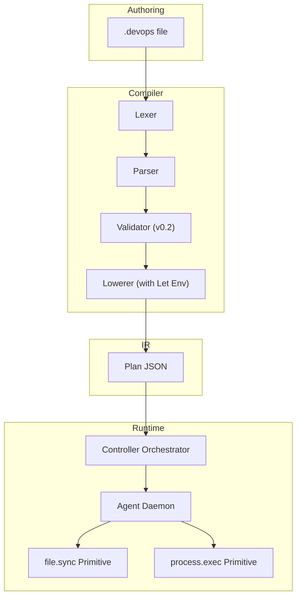

**Diagram sources**
- [lexer.go](file://internal/devlang/lexer.go#L1-L247)
- [parser.go](file://internal/devlang/parser.go#L1-L495)
- [validate.go](file://internal/devlang/validate.go#L23-L194)
- [lower.go](file://internal/devlang/lower.go#L92-L148)
- [schema.go](file://internal/plan/schema.go#L1-L77)
- [orchestrator.go](file://internal/controller/orchestrator.go#L1-L653)
- [filesync_apply.go](file://internal/primitive/filesync/apply.go#L1-L252)
- [processexec.go](file://internal/primitive/processexec/processexec.go#L1-L83)

**Section sources**
- [lexer.go](file://internal/devlang/lexer.go#L1-L247)
- [parser.go](file://internal/devlang/parser.go#L1-L495)
- [validate.go](file://internal/devlang/validate.go#L1-L492)
- [lower.go](file://internal/devlang/lower.go#L1-L179)
- [schema.go](file://internal/plan/schema.go#L1-L77)
- [orchestrator.go](file://internal/controller/orchestrator.go#L1-L653)

## Core Components
- .devops language: Declarative DSL for targets, nodes, and primitives
- Compiler: Lexing, parsing, semantic validation, lowering to plan IR with let environment
- Plan IR: JSON schema for targets, nodes, inputs, and failure policies
- Controller: Execution graph, concurrency, resume/reconcile, failure policy enforcement
- Primitives: file.sync (detect, diff, apply), process.exec (local command execution)
- Protocol: Line-delimited JSON messages between controller and agent

Key constructs:
- target: logical endpoint with address
- node: unit of work with type, targets, inputs, depends_on, failure_policy, when
- **Updated** let: variable binding for string, boolean, and list values
- primitives:
  - file.sync: src, dest, delete_extra, mode, owner, group
  - process.exec: cmd (array), cwd, timeout (optional)

**Section sources**
- [ast.go](file://internal/devlang/ast.go#L44-L52)
- [validate.go](file://internal/devlang/validate.go#L112-L137)
- [schema.go](file://internal/plan/schema.go#L18-L39)
- [processexec.go](file://internal/primitive/processexec/processexec.go#L14-L82)

## Architecture Overview
The system transforms .devops files into executable plans and runs them against agents with robust orchestration and state management. **Updated** The v0.2 architecture now includes let binding resolution during validation and lowering phases.

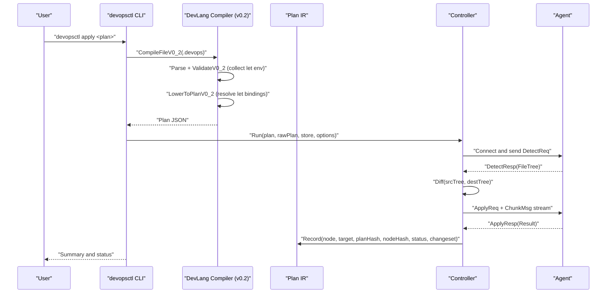

**Diagram sources**
- [main.go](file://cmd/devopsctl/main.go#L32-L87)
- [validate.go](file://internal/devlang/validate.go#L23-L194)
- [lower.go](file://internal/devlang/lower.go#L92-L148)
- [orchestrator.go](file://internal/controller/orchestrator.go#L302-L513)
- [messages.go](file://internal/proto/messages.go#L14-L75)

## Detailed Component Analysis

### .devops Language Grammar and Semantics
- Tokens: keywords (target, node, let, module, step, for, in), identifiers, strings, booleans, operators
- Declarations: target, node, let (now supported in v0.2), step (rejected in v0.2), module (rejected in v0.2), for (rejected in v0.2)
- Node attributes: type, targets, depends_on, failure_policy, primitive inputs
- **Updated** Let bindings: string literals, boolean literals, and lists of string literals
- Validation rules enforced in v0.2: unknown constructs, duplicates, unknown targets/nodes, invalid failure_policy, primitive input requirements, let binding validation

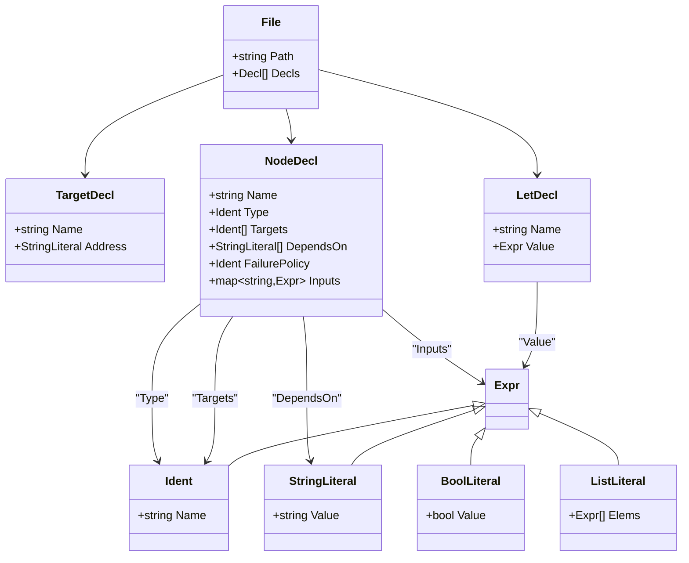

**Diagram sources**
- [ast.go](file://internal/devlang/ast.go#L14-L126)
- [lexer.go](file://internal/devlang/lexer.go#L3-L32)
- [parser.go](file://internal/devlang/parser.go#L111-L276)

**Section sources**
- [lexer.go](file://internal/devlang/lexer.go#L1-L247)
- [parser.go](file://internal/devlang/parser.go#L1-L495)
- [ast.go](file://internal/devlang/ast.go#L1-L126)
- [validate.go](file://internal/devlang/validate.go#L21-L140)

### Plan IR and Validation
- Plan JSON schema includes version, targets, and nodes
- Node fields: id, type, targets, depends_on, when, failure_policy, inputs
- IR validation checks structural correctness and primitive-specific constraints
- **Updated** Let environment: collects and validates let bindings during v0.2 validation

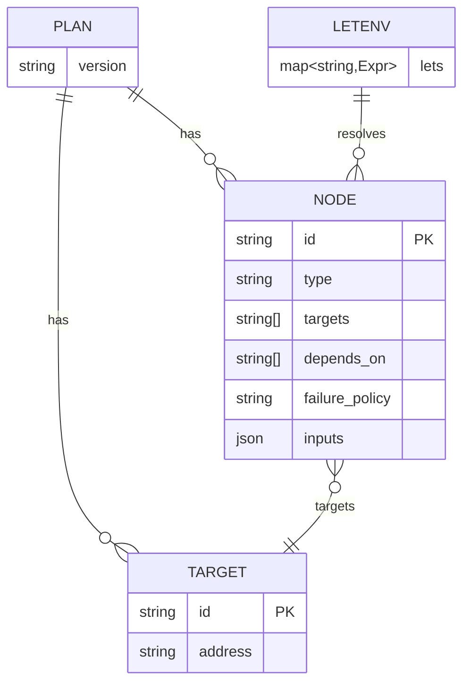

**Diagram sources**
- [schema.go](file://internal/plan/schema.go#L11-L39)
- [validate.go](file://internal/plan/validate.go#L5-L94)
- [validate.go](file://internal/devlang/validate.go#L21-L24)

**Section sources**
- [schema.go](file://internal/plan/schema.go#L1-L77)
- [validate.go](file://internal/plan/validate.go#L1-L95)

### Controller Orchestration and Failure Policies
- Builds an execution graph from nodes and dependencies
- Supports parallelism via worker pool and per-target concurrency
- Implements failure policies: halt, continue, rollback
- Supports resume and reconcile modes using recorded state

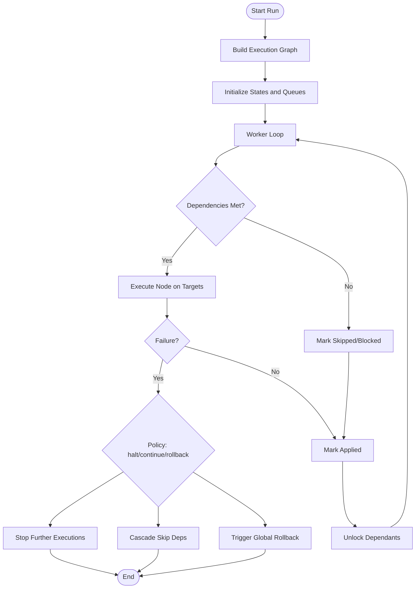

**Diagram sources**
- [orchestrator.go](file://internal/controller/orchestrator.go#L34-L300)

**Section sources**
- [orchestrator.go](file://internal/controller/orchestrator.go#L1-L653)

### File Synchronization Primitive
- Detect: Walk destination and compute SHA-256 hashes without loading entire files
- Diff: Compute ChangeSet (create, update, delete, chmod, chown, mkdir)
- Apply: Atomic mkdir → streamed create/update → chmod → chown → delete; snapshots for rollback

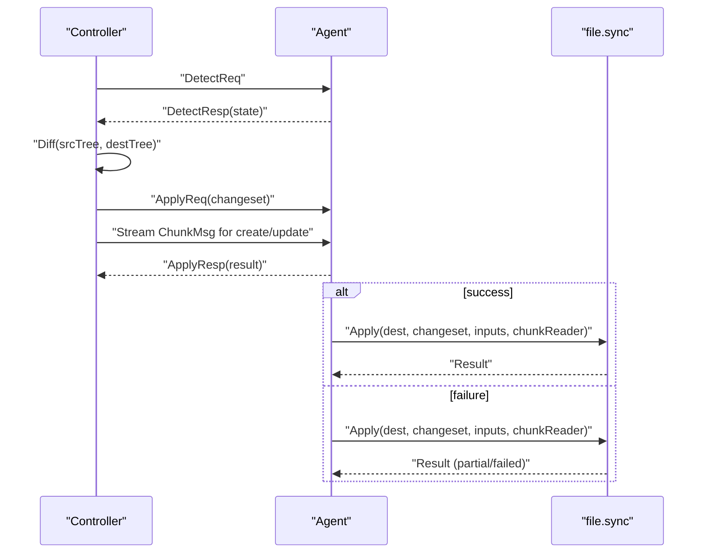

**Diagram sources**
- [orchestrator.go](file://internal/controller/orchestrator.go#L313-L442)
- [filesync_detect.go](file://internal/primitive/filesync/detect.go#L19-L70)
- [filesync_diff.go](file://internal/primitive/filesync/diff.go#L7-L67)
- [filesync_apply.go](file://internal/primitive/filesync/apply.go#L19-L204)
- [messages.go](file://internal/proto/messages.go#L14-L75)

**Section sources**
- [filesync_detect.go](file://internal/primitive/filesync/detect.go#L1-L105)
- [filesync_diff.go](file://internal/primitive/filesync/diff.go#L1-L87)
- [filesync_apply.go](file://internal/primitive/filesync/apply.go#L1-L252)
- [orchestrator.go](file://internal/controller/orchestrator.go#L313-L442)

### Process Execution Primitive
- Executes commands locally with optional timeout
- Streams stdout/stderr and reports exit code and classification
- Supports dry-run mode

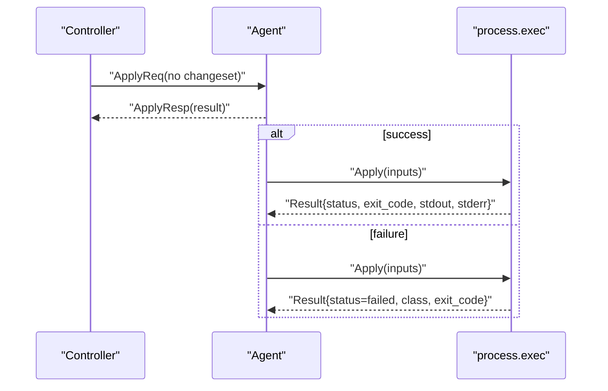

**Diagram sources**
- [processexec.go](file://internal/primitive/processexec/processexec.go#L13-L82)
- [orchestrator.go](file://internal/controller/orchestrator.go#L444-L513)
- [messages.go](file://internal/proto/messages.go#L25-L75)

**Section sources**
- [processexec.go](file://internal/primitive/processexec/processexec.go#L1-L83)
- [orchestrator.go](file://internal/controller/orchestrator.go#L444-L513)

### Practical .devops Examples and Patterns

#### Example 1: Simple File Synchronization
- Define a target and a node of type file.sync
- Set src and dest paths
- Optionally enable delete_extra

```mermaid
flowchart TD
A["target local { address = \"127.0.0.1:7700\" }"] --> B["node test-sync { type=file.sync<br/>targets=[local]<br/>src=\"./testsrc\"<br/>dest=\"/tmp/testdest\" }"]
B --> C["Controller detects dest state"]
C --> D["Controller diffs src vs dest"]
D --> E["Controller streams files and applies changes"]
```

**Diagram sources**
- [plan.devops](file://plan.devops#L1-L20)
- [orchestrator.go](file://internal/controller/orchestrator.go#L313-L442)

**Section sources**
- [plan.devops](file://plan.devops#L1-L20)

#### Example 2: Multi-Node Orchestration with Dependencies
- Chain nodes with depends_on
- Use failure_policy to control propagation

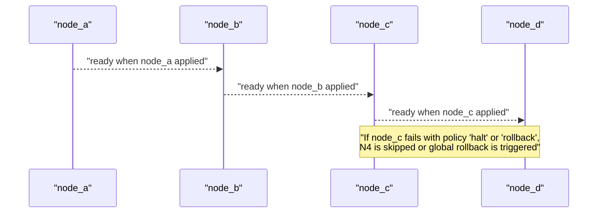

**Diagram sources**
- [plan_resume.devops](file://tests/e2e/plan_resume.devops#L5-L42)
- [orchestrator.go](file://internal/controller/orchestrator.go#L244-L265)

**Section sources**
- [plan_resume.devops](file://tests/e2e/plan_resume.devops#L1-L43)

#### Example 3: Conditional Execution Based on Environment Variables
- Use the when clause to gate execution based on upstream node changes
- Combine with depends_on for explicit ordering

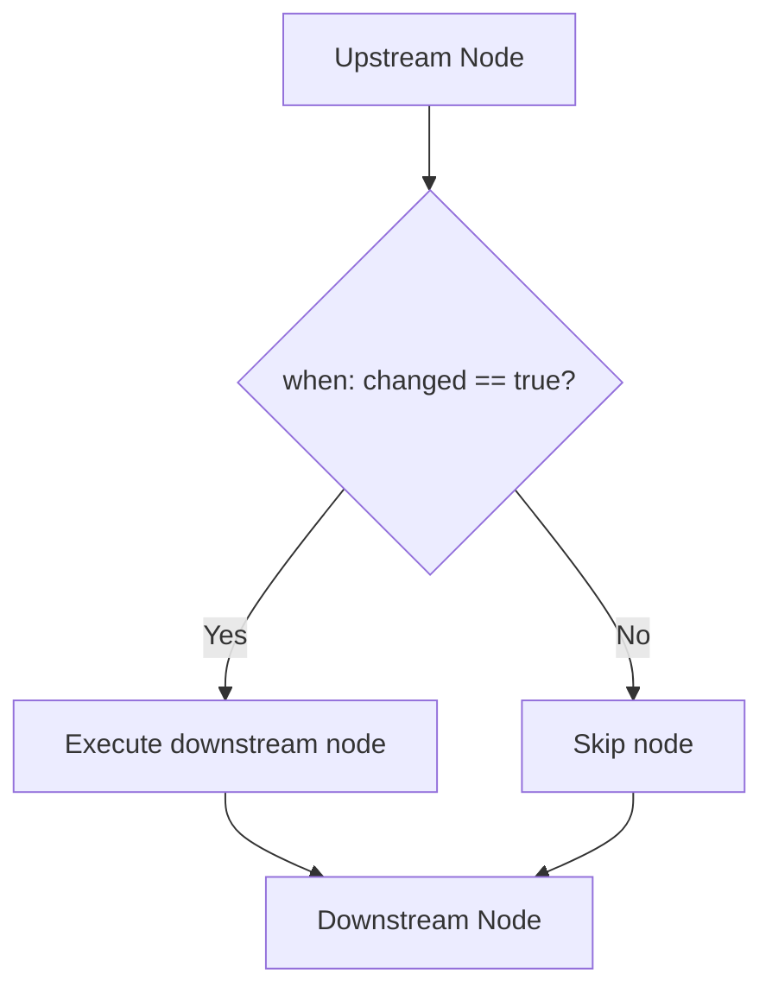

**Diagram sources**
- [schema.go](file://internal/plan/schema.go#L35-L39)
- [orchestrator.go](file://internal/controller/orchestrator.go#L116-L123)

**Section sources**
- [schema.go](file://internal/plan/schema.go#L35-L39)
- [orchestrator.go](file://internal/controller/orchestrator.go#L116-L123)

#### Example 4: Complex Dependency Chains and Failure Policy Configuration
- Configure failure_policy per node: halt, continue, rollback
- Resume and reconcile modes leverage recorded state

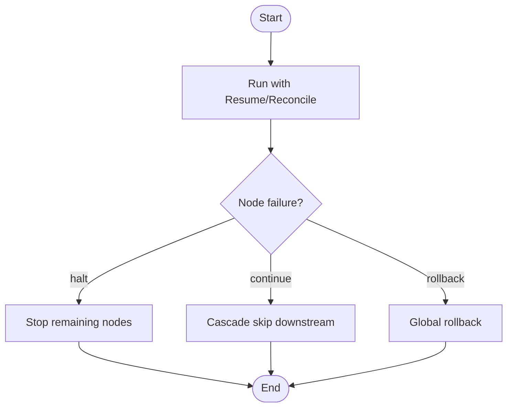

**Diagram sources**
- [orchestrator.go](file://internal/controller/orchestrator.go#L244-L265)
- [orchestrator.go](file://internal/controller/orchestrator.go#L618-L652)

**Section sources**
- [orchestrator.go](file://internal/controller/orchestrator.go#L244-L265)
- [orchestrator.go](file://internal/controller/orchestrator.go#L618-L652)

#### Example 5: Let Binding Usage in v0.2

**Updated** Let bindings provide variable substitution capabilities in .devops v0.2:

##### String Let Bindings
Define reusable string values for paths, URLs, or configuration values:

```mermaid
flowchart TD
A["let app_dir = \"/var/www/app\""] --> B["node sync {<br/>src=\"./src\"<br/>dest=app_dir }"]
B --> C["Lowering resolves app_dir to \"/var/www/app\""]
C --> D["Plan IR contains resolved string value"]
```

**Diagram sources**
- [compile_test.go](file://internal/devlang/compile_test.go#L211-L257)
- [validate.go](file://internal/devlang/validate.go#L56-L92)
- [lower.go](file://internal/devlang/lower.go#L92-L148)

##### List Let Bindings
Define reusable command arrays for process execution:

```mermaid
flowchart TD
A["let migrate_cmd = [\"php\", \"artisan\", \"migrate\", \"--force\"]"] --> B["node migrate {<br/>cmd=migrate_cmd<br/>cwd=\"/tmp\" }"]
B --> C["Lowering resolves to [\"php\",\"artisan\",\"migrate\",\"--force\"]"]
C --> D["Plan IR contains resolved command array"]
```

**Diagram sources**
- [compile_test.go](file://internal/devlang/compile_test.go#L259-L303)
- [validate.go](file://internal/devlang/validate.go#L56-L92)
- [lower.go](file://internal/devlang/lower.go#L150-L178)

##### Validation and Compilation Workflow
Let bindings undergo validation and resolution during compilation:

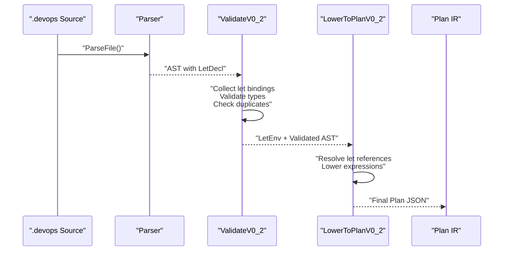

**Diagram sources**
- [parser.go](file://internal/devlang/parser.go#L256-L276)
- [validate.go](file://internal/devlang/validate.go#L23-L194)
- [lower.go](file://internal/devlang/lower.go#L92-L148)

**Section sources**
- [compile_test.go](file://internal/devlang/compile_test.go#L211-L303)
- [validate.go](file://internal/devlang/validate.go#L23-L194)
- [lower.go](file://internal/devlang/lower.go#L92-L178)

#### Example 6: Error Handling, Retry Mechanisms, and Failure Policy
- Use failure_policy to control behavior on failure
- Implement retry loops at the .devops authoring level using steps/modules (not supported in v0.1) or external scripts
- Leverage dry-run and reconcile to validate and recover

Best practices:
- Prefer rollback for idempotent primitives
- Use continue for independent tasks that should not block others
- Use halt to prevent cascading failures

**Section sources**
- [validate.go](file://internal/devlang/validate.go#L124-L134)
- [orchestrator.go](file://internal/controller/orchestrator.go#L244-L265)

#### Example 7: Translating Common DevOps Workflows
- Infrastructure provisioning: define nodes for package installation, service enablement, and configuration file sync
- CI/CD deployment: stage artifacts via file.sync, run health checks via process.exec, and roll back on failure
- Drift remediation: use reconcile mode to enforce plan compliance

**Section sources**
- [processexec.go](file://internal/primitive/processexec/processexec.go#L14-L82)
- [filesync_apply.go](file://internal/primitive/filesync/apply.go#L19-L204)

## Dependency Analysis
The compiler pipeline and runtime components form a layered dependency chain with clear separation of concerns. **Updated** The v0.2 pipeline now includes let environment collection and resolution.

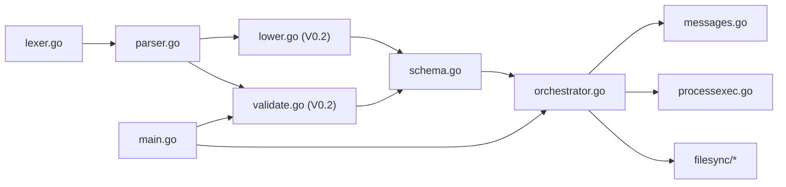

**Diagram sources**
- [lexer.go](file://internal/devlang/lexer.go#L1-L247)
- [parser.go](file://internal/devlang/parser.go#L1-L495)
- [validate.go](file://internal/devlang/validate.go#L1-L492)
- [lower.go](file://internal/devlang/lower.go#L1-L179)
- [schema.go](file://internal/plan/schema.go#L1-L77)
- [orchestrator.go](file://internal/controller/orchestrator.go#L1-L653)
- [filesync_detect.go](file://internal/primitive/filesync/detect.go#L1-L105)
- [filesync_diff.go](file://internal/primitive/filesync/diff.go#L1-L87)
- [filesync_apply.go](file://internal/primitive/filesync/apply.go#L1-L252)
- [processexec.go](file://internal/primitive/processexec/processexec.go#L1-L83)
- [messages.go](file://internal/proto/messages.go#L1-L117)
- [main.go](file://cmd/devopsctl/main.go#L1-L273)

**Section sources**
- [main.go](file://cmd/devopsctl/main.go#L1-L273)
- [orchestrator.go](file://internal/controller/orchestrator.go#L1-L653)

## Performance Considerations
- Streaming file transfers: chunked transmission minimizes memory footprint
- Parallelism: tune --parallelism to balance throughput and resource usage
- Dry-run and reconcile: reduce risk and overhead during planning and remediation
- Idempotency: state store avoids redundant work and supports resume
- **Updated** Let binding resolution: performed once during compilation, avoiding runtime overhead

Recommendations:
- Use delete_extra judiciously to avoid unintended deletions
- Prefer incremental changesets (diff) to minimize network and disk IO
- Monitor stdout/stderr in process.exec for performance insights
- Organize let bindings to minimize repeated string literals

[No sources needed since this section provides general guidance]

## Troubleshooting Guide
Common issues and resolutions:
- Syntax errors in .devops: check tokenization and declaration syntax
- Unknown constructs in v0.1: remove unsupported let, for, step, module
- **Updated** Let binding errors in v0.2:
  - Duplicate let bindings: "duplicate let 'name'"
  - Invalid let types: "let 'name' value must be a string, bool, or list of string literals"
  - Let in targets: "let binding 'name' cannot be used in targets"
  - Unsupported constructs: for, step, module in v0.2
- Missing or invalid attributes: ensure required inputs for file.sync and process.exec
- Unknown targets/nodes: fix references in depends_on and targets
- Invalid failure_policy: use halt, continue, or rollback
- Connection failures to agent: verify address and port
- Timeout in process.exec: increase timeout or refactor command
- Partial apply failures: inspect result class and failed paths

Debugging strategies:
- Use devopsctl plan build to compile and inspect generated JSON
- Use devopsctl state list to review recorded executions
- Use --dry-run to preview changes
- Use --resume to continue after partial failures
- Use --reconcile to enforce plan compliance

**Section sources**
- [validate.go](file://internal/devlang/validate.go#L25-L53)
- [validate.go](file://internal/devlang/validate.go#L112-L137)
- [compile_test.go](file://internal/devlang/compile_test.go#L305-L391)
- [processexec.go](file://internal/primitive/processexec/processexec.go#L26-L79)
- [orchestrator.go](file://internal/controller/orchestrator.go#L313-L442)
- [main.go](file://cmd/devopsctl/main.go#L194-L245)

## Conclusion
The .devops language and runtime provide a robust framework for declarative DevOps automation. **Updated** Version 0.2 introduces powerful let binding capabilities that enable variable substitution for strings, booleans, and lists, significantly improving plan maintainability and reusability. By leveraging targets, nodes, primitives, let bindings, and orchestration features—alongside failure policies, resume/reconcile, and state management—you can model complex workflows safely and efficiently. Adopt the best practices outlined here to organize your plans, manage dependencies, utilize let bindings effectively, and troubleshoot issues quickly.

[No sources needed since this section summarizes without analyzing specific files]

## Appendices

### Best Practices for .devops Authoring
- Naming conventions:
  - Use lowercase with underscores for readability
  - Prefix targets with environment (e.g., staging, prod)
  - Group related nodes under descriptive names
  - **Updated** Use descriptive let binding names that clearly indicate their purpose
- Modular design:
  - Keep nodes focused and composable
  - Use depends_on to express ordering
  - Prefer rollback-safe primitives where possible
  - **Updated** Organize let bindings at the top of files for easy maintenance
- Idempotency:
  - Ensure repeated application does not cause drift
  - Use reconcile mode to enforce compliance
- **Updated** Let binding best practices:
  - Use let bindings for repeated string values (paths, URLs, filenames)
  - Use let bindings for repeated command arrays
  - Use boolean let bindings for feature flags and toggles
  - Keep let binding values simple (string, bool, list of strings)
  - Avoid circular dependencies between let bindings

[No sources needed since this section provides general guidance]