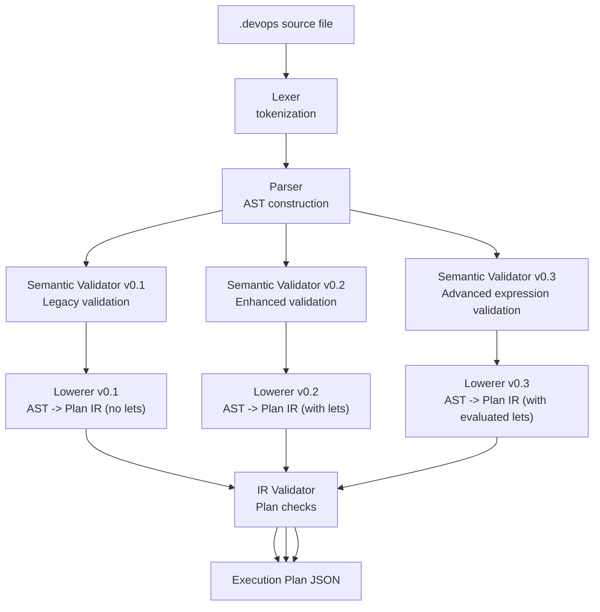
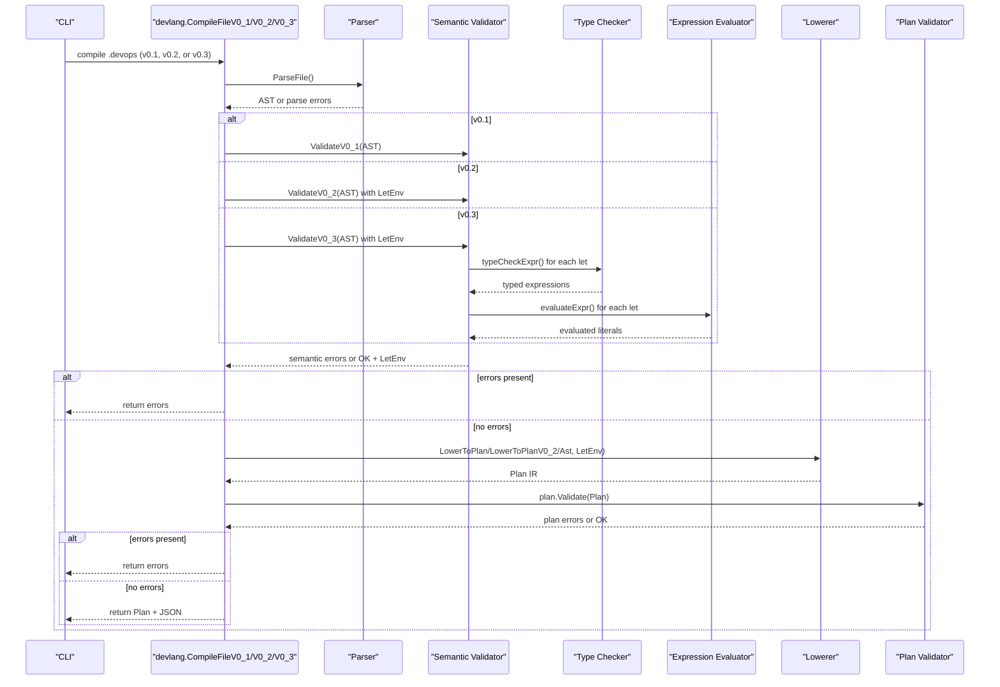
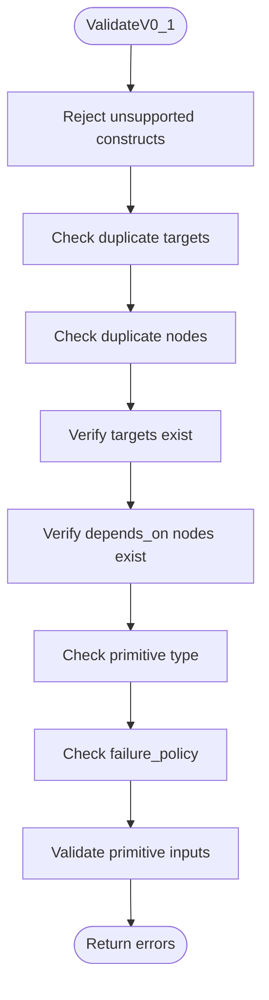
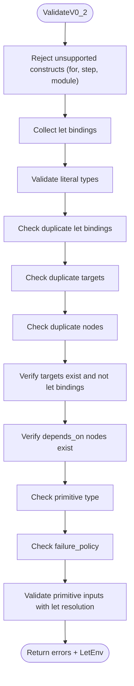
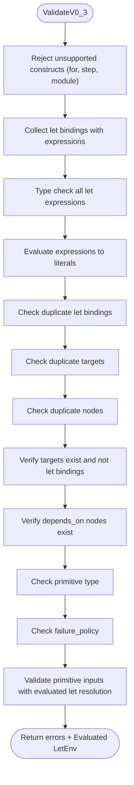
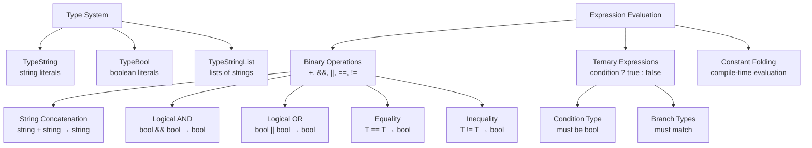
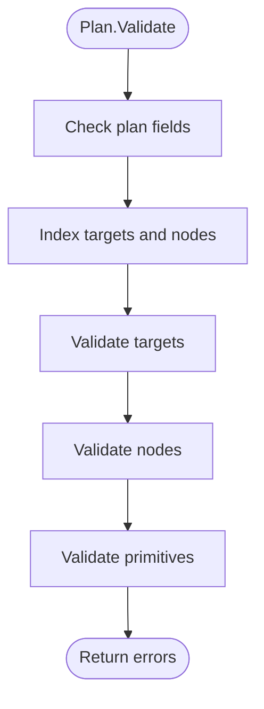
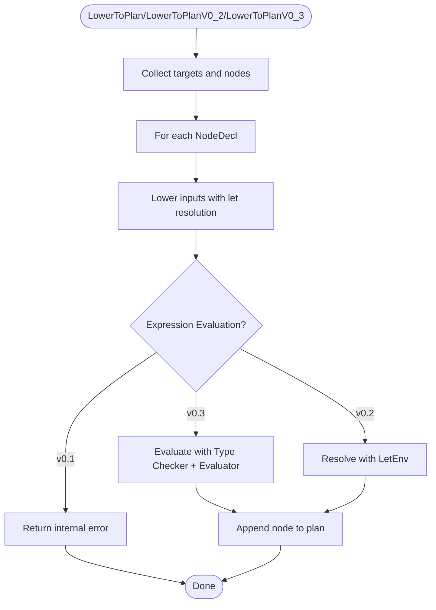
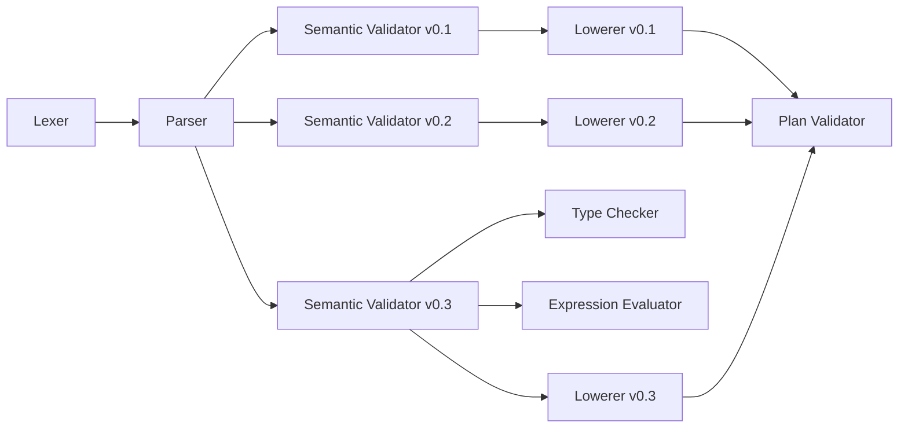

# Validation Rules and Constraints

<cite>
**Referenced Files in This Document**
- [validate.go](file://internal/devlang/validate.go)
- [parser.go](file://internal/devlang/parser.go)
- [lexer.go](file://internal/devlang/lexer.go)
- [ast.go](file://internal/devlang/ast.go)
- [lower.go](file://internal/devlang/lower.go)
- [types.go](file://internal/devlang/types.go)
- [eval.go](file://internal/devlang/eval.go)
- [schema.go](file://internal/plan/schema.go)
- [validate.go](file://internal/plan/validate.go)
- [validate_test.go](file://internal/plan/validate_test.go)
- [compile_test.go](file://internal/devlang/compile_test.go)
- [main.go](file://cmd/devopsctl/main.go)
- [plan.devops](file://plan.devops)
- [plan_resume.devops](file://tests/e2e/plan_resume.devops)
- [comprehensive.devops](file://tests/v0_3/valid/comprehensive.devops)
- [concat.devops](file://tests/v0_3/valid/concat.devops)
- [logical.devops](file://tests/v0_3/valid/logical.devops)
- [ternary.devops](file://tests/v0_3/valid/ternary.devops)
- [type_mismatch.devops](file://tests/v0_3/invalid/type_mismatch.devops)
- [unresolved_var.devops](file://tests/v0_3/invalid/unresolved_var.devops)
- [expr_version.devops](file://tests/v0_3/hash_stability/expr_version.devops)
- [literal_version.devops](file://tests/v0_3/hash_stability/literal_version.devops)
</cite>

## Update Summary
**Changes Made**
- Added comprehensive documentation for v0.3 language validation rules and enhanced expression evaluation
- Documented new type checking system with three distinct types (string, bool, string[])
- Added detailed coverage of advanced expression constructs including binary operations, logical operators, equality comparisons, and ternary expressions
- Updated validation architecture to include pre-evaluation type checking and constant folding
- Expanded error reporting with enhanced diagnostics for expression evaluation failures
- Added comprehensive test coverage for v0.3 language constructs including valid and invalid scenarios

## Table of Contents
1. [Introduction](#introduction)
2. [Project Structure](#project-structure)
3. [Core Components](#core-components)
4. [Architecture Overview](#architecture-overview)
5. [Detailed Component Analysis](#detailed-component-analysis)
6. [Comprehensive Validation Tests](#comprehensive-validation-tests)
7. [Dependency Analysis](#dependency-analysis)
8. [Performance Considerations](#performance-considerations)
9. [Troubleshooting Guide](#troubleshooting-guide)
10. [Conclusion](#conclusion)
11. [Appendices](#appendices)

## Introduction
This document explains the validation rules and constraints enforced by the .devops language compiler and planner across multiple language versions, with comprehensive coverage of the new v0.3 language constructs. It covers semantic validation during compilation (type checking, scope resolution, constraint verification), the IR-level validation performed against the execution plan, and how these validations relate to runtime safety guarantees. The documentation now includes extensive coverage of v0.3 enhancements, particularly around advanced expression evaluation, type checking, and enhanced error reporting for complex expressions.

**Updated** Enhanced with comprehensive semantic validation tests covering language versions 0.1, 0.2, and 0.3, including new features like advanced expression evaluation, type checking, and constant folding capabilities.

## Project Structure
The validation pipeline spans several layers and supports multiple language versions with progressively enhanced capabilities:
- Lexical analysis: tokenization of .devops source into tokens.
- Parsing: construction of an AST from tokens.
- Semantic validation: language-version-specific checks on the AST with v0.3 adding type checking and expression evaluation.
- Lowering: conversion of AST to an intermediate representation (IR) plan.
- IR validation: structural and type checks on the plan.

**Diagram sources**
- [lexer.go](file://internal/devlang/lexer.go#L60-L100)
- [parser.go](file://internal/devlang/parser.go#L28-L78)
- [validate.go](file://internal/devlang/validate.go#L23-L194)
- [validate.go](file://internal/devlang/validate.go#L196-L315)
- [validate.go](file://internal/devlang/validate.go#L493-L677)
- [lower.go](file://internal/devlang/lower.go#L10-L65)
- [lower.go](file://internal/devlang/lower.go#L92-L148)
- [validate.go](file://internal/plan/validate.go#L7-L94)

**Section sources**
- [lexer.go](file://internal/devlang/lexer.go#L1-L247)
- [parser.go](file://internal/devlang/parser.go#L1-L495)
- [validate.go](file://internal/devlang/validate.go#L1-L717)
- [lower.go](file://internal/devlang/lower.go#L1-L179)
- [validate.go](file://internal/plan/validate.go#L1-L95)

## Core Components
- Semantic validator for language version 0.1: rejects unsupported constructs, enforces duplicate detection, validates node-level constraints, and performs primitive-specific input checks.
- Semantic validator for language version 0.2: extends v0.1 validation with let binding support, literal type restrictions, and enhanced duplicate detection.
- Semantic validator for language version 0.3: extends v0.2 validation with advanced expression evaluation, type checking, constant folding, and comprehensive error reporting.
- IR validator: ensures plan-level correctness (presence of required fields, known targets/nodes, valid failure policies, and primitive inputs).
- Lowerer: transforms AST into a plan with concrete values, enforcing that only supported expressions are lowered.

Key responsibilities:
- Language version 0.1: Reject unsupported constructs (let, for, step, module) and enforce strict validation rules.
- Language version 0.2: Support let bindings with literal type restrictions, enhanced duplicate detection, and improved error reporting.
- Language version 0.3: Support advanced expressions with type checking, constant folding, comprehensive error reporting, and enhanced validation.
- Scope resolution via symbol tables for targets and nodes.
- Constraint checks for node types, targets, depends_on, failure_policy, and primitive inputs.
- IR-level checks mirroring AST-level checks to catch issues early.

**Section sources**
- [validate.go](file://internal/devlang/validate.go#L23-L194)
- [validate.go](file://internal/devlang/validate.go#L196-L315)
- [validate.go](file://internal/devlang/validate.go#L493-L677)
- [validate.go](file://internal/plan/validate.go#L7-L94)
- [lower.go](file://internal/devlang/lower.go#L10-L179)

## Architecture Overview
The validation architecture separates concerns across stages and supports multiple language versions with progressive enhancement:
- Language-level checks occur before lowering to ensure only supported constructs are accepted.
- IR-level checks ensure the plan is structurally sound and consistent with runtime expectations.
- Language version 0.3 introduces advanced expression evaluation with type checking, constant folding, and comprehensive error reporting.

**Diagram sources**
- [main.go](file://cmd/devopsctl/main.go#L49-L72)
- [validate.go](file://internal/devlang/validate.go#L455-L491)
- [parser.go](file://internal/devlang/parser.go#L28-L39)
- [validate.go](file://internal/devlang/validate.go#L23-L194)
- [validate.go](file://internal/devlang/validate.go#L196-L315)
- [validate.go](file://internal/devlang/validate.go#L493-L677)
- [types.go](file://internal/devlang/types.go#L27-L182)
- [eval.go](file://internal/devlang/eval.go#L5-L181)
- [lower.go](file://internal/devlang/lower.go#L10-L65)
- [lower.go](file://internal/devlang/lower.go#L92-L148)
- [validate.go](file://internal/plan/validate.go#L7-L94)

## Detailed Component Analysis

### Semantic Validation (Language Version 0.1)
Semantic validation enforces:
- Unsupported constructs are rejected outright.
- Duplicate target and node declarations are detected.
- Targets referenced by nodes must exist.
- depends_on entries must reference existing nodes.
- Node type must be a known primitive.
- Failure policy must be one of the allowed values.
- Primitive-specific input constraints are checked.

**Diagram sources**
- [validate.go](file://internal/devlang/validate.go#L196-L315)

Key rules and diagnostics:
- Unsupported constructs: let, for, step, module are rejected with explicit messages indicating language version 0.1 limitations.
- Duplicate declarations: duplicate target or node names produce errors with precise positions.
- Unknown references: unknown target or node in depends_on produces errors with positions.
- Primitive types: only allowed primitives are accepted; others produce errors.
- Failure policy: must be one of halt, continue, rollback; otherwise error.
- Primitive inputs:
  - file.sync requires src and dest as string literals.
  - process.exec requires cmd as a non-empty list of string literals and cwd as a string literal.

**Section sources**
- [validate.go](file://internal/devlang/validate.go#L200-L227)
- [validate.go](file://internal/devlang/validate.go#L234-L261)
- [validate.go](file://internal/devlang/validate.go#L264-L312)
- [validate.go](file://internal/devlang/validate.go#L317-L382)

### Semantic Validation (Language Version 0.2)
Semantic validation enforces enhanced rules for language version 0.2:
- Unsupported constructs are rejected (for, step, module) while allowing let bindings.
- Let bindings are collected and validated for literal type restrictions.
- Duplicate let, target, and node declarations are detected.
- Targets referenced by nodes must exist and cannot reference let bindings.
- depends_on entries must reference existing nodes.
- Node type must be a known primitive.
- Failure policy must be one of the allowed values.
- Primitive-specific input constraints are checked with let resolution.

**Diagram sources**
- [validate.go](file://internal/devlang/validate.go#L23-L194)

Key rules and diagnostics for v0.2:
- Unsupported constructs: for, step, module are rejected with explicit messages indicating language version 0.2 limitations.
- Let bindings: supported with literal type restrictions (string, bool, or list of string literals).
- Duplicate declarations: duplicate let, target, or node names produce errors with precise positions.
- Let binding restrictions: let bindings cannot be used in targets; targets must reference target declarations.
- Unknown references: unknown target or node in depends_on produces errors with positions.
- Primitive types: only allowed primitives are accepted; others produce errors.
- Failure policy: must be one of halt, continue, rollback; otherwise error.
- Primitive inputs:
  - file.sync requires src and dest as string literals.
  - process.exec requires cmd as a non-empty list of string literals and cwd as a string literal.

**Section sources**
- [validate.go](file://internal/devlang/validate.go#L28-L50)
- [validate.go](file://internal/devlang/validate.go#L56-L92)
- [validate.go](file://internal/devlang/validate.go#L98-L125)
- [validate.go](file://internal/devlang/validate.go#L127-L191)
- [validate.go](file://internal/devlang/validate.go#L317-L382)

### Semantic Validation (Language Version 0.3)
Semantic validation enforces the most comprehensive rules for language version 0.3:
- Unsupported constructs are rejected (for, step, module) while allowing advanced let bindings with expressions.
- Let bindings are collected with full expression support and undergo type checking.
- Expression evaluation performs constant folding to convert expressions to literals.
- Duplicate let, target, and node declarations are detected.
- Targets referenced by nodes must exist and cannot reference let bindings.
- depends_on entries must reference existing nodes.
- Node type must be a known primitive.
- Failure policy must be one of the allowed values.
- Primitive-specific input constraints are checked with fully evaluated let resolution.

**Diagram sources**
- [validate.go](file://internal/devlang/validate.go#L493-L677)
- [types.go](file://internal/devlang/types.go#L27-L182)
- [eval.go](file://internal/devlang/eval.go#L5-L181)

Key rules and diagnostics for v0.3:
- Unsupported constructs: for, step, module are rejected with explicit messages indicating language version 0.3 limitations.
- Advanced let bindings: support expressions including binary operations, logical operators, equality comparisons, and ternary expressions.
- Type checking: comprehensive type inference with three distinct types (string, bool, string[]) and strict type enforcement.
- Expression evaluation: constant folding converts expressions to concrete literals at compile time.
- Duplicate declarations: duplicate let, target, or node names produce errors with precise positions.
- Let binding restrictions: let bindings cannot be used in targets; targets must reference target declarations.
- Unknown references: unresolved identifiers in expressions produce detailed error messages.
- Primitive types: only allowed primitives are accepted; others produce errors.
- Failure policy: must be one of halt, continue, rollback; otherwise error.
- Primitive inputs:
  - file.sync requires src and dest as string literals.
  - process.exec requires cmd as a non-empty list of string literals and cwd as a string literal.

**Section sources**
- [validate.go](file://internal/devlang/validate.go#L498-L520)
- [validate.go](file://internal/devlang/validate.go#L526-L543)
- [validate.go](file://internal/devlang/validate.go#L549-L557)
- [validate.go](file://internal/devlang/validate.go#L563-L572)
- [validate.go](file://internal/devlang/validate.go#L581-L608)
- [validate.go](file://internal/devlang/validate.go#L611-L674)
- [types.go](file://internal/devlang/types.go#L27-L182)
- [eval.go](file://internal/devlang/eval.go#L5-L181)

### Type System and Expression Evaluation
The v0.3 type system introduces a comprehensive type checking framework:

**Type System:**
- TypeString: Represents string literals and string expressions
- TypeBool: Represents boolean literals and boolean expressions  
- TypeStringList: Represents lists of strings with special handling

**Expression Evaluation:**
- Binary expressions: + (string concatenation), && (logical AND), || (logical OR), == (equality), != (inequality)
- Ternary expressions: condition ? true_value : false_value with type constraint enforcement
- Constant folding: expressions are evaluated at compile time to produce concrete literals
- Recursive evaluation: nested expressions are resolved through recursive evaluation

**Diagram sources**
- [types.go](file://internal/devlang/types.go#L5-L25)
- [types.go](file://internal/devlang/types.go#L76-L142)
- [types.go](file://internal/devlang/types.go#L144-L174)
- [eval.go](file://internal/devlang/eval.go#L49-L149)
- [eval.go](file://internal/devlang/eval.go#L151-L172)

**Section sources**
- [types.go](file://internal/devlang/types.go#L5-L25)
- [types.go](file://internal/devlang/types.go#L27-L182)
- [eval.go](file://internal/devlang/eval.go#L5-L181)

### IR-Level Validation
After lowering, the plan is validated for structural correctness:
- Plan-level fields: version, targets, nodes must be present and non-empty.
- Target-level fields: id and address must be present.
- Node-level fields: id, type, targets must be present; targets must reference known targets; depends_on must reference known nodes; failure_policy must be one of allowed values.
- Primitive-specific checks mirror AST-level checks.

**Diagram sources**
- [validate.go](file://internal/plan/validate.go#L7-L94)
- [schema.go](file://internal/plan/schema.go#L12-L39)

**Section sources**
- [validate.go](file://internal/plan/validate.go#L7-L94)
- [schema.go](file://internal/plan/schema.go#L12-L39)

### Lowering and Expression Evaluation
Lowering converts AST expressions into concrete values for the plan with different approaches for each language version:

**Language Version 0.1 Lowering:**
- String literals and boolean literals are preserved.
- Lists are lowered into arrays of strings when all elements are string literals.
- Identifiers are not lowered as values in v0.1; encountering an identifier as a value produces an internal error.
- Unsupported expression nodes produce internal errors.

**Language Version 0.2 Lowering:**
- String literals and boolean literals are preserved.
- Lists are lowered into arrays of strings when all elements are string literals.
- Identifiers are resolved using the let environment; if not found, produces an internal error.
- Unsupported expression nodes produce internal errors.

**Language Version 0.3 Lowering:**
- String literals, boolean literals, and list literals are preserved.
- All let expressions are fully evaluated to concrete literals through constant folding.
- Identifiers are resolved using the evaluated let environment.
- Complex expressions are evaluated to their final literal values.

**Diagram sources**
- [lower.go](file://internal/devlang/lower.go#L10-L65)
- [lower.go](file://internal/devlang/lower.go#L92-L148)
- [lower.go](file://internal/devlang/lower.go#L150-L179)
- [validate.go](file://internal/devlang/validate.go#L563-L572)
- [validate.go](file://internal/devlang/validate.go#L691)

**Section sources**
- [lower.go](file://internal/devlang/lower.go#L10-L91)
- [lower.go](file://internal/devlang/lower.go#L92-L179)
- [validate.go](file://internal/devlang/validate.go#L563-L572)
- [validate.go](file://internal/devlang/validate.go#L691)

### Example Constructs: Valid vs Invalid
Valid constructs:
- A target with a string address.
- A node with type file.sync or process.exec and required inputs.
- Nodes with depends_on referencing other nodes by ID.
- Nodes with failure_policy set to one of halt, continue, rollback.
- **Language Version 0.2**: Let bindings with string, bool, or list of string literal values.
- **Language Version 0.3**: Advanced expressions including string concatenation, logical operations, equality comparisons, and ternary expressions with proper type checking.

Invalid constructs:
- Using unsupported constructs (for, step, module) in v0.1, v0.2, or v0.3.
- Duplicate target, node, or let bindings.
- Referencing unknown targets or nodes in depends_on.
- Using an unknown primitive type.
- Omitting required attributes for primitives (e.g., missing src or dest for file.sync, missing cmd or cwd for process.exec).
- Setting failure_policy to an invalid value.
- **Language Version 0.2**: Using identifiers in targets or let bindings with non-literal values.
- **Language Version 0.3**: Type mismatches in expressions, unresolved identifiers, and unsupported expression types.

Examples in the repository:
- Valid plan examples demonstrate correct usage of targets and nodes with primitives.
- An end-to-end plan with depends_on illustrates ordering and dependency validation.
- **Language Version 0.2**: Examples show let bindings with string and list literal values.
- **Language Version 0.3**: Comprehensive examples demonstrate advanced expressions, type checking, and constant folding.

**Section sources**
- [plan.devops](file://plan.devops#L1-L20)
- [plan_resume.devops](file://tests/e2e/plan_resume.devops#L1-L43)
- [compile_test.go](file://internal/devlang/compile_test.go#L211-L303)
- [comprehensive.devops](file://tests/v0_3/valid/comprehensive.devops#L1-L46)
- [concat.devops](file://tests/v0_3/valid/concat.devops#L1-L15)
- [logical.devops](file://tests/v0_3/valid/logical.devops#L1-L16)
- [ternary.devops](file://tests/v0_3/valid/ternary.devops#L1-L17)

## Comprehensive Validation Tests

### Test Coverage Overview
The validation system includes comprehensive test coverage for all language versions with enhanced coverage for v0.3:

#### Language Version 0.1 Test Coverage
- Unknown target detection
- Duplicate node detection
- Invalid failure policy validation
- Unsupported construct testing (let, for, step, module)

#### Language Version 0.2 Test Coverage
- Enhanced unsupported construct testing
- Let binding validation with literal type restrictions
- Duplicate let binding detection
- Let binding in targets rejection
- Complex let binding scenarios

#### Language Version 0.3 Test Coverage
- Advanced expression evaluation testing
- Type checking validation for all expression types
- Constant folding verification
- Error reporting for type mismatches
- Unresolved identifier handling
- Hash stability testing for expression evaluation

```mermaid
flowchart TD
TestSuite["Validation Test Suite"] --> V01Tests["v0.1 Tests"]
TestSuite --> V02Tests["v0.2 Tests"]
TestSuite --> V03Tests["v0.3 Tests"]
V01Tests --> UnknownTarget["Unknown Target Tests"]
V01Tests --> DuplicateNode["Duplicate Node Tests"]
V01Tests --> InvalidPolicy["Invalid Failure Policy Tests"]
V01Tests --> UnsupportedConstruct["Unsupported Construct Tests"]
V02Tests --> EnhancedUnsupported["Enhanced Unsupported Construct Tests"]
V02Tests --> LetBindings["Let Binding Tests"]
V02Tests --> DuplicateLet["Duplicate Let Tests"]
V02Tests --> LetInTargets["Let In Targets Tests"]
V03Tests --> AdvancedExpr["Advanced Expression Tests"]
V03Tests --> TypeChecking["Type Checking Tests"]
V03Tests --> ConstFolding["Constant Folding Tests"]
V03Tests --> ErrorReporting["Error Reporting Tests"]
V03Tests --> HashStability["Hash Stability Tests"]
UnknownTarget --> UTExpected["Expected 'unknown target' errors"]
DuplicateNode --> DNExpected["Expected 'duplicate node' errors"]
InvalidPolicy --> IPExpected["Expected 'invalid failure_policy' errors"]
UnsupportedConstruct --> UCExpected["Expected 'not supported' errors"]
EnhancedUnsupported --> EUCExpected["Expected 'not supported' errors"]
LetBindings --> LBExpected["Expected literal type validation"]
DuplicateLet --> DLExpected["Expected 'duplicate let' errors"]
LetInTargets --> LITExpected["Expected 'cannot be used in targets' errors"]
AdvancedExpr --> AEExpected["Expected expression evaluation"]
TypeChecking --> TCExpected["Expected type checking"]
ConstFolding --> CFExpected["Expected constant folding"]
ErrorReporting --> ERExpected["Expected detailed error messages"]
HashStability --> HSExpected["Expected stable hash values"]
```

**Diagram sources**
- [compile_test.go](file://internal/devlang/compile_test.go#L118-L429)

**Section sources**
- [compile_test.go](file://internal/devlang/compile_test.go#L118-L429)

### Test Case Analysis

#### Language Version 0.1 Test Cases
The v0.1 test suite verifies:
- Unknown target validation: Node declaration with reference to non-existent target "prod" produces "unknown target" error.
- Duplicate node detection: Two node declarations with identical names "dup" produce "duplicate node" error.
- Invalid failure policy: Node with unsupported failure_policy "fast" produces "invalid failure_policy" error.
- Unsupported construct testing: Parsing of unsupported constructs (let, for, step, module) produces immediate semantic errors.

#### Language Version 0.2 Test Cases
The v0.2 test suite expands coverage:
- Enhanced unsupported construct testing: Validates rejection of for, step, and module constructs.
- Let binding validation: Tests string literals, bool literals, and list literals for let bindings.
- Duplicate let detection: Two let declarations with identical names "x" produce "duplicate let" error.
- Literal type restrictions: Identifiers and non-string list elements in let values produce "must be a string, bool, or list of string literals" errors.
- Let binding in targets: Using let bindings in targets produces "cannot be used in targets" error.
- Complex scenarios: String and list let bindings successfully compile to plans with resolved values.

#### Language Version 0.3 Test Cases
The v0.3 test suite provides comprehensive coverage:
- **Advanced expression evaluation**: String concatenation, logical operations, equality comparisons, and ternary expressions.
- **Type checking validation**: Ensures proper type inference and enforcement for all expression types.
- **Constant folding verification**: Confirms expressions are evaluated to concrete literals at compile time.
- **Error reporting**: Provides detailed error messages for type mismatches, unresolved identifiers, and unsupported operations.
- **Hash stability testing**: Verifies that expression evaluation produces consistent hash values across compilations.

**Section sources**
- [compile_test.go](file://internal/devlang/compile_test.go#L118-L429)
- [comprehensive.devops](file://tests/v0_3/valid/comprehensive.devops#L1-L46)
- [concat.devops](file://tests/v0_3/valid/concat.devops#L1-L15)
- [logical.devops](file://tests/v0_3/valid/logical.devops#L1-L16)
- [ternary.devops](file://tests/v0_3/valid/ternary.devops#L1-L17)
- [type_mismatch.devops](file://tests/v0_3/invalid/type_mismatch.devops#L1-L13)
- [unresolved_var.devops](file://tests/v0_3/invalid/unresolved_var.devops#L1-L13)
- [expr_version.devops](file://tests/v0_3/hash_stability/expr_version.devops#L1-L13)
- [literal_version.devops](file://tests/v0_3/hash_stability/literal_version.devops#L1-L13)

## Dependency Analysis
The validation pipeline depends on:
- Lexer and Parser for correct AST construction.
- Semantic Validator (v0.1, v0.2, and v0.3) for language-version-specific checks with v0.3 adding type checking and expression evaluation.
- Type Checker (v0.3) for comprehensive type inference and validation.
- Expression Evaluator (v0.3) for constant folding and expression resolution.
- Lowerer (v0.1, v0.2, and v0.3) for converting AST to plan IR with enhanced let environment support.
- Plan Validator for structural correctness.

**Diagram sources**
- [lexer.go](file://internal/devlang/lexer.go#L60-L100)
- [parser.go](file://internal/devlang/parser.go#L28-L78)
- [validate.go](file://internal/devlang/validate.go#L23-L194)
- [validate.go](file://internal/devlang/validate.go#L196-L315)
- [validate.go](file://internal/devlang/validate.go#L493-L677)
- [types.go](file://internal/devlang/types.go#L27-L182)
- [eval.go](file://internal/devlang/eval.go#L5-L181)
- [lower.go](file://internal/devlang/lower.go#L10-L179)
- [validate.go](file://internal/plan/validate.go#L7-L94)

**Section sources**
- [lexer.go](file://internal/devlang/lexer.go#L1-L247)
- [parser.go](file://internal/devlang/parser.go#L1-L495)
- [validate.go](file://internal/devlang/validate.go#L1-L717)
- [lower.go](file://internal/devlang/lower.go#L1-L179)
- [validate.go](file://internal/plan/validate.go#L1-L95)

## Performance Considerations
- Validation is linear in the number of declarations and nodes.
- Duplicate detection and cross-reference checks use maps for O(1) average-time lookups.
- Early rejection of unsupported constructs avoids unnecessary downstream work.
- IR validation mirrors AST checks to catch issues earlier and reduce runtime surprises.
- **Language Version 0.2**: Let environment collection uses O(n) time where n is the number of let declarations.
- **Language Version 0.3**: Type checking and expression evaluation add computational overhead but provide compile-time safety guarantees.
- **Language Version 0.3**: Constant folding eliminates runtime computation for expressions, improving performance at execution time.

## Troubleshooting Guide
Common validation failures and remedies:

### Language Version 0.1 Issues
- Unsupported construct in v0.1:
  - Symptom: Error indicating the construct is not supported.
  - Fix: Remove unsupported constructs or upgrade language version if applicable.
  - Reference: [validate.go](file://internal/devlang/validate.go#L200-L227)
- Duplicate target or node:
  - Symptom: Error indicating duplicate declaration.
  - Fix: Rename one of the conflicting declarations.
  - Reference: [validate.go](file://internal/devlang/validate.go#L234-L261)
- Unknown target or node reference:
  - Symptom: Error indicating unknown target or node in depends_on.
  - Fix: Define the referenced target/node or correct the name.
  - Reference: [validate.go](file://internal/devlang/validate.go#L264-L285)
- Unknown primitive type:
  - Symptom: Error indicating unknown primitive type.
  - Fix: Use a supported primitive type.
  - Reference: [validate.go](file://internal/devlang/validate.go#L287-L297)
- Invalid failure_policy:
  - Symptom: Error indicating invalid failure policy.
  - Fix: Set failure_policy to one of halt, continue, rollback.
  - Reference: [validate.go](file://internal/devlang/validate.go#L299-L309)
- Primitive input constraints:
  - file.sync requires src and dest as string literals.
  - process.exec requires cmd as a non-empty list of string literals and cwd as a string literal.
  - Fix: Provide correct types and values for required attributes.
  - References: [validate.go](file://internal/devlang/validate.go#L317-L382)

### Language Version 0.2 Issues
- Unsupported construct in v0.2:
  - Symptom: Error indicating the construct is not supported.
  - Fix: Remove unsupported constructs (for, step, module) or use supported alternatives.
  - Reference: [validate.go](file://internal/devlang/validate.go#L28-L50)
- Duplicate let binding:
  - Symptom: Error indicating duplicate let declaration.
  - Fix: Rename one of the conflicting let bindings.
  - Reference: [validate.go](file://internal/devlang/validate.go#L63-L70)
- Let binding literal type restrictions:
  - Symptom: Error indicating invalid let value type.
  - Fix: Use string, bool, or list of string literals for let values.
  - Reference: [validate.go](file://internal/devlang/validate.go#L72-L91)
- Let binding in targets:
  - Symptom: Error indicating let binding cannot be used in targets.
  - Fix: Replace let binding with direct target reference.
  - Reference: [validate.go](file://internal/devlang/validate.go#L131-L137)
- Identifier as value in v0.2:
  - Symptom: Internal error indicating identifiers cannot be lowered as values.
  - Fix: Use string literals or lists of string literals for primitive inputs.
  - References: [lower.go](file://internal/devlang/lower.go#L166-L174)

### Language Version 0.3 Issues
- Unsupported construct in v0.3:
  - Symptom: Error indicating the construct is not supported.
  - Fix: Remove unsupported constructs (for, step, module) or use supported alternatives.
  - Reference: [validate.go](file://internal/devlang/validate.go#L498-L520)
- Duplicate let binding:
  - Symptom: Error indicating duplicate let declaration.
  - Fix: Rename one of the conflicting let bindings.
  - Reference: [validate.go](file://internal/devlang/validate.go#L533-L540)
- Let binding expression type checking:
  - Symptom: Error indicating type mismatch in expression.
  - Fix: Ensure all operands have compatible types for the operation.
  - Reference: [types.go](file://internal/devlang/types.go#L86-L142)
- Expression evaluation errors:
  - Symptom: Error indicating unsupported expression type or unresolved identifier.
  - Fix: Use supported expression constructs and ensure all identifiers are defined.
  - References: [eval.go](file://internal/devlang/eval.go#L144-L180)
- Constant folding failures:
  - Symptom: Error indicating expression cannot be evaluated to a literal.
  - Fix: Ensure expressions contain only literals and supported operations.
  - References: [eval.go](file://internal/devlang/eval.go#L174-L180)
- Type mismatch in ternary expressions:
  - Symptom: Error indicating branches have different types.
  - Fix: Ensure both branches of ternary expressions have the same type.
  - Reference: [types.go](file://internal/devlang/types.go#L166-L172)
- List comparison not supported:
  - Symptom: Error indicating comparison of string lists is not allowed.
  - Fix: Compare individual string elements instead of entire lists.
  - Reference: [types.go](file://internal/devlang/types.go#L126-L133)

### IR-level Errors
- Missing plan fields, targets, or nodes; missing target id/address; missing node id/type/targets; unknown depends_on or when.node; invalid failure_policy; missing or invalid primitive inputs.
- Fix: Ensure all required fields are present and valid.
- References: [validate.go](file://internal/plan/validate.go#L7-L94), [schema.go](file://internal/plan/schema.go#L12-L39)

**Section sources**
- [validate.go](file://internal/devlang/validate.go#L28-L382)
- [validate.go](file://internal/devlang/validate.go#L493-L677)
- [validate.go](file://internal/plan/validate.go#L7-L94)
- [lower.go](file://internal/devlang/lower.go#L150-L179)
- [schema.go](file://internal/plan/schema.go#L12-L39)
- [types.go](file://internal/devlang/types.go#L27-L182)
- [eval.go](file://internal/devlang/eval.go#L5-L181)

## Conclusion
The .devops language enforces strict validation at both the language and IR levels across multiple language versions. Language-level checks prevent unsupported constructs and enforce scoping and primitive constraints, while IR-level checks ensure structural correctness and consistency. The enhanced validation system now supports language version 0.3 with comprehensive expression evaluation capabilities, advanced type checking, constant folding, and improved error reporting. The comprehensive test suite provides extensive coverage for common error scenarios across all language versions, enabling developers to quickly identify and resolve validation issues. Together, these validations provide strong safety guarantees for runtime execution by catching errors early and preventing malformed plans from reaching the orchestrator.

## Appendices

### Relationship Between Validation Rules and Runtime Safety
- Early detection of unsupported constructs prevents undefined behavior at runtime.
- Duplicate detection and cross-reference checks ensure deterministic execution order and avoid ambiguous references.
- Primitive input validation ensures that runtime primitives receive the expected types and values, reducing failures during node execution.
- IR validation ensures the plan is self-consistent, preventing crashes due to missing or inconsistent metadata.
- **Language Version 0.2**: Let binding validation ensures compile-time safety for dynamic configuration values while maintaining runtime reliability.
- **Language Version 0.3**: Advanced expression evaluation with type checking and constant folding eliminates runtime computation errors and improves performance by pre-computing values at compile time.

**Section sources**
- [validate.go](file://internal/devlang/validate.go#L23-L382)
- [validate.go](file://internal/devlang/validate.go#L493-L677)
- [validate.go](file://internal/plan/validate.go#L7-L94)
- [lower.go](file://internal/devlang/lower.go#L92-L179)
- [types.go](file://internal/devlang/types.go#L27-L182)
- [eval.go](file://internal/devlang/eval.go#L5-L181)