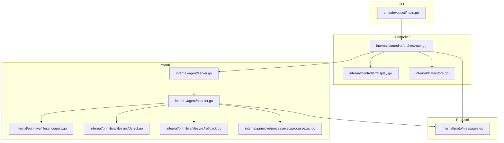
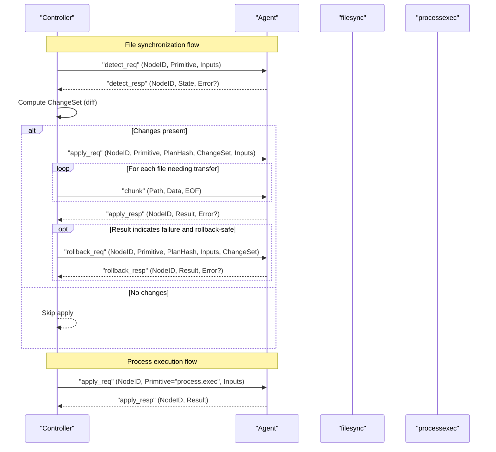
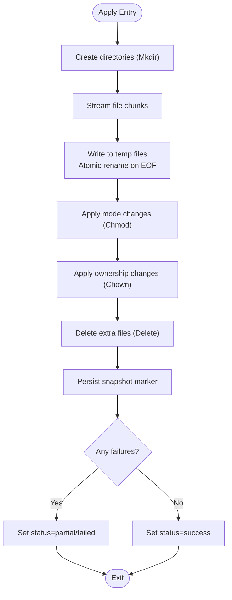
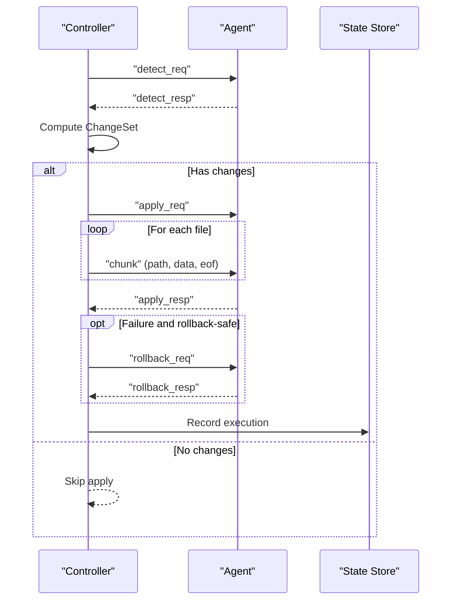
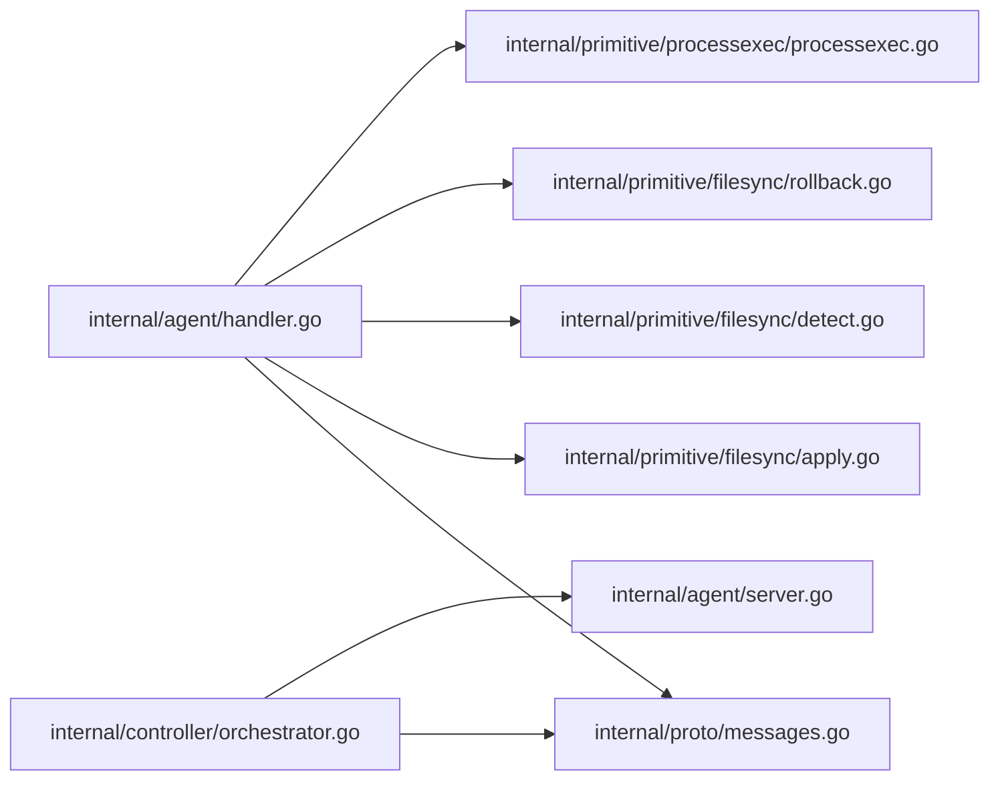

# Agent Communication Protocol

<cite>
**Referenced Files in This Document**
- [messages.go](file://internal/proto/messages.go)
- [server.go](file://internal/agent/server.go)
- [handler.go](file://internal/agent/handler.go)
- [processexec.go](file://internal/primitive/processexec/processexec.go)
- [apply.go](file://internal/primitive/filesync/apply.go)
- [diff.go](file://internal/primitive/filesync/diff.go)
- [detect.go](file://internal/primitive/filesync/detect.go)
- [rollback.go](file://internal/primitive/filesync/rollback.go)
- [orchestrator.go](file://internal/controller/orchestrator.go)
- [display.go](file://internal/controller/display.go)
- [store.go](file://internal/state/store.go)
- [main.go](file://cmd/devopsctl/main.go)
- [go.mod](file://go.mod)
</cite>

## Table of Contents
1. [Introduction](#introduction)
2. [Project Structure](#project-structure)
3. [Core Components](#core-components)
4. [Architecture Overview](#architecture-overview)
5. [Detailed Component Analysis](#detailed-component-analysis)
6. [Dependency Analysis](#dependency-analysis)
7. [Performance Considerations](#performance-considerations)
8. [Troubleshooting Guide](#troubleshooting-guide)
9. [Conclusion](#conclusion)
10. [Appendices](#appendices)

## Introduction
This document specifies the DevOpsCtl agent communication protocol. It defines the TCP-based wire protocol, message types, serialization format, and envelope structure. It also documents the controller-agent interaction patterns, including connection establishment, message exchange, and session management. The handler architecture for processing primitive operations (file synchronization and process execution) is explained, along with error handling, protocol versioning, and security considerations. Practical examples illustrate typical flows for file synchronization and process execution, and guidance is provided for deployment, networking, and diagnostics.

## Project Structure
The protocol spans three primary areas:
- Protocol definitions: shared message envelopes and data structures
- Agent server: TCP listener, connection handling, and primitive dispatch
- Controller orchestration: connection management, message sequencing, and state persistence

**Diagram sources**
- [messages.go](file://internal/proto/messages.go#L1-L117)
- [server.go](file://internal/agent/server.go#L1-L51)
- [handler.go](file://internal/agent/handler.go#L1-L189)
- [processexec.go](file://internal/primitive/processexec/processexec.go#L1-L83)
- [apply.go](file://internal/primitive/filesync/apply.go#L1-L252)
- [detect.go](file://internal/primitive/filesync/detect.go#L1-L105)
- [rollback.go](file://internal/primitive/filesync/rollback.go#L1-L83)
- [orchestrator.go](file://internal/controller/orchestrator.go#L1-L653)
- [display.go](file://internal/controller/display.go#L1-L44)
- [store.go](file://internal/state/store.go#L1-L226)
- [main.go](file://cmd/devopsctl/main.go#L1-L273)

**Section sources**
- [messages.go](file://internal/proto/messages.go#L1-L117)
- [server.go](file://internal/agent/server.go#L1-L51)
- [handler.go](file://internal/agent/handler.go#L1-L189)
- [orchestrator.go](file://internal/controller/orchestrator.go#L1-L653)
- [main.go](file://cmd/devopsctl/main.go#L148-L160)

## Core Components
- Protocol envelope and message types define the wire format and semantics.
- Agent server listens on TCP, accepts connections, and spawns handlers.
- Handler processes line-delimited JSON messages and dispatches to primitives.
- Controller orchestrates detect-diff-apply cycles, streams file chunks, and persists state.
- Primitive implementations provide file synchronization and process execution.

Key responsibilities:
- Wire protocol: line-delimited JSON with a top-level envelope containing a type discriminator.
- Message envelopes: DetectReq, ApplyReq, RollbackReq, ChunkMsg, and corresponding responses.
- Data structures: FileTree, FileMeta, ChangeSet, Result.
- Agent lifecycle: listen, accept, spawn goroutine per connection, stateless per-connection processing.
- Controller lifecycle: connect, send requests, stream chunks, receive responses, persist state.

**Section sources**
- [messages.go](file://internal/proto/messages.go#L7-L117)
- [server.go](file://internal/agent/server.go#L15-L51)
- [handler.go](file://internal/agent/handler.go#L16-L51)
- [orchestrator.go](file://internal/controller/orchestrator.go#L313-L442)

## Architecture Overview
The controller and agent communicate over TCP using a line-delimited JSON protocol. The controller initiates a detect-diff-apply cycle for file synchronization and sends process execution commands directly. The agent responds with structured results and errors.

**Diagram sources**
- [orchestrator.go](file://internal/controller/orchestrator.go#L313-L442)
- [handler.go](file://internal/agent/handler.go#L53-L139)
- [messages.go](file://internal/proto/messages.go#L16-L117)

## Detailed Component Analysis

### Protocol Envelope and Message Types
- Envelope: every line is a JSON object with at least a type field.
- Request types:
  - detect_req: asks the agent to return the current file-tree state of a destination directory.
  - apply_req: instructs the agent to apply a changeset; file chunks follow immediately on the same connection.
  - rollback_req: asks the agent to undo the last apply for the given node.
  - chunk: carries one fragment of a file being streamed to the agent.
- Response types:
  - detect_resp: replies to detect_req with state and optional error.
  - apply_resp: replies to apply_req with result and optional error.
  - rollback_resp: replies to rollback_req with result and optional error.
- Shared data structures:
  - FileMeta: path, size, SHA-256, mode, UID, GID, is_dir.
  - FileTree: map of relative paths to FileMeta.
  - ChangeSet: lists of create, update, delete, chmod, chown, mkdir.
  - Result: status, class, exit_code, stdout, stderr, rollback_safe, plus legacy fields.

Versioning:
- The protocol does not include a dedicated version field. Versioning is implicit via supported message types and fields. Backward compatibility should be maintained by avoiding removal of required fields and by treating unknown fields as non-fatal.

Security:
- The protocol is plaintext JSON over TCP. There is no built-in encryption or authentication. Network encryption and authentication must be provided by external means (e.g., TLS termination proxy, VPN, or SSH tunneling).

**Section sources**
- [messages.go](file://internal/proto/messages.go#L7-L117)

### Agent Server Implementation
- Listener: TCP socket bound to configured address; signals are handled for graceful shutdown.
- Concurrency: accepts connections in a loop and spawns a goroutine per connection.
- Handler: per-connection stateless processing of line-delimited JSON messages.

Operational notes:
- The server does not implement connection pooling; each controller connection is independent and short-lived.
- Graceful shutdown is handled via signal notification context.

**Section sources**
- [server.go](file://internal/agent/server.go#L15-L51)

### Handler Architecture and Message Processing
- Line-delimited JSON: each line is parsed to determine the message type.
- Dispatch:
  - detect_req: validates inputs, invokes filesync.Detect for file.sync, returns FileTree; returns empty state for process.exec.
  - apply_req: for process.exec, executes command locally and returns result; for file.sync, streams file chunks, applies changes, and returns result.
  - rollback_req: for process.exec, returns a non-rollbackable result; for file.sync, restores from snapshot and returns result.
- Error handling: on malformed envelopes or processing errors, the handler writes an error response with type-specific node_id.

Concurrency:
- Stateless per-connection processing; no shared mutable state between requests on the same connection.

**Section sources**
- [handler.go](file://internal/agent/handler.go#L16-L189)

### File Synchronization Primitive
- Detect: walks destination directory, computes SHA-256 for files, normalizes paths, and returns FileTree.
- Diff: compares source and destination trees to compute ChangeSet; supports delete_extra, chmod, chown.
- Apply: streams file chunks, writes atomically, applies mode and ownership, deletes extras, snapshots pre-change state for rollback.
- Rollback: restores from snapshot, removes newly created files, cleans up snapshot markers.

**Diagram sources**
- [apply.go](file://internal/primitive/filesync/apply.go#L19-L204)

**Section sources**
- [detect.go](file://internal/primitive/filesync/detect.go#L19-L70)
- [diff.go](file://internal/primitive/filesync/diff.go#L7-L67)
- [apply.go](file://internal/primitive/filesync/apply.go#L19-L204)
- [rollback.go](file://internal/primitive/filesync/rollback.go#L11-L82)

### Process Execution Primitive
- Apply: executes a command with optional timeout, working directory, and captures stdout/stderr; sets exit_code and classifies timeouts and execution errors.
- Rollback: not supported for process.exec.

**Section sources**
- [processexec.go](file://internal/primitive/processexec/processexec.go#L13-L83)
- [handler.go](file://internal/agent/handler.go#L98-L106)

### Controller Orchestration and Session Management
- Connection management: controller dials TCP to agent, uses buffered reader/writer, and closes/reopens connections as needed.
- Detect-diff-apply cycle:
  - Detect remote state, compute ChangeSet, print diff, optionally dry-run.
  - Reconnect for apply, send apply_req, stream chunk messages, receive apply_resp.
  - Persist state to SQLite store, trigger agent-level rollback on failure if safe.
- Parallelism: worker pool with configurable concurrency; graph-based scheduling with dependency resolution.
- Resume and reconcile: uses stored state to skip or reconcile unchanged nodes.

**Diagram sources**
- [orchestrator.go](file://internal/controller/orchestrator.go#L313-L442)
- [store.go](file://internal/state/store.go#L68-L84)

**Section sources**
- [orchestrator.go](file://internal/controller/orchestrator.go#L313-L513)
- [display.go](file://internal/controller/display.go#L18-L43)
- [store.go](file://internal/state/store.go#L33-L84)

### CLI Integration
- Agent command: starts the agent server on a configurable TCP address.
- Controller commands: apply, reconcile, state, plan, rollback are exposed via the CLI; agent subcommand controls the agent daemon.

**Section sources**
- [main.go](file://cmd/devopsctl/main.go#L148-L160)

## Dependency Analysis
The protocol relies on a small set of shared types and primitives. The controller depends on the agent via TCP and on local primitives for file operations and process execution. The agent depends on primitives for file synchronization and process execution.

**Diagram sources**
- [messages.go](file://internal/proto/messages.go#L1-L117)
- [server.go](file://internal/agent/server.go#L1-L51)
- [handler.go](file://internal/agent/handler.go#L1-L189)
- [apply.go](file://internal/primitive/filesync/apply.go#L1-L252)
- [detect.go](file://internal/primitive/filesync/detect.go#L1-L105)
- [rollback.go](file://internal/primitive/filesync/rollback.go#L1-L83)
- [processexec.go](file://internal/primitive/processexec/processexec.go#L1-L83)
- [orchestrator.go](file://internal/controller/orchestrator.go#L1-L653)

**Section sources**
- [messages.go](file://internal/proto/messages.go#L1-L117)
- [handler.go](file://internal/agent/handler.go#L1-L189)
- [orchestrator.go](file://internal/controller/orchestrator.go#L1-L653)

## Performance Considerations
- Streaming file chunks: the controller streams file content in fixed-size chunks to avoid loading entire files into memory. The agent writes to temporary files and renames atomically upon EOF.
- Concurrency: the controller uses a worker pool to execute nodes concurrently, bounded by a configurable parallelism setting.
- State persistence: SQLite WAL mode is enabled for improved concurrency; state records include hashes to detect idempotent reapplication.
- Network efficiency: line-delimited JSON minimizes framing overhead; chunking reduces peak memory usage.

[No sources needed since this section provides general guidance]

## Troubleshooting Guide
Common issues and diagnostics:
- Connection failures:
  - Verify agent address/port and reachability from the controller host.
  - Confirm the agent is listening and not exiting due to signal handling.
- Protocol errors:
  - Malformed JSON or unexpected message types cause the agent to log and continue processing subsequent lines.
  - Unknown message types are logged; ensure controller and agent versions match.
- File synchronization failures:
  - Check agent logs for errors during chunk processing or permission changes.
  - Validate that the destination directory exists and is writable.
  - Use the state store to inspect last execution and determine whether a rollback is possible.
- Process execution failures:
  - Inspect stdout/stderr and exit_code/class in apply_resp.
  - Validate command arguments and working directory inputs.
- Diagnostics:
  - Enable verbose logging on the agent for protocol-level insights.
  - Use the state list command to review past executions and statuses.

**Section sources**
- [server.go](file://internal/agent/server.go#L20-L51)
- [handler.go](file://internal/agent/handler.go#L181-L189)
- [orchestrator.go](file://internal/controller/orchestrator.go#L313-L513)
- [store.go](file://internal/state/store.go#L100-L160)

## Conclusion
The DevOpsCtl agent communication protocol is a simple, line-delimited JSON over TCP interface designed for reliability and ease of implementation. It supports two primitives: file synchronization with atomic apply/rollback and process execution. The controller orchestrates detect-diff-apply cycles, streams file content efficiently, and persists execution state. Security and authentication are not built into the protocol; they must be provided externally. The design emphasizes simplicity, streaming, and idempotent state tracking.

[No sources needed since this section summarizes without analyzing specific files]

## Appendices

### Protocol Reference

- Envelope
  - type: string (required)
- Request types
  - detect_req: type="detect_req", node_id, primitive, inputs
  - apply_req: type="apply_req", node_id, primitive, plan_hash, changeset, inputs
  - rollback_req: type="rollback_req", node_id, primitive, plan_hash, inputs, changeset
  - chunk: type="chunk", path, data (raw bytes, base64 encoded in JSON), eof
- Response types
  - detect_resp: type="detect_resp", node_id, state, error?
  - apply_resp: type="apply_resp", node_id, result, error?
  - rollback_resp: type="rollback_resp", node_id, result, error?
- Shared structures
  - FileMeta: path, size, sha256, mode, uid, gid, is_dir
  - FileTree: map of relative paths to FileMeta
  - ChangeSet: create, update, delete, chmod, chown, mkdir
  - Result: status, class, exit_code, stdout, stderr, rollback_safe, plus legacy fields

**Section sources**
- [messages.go](file://internal/proto/messages.go#L7-L117)

### Typical Message Flows

- File synchronization
  - Controller sends detect_req; agent responds with detect_resp containing FileTree.
  - Controller computes ChangeSet and prints diff.
  - Controller reconnects, sends apply_req with changeset and inputs.
  - Controller streams chunk messages for each file needing transfer; each chunk includes path, data, and eof.
  - Agent responds with apply_resp; if failure and rollback_safe=true, controller sends rollback_req.
- Process execution
  - Controller sends apply_req with primitive="process.exec" and inputs including cmd, cwd, timeout.
  - Agent executes the process and returns apply_resp with result.

**Section sources**
- [orchestrator.go](file://internal/controller/orchestrator.go#L313-L513)
- [handler.go](file://internal/agent/handler.go#L53-L139)

### Security Considerations
- Transport: The protocol is plaintext over TCP. Use TLS termination proxies, VPNs, or SSH tunnels to secure traffic.
- Authentication: No built-in authentication. Integrate with external identity/authorization systems.
- Access control: Restrict agent bind address and firewall rules; consider mTLS if available.
- Integrity: The protocol does not provide integrity guarantees; rely on transport security.

**Section sources**
- [messages.go](file://internal/proto/messages.go#L1-L12)
- [server.go](file://internal/agent/server.go#L21-L26)

### Deployment and Networking
- Agent address: configurable via CLI flag; defaults to a standard port.
- Controller-to-agent connectivity: ensure TCP reachability; the controller adds default port if omitted.
- Concurrency: tune parallelism to balance throughput and resource usage.

**Section sources**
- [main.go](file://cmd/devopsctl/main.go#L148-L160)
- [orchestrator.go](file://internal/controller/orchestrator.go#L303-L311)
- [orchestrator.go](file://internal/controller/orchestrator.go#L37-L40)

### Monitoring and Debugging
- Agent logs: inspect per-connection processing and errors.
- Controller logs: observe detect-diff-apply progress, chunk streaming, and state recording.
- State store: query execution history and statuses for auditing and recovery.
- CLI state list: filter by node to inspect recent runs.

**Section sources**
- [handler.go](file://internal/agent/handler.go#L26-L31)
- [store.go](file://internal/state/store.go#L162-L188)