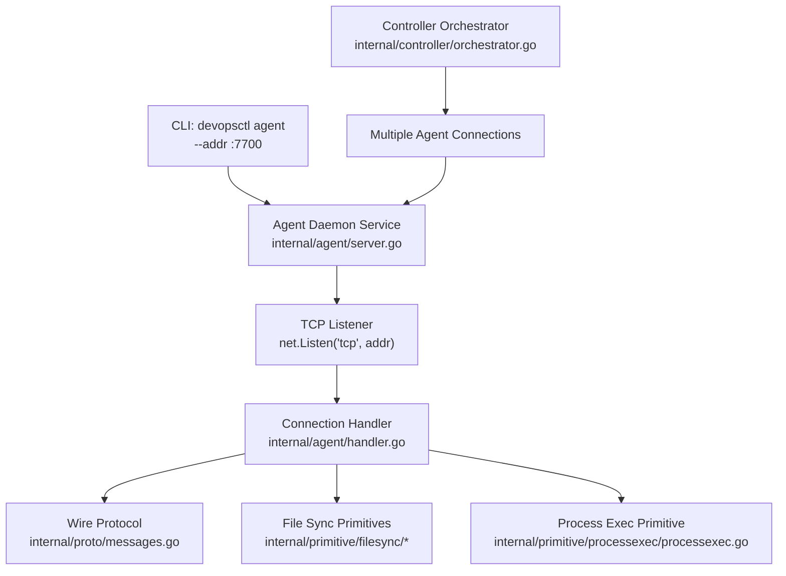
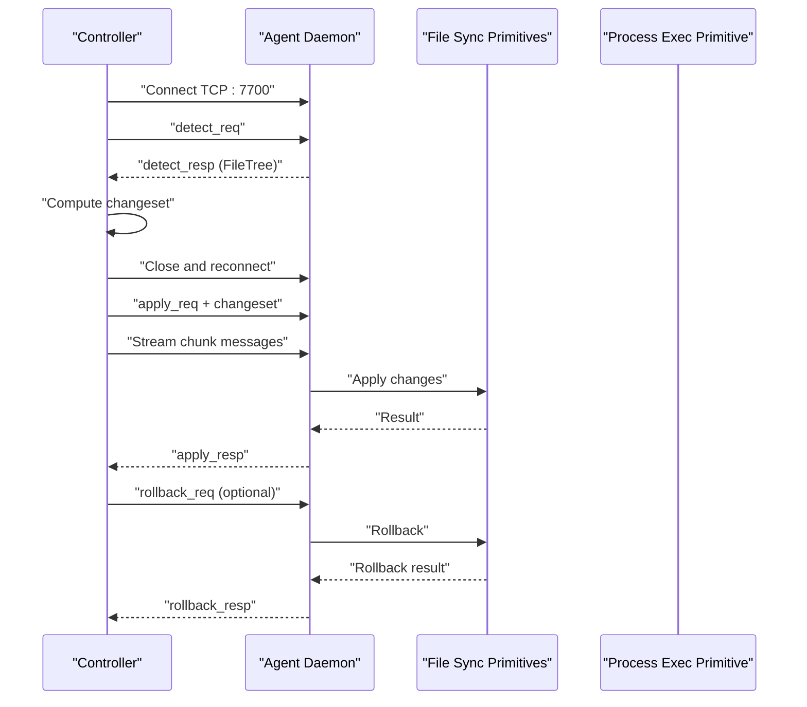
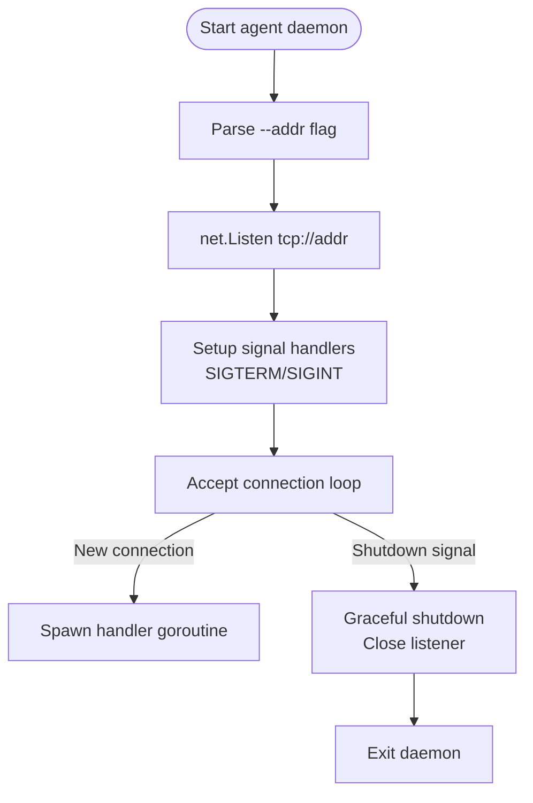
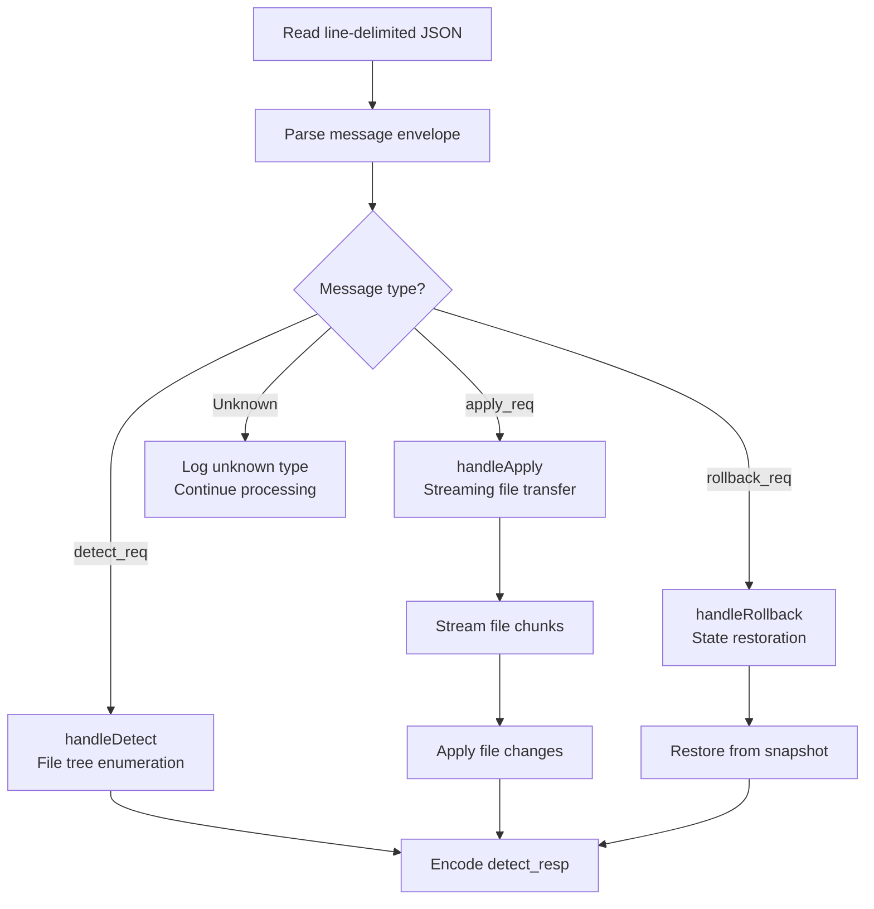
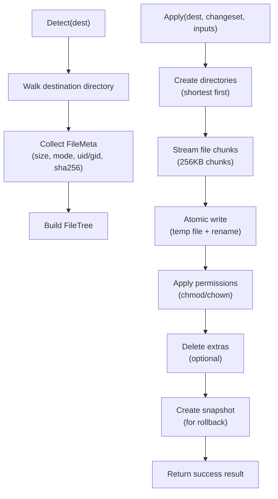
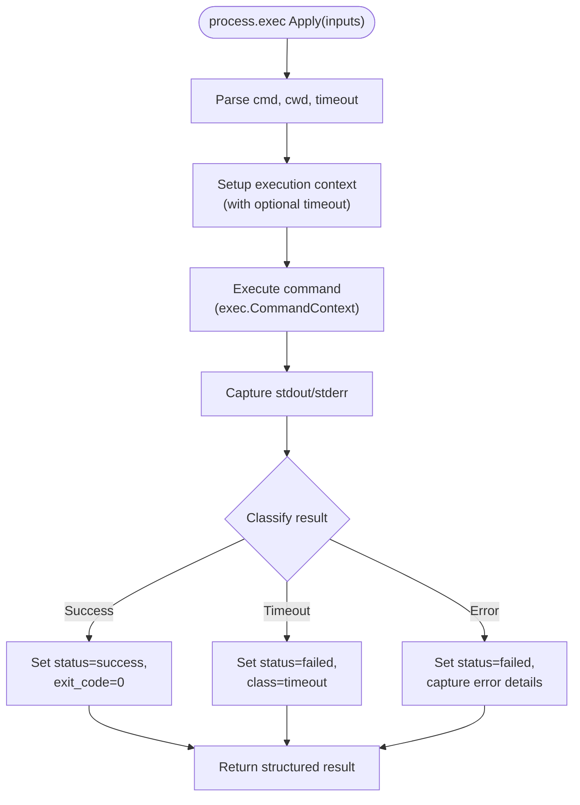

# Agent Command

<cite>
**Referenced Files in This Document**
- [main.go](file://cmd/devopsctl/main.go)
- [server.go](file://internal/agent/server.go)
- [handler.go](file://internal/agent/handler.go)
- [messages.go](file://internal/proto/messages.go)
- [orchestrator.go](file://internal/controller/orchestrator.go)
- [processexec.go](file://internal/primitive/processexec/processexec.go)
- [detect.go](file://internal/primitive/filesync/detect.go)
- [apply.go](file://internal/primitive/filesync/apply.go)
- [rollback.go](file://internal/primitive/filesync/rollback.go)
- [store.go](file://internal/state/store.go)
- [schema.go](file://internal/plan/schema.go)
- [go.mod](file://go.mod)
</cite>

## Update Summary
**Changes Made**
- Enhanced daemon service establishment documentation with graceful shutdown handling
- Added comprehensive distributed DevOps operations support details
- Expanded server-client architecture documentation for multi-machine orchestration
- Updated deployment scenarios to cover modern distributed execution topologies
- Improved troubleshooting guidance for multi-agent environments

## Table of Contents
1. [Introduction](#introduction)
2. [Project Structure](#project-structure)
3. [Core Components](#core-components)
4. [Architecture Overview](#architecture-overview)
5. [Detailed Component Analysis](#detailed-component-analysis)
6. [Daemon Service Establishment](#daemon-service-establishment)
7. [Distributed DevOps Operations Support](#distributed-devops-operations-support)
8. [Server-Client Architecture](#server-client-architecture)
9. [Deployment Scenarios](#deployment-scenarios)
10. [Performance Considerations](#performance-considerations)
11. [Troubleshooting Guide](#troubleshooting-guide)
12. [Conclusion](#conclusion)
13. [Appendices](#appendices)

## Introduction
This document explains how to operate the devopsctl agent command to start the DevOpsCtl agent daemon on target machines for remote operation execution. The agent provides a robust, stateless TCP endpoint that enables distributed DevOps operations across multiple machines. It supports both file synchronization and process execution primitives, with comprehensive error handling and graceful shutdown capabilities.

The agent operates as a daemon service that establishes persistent connections with controllers, enabling efficient multi-machine orchestration through a well-defined server-client architecture. This documentation covers command syntax, daemon lifecycle management, distributed execution patterns, and practical deployment strategies for various operational environments.

## Project Structure
The agent command is part of the devopsctl CLI and implements a complete daemon service architecture. The agent itself is implemented under internal/agent and communicates with the controller via a line-delimited JSON protocol defined in internal/proto. The controller orchestrates connections to multiple agents and coordinates complex distributed operations.

**Diagram sources**
- [main.go](file://cmd/devopsctl/main.go#L174-L186)
- [server.go](file://internal/agent/server.go#L15-L51)
- [handler.go](file://internal/agent/handler.go#L16-L51)
- [messages.go](file://internal/proto/messages.go#L1-L117)
- [orchestrator.go](file://internal/controller/orchestrator.go#L303-L311)

**Section sources**
- [main.go](file://cmd/devopsctl/main.go#L174-L186)
- [server.go](file://internal/agent/server.go#L15-L51)
- [handler.go](file://internal/agent/handler.go#L16-L51)
- [messages.go](file://internal/proto/messages.go#L1-L117)
- [orchestrator.go](file://internal/controller/orchestrator.go#L303-L311)

## Core Components
- **Agent Command**: Starts the agent daemon and binds to a configurable TCP address with graceful shutdown support.
- **Agent Server**: Implements a robust TCP server that accepts multiple concurrent connections and manages daemon lifecycle.
- **Protocol Handler**: Processes line-delimited JSON messages with stateless per-connection handling.
- **Wire Protocol**: Defines standardized message types for detect, apply, and rollback operations.
- **Primitives**:
  - **file.sync**: Comprehensive file synchronization with streaming, atomic operations, and rollback support.
  - **process.exec**: Secure command execution with timeout handling and structured result reporting.

Key defaults and flags:
- **Default TCP port**: 7700 (automatically appended when no port is specified)
- **Agent flag**: --addr sets the TCP address the agent listens on (default ":7700")
- **Graceful shutdown**: Supports SIGTERM/SIGINT signals for clean daemon termination

**Section sources**
- [main.go](file://cmd/devopsctl/main.go#L174-L186)
- [server.go](file://internal/agent/server.go#L15-L51)
- [handler.go](file://internal/agent/handler.go#L16-L51)
- [messages.go](file://internal/proto/messages.go#L14-L75)

## Architecture Overview
The controller initiates connections to agents using TCP with automatic port resolution. The architecture supports both single-agent and multi-agent distributed environments with sophisticated error handling and state management.

For file.sync operations, the controller:
1. Establishes initial connection for detect phase
2. Computes changeset locally using source tree comparison
3. Reconnects for apply phase with streaming file transfer
4. Handles rollback operations when needed

For process.exec operations, the controller:
1. Establishes connection and sends command inputs
2. Receives structured execution results with exit codes and output capture

**Diagram sources**
- [orchestrator.go](file://internal/controller/orchestrator.go#L313-L442)
- [handler.go](file://internal/agent/handler.go#L53-L173)
- [messages.go](file://internal/proto/messages.go#L14-L75)

## Detailed Component Analysis

### Agent Command and Server Implementation
The CLI exposes devopsctl agent with comprehensive daemon service capabilities. The agent server implements a robust TCP listener with graceful shutdown handling and signal-based termination.

**Diagram sources**
- [main.go](file://cmd/devopsctl/main.go#L174-L186)
- [server.go](file://internal/agent/server.go#L20-L51)

**Section sources**
- [main.go](file://cmd/devopsctl/main.go#L174-L186)
- [server.go](file://internal/agent/server.go#L20-L51)

### Protocol Handler and Message Processing
The agent processes line-delimited JSON messages with comprehensive error handling and stateless per-connection processing. The handler supports three primary message types with specialized processing logic.

**Diagram sources**
- [handler.go](file://internal/agent/handler.go#L16-L51)
- [messages.go](file://internal/proto/messages.go#L14-L75)

**Section sources**
- [handler.go](file://internal/agent/handler.go#L16-L51)
- [messages.go](file://internal/proto/messages.go#L14-L75)

### File Sync Primitive Implementation
The file.sync primitive provides comprehensive file synchronization with streaming operations, atomic file replacement, and full rollback support.

**Diagram sources**
- [detect.go](file://internal/primitive/filesync/detect.go#L19-L70)
- [apply.go](file://internal/primitive/filesync/apply.go#L19-L204)
- [rollback.go](file://internal/primitive/filesync/rollback.go#L11-L82)

**Section sources**
- [detect.go](file://internal/primitive/filesync/detect.go#L19-L70)
- [apply.go](file://internal/primitive/filesync/apply.go#L19-L204)
- [rollback.go](file://internal/primitive/filesync/rollback.go#L11-L82)

### Process Execution Primitive
The process.exec primitive provides secure command execution with comprehensive error handling, timeout support, and structured result reporting.

**Diagram sources**
- [processexec.go](file://internal/primitive/processexec/processexec.go#L13-L83)

**Section sources**
- [processexec.go](file://internal/primitive/processexec/processexec.go#L13-L83)

## Daemon Service Establishment
The agent implements a complete daemon service with robust lifecycle management and graceful shutdown capabilities.

### Service Lifecycle Management
- **Startup**: Agent initializes TCP listener on specified address
- **Operation**: Accepts multiple concurrent connections with per-connection goroutines
- **Shutdown**: Handles SIGTERM/SIGINT signals for clean termination
- **Cleanup**: Closes listener and exits gracefully

### Signal Handling Implementation
The daemon service registers signal handlers for graceful shutdown:
- **SIGTERM**: Triggers listener closure and service termination
- **SIGINT**: Handles interrupt signals for controlled shutdown
- **Context Cancellation**: Ensures proper cleanup on shutdown

### Connection Management
- **Concurrent Connections**: Supports multiple simultaneous client connections
- **Per-Connection Handlers**: Stateless processing with goroutine isolation
- **Resource Cleanup**: Automatic connection cleanup on handler exit

**Section sources**
- [server.go](file://internal/agent/server.go#L20-L51)
- [handler.go](file://internal/agent/handler.go#L16-L51)

## Distributed DevOps Operations Support
The agent enables comprehensive distributed DevOps operations across multiple machines with sophisticated orchestration capabilities.

### Multi-Machine Orchestration
The controller coordinates operations across multiple agents simultaneously:
- **Parallel Execution**: Targets execute concurrently based on parallelism settings
- **Dependency Management**: Complex dependency graphs with conditional execution
- **Failure Handling**: Configurable failure policies (halt, continue, rollback)
- **State Persistence**: Local SQLite store for execution tracking and recovery

### Execution Graph Processing
The orchestrator builds and processes execution graphs:
- **Topological Sorting**: Determines execution order respecting dependencies
- **Conditional Execution**: Nodes execute based on when conditions and dependency changes
- **Failure Propagation**: Errors propagate through dependency chains
- **Resume Capability**: Supports resuming from previous failure points

### State Management and Recovery
- **Execution Tracking**: Complete history of all operations with detailed metadata
- **Rollback Support**: Automatic rollback of failed operations when safe
- **Reconciliation Mode**: Brings systems into compliance with planned state
- **Idempotent Operations**: Ensures safe repeated execution of operations

**Section sources**
- [orchestrator.go](file://internal/controller/orchestrator.go#L34-L300)
- [store.go](file://internal/state/store.go#L33-L226)

## Server-Client Architecture
The agent implements a robust server-client architecture designed for distributed DevOps operations with clear separation of concerns.

### Client-Server Communication Model
- **TCP Transport**: Reliable connection-oriented communication
- **Line-Delimited JSON**: Simple, human-readable protocol with structured messages
- **Stateless Handlers**: Each connection processed independently without shared state
- **Bidirectional Streaming**: File transfers support efficient data streaming

### Message Protocol Design
The protocol defines clear message types with standardized structures:
- **Request Messages**: detect_req, apply_req, rollback_req
- **Response Messages**: detect_resp, apply_resp, rollback_resp
- **Chunk Messages**: Efficient file data streaming
- **Error Handling**: Structured error reporting with context

### Connection Lifecycle Management
- **Connection Establishment**: TCP handshake with address resolution
- **Message Exchange**: Request-response cycles with streaming support
- **Connection Termination**: Graceful closure with resource cleanup
- **Reconnection Logic**: Controller handles connection failures and retries

**Section sources**
- [messages.go](file://internal/proto/messages.go#L14-L117)
- [orchestrator.go](file://internal/controller/orchestrator.go#L313-L583)

## Deployment Scenarios

### Single-Agent Setup
For simple environments with minimal infrastructure requirements:
- **Installation**: Start agent with default --addr ":7700"
- **Configuration**: Define single target in plan with agent's host:port
- **Network**: Ensure controller can reach agent on port 7700
- **Monitoring**: Basic logging and health checks

### Multi-Agent Environment
For scaling across multiple machines or environments:
- **Agent Distribution**: Deploy agents on target machines with unique ports
- **Load Balancing**: Distribute workloads across multiple agents
- **Network Segmentation**: Separate agents by environment or security zone
- **Health Monitoring**: Implement monitoring for agent availability

### Distributed Execution Topology
For complex multi-environment orchestration:
- **Environment Separation**: Dedicated agents per environment (dev, staging, prod)
- **Role-Based Agents**: Specialized agents for specific roles (web, database, cache)
- **Cross-Platform Support**: Agents running on different operating systems
- **Security Isolation**: Network segmentation and authentication controls

### High-Availability Deployment
For mission-critical environments requiring redundancy:
- **Multiple Agent Instances**: Deploy multiple agents per target for redundancy
- **Failover Mechanisms**: Automatic switching to backup agents
- **Health Checks**: Continuous monitoring with automated failover
- **Load Distribution**: Intelligent workload distribution across healthy agents

**Section sources**
- [schema.go](file://internal/plan/schema.go#L18-L33)
- [orchestrator.go](file://internal/controller/orchestrator.go#L600-L606)

## Performance Considerations
The agent implementation includes several performance optimizations for distributed operations:

### Streaming Operations
- **File Transfer Optimization**: 256KB chunk size balances throughput and memory usage
- **Atomic File Replacement**: Minimizes partial-write risks and improves reliability
- **Streaming Hashing**: SHA-256 computed during transfer without full buffer storage

### Connection Efficiency
- **Concurrent Processing**: Multiple goroutines handle simultaneous connections
- **Memory Management**: Stateless handlers prevent memory accumulation
- **Resource Cleanup**: Automatic cleanup of temporary files and connections

### Network Optimization
- **Connection Reuse**: Controller optimizes connection usage for detect/apply phases
- **Bandwidth Utilization**: Efficient chunk-based file transfer minimizes network overhead
- **Timeout Handling**: Configurable timeouts prevent resource starvation

## Troubleshooting Guide

### Common Connection Issues
- **Connection Refused**: Verify agent is running with correct --addr and listening interface
- **Port Conflicts**: Ensure port 7700 (or custom port) is available and not blocked
- **Network Connectivity**: Test TCP connectivity using standard network tools
- **Firewall Configuration**: Allow inbound connections on agent port from controller

### Agent Service Problems
- **Daemon Shutdown**: Check for graceful shutdown on SIGTERM/SIGINT signals
- **Memory Usage**: Monitor for memory leaks in long-running agent instances
- **Connection Limits**: Verify system limits for concurrent connections
- **Resource Exhaustion**: Monitor file descriptors and system resources

### Protocol and Message Issues
- **Message Parsing**: Check for malformed JSON in message envelopes
- **Message Type Errors**: Verify correct message types for each operation
- **Streaming Failures**: Handle chunk stream interruptions and reconnections
- **Timeout Handling**: Configure appropriate timeouts for network conditions

### Distributed Operation Problems
- **Multi-Agent Coordination**: Verify agent discovery and connection establishment
- **State Synchronization**: Check execution state consistency across agents
- **Failure Recovery**: Implement proper rollback and retry mechanisms
- **Performance Degradation**: Monitor execution times and optimize network configuration

**Section sources**
- [server.go](file://internal/agent/server.go#L20-L51)
- [handler.go](file://internal/agent/handler.go#L16-L51)
- [orchestrator.go](file://internal/controller/orchestrator.go#L313-L583)

## Conclusion
The devopsctl agent command provides a robust, scalable solution for distributed DevOps operations. The implementation includes comprehensive daemon service establishment with graceful shutdown, sophisticated server-client architecture supporting multi-machine orchestration, and extensive distributed operations capabilities.

The agent's stateless design, streaming operations, and comprehensive error handling enable reliable execution across diverse environments. With proper network configuration and service management, the agent supports everything from simple single-agent setups to complex multi-environment distributed deployments.

## Appendices

### Command Reference
- **devopsctl agent**
  - **Description**: Start the DevOpsCtl agent daemon on this machine
  - **Flags**:
    - `--addr string`: TCP address to listen on (default ":7700")
  - **Daemon Features**:
    - Graceful shutdown on SIGTERM/SIGINT
    - Concurrent connection handling
    - Stateless per-connection processing

**Section sources**
- [main.go](file://cmd/devopsctl/main.go#L174-L186)

### Default Port Behavior
- **Automatic Port Resolution**: Controller automatically appends ":7700" when no port specified
- **Address Validation**: Validates host:port format and handles missing port gracefully
- **Connection Establishment**: Ensures proper TCP connection setup for all agents

**Section sources**
- [orchestrator.go](file://internal/controller/orchestrator.go#L600-L606)

### Deployment Best Practices
- **Service Management**: Use systemd or similar init systems for production deployments
- **Network Security**: Implement firewall rules and consider TLS encryption for sensitive environments
- **Monitoring**: Set up health checks and alerting for agent availability
- **Logging**: Configure appropriate log levels for debugging and production monitoring
- **Backup and Recovery**: Implement regular backups of agent configuration and state data

### Advanced Configuration
- **Custom Ports**: Use --addr with specific ports for multi-agent environments
- **Interface Binding**: Bind to specific interfaces (e.g., ":7700" for all interfaces, "127.0.0.1:7700" for local-only)
- **Resource Limits**: Configure system limits for file descriptors and memory usage
- **Performance Tuning**: Adjust chunk sizes and connection pooling based on network conditions