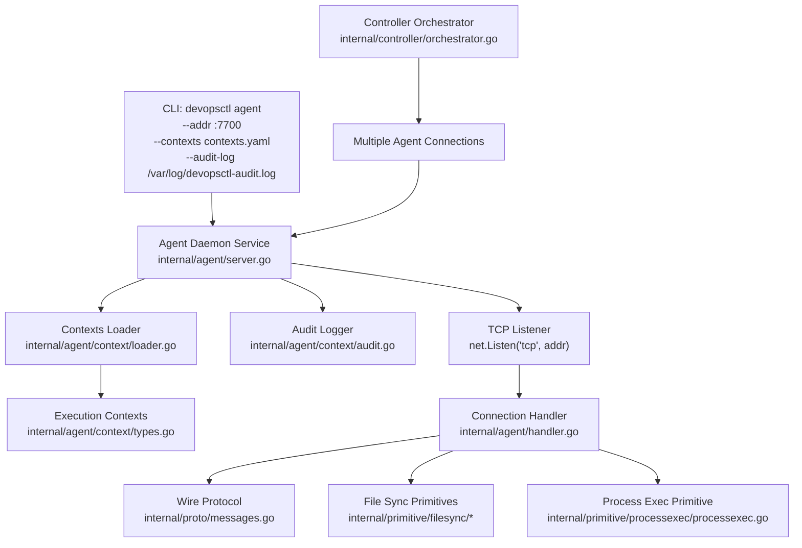
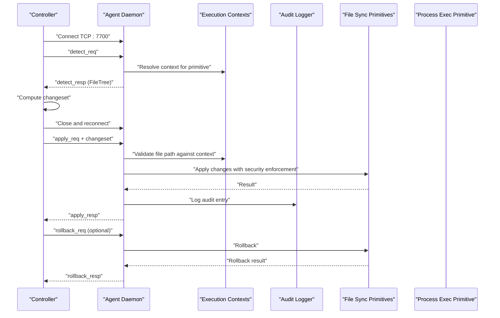
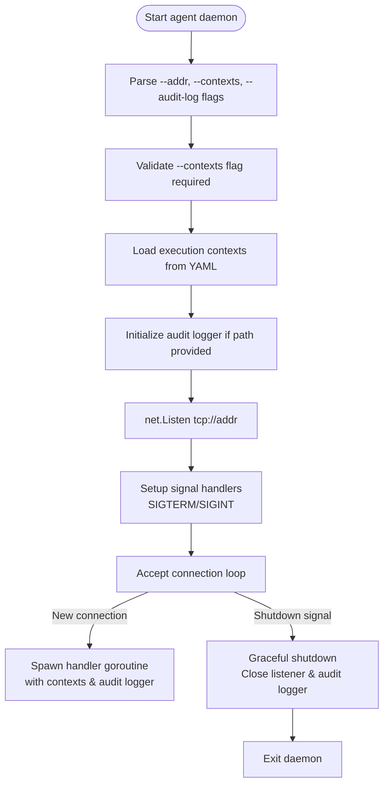
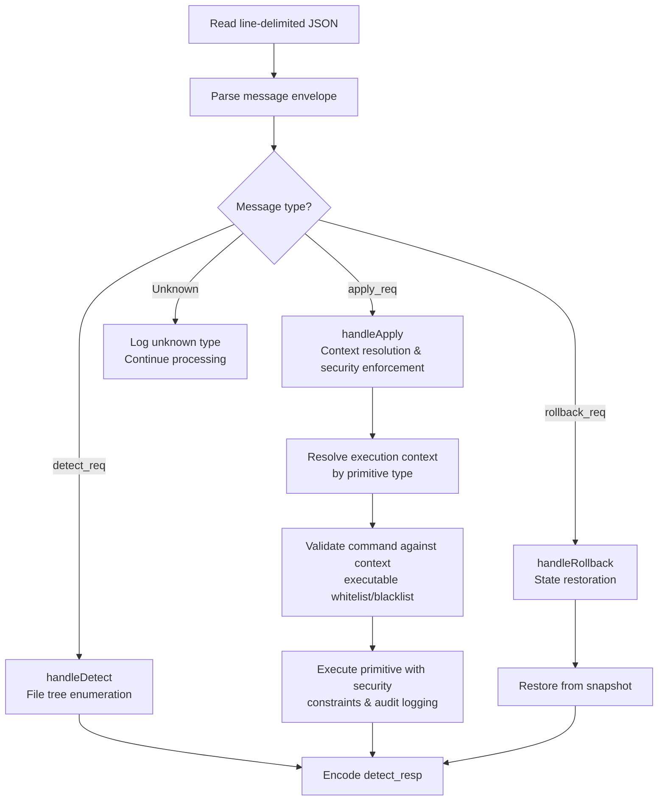
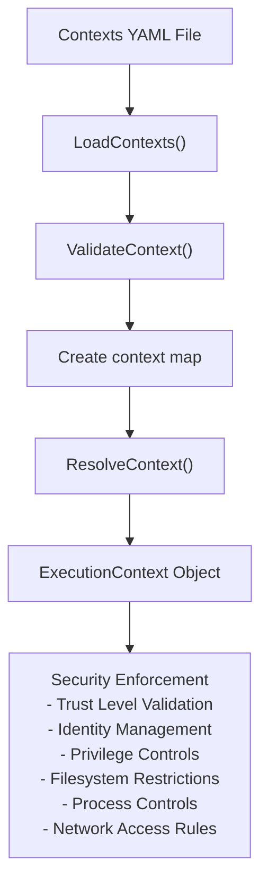
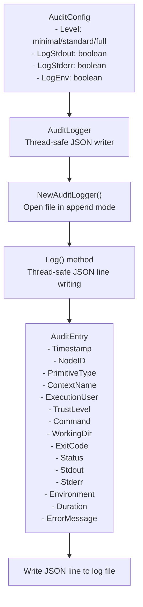
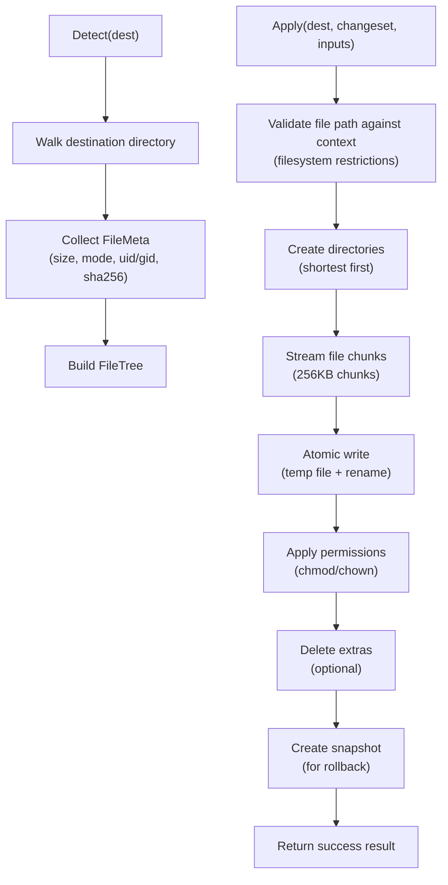
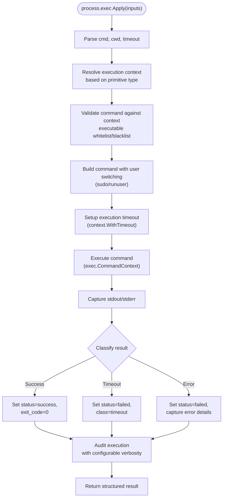

# Agent Command

<cite>
**Referenced Files in This Document**
- [main.go](file://cmd/devopsctl/main.go)
- [server.go](file://internal/agent/server.go)
- [handler.go](file://internal/agent/handler.go)
- [types.go](file://internal/agent/context/types.go)
- [loader.go](file://internal/agent/context/loader.go)
- [executor.go](file://internal/agent/context/executor.go)
- [audit.go](file://internal/agent/context/audit.go)
- [primitive_defaults.go](file://internal/agent/context/primitive_defaults.go)
- [messages.go](file://internal/proto/messages.go)
- [orchestrator.go](file://internal/controller/orchestrator.go)
- [processexec.go](file://internal/primitive/processexec/processexec.go)
- [detect.go](file://internal/primitive/filesync/detect.go)
- [apply.go](file://internal/primitive/filesync/apply.go)
- [rollback.go](file://internal/primitive/filesync/rollback.go)
- [store.go](file://internal/state/store.go)
- [schema.go](file://internal/plan/schema.go)
- [go.mod](file://go.mod)
- [minimal.yaml](file://examples/contexts/minimal.yaml)
- [multi-tier.yaml](file://examples/contexts/multi-tier.yaml)
- [production.yaml](file://examples/contexts/production.yaml)
</cite>

## Update Summary
**Changes Made**
- Enhanced agent command with execution contexts configuration system
- Added comprehensive audit logging setup with configurable verbosity levels
- Implemented security enforcement options including privilege escalation, filesystem restrictions, and network controls
- Added context-based primitive execution with trust level validation
- Integrated audit logging for all primitive operations with configurable output levels

## Table of Contents
1. [Introduction](#introduction)
2. [Project Structure](#project-structure)
3. [Core Components](#core-components)
4. [Architecture Overview](#architecture-overview)
5. [Detailed Component Analysis](#detailed-component-analysis)
6. [Execution Contexts Configuration](#execution-contexts-configuration)
7. [Audit Logging System](#audit-logging-system)
8. [Security Enforcement](#security-enforcement)
9. [Daemon Service Establishment](#daemon-service-establishment)
10. [Distributed DevOps Operations Support](#distributed-devops-operations-support)
11. [Server-Client Architecture](#server-client-architecture)
12. [Deployment Scenarios](#deployment-scenarios)
13. [Performance Considerations](#performance-considerations)
14. [Troubleshooting Guide](#troubleshooting-guide)
15. [Conclusion](#conclusion)
16. [Appendices](#appendices)

## Introduction
This document explains how to operate the devopsctl agent command to start the DevOpsCtl agent daemon on target machines for remote operation execution. The agent provides a robust, stateless TCP endpoint with enhanced security enforcement through execution contexts, comprehensive audit logging, and configurable privilege management. It supports both file synchronization and process execution primitives with strict security boundaries and detailed operational visibility.

The agent operates as a daemon service that establishes persistent connections with controllers, enabling efficient multi-machine orchestration through a well-defined server-client architecture. This documentation covers command syntax, daemon lifecycle management, execution contexts configuration, audit logging setup, security enforcement options, and practical deployment strategies for various operational environments.

## Project Structure
The agent command is part of the devopsctl CLI and implements a complete daemon service architecture with enhanced security features. The agent itself is implemented under internal/agent and communicates with the controller via a line-delimited JSON protocol defined in internal/proto. The controller orchestrates connections to multiple agents and coordinates complex distributed operations with security enforcement.

**Diagram sources**
- [main.go](file://cmd/devopsctl/main.go#L193-L218)
- [server.go](file://internal/agent/server.go#L17-L47)
- [loader.go](file://internal/agent/context/loader.go#L16-L53)
- [types.go](file://internal/agent/context/types.go#L3-L14)
- [audit.go](file://internal/agent/context/audit.go#L29-L63)
- [handler.go](file://internal/agent/handler.go#L18-L53)

**Section sources**
- [main.go](file://cmd/devopsctl/main.go#L193-L218)
- [server.go](file://internal/agent/server.go#L17-L47)
- [loader.go](file://internal/agent/context/loader.go#L16-L53)
- [types.go](file://internal/agent/context/types.go#L3-L14)
- [audit.go](file://internal/agent/context/audit.go#L29-L63)
- [handler.go](file://internal/agent/handler.go#L18-L53)

## Core Components
- **Enhanced Agent Command**: Starts the agent daemon with execution contexts configuration, audit logging setup, and security enforcement options.
- **Agent Server**: Implements a robust TCP server that accepts multiple concurrent connections, manages execution contexts, and handles audit logging.
- **Execution Contexts System**: Provides security enforcement through configurable trust levels, identity management, privilege escalation, filesystem restrictions, process controls, and network access rules.
- **Audit Logging System**: Comprehensive logging framework with configurable verbosity levels (minimal, standard, full) and structured JSON output.
- **Protocol Handler**: Processes line-delimited JSON messages with stateless per-connection handling and security enforcement.
- **Wire Protocol**: Defines standardized message types for detect, apply, and rollback operations.
- **Primitives**:
  - **file.sync**: Comprehensive file synchronization with streaming, atomic operations, rollback support, and filesystem validation.
  - **process.exec**: Secure command execution with context enforcement, user switching, timeout handling, structured result reporting, and audit logging.

Key defaults and flags:
- **Default TCP port**: 7700 (automatically appended when no port is specified)
- **Agent flags**: 
  - `--addr string`: TCP address to listen on (default ":7700")
  - `--contexts string`: Path to execution contexts configuration file (REQUIRED)
  - `--audit-log string`: Path to audit log file (default "/var/log/devopsctl-audit.log")
- **Graceful shutdown**: Supports SIGTERM/SIGINT signals for clean daemon termination

**Section sources**
- [main.go](file://cmd/devopsctl/main.go#L193-L218)
- [server.go](file://internal/agent/server.go#L17-L47)
- [handler.go](file://internal/agent/handler.go#L18-L53)
- [messages.go](file://internal/proto/messages.go#L14-L75)

## Architecture Overview
The controller initiates connections to agents using TCP with automatic port resolution. The architecture supports both single-agent and multi-agent distributed environments with sophisticated error handling, state management, and enhanced security enforcement through execution contexts.

For file.sync operations with security enforcement, the controller:
1. Establishes initial connection for detect phase
2. Computes changeset locally using source tree comparison
3. Reconnects for apply phase with streaming file transfer and filesystem validation
4. Applies context restrictions before executing file operations
5. Handles rollback operations when needed with audit trail

For process.exec operations with security enforcement, the controller:
1. Establishes connection and sends command inputs
2. Resolves appropriate execution context based on primitive type
3. Applies security restrictions including executable whitelisting/blacklisting
4. Executes commands with user switching and privilege escalation
5. Receives structured execution results with exit codes, output capture, and audit logging

**Diagram sources**
- [orchestrator.go](file://internal/controller/orchestrator.go#L313-L442)
- [handler.go](file://internal/agent/handler.go#L92-L160)
- [executor.go](file://internal/agent/context/executor.go#L29-L73)
- [audit.go](file://internal/agent/context/audit.go#L10-L27)

## Detailed Component Analysis

### Enhanced Agent Command and Server Implementation
The CLI exposes devopsctl agent with comprehensive daemon service capabilities including execution contexts configuration and audit logging. The agent server implements a robust TCP listener with graceful shutdown handling, signal-based termination, and security enforcement integration.

**Diagram sources**
- [main.go](file://cmd/devopsctl/main.go#L193-L218)
- [server.go](file://internal/agent/server.go#L27-L47)
- [server.go](file://internal/agent/server.go#L49-L89)

**Section sources**
- [main.go](file://cmd/devopsctl/main.go#L193-L218)
- [server.go](file://internal/agent/server.go#L27-L47)
- [server.go](file://internal/agent/server.go#L49-L89)

### Protocol Handler and Message Processing with Security Enforcement
The agent processes line-delimited JSON messages with comprehensive error handling, stateless per-connection processing, and integrated security enforcement through execution contexts.

**Diagram sources**
- [handler.go](file://internal/agent/handler.go#L18-L53)
- [handler.go](file://internal/agent/handler.go#L92-L160)
- [executor.go](file://internal/agent/context/executor.go#L106-L138)

**Section sources**
- [handler.go](file://internal/agent/handler.go#L18-L53)
- [handler.go](file://internal/agent/handler.go#L92-L160)
- [messages.go](file://internal/proto/messages.go#L14-L75)

### Execution Contexts System
The execution contexts system provides comprehensive security enforcement through configurable trust levels, identity management, privilege escalation controls, filesystem restrictions, process execution controls, and network access rules.

**Diagram sources**
- [loader.go](file://internal/agent/context/loader.go#L16-L53)
- [types.go](file://internal/agent/context/types.go#L3-L14)
- [primitive_defaults.go](file://internal/agent/context/primitive_defaults.go#L27-L49)

**Section sources**
- [loader.go](file://internal/agent/context/loader.go#L16-L53)
- [types.go](file://internal/agent/context/types.go#L3-L14)
- [primitive_defaults.go](file://internal/agent/context/primitive_defaults.go#L27-L49)

### Audit Logging System
The audit logging system provides comprehensive operational visibility with configurable verbosity levels and structured JSON output for all primitive operations.

**Diagram sources**
- [audit.go](file://internal/agent/context/audit.go#L10-L27)
- [audit.go](file://internal/agent/context/audit.go#L29-L63)
- [types.go](file://internal/agent/context/types.go#L68-L83)

**Section sources**
- [audit.go](file://internal/agent/context/audit.go#L10-L27)
- [audit.go](file://internal/agent/context/audit.go#L29-L63)
- [types.go](file://internal/agent/context/types.go#L68-L83)

### File Sync Primitive Implementation with Security Enforcement
The file.sync primitive provides comprehensive file synchronization with streaming operations, atomic file replacement, full rollback support, and integrated filesystem validation against execution contexts.

**Diagram sources**
- [detect.go](file://internal/primitive/filesync/detect.go#L19-L70)
- [apply.go](file://internal/primitive/filesync/apply.go#L19-L204)
- [rollback.go](file://internal/primitive/filesync/rollback.go#L11-L82)
- [executor.go](file://internal/agent/context/executor.go#L238-L306)

**Section sources**
- [detect.go](file://internal/primitive/filesync/detect.go#L19-L70)
- [apply.go](file://internal/primitive/filesync/apply.go#L19-L204)
- [rollback.go](file://internal/primitive/filesync/rollback.go#L11-L82)
- [executor.go](file://internal/agent/context/executor.go#L238-L306)

### Process Execution Primitive with Security Enforcement
The process.exec primitive provides secure command execution with comprehensive error handling, timeout support, structured result reporting, and integrated audit logging with configurable verbosity levels.

**Diagram sources**
- [processexec.go](file://internal/primitive/processexec/processexec.go#L13-L83)
- [executor.go](file://internal/agent/context/executor.go#L29-L73)
- [executor.go](file://internal/agent/context/executor.go#L176-L228)

**Section sources**
- [processexec.go](file://internal/primitive/processexec/processexec.go#L13-L83)
- [executor.go](file://internal/agent/context/executor.go#L29-L73)
- [executor.go](file://internal/agent/context/executor.go#L176-L228)

## Execution Contexts Configuration

### Context Structure and Security Controls
Execution contexts define comprehensive security policies for primitive execution with five key control categories:

- **Identity Management**: User, group, and supplementary group specification for command execution
- **Privilege Control**: Controlled privilege escalation with sudo command whitelisting and passwordless execution options
- **Filesystem Restrictions**: Granular path-level access control with read-only, writable, and denied path lists
- **Process Controls**: Executable whitelisting/blacklisting, environment variable enforcement, and resource limits
- **Network Access**: Controlled network access with scope-based restrictions (none, internal, full)

### Trust Level System
The trust level system provides three security tiers with increasing privileges and capabilities:

- **Low Trust**: Minimal privileges, restricted access, no privilege escalation, network disabled
- **Medium Trust**: Moderate privileges, selective escalation, limited network access, expanded filesystem access
- **High Trust**: Administrative privileges, full escalation, unrestricted network access, broad filesystem access

### Context Resolution and Validation
The agent automatically resolves appropriate execution contexts for each primitive type based on predefined requirements and validates that selected contexts meet minimum security standards.

**Section sources**
- [types.go](file://internal/agent/context/types.go#L3-L14)
- [types.go](file://internal/agent/context/types.go#L16-L23)
- [types.go](file://internal/agent/context/types.go#L25-L37)
- [types.go](file://internal/agent/context/types.go#L39-L44)
- [types.go](file://internal/agent/context/types.go#L46-L52)
- [types.go](file://internal/agent/context/types.go#L54-L59)
- [types.go](file://internal/agent/context/types.go#L61-L66)
- [types.go](file://internal/agent/context/types.go#L68-L83)
- [primitive_defaults.go](file://internal/agent/context/primitive_defaults.go#L5-L25)
- [primitive_defaults.go](file://internal/agent/context/primitive_defaults.go#L27-L49)

### Example Context Configurations
The repository includes comprehensive examples demonstrating different security configurations for various operational scenarios.

**Section sources**
- [minimal.yaml](file://examples/contexts/minimal.yaml#L1-L38)
- [multi-tier.yaml](file://examples/contexts/multi-tier.yaml#L1-L117)
- [production.yaml](file://examples/contexts/production.yaml#L1-L43)

## Audit Logging System

### Audit Configuration Options
The audit logging system provides configurable verbosity levels with different levels of detail:

- **Minimal Level**: Basic success/failure indicators without operational details
- **Standard Level**: Includes command execution details, outputs, and basic metadata
- **Full Level**: Comprehensive logging with command details, environment variables, and complete execution context

### Audit Entry Structure
Each audit entry captures comprehensive operational information for security and compliance purposes:

- **Operational Metadata**: Timestamp, node ID, primitive type, context name, execution user, trust level
- **Execution Details**: Command arguments, working directory, exit code, execution duration
- **Output Capture**: Standard output, standard error (configurable based on audit level)
- **Error Information**: Error messages and classification for failed operations
- **Environment Context**: Complete environment variables (when enabled)

### Audit Log Management
The audit logger provides thread-safe JSON line-based logging with automatic file creation and rotation support. Logs are written in structured JSON format for easy parsing and analysis.

**Section sources**
- [audit.go](file://internal/agent/context/audit.go#L10-L27)
- [audit.go](file://internal/agent/context/audit.go#L29-L63)
- [types.go](file://internal/agent/context/types.go#L68-L83)

## Security Enforcement

### Context-Based Execution Controls
The agent enforces security policies through comprehensive context validation at multiple execution points:

- **Command Validation**: Executable whitelisting/blacklisting prevents unauthorized command execution
- **Filesystem Validation**: Path-level access control ensures operations stay within authorized boundaries
- **Privilege Validation**: Trust level verification prevents escalation beyond authorized security boundaries
- **Network Validation**: Scope-based network access controls limit external communications

### User Switching and Privilege Escalation
The system supports secure user switching and controlled privilege escalation:

- **Non-Escalation Mode**: Uses runuser for user switching without privilege escalation
- **Escalation Mode**: Uses sudo with configurable NOPASSWD options and command whitelisting
- **Environment Isolation**: Controlled environment variable injection prevents security bypasses

### Resource Limit Enforcement
Process execution includes comprehensive resource management:

- **Memory Limits**: Maximum memory consumption per process execution
- **CPU Constraints**: CPU percentage limits to prevent resource exhaustion
- **Process Limits**: Maximum concurrent processes to prevent system overload

**Section sources**
- [executor.go](file://internal/agent/context/executor.go#L75-L104)
- [executor.go](file://internal/agent/context/executor.go#L106-L138)
- [executor.go](file://internal/agent/context/executor.go#L140-L174)
- [executor.go](file://internal/agent/context/executor.go#L238-L306)
- [types.go](file://internal/agent/context/types.go#L54-L59)

## Daemon Service Establishment
The agent implements a complete daemon service with robust lifecycle management, graceful shutdown capabilities, and integrated security enforcement.

### Service Lifecycle Management
- **Startup**: Agent initializes TCP listener, loads execution contexts, and sets up audit logging
- **Operation**: Accepts multiple concurrent connections with per-connection goroutines and security enforcement
- **Shutdown**: Handles SIGTERM/SIGINT signals for clean termination with resource cleanup
- **Cleanup**: Closes listener and audit logger gracefully

### Signal Handling Implementation
The daemon service registers signal handlers for graceful shutdown:
- **SIGTERM**: Triggers listener closure and service termination
- **SIGINT**: Handles interrupt signals for controlled shutdown
- **Context Cancellation**: Ensures proper cleanup on shutdown

### Connection Management
- **Concurrent Connections**: Supports multiple simultaneous client connections with per-connection security enforcement
- **Per-Connection Handlers**: Stateless processing with goroutine isolation and context binding
- **Resource Cleanup**: Automatic cleanup of temporary files, connections, and audit logger on handler exit

**Section sources**
- [server.go](file://internal/agent/server.go#L49-L89)
- [handler.go](file://internal/agent/handler.go#L18-L53)

## Distributed DevOps Operations Support
The agent enables comprehensive distributed DevOps operations across multiple machines with sophisticated orchestration capabilities and enhanced security enforcement.

### Multi-Machine Orchestration
The controller coordinates operations across multiple agents simultaneously with security enforcement:
- **Parallel Execution**: Targets execute concurrently based on parallelism settings
- **Dependency Management**: Complex dependency graphs with conditional execution
- **Failure Handling**: Configurable failure policies (halt, continue, rollback)
- **State Persistence**: Local SQLite store for execution tracking and recovery
- **Security Enforcement**: Each operation validated against appropriate execution contexts

### Execution Graph Processing
The orchestrator builds and processes execution graphs with security considerations:
- **Topological Sorting**: Determines execution order respecting dependencies
- **Conditional Execution**: Nodes execute based on when conditions and dependency changes
- **Failure Propagation**: Errors propagate through dependency chains
- **Resume Capability**: Supports resuming from previous failure points
- **Context Resolution**: Each primitive operation resolved to appropriate security context

### State Management and Recovery
- **Execution Tracking**: Complete history of all operations with detailed metadata
- **Rollback Support**: Automatic rollback of failed operations when safe
- **Reconciliation Mode**: Brings systems into compliance with planned state
- **Idempotent Operations**: Ensures safe repeated execution of operations
- **Audit Trail**: Comprehensive logging of all operations for compliance

**Section sources**
- [orchestrator.go](file://internal/controller/orchestrator.go#L34-L300)
- [store.go](file://internal/state/store.go#L33-L226)

## Server-Client Architecture
The agent implements a robust server-client architecture designed for distributed DevOps operations with clear separation of concerns and integrated security enforcement.

### Client-Server Communication Model
- **TCP Transport**: Reliable connection-oriented communication
- **Line-Delimited JSON**: Simple, human-readable protocol with structured messages
- **Stateless Handlers**: Each connection processed independently without shared state
- **Bidirectional Streaming**: File transfers support efficient data streaming
- **Security Context**: Each connection bound to appropriate execution context

### Message Protocol Design
The protocol defines clear message types with standardized structures:
- **Request Messages**: detect_req, apply_req, rollback_req
- **Response Messages**: detect_resp, apply_resp, rollback_resp
- **Chunk Messages**: Efficient file data streaming
- **Error Handling**: Structured error reporting with context
- **Security Integration**: Context resolution and validation built into message processing

### Connection Lifecycle Management
- **Connection Establishment**: TCP handshake with address resolution
- **Message Exchange**: Request-response cycles with streaming support and security enforcement
- **Connection Termination**: Graceful closure with resource cleanup
- **Reconnection Logic**: Controller handles connection failures and retries
- **Context Binding**: Each connection maintains security context throughout lifecycle

**Section sources**
- [messages.go](file://internal/proto/messages.go#L14-L117)
- [handler.go](file://internal/agent/handler.go#L18-L53)
- [orchestrator.go](file://internal/controller/orchestrator.go#L313-L583)

## Deployment Scenarios

### Single-Agent Setup with Security
For simple environments with minimal infrastructure requirements and security enforcement:
- **Installation**: Start agent with required --contexts flag and optional --audit-log
- **Configuration**: Define single target in plan with agent's host:port and security context
- **Network**: Ensure controller can reach agent on port 7700 with security context validation
- **Monitoring**: Enable audit logging for operational visibility
- **Security**: Configure appropriate trust level and execution context for environment

### Multi-Agent Environment with Context Management
For scaling across multiple machines or environments with centralized security policy:
- **Agent Distribution**: Deploy agents on target machines with unique execution contexts
- **Context Management**: Maintain centralized context configuration files
- **Load Balancing**: Distribute workloads across multiple agents with appropriate security contexts
- **Network Segmentation**: Separate agents by environment or security zone with context isolation
- **Health Monitoring**: Implement monitoring for agent availability and security compliance

### Distributed Execution Topology with Security Zones
For complex multi-environment orchestration with security segregation:
- **Environment Separation**: Dedicated agents per environment (dev, staging, prod) with distinct contexts
- **Role-Based Agents**: Specialized agents for specific roles with tailored security policies
- **Cross-Platform Support**: Agents running on different operating systems with platform-appropriate contexts
- **Security Isolation**: Network segmentation and authentication controls with context-based enforcement
- **Compliance**: Audit logging and security enforcement for regulatory requirements

### High-Availability Deployment with Security Redundancy
For mission-critical environments requiring redundancy and security:
- **Multiple Agent Instances**: Deploy multiple agents per target for redundancy with synchronized contexts
- **Failover Mechanisms**: Automatic switching to backup agents with context validation
- **Health Checks**: Continuous monitoring with automated failover and security compliance
- **Load Distribution**: Intelligent workload distribution across healthy agents with security enforcement
- **Security Auditing**: Comprehensive audit logging across all redundant instances

**Section sources**
- [schema.go](file://internal/plan/schema.go#L18-L33)
- [orchestrator.go](file://internal/controller/orchestrator.go#L600-L606)

## Performance Considerations
The agent implementation includes several performance optimizations for distributed operations with security enforcement:

### Streaming Operations with Security
- **File Transfer Optimization**: 256KB chunk size balances throughput and memory usage
- **Atomic File Replacement**: Minimizes partial-write risks and improves reliability
- **Streaming Hashing**: SHA-256 computed during transfer without full buffer storage
- **Context Validation Caching**: Execution contexts cached for improved performance

### Connection Efficiency with Security
- **Concurrent Processing**: Multiple goroutines handle simultaneous connections with security enforcement
- **Memory Management**: Stateless handlers prevent memory accumulation
- **Resource Cleanup**: Automatic cleanup of temporary files, connections, and audit entries
- **Audit Log Buffering**: Thread-safe audit logging with minimal performance impact

### Network Optimization with Security
- **Connection Reuse**: Controller optimizes connection usage for detect/apply phases
- **Bandwidth Utilization**: Efficient chunk-based file transfer minimizes network overhead
- **Timeout Handling**: Configurable timeouts prevent resource starvation
- **Security Validation**: Context validation performed efficiently without blocking operations

### Security Enforcement Performance
- **Context Resolution**: Fast lookup of execution contexts by primitive type
- **Command Validation**: Efficient executable whitelist/blacklist checking
- **Filesystem Validation**: Optimized path checking with minimal overhead
- **Audit Logging**: Asynchronous audit logging with configurable verbosity levels

## Troubleshooting Guide

### Common Connection Issues
- **Connection Refused**: Verify agent is running with correct --addr and listening interface
- **Port Conflicts**: Ensure port 7700 (or custom port) is available and not blocked
- **Network Connectivity**: Test TCP connectivity using standard network tools
- **Firewall Configuration**: Allow inbound connections on agent port from controller

### Agent Service Problems
- **Daemon Shutdown**: Check for graceful shutdown on SIGTERM/SIGINT signals
- **Memory Usage**: Monitor for memory leaks in long-running agent instances
- **Connection Limits**: Verify system limits for concurrent connections
- **Resource Exhaustion**: Monitor file descriptors and system resources

### Execution Context Issues
- **Context Loading**: Verify contexts YAML file path and format
- **Context Validation**: Check for required fields and valid values in context definitions
- **Context Resolution**: Ensure primitive types match configured contexts
- **Trust Level Validation**: Verify contexts meet minimum trust level requirements

### Audit Logging Problems
- **Log File Creation**: Verify audit log file path and permissions
- **Log File Permissions**: Ensure proper file permissions for audit log access
- **Log File Rotation**: Implement log rotation for production environments
- **Audit Verbosity**: Adjust audit level based on operational requirements

### Security Enforcement Issues
- **Command Denial**: Check executable whitelist/blacklist configuration
- **Filesystem Access Denied**: Verify path restrictions and operation type
- **Privilege Escalation**: Ensure sudo configuration and command whitelisting
- **User Switching**: Verify user existence and permission configuration

### Protocol and Message Issues
- **Message Parsing**: Check for malformed JSON in message envelopes
- **Message Type Errors**: Verify correct message types for each operation
- **Streaming Failures**: Handle chunk stream interruptions and reconnections
- **Timeout Handling**: Configure appropriate timeouts for network conditions

### Distributed Operation Problems
- **Multi-Agent Coordination**: Verify agent discovery and connection establishment
- **State Synchronization**: Check execution state consistency across agents
- **Failure Recovery**: Implement proper rollback and retry mechanisms
- **Performance Degradation**: Monitor execution times and optimize network configuration

**Section sources**
- [server.go](file://internal/agent/server.go#L49-L89)
- [handler.go](file://internal/agent/handler.go#L18-L53)
- [loader.go](file://internal/agent/context/loader.go#L55-L121)
- [audit.go](file://internal/agent/context/audit.go#L35-L43)
- [executor.go](file://internal/agent/context/executor.go#L106-L138)
- [orchestrator.go](file://internal/controller/orchestrator.go#L313-L583)

## Conclusion
The devopsctl agent command provides a robust, scalable, and secure solution for distributed DevOps operations. The implementation includes comprehensive daemon service establishment with graceful shutdown, sophisticated server-client architecture supporting multi-machine orchestration, and extensive distributed operations capabilities with integrated security enforcement.

The enhanced agent now provides comprehensive execution contexts configuration, audit logging setup, and security enforcement options that enable secure and compliant operations across diverse environments. With proper network configuration, security context management, and audit logging setup, the agent supports everything from simple single-agent setups to complex multi-environment distributed deployments with strict security controls.

## Appendices

### Command Reference
- **devopsctl agent**
  - **Description**: Start the DevOpsCtl agent daemon on this machine
  - **Flags**:
    - `--addr string`: TCP address to listen on (default ":7700")
    - `--contexts string`: Path to execution contexts configuration file (REQUIRED)
    - `--audit-log string`: Path to audit log file (default "/var/log/devopsctl-audit.log")
  - **Daemon Features**:
    - Graceful shutdown on SIGTERM/SIGINT
    - Concurrent connection handling
    - Stateless per-connection processing
    - Execution contexts configuration
    - Audit logging with configurable verbosity
    - Security enforcement through context validation

**Section sources**
- [main.go](file://cmd/devopsctl/main.go#L193-L218)

### Execution Context Configuration
- **Context Structure**: YAML-based configuration with comprehensive security controls
- **Trust Levels**: Low, Medium, High with increasing privileges and capabilities
- **Identity Management**: User, group, and supplementary group specification
- **Privilege Controls**: Controlled escalation with command whitelisting
- **Filesystem Restrictions**: Granular path-level access control
- **Process Controls**: Executable whitelisting/blacklisting and resource limits
- **Network Access**: Scope-based restrictions (none, internal, full)

**Section sources**
- [types.go](file://internal/agent/context/types.go#L3-L14)
- [types.go](file://internal/agent/context/types.go#L16-L23)
- [types.go](file://internal/agent/context/types.go#L25-L37)
- [types.go](file://internal/agent/context/types.go#L39-L44)
- [types.go](file://internal/agent/context/types.go#L46-L52)
- [types.go](file://internal/agent/context/types.go#L54-L59)
- [types.go](file://internal/agent/context/types.go#L61-L66)
- [types.go](file://internal/agent/context/types.go#L68-L83)

### Audit Logging Configuration
- **Audit Levels**: Minimal, Standard, Full with different verbosity levels
- **Log Output**: Structured JSON lines format for easy parsing
- **Log Fields**: Comprehensive operational metadata and execution details
- **Log Management**: Thread-safe file writing with automatic creation
- **Compliance**: Audit trails suitable for regulatory requirements

**Section sources**
- [audit.go](file://internal/agent/context/audit.go#L10-L27)
- [audit.go](file://internal/agent/context/audit.go#L29-L63)
- [types.go](file://internal/agent/context/types.go#L68-L83)

### Default Port Behavior
- **Automatic Port Resolution**: Controller automatically appends ":7700" when no port specified
- **Address Validation**: Validates host:port format and handles missing port gracefully
- **Connection Establishment**: Ensures proper TCP connection setup for all agents

**Section sources**
- [orchestrator.go](file://internal/controller/orchestrator.go#L600-L606)

### Deployment Best Practices
- **Service Management**: Use systemd or similar init systems for production deployments
- **Network Security**: Implement firewall rules and consider TLS encryption for sensitive environments
- **Monitoring**: Set up health checks and alerting for agent availability
- **Logging**: Configure appropriate log levels for debugging and production monitoring
- **Backup and Recovery**: Implement regular backups of agent configuration and state data
- **Security**: Regular review of execution contexts and audit logs for compliance
- **Performance**: Monitor resource usage and adjust context configurations for optimal performance

### Advanced Configuration
- **Custom Ports**: Use --addr with specific ports for multi-agent environments
- **Interface Binding**: Bind to specific interfaces (e.g., ":7700" for all interfaces, "127.0.0.1:7700" for local-only)
- **Resource Limits**: Configure system limits for file descriptors and memory usage
- **Performance Tuning**: Adjust chunk sizes and connection pooling based on network conditions
- **Security Hardening**: Implement least privilege principles and regular security audits
- **Audit Configuration**: Tune audit verbosity levels based on operational requirements and compliance needs

### Example Context Configurations
- **Minimal Security**: Safe user-space execution without privileges
- **Multi-Tier Security**: Different contexts for different operational roles
- **Production Hardening**: Strict security controls for production environments
- **Development Flexibility**: Balanced security for development and testing

**Section sources**
- [minimal.yaml](file://examples/contexts/minimal.yaml#L1-L38)
- [multi-tier.yaml](file://examples/contexts/multi-tier.yaml#L1-L117)
- [production.yaml](file://examples/contexts/production.yaml#L1-L43)