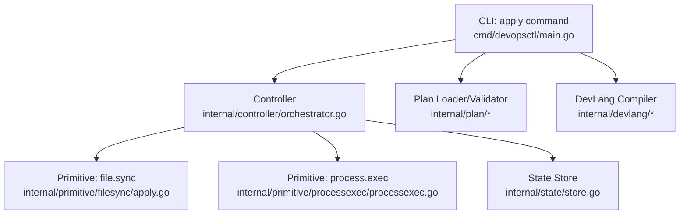
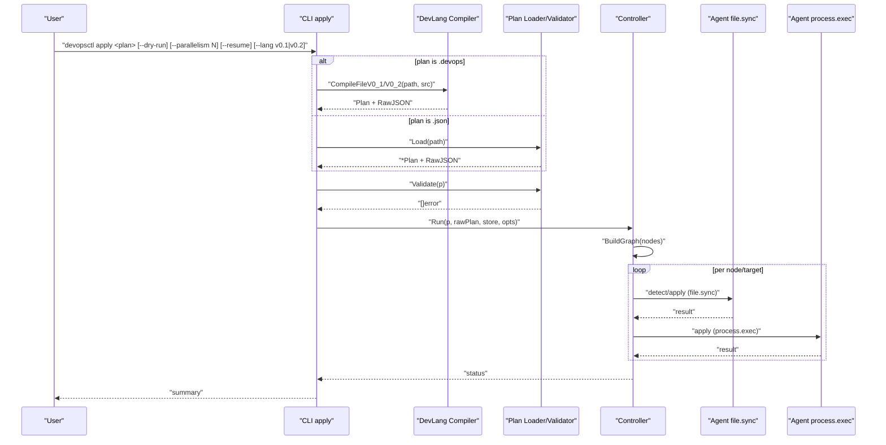
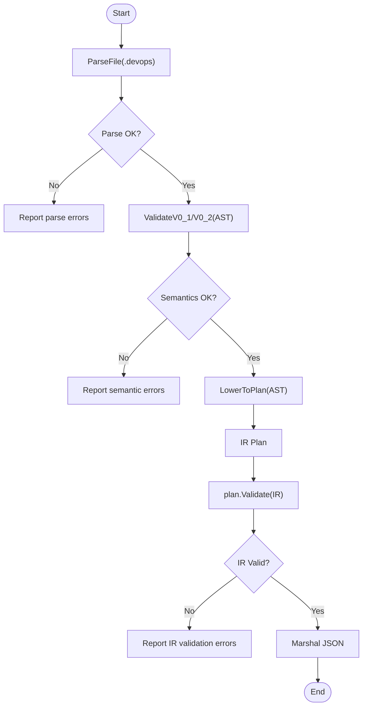
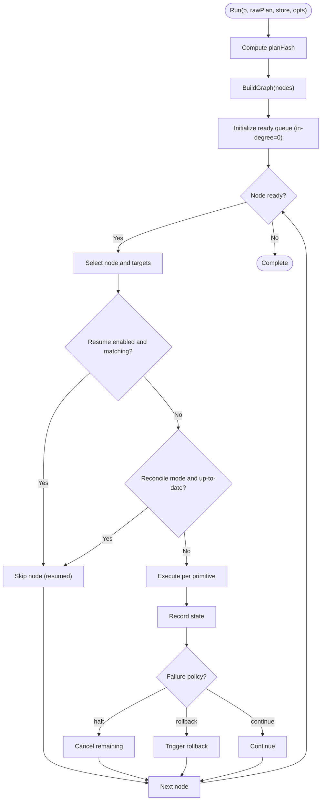
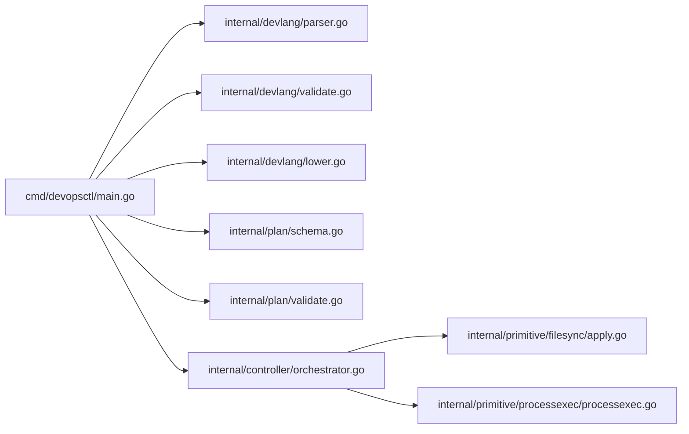

# Apply Command

<cite>
**Referenced Files in This Document**
- [main.go](file://cmd/devopsctl/main.go)
- [orchestrator.go](file://internal/controller/orchestrator.go)
- [schema.go](file://internal/plan/schema.go)
- [validate.go](file://internal/plan/validate.go)
- [parser.go](file://internal/devlang/parser.go)
- [lower.go](file://internal/devlang/lower.go)
- [validate.go](file://internal/devlang/validate.go)
- [processexec.go](file://internal/primitive/processexec/processexec.go)
- [apply.go](file://internal/primitive/filesync/apply.go)
- [store.go](file://internal/state/store.go)
- [plan.devops](file://plan.devops)
- [plan.json](file://plan.json)
- [plan_resume.devops](file://tests/e2e/plan_resume.devops)
- [plan_resume.json](file://tests/e2e/plan_resume.json)
- [resume_test.sh](file://tests/e2e/resume_test.sh)
</cite>

## Update Summary
**Changes Made**
- Enhanced apply command documentation with comprehensive flag configurations
- Added detailed coverage of dry-run functionality and preview mode
- Expanded parallelism controls documentation with concurrency management
- Documented resume capabilities for interrupted executions
- Added language version selection for .devops compilation (v0.1 and v0.2)
- Updated examples to demonstrate new flag combinations
- Enhanced troubleshooting guidance for language version conflicts

## Table of Contents
1. [Introduction](#introduction)
2. [Project Structure](#project-structure)
3. [Core Components](#core-components)
4. [Architecture Overview](#architecture-overview)
5. [Detailed Component Analysis](#detailed-component-analysis)
6. [Dependency Analysis](#dependency-analysis)
7. [Performance Considerations](#performance-considerations)
8. [Troubleshooting Guide](#troubleshooting-guide)
9. [Conclusion](#conclusion)

## Introduction
This document explains the devopsctl apply command: how it compiles .devops source files into execution plans, validates plan structure, and applies those plans to target servers via agents. It covers command syntax, flags, execution modes (apply vs reconcile), and practical examples for building, validating, and running plans. It also provides troubleshooting guidance for common compilation, validation, and execution issues.

## Project Structure
The apply command is implemented in the CLI entry point and integrates with the controller, plan validation, development language compiler, and primitives that execute work on targets.

**Diagram sources**
- [main.go](file://cmd/devopsctl/main.go#L32-L87)
- [orchestrator.go](file://internal/controller/orchestrator.go#L34-L300)
- [schema.go](file://internal/plan/schema.go#L41-L52)
- [validate.go](file://internal/plan/validate.go#L5-L94)
- [parser.go](file://internal/devlang/parser.go#L27-L39)
- [lower.go](file://internal/devlang/lower.go#L9-L65)
- [validate.go](file://internal/devlang/validate.go#L228-L264)
- [apply.go](file://internal/primitive/filesync/apply.go#L19-L204)
- [processexec.go](file://internal/primitive/processexec/processexec.go#L13-L82)

**Section sources**
- [main.go](file://cmd/devopsctl/main.go#L21-L273)

## Core Components
- Command definition and flags:
  - apply <plan>: positional argument accepts either a .devops source file or a pre-compiled JSON plan.
  - Flags:
    - --dry-run: preview changes without applying.
    - --parallelism: max concurrent node executions (default 10).
    - --resume: safely resume from the previous failure point if the plan matches.
    - --lang: language version for .devops plans (v0.1 or v0.2, default v0.2).
- Execution pipeline:
  - If the argument ends with .devops, compile it to an IR plan and JSON using the specified language version.
  - Otherwise, load the JSON plan from disk.
  - Validate the plan structure.
  - Open state store and run the plan with the controller.

**Section sources**
- [main.go](file://cmd/devopsctl/main.go#L32-L100)
- [schema.go](file://internal/plan/schema.go#L11-L33)
- [validate.go](file://internal/plan/validate.go#L5-L94)

## Architecture Overview
The apply command orchestrates a topological execution of nodes across targets, with concurrency control, failure policies, and optional resume/reconcile semantics.

**Diagram sources**
- [main.go](file://cmd/devopsctl/main.go#L36-L82)
- [validate.go](file://internal/plan/validate.go#L5-L94)
- [orchestrator.go](file://internal/controller/orchestrator.go#L34-L300)
- [apply.go](file://internal/primitive/filesync/apply.go#L19-L204)
- [processexec.go](file://internal/primitive/processexec/processexec.go#L13-L82)

## Detailed Component Analysis

### Command Syntax and Flags
- Syntax: devopsctl apply <plan>
  - <plan>: path to a .devops source file or a compiled JSON plan.
- Flags:
  - --dry-run: show diffs and planned changes without applying.
  - --parallelism: integer controlling max concurrent target executions (default 10).
  - --resume: resume interrupted runs by skipping nodes already applied in the same plan.
  - --lang: specify language version for .devops compilation (v0.1 or v0.2, default v0.2).

Notes:
- The apply command supports both .devops and .json inputs. If .devops is provided, it is compiled to JSON internally using the specified language version.
- The reconcile command is separate and uses a different execution mode.
- Language version selection allows backward compatibility with older .devops syntax.

**Section sources**
- [main.go](file://cmd/devopsctl/main.go#L32-L100)

### Compilation from .devops to JSON
- Parsing: .devops is parsed into an AST.
- Validation: language-level checks enforce allowed constructs and primitive inputs.
- Lowering: AST is lowered into the plan IR.
- IR validation: plan-level checks ensure required fields and correct types.
- JSON emission: plan is serialized to JSON for storage and transport.

**Diagram sources**
- [parser.go](file://internal/devlang/parser.go#L27-L39)
- [validate.go](file://internal/devlang/validate.go#L22-L140)
- [lower.go](file://internal/devlang/lower.go#L9-L65)
- [validate.go](file://internal/plan/validate.go#L5-L94)

**Section sources**
- [parser.go](file://internal/devlang/parser.go#L27-L39)
- [validate.go](file://internal/devlang/validate.go#L228-L264)
- [lower.go](file://internal/devlang/lower.go#L9-L65)
- [validate.go](file://internal/plan/validate.go#L5-L94)

### Plan Loading and Validation
- Loading: read JSON file and unmarshal into Plan.
- Validation: check presence of version, targets, nodes; verify IDs, references, and primitive inputs.

Key validations include:
- Required fields: version, targets, nodes.
- Targets require id and address.
- Nodes require id, type, and non-empty targets.
- Unknown references in depends_on or when clauses.
- Failure policy must be one of halt, continue, rollback.
- Primitive-specific inputs:
  - file.sync requires src and dest as strings.
  - process.exec requires cmd as a non-empty array and cwd as a string.

**Section sources**
- [schema.go](file://internal/plan/schema.go#L41-L52)
- [validate.go](file://internal/plan/validate.go#L5-L94)

### Execution Engine (Controller)
- Graph construction: topological ordering from node dependencies.
- Concurrency: semaphore controls parallelism; default 10 if unset.
- Resume: if --resume is set and the last execution matches the plan hash and status is applied, skip re-application.
- Reconcile: a separate mode that uses recorded state as truth; apply mode does not reconcile by default.
- Failure policy: halt, continue, or rollback; halt cancels remaining work; rollback triggers agent-level rollback for safe changesets.
- State recording: persist execution results and change sets.

**Diagram sources**
- [orchestrator.go](file://internal/controller/orchestrator.go#L34-L300)

**Section sources**
- [orchestrator.go](file://internal/controller/orchestrator.go#L26-L32)
- [orchestrator.go](file://internal/controller/orchestrator.go#L34-L300)

### Primitives: file.sync and process.exec
- file.sync:
  - Detects remote state, computes diff, prints diff, optionally streams file chunks, applies changes, snapshots for rollback, records state.
  - Supports mkdir, create/update, chmod, chown, delete based on ChangeSet.
- process.exec:
  - Executes commands locally with cwd, optional timeout, captures stdout/stderr, exits with code and failure classification.

**Section sources**
- [apply.go](file://internal/primitive/filesync/apply.go#L19-L204)
- [processexec.go](file://internal/primitive/processexec/processexec.go#L13-L82)

### Examples

#### Example 1: Compile .devops to JSON with language version selection
- Compile a .devops file to JSON using the plan build command with language version selection.
- Save to a .json file for later use.

References:
- [plan.devops](file://plan.devops#L1-L20)
- [plan.json](file://plan.json#L1-L25)

**Section sources**
- [main.go](file://cmd/devopsctl/main.go#L213-L245)

#### Example 2: Validate plan structure
- Use the apply command with a .json plan; plan.Validate is invoked automatically.
- Fix reported errors (missing fields, unknown references, invalid failure_policy, or primitive input issues).

References:
- [validate.go](file://internal/plan/validate.go#L5-L94)

**Section sources**
- [validate.go](file://internal/plan/validate.go#L5-L94)

#### Example 3: Execute apply against targets with advanced flags
- Prepare a .devops or .json plan.
- Ensure targets have reachable addresses.
- Run devopsctl apply <plan> [--dry-run] [--parallelism N] [--resume] [--lang v0.1|v0.2].

References:
- [plan.devops](file://plan.devops#L1-L20)
- [plan.json](file://plan.json#L1-L25)

**Section sources**
- [main.go](file://cmd/devopsctl/main.go#L32-L100)

#### Example 4: Resume interrupted execution
- Use --resume to skip nodes already applied in the same plan.
- Resume is only effective when the planHash matches the last execution.

References:
- [orchestrator.go](file://internal/controller/orchestrator.go#L183-L210)
- [plan_resume.devops](file://tests/e2e/plan_resume.devops#L1-L43)
- [plan_resume.json](file://tests/e2e/plan_resume.json#L1-L36)

**Section sources**
- [orchestrator.go](file://internal/controller/orchestrator.go#L183-L210)

#### Example 5: Dry-run preview
- Use --dry-run to preview diffs and planned changes without applying.

References:
- [orchestrator.go](file://internal/controller/orchestrator.go#L367-L371)

**Section sources**
- [orchestrator.go](file://internal/controller/orchestrator.go#L367-L371)

#### Example 6: Advanced concurrency control
- Use --parallelism to control maximum concurrent node executions.
- Adjust based on target capacity and network bandwidth.

References:
- [main.go](file://cmd/devopsctl/main.go#L97-L99)

**Section sources**
- [main.go](file://cmd/devopsctl/main.go#L97-L99)

#### Example 7: Language version compatibility
- Use --lang to specify .devops language version (v0.1 or v0.2).
- Default is v0.2 for new plans, v0.1 for backward compatibility.

References:
- [main.go](file://cmd/devopsctl/main.go#L100)

**Section sources**
- [main.go](file://cmd/devopsctl/main.go#L100)

### Apply vs Reconcile Modes
- Apply mode:
  - Executes nodes according to dependencies and conditions.
  - Uses recorded state to decide whether to skip or reconcile; default behavior does not reconcile.
- Reconcile mode:
  - Uses recorded state as truth to bring reality in sync with the plan.
  - Skips nodes already applied and up-to-date.

References:
- [main.go](file://cmd/devopsctl/main.go#L89-L146)
- [orchestrator.go](file://internal/controller/orchestrator.go#L192-L223)

**Section sources**
- [main.go](file://cmd/devopsctl/main.go#L89-L146)
- [orchestrator.go](file://internal/controller/orchestrator.go#L192-L223)

## Dependency Analysis
The apply command depends on:
- CLI wiring for flags and argument handling.
- DevLang compiler for .devops to IR and JSON conversion.
- Plan loader and validator for JSON plans.
- Controller for orchestration, concurrency, and state.
- Primitives for actual work on targets.

**Diagram sources**
- [main.go](file://cmd/devopsctl/main.go#L32-L100)
- [parser.go](file://internal/devlang/parser.go#L27-L39)
- [validate.go](file://internal/devlang/validate.go#L228-L264)
- [lower.go](file://internal/devlang/lower.go#L9-L65)
- [schema.go](file://internal/plan/schema.go#L41-L52)
- [validate.go](file://internal/plan/validate.go#L5-L94)
- [orchestrator.go](file://internal/controller/orchestrator.go#L34-L300)
- [apply.go](file://internal/primitive/filesync/apply.go#L19-L204)
- [processexec.go](file://internal/primitive/processexec/processexec.go#L13-L82)

**Section sources**
- [main.go](file://cmd/devopsctl/main.go#L32-L100)
- [orchestrator.go](file://internal/controller/orchestrator.go#L34-L300)

## Performance Considerations
- Parallelism:
  - Increase --parallelism to speed up independent node/target pairs.
  - Be mindful of target capacity and network bandwidth.
- Concurrency model:
  - The controller uses a semaphore to bound concurrent target executions.
- Streaming:
  - file.sync streams file chunks to avoid buffering entire files.
- Language version performance:
  - v0.2 language version may offer improved compilation performance compared to v0.1.

## Troubleshooting Guide

Common compilation errors (.devops):
- Parse errors: syntax issues detected during parsing.
- Semantic errors: unsupported constructs or invalid primitive inputs in v0.1/v0.2.
- Language version conflicts: using v0.2 features in v0.1 language version.
- Resolution: fix syntax and ensure required attributes for primitives.

Validation failures (both .devops and .json):
- Missing required fields: version, targets, nodes, id, type, targets.
- Unknown references: depends_on or when.node pointing to non-existent nodes.
- Invalid failure_policy: must be halt, continue, or rollback.
- Primitive input issues: file.sync requires src and dest; process.exec requires cmd and cwd.

Execution issues:
- Connectivity: agent address unreachable or wrong port.
- Primitive failures: process.exec exit codes or timeouts; file.sync partial failures.
- Resume behavior: resume only works when planHash matches and previous status was applied.
- Language version mismatch: incompatible syntax between .devops file and --lang setting.

**Section sources**
- [validate.go](file://internal/devlang/validate.go#L22-L140)
- [validate.go](file://internal/plan/validate.go#L5-L94)
- [orchestrator.go](file://internal/controller/orchestrator.go#L313-L513)

## Conclusion
The devopsctl apply command provides a robust pipeline to compile .devops sources into executable plans, validate structure, and apply changes to target servers through agents. Use --dry-run to preview, --parallelism to tune concurrency, --resume to recover from interruptions, and --lang to select the appropriate language version. Prefer reconcile mode when you want to align reality with the plan using recorded state as truth.