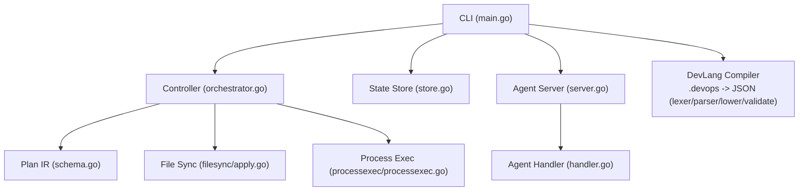
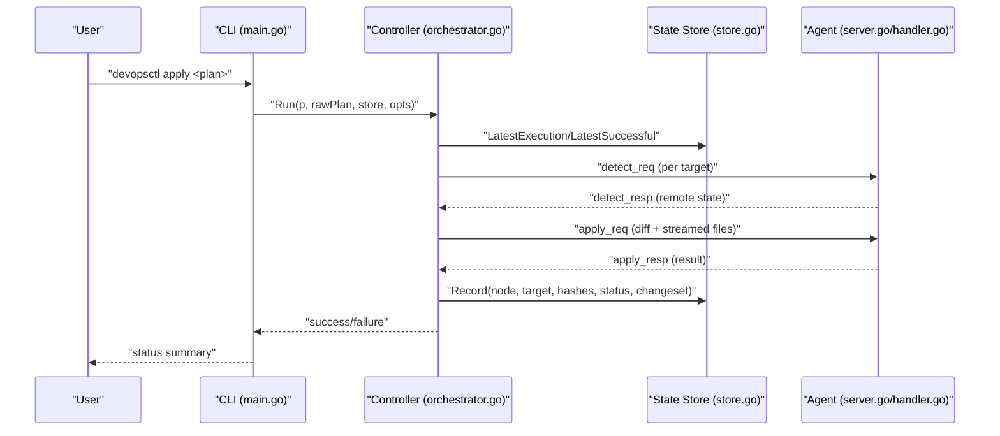
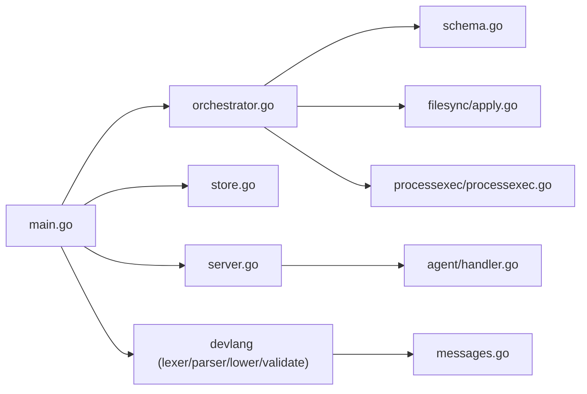

# CLI Commands Reference

<cite>
**Referenced Files in This Document**
- [main.go](file://cmd/devopsctl/main.go)
- [orchestrator.go](file://internal/controller/orchestrator.go)
- [schema.go](file://internal/plan/schema.go)
- [store.go](file://internal/state/store.go)
- [server.go](file://internal/agent/server.go)
- [handler.go](file://internal/agent/handler.go)
- [apply.go](file://internal/primitive/filesync/apply.go)
- [processexec.go](file://internal/primitive/processexec/processexec.go)
- [lexer.go](file://internal/devlang/lexer.go)
- [parser.go](file://internal/devlang/parser.go)
- [lower.go](file://internal/devlang/lower.go)
- [validate.go](file://internal/devlang/validate.go)
- [messages.go](file://internal/proto/messages.go)
- [plan.devops](file://plan.devops)
- [plan.json](file://plan.json)
</cite>

## Update Summary
**Changes Made**
- Updated all command documentation to reflect the complete CLI framework implementation
- Added comprehensive coverage of all six primary commands (apply, reconcile, agent, state, plan, rollback)
- Enhanced architecture diagrams to show complete system integration
- Updated flag descriptions and parameter requirements for all commands
- Added detailed troubleshooting guidance for all command failures
- Expanded practical examples and usage scenarios

## Table of Contents
1. [Introduction](#introduction)
2. [Project Structure](#project-structure)
3. [Core Components](#core-components)
4. [Architecture Overview](#architecture-overview)
5. [Detailed Command Documentation](#detailed-command-documentation)
6. [Dependency Analysis](#dependency-analysis)
7. [Performance Considerations](#performance-considerations)
8. [Troubleshooting Guide](#troubleshooting-guide)
9. [Conclusion](#conclusion)

## Introduction
This document describes the DevOpsCtl command-line interface and all available commands. DevOpsCtl provides a comprehensive CLI framework with six primary commands designed for programming-first DevOps execution:

- **apply**: Execute execution plans against configured targets with dry-run preview, parallelism control, and resume functionality
- **reconcile**: Bring reality in sync with plans using recorded state as truth
- **agent**: Start the DevOpsCtl agent daemon for remote execution
- **state**: Inspect local state store for execution history and status
- **plan**: Manage execution plans including compilation and fingerprint computation
- **rollback**: Reverse previous executions with selective node support

The CLI integrates with the execution engine, state store, agent daemon, and development language compiler to provide a robust DevOps automation platform.

## Project Structure
DevOpsCtl is organized around a CLI entry point that wires subcommands to controllers, state storage, and the agent server. The CLI delegates to specialized components for plan execution, state management, and distributed agent coordination.



**Diagram sources**
- [main.go](file://cmd/devopsctl/main.go#L21-L312)
- [orchestrator.go](file://internal/controller/orchestrator.go#L34-L300)
- [schema.go](file://internal/plan/schema.go#L11-L77)
- [store.go](file://internal/state/store.go#L33-L226)
- [server.go](file://internal/agent/server.go#L15-L51)
- [handler.go](file://internal/agent/handler.go#L16-L189)
- [apply.go](file://internal/primitive/filesync/apply.go#L19-L252)
- [processexec.go](file://internal/primitive/processexec/processexec.go#L13-L83)
- [lexer.go](file://internal/devlang/lexer.go#L41-L247)
- [parser.go](file://internal/devlang/parser.go#L27-L495)
- [lower.go](file://internal/devlang/lower.go#L9-L91)
- [validate.go](file://internal/devlang/validate.go#L21-L265)

**Section sources**
- [main.go](file://cmd/devopsctl/main.go#L21-L312)

## Core Components
The DevOpsCtl CLI framework consists of several interconnected components that work together to provide comprehensive DevOps automation capabilities:

- **CLI Entry Point**: Defines all six primary commands with their flags and subcommands
- **Controller Orchestrator**: Manages plan execution, concurrency control, and state transitions
- **State Store**: Persists execution records with SQLite backend and supports resume/reconcile operations
- **Agent Daemon**: Handles remote execution requests from the controller with streaming file transfers
- **Development Language Compiler**: Transforms .devops source files into executable plan JSON with dual language support (v0.1 and v0.2)

**Section sources**
- [main.go](file://cmd/devopsctl/main.go#L27-L312)
- [orchestrator.go](file://internal/controller/orchestrator.go#L26-L300)
- [store.go](file://internal/state/store.go#L33-L226)
- [server.go](file://internal/agent/server.go#L15-L51)
- [validate.go](file://internal/devlang/validate.go#L228-L265)

## Architecture Overview
The CLI commands route to the controller, which builds an execution graph from the plan, dispatches work to targets via the agent, and records outcomes in the state store. The state store enables resume and reconcile semantics with comprehensive audit trails.



**Diagram sources**
- [main.go](file://cmd/devopsctl/main.go#L32-L87)
- [orchestrator.go](file://internal/controller/orchestrator.go#L34-L300)
- [store.go](file://internal/state/store.go#L68-L160)
- [server.go](file://internal/agent/server.go#L20-L51)
- [handler.go](file://internal/agent/handler.go#L16-L139)

## Detailed Command Documentation

### Command: apply
**Purpose**
Execute an execution plan against configured targets with comprehensive preview, parallelism control, and safe resume functionality.

**Syntax**
```
devopsctl apply <plan>
```

**Parameters**
- `<plan>`: Path to .devops source file or compiled plan.json

**Flags**
- `--dry-run`: Preview changes without applying (boolean, default: false)
- `--parallelism`: Maximum concurrent node executions (integer, default: 10)
- `--resume`: Safely resume execution from previous failure point (boolean, default: false)
- `--lang`: Language version for .devops plans (string, default: "v0.2", supported: "v0.1", "v0.2")

**Behavior Highlights**
- Automatically detects file extension and compiles .devops files using DevLang compiler
- Validates plan structure and primitive configurations
- Opens state store and runs controller with specified execution options
- Uses target-level semaphore for concurrency control with failure policies

**Usage Patterns**
- Dry-run preview: `devopsctl apply --dry-run plan.json`
- Parallel deployment: `devopsctl apply --parallelism 20 plan.json`
- Resume interrupted run: `devopsctl apply --resume plan.json`
- Compile and apply: `devopsctl apply --lang v0.1 myplan.devops`

**Practical Examples**
- Apply compiled plan: `devopsctl apply plan.json`
- Apply .devops file with custom language: `devopsctl apply --lang v0.2 myplan.devops`
- Preview changes before production: `devopsctl apply --dry-run --parallelism 5 plan.json`

**Common Scenarios**
- Resume after transient failure: Ensure plan_hash and node_hash match latest execution
- Conditional apply: Use node.when conditions to gate dependent nodes
- Multi-environment deployment: Control concurrency with parallelism flag

**Error Handling**
- Compilation/validation errors are reported with specific line numbers
- Controller aggregates per-node errors and halts according to failure_policy
- Resume functionality validates plan_hash and node_hash compatibility

**Section sources**
- [main.go](file://cmd/devopsctl/main.go#L27-L101)
- [orchestrator.go](file://internal/controller/orchestrator.go#L26-L300)
- [schema.go](file://internal/plan/schema.go#L41-L77)
- [store.go](file://internal/state/store.go#L68-L160)

### Command: reconcile
**Purpose**
Bring reality in sync with the plan using recorded state as truth, skipping nodes already up-to-date and marking others as skipped/blocked accordingly.

**Syntax**
```
devopsctl reconcile <plan>
```

**Parameters**
- `<plan>`: Path to .devops source file or compiled plan.json

**Flags**
- `--dry-run`: Preview diffs without applying (boolean, default: false)
- `--parallelism`: Maximum concurrent node executions (integer, default: 10)
- `--lang`: Language version for .devops plans (string, default: "v0.2", supported: "v0.1", "v0.2")

**Behavior Highlights**
- Same compile/load/validate pipeline as apply command
- Runs controller with Reconcile=true option
- Compares latest execution's node_hash to determine if node is up-to-date
- Skips nodes that match current state, avoiding unnecessary work

**Usage Patterns**
- Periodic reconciliation: `devopsctl reconcile plan.json`
- Dry-run reconciliation: `devopsctl reconcile --dry-run plan.json`
- Scheduled maintenance: `devopsctl reconcile --parallelism 5 nightly-plan.json`

**Practical Examples**
- Reconcile infrastructure state: `devopsctl reconcile --dry-run infra-plan.json`
- Production reconciliation: `devopsctl reconcile production-plan.json`

**Error Handling**
- Maintains same error handling patterns as apply command
- Respects failure_policy settings during reconciliation
- Preserves existing state for nodes that don't require changes

**Section sources**
- [main.go](file://cmd/devopsctl/main.go#L102-L172)
- [orchestrator.go](file://internal/controller/orchestrator.go#L184-L223)
- [store.go](file://internal/state/store.go#L100-L160)

### Command: agent
**Purpose**
Start the DevOpsCtl agent daemon on a TCP address to serve detect/apply/rollback requests from the controller.

**Syntax**
```
devopsctl agent
```

**Flags**
- `--addr`: TCP address to listen on (string, default: ":7700")

**Behavior Highlights**
- Starts a long-running TCP server on specified address
- Handles controller connections with line-delimited JSON protocol
- Invokes agent handlers for detect/apply/rollback operations
- Graceful shutdown on SIGTERM/SIGINT signals

**Network Configuration**
- Default port is 7700 (can be overridden with --addr)
- Targets in plans should specify address as host:port
- Protocol uses line-delimited JSON messages

**Usage Patterns**
- Start agent on default port: `devopsctl agent`
- Custom port configuration: `devopsctl agent --addr :8800`
- Background execution: `devopsctl agent --addr :7700 &`

**Practical Examples**
- Single agent deployment: `devopsctl agent --addr :7700`
- Multiple agent instances: `devopsctl agent --addr :7701`

**Error Handling**
- Agent listen errors are reported with specific address information
- Connection handling errors are logged but don't terminate the service
- Graceful shutdown prevents orphaned connections

**Section sources**
- [main.go](file://cmd/devopsctl/main.go#L174-L185)
- [server.go](file://internal/agent/server.go#L15-L51)
- [handler.go](file://internal/agent/handler.go#L16-L51)

### Command: state
**Purpose**
Inspect the local state store for execution history and status with filtering capabilities.

**Syntax**
```
devopsctl state <subcommand> [flags]
```

**Subcommands**
- `state list`: List executions from the state store

**Flags for state list**
- `--node`: Filter executions by node ID (string, default: "")

**Behavior Highlights**
- Opens state store from ~/.devopsctl/state.db
- Lists executions with ID, NODE, TARGET, STATUS, TIMESTAMP
- Supports node-based filtering for focused queries
- Uses tabular output format for readability

**Usage Patterns**
- List all executions: `devopsctl state list`
- Filter by node: `devopsctl state list --node nginx-config`
- Audit deployments: `devopsctl state list --node database-backup`

**Practical Examples**
- View complete execution history: `devopsctl state list`
- Check specific node status: `devopsctl state list --node web-server`

**Output Format**
Tabular listing showing:
- ID: Unique execution identifier
- NODE: Node ID from the plan
- TARGET: Target server identifier
- STATUS: Current execution status
- TIMESTAMP: RFC3339 formatted timestamp

**Error Handling**
- Database connection errors are reported with specific error details
- Query execution errors are surfaced with SQL error information
- Missing state database is handled gracefully with informative messages

**Section sources**
- [main.go](file://cmd/devopsctl/main.go#L187-L218)
- [store.go](file://internal/state/store.go#L38-L226)

### Command: plan
**Purpose**
Manage execution plans including compilation from .devops source files and fingerprint computation.

**Syntax**
```
devopsctl plan <subcommand> [flags]
```

**Subcommands**
- `plan build <file.devops>`: Compile a .devops file into plan JSON
- `plan hash <plan.json>`: Print SHA-256 fingerprint of a plan

**Flags for plan build**
- `--output` or `-o`: Output file for compiled plan JSON (string, default: stdout)
- `--lang`: Language version for .devops files (string, default: "v0.2", supported: "v0.1", "v0.2")

**Behavior Highlights**
- `plan build`: Compiles .devops to plan JSON using DevLang compiler
- `plan hash`: Computes SHA-256 fingerprint for plan verification
- Supports both v0.1 and v0.2 language versions
- Validates compiled output before writing to file

**Usage Patterns**
- Build to stdout: `devopsctl plan build myplan.devops`
- Build to file: `devopsctl plan build --output plan.json myplan.devops`
- Compute fingerprint: `devopsctl plan hash plan.json`

**Practical Examples**
- Compile development plan: `devopsctl plan build --output dev-plan.json development.devops`
- Production validation: `devopsctl plan hash production-plan.json`
- CI/CD integration: `devopsctl plan build --output plan.json $PLAN_FILE`

**Error Handling**
- Compilation errors include specific line and column information
- Language version validation prevents unsupported combinations
- File I/O errors are reported with specific file paths

**Section sources**
- [main.go](file://cmd/devopsctl/main.go#L220-L284)
- [validate.go](file://internal/devlang/validate.go#L228-L265)
- [lexer.go](file://internal/devlang/lexer.go#L41-L247)
- [parser.go](file://internal/devlang/parser.go#L27-L495)
- [lower.go](file://internal/devlang/lower.go#L9-L91)

### Command: rollback
**Purpose**
Rollback the last execution run with selective node support and comprehensive error handling.

**Syntax**
```
devopsctl rollback
```

**Flags**
- `--last`: Required flag to trigger rollback of the most recent run (boolean, default: false)

**Behavior Highlights**
- Reads the last run from state store using plan_hash
- Issues rollback requests to agent for each successful file.sync node
- Records rollback outcome in state store
- Process.exec nodes are not rollbackable at this time

**Usage Patterns**
- Basic rollback: `devopsctl rollback --last`
- Post-failure cleanup: `devopsctl rollback --last`

**Practical Examples**
- Undo recent changes: `devopsctl rollback --last`
- Emergency rollback: `devopsctl rollback --last`

**Important Notes**
- Only file.sync nodes support rollback functionality
- process.exec nodes cannot be rolled back due to irreversibility
- Rollback preserves snapshot information for file restoration
- Rollback operations are recorded in state store for audit trails

**Error Handling**
- Missing previous run errors are reported with specific guidance
- Agent communication errors are logged with node-specific context
- Partial rollback scenarios are handled gracefully with warnings

**Section sources**
- [main.go](file://cmd/devopsctl/main.go#L286-L305)
- [orchestrator.go](file://internal/controller/orchestrator.go#L618-L652)
- [store.go](file://internal/state/store.go#L190-L225)
- [handler.go](file://internal/agent/handler.go#L147-L179)

## Dependency Analysis
The CLI commands depend on the controller, state store, and agent. The controller depends on plan IR and primitives. The DevLang compiler produces plan IR from .devops with dual language support.



**Diagram sources**
- [main.go](file://cmd/devopsctl/main.go#L14-L18)
- [orchestrator.go](file://internal/controller/orchestrator.go#L5-L22)
- [schema.go](file://internal/plan/schema.go#L4-L8)
- [store.go](file://internal/state/store.go#L4-L15)
- [server.go](file://internal/agent/server.go#L5-L13)
- [handler.go](file://internal/agent/handler.go#L3-L14)
- [apply.go](file://internal/primitive/filesync/apply.go#L3-L15)
- [processexec.go](file://internal/primitive/processexec/processexec.go#L3-L11)
- [lexer.go](file://internal/devlang/lexer.go#L1-L7)
- [parser.go](file://internal/devlang/parser.go#L1-L7)
- [lower.go](file://internal/devlang/lower.go#L1-L7)
- [validate.go](file://internal/devlang/validate.go#L1-L8)
- [messages.go](file://internal/proto/messages.go#L1-L10)

**Section sources**
- [main.go](file://cmd/devopsctl/main.go#L14-L18)
- [orchestrator.go](file://internal/controller/orchestrator.go#L5-L22)

## Performance Considerations
- **Parallelism Control**: Use --parallelism to control concurrency. Values <= 0 are normalized to default (10). Higher values increase throughput but consume more resources.
- **Resume Optimization**: Resume avoids re-applying successful steps when plan_hash and node_hash match, significantly reducing redundant work for partial failures.
- **Reconcile Efficiency**: Skips nodes already up-to-date, minimizing network and disk I/O operations.
- **Streaming Transfers**: File transfers are streamed in 256KB chunks to avoid buffering entire files, optimizing memory usage during large deployments.
- **State Store Performance**: SQLite WAL mode provides better concurrent access patterns for state queries.
- **Agent Connection Pooling**: TCP connections are reused efficiently across multiple node operations.

## Troubleshooting Guide

### Common Issues and Resolutions

**Plan Validation Errors**
- **Symptom**: "plan validation failed" or specific validation messages
- **Cause**: Missing fields, invalid types, or unsupported constructs in plan.json/.devops
- **Resolution**: Check required fields (src/dest for file.sync, cmd for process.exec), verify primitive types, and ensure proper syntax

**Unknown Target or Node References**
- **Symptom**: "unknown target" or "unknown depends_on node" errors
- **Cause**: References to non-existent targets or nodes in plan
- **Resolution**: Verify target declarations exist and node IDs match exactly

**Invalid Failure Policy**
- **Symptom**: "invalid failure_policy" error
- **Cause**: Unsupported failure policy values
- **Resolution**: Use allowed values: "halt", "continue", "rollback"

**.devops Compilation Errors**
- **Symptom**: Syntax errors or semantic validation failures
- **Cause**: Language version mismatch or unsupported constructs
- **Resolution**: Check language version compatibility (v0.1 vs v0.2), verify supported constructs, and review error line numbers

**Agent Connectivity Issues**
- **Symptom**: "connect to agent" or "agent accept" errors
- **Cause**: Network connectivity problems or wrong address format
- **Resolution**: Verify --addr flag format (host:port), check agent is running, and validate firewall settings

**Resume Not Triggered**
- **Symptom**: Resume ignored despite --resume flag
- **Cause**: plan_hash or node_hash mismatch with latest execution
- **Resolution**: Ensure identical plan content and node definitions, verify state store integrity

**Rollback Limitations**
- **Symptom**: "process.exec cannot be rolled back" errors
- **Cause**: process.exec nodes lack rollback capability
- **Resolution**: Use file.sync nodes for rollbackable operations, implement manual recovery procedures

### Error Handling Patterns
- **Controller Aggregation**: Controller aggregates per-node errors and halts according to failure_policy settings
- **Agent Protocol Errors**: Agent handler returns typed errors for malformed requests with specific error messages
- **State Store Diagnostics**: State store records outcomes with timestamps and change sets for comprehensive debugging
- **Protocol Validation**: Line-delimited JSON protocol ensures message boundaries and provides structured error reporting

**Section sources**
- [validate.go](file://internal/devlang/validate.go#L22-L140)
- [schema.go](file://internal/plan/schema.go#L41-L94)
- [orchestrator.go](file://internal/controller/orchestrator.go#L244-L266)
- [handler.go](file://internal/agent/handler.go#L181-L189)
- [store.go](file://internal/state/store.go#L68-L160)

## Conclusion
DevOpsCtl provides a comprehensive CLI framework for authoring, validating, and executing plans against remote targets. The six primary commands (apply, reconcile, agent, state, plan, rollback) offer safe, resumable, and reconciled execution with robust distributed operation and auditing capabilities. The apply and reconcile commands provide essential safety mechanisms through dry-run previews, parallelism control, and resume functionality, while the agent and state store enable reliable distributed operation and comprehensive audit trails. The plan and state commands facilitate artifact management and execution history inspection, supporting both development workflows and production operations.