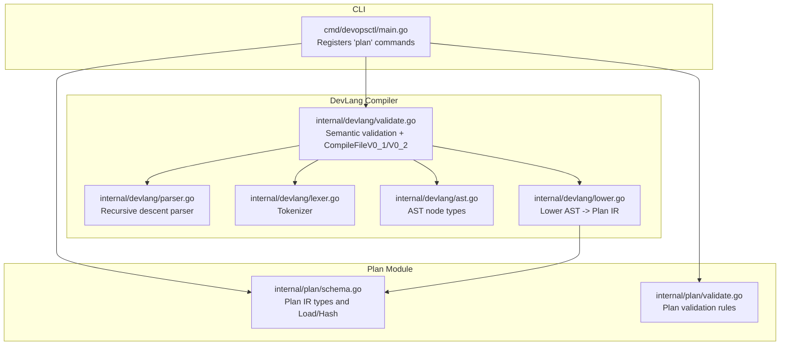
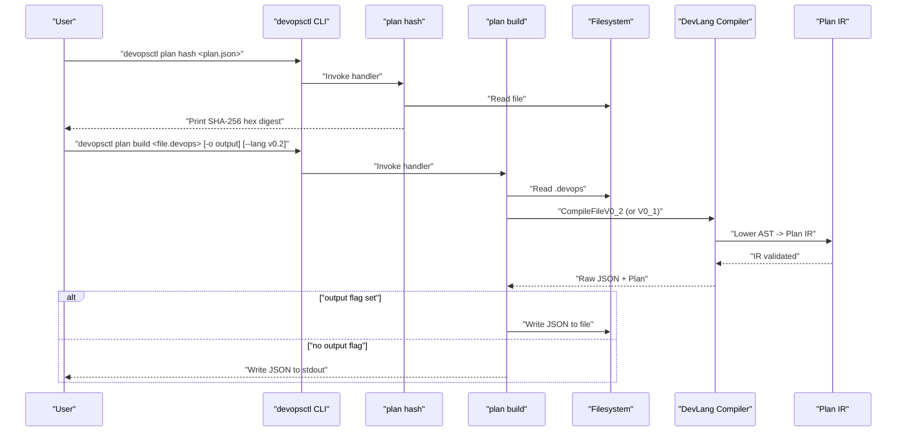
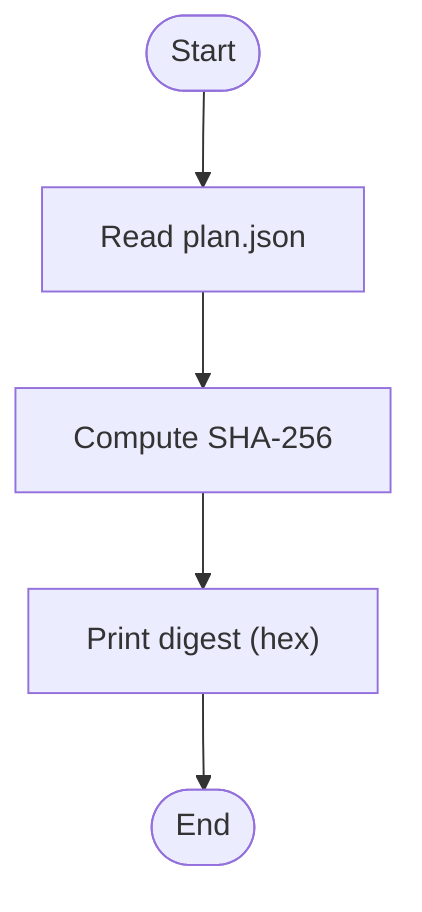
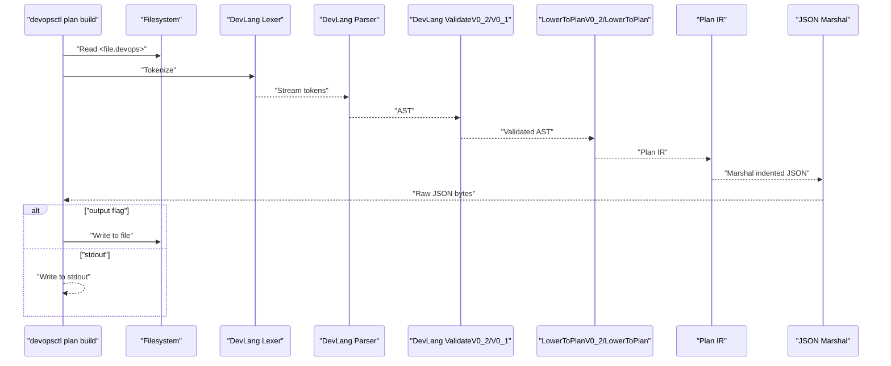
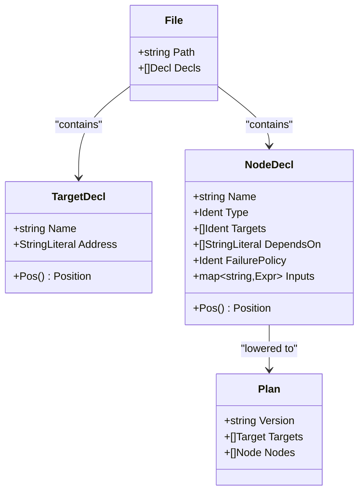
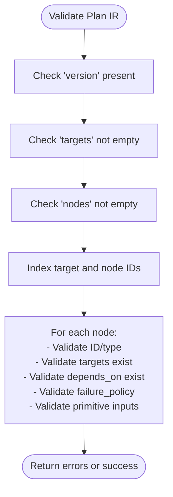
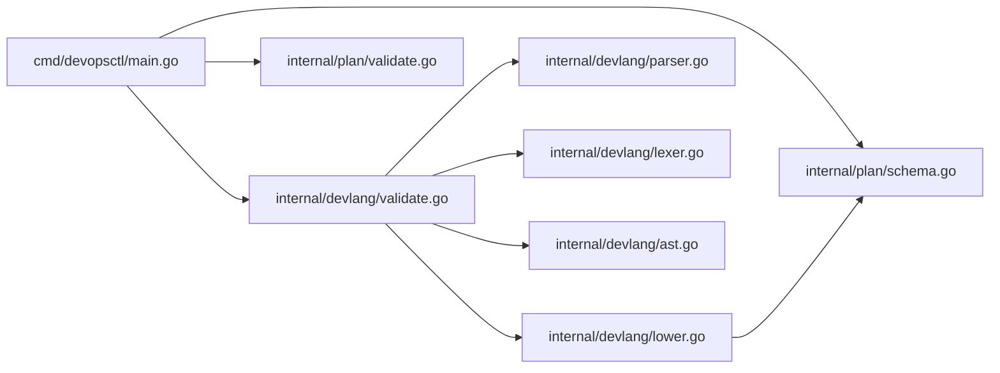

# Plan Command

<cite>
**Referenced Files in This Document**
- [main.go](file://cmd/devopsctl/main.go)
- [schema.go](file://internal/plan/schema.go)
- [validate.go](file://internal/plan/validate.go)
- [parser.go](file://internal/devlang/parser.go)
- [lexer.go](file://internal/devlang/lexer.go)
- [ast.go](file://internal/devlang/ast.go)
- [lower.go](file://internal/devlang/lower.go)
- [validate.go](file://internal/devlang/validate.go)
- [plan.devops](file://plan.devops)
- [plan.json](file://plan.json)
- [plan_resume.devops](file://tests/e2e/plan_resume.devops)
- [plan_resume.json](file://tests/e2e/plan_resume.json)
</cite>

## Update Summary
**Changes Made**
- Enhanced plan command documentation with comprehensive coverage of plan management subcommands
- Added detailed documentation for plan hash functionality including SHA-256 fingerprint calculation
- Documented plan build functionality with .devops compilation process and language version support
- Included comprehensive error reporting mechanisms and troubleshooting guidance
- Updated architecture diagrams to reflect the complete plan command family implementation
- Added practical examples for CI/CD integration and automated plan validation

## Table of Contents
1. [Introduction](#introduction)
2. [Project Structure](#project-structure)
3. [Core Components](#core-components)
4. [Architecture Overview](#architecture-overview)
5. [Detailed Component Analysis](#detailed-component-analysis)
6. [Dependency Analysis](#dependency-analysis)
7. [Performance Considerations](#performance-considerations)
8. [Troubleshooting Guide](#troubleshooting-guide)
9. [Conclusion](#conclusion)
10. [Appendices](#appendices)

## Introduction
This document explains the devopsctl plan command family with a focus on plan hash and plan build subcommands. It covers how to compute SHA-256 fingerprints of JSON plans for verification and change detection, and how to compile .devops source files into JSON plans. The plan command family provides essential plan management capabilities including verification, compilation, and validation workflows. It documents the compilation pipeline from source to JSON, including AST construction, semantic validation, lowering to IR, and JSON output generation. Guidance is provided for build output options, error handling, and CI/CD integration.

## Project Structure
The plan command family resides under the main CLI entry point and integrates with the development language compiler and plan schema/validation modules.

**Diagram sources**
- [main.go](file://cmd/devopsctl/main.go#L220-L284)
- [schema.go](file://internal/plan/schema.go#L11-L77)
- [validate.go](file://internal/plan/validate.go#L5-L95)
- [parser.go](file://internal/devlang/parser.go#L27-L39)
- [lexer.go](file://internal/devlang/lexer.go#L41-L57)
- [ast.go](file://internal/devlang/ast.go#L14-L18)
- [lower.go](file://internal/devlang/lower.go#L9-L65)
- [validate.go](file://internal/devlang/validate.go#L417-L491)

**Section sources**
- [main.go](file://cmd/devopsctl/main.go#L220-L284)

## Core Components
The plan command family consists of two primary subcommands:

### plan hash
- Purpose: Compute the SHA-256 fingerprint of a plan.json file for verification and change detection.
- Command syntax: `devopsctl plan hash <plan.json>`
- Behavior: Reads the entire file into memory, computes SHA-256, and prints the digest as a lowercase hexadecimal string followed by a newline.
- Input: Path to a plan.json file.
- Output: Single line containing the SHA-256 digest.

### plan build
- Purpose: Compile a .devops source file into a JSON plan.
- Command syntax: `devopsctl plan build <file.devops> [--output|-o <file.json>] [--lang <version>]`
- Behavior: Reads the .devops source file, compiles via the development language compiler, validates the resulting IR, and outputs JSON. Supports language version selection (v0.1 or v0.2) and optional output flag to write to a file.
- Inputs: .devops file path and optional flags for output location and language version.
- Outputs: Raw JSON bytes to stdout or file, with comprehensive error reporting.

Key behaviors:
- plan hash: Accepts a single positional argument (path to plan.json), reads the file, computes SHA-256, and prints the digest.
- plan build: Accepts a single positional argument (.devops file), compiles via the development language compiler, validates the resulting IR, and outputs JSON. Supports an optional output flag to write to a file and language version specification.

**Section sources**
- [main.go](file://cmd/devopsctl/main.go#L225-L284)

## Architecture Overview
The plan command family orchestrates two primary flows:
- plan hash: Direct file I/O and hashing.
- plan build: Full compilation pipeline from .devops to JSON.

**Diagram sources**
- [main.go](file://cmd/devopsctl/main.go#L225-L284)
- [validate.go](file://internal/devlang/validate.go#L455-L491)
- [lower.go](file://internal/devlang/lower.go#L92-L148)
- [schema.go](file://internal/plan/schema.go#L41-L52)

## Detailed Component Analysis

### plan hash
Purpose:
- Compute the SHA-256 fingerprint of a plan.json file for verification and change detection.

Command syntax:
- devopsctl plan hash <plan.json>

Behavior:
- Reads the entire file into memory.
- Computes SHA-256 and prints the digest as a lowercase hexadecimal string followed by a newline.

Inputs:
- Path to a plan.json file.

Outputs:
- Single line containing the SHA-256 digest.

Example usage:
- Computing a fingerprint for a generated plan.json to track changes across CI runs.

**Diagram sources**
- [main.go](file://cmd/devopsctl/main.go#L225-L237)

**Section sources**
- [main.go](file://cmd/devopsctl/main.go#L225-L237)

### plan build
Purpose:
- Compile a .devops source file into a JSON plan.

Command syntax:
- devopsctl plan build <file.devops> [--output|-o <file.json>] [--lang <version>]

Behavior:
- Reads the .devops source file.
- Invokes the development language compiler to produce a plan IR and raw JSON.
- Validates compilation errors; if present, prints each error and exits with failure.
- If successful:
  - If output flag is provided, writes the raw JSON to the specified file.
  - Otherwise, writes the raw JSON to stdout and ensures trailing newline.

Language versions:
- v0.1: Supports target/node declarations, basic expressions, and primitive validation.
- v0.2: Enhanced with let bindings, for expressions, step declarations, and module support.

Compilation pipeline:
- Lexical analysis: tokenize source into tokens.
- Parsing: construct an AST from tokens.
- Semantic validation: enforce language version rules and node constraints.
- Lowering: convert AST to Plan IR.
- IR validation: validate structural correctness of the Plan IR.
- JSON serialization: marshal the Plan IR to indented JSON.

**Diagram sources**
- [main.go](file://cmd/devopsctl/main.go#L241-L284)
- [validate.go](file://internal/devlang/validate.go#L455-L491)
- [parser.go](file://internal/devlang/parser.go#L27-L39)
- [lexer.go](file://internal/devlang/lexer.go#L41-L57)
- [ast.go](file://internal/devlang/ast.go#L14-L18)
- [lower.go](file://internal/devlang/lower.go#L92-L148)
- [schema.go](file://internal/plan/schema.go#L41-L52)

**Section sources**
- [main.go](file://cmd/devopsctl/main.go#L241-L284)
- [validate.go](file://internal/devlang/validate.go#L417-L491)
- [parser.go](file://internal/devlang/parser.go#L27-L39)
- [lexer.go](file://internal/devlang/lexer.go#L41-L57)
- [ast.go](file://internal/devlang/ast.go#L14-L18)
- [lower.go](file://internal/devlang/lower.go#L92-L148)
- [schema.go](file://internal/plan/schema.go#L41-L52)

### Compilation Pipeline Details
- Lexing: Converts source bytes into tokens, skipping whitespace and comments, recognizing keywords, operators, and literals.
- Parsing: Builds an AST from declarations (targets, nodes) and expressions (strings, booleans, lists).
- Semantic validation: Enforces language version constraints, duplicate declarations, unknown references, and primitive-specific input requirements.
- Lowering: Translates AST into Plan IR, collecting targets and nodes and converting expressions to typed values.
- IR validation: Ensures structural correctness of the Plan IR (presence of version/targets/nodes, valid types, and required attributes).
- JSON output: Serializes the Plan IR to indented JSON.

**Diagram sources**
- [ast.go](file://internal/devlang/ast.go#L14-L83)
- [lower.go](file://internal/devlang/lower.go#L9-L65)
- [schema.go](file://internal/plan/schema.go#L11-L33)

**Section sources**
- [lexer.go](file://internal/devlang/lexer.go#L41-L100)
- [parser.go](file://internal/devlang/parser.go#L27-L98)
- [ast.go](file://internal/devlang/ast.go#L14-L83)
- [lower.go](file://internal/devlang/lower.go#L92-L148)
- [validate.go](file://internal/devlang/validate.go#L21-L140)

### Plan IR and Validation
- Plan IR: Top-level structure includes version, targets, and nodes. Each node includes type, targets, optional dependencies, optional condition, optional failure policy, and inputs.
- IR validation: Checks presence of required fields, unknown references, and primitive-specific constraints.

**Diagram sources**
- [validate.go](file://internal/plan/validate.go#L5-L95)
- [schema.go](file://internal/plan/schema.go#L11-L33)

**Section sources**
- [schema.go](file://internal/plan/schema.go#L11-L77)
- [validate.go](file://internal/plan/validate.go#L5-L95)

## Dependency Analysis
The plan command family depends on:
- CLI registration and handlers in main.go.
- Plan IR types and validation in internal/plan.
- Development language compiler in internal/devlang.

**Diagram sources**
- [main.go](file://cmd/devopsctl/main.go#L220-L284)
- [schema.go](file://internal/plan/schema.go#L11-L77)
- [validate.go](file://internal/plan/validate.go#L5-L95)
- [validate.go](file://internal/devlang/validate.go#L417-L491)
- [parser.go](file://internal/devlang/parser.go#L27-L39)
- [lexer.go](file://internal/devlang/lexer.go#L41-L57)
- [ast.go](file://internal/devlang/ast.go#L14-L18)
- [lower.go](file://internal/devlang/lower.go#L92-L148)

**Section sources**
- [main.go](file://cmd/devopsctl/main.go#L220-L284)

## Performance Considerations
- plan hash: Linear-time file read plus SHA-256 computation; negligible overhead for typical plan sizes.
- plan build: I/O dominates for small files; CPU cost is dominated by parsing, semantic validation, lowering, and JSON marshalling. For large .devops files, consider:
  - Minimizing unnecessary whitespace/comments to reduce lexing overhead.
  - Avoiding overly large lists or deeply nested structures in inputs.
  - Using the output flag to avoid extra stdout buffering in CI environments.
  - Selecting appropriate language version (v0.1 vs v0.2) based on complexity requirements.

## Troubleshooting Guide
Common issues and resolutions:
- plan hash
  - Permission denied: Ensure read access to the plan.json file.
  - Not a regular file: Verify the path points to a file, not a directory.
- plan build
  - File read errors: Confirm the .devops file exists and is readable.
  - Compilation errors:
    - Syntax errors: The compiler reports precise line and column positions.
    - Semantic errors: Unknown primitives, invalid failure policies, or missing required attributes.
    - IR validation errors: Structural issues detected after lowering (e.g., unknown targets or nodes).
  - Output failures: If using --output, ensure the destination path is writable.
  - Language version errors: Specify supported versions (v0.1 or v0.2) with --lang flag.

Integration tips:
- CI/CD pipelines:
  - Use plan build to generate plan.json artifacts.
  - Use plan hash to capture and compare digests across builds for change detection.
  - Fail fast on compilation errors by checking exit codes.
  - Cache compiled plans to speed up subsequent builds.

**Section sources**
- [main.go](file://cmd/devopsctl/main.go#L225-L284)
- [validate.go](file://internal/devlang/validate.go#L10-L140)
- [validate.go](file://internal/plan/validate.go#L5-L95)

## Conclusion
The devopsctl plan command family provides efficient plan verification via SHA-256 hashing and robust compilation from .devops to JSON. The compilation pipeline is well-defined, with clear error reporting and validation at each stage. The implementation supports multiple language versions and comprehensive error handling. Integrating plan hash and plan build into CI/CD enables reliable, deterministic plan generation and change detection.

## Appendices

### Example Workflows
- Compile and validate a .devops file:
  - devopsctl plan build plan.devops
- Write compiled JSON to a file:
  - devopsctl plan build plan.devops -o plan.json
- Compute a plan fingerprint:
  - devopsctl plan hash plan.json
- Use specific language version:
  - devopsctl plan build app.devops --lang v0.1 -o app.json
- End-to-end CI-friendly workflow:
  - Build plan: devopsctl plan build app.devops -o app.json
  - Capture fingerprint: devopsctl plan hash app.json > app.fingerprint
  - Compare fingerprints in CI to detect changes

**Section sources**
- [main.go](file://cmd/devopsctl/main.go#L241-L284)
- [plan.devops](file://plan.devops#L1-L20)
- [plan.json](file://plan.json#L1-L25)

### Sample Files
- Example .devops source with targets and nodes:
  - [plan.devops](file://plan.devops#L1-L20)
- Corresponding JSON plan:
  - [plan.json](file://plan.json#L1-L25)
- Extended .devops with dependencies for reconciliation scenarios:
  - [plan_resume.devops](file://tests/e2e/plan_resume.devops#L1-L43)
- Corresponding JSON plan:
  - [plan_resume.json](file://tests/e2e/plan_resume.json#L1-L36)

### Error Reporting and Exit Codes
The plan command family provides comprehensive error reporting with detailed error messages including file paths, line numbers, and column positions. Compilation failures return non-zero exit codes to enable proper CI/CD integration and error handling.

**Section sources**
- [validate.go](file://internal/devlang/validate.go#L10-L19)
- [validate.go](file://internal/devlang/validate.go#L196-L315)
- [validate.go](file://internal/devlang/validate.go#L417-L491)