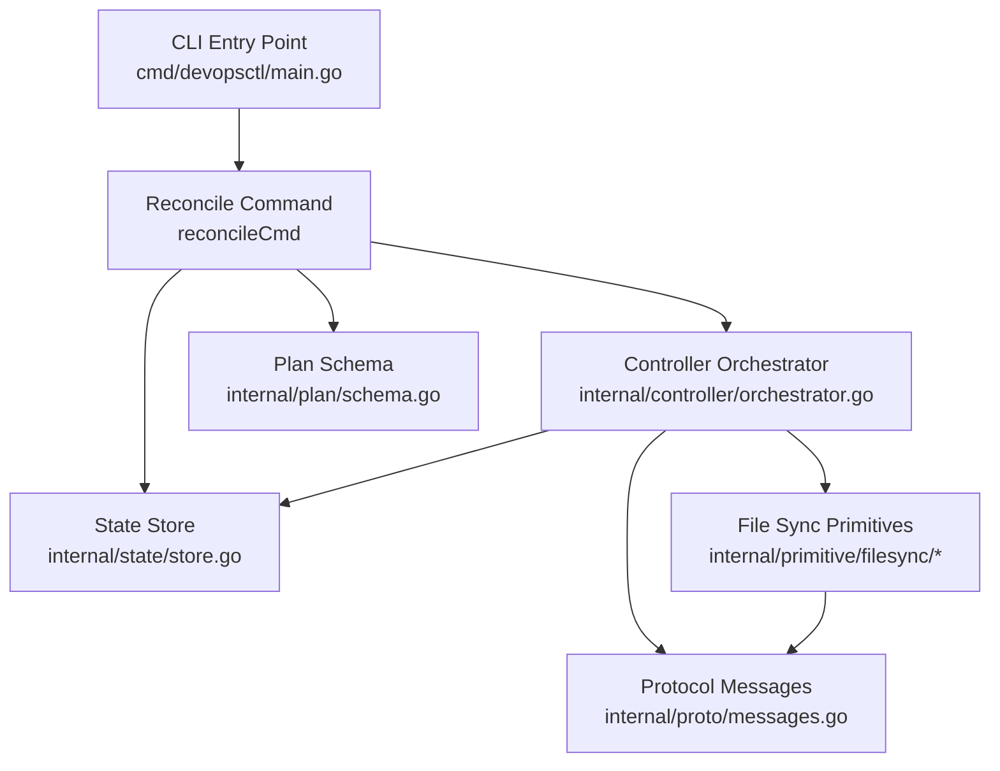
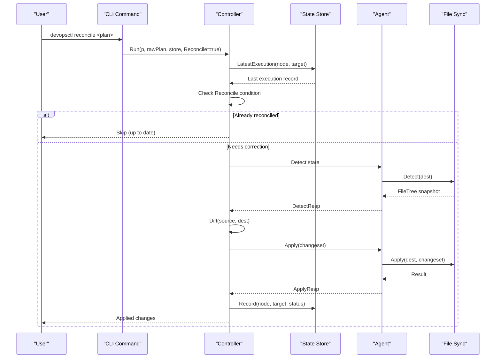
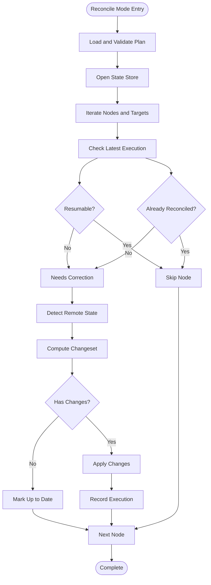
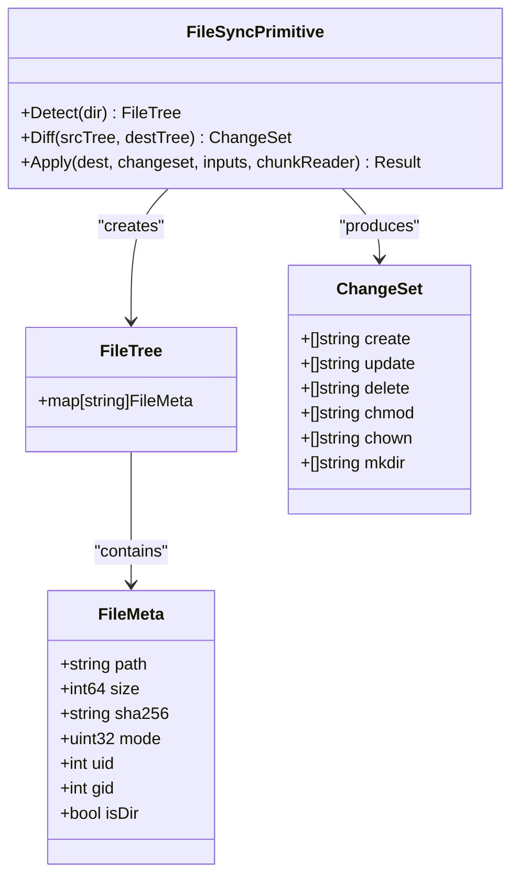
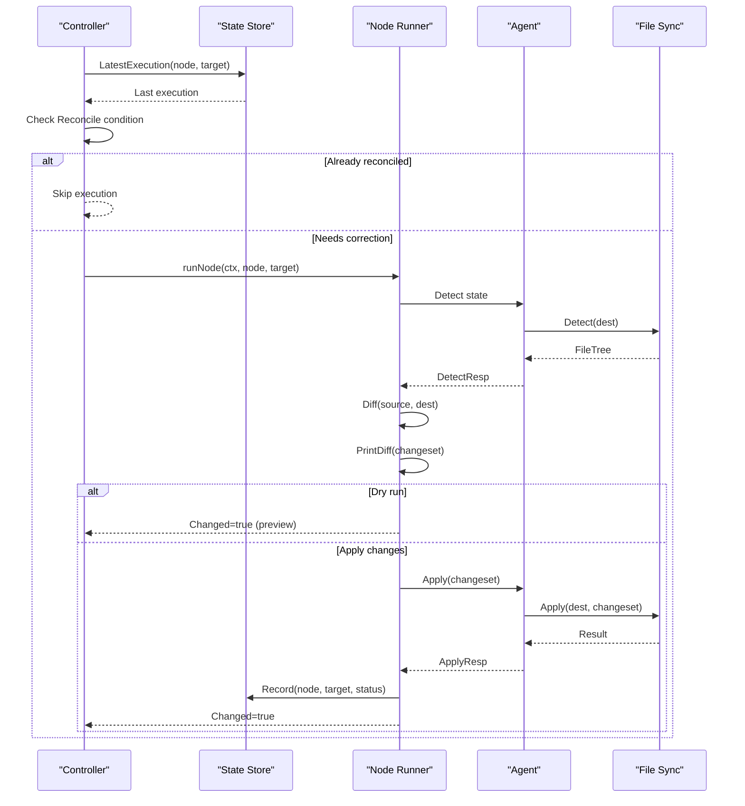

# Reconcile Command

<cite>
**Referenced Files in This Document**
- [main.go](file://cmd/devopsctl/main.go)
- [orchestrator.go](file://internal/controller/orchestrator.go)
- [store.go](file://internal/state/store.go)
- [schema.go](file://internal/plan/schema.go)
- [messages.go](file://internal/proto/messages.go)
- [diff.go](file://internal/primitive/filesync/diff.go)
- [detect.go](file://internal/primitive/filesync/detect.go)
- [apply.go](file://internal/primitive/filesync/apply.go)
- [plan.devops](file://plan.devops)
- [plan.json](file://plan.json)
</cite>

## Update Summary
**Changes Made**
- Enhanced reconciliation semantics documentation to reflect state-based drift correction
- Added detailed explanation of recorded execution data as authoritative source
- Expanded state store integration section with reconciliation-specific functionality
- Updated drift detection mechanism to emphasize reconciliation workflow
- Improved practical examples demonstrating reconciliation scenarios

## Table of Contents
1. [Introduction](#introduction)
2. [Project Structure](#project-structure)
3. [Core Components](#core-components)
4. [Architecture Overview](#architecture-overview)
5. [Detailed Component Analysis](#detailed-component-analysis)
6. [Dependency Analysis](#dependency-analysis)
7. [Performance Considerations](#performance-considerations)
8. [Troubleshooting Guide](#troubleshooting-guide)
9. [Conclusion](#conclusion)
10. [Appendices](#appendices)

## Introduction
The devopsctl reconcile command brings reality in sync with execution plans by using recorded state as the authoritative source. Unlike traditional apply mode that strictly follows the plan as written, reconcile mode intelligently detects drift between the desired state described by the plan and the actual state observed on targets, then applies corrective actions to align the two.

The reconciliation process operates on the principle that recorded execution data serves as the definitive source of truth for determining whether infrastructure is already in sync with the intended configuration. This approach enables automatic correction of drift while avoiding unnecessary changes when the system is already aligned, making it ideal for operational scenarios where infrastructure may have deviated from the intended configuration.

## Project Structure
The reconcile command is implemented as part of the main CLI entry point and integrates with the controller orchestration layer, state store, and file synchronization primitives.



**Diagram sources**
- [main.go](file://cmd/devopsctl/main.go#L107-L172)
- [orchestrator.go](file://internal/controller/orchestrator.go#L34-L300)
- [store.go](file://internal/state/store.go#L38-L61)
- [schema.go](file://internal/plan/schema.go#L41-L76)
- [messages.go](file://internal/proto/messages.go#L14-L75)

**Section sources**
- [main.go](file://cmd/devopsctl/main.go#L107-L172)
- [orchestrator.go](file://internal/controller/orchestrator.go#L34-L300)
- [store.go](file://internal/state/store.go#L38-L61)
- [schema.go](file://internal/plan/schema.go#L41-L76)

## Core Components
The reconcile command consists of several key components that work together to achieve intelligent drift correction:

- **CLI Command Definition**: Parses arguments and flags for the reconcile command, including dedicated reconciliation flags
- **Controller Orchestrator**: Manages execution flow and state coordination with reconciliation-aware logic
- **State Store**: Maintains persistent execution records and drift detection capabilities
- **File Synchronization**: Handles file-level drift detection and correction with state-aware operations
- **Protocol Layer**: Defines message formats for controller-agent communication with reconciliation support

Key implementation patterns:
- **State-based reconciliation**: Uses stored execution records to determine if nodes are already reconciled with the plan
- **Intelligent drift detection**: Compares desired state with observed state to identify differences and prioritize corrections
- **Atomic change application**: Applies corrections in a controlled sequence to minimize risk and maintain consistency
- **Parallel execution control**: Manages concurrency while maintaining safety guarantees for reconciliation operations

**Section sources**
- [main.go](file://cmd/devopsctl/main.go#L107-L172)
- [orchestrator.go](file://internal/controller/orchestrator.go#L26-L32)
- [store.go](file://internal/state/store.go#L68-L84)
- [diff.go](file://internal/primitive/filesync/diff.go#L16-L67)

## Architecture Overview
The reconcile command follows a sophisticated detect-diff-apply cycle that uses the state store as the authoritative source of truth for determining reconciliation status.



**Diagram sources**
- [main.go](file://cmd/devopsctl/main.go#L111-L167)
- [orchestrator.go](file://internal/controller/orchestrator.go#L180-L225)
- [store.go](file://internal/state/store.go#L100-L129)
- [detect.go](file://internal/primitive/filesync/detect.go#L19-L69)
- [diff.go](file://internal/primitive/filesync/diff.go#L7-L67)
- [apply.go](file://internal/primitive/filesync/apply.go#L19-L204)

## Detailed Component Analysis

### Command Syntax and Flags
The reconcile command follows this syntax:
```
devopsctl reconcile <plan>
```

Where:
- `<plan>`: Path to a plan file (.json or .devops)
- `--dry-run`: Preview changes without applying them
- `--parallelism`: Control maximum concurrent node executions (default: 10)
- `--lang`: Specify language version for .devops plans (v0.1 or v0.2, default: v0.2)

The command supports both JSON plan files and .devops source files, with automatic compilation when needed. The reconciliation process is specifically designed to work with the state store to determine whether nodes are already in sync with the plan.

**Section sources**
- [main.go](file://cmd/devopsctl/main.go#L107-L172)

### State Store Coordination
The state store serves as the authoritative source for determining reconciliation status through a sophisticated decision-making process:



**Diagram sources**
- [orchestrator.go](file://internal/controller/orchestrator.go#L180-L223)
- [store.go](file://internal/state/store.go#L100-L129)

**Section sources**
- [orchestrator.go](file://internal/controller/orchestrator.go#L180-L223)
- [store.go](file://internal/state/store.go#L100-L129)

### Drift Detection Mechanism
The reconciliation process uses a three-stage drift detection pipeline that leverages recorded state as the authoritative source:

1. **Remote State Detection**: Agents scan target filesystems to capture current state
2. **Local State Comparison**: Compare detected state with desired state from the plan
3. **Change Set Generation**: Identify specific differences requiring correction



**Diagram sources**
- [detect.go](file://internal/primitive/filesync/detect.go#L19-L69)
- [diff.go](file://internal/primitive/filesync/diff.go#L7-L67)
- [messages.go](file://internal/proto/messages.go#L79-L101)

**Section sources**
- [detect.go](file://internal/primitive/filesync/detect.go#L19-L69)
- [diff.go](file://internal/primitive/filesync/diff.go#L7-L67)
- [messages.go](file://internal/proto/messages.go#L79-L101)

### Execution Control and Safety
The controller implements several safety mechanisms for reconciliation, with state-based decision making:

- **Reconciliation Detection**: Uses node hash comparison with stored execution records to determine if a node is already reconciled
- **Parallelism Control**: Limits concurrent node execution to prevent resource exhaustion during reconciliation
- **Failure Handling**: Supports rollback on failure for file.sync primitives with state awareness
- **State Persistence**: Records execution results for audit and future reconciliation operations



**Diagram sources**
- [orchestrator.go](file://internal/controller/orchestrator.go#L303-L311)
- [orchestrator.go](file://internal/controller/orchestrator.go#L313-L442)
- [store.go](file://internal/state/store.go#L68-L84)

**Section sources**
- [orchestrator.go](file://internal/controller/orchestrator.go#L303-L311)
- [orchestrator.go](file://internal/controller/orchestrator.go#L313-L442)
- [store.go](file://internal/state/store.go#L68-L84)

## Dependency Analysis
The reconcile command has the following key dependencies:

```mermaid
graph TB
subgraph "CLI Layer"
MAIN["main.go"]
END
subgraph "Controller Layer"
ORCH["orchestrator.go"]
RUNOPTS["RunOptions"]
END
subgraph "State Layer"
STORE["store.go"]
EXECUTION["Execution struct"]
END
subgraph "Plan Layer"
PLAN["schema.go"]
NODE["Node struct"]
TARGET["Target struct"]
END
subgraph "Primitive Layer"
DETECT["detect.go"]
DIFF["diff.go"]
APPLY["apply.go"]
END
subgraph "Protocol Layer"
MSG["messages.go"]
END
MAIN --> ORCH
MAIN --> PLAN
MAIN --> STORE
ORCH --> STORE
ORCH --> DETECT
ORCH --> DIFF
ORCH --> APPLY
ORCH --> MSG
DETECT --> MSG
DIFF --> MSG
APPLY --> MSG
STORE --> EXECUTION
PLAN --> NODE
PLAN --> TARGET
```

**Diagram sources**
- [main.go](file://cmd/devopsctl/main.go#L1-L312)
- [orchestrator.go](file://internal/controller/orchestrator.go#L1-L653)
- [store.go](file://internal/state/store.go#L1-L226)
- [schema.go](file://internal/plan/schema.go#L1-L77)
- [messages.go](file://internal/proto/messages.go#L1-L117)

**Section sources**
- [main.go](file://cmd/devopsctl/main.go#L1-L312)
- [orchestrator.go](file://internal/controller/orchestrator.go#L1-L653)
- [store.go](file://internal/state/store.go#L1-L226)
- [schema.go](file://internal/plan/schema.go#L1-L77)

## Performance Considerations
The reconcile command implements several performance optimizations for drift correction scenarios:

- **Parallel Execution**: Default parallelism of 10 allows efficient processing of multiple nodes concurrently during reconciliation
- **Streaming Transfers**: File content is streamed in chunks to minimize memory usage during state correction
- **Intelligent State Checking**: Uses stored execution records to avoid unnecessary work when systems are already reconciled
- **Incremental Detection**: Only changed files are transferred, reducing network overhead during drift correction
- **State Caching**: Recent execution records are cached to avoid repeated database queries

Optimization opportunities:
- Increase parallelism for large-scale deployments with significant drift
- Monitor agent resource usage during high-concurrency reconciliation operations
- Consider compression for large file transfers during correction
- Implement intelligent batching for small files during reconciliation

## Troubleshooting Guide

Common reconciliation scenarios:

**Infrastructure Rebuilds**
- Use reconcile mode to restore systems to known-good state using recorded execution data as authority
- Combine with rollback capability for emergency recovery when reconciliation fails
- Monitor change counts to verify completeness of drift correction

**Configuration Drift Correction**
- Reconcile mode automatically detects and corrects configuration drift by comparing with recorded state
- Use dry-run mode to preview changes before applying during drift correction
- Monitor state store for failed reconciliation attempts and retry as needed

**Emergency Recovery**
- Leverage state store to identify last successful execution and determine recovery path
- Use rollback functionality for immediate recovery when reconciliation encounters issues
- Implement monitoring to detect future drift and trigger preventive reconciliation

**Section sources**
- [orchestrator.go](file://internal/controller/orchestrator.go#L618-L652)
- [store.go](file://internal/state/store.go#L100-L129)

## Conclusion
The devopsctl reconcile command provides a sophisticated framework for bringing infrastructure into alignment with execution plans through state-based drift correction. By using the state store as the authoritative source and implementing a comprehensive reconciliation pipeline, it enables safe and reliable operational workflows that automatically detect and correct configuration drift.

Key benefits:
- **Intelligent drift detection**: Uses recorded execution data as the definitive source of truth
- **Automatic correction**: Applies necessary changes while avoiding redundant operations
- **State persistence**: Maintains audit trail for reconciliation history and recovery
- **Parallel execution**: Scalable processing for large-scale drift correction scenarios
- **Comprehensive error handling**: Robust failure handling with rollback support
- **Flexible configuration**: Adaptable settings for various deployment and recovery scenarios

The command is particularly valuable for production environments where infrastructure stability and reliability are paramount, and where configuration drift is a common operational challenge.

## Appendices

### Practical Usage Examples

**Basic Reconciliation**
```bash
# Reconcile infrastructure using a compiled plan with state-based authority
devopsctl reconcile plan.json

# Preview changes without applying during drift correction
devopsctl reconcile --dry-run plan.json

# Limit concurrent operations during large-scale reconciliation
devopsctl reconcile --parallelism 5 plan.json

# Specify language version for .devops source compilation
devopsctl reconcile --lang v0.2 plan.devops
```

**Drift Correction Scenarios**
```bash
# Correct configuration drift using recorded state as authority
devopsctl reconcile plan.json

# Emergency recovery from failed state using last successful execution
devopsctl rollback --last
devopsctl reconcile plan.json

# Preview drift correction before applying changes
devopsctl reconcile --dry-run plan.json
```

**Integration with Planning**
```bash
# Compile .devops source to JSON with state-aware planning
devopsctl plan build plan.devops -o plan.json

# Reconcile with compiled plan using recorded state as authority
devopsctl reconcile plan.json

# Use specific language version for .devops compilation
devopsctl reconcile --lang v0.1 plan.devops
```

**Section sources**
- [main.go](file://cmd/devopsctl/main.go#L107-L172)
- [plan.devops](file://plan.devops#L1-L20)
- [plan.json](file://plan.json#L1-L25)