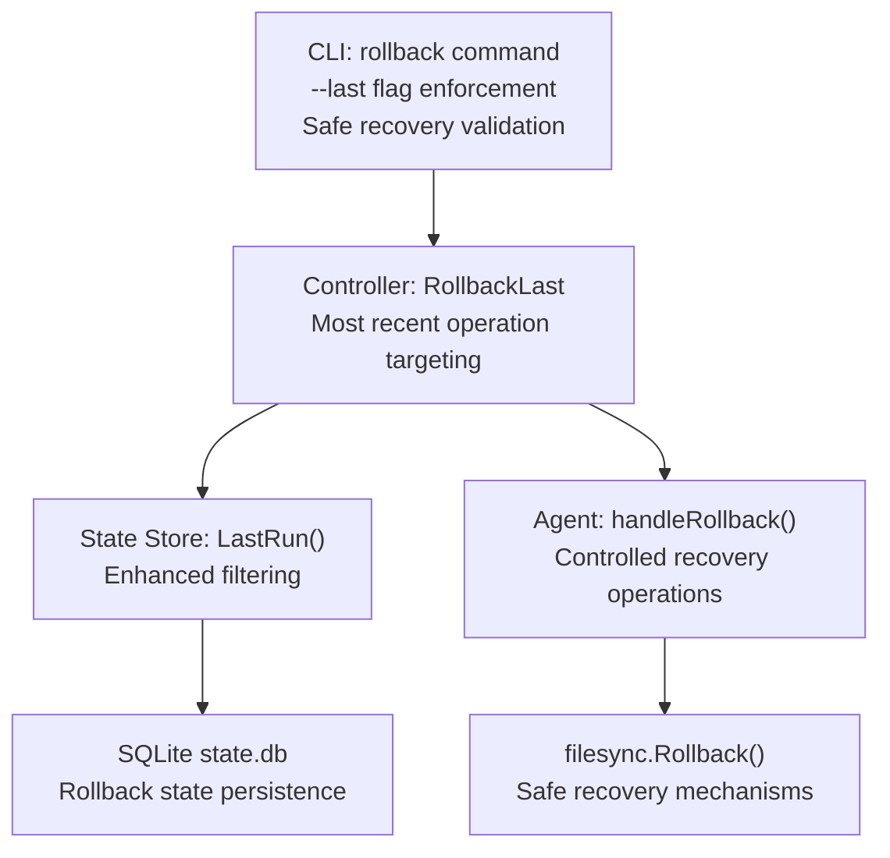
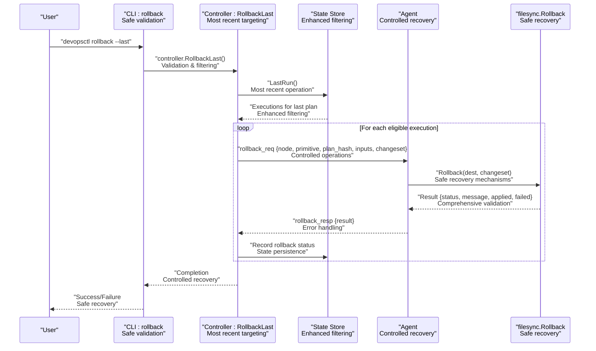
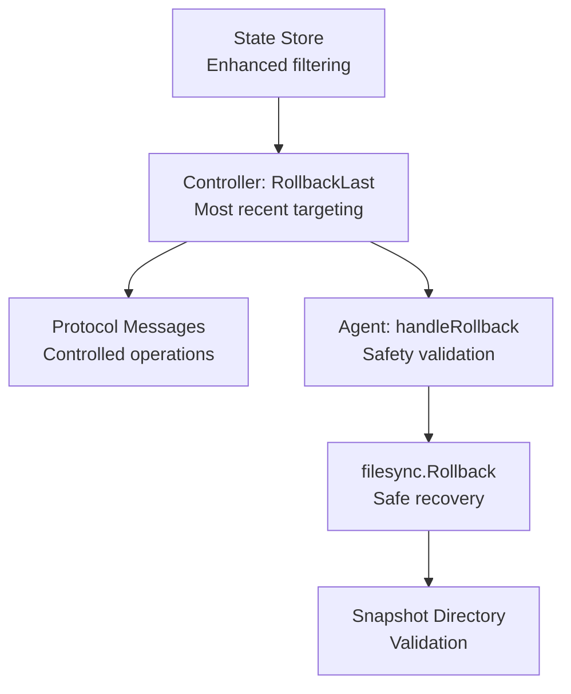

# Rollback Command

<cite>
**Referenced Files in This Document**
- [main.go](file://cmd/devopsctl/main.go)
- [store.go](file://internal/state/store.go)
- [orchestrator.go](file://internal/controller/orchestrator.go)
- [handler.go](file://internal/agent/handler.go)
- [messages.go](file://internal/proto/messages.go)
- [apply.go](file://internal/primitive/filesync/apply.go)
- [rollback.go](file://internal/primitive/filesync/rollback.go)
</cite>

## Update Summary
**Changes Made**
- Enhanced documentation to reflect safe recovery mechanisms built into the rollback command
- Added coverage of most recent operation targeting capabilities
- Documented controlled recovery operations for failed executions
- Updated troubleshooting guidance with enhanced error handling scenarios
- Expanded safety checks and dependency-aware reversal documentation

## Table of Contents
1. [Introduction](#introduction)
2. [Project Structure](#project-structure)
3. [Core Components](#core-components)
4. [Architecture Overview](#architecture-overview)
5. [Detailed Component Analysis](#detailed-component-analysis)
6. [Dependency Analysis](#dependency-analysis)
7. [Performance Considerations](#performance-considerations)
8. [Troubleshooting Guide](#troubleshooting-guide)
9. [Conclusion](#conclusion)

## Introduction
This document explains the devopsctl rollback command and how it reverses previous executions using recorded state information. The rollback command provides enhanced safe recovery mechanisms, most recent operation targeting, and controlled recovery operations for failed executions. It covers command syntax, the required --last flag, the rollback execution process, coordination with the state store, and practical scenarios such as failed deployments, configuration errors, and emergency recovery. It also addresses safety checks, dependency-aware reversal, post-rollback verification, partial rollbacks, selective operation reversal, and rollback conflict resolution.

## Project Structure
The rollback capability spans several packages with enhanced safety mechanisms:
- CLI entrypoint registers the rollback command and enforces the --last flag with comprehensive validation
- State store persists execution records and exposes queries for last runs with enhanced filtering
- Controller orchestrates rollback by fetching the last run and dispatching rollback requests to agents with controlled operations
- Agent handles rollback requests with safety validation and executes file synchronization rollback
- Primitive filesync implements snapshot-based rollback for file.sync primitives with enhanced recovery mechanisms

**Diagram sources**
- [main.go](file://cmd/devopsctl/main.go#L286-L305)
- [orchestrator.go](file://internal/controller/orchestrator.go#L618-L652)
- [store.go](file://internal/state/store.go#L190-L225)
- [handler.go](file://internal/agent/handler.go#L147-L189)
- [rollback.go](file://internal/primitive/filesync/rollback.go#L1-L83)

**Section sources**
- [main.go](file://cmd/devopsctl/main.go#L286-L305)
- [store.go](file://internal/state/store.go#L190-L225)

## Core Components
- **Rollback command registration and enhanced validation**: The rollback command is registered under the root command with comprehensive flag enforcement. The --last flag is mandatory with explicit validation that prevents accidental global rollback operations.
- **State store with enhanced filtering**: Provides LastRun() to fetch all executions associated with the most recent plan hash, enabling coordinated rollback across nodes with improved filtering for applied/partial statuses.
- **Controller orchestration with most recent operation targeting**: RollbackLast() iterates over last-run executions, filters for applied/partial statuses, constructs a minimal node representation, resolves target addresses, and dispatches rollback requests to agents with controlled operations.
- **Agent handling with safety validation**: handleRollback() validates primitive type, rejects process.exec (not rollback-safe), and delegates to filesync.Rollback() for file.sync primitives with enhanced error handling.
- **filesync rollback with safe recovery mechanisms**: Reads the snapshot directory marker, restores updated/deleted files from snapshots, removes newly created files, cleans up snapshot artifacts, and reports status with comprehensive recovery validation.

**Section sources**
- [main.go](file://cmd/devopsctl/main.go#L286-L305)
- [store.go](file://internal/state/store.go#L190-L225)
- [orchestrator.go](file://internal/controller/orchestrator.go#L618-L652)
- [handler.go](file://internal/agent/handler.go#L147-L189)
- [rollback.go](file://internal/primitive/filesync/rollback.go#L1-L83)

## Architecture Overview
The rollback architecture follows a client-server model with enhanced safety mechanisms:
- The CLI invokes rollback with --last and comprehensive validation
- The controller queries the state store for the last run with enhanced filtering
- For each applicable node, the controller connects to the agent and sends a rollback request containing node metadata and the recorded changeset with controlled operations
- The agent validates the primitive type with safety checks and executes filesync rollback, restoring the destination to the state captured by the last snapshot

**Diagram sources**
- [main.go](file://cmd/devopsctl/main.go#L286-L305)
- [orchestrator.go](file://internal/controller/orchestrator.go#L618-L652)
- [store.go](file://internal/state/store.go#L190-L225)
- [handler.go](file://internal/agent/handler.go#L147-L189)
- [rollback.go](file://internal/primitive/filesync/rollback.go#L1-L83)

## Detailed Component Analysis

### Rollback Command Registration and Enhanced Validation
- The rollback command is registered under the root command with a comprehensive description emphasizing safe recovery operations
- The --last flag is mandatory with explicit validation that prevents accidental global rollback operations
- On success, the controller's RollbackLast function is invoked with an open state store and enhanced error handling

Key behaviors:
- **Flag enforcement**: Prevents accidental global rollback with explicit validation
- **Controller integration**: Receives a state store handle to query last-run executions with enhanced filtering
- **Safe recovery validation**: Comprehensive validation ensures only most recent operations are targeted

**Section sources**
- [main.go](file://cmd/devopsctl/main.go#L286-L305)

### State Store Integration with Enhanced Filtering
- LastRun() returns all executions associated with the most recent plan hash, ordered by insertion with enhanced filtering capabilities
- RollbackLast() filters these executions to include only those with status "applied" or "partial" with comprehensive validation
- For each filtered execution, RollbackLast() records a new state entry with status "rolled_back" and enhanced state persistence

Important considerations:
- **Most recent operation targeting**: Rollback operates on the last run identified by plan hash, ensuring coordinated reversal across nodes
- **Enhanced filtering**: Only successful or partially successful executions are considered for rollback with comprehensive validation
- **State persistence**: Rollback state is recorded for audit and recovery tracking

**Section sources**
- [store.go](file://internal/state/store.go#L190-L225)
- [orchestrator.go](file://internal/controller/orchestrator.go#L618-L652)

### Controller Orchestration: RollbackLast with Most Recent Operation Targeting
RollbackLast performs the following enhanced steps:
1. Fetch last-run executions via state.LastRun() with comprehensive validation
2. Iterate over executions and skip those not in "applied" or "partial" status with enhanced filtering
3. Construct a minimal node representation for file.sync primitives and preserve inputs with validation
4. Resolve target address from inputs or fallback to target identifier with enhanced error handling
5. Establish TCP connection to the agent and send a rollback request with node metadata, plan hash, inputs, and changeset with controlled operations
6. On success, record a new execution entry with status "rolled_back" and changeset "rollback_cs" with comprehensive state persistence

Safety and error handling:
- **Non-fatal warnings**: Printed for individual node failures while continuing the overall rollback with enhanced error handling
- **Controlled operations**: RollbackLast() returns nil after attempting all eligible nodes with comprehensive validation
- **Most recent operation targeting**: Ensures only the most recent execution is targeted for recovery

**Section sources**
- [orchestrator.go](file://internal/controller/orchestrator.go#L618-L652)

### Agent Handling: handleRollback with Safety Validation
The agent endpoint for rollback with enhanced safety mechanisms:
- Unmarshals the request payload and validates primitive type with comprehensive error handling
- Rejects process.exec primitives with a non-rollback-safe result and detailed error messaging
- Extracts destination from inputs and delegates to filesync.Rollback() for file.sync primitives with enhanced validation
- Encodes and returns a rollback response with the result and comprehensive error handling

Behavioral notes:
- **Safety validation**: Rollback is supported only for file.sync; other primitives are rejected with detailed error messages
- **Enhanced error handling**: The agent does not modify plan state; it returns the result of the rollback operation with comprehensive validation
- **Controlled recovery**: Safety mechanisms prevent unsafe rollback operations

**Section sources**
- [handler.go](file://internal/agent/handler.go#L147-L189)

### filesync Rollback Implementation with Safe Recovery Mechanisms
filesync.Rollback() implements a snapshot-based reversal with comprehensive safety mechanisms:
- Reads the snapshot directory marker from the destination with validation
- If no snapshot exists, returns a success result indicating no rollback was performed with detailed messaging
- Restores updated and deleted files by copying from the snapshot directory back to the destination with comprehensive validation
- Removes newly created files (those in changeset.Create) that have no prior snapshot with enhanced error handling
- Cleans up snapshot directory and marker file with comprehensive cleanup validation
- Aggregates applied and failed paths and sets status to success, partial, or failed accordingly with detailed reporting

Operational details:
- **Snapshot restoration**: Prioritizes files that existed before the last apply with comprehensive validation
- **Newly created files**: Removed to revert to the pre-apply state with enhanced safety checks
- **Partial failures**: Reported with counts and messages with comprehensive error handling
- **Safe recovery mechanisms**: Comprehensive validation ensures safe recovery operations

**Section sources**
- [rollback.go](file://internal/primitive/filesync/rollback.go#L1-L83)
- [apply.go](file://internal/primitive/filesync/apply.go#L186-L189)

### Protocol Messages with Controlled Recovery Operations
The rollback protocol uses line-delimited JSON messages with enhanced control mechanisms:
- RollbackReq: carries node_id, primitive type, plan_hash, and optional inputs with comprehensive validation
- RollbackResp: carries node_id and result with status, message, and applied/failed lists with detailed error handling

These messages enable the controller to send rollback requests and receive structured results from agents with comprehensive validation and error handling.

**Section sources**
- [messages.go](file://internal/proto/messages.go#L35-L75)

## Dependency Analysis
The rollback mechanism depends on enhanced safety mechanisms and comprehensive validation:
- State store for retrieving last-run executions and recording rollback outcomes with enhanced filtering
- Controller orchestration to coordinate rollback across nodes with most recent operation targeting
- Agent handlers to validate primitives and execute rollback with safety mechanisms
- filesync primitive to perform snapshot-based reversal with safe recovery mechanisms

**Diagram sources**
- [store.go](file://internal/state/store.go#L190-L225)
- [orchestrator.go](file://internal/controller/orchestrator.go#L618-L652)
- [handler.go](file://internal/agent/handler.go#L147-L189)
- [rollback.go](file://internal/primitive/filesync/rollback.go#L1-L83)

**Section sources**
- [store.go](file://internal/state/store.go#L190-L225)
- [orchestrator.go](file://internal/controller/orchestrator.go#L618-L652)
- [handler.go](file://internal/agent/handler.go#L147-L189)
- [rollback.go](file://internal/primitive/filesync/rollback.go#L1-L83)

## Performance Considerations
- Rollback is executed per-node and does not enforce parallelism; it focuses on correctness and safety with controlled operations
- Snapshot restoration involves file copies and deletions; performance depends on file sizes and counts with comprehensive validation
- Network latency affects rollback throughput when multiple agents are involved with enhanced error handling
- Partial rollbacks are supported; failures are aggregated and reported without blocking the entire operation with comprehensive validation
- **Enhanced safety mechanisms**: Additional validation and error handling may impact performance but ensure safe recovery operations

## Troubleshooting Guide
Common issues and resolutions with enhanced safety mechanisms:
- **Missing snapshot**: If no snapshot directory marker exists, rollback completes successfully with a message indicating no rollback was performed. Ensure previous apply operations were successful and created snapshots with comprehensive validation
- **Partial rollback**: If some files fail to restore or remove, the result status becomes partial with counts and messages. Investigate file permissions, disk space, and destination accessibility with enhanced error handling
- **Non-rollback-safe primitives**: process.exec primitives are rejected with a non-rollback-safe result and detailed error messaging. Use file.sync for rollback-capable operations with comprehensive validation
- **No previous run found**: If no executions are recorded for the last plan, the command returns an error with enhanced validation. Verify that a prior apply was executed and recorded with comprehensive error handling
- **Target address resolution**: If __target_addr is not provided, the controller falls back to the target identifier with enhanced error handling. Ensure inputs include the correct target address for accurate routing
- **Most recent operation targeting**: Ensure only the most recent operation is being targeted for rollback with comprehensive validation
- **Controlled recovery operations**: Monitor rollback operations for safety and ensure they are performed on the correct target with enhanced validation

Verification steps:
- Confirm state entries for the last run and subsequent rollback records with comprehensive validation
- Inspect agent logs for rollback request/response details with enhanced error handling
- Manually verify file system state against the snapshot directory if needed with comprehensive validation
- **Safety verification**: Ensure rollback operations are performed safely and comprehensively validate results

**Section sources**
- [rollback.go](file://internal/primitive/filesync/rollback.go#L22-L29)
- [handler.go](file://internal/agent/handler.go#L156-L163)
- [orchestrator.go](file://internal/controller/orchestrator.go#L624-L626)

## Conclusion
The devopsctl rollback command provides a safe, coordinated mechanism to reverse the last execution using recorded state and snapshot-based file synchronization with enhanced safety mechanisms. By enforcing the --last flag, leveraging the state store to identify the last run with comprehensive filtering, and delegating rollback to agents for file.sync primitives with safety validation, it enables reliable recovery from failed deployments, configuration errors, and emergency situations. The enhanced safe recovery mechanisms, most recent operation targeting, and controlled recovery operations ensure predictable outcomes with comprehensive validation and error handling. Users should ensure snapshot availability, monitor partial failures, restrict rollback to rollback-safe primitives, and utilize the enhanced safety mechanisms for predictable and secure recovery operations.