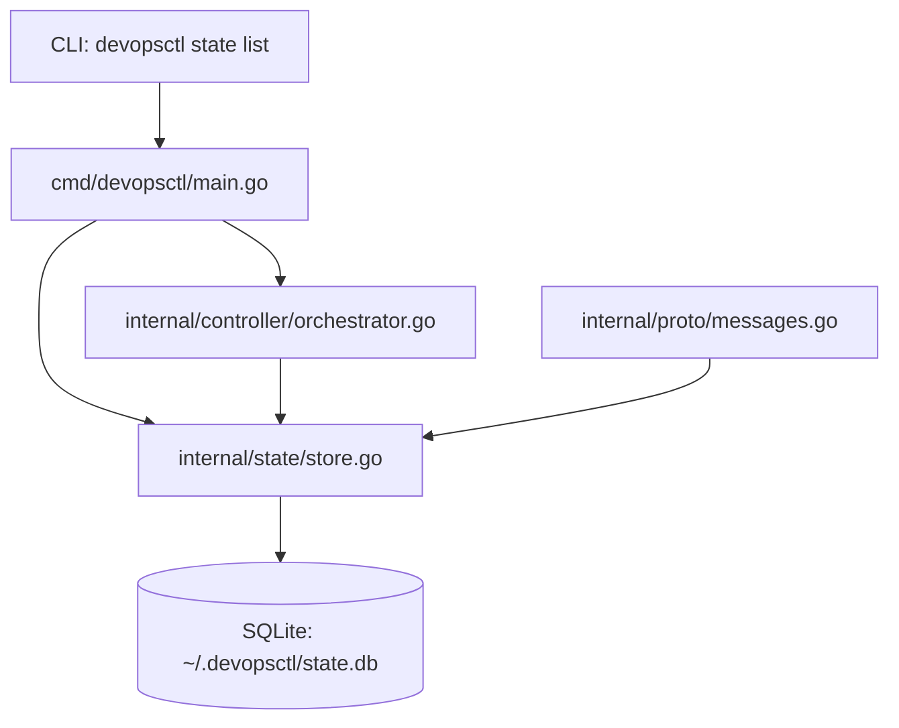
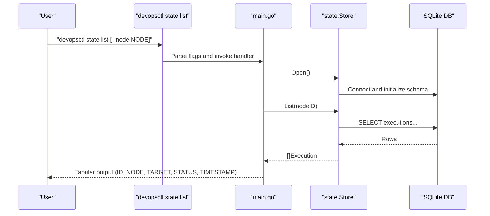
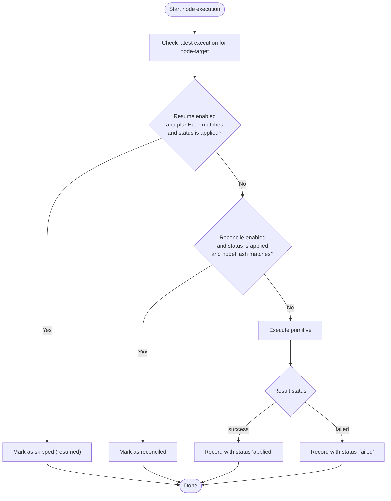
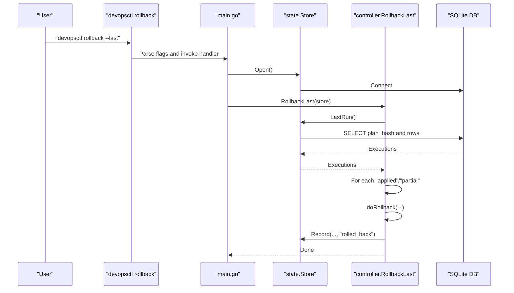
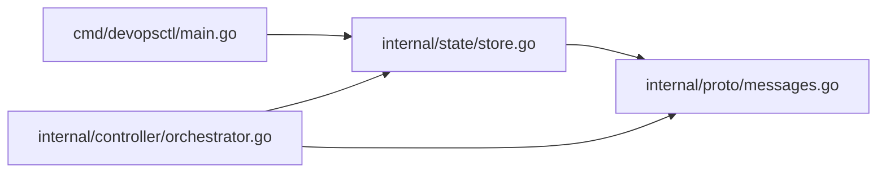

# State Command

<cite>
**Referenced Files in This Document**
- [main.go](file://cmd/devopsctl/main.go)
- [store.go](file://internal/state/store.go)
- [messages.go](file://internal/proto/messages.go)
- [orchestrator.go](file://internal/controller/orchestrator.go)
</cite>

## Update Summary
**Changes Made**
- Enhanced state command documentation with introspection capabilities for local state store
- Added detailed coverage of state list subcommand for execution history display
- Documented formatted table output with tabwriter integration
- Updated state database schema documentation with new columns
- Expanded troubleshooting guide with state store maintenance procedures

## Table of Contents
1. [Introduction](#introduction)
2. [Project Structure](#project-structure)
3. [Core Components](#core-components)
4. [Architecture Overview](#architecture-overview)
5. [Detailed Component Analysis](#detailed-component-analysis)
6. [Dependency Analysis](#dependency-analysis)
7. [Performance Considerations](#performance-considerations)
8. [Troubleshooting Guide](#troubleshooting-guide)
9. [Conclusion](#conclusion)
10. [Appendices](#appendices)

## Introduction
This document explains the devopsctl state command family with a focus on inspecting execution history and managing the SQLite-based state store. It covers the state list subcommand, how to query executions by node ID, interpretation of execution statuses, and practical workflows for debugging, auditing, and compliance. It also documents the state database schema, execution record structure, and timestamp formatting, along with maintenance and troubleshooting guidance.

## Project Structure
The state command is part of the CLI entry point and delegates to the internal state package for database operations. The controller integrates state recording during plan execution.

**Diagram sources**
- [main.go](file://cmd/devopsctl/main.go#L187-L218)
- [store.go](file://internal/state/store.go#L38-L61)
- [orchestrator.go](file://internal/controller/orchestrator.go#L34-L36)
- [messages.go](file://internal/proto/messages.go#L94-L101)

**Section sources**
- [main.go](file://cmd/devopsctl/main.go#L187-L218)
- [store.go](file://internal/state/store.go#L38-L61)

## Core Components
- State command family:
  - state list: Lists executions from the state store, optionally filtered by node ID.
  - state: Parent command for state-related operations.
- State store:
  - SQLite-backed, WAL-enabled database located at ~/.devopsctl/state.db.
  - Append-only execution records with JSON-serialized change sets and inputs.
- Execution model:
  - Execution struct captures node, target, hashes, timestamp, status, and deserialized change set and inputs.

Key behaviors:
- Filtering by node ID is supported by the list subcommand flag and the store's List method.
- Timestamps are stored as Unix seconds and formatted as RFC 3339 when printed.
- Status values include pending, skipped, applied, failed, rolled_back, blocked.

**Section sources**
- [main.go](file://cmd/devopsctl/main.go#L187-L218)
- [store.go](file://internal/state/store.go#L86-L98)
- [store.go](file://internal/state/store.go#L162-L188)

## Architecture Overview
The state command integrates with the controller and state store to provide inspection and rollback capabilities.

**Diagram sources**
- [main.go](file://cmd/devopsctl/main.go#L187-L218)
- [store.go](file://internal/state/store.go#L38-L61)
- [store.go](file://internal/state/store.go#L162-L188)

## Detailed Component Analysis

### State List Subcommand
Purpose:
- Inspect execution history from the local state store.
- Filter by node ID to narrow results.

Behavior:
- Opens the state store, queries executions for the given node ID, and prints a tabular report with columns: ID, NODE, TARGET, STATUS, TIMESTAMP.
- Uses RFC 3339 formatting for timestamps when printing.

Flags:
- --node: Filters executions by node ID.

Implementation highlights:
- Handler opens the state store, calls List(nodeID), and writes tabular output using tabwriter with proper column alignment.

**Updated** Enhanced with formatted table output using tabwriter for better readability and structured presentation.

**Section sources**
- [main.go](file://cmd/devopsctl/main.go#L187-L218)
- [store.go](file://internal/state/store.go#L162-L188)

### State Store and Schema
Location:
- ~/.devopsctl/state.db

Schema:
- Table: executions
  - Columns: id, node_id, target, plan_hash, node_hash, content_hash, timestamp, status, changeset_json, inputs_json
  - Index: idx_executions_node_target(node_id, target)

Initialization:
- On open, ensures schema exists and adds new columns to existing databases if needed.

Timestamps:
- Stored as Unix seconds (INTEGER).
- Printed as RFC 3339 strings.

Status values:
- pending, skipped, applied, failed, rolled_back, blocked

Change sets and inputs:
- Stored as JSON blobs and deserialized into Execution struct fields.

**Updated** Enhanced with new columns (plan_hash, node_hash, inputs_json) for improved state tracking and resume/reconcile functionality.

**Section sources**
- [store.go](file://internal/state/store.go#L17-L31)
- [store.go](file://internal/state/store.go#L38-L61)
- [store.go](file://internal/state/store.go#L86-L98)

### Execution Record Structure
Fields:
- ID: Auto-increment primary key
- NodeID: Node identifier
- Target: Target identifier
- PlanHash: Hash of the plan JSON used for the run
- NodeHash: Hash of the node definition for reconciliation
- ContentHash: Hash of the content changes (or a placeholder for non-file primitives)
- Timestamp: Unix seconds
- Status: One of pending, skipped, applied, failed, rolled_back, blocked
- ChangeSet: Deserialized from changeset_json
- Inputs: Deserialized from inputs_json

Queries:
- List(nodeID): Returns all executions for a node, newest first.
- LastSuccessful(nodeID, target): Most recent applied execution for a node-target pair.
- LatestExecution(nodeID, target): Most recent execution regardless of status.
- LastRun(): All executions from the most recent plan run.

**Updated** Enhanced with new fields (plan_hash, node_hash, inputs_json) for improved state tracking and resume/reconcile functionality.

**Section sources**
- [store.go](file://internal/state/store.go#L86-L98)
- [store.go](file://internal/state/store.go#L100-L129)
- [store.go](file://internal/state/store.go#L131-L160)
- [store.go](file://internal/state/store.go#L162-L188)
- [store.go](file://internal/state/store.go#L190-L225)

### Controller Integration and Recording
During plan execution, the controller records state transitions:
- Records skipped nodes with status "skipped".
- Records process.exec nodes with a placeholder content hash and maps "success" to "applied".
- Uses planHash and nodeHash to support resume and reconcile decisions.

**Diagram sources**
- [orchestrator.go](file://internal/controller/orchestrator.go#L180-L223)
- [orchestrator.go](file://internal/controller/orchestrator.go#L492-L513)

**Section sources**
- [orchestrator.go](file://internal/controller/orchestrator.go#L180-L223)
- [orchestrator.go](file://internal/controller/orchestrator.go#L492-L513)

### Rollback Integration
The rollback command uses the state store to identify the last run and roll back successful nodes where possible.

**Diagram sources**
- [main.go](file://cmd/devopsctl/main.go#L286-L305)
- [store.go](file://internal/state/store.go#L190-L225)
- [orchestrator.go](file://internal/controller/orchestrator.go#L618-L652)

**Section sources**
- [main.go](file://cmd/devopsctl/main.go#L286-L305)
- [store.go](file://internal/state/store.go#L190-L225)
- [orchestrator.go](file://internal/controller/orchestrator.go#L618-L652)

## Dependency Analysis
- CLI depends on the state package for database operations.
- Controller depends on the state package to record execution outcomes.
- Proto types define the structure of change sets and results used in state recording.

**Diagram sources**
- [main.go](file://cmd/devopsctl/main.go#L187-L218)
- [store.go](file://internal/state/store.go#L38-L61)
- [orchestrator.go](file://internal/controller/orchestrator.go#L34-L36)
- [messages.go](file://internal/proto/messages.go#L94-L101)

**Section sources**
- [main.go](file://cmd/devopsctl/main.go#L187-L218)
- [store.go](file://internal/state/store.go#L38-L61)
- [orchestrator.go](file://internal/controller/orchestrator.go#L34-L36)
- [messages.go](file://internal/proto/messages.go#L94-L101)

## Performance Considerations
- SQLite WAL mode is enabled for improved concurrency and durability.
- An index on (node_id, target) optimizes lookups for node-target pairs.
- Queries are straightforward scans ordered by ID; performance scales with number of executions.

## Troubleshooting Guide
Common issues and resolutions:
- State store cannot be opened:
  - Verify permissions for ~/.devopsctl and ~/.devopsctl/state.db.
  - Ensure the directory exists and is writable.
- No executions found:
  - Confirm that a plan has been executed at least once.
  - Use state list without --node to see all executions.
- Filtering by node ID yields no results:
  - Verify the node ID spelling and case.
  - Check that the node actually executed against the target(s) in the plan.
- Timestamps appear incorrect:
  - The CLI prints timestamps in RFC 3339; the database stores Unix seconds.
  - Ensure your system timezone is correct when interpreting output.
- Status interpretation:
  - pending: Initial state before execution.
  - skipped: Resumed or dependency/condition prevented execution.
  - applied: Successful execution.
  - failed: Execution failure.
  - rolled_back: Manual rollback action.
  - blocked: Dependency failure cascading to this node.

Maintenance tips:
- Backup the state database:
  - Copy ~/.devopsctl/state.db to a safe location.
- Repair or migrate:
  - The state store initializes schema on open and adds new columns if missing.
  - If corruption occurs, restore from backup and re-run plans to rebuild state.

**Section sources**
- [store.go](file://internal/state/store.go#L38-L61)
- [store.go](file://internal/state/store.go#L162-L188)
- [orchestrator.go](file://internal/controller/orchestrator.go#L180-L223)

## Conclusion
The devopsctl state command family provides a focused interface for inspecting execution history and supporting operational tasks like debugging, auditing, and compliance. The SQLite-backed state store offers a durable, append-only record of execution outcomes, enabling reliable resume, reconcile, and rollback workflows. By leveraging node ID filtering and understanding status semantics, operators can efficiently track and analyze plan execution behavior.

## Appendices

### State Database Schema
- Table: executions
  - id: INTEGER PRIMARY KEY AUTOINCREMENT
  - node_id: TEXT NOT NULL
  - target: TEXT NOT NULL
  - plan_hash: TEXT NOT NULL DEFAULT ''
  - node_hash: TEXT NOT NULL DEFAULT ''
  - content_hash: TEXT NOT NULL
  - timestamp: INTEGER NOT NULL
  - status: TEXT NOT NULL
  - changeset_json: TEXT NOT NULL
  - inputs_json: TEXT NOT NULL DEFAULT '{}'
- Index: idx_executions_node_target(node_id, target)

**Updated** Enhanced with new columns (plan_hash, node_hash, inputs_json) for improved state tracking.

**Section sources**
- [store.go](file://internal/state/store.go#L17-L31)

### Execution Record Fields
- ID: Auto-increment primary key
- NodeID: Node identifier
- Target: Target identifier
- PlanHash: Plan hash used for the run
- NodeHash: Node hash used for reconciliation
- ContentHash: Content hash or placeholder
- Timestamp: Unix seconds
- Status: pending | skipped | applied | failed | rolled_back | blocked
- ChangeSet: JSON-serialized change set
- Inputs: JSON-serialized inputs

**Updated** Enhanced with new fields (plan_hash, node_hash, inputs_json) for improved state tracking.

**Section sources**
- [store.go](file://internal/state/store.go#L86-L98)

### Timestamp Formatting
- Storage: INTEGER Unix seconds
- Presentation: RFC 3339

**Section sources**
- [main.go](file://cmd/devopsctl/main.go#L207-L215)

### Status Values and Meanings
- pending: Not started
- skipped: Resumed or condition/dependency prevented
- applied: Successfully applied
- failed: Execution failure
- rolled_back: Manually rolled back
- blocked: Cascaded from dependency failure

**Section sources**
- [store.go](file://internal/state/store.go#L26-L26)

### Example Workflows
- Inspect all executions:
  - devopsctl state list
- Inspect executions for a specific node:
  - devopsctl state list --node NODE_ID
- Debug a failed execution:
  - Review status and timestamp for the node-target pair.
  - Use reconcile to bring reality in sync if applicable.
- Audit trail for compliance:
  - Export state list output and correlate with plan hashes and node hashes.
- Historical analysis:
  - Use LastRun to analyze the most recent plan execution across all nodes.