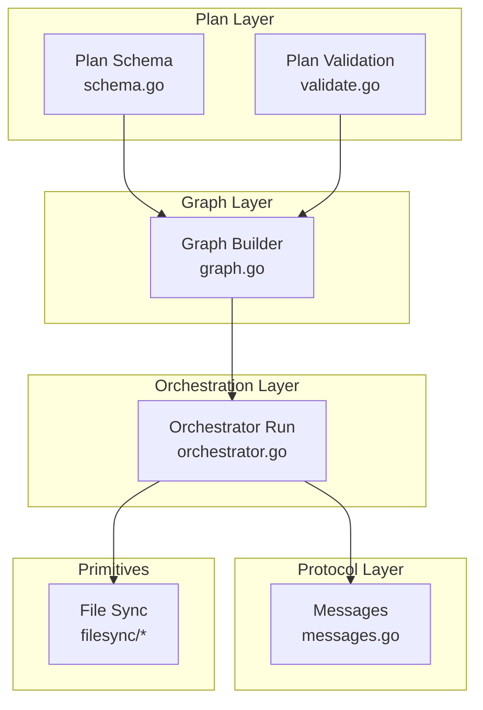
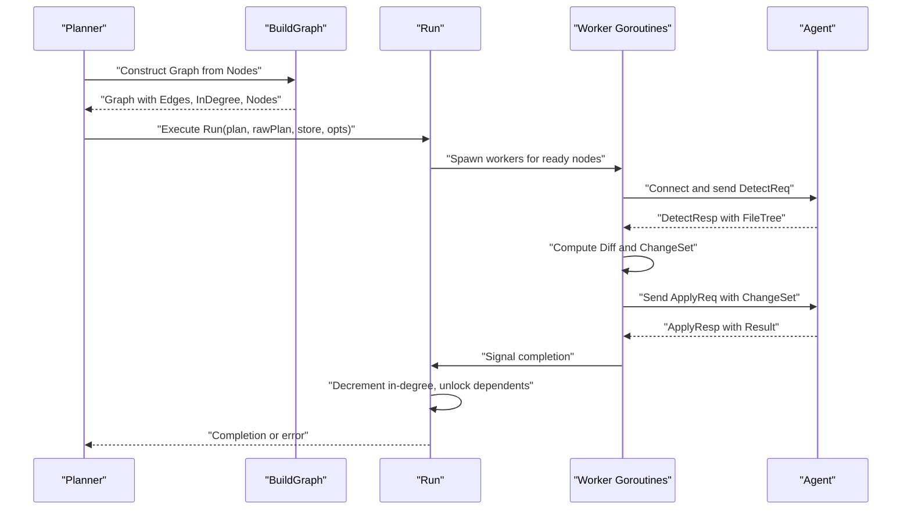
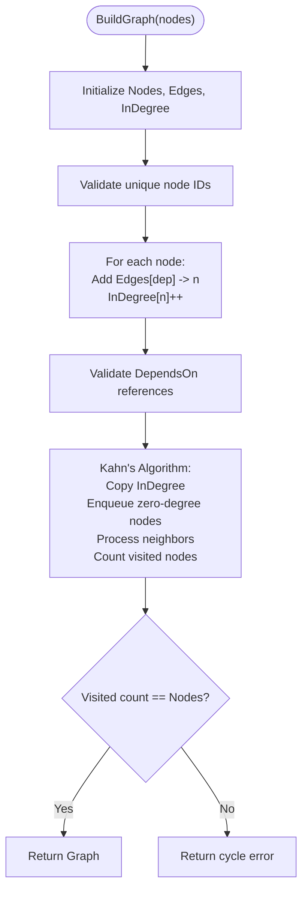
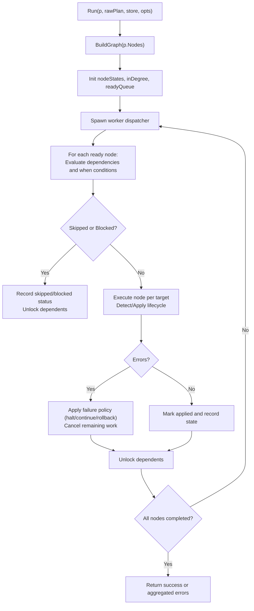
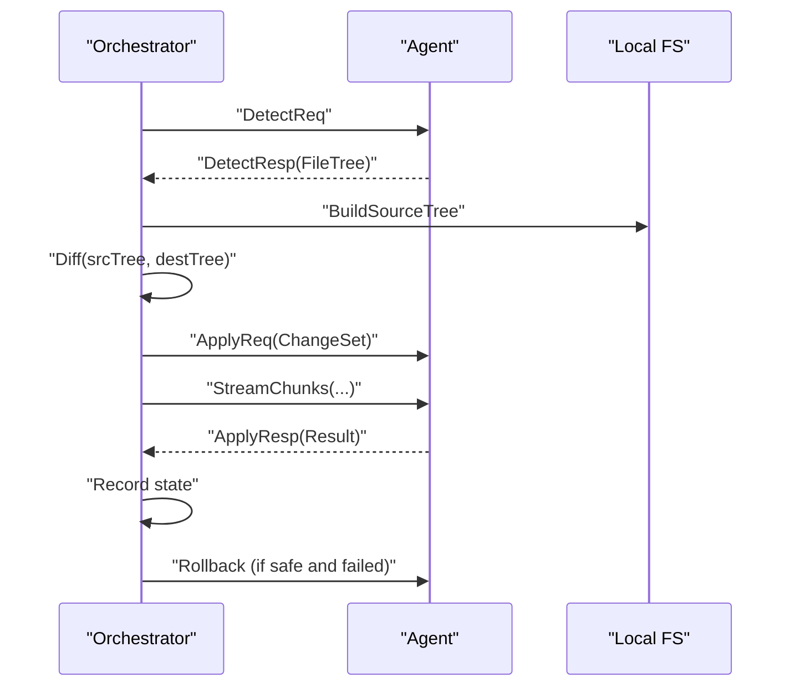
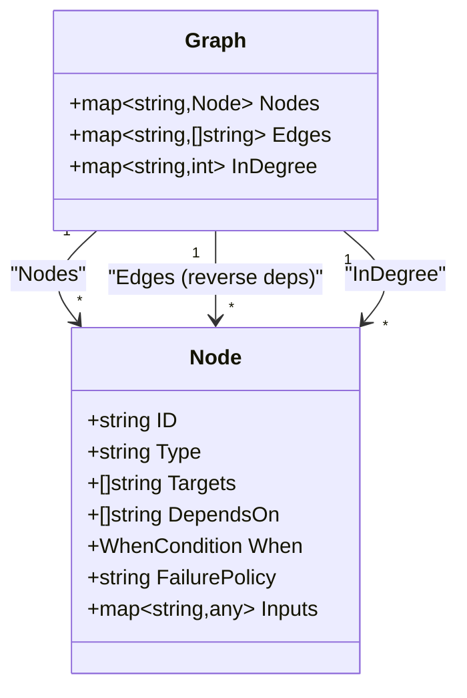

# Dependency Resolution and Graph Construction

<cite>
**Referenced Files in This Document**
- [graph.go](file://internal/controller/graph.go)
- [orchestrator.go](file://internal/controller/orchestrator.go)
- [schema.go](file://internal/plan/schema.go)
- [validate.go](file://internal/plan/validate.go)
- [messages.go](file://internal/proto/messages.go)
- [detect.go](file://internal/primitive/filesync/detect.go)
- [diff.go](file://internal/primitive/filesync/diff.go)
- [apply.go](file://internal/primitive/filesync/apply.go)
</cite>

## Table of Contents
1. [Introduction](#introduction)
2. [Project Structure](#project-structure)
3. [Core Components](#core-components)
4. [Architecture Overview](#architecture-overview)
5. [Detailed Component Analysis](#detailed-component-analysis)
6. [Dependency Analysis](#dependency-analysis)
7. [Performance Considerations](#performance-considerations)
8. [Troubleshooting Guide](#troubleshooting-guide)
9. [Conclusion](#conclusion)

## Introduction
This document explains the dependency resolution and graph construction system that powers the execution engine. It covers how the BuildGraph function constructs execution dependency graphs from plan nodes, including in-degree calculations and adjacency list representations. It documents the topological sorting algorithm implementation, dependency validation processes, and cycle detection mechanisms. It also details how the orchestrator uses the dependency graph to determine execution order, manage ready queues, and coordinate node execution. Examples of complex dependency scenarios and failure propagation are included, along with performance considerations and optimization strategies for large execution graphs.

## Project Structure
The dependency resolution system spans several packages:
- Plan model and validation define the structure of nodes and their dependencies.
- Graph construction builds the execution dependency graph and validates acyclicity.
- Orchestrator coordinates execution using the graph, maintaining ready queues and handling failures.
- Protocol messages define the wire format for controller-agent communication.
- Primitive file synchronization implements the file.sync node type and its lifecycle.

**Diagram sources**
- [graph.go](file://internal/controller/graph.go#L1-L84)
- [orchestrator.go](file://internal/controller/orchestrator.go#L1-L653)
- [schema.go](file://internal/plan/schema.go#L1-L77)
- [validate.go](file://internal/plan/validate.go#L1-L95)
- [messages.go](file://internal/proto/messages.go#L1-L117)
- [detect.go](file://internal/primitive/filesync/detect.go#L1-L105)
- [diff.go](file://internal/primitive/filesync/diff.go#L1-L87)
- [apply.go](file://internal/primitive/filesync/apply.go#L1-L252)

**Section sources**
- [graph.go](file://internal/controller/graph.go#L1-L84)
- [orchestrator.go](file://internal/controller/orchestrator.go#L1-L653)
- [schema.go](file://internal/plan/schema.go#L1-L77)
- [validate.go](file://internal/plan/validate.go#L1-L95)
- [messages.go](file://internal/proto/messages.go#L1-L117)

## Core Components
- Graph: Represents the execution dependency graph with nodes, adjacency lists, and in-degree counts.
- BuildGraph: Constructs the graph from plan nodes, populates adjacency lists, initializes in-degrees, and detects cycles.
- Orchestrator.Run: Builds the graph, initializes node states and in-degree, seeds the ready queue, and coordinates worker goroutines to execute nodes respecting dependencies and conditions.
- Plan schema and validation: Define node structure, dependencies, and inputs, and validate plan correctness before graph construction.

Key responsibilities:
- Graph construction enforces uniqueness of node IDs and resolves DependsOn references to known nodes.
- Topological sorting via Kahn’s algorithm ensures acyclicity and provides a valid execution order.
- Orchestrator maintains readiness by decrementing in-degrees and unlocking dependents when prerequisites complete.
- Failure policies and cascading skips ensure that failures propagate through the dependency graph.

**Section sources**
- [graph.go](file://internal/controller/graph.go#L9-L48)
- [orchestrator.go](file://internal/controller/orchestrator.go#L35-L300)
- [schema.go](file://internal/plan/schema.go#L24-L39)
- [validate.go](file://internal/plan/validate.go#L5-L94)

## Architecture Overview
The system transforms a plan with nodes and dependencies into an executable graph and then executes nodes in dependency-safe order.

**Diagram sources**
- [graph.go](file://internal/controller/graph.go#L16-L48)
- [orchestrator.go](file://internal/controller/orchestrator.go#L35-L300)
- [messages.go](file://internal/proto/messages.go#L14-L75)
- [detect.go](file://internal/primitive/filesync/detect.go#L19-L70)
- [diff.go](file://internal/primitive/filesync/diff.go#L7-L67)
- [apply.go](file://internal/primitive/filesync/apply.go#L19-L204)

## Detailed Component Analysis

### Graph Construction and Topological Sorting
The BuildGraph function constructs a directed acyclic graph from plan nodes:
- Initializes Nodes map, Edges adjacency list, and InDegree counters.
- Validates node IDs are unique and that all DependsOn references resolve to existing nodes.
- Populates Edges as reverse dependencies (from dependency to dependent) and increments in-degree for dependents.
- Performs cycle detection using Kahn’s algorithm: compute in-degree copies, enqueue zero-in-degree nodes, process neighbors, and verify all nodes were visited.

**Diagram sources**
- [graph.go](file://internal/controller/graph.go#L16-L83)

**Section sources**
- [graph.go](file://internal/controller/graph.go#L16-L83)

### Dependency Validation and Plan Constraints
Plan validation ensures structural correctness before graph construction:
- Version presence, non-empty Targets and Nodes.
- Target IDs and addresses are required.
- Node IDs, types, and targets are validated; unknown references produce errors.
- When conditions reference valid nodes.
- Failure policy values are constrained.
- Type-specific input validation:
  - file.sync requires src and dest.
  - process.exec requires non-empty cmd array and cwd.

These validations prevent malformed plans from reaching the graph builder and help catch configuration errors early.

**Section sources**
- [validate.go](file://internal/plan/validate.go#L5-L94)
- [schema.go](file://internal/plan/schema.go#L24-L39)

### Orchestrator Execution Engine
The orchestrator coordinates execution using the dependency graph:
- BuildGraph produces the graph and in-degree map.
- Initialize node states and in-degree copies; seed ready queue with zero in-degree nodes.
- Worker goroutines:
  - Check for blocked or skipped dependencies and evaluate When conditions.
  - Execute node per target, handling resumable and reconciled states.
  - Record outcomes and propagate changes.
- Completion loop:
  - On completion, decrement in-degree for dependents and unlock ready nodes.
  - Aggregate errors and enforce failure policies (halt, continue, rollback).
  - Trigger global rollback when configured.

**Diagram sources**
- [orchestrator.go](file://internal/controller/orchestrator.go#L35-L300)

**Section sources**
- [orchestrator.go](file://internal/controller/orchestrator.go#L35-L300)

### Node Execution Lifecycle (file.sync)
The orchestrator delegates node execution to primitives:
- file.sync:
  - Connect to agent, send DetectReq, receive DetectResp with FileTree.
  - Build local source tree and compute ChangeSet via Diff.
  - Print diff and, if not dry-run, stream file chunks and send ApplyReq.
  - Receive ApplyResp, persist state, and trigger agent-level rollback if safe and failed.
- process.exec:
  - Connect to agent, send ApplyReq with empty ChangeSet.
  - Capture stdout/stderr and exit code, persist state accordingly.

**Diagram sources**
- [orchestrator.go](file://internal/controller/orchestrator.go#L303-L513)
- [messages.go](file://internal/proto/messages.go#L14-L75)
- [detect.go](file://internal/primitive/filesync/detect.go#L19-L70)
- [diff.go](file://internal/primitive/filesync/diff.go#L7-L67)
- [apply.go](file://internal/primitive/filesync/apply.go#L19-L204)

**Section sources**
- [orchestrator.go](file://internal/controller/orchestrator.go#L303-L513)
- [messages.go](file://internal/proto/messages.go#L14-L75)
- [detect.go](file://internal/primitive/filesync/detect.go#L19-L70)
- [diff.go](file://internal/primitive/filesync/diff.go#L7-L67)
- [apply.go](file://internal/primitive/filesync/apply.go#L19-L204)

### Complex Dependency Scenarios and Resolution
- Multiple dependencies: Edges represent reverse dependencies; in-degree reflects total prerequisites. When all prerequisites complete, the node becomes ready.
- Conditional execution: When conditions are evaluated against the changed state of a referenced node; mismatches cause cascading skips.
- Blocked vs skipped: Blocked occurs when a dependency fails; skipped occurs otherwise. Both states are propagated to dependents.
- Failure policies:
  - halt: stops remaining executions and cancels ongoing work.
  - continue: continues execution while dependents cascade skip.
  - rollback: triggers global rollback of last run for applicable nodes.

Examples of resolution:
- Scenario A: Node C depends on A and B. A completes successfully; B fails. C is blocked and skipped; dependents of C cascade skip.
- Scenario B: Node D depends on E; E is skipped due to a when condition. D is skipped and dependents cascade skip.
- Scenario C: Node F fails with rollback policy. Orchestrator triggers global rollback for last run and halts further execution depending on policy.

**Section sources**
- [orchestrator.go](file://internal/controller/orchestrator.go#L84-L291)
- [graph.go](file://internal/controller/graph.go#L50-L83)

## Dependency Analysis
The orchestrator’s dependency graph is represented as:
- Nodes: map of node ID to node definition.
- Edges: adjacency list mapping each node to its dependents (reverse of DependsOn).
- InDegree: map of node ID to number of incoming edges (prerequisites).

**Diagram sources**
- [graph.go](file://internal/controller/graph.go#L9-L14)
- [schema.go](file://internal/plan/schema.go#L24-L39)

**Section sources**
- [graph.go](file://internal/controller/graph.go#L9-L48)
- [schema.go](file://internal/plan/schema.go#L24-L39)

## Performance Considerations
- Graph construction:
  - Time: O(N + E) where N is number of nodes and E is number of dependencies.
  - Space: O(N + E) for adjacency lists and in-degree maps.
- Topological sort (Kahn’s):
  - Time: O(N + E).
  - Space: O(N) for queue and degree copies.
- Execution orchestration:
  - Ready queue operations are O(1) pushes/pops.
  - Worker concurrency controlled by a semaphore; parallelism defaults to a bounded value.
  - Target-level parallelism allows multiple targets to be executed concurrently per node.
- Memory and I/O:
  - file.sync streaming avoids loading entire files into memory; chunked transfer reduces peak memory usage.
  - Detect and Diff compute minimal change sets; delete_extra is optional to reduce unnecessary deletions.
- Scalability tips:
  - Limit parallelism to match agent capacity.
  - Prefer coarse-grained nodes to reduce overhead.
  - Use when conditions to avoid redundant work.
  - Monitor in-degree updates and ensure dependents are unlocked promptly.

[No sources needed since this section provides general guidance]

## Troubleshooting Guide
Common issues and resolutions:
- Cycle detected in dependency graph:
  - Cause: Circular DependsOn references.
  - Resolution: Remove or restructure dependencies to form a DAG.
- Unknown node dependency:
  - Cause: DependsOn references a node ID not present in the plan.
  - Resolution: Ensure all referenced nodes exist and IDs match exactly.
- Unknown target reference:
  - Cause: Node targets include a target ID not defined in Targets.
  - Resolution: Define the target or correct the reference.
- Invalid failure policy:
  - Cause: Node failure_policy is not one of halt, continue, or rollback.
  - Resolution: Use a supported policy value.
- Type-specific input errors:
  - Cause: Missing required inputs for file.sync or process.exec.
  - Resolution: Provide src/dest for file.sync and cmd/cwd for process.exec.
- Execution halts unexpectedly:
  - Cause: Failure policy is halt or rollback; worker encountered errors.
  - Resolution: Inspect node logs, fix underlying issue, and rerun with appropriate options.
- Cascading skips:
  - Cause: Dependencies failed or when conditions not met.
  - Resolution: Fix failing nodes or adjust when conditions.

**Section sources**
- [graph.go](file://internal/controller/graph.go#L32-L45)
- [validate.go](file://internal/plan/validate.go#L53-L67)
- [orchestrator.go](file://internal/controller/orchestrator.go#L244-L252)

## Conclusion
The dependency resolution and graph construction system provides a robust foundation for deterministic, dependency-aware execution. BuildGraph establishes a validated DAG using adjacency lists and in-degree counts, while Kahn’s algorithm guarantees acyclicity. The orchestrator’s ready-queue-driven execution, combined with failure policies and cascading skips, ensures predictable behavior across complex dependency graphs. With careful planning of node dependencies, inputs, and failure policies, operators can achieve reliable and efficient automation at scale.