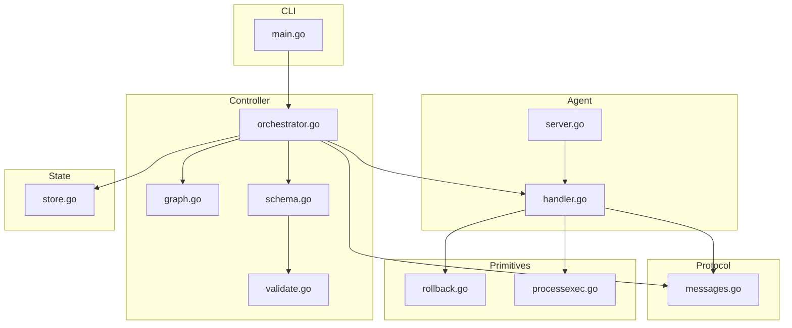
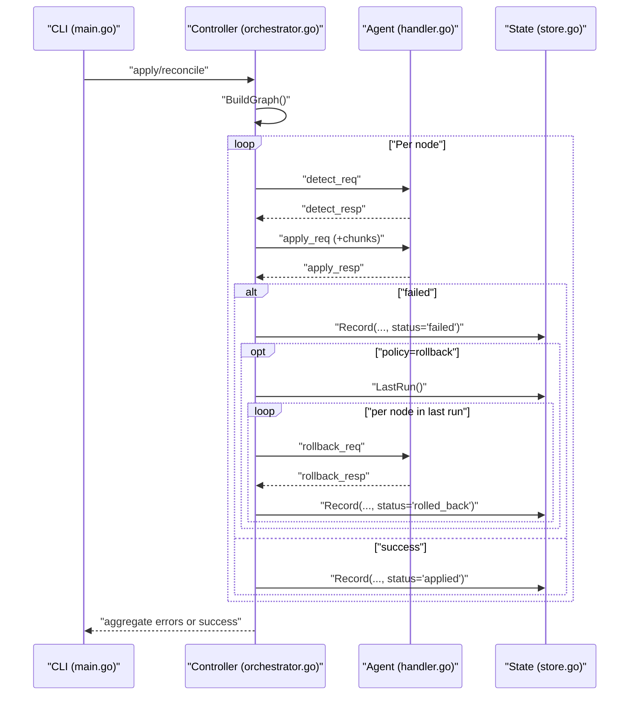
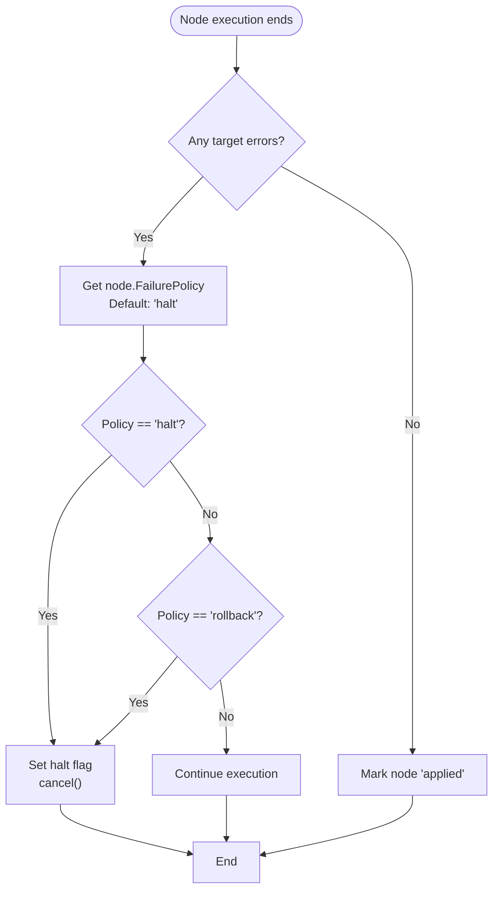
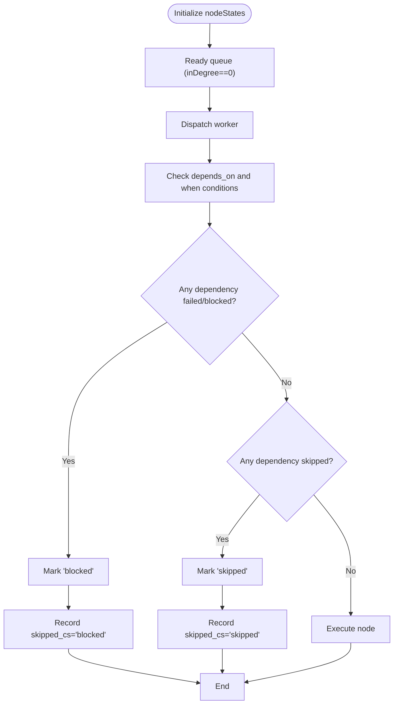
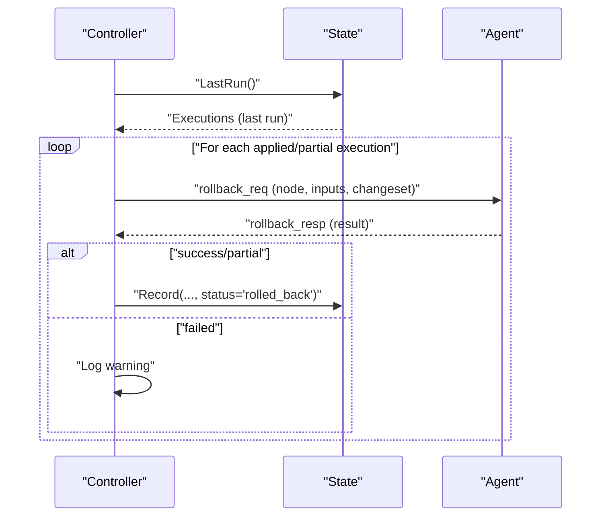
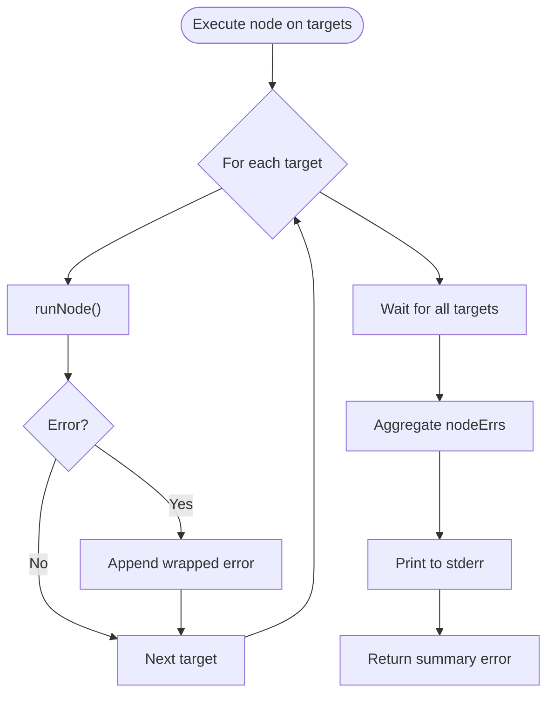
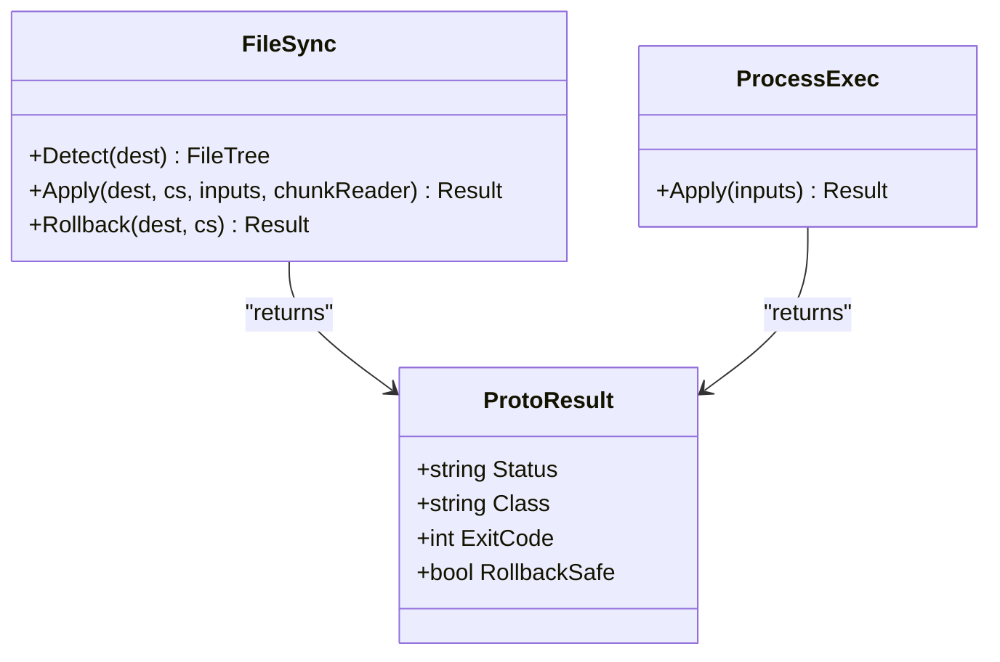
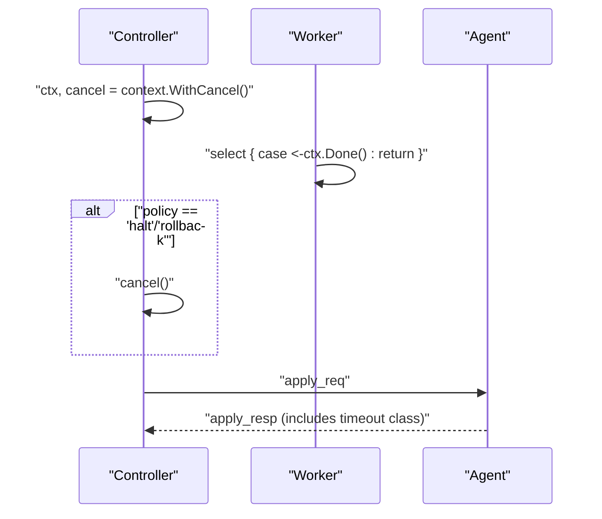
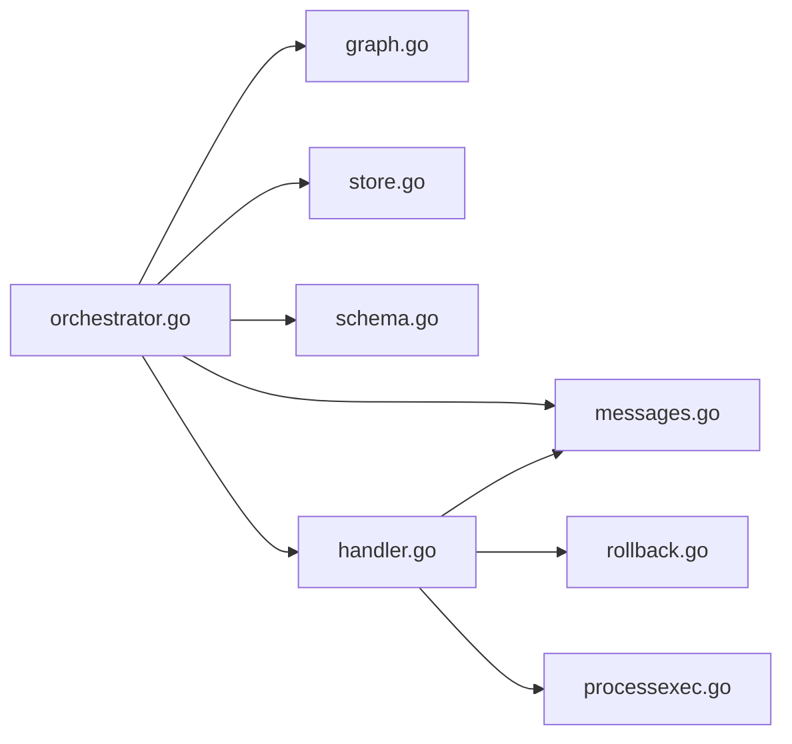

# Error Handling and Failure Policies

<cite>
**Referenced Files in This Document**
- [orchestrator.go](file://internal/controller/orchestrator.go)
- [handler.go](file://internal/agent/handler.go)
- [messages.go](file://internal/proto/messages.go)
- [store.go](file://internal/state/store.go)
- [schema.go](file://internal/plan/schema.go)
- [processexec.go](file://internal/primitive/processexec/processexec.go)
- [rollback.go](file://internal/primitive/filesync/rollback.go)
- [graph.go](file://internal/controller/graph.go)
- [main.go](file://cmd/devopsctl/main.go)
- [server.go](file://internal/agent/server.go)
- [validate.go](file://internal/plan/validate.go)
- [resume_test.sh](file://tests/e2e/resume_test.sh)
</cite>

## Table of Contents
1. [Introduction](#introduction)
2. [Project Structure](#project-structure)
3. [Core Components](#core-components)
4. [Architecture Overview](#architecture-overview)
5. [Detailed Component Analysis](#detailed-component-analysis)
6. [Dependency Analysis](#dependency-analysis)
7. [Performance Considerations](#performance-considerations)
8. [Troubleshooting Guide](#troubleshooting-guide)
9. [Conclusion](#conclusion)

## Introduction
This document explains the error handling and failure policy implementation in the system. It covers the supported failure policies ("halt", "rollback", and "continue"), how they affect execution flow, error propagation through dependency chains, the rollback coordination system, error collection and reporting, integration with primitive operation error handling, and timeout handling, cancellation propagation, and graceful shutdown procedures.

## Project Structure
The error handling and failure policy logic spans several packages:
- Controller orchestrator: coordinates execution, enforces failure policies, and manages state.
- Agent handler: processes requests from the controller and returns structured results.
- Protocol definitions: shared wire protocol messages and data structures.
- State store: persists execution outcomes and supports rollback queries.
- Primitive operations: file synchronization and process execution with their own error semantics.
- CLI entry point: exposes commands for apply, reconcile, and rollback.

**Diagram sources**
- [main.go](file://cmd/devopsctl/main.go#L21-L273)
- [orchestrator.go](file://internal/controller/orchestrator.go#L1-L653)
- [handler.go](file://internal/agent/handler.go#L1-L189)
- [messages.go](file://internal/proto/messages.go#L1-L117)
- [store.go](file://internal/state/store.go#L1-L226)
- [schema.go](file://internal/plan/schema.go#L1-L77)
- [processexec.go](file://internal/primitive/processexec/processexec.go#L1-L83)
- [rollback.go](file://internal/primitive/filesync/rollback.go#L1-L83)
- [graph.go](file://internal/controller/graph.go#L1-L84)
- [server.go](file://internal/agent/server.go#L1-L50)
- [validate.go](file://internal/plan/validate.go#L1-L95)

**Section sources**
- [main.go](file://cmd/devopsctl/main.go#L21-L273)
- [orchestrator.go](file://internal/controller/orchestrator.go#L1-L653)
- [handler.go](file://internal/agent/handler.go#L1-L189)
- [messages.go](file://internal/proto/messages.go#L1-L117)
- [store.go](file://internal/state/store.go#L1-L226)
- [schema.go](file://internal/plan/schema.go#L1-L77)
- [processexec.go](file://internal/primitive/processexec/processexec.go#L1-L83)
- [rollback.go](file://internal/primitive/filesync/rollback.go#L1-L83)
- [graph.go](file://internal/controller/graph.go#L1-L84)
- [server.go](file://internal/agent/server.go#L1-L50)
- [validate.go](file://internal/plan/validate.go#L1-L95)

## Core Components
- Failure policy enforcement: The orchestrator evaluates node-level failure policy and controls execution halting, cascading skips, and global rollbacks.
- Error propagation: Nodes failing due to dependency failures or conditions are marked as "blocked" or "skipped" and their status propagates downstream.
- Rollback coordination: On failure with "rollback" policy, the orchestrator triggers a global rollback of the last run and delegates per-node rollbacks to agents.
- Error collection and reporting: Errors are aggregated per node and per target, printed to stderr, and summarized at the end.
- Primitive integration: File sync and process execution primitives return structured results with status, class, and rollback safety indicators.
- Timeout and cancellation: Context-based cancellation is propagated to ongoing operations; timeouts are handled by process execution primitive.
- Graceful shutdown: Agents support signal-driven shutdown.

**Section sources**
- [orchestrator.go](file://internal/controller/orchestrator.go#L244-L265)
- [orchestrator.go](file://internal/controller/orchestrator.go#L101-L155)
- [orchestrator.go](file://internal/controller/orchestrator.go#L262-L265)
- [orchestrator.go](file://internal/controller/orchestrator.go#L293-L299)
- [handler.go](file://internal/agent/handler.go#L147-L173)
- [messages.go](file://internal/proto/messages.go#L103-L117)
- [processexec.go](file://internal/primitive/processexec/processexec.go#L14-L82)
- [server.go](file://internal/agent/server.go#L20-L50)

## Architecture Overview
The system uses a controller-agent architecture with a clear separation of concerns:
- Controller builds a dependency graph, schedules nodes, enforces failure policies, and records state.
- Agent handles detect, apply, and rollback requests, returning structured results.
- Protocol defines message envelopes and shared data structures.
- State store persists execution outcomes and supports rollback queries.

**Diagram sources**
- [main.go](file://cmd/devopsctl/main.go#L36-L83)
- [orchestrator.go](file://internal/controller/orchestrator.go#L46-L300)
- [handler.go](file://internal/agent/handler.go#L40-L173)
- [store.go](file://internal/state/store.go#L68-L84)

## Detailed Component Analysis

### Failure Policy Enforcement
The orchestrator enforces three failure policies at the node level:
- halt: Stops further execution and cancels remaining targets.
- rollback: Halts execution and triggers a global rollback of the last run.
- continue: Continues execution; dependents may still be skipped due to cascading conditions.

Key behaviors:
- Default policy is "halt" if unspecified.
- On failure, the orchestrator sets node state to "failed" and aggregates errors.
- If policy is "halt" or "rollback", it sets a halt flag and cancels the context to stop new work.
- If policy is "rollback", it triggers a global rollback after the current node completes.

**Diagram sources**
- [orchestrator.go](file://internal/controller/orchestrator.go#L241-L255)
- [orchestrator.go](file://internal/controller/orchestrator.go#L244-L251)
- [orchestrator.go](file://internal/controller/orchestrator.go#L262-L265)

**Section sources**
- [orchestrator.go](file://internal/controller/orchestrator.go#L241-L255)
- [orchestrator.go](file://internal/controller/orchestrator.go#L244-L251)
- [orchestrator.go](file://internal/controller/orchestrator.go#L262-L265)
- [schema.go](file://internal/plan/schema.go#L25-L33)
- [validate.go](file://internal/plan/validate.go#L65-L67)

### Error Propagation Through Dependencies
The orchestrator maintains node states and in-degree counts to propagate failures:
- Nodes with failed or blocked dependencies are marked "blocked".
- Nodes with skipped dependencies are marked "skipped".
- When a node is skipped, the orchestrator records the event and prints a message indicating the reason.

**Diagram sources**
- [orchestrator.go](file://internal/controller/orchestrator.go#L54-L71)
- [orchestrator.go](file://internal/controller/orchestrator.go#L101-L155)
- [graph.go](file://internal/controller/graph.go#L16-L48)

**Section sources**
- [orchestrator.go](file://internal/controller/orchestrator.go#L101-L155)
- [graph.go](file://internal/controller/graph.go#L16-L48)

### Rollback Coordination System
Global rollback:
- Triggered when a node fails with "rollback" policy and the halt flag is set.
- Orchestrator queries the last run from state and iterates successful nodes.
- For each node, it constructs a rollback request and invokes the agent.

Agent-level rollback:
- For file.sync, the agent performs a controlled restoration using snapshots.
- For process.exec, rollback is not supported and the agent reports failure.

**Diagram sources**
- [orchestrator.go](file://internal/controller/orchestrator.go#L618-L652)
- [handler.go](file://internal/agent/handler.go#L147-L173)
- [rollback.go](file://internal/primitive/filesync/rollback.go#L11-L82)
- [store.go](file://internal/state/store.go#L190-L225)

**Section sources**
- [orchestrator.go](file://internal/controller/orchestrator.go#L618-L652)
- [handler.go](file://internal/agent/handler.go#L147-L173)
- [rollback.go](file://internal/primitive/filesync/rollback.go#L11-L82)
- [store.go](file://internal/state/store.go#L190-L225)

### Error Collection and Reporting
- Per-target errors are collected during node execution and wrapped with node and target identifiers.
- Aggregated errors are printed to stderr and summarized at the end of execution.
- The orchestrator returns a single error summarizing the number of failed nodes.

**Diagram sources**
- [orchestrator.go](file://internal/controller/orchestrator.go#L158-L237)
- [orchestrator.go](file://internal/controller/orchestrator.go#L293-L299)

**Section sources**
- [orchestrator.go](file://internal/controller/orchestrator.go#L158-L237)
- [orchestrator.go](file://internal/controller/orchestrator.go#L293-L299)

### Integration with Primitive Operation Error Handling
- File sync:
  - Detects remote state and computes diffs.
  - Streams file chunks and applies changes.
  - Returns structured result with rollback safety indicator.
  - On failure, orchestrator triggers agent-level rollback if safe.
- Process execution:
  - Executes command with optional timeout.
  - Returns structured result with exit code and class ("timeout" or "execution_error").
  - Rollback is not supported for process.exec.

**Diagram sources**
- [messages.go](file://internal/proto/messages.go#L103-L117)
- [rollback.go](file://internal/primitive/filesync/rollback.go#L11-L82)
- [processexec.go](file://internal/primitive/processexec/processexec.go#L14-L82)

**Section sources**
- [messages.go](file://internal/proto/messages.go#L103-L117)
- [rollback.go](file://internal/primitive/filesync/rollback.go#L11-L82)
- [processexec.go](file://internal/primitive/processexec/processexec.go#L14-L82)
- [orchestrator.go](file://internal/controller/orchestrator.go#L430-L441)

### Timeout Handling, Cancellation Propagation, and Graceful Shutdown
- Context cancellation:
  - Orchestrator creates a cancellable context and cancels it when "halt" or "rollback" policies trigger.
  - Workers check for cancellation before starting work and skip execution if cancelled.
- Timeout handling:
  - Process execution primitive respects a configurable timeout and marks the result as "timeout" when exceeded.
- Graceful shutdown:
  - Agent server listens for SIGTERM/SIGINT and shuts down gracefully.

**Diagram sources**
- [orchestrator.go](file://internal/controller/orchestrator.go#L75-L76)
- [orchestrator.go](file://internal/controller/orchestrator.go#L173-L178)
- [processexec.go](file://internal/primitive/processexec/processexec.go#L31-L36)
- [server.go](file://internal/agent/server.go#L20-L50)

**Section sources**
- [orchestrator.go](file://internal/controller/orchestrator.go#L75-L76)
- [orchestrator.go](file://internal/controller/orchestrator.go#L173-L178)
- [processexec.go](file://internal/primitive/processexec/processexec.go#L31-L36)
- [server.go](file://internal/agent/server.go#L20-L50)

### Examples of Failure Scenarios and Resolution Strategies
- Scenario: Node A fails with "halt" policy.
  - Resolution: Execution stops; dependents are skipped; orchestrator summarizes errors.
- Scenario: Node B fails with "rollback" policy.
  - Resolution: Execution halts; orchestrator triggers global rollback; agent performs per-node rollback for file.sync.
- Scenario: Node C fails with "continue" policy.
  - Resolution: Execution continues; dependents may still be skipped due to cascading conditions.
- Scenario: Process execution timeout.
  - Resolution: Result class is "timeout"; rollback is not supported; user can adjust timeout or fix the command.

These behaviors are validated by the plan validation logic and the orchestrator’s policy enforcement.

**Section sources**
- [validate.go](file://internal/plan/validate.go#L65-L67)
- [orchestrator.go](file://internal/controller/orchestrator.go#L244-L251)
- [processexec.go](file://internal/primitive/processexec/processexec.go#L70-L76)
- [handler.go](file://internal/agent/handler.go#L156-L162)

## Dependency Analysis
The orchestrator depends on:
- Graph construction and validation to ensure acyclic execution.
- Protocol messages for communication with agents.
- State store for persistence and rollback queries.
- Primitive handlers for file sync and process execution.

**Diagram sources**
- [orchestrator.go](file://internal/controller/orchestrator.go#L1-L653)
- [graph.go](file://internal/controller/graph.go#L1-L84)
- [messages.go](file://internal/proto/messages.go#L1-L117)
- [store.go](file://internal/state/store.go#L1-L226)
- [schema.go](file://internal/plan/schema.go#L1-L77)
- [handler.go](file://internal/agent/handler.go#L1-L189)
- [rollback.go](file://internal/primitive/filesync/rollback.go#L1-L83)
- [processexec.go](file://internal/primitive/processexec/processexec.go#L1-L83)

**Section sources**
- [orchestrator.go](file://internal/controller/orchestrator.go#L1-L653)
- [graph.go](file://internal/controller/graph.go#L1-L84)
- [messages.go](file://internal/proto/messages.go#L1-L117)
- [store.go](file://internal/state/store.go#L1-L226)
- [schema.go](file://internal/plan/schema.go#L1-L77)
- [handler.go](file://internal/agent/handler.go#L1-L189)
- [rollback.go](file://internal/primitive/filesync/rollback.go#L1-L83)
- [processexec.go](file://internal/primitive/processexec/processexec.go#L1-L83)

## Performance Considerations
- Parallelism: Controlled via a semaphore to limit concurrent targets per node.
- Early termination: Cancellation short-circuits new work when policies require it.
- State persistence: Append-only writes minimize contention; queries are indexed for efficient lookups.

[No sources needed since this section provides general guidance]

## Troubleshooting Guide
Common issues and resolutions:
- Invalid failure policy: Ensure policy is one of "halt", "continue", or "rollback". Validation errors will be reported during plan load.
- Dependency cycle: The graph builder detects cycles and prevents execution.
- Agent connectivity: Connection errors during detect/apply/rollback are surfaced with context.
- Rollback failures: Agent reports "process.exec cannot be rolled back"; orchestrator logs warnings and continues.

Operational tips:
- Use "dry-run" to preview changes before applying.
- Resume interrupted runs to avoid re-executing successful nodes.
- Inspect state with the state list command to diagnose outcomes.

**Section sources**
- [validate.go](file://internal/plan/validate.go#L65-L67)
- [graph.go](file://internal/controller/graph.go#L42-L83)
- [orchestrator.go](file://internal/controller/orchestrator.go#L313-L337)
- [handler.go](file://internal/agent/handler.go#L156-L162)
- [main.go](file://cmd/devopsctl/main.go#L161-L192)

## Conclusion
The system implements robust error handling with explicit failure policies that govern execution flow, error propagation, and rollback coordination. The orchestrator centralizes policy enforcement while delegating primitive-specific operations to agents. Structured results and state persistence enable reliable diagnostics and recovery, including global rollbacks and targeted agent rollbacks for supported primitives.