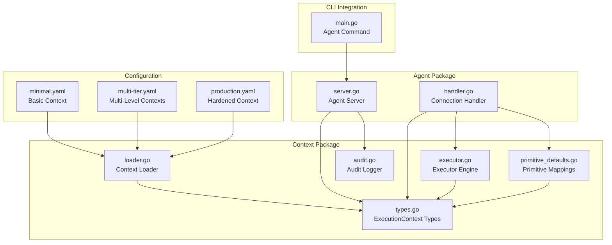
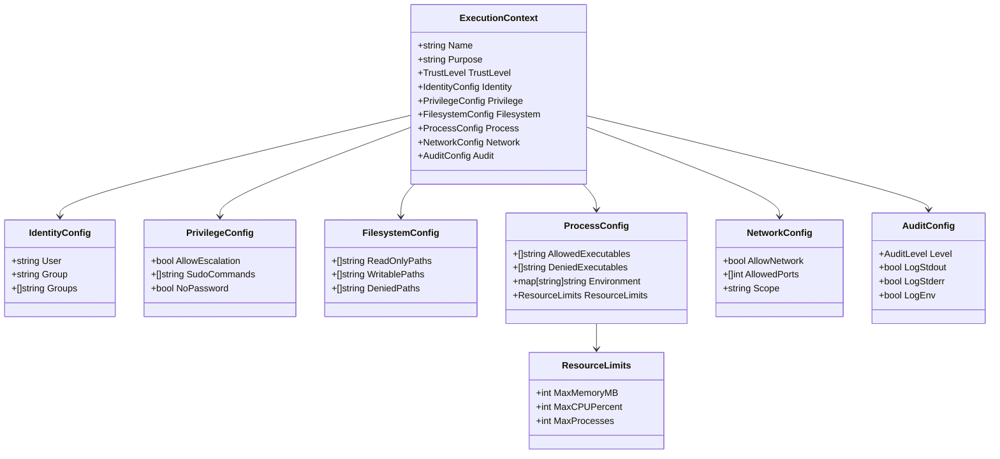
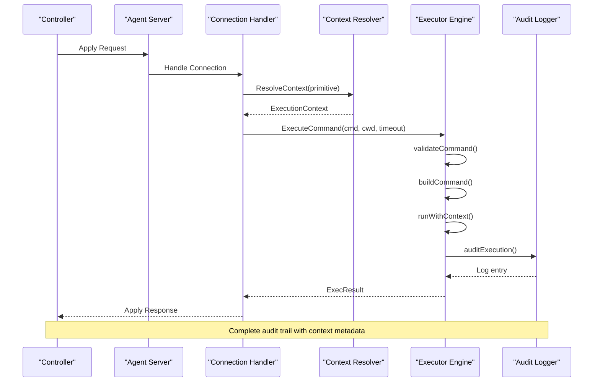
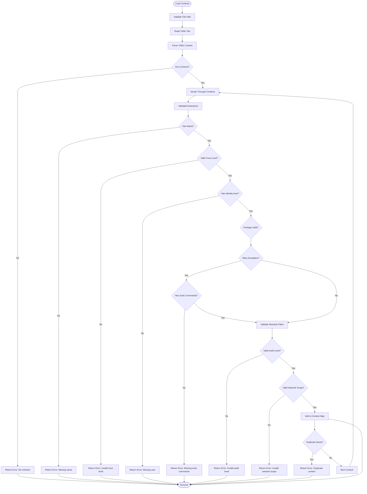
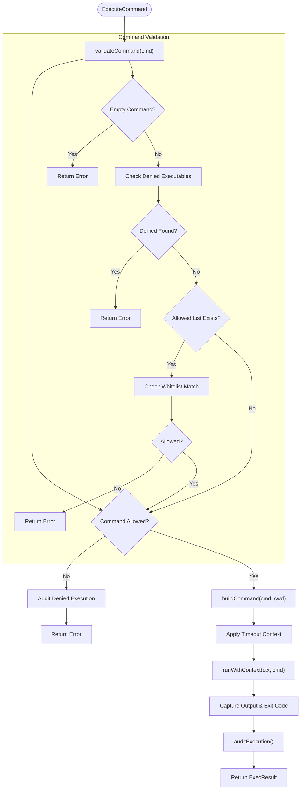
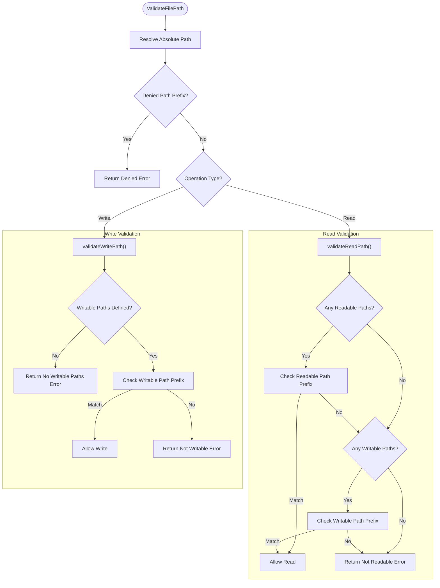
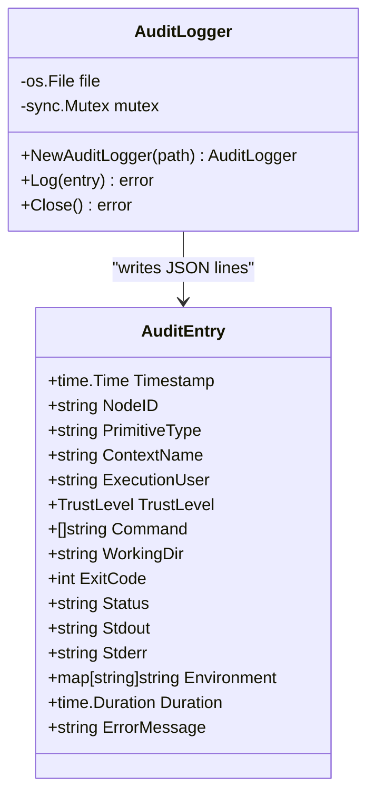
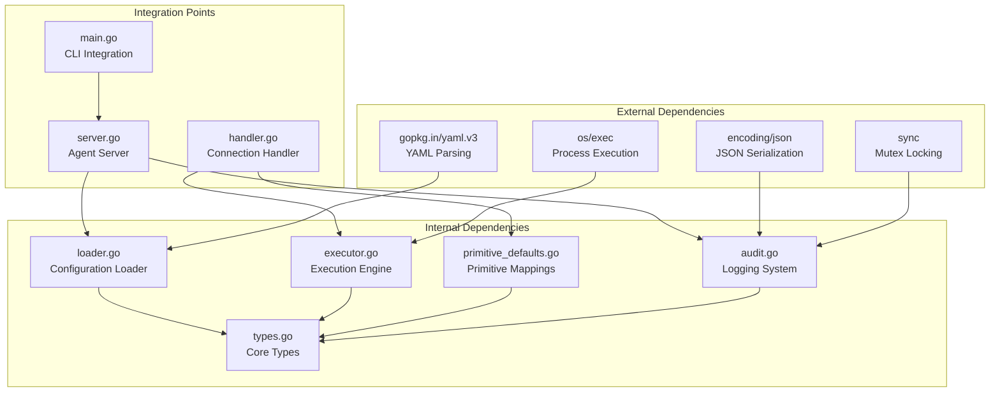

# Execution Contexts Framework

<cite>
**Referenced Files in This Document**
- [types.go](file://internal/agent/context/types.go)
- [executor.go](file://internal/agent/context/executor.go)
- [loader.go](file://internal/agent/context/loader.go)
- [primitive_defaults.go](file://internal/agent/context/primitive_defaults.go)
- [audit.go](file://internal/agent/context/audit.go)
- [executor_test.go](file://internal/agent/context/executor_test.go)
- [loader_test.go](file://internal/agent/context/loader_test.go)
- [minimal.yaml](file://examples/contexts/minimal.yaml)
- [multi-tier.yaml](file://examples/contexts/multi-tier.yaml)
- [production.yaml](file://examples/contexts/production.yaml)
- [main.go](file://cmd/devopsctl/main.go)
- [server.go](file://internal/agent/server.go)
- [handler.go](file://internal/agent/handler.go)
- [README.md](file://README.md)
</cite>

## Table of Contents
1. [Introduction](#introduction)
2. [Project Structure](#project-structure)
3. [Core Components](#core-components)
4. [Architecture Overview](#architecture-overview)
5. [Detailed Component Analysis](#detailed-component-analysis)
6. [Dependency Analysis](#dependency-analysis)
7. [Performance Considerations](#performance-considerations)
8. [Troubleshooting Guide](#troubleshooting-guide)
9. [Conclusion](#conclusion)

## Introduction
The Execution Contexts Framework is a security and runtime enforcement system that defines the operational boundaries for primitive execution in the devopsctl agent. It establishes who can execute operations, with what privileges, on which resources, and under what auditing conditions. This framework ensures deterministic, secure, and auditable execution across distributed targets while maintaining the principle of least privilege.

The framework consists of five primary components:
- **ExecutionContext**: Defines the security envelope with identity, privilege, filesystem, process, network, and audit configurations
- **Executor**: Validates commands and file operations against context rules, executes with enforced restrictions, and audits outcomes
- **Context Loader**: Loads and validates execution contexts from YAML configuration files
- **Primitive Defaults**: Maps primitive types to their default context requirements and minimum trust levels
- **Audit Logger**: Provides structured audit logging with configurable verbosity levels

## Project Structure
The Execution Contexts Framework is organized within the internal/agent/context package, with supporting integration points in the agent server and handler:

**Diagram sources**
- [server.go](file://internal/agent/server.go#L1-L90)
- [handler.go](file://internal/agent/handler.go#L1-L274)
- [types.go](file://internal/agent/context/types.go#L1-L84)
- [executor.go](file://internal/agent/context/executor.go#L1-L307)
- [loader.go](file://internal/agent/context/loader.go#L1-L122)
- [primitive_defaults.go](file://internal/agent/context/primitive_defaults.go#L1-L73)
- [audit.go](file://internal/agent/context/audit.go#L1-L64)
- [minimal.yaml](file://examples/contexts/minimal.yaml#L1-L38)
- [multi-tier.yaml](file://examples/contexts/multi-tier.yaml#L1-L117)
- [production.yaml](file://examples/contexts/production.yaml#L1-L43)
- [main.go](file://cmd/devopsctl/main.go#L193-L219)

**Section sources**
- [types.go](file://internal/agent/context/types.go#L1-L84)
- [executor.go](file://internal/agent/context/executor.go#L1-L307)
- [loader.go](file://internal/agent/context/loader.go#L1-L122)
- [primitive_defaults.go](file://internal/agent/context/primitive_defaults.go#L1-L73)
- [audit.go](file://internal/agent/context/audit.go#L1-L64)
- [server.go](file://internal/agent/server.go#L1-L90)
- [handler.go](file://internal/agent/handler.go#L1-L274)
- [main.go](file://cmd/devopsctl/main.go#L193-L219)

## Core Components

### ExecutionContext Model
The ExecutionContext serves as the central security envelope defining all operational constraints:

**Diagram sources**
- [types.go](file://internal/agent/context/types.go#L3-L84)

### Trust Levels and Audit Levels
The framework defines three trust levels and three audit levels to balance security and observability:

| Trust Level | Description | Use Case |
|-------------|-------------|----------|
| low | Lowest privilege, restricted access | General operations, file synchronization |
| medium | Moderate privilege, controlled escalation | Application deployment, service management |
| high | Highest privilege, administrative access | System administration, critical operations |

| Audit Level | Logging Scope | Use Case |
|-------------|---------------|----------|
| minimal | Success/failure only | Development/testing environments |
| standard | Inputs/outputs | Production monitoring |
| full | Command, environment, outputs | Compliance, security auditing |

**Section sources**
- [types.go](file://internal/agent/context/types.go#L16-L23)
- [types.go](file://internal/agent/context/types.go#L76-L83)

## Architecture Overview
The Execution Contexts Framework integrates seamlessly with the devopsctl agent architecture:

**Diagram sources**
- [handler.go](file://internal/agent/handler.go#L90-L160)
- [executor.go](file://internal/agent/context/executor.go#L29-L73)
- [audit.go](file://internal/agent/context/audit.go#L45-L58)

### Context Loading and Validation
The framework provides robust context loading with comprehensive validation:

**Diagram sources**
- [loader.go](file://internal/agent/context/loader.go#L16-L53)
- [loader.go](file://internal/agent/context/loader.go#L55-L121)

**Section sources**
- [loader.go](file://internal/agent/context/loader.go#L16-L53)
- [loader.go](file://internal/agent/context/loader.go#L55-L121)

## Detailed Component Analysis

### Executor Engine
The Executor enforces context restrictions during command execution:

**Diagram sources**
- [executor.go](file://internal/agent/context/executor.go#L29-L73)
- [executor.go](file://internal/agent/context/executor.go#L106-L138)

#### Command Execution Flow
The executor handles user switching and privilege escalation:

| Scenario | User Setting | Privilege Setting | Action |
|----------|--------------|-------------------|---------|
| Current User | empty or "current" | any | Execute as current user |
| Non-privileged | specified user | allow_escalation=false | Use runuser for user switching |
| Privileged | specified user | allow_escalation=true | Use sudo with NOPASSWD option |
| No User Specified | empty | any | Execute as current user |

**Section sources**
- [executor.go](file://internal/agent/context/executor.go#L29-L73)
- [executor.go](file://internal/agent/context/executor.go#L75-L104)

### File Operation Validation
The framework provides granular file system access control:

**Diagram sources**
- [executor.go](file://internal/agent/context/executor.go#L238-L306)

**Section sources**
- [executor.go](file://internal/agent/context/executor.go#L238-L306)

### Primitive Context Requirements
The framework maps primitive types to their security requirements:

| Primitive Type | Default Context | Minimum Trust Level | Network Required | Filesystem Required |
|----------------|-----------------|---------------------|------------------|---------------------|
| file.sync | safe_user_space | low | Yes | Yes |
| process.exec | safe_user_space | low | Depends on context | Yes |

**Section sources**
- [primitive_defaults.go](file://internal/agent/context/primitive_defaults.go#L13-L25)

### Audit Logging System
The audit system provides structured logging with configurable verbosity:

**Diagram sources**
- [audit.go](file://internal/agent/context/audit.go#L10-L64)

**Section sources**
- [audit.go](file://internal/agent/context/audit.go#L10-L64)

## Dependency Analysis
The Execution Contexts Framework has minimal external dependencies and clear internal relationships:

**Diagram sources**
- [loader.go](file://internal/agent/context/loader.go#L3-L9)
- [executor.go](file://internal/agent/context/executor.go#L3-L11)
- [audit.go](file://internal/agent/context/audit.go#L3-L8)
- [server.go](file://internal/agent/server.go#L5-L15)
- [handler.go](file://internal/agent/handler.go#L3-L16)
- [main.go](file://cmd/devopsctl/main.go#L4-L19)

**Section sources**
- [loader.go](file://internal/agent/context/loader.go#L3-L9)
- [executor.go](file://internal/agent/context/executor.go#L3-L11)
- [audit.go](file://internal/agent/context/audit.go#L3-L8)
- [server.go](file://internal/agent/server.go#L5-L15)
- [handler.go](file://internal/agent/handler.go#L3-L16)
- [main.go](file://cmd/devopsctl/main.go#L4-L19)

## Performance Considerations
The Execution Contexts Framework is designed for minimal overhead while maintaining security:

### Validation Complexity
- **Command Validation**: O(n) where n is the number of denied/allowed executables
- **Path Validation**: O(m) where m is the number of path prefixes checked
- **Context Loading**: O(k) where k is the number of contexts in the configuration file

### Memory Usage
- Context objects are lightweight with string slices and maps
- Audit entries are serialized as JSON lines, enabling streaming
- Executor maintains minimal state during execution

### Optimization Opportunities
- Consider caching validated contexts by primitive type
- Implement path prefix trees for efficient path validation
- Add context validation precompilation for frequently used contexts

## Troubleshooting Guide

### Common Configuration Issues
1. **Invalid Trust Level**: Ensure trust_level is one of "low", "medium", or "high"
2. **Missing User Identity**: Identity.user is required for all contexts
3. **Privilege Escalation Misconfiguration**: When allow_escalation is true, sudo_commands must be specified
4. **Non-Absolute Paths**: All filesystem paths must be absolute
5. **Duplicate Context Names**: Each context must have a unique name

### Audit Logging Problems
1. **Permission Denied**: Ensure the audit log file path is writable by the agent process
2. **JSON Encoding Errors**: Verify audit entry serialization succeeds
3. **Thread Safety**: The audit logger uses mutex locking for concurrent access

### Execution Failures
1. **Command Denied**: Check denied_executables and allowed_executables lists
2. **Path Access Denied**: Verify file system path restrictions
3. **Privilege Issues**: Confirm user switching and sudo configuration
4. **Timeout Exceeded**: Adjust timeout settings or resource limits

**Section sources**
- [loader_test.go](file://internal/agent/context/loader_test.go#L7-L137)
- [executor_test.go](file://internal/agent/context/executor_test.go#L7-L141)

## Conclusion
The Execution Contexts Framework provides a robust, extensible foundation for secure and auditable primitive execution in distributed DevOps environments. Its layered approach to security—covering identity, privilege, filesystem access, process controls, network restrictions, and comprehensive auditing—ensures that operations remain within defined boundaries while maintaining operational flexibility.

Key strengths of the framework include:
- **Comprehensive Security Coverage**: Multi-layered enforcement prevents unauthorized operations
- **Flexible Configuration**: YAML-based context definitions support diverse operational scenarios
- **Auditable Operations**: Structured logging enables compliance and forensic analysis
- **Minimal Performance Impact**: Efficient validation and execution with low overhead
- **Easy Integration**: Clean APIs facilitate seamless integration with existing systems

The framework's design aligns with modern DevOps security principles while remaining practical for real-world deployments. Its modular architecture supports future enhancements such as advanced policy enforcement, dynamic context selection, and enhanced audit capabilities.