# Execution Engine Architecture

<cite>
**Referenced Files in This Document**
- [main.go](file://cmd/devopsctl/main.go)
- [orchestrator.go](file://internal/controller/orchestrator.go)
- [graph.go](file://internal/controller/graph.go)
- [display.go](file://internal/controller/display.go)
- [server.go](file://internal/agent/server.go)
- [handler.go](file://internal/agent/handler.go)
- [store.go](file://internal/state/store.go)
- [schema.go](file://internal/plan/schema.go)
- [messages.go](file://internal/proto/messages.go)
- [diff.go](file://internal/primitive/filesync/diff.go)
- [apply.go](file://internal/primitive/filesync/apply.go)
- [rollback.go](file://internal/primitive/filesync/rollback.go)
- [processexec.go](file://internal/primitive/processexec/processexec.go)
- [go.mod](file://go.mod)
</cite>

## Table of Contents
1. [Introduction](#introduction)
2. [Project Structure](#project-structure)
3. [Core Components](#core-components)
4. [Architecture Overview](#architecture-overview)
5. [Detailed Component Analysis](#detailed-component-analysis)
6. [Dependency Analysis](#dependency-analysis)
7. [Performance Considerations](#performance-considerations)
8. [Troubleshooting Guide](#troubleshooting-guide)
9. [Conclusion](#conclusion)
10. [Appendices](#appendices)

## Introduction
DevOpsCtl is a programming-first execution engine that compiles declarative plans into executable workloads and coordinates distributed execution across remote agents. The controller orchestrates dependency-aware execution, parallel worker pools, and stateful reconciliation. Agents run locally on target hosts and implement primitive operations such as file synchronization and process execution. A local SQLite-backed state store persists execution outcomes and supports idempotent reapplication, reconciliation, and rollback.

## Project Structure
The repository is organized by functional domains:
- CLI entrypoint and commands
- Controller orchestration and graph building
- Agent daemon and handlers
- State persistence
- Plan schema and validation
- Protocol definitions
- Primitive implementations (filesync, processexec)
- Technology stack and dependencies

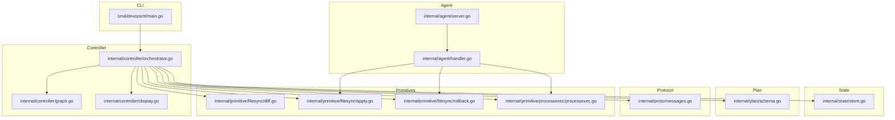

**Diagram sources**
- [main.go](file://cmd/devopsctl/main.go#L1-L273)
- [orchestrator.go](file://internal/controller/orchestrator.go#L1-L653)
- [graph.go](file://internal/controller/graph.go#L1-L84)
- [display.go](file://internal/controller/display.go#L1-L44)
- [server.go](file://internal/agent/server.go#L1-L51)
- [handler.go](file://internal/agent/handler.go#L1-L189)
- [store.go](file://internal/state/store.go#L1-L226)
- [schema.go](file://internal/plan/schema.go#L1-L77)
- [messages.go](file://internal/proto/messages.go#L1-L117)
- [diff.go](file://internal/primitive/filesync/diff.go#L1-L87)
- [apply.go](file://internal/primitive/filesync/apply.go#L1-L252)
- [rollback.go](file://internal/primitive/filesync/rollback.go#L1-L83)
- [processexec.go](file://internal/primitive/processexec/processexec.go#L1-L83)

**Section sources**
- [main.go](file://cmd/devopsctl/main.go#L1-L273)
- [go.mod](file://go.mod#L1-L14)

## Core Components
- CLI and Commands: Parses plan files (.devops or JSON), validates, opens state store, and invokes controller execution with configurable options (dry-run, parallelism, resume, reconcile).
- Controller Orchestrator: Builds a dependency graph, manages a bounded worker pool, tracks node states, enforces failure policies, and coordinates with agents via a line-delimited JSON protocol.
- Agent Daemon: Listens for TCP connections, handles detect/apply/rollback requests, and executes primitives locally.
- State Store: Append-only SQLite database storing execution records with plan/node hashes, content hashes, timestamps, statuses, and serialized change sets.
- Plan Schema: Defines Targets and Nodes, including dependency links, conditional execution, failure policy, and inputs.
- Protocol: Typed messages for detect, apply, rollback, and streaming file chunks.
- Primitives: File synchronization (diff, apply, rollback) and process execution (with timeouts and exit code reporting).

**Section sources**
- [main.go](file://cmd/devopsctl/main.go#L32-L87)
- [orchestrator.go](file://internal/controller/orchestrator.go#L26-L32)
- [server.go](file://internal/agent/server.go#L15-L51)
- [store.go](file://internal/state/store.go#L33-L66)
- [schema.go](file://internal/plan/schema.go#L11-L40)
- [messages.go](file://internal/proto/messages.go#L14-L117)
- [diff.go](file://internal/primitive/filesync/diff.go#L7-L16)
- [apply.go](file://internal/primitive/filesync/apply.go#L19-L22)
- [processexec.go](file://internal/primitive/processexec/processexec.go#L13-L83)

## Architecture Overview
The system boundary separates the controller (local orchestrator) from agents (remote execution units) with a clear state management layer. The controller loads and validates plans, constructs a dependency graph, and schedules work across agents while persisting outcomes.

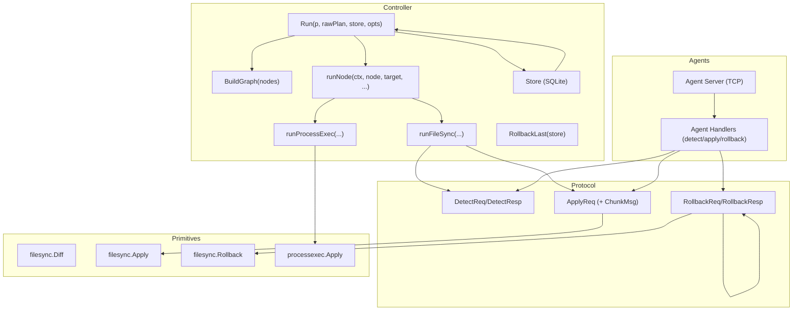

**Diagram sources**
- [orchestrator.go](file://internal/controller/orchestrator.go#L34-L300)
- [graph.go](file://internal/controller/graph.go#L16-L48)
- [handler.go](file://internal/agent/handler.go#L16-L51)
- [messages.go](file://internal/proto/messages.go#L14-L75)
- [apply.go](file://internal/primitive/filesync/apply.go#L19-L204)
- [rollback.go](file://internal/primitive/filesync/rollback.go#L11-L83)
- [processexec.go](file://internal/primitive/processexec/processexec.go#L13-L83)
- [store.go](file://internal/state/store.go#L33-L84)

## Detailed Component Analysis

### Controller Orchestration and Parallel Execution
The controller constructs a dependency graph from plan nodes, initializes node states, and uses Kahn’s algorithm to ensure acyclicity. It maintains an in-degree map and a ready queue seeded with nodes having zero in-degree. A worker dispatcher launches goroutines up to a configurable parallelism bound. Each worker evaluates dependencies and optional when conditions, then executes per-target tasks with a target-level semaphore. Failures are handled according to node failure policy (halt, continue, rollback), and the controller cancels remaining work via context cancellation.

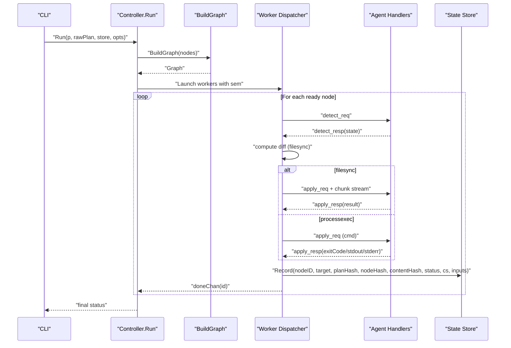

**Diagram sources**
- [orchestrator.go](file://internal/controller/orchestrator.go#L34-L300)
- [handler.go](file://internal/agent/handler.go#L53-L139)
- [messages.go](file://internal/proto/messages.go#L16-L75)
- [store.go](file://internal/state/store.go#L68-L84)

**Section sources**
- [orchestrator.go](file://internal/controller/orchestrator.go#L34-L300)
- [graph.go](file://internal/controller/graph.go#L16-L83)

### Dependency Resolution and Graph Construction
The dependency graph is built from node definitions and validated for cycles using Kahn’s algorithm. Duplicate node IDs and unknown dependencies produce errors. Edges represent dependency direction, and in-degree counts drive topological traversal.

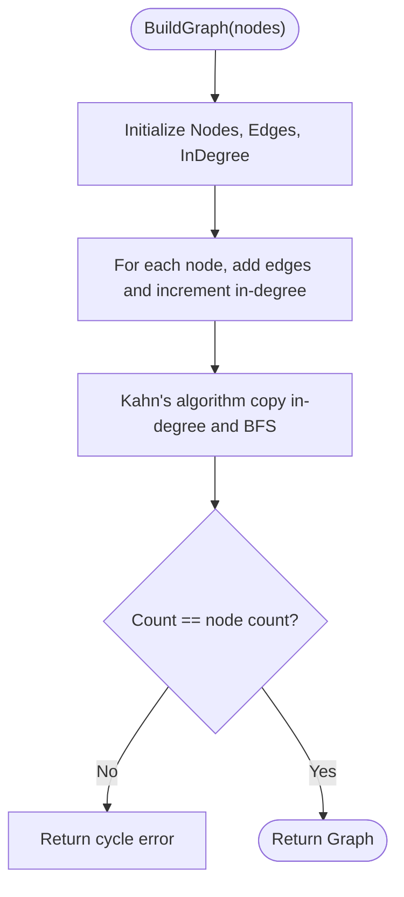

**Diagram sources**
- [graph.go](file://internal/controller/graph.go#L16-L83)

**Section sources**
- [graph.go](file://internal/controller/graph.go#L16-L83)

### Parallel Workers and Concurrency Controls
Workers are launched from the ready queue and executed under a semaphore limiting concurrent target executions. Node-level failure policy determines whether to halt further execution and trigger cascading skips. The controller tracks node changes to evaluate when conditions and updates node states atomically.

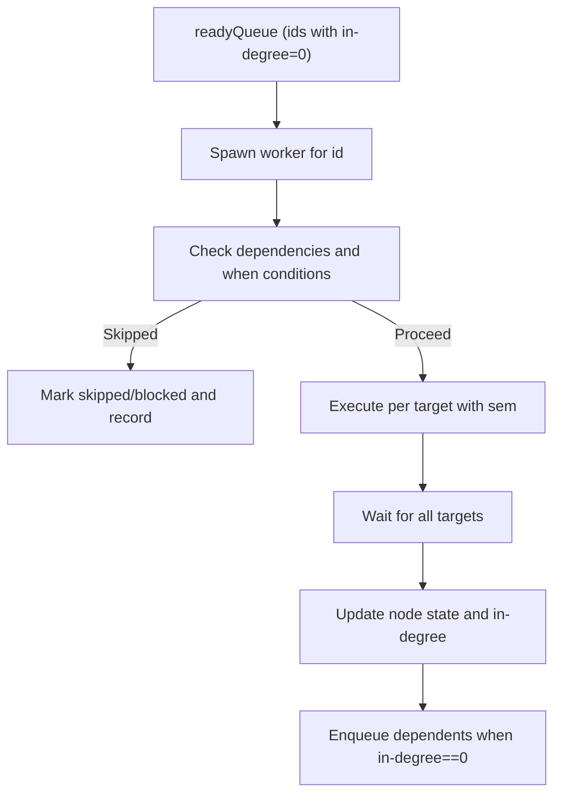

**Diagram sources**
- [orchestrator.go](file://internal/controller/orchestrator.go#L84-L291)

**Section sources**
- [orchestrator.go](file://internal/controller/orchestrator.go#L84-L291)

### Remote Agent Coordination and Protocol
Agents listen on TCP and handle three message types:
- Detect: Enumerate destination file tree for comparison.
- Apply: Receive changeset and streamed file chunks, apply, and return result.
- Rollback: Revert last apply using snapshot markers.

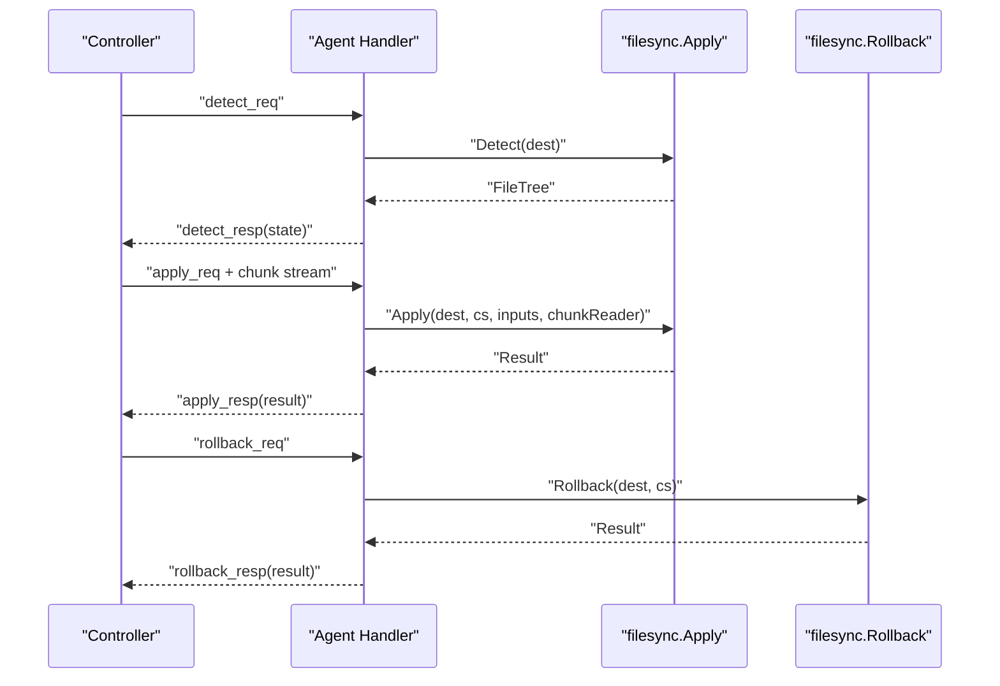

**Diagram sources**
- [handler.go](file://internal/agent/handler.go#L53-L173)
- [messages.go](file://internal/proto/messages.go#L16-L75)
- [apply.go](file://internal/primitive/filesync/apply.go#L19-L204)
- [rollback.go](file://internal/primitive/filesync/rollback.go#L11-L83)

**Section sources**
- [handler.go](file://internal/agent/handler.go#L16-L189)
- [messages.go](file://internal/proto/messages.go#L14-L117)

### State Tracking and Idempotency
The state store persists each execution outcome with:
- node_id, target, plan_hash, node_hash, content_hash, timestamp, status
- changeset_json and inputs_json for reproducibility and reconciliation

Idempotency is achieved by:
- Computing node_hash per node×target to detect identical work.
- Resuming when plan_hash matches and last execution for the pair was applied.
- Reconciliation skipping when node_hash equals the last applied hash.

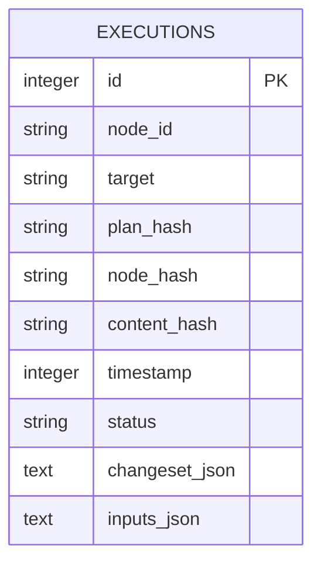

**Diagram sources**
- [store.go](file://internal/state/store.go#L17-L31)

**Section sources**
- [store.go](file://internal/state/store.go#L68-L160)
- [schema.go](file://internal/plan/schema.go#L54-L76)

### Rollback Mechanisms
Two rollback pathways exist:
- Global rollback triggered by failure policy: the controller queries the last run and issues rollback requests to agents for successful file.sync nodes.
- Per-operation rollback from agent: filesync primitives maintain a snapshot directory and can restore prior state for updated/deleted files and remove newly created ones.

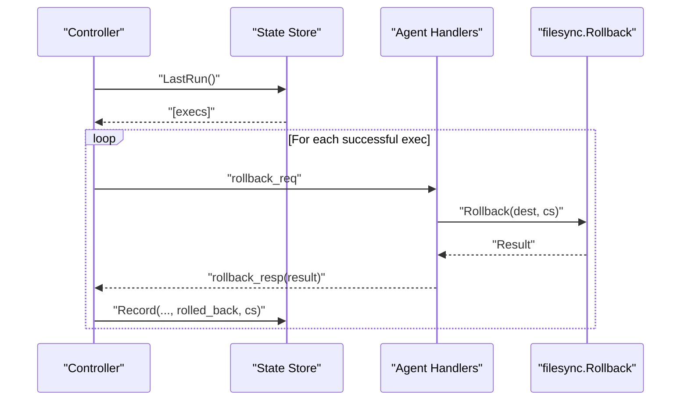

**Diagram sources**
- [orchestrator.go](file://internal/controller/orchestrator.go#L618-L652)
- [rollback.go](file://internal/primitive/filesync/rollback.go#L11-L83)

**Section sources**
- [orchestrator.go](file://internal/controller/orchestrator.go#L618-L652)
- [rollback.go](file://internal/primitive/filesync/rollback.go#L11-L83)

### Primitive Operations: File Sync and Process Execution
- File sync:
  - Detect: Build destination tree.
  - Diff: Compute create/update/delete/chmod/chown/mkdir.
  - Apply: Stream chunks, snapshot pre-change state, atomic rename, set mode/ownership, optional delete extra.
  - Rollback: Restore from snapshot, remove newly created files, clean snapshot.
- Process execution:
  - Execute command with optional timeout, capture stdout/stderr, propagate exit code and classification.

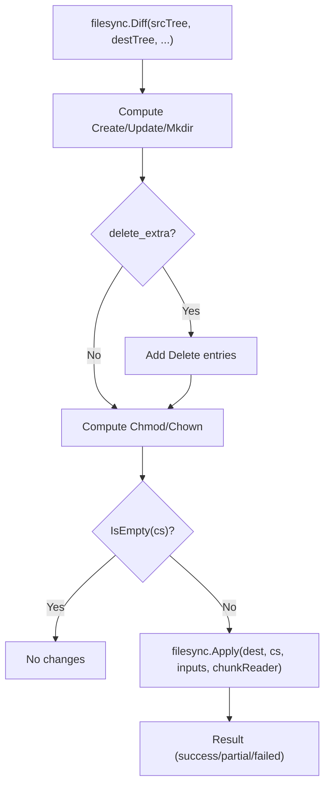

**Diagram sources**
- [diff.go](file://internal/primitive/filesync/diff.go#L7-L67)
- [apply.go](file://internal/primitive/filesync/apply.go#L19-L204)

**Section sources**
- [diff.go](file://internal/primitive/filesync/diff.go#L7-L87)
- [apply.go](file://internal/primitive/filesync/apply.go#L19-L252)
- [processexec.go](file://internal/primitive/processexec/processexec.go#L13-L83)

## Dependency Analysis
The controller depends on plan definitions, protocol messages, state storage, and primitives. Agents depend on primitives and protocol messages. The CLI wires everything together.

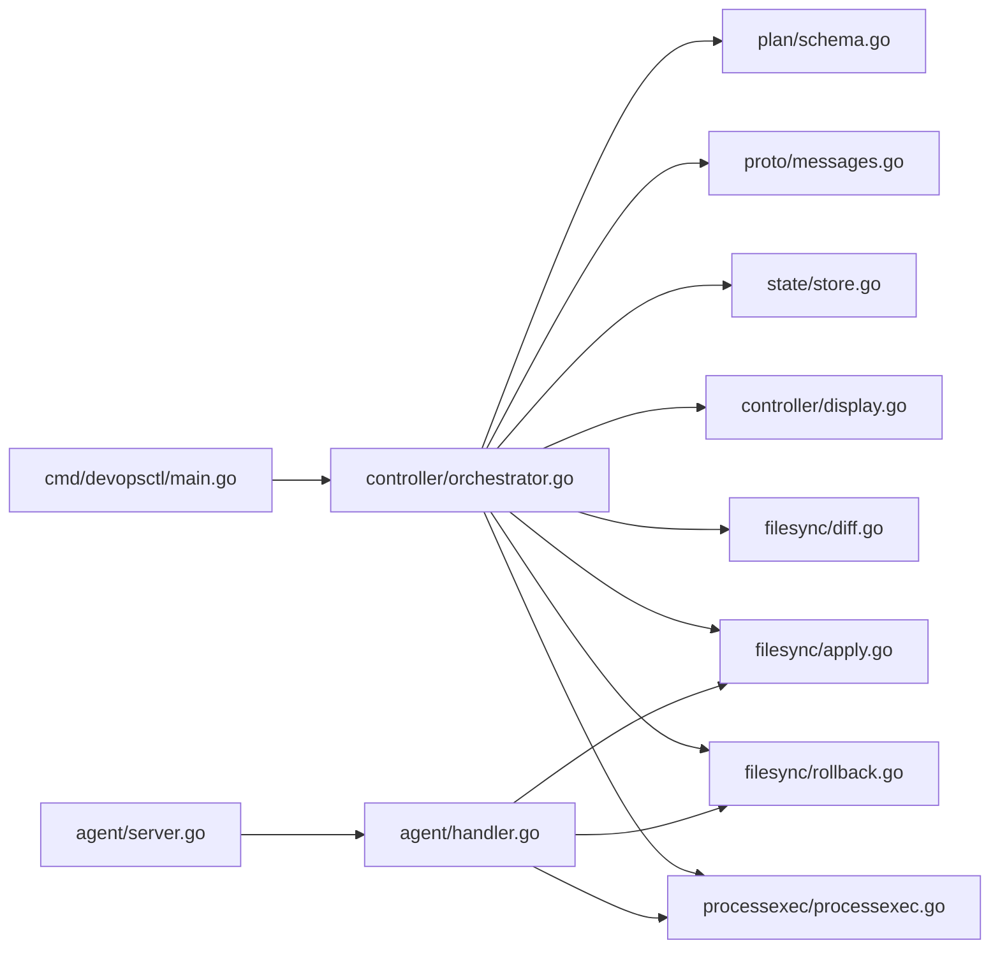

**Diagram sources**
- [main.go](file://cmd/devopsctl/main.go#L14-L18)
- [orchestrator.go](file://internal/controller/orchestrator.go#L5-L22)
- [schema.go](file://internal/plan/schema.go#L1-L77)
- [messages.go](file://internal/proto/messages.go#L1-L117)
- [store.go](file://internal/state/store.go#L1-L226)
- [server.go](file://internal/agent/server.go#L1-L51)
- [handler.go](file://internal/agent/handler.go#L1-L189)

**Section sources**
- [main.go](file://cmd/devopsctl/main.go#L14-L18)
- [orchestrator.go](file://internal/controller/orchestrator.go#L5-L22)

## Performance Considerations
- Parallelism tuning: Use the parallelism option to balance throughput and resource contention. Higher values increase concurrency but may saturate network or disk IO on agents.
- Streaming file transfers: Chunked transmission avoids buffering entire files, reducing memory footprint during apply.
- Indexing: The state store index on node_id and target accelerates lookups for resume/reconcile.
- Failure policy: “halt” minimizes wasted work; “rollback” ensures eventual consistency at the cost of additional agent calls.
- Scalability: For large plans, ensure adequate CPU/memory on the controller and agents, and consider distributing agents across availability zones.

[No sources needed since this section provides general guidance]

## Troubleshooting Guide
- Validation failures: Plan validation errors are printed during apply/reconcile; fix schema issues and retry.
- Connection errors: Agent connectivity issues cause detect/apply failures; verify agent address format and port.
- Timeout handling: Process execution respects timeout inputs; timeouts surface as classified transient errors.
- State anomalies: Use state list to inspect recent executions and correlate with logs.
- Rollback verification: Confirm snapshot presence and agent-side rollback results; partial rollbacks indicate missing snapshots or partial restores.

**Section sources**
- [main.go](file://cmd/devopsctl/main.go#L67-L72)
- [processexec.go](file://internal/primitive/processexec/processexec.go#L26-L76)
- [store.go](file://internal/state/store.go#L162-L188)

## Conclusion
DevOpsCtl’s controller implements a robust, dependency-aware scheduler with bounded concurrency and strong idempotency guarantees through hashing and state persistence. Agents encapsulate primitive operations and provide deterministic apply/rollback semantics. The design supports safe resumption, reconciliation, and controlled failure handling, enabling reliable automation at scale.

[No sources needed since this section summarizes without analyzing specific files]

## Appendices

### System Context Diagram: From Plan to State Persistence
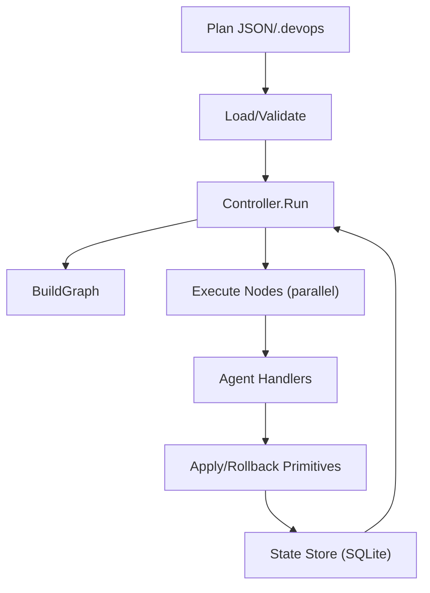

**Diagram sources**
- [main.go](file://cmd/devopsctl/main.go#L32-L87)
- [orchestrator.go](file://internal/controller/orchestrator.go#L34-L300)
- [store.go](file://internal/state/store.go#L33-L84)

### Infrastructure Requirements and Deployment Topology
- Controller host: Local machine running the CLI; requires filesystem access to plan files and SQLite state directory (~/.devopsctl/state.db).
- Agent hosts: Machines reachable by TCP on the configured port; must support the primitive operations (filesystem for filesync, shell for process.exec).
- Network: Low-latency connectivity between controller and agents; chunked file streaming benefits from reasonable bandwidth.
- Topology options:
  - Single-controller, multiple agents across zones for resilience.
  - Distributed agents per region with centralized controller.
  - Sidecar agents colocated with workloads for reduced latency.

[No sources needed since this section provides general guidance]

### Technology Stack
- Language: Go 1.18+
- CLI framework: Cobra
- State persistence: SQLite via go-sqlite3
- Protocol: Line-delimited JSON over TCP

**Section sources**
- [go.mod](file://go.mod#L3-L8)