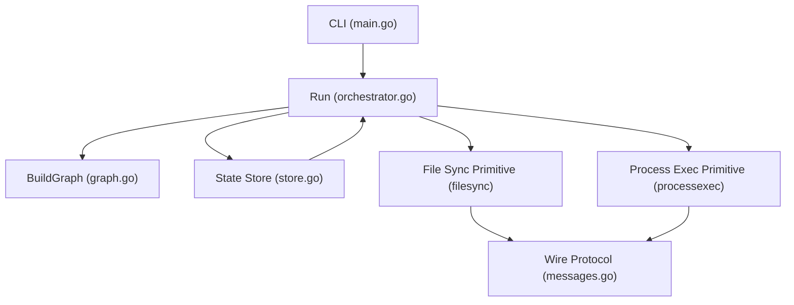
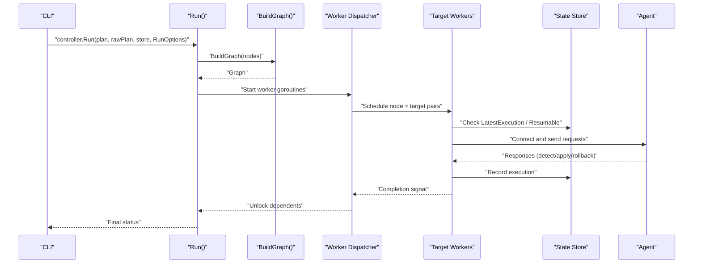
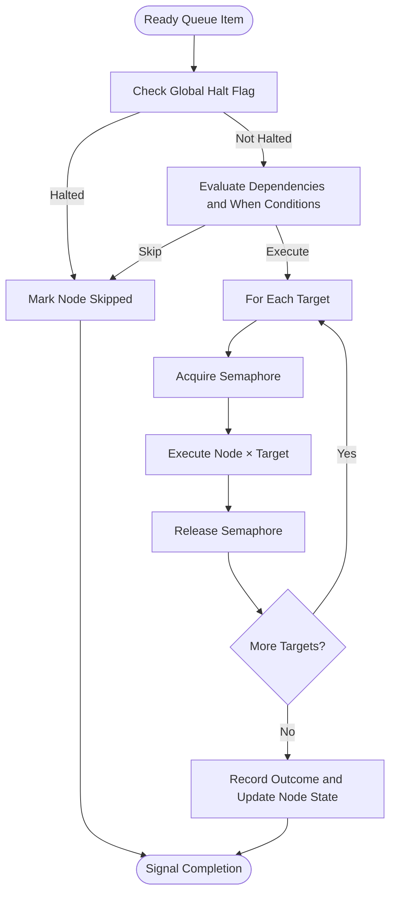
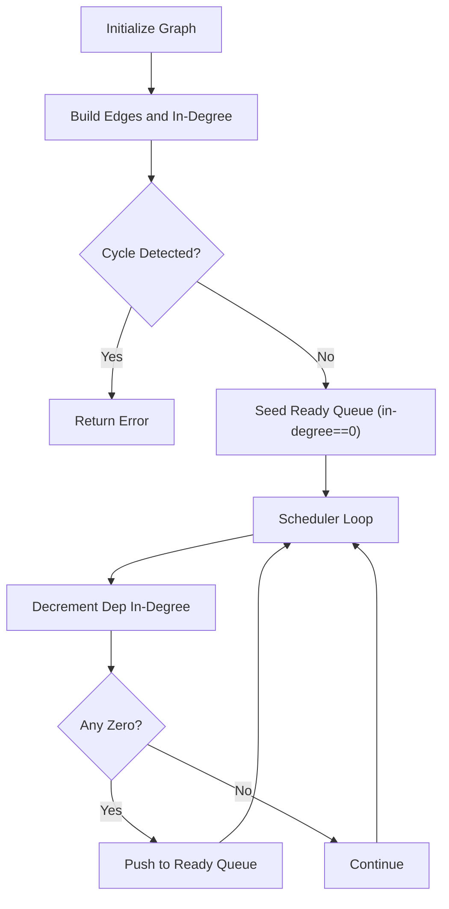
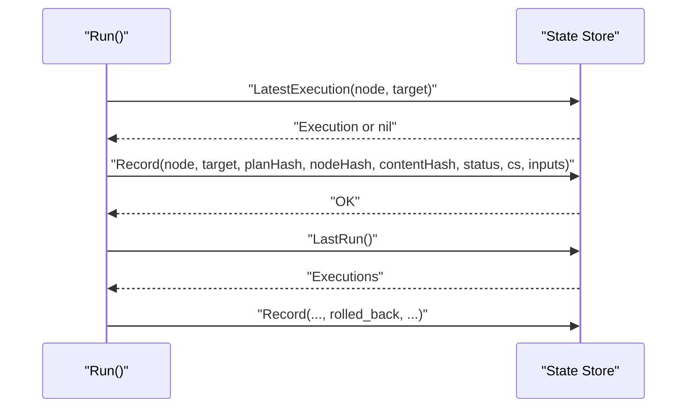
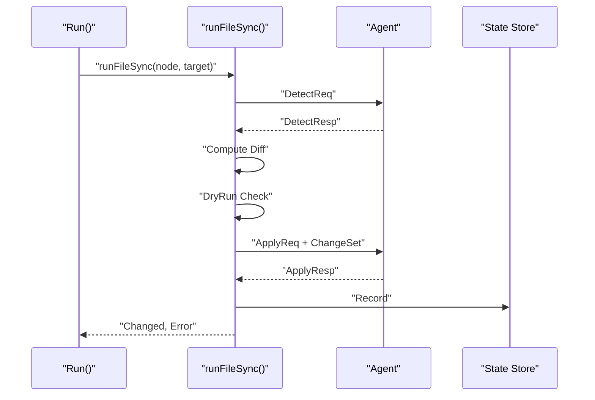
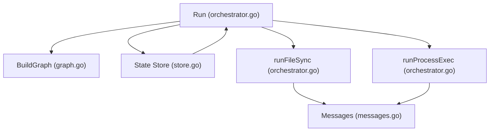

# Execution Control Flow and Worker Management

<cite>
**Referenced Files in This Document**
- [orchestrator.go](file://internal/controller/orchestrator.go)
- [graph.go](file://internal/controller/graph.go)
- [main.go](file://cmd/devopsctl/main.go)
- [store.go](file://internal/state/store.go)
- [schema.go](file://internal/plan/schema.go)
- [messages.go](file://internal/proto/messages.go)
- [detect.go](file://internal/primitive/filesync/detect.go)
- [processexec.go](file://internal/primitive/processexec/processexec.go)
- [plan_resume.devops](file://tests/e2e/plan_resume.devops)
- [plan_resume.json](file://tests/e2e/plan_resume.json)
</cite>

## Table of Contents
1. [Introduction](#introduction)
2. [Project Structure](#project-structure)
3. [Core Components](#core-components)
4. [Architecture Overview](#architecture-overview)
5. [Detailed Component Analysis](#detailed-component-analysis)
6. [Dependency Analysis](#dependency-analysis)
7. [Performance Considerations](#performance-considerations)
8. [Troubleshooting Guide](#troubleshooting-guide)
9. [Conclusion](#conclusion)

## Introduction
This document explains the execution control flow and worker management in the system. It focuses on the Run function, how execution options influence behavior, the worker dispatcher pattern, target-level concurrency control, and how the orchestrator coordinates with state management, primitive operations, and agent communication. It also covers common execution scenarios and their implementation patterns.

## Project Structure
The execution engine centers around the controller orchestrator, which builds an execution graph from the plan, schedules nodes using a worker dispatcher, and coordinates with state storage and agent primitives.

**Diagram sources**
- [main.go](file://cmd/devopsctl/main.go#L78-L82)
- [orchestrator.go](file://internal/controller/orchestrator.go#L35-L300)
- [graph.go](file://internal/controller/graph.go#L16-L47)
- [store.go](file://internal/state/store.go#L33-L61)
- [messages.go](file://internal/proto/messages.go#L14-L75)

**Section sources**
- [main.go](file://cmd/devopsctl/main.go#L27-L88)
- [orchestrator.go](file://internal/controller/orchestrator.go#L35-L300)
- [graph.go](file://internal/controller/graph.go#L16-L47)

## Core Components
- RunOptions: Controls execution behavior via DryRun, Parallelism, Resume, and Reconcile flags.
- Run: Orchestrates graph building, worker dispatch, target-level concurrency, and failure handling.
- Graph: Topologically sorted execution graph with dependency edges and in-degree counts.
- State Store: Append-only SQLite store for recording execution outcomes and enabling resume/reconcile.
- Primitive Operations: file.sync and process.exec handlers that communicate with agents or run locally.
- Wire Protocol: Line-delimited JSON messages exchanged between controller and agent.

**Section sources**
- [orchestrator.go](file://internal/controller/orchestrator.go#L26-L32)
- [orchestrator.go](file://internal/controller/orchestrator.go#L35-L300)
- [graph.go](file://internal/controller/graph.go#L9-L14)
- [store.go](file://internal/state/store.go#L17-L31)
- [messages.go](file://internal/proto/messages.go#L14-L75)

## Architecture Overview
The orchestrator converts a plan into a DAG, initializes execution state, and runs a worker dispatcher that schedules nodes based on readiness (in-degree zero). Each node is executed against all its targets concurrently up to a target-level semaphore. Results are persisted to state, and dependents are unlocked as prerequisites complete.

**Diagram sources**
- [main.go](file://cmd/devopsctl/main.go#L78-L82)
- [orchestrator.go](file://internal/controller/orchestrator.go#L35-L300)
- [graph.go](file://internal/controller/graph.go#L16-L47)
- [store.go](file://internal/state/store.go#L131-L160)
- [messages.go](file://internal/proto/messages.go#L16-L75)

## Detailed Component Analysis

### RunOptions and Their Impact
- DryRun: Skips actual changes and reports what would be applied.
- Parallelism: Maximum number of concurrent target executions; defaults to a safe upper bound when <= 0.
- Resume: Allows skipping nodes that were previously applied under the same plan hash.
- Reconcile: Treats nodes as reconciled if the last execution matched both plan and node hashes.

These options are passed into Run and influence early decisions in the worker loop, including resumable checks and dry-run behavior.

**Section sources**
- [orchestrator.go](file://internal/controller/orchestrator.go#L26-L32)
- [orchestrator.go](file://internal/controller/orchestrator.go#L37-L39)
- [orchestrator.go](file://internal/controller/orchestrator.go#L183-L197)
- [orchestrator.go](file://internal/controller/orchestrator.go#L212-L223)
- [main.go](file://cmd/devopsctl/main.go#L78-L82)
- [main.go](file://cmd/devopsctl/main.go#L138-L142)

### Run Function Implementation
Key steps:
- Compute plan hash from raw plan.
- Build a target map for quick lookup.
- Construct the execution graph and validate it is acyclic.
- Initialize node states, in-degree, and ready queue (nodes with in-degree zero).
- Create channels for progress signaling and a wait group for worker lifecycle.
- Start a dispatcher goroutine that:
  - Pulls ready node IDs from the ready queue.
  - Checks global halt flag and cascading skips (failed/blocked/skipped dependencies or when conditions).
  - Executes the node across all targets with target-level concurrency controlled by a semaphore.
  - Records results and updates node state.
  - Triggers rollback on failure if policy dictates.
  - Emits completion signals to unlock dependents.
- After all nodes complete, collect errors and return.

Concurrency and cancellation:
- Global context cancellation stops remaining target executions when a failure policy triggers halt or rollback.
- Target-level semaphore limits concurrent target executions per node.

**Section sources**
- [orchestrator.go](file://internal/controller/orchestrator.go#L35-L300)

### Worker Dispatcher Pattern and Target-Level Concurrency
- Dispatcher goroutine pulls nodes from the ready queue and spawns a worker goroutine per node.
- Each node worker iterates over its targets and launches a goroutine per target.
- A target-level semaphore enforces Parallelism across targets for a single node.
- Cancellation is respected by checking the context before each target execution.

**Diagram sources**
- [orchestrator.go](file://internal/controller/orchestrator.go#L84-L270)

**Section sources**
- [orchestrator.go](file://internal/controller/orchestrator.go#L80-L82)
- [orchestrator.go](file://internal/controller/orchestrator.go#L163-L171)
- [orchestrator.go](file://internal/controller/orchestrator.go#L169-L171)

### Graph Building and Scheduling
- BuildGraph constructs adjacency lists and in-degree counts, validates uniqueness of node IDs, and ensures no cycles via Kahn’s algorithm.
- The scheduler initializes in-degree copies and a ready queue with nodes having zero in-degree.
- As nodes finish, dependents’ in-degrees decrement; when zero, they are pushed onto the ready queue.

**Diagram sources**
- [graph.go](file://internal/controller/graph.go#L16-L47)
- [graph.go](file://internal/controller/graph.go#L50-L83)

**Section sources**
- [graph.go](file://internal/controller/graph.go#L16-L47)
- [graph.go](file://internal/controller/graph.go#L50-L83)
- [orchestrator.go](file://internal/controller/orchestrator.go#L61-L71)
- [orchestrator.go](file://internal/controller/orchestrator.go#L272-L290)

### Worker Lifecycle Management
- Dispatcher goroutines are tracked with a WaitGroup; they terminate when the ready queue is exhausted.
- Node workers spawn target goroutines; each target worker releases its semaphore slot upon completion.
- Context cancellation propagates to abort remaining target executions when a failure policy halts or rolls back.

**Section sources**
- [orchestrator.go](file://internal/controller/orchestrator.go#L74-L76)
- [orchestrator.go](file://internal/controller/orchestrator.go#L87-L89)
- [orchestrator.go](file://internal/controller/orchestrator.go#L168-L171)
- [orchestrator.go](file://internal/controller/orchestrator.go#L248-L251)

### Relationship Between Orchestrator and State Management
- The orchestrator consults the state store to determine resumability and reconciliation:
  - LatestExecution: most recent execution for a node×target pair.
  - LastSuccessful: last applied execution used to compare node hash for reconciliation.
- After each node×target execution, the orchestrator records the result with plan hash, node hash, content hash, status, and change set.
- RollbackLast uses the last run’s plan hash to roll back all successful file.sync nodes.

**Diagram sources**
- [orchestrator.go](file://internal/controller/orchestrator.go#L181-L197)
- [orchestrator.go](file://internal/controller/orchestrator.go#L212-L223)
- [orchestrator.go](file://internal/controller/orchestrator.go#L426-L428)
- [store.go](file://internal/state/store.go#L131-L160)
- [store.go](file://internal/state/store.go#L190-L225)

**Section sources**
- [orchestrator.go](file://internal/controller/orchestrator.go#L181-L197)
- [orchestrator.go](file://internal/controller/orchestrator.go#L212-L223)
- [orchestrator.go](file://internal/controller/orchestrator.go#L426-L428)
- [store.go](file://internal/state/store.go#L131-L160)
- [store.go](file://internal/state/store.go#L190-L225)

### Primitive Operations and Agent Communication
- file.sync:
  - Detects remote state via agent, computes local source tree, diffs, prints diff, and applies changes.
  - Streams file chunks to the agent and persists state with a content hash derived from the change set.
  - Supports rollback via a dedicated rollback request if the agent reports rollback-safe.
- process.exec:
  - Executes commands locally when not in dry-run mode.
  - Records execution results with status and exit code.

**Diagram sources**
- [orchestrator.go](file://internal/controller/orchestrator.go#L303-L311)
- [orchestrator.go](file://internal/controller/orchestrator.go#L313-L442)
- [messages.go](file://internal/proto/messages.go#L16-L75)
- [detect.go](file://internal/primitive/filesync/detect.go#L19-L70)
- [store.go](file://internal/state/store.go#L68-L84)

**Section sources**
- [orchestrator.go](file://internal/controller/orchestrator.go#L303-L311)
- [orchestrator.go](file://internal/controller/orchestrator.go#L313-L442)
- [messages.go](file://internal/proto/messages.go#L16-L75)
- [detect.go](file://internal/primitive/filesync/detect.go#L19-L70)
- [processexec.go](file://internal/primitive/processexec/processexec.go#L14-L82)

### Failure Handling and Policies
- Node-level failure policies:
  - halt: marks global halt, cancels remaining executions, and prevents new target executions.
  - rollback: triggers a global rollback after node failure.
  - continue: allows dependents to continue; failures cascade skip automatically.
- Default policy is halt when unspecified.

**Section sources**
- [orchestrator.go](file://internal/controller/orchestrator.go#L244-L252)
- [orchestrator.go](file://internal/controller/orchestrator.go#L257-L265)

### Common Execution Scenarios and Patterns
- Linear chain with dependencies:
  - Nodes depend on predecessors; the scheduler unlocks successors when prerequisites complete.
- Conditional execution:
  - When conditions evaluate whether a dependency changed; if not met, the node is skipped with a recorded status.
- Resume and Reconcile:
  - Resume uses plan hash and last-applied status to skip nodes.
  - Reconcile compares node hash to determine if the state is already up to date.
- Dry-run:
  - Reports changes without applying them; useful for previewing effects.

Examples from the codebase:
- Dependency chain in test plans demonstrates sequential execution and cascading skips on failure.
- CLI apply and reconcile commands show how RunOptions are constructed and passed to Run.

**Section sources**
- [orchestrator.go](file://internal/controller/orchestrator.go#L116-L123)
- [orchestrator.go](file://internal/controller/orchestrator.go#L183-L197)
- [orchestrator.go](file://internal/controller/orchestrator.go#L212-L223)
- [plan_resume.devops](file://tests/e2e/plan_resume.devops#L5-L42)
- [plan_resume.json](file://tests/e2e/plan_resume.json#L6-L34)
- [main.go](file://cmd/devopsctl/main.go#L78-L82)
- [main.go](file://cmd/devopsctl/main.go#L138-L142)

## Dependency Analysis
The orchestrator depends on:
- Graph construction for scheduling.
- State store for resumability and reconciliation.
- Primitive handlers for file synchronization and process execution.
- Wire protocol for agent communication.

**Diagram sources**
- [orchestrator.go](file://internal/controller/orchestrator.go#L35-L300)
- [graph.go](file://internal/controller/graph.go#L16-L47)
- [store.go](file://internal/state/store.go#L33-L61)
- [messages.go](file://internal/proto/messages.go#L14-L75)

**Section sources**
- [orchestrator.go](file://internal/controller/orchestrator.go#L35-L300)
- [graph.go](file://internal/controller/graph.go#L16-L47)
- [store.go](file://internal/state/store.go#L33-L61)
- [messages.go](file://internal/proto/messages.go#L14-L75)

## Performance Considerations
- Target-level concurrency via semaphore controls resource usage per node; tune Parallelism to balance throughput and stability.
- Streaming file chunks reduces memory overhead during apply operations.
- Using state to resume or reconcile avoids unnecessary work on unchanged nodes.
- Avoid excessive logging in hot paths; keep print statements scoped to informative diagnostics.

## Troubleshooting Guide
- Cycle detection errors: Ensure the plan does not introduce circular dependencies; BuildGraph detects cycles.
- Connection failures to agents: Verify agent addresses and ports; the orchestrator appends a default port if missing.
- State inconsistencies: Use state list to inspect recent executions and diagnose unexpected statuses.
- Rollback issues: Confirm rollback-safe reporting from agents and ensure the last run plan hash matches expectations.

**Section sources**
- [graph.go](file://internal/controller/graph.go#L42-L83)
- [orchestrator.go](file://internal/controller/orchestrator.go#L600-L606)
- [store.go](file://internal/state/store.go#L162-L188)
- [orchestrator.go](file://internal/controller/orchestrator.go#L554-L583)

## Conclusion
The execution engine combines a topological scheduler, a worker dispatcher with target-level concurrency control, and robust state management to deliver reliable, resumable, and reconcilable deployments. RunOptions provide fine-grained control over behavior, while primitive handlers and the wire protocol enable seamless coordination with agents. The design supports common scenarios like linear chains, conditional execution, and safe recovery through rollback and resume.