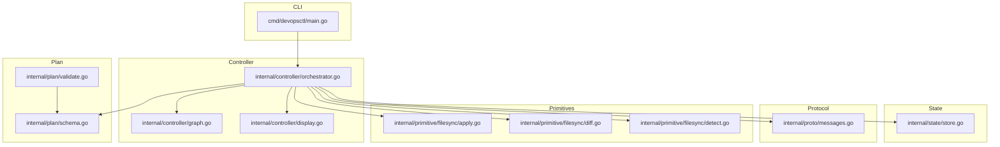
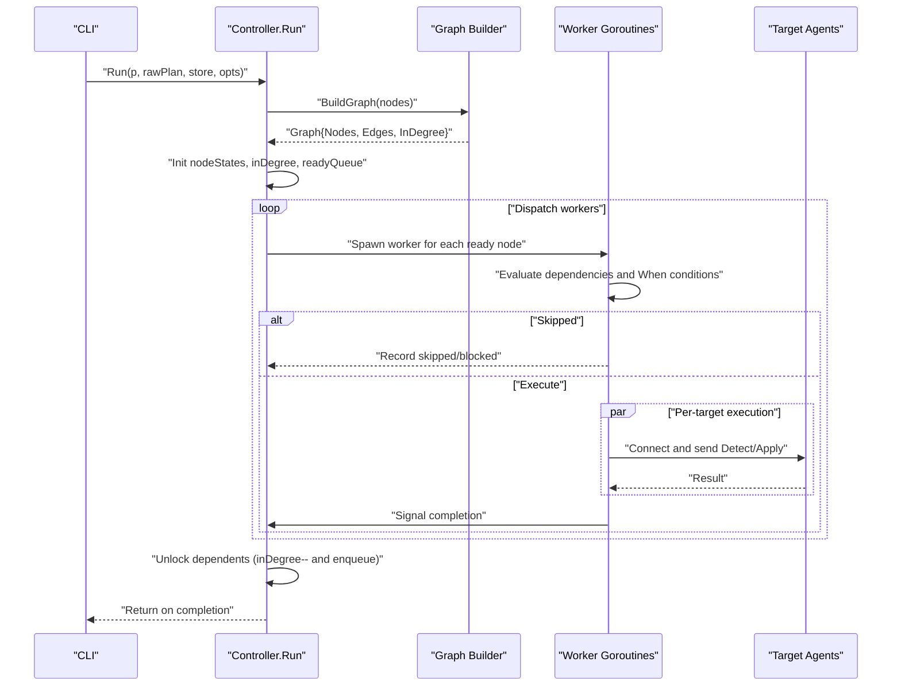
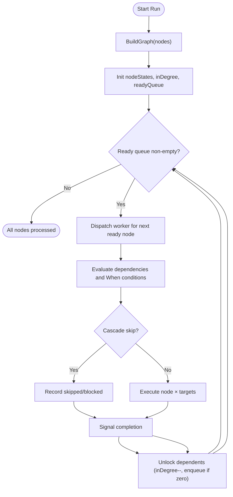
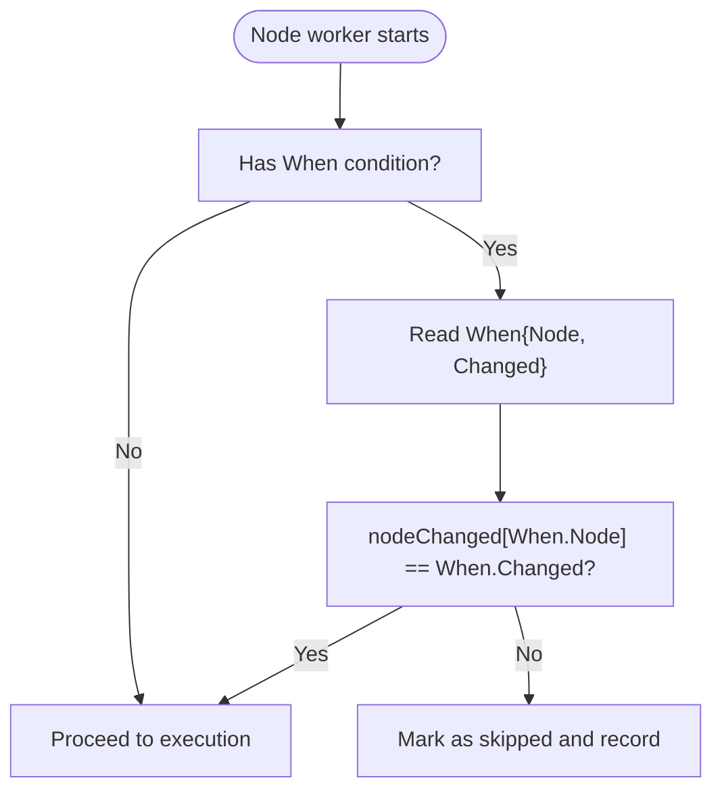
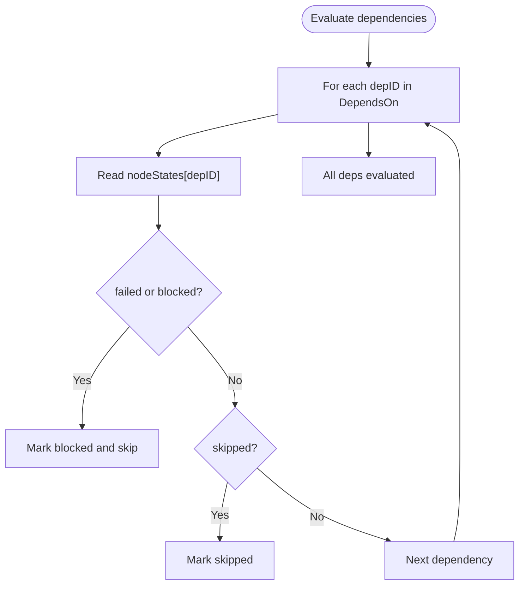
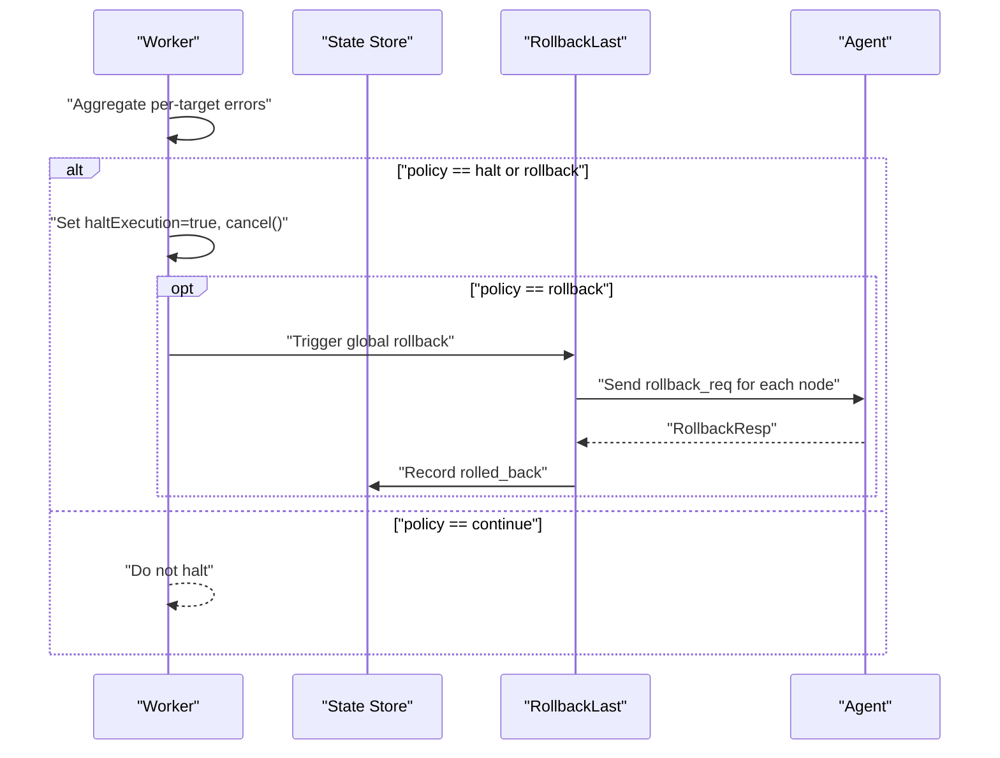
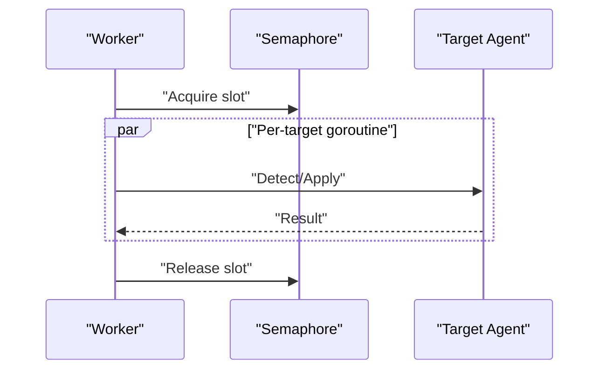
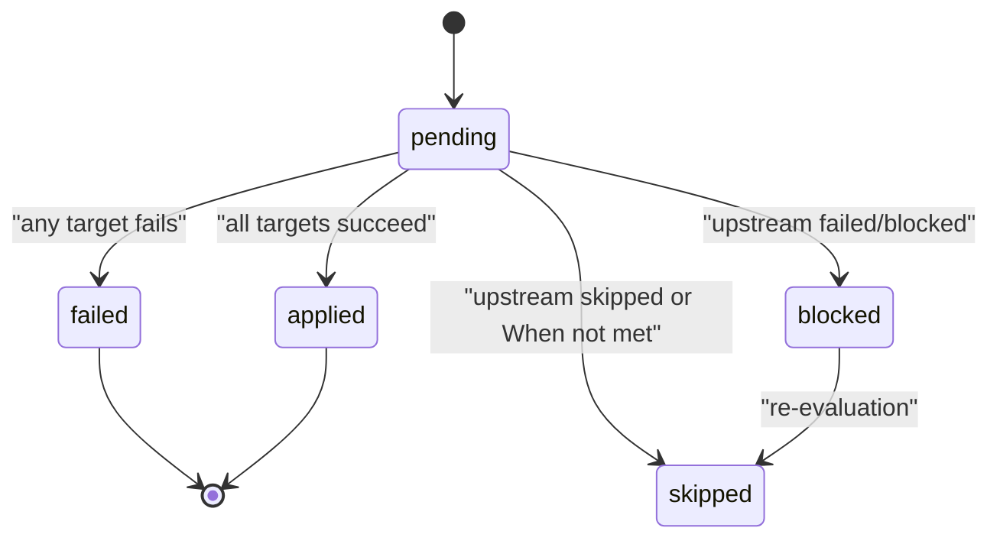
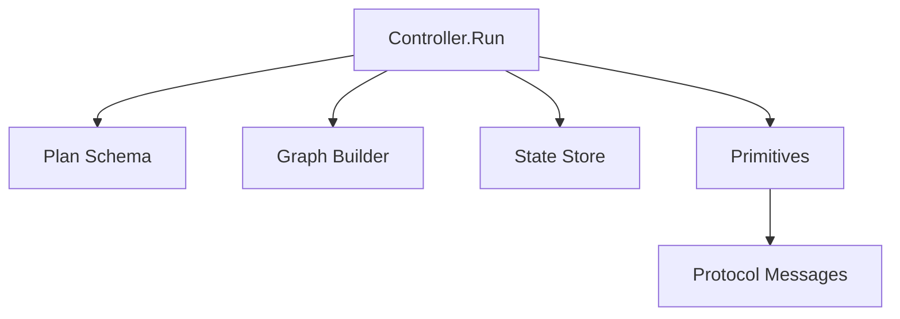

# Node Execution Coordination and Dependency Resolution

<cite>
**Referenced Files in This Document**
- [orchestrator.go](file://internal/controller/orchestrator.go)
- [graph.go](file://internal/controller/graph.go)
- [schema.go](file://internal/plan/schema.go)
- [store.go](file://internal/state/store.go)
- [messages.go](file://internal/proto/messages.go)
- [display.go](file://internal/controller/display.go)
- [apply.go](file://internal/primitive/filesync/apply.go)
- [diff.go](file://internal/primitive/filesync/diff.go)
- [detect.go](file://internal/primitive/filesync/detect.go)
- [main.go](file://cmd/devopsctl/main.go)
</cite>

## Table of Contents
1. [Introduction](#introduction)
2. [Project Structure](#project-structure)
3. [Core Components](#core-components)
4. [Architecture Overview](#architecture-overview)
5. [Detailed Component Analysis](#detailed-component-analysis)
6. [Dependency Analysis](#dependency-analysis)
7. [Performance Considerations](#performance-considerations)
8. [Troubleshooting Guide](#troubleshooting-guide)
9. [Conclusion](#conclusion)

## Introduction
This document explains how the orchestrator coordinates node execution across multiple targets, manages concurrency via a target-level semaphore, resolves dependencies using in-degree counting and a ready queue, and enforces conditional execution with When clauses. It also covers cascade skipping behavior, failure propagation, and the lifecycle of node states (pending, applied, failed, blocked, skipped) during execution.

## Project Structure
The orchestrator composes several subsystems:
- Plan model and validation define nodes, targets, and constraints.
- Graph construction builds a dependency DAG and validates acyclicity.
- The controller’s Run function schedules and executes nodes with concurrency control.
- State persistence records outcomes per node-target pair.
- Protocol messages define the wire format for agent communication.
- Primitive implementations (filesync/process.exec) implement the actual work.

**Diagram sources**
- [main.go](file://cmd/devopsctl/main.go#L32-L83)
- [orchestrator.go](file://internal/controller/orchestrator.go#L35-L300)
- [graph.go](file://internal/controller/graph.go#L16-L47)
- [schema.go](file://internal/plan/schema.go#L11-L39)
- [store.go](file://internal/state/store.go#L33-L84)
- [messages.go](file://internal/proto/messages.go#L14-L75)
- [display.go](file://internal/controller/display.go#L18-L43)
- [apply.go](file://internal/primitive/filesync/apply.go#L19-L204)
- [diff.go](file://internal/primitive/filesync/diff.go#L16-L66)
- [detect.go](file://internal/primitive/filesync/detect.go#L19-L69)

**Section sources**
- [main.go](file://cmd/devopsctl/main.go#L32-L83)
- [orchestrator.go](file://internal/controller/orchestrator.go#L35-L300)
- [graph.go](file://internal/controller/graph.go#L16-L47)
- [schema.go](file://internal/plan/schema.go#L11-L39)
- [store.go](file://internal/state/store.go#L33-L84)
- [messages.go](file://internal/proto/messages.go#L14-L75)
- [display.go](file://internal/controller/display.go#L18-L43)
- [apply.go](file://internal/primitive/filesync/apply.go#L19-L204)
- [diff.go](file://internal/primitive/filesync/diff.go#L16-L66)
- [detect.go](file://internal/primitive/filesync/detect.go#L19-L69)

## Core Components
- Orchestrator Run: Builds the execution graph, initializes node states and in-degree counts, seeds a ready queue, and launches workers that coordinate target-level concurrency and dependency resolution.
- Graph builder: Constructs adjacency lists and in-degree counts, validates acyclicity using Kahn’s algorithm.
- Node execution: Handles per-(node × target) execution, including resume/reconcile checks, conditional evaluation, and primitive-specific apply logic.
- State store: Records execution outcomes per node-target pair, enabling resume and reconcile semantics.
- Protocol: Defines detect/apply/rollback messages exchanged with agents.

Key runtime structures:
- nodeStates: Tracks pending/applied/failed/blocked/skipped per node.
- inDegree: Tracks number of unresolved dependencies per node.
- readyQueue: Channel of node IDs whose dependencies have resolved.
- sem: Target-level semaphore controlling max concurrent target executions.

**Section sources**
- [orchestrator.go](file://internal/controller/orchestrator.go#L35-L300)
- [graph.go](file://internal/controller/graph.go#L16-L47)
- [schema.go](file://internal/plan/schema.go#L24-L39)
- [store.go](file://internal/state/store.go#L68-L84)
- [messages.go](file://internal/proto/messages.go#L16-L41)

## Architecture Overview
The orchestrator transforms a plan into a dependency graph and executes nodes in topological order while respecting:
- Node-level dependencies (DependsOn)
- Conditional execution (When clause)
- Failure policies (halt, continue, rollback)
- Concurrency limits (global parallelism)
- Per-target concurrency via a semaphore

**Diagram sources**
- [main.go](file://cmd/devopsctl/main.go#L78-L82)
- [orchestrator.go](file://internal/controller/orchestrator.go#L35-L300)
- [graph.go](file://internal/controller/graph.go#L16-L47)
- [messages.go](file://internal/proto/messages.go#L16-L41)

## Detailed Component Analysis

### Dependency Resolution and Ready Queue Management
- BuildGraph populates Nodes, Edges, and InDegree, then validates acyclicity using Kahn’s algorithm.
- Run initializes inDegree and readyQueue with nodes having zero in-degree.
- After a node completes, the orchestrator decrements in-degree for each dependent and enqueues when it reaches zero.

**Diagram sources**
- [graph.go](file://internal/controller/graph.go#L16-L47)
- [orchestrator.go](file://internal/controller/orchestrator.go#L61-L71)
- [orchestrator.go](file://internal/controller/orchestrator.go#L272-L290)

**Section sources**
- [graph.go](file://internal/controller/graph.go#L16-L47)
- [graph.go](file://internal/controller/graph.go#L50-L83)
- [orchestrator.go](file://internal/controller/orchestrator.go#L61-L71)
- [orchestrator.go](file://internal/controller/orchestrator.go#L272-L290)

### Conditional Execution with When Clauses
- When a node has a When condition, the worker checks whether the referenced dependency changed as specified. If not, the node is cascade-skipped.
- The orchestrator tracks nodeChanged per node to evaluate the condition.

**Diagram sources**
- [orchestrator.go](file://internal/controller/orchestrator.go#L116-L123)
- [schema.go](file://internal/plan/schema.go#L35-L39)

**Section sources**
- [orchestrator.go](file://internal/controller/orchestrator.go#L116-L123)
- [schema.go](file://internal/plan/schema.go#L35-L39)

### Cascade Skipping Behavior and Blocked Nodes
- If any dependency is failed or blocked, the node is marked blocked.
- If any dependency is skipped, the node is marked skipped.
- Blocked nodes are recorded with a distinct status to differentiate from skipped.

**Diagram sources**
- [orchestrator.go](file://internal/controller/orchestrator.go#L101-L114)

**Section sources**
- [orchestrator.go](file://internal/controller/orchestrator.go#L101-L114)

### Failure Propagation and Policies
- On node-level errors, the orchestrator sets node state to failed and applies failure policy:
  - halt: cancels remaining executions and halts further progress.
  - rollback: triggers a global rollback of the last run.
  - continue: continues execution; dependents still cascade skip automatically.
- RollbackLast replays rollback requests for nodes in the last run.

**Diagram sources**
- [orchestrator.go](file://internal/controller/orchestrator.go#L244-L265)
- [store.go](file://internal/state/store.go#L190-L225)
- [messages.go](file://internal/proto/messages.go#L35-L41)

**Section sources**
- [orchestrator.go](file://internal/controller/orchestrator.go#L244-L265)
- [store.go](file://internal/state/store.go#L190-L225)
- [messages.go](file://internal/proto/messages.go#L35-L41)

### Target-Level Semaphore and Concurrent Execution Patterns
- A channel-based semaphore controls the number of concurrently executing target tasks per node.
- For each target, the worker dials the agent, performs detect/apply, streams file chunks if needed, and records state.
- The semaphore ensures that even though multiple nodes may be ready, only up to Parallelism targets execute simultaneously.

**Diagram sources**
- [orchestrator.go](file://internal/controller/orchestrator.go#L169-L171)
- [orchestrator.go](file://internal/controller/orchestrator.go#L180-L237)

**Section sources**
- [orchestrator.go](file://internal/controller/orchestrator.go#L169-L171)
- [orchestrator.go](file://internal/controller/orchestrator.go#L180-L237)

### Node States and Their Lifecycle
- pending: initial state until placed on the ready queue.
- applied: successful completion of all targets.
- failed: at least one target failed; handled per failure policy.
- blocked: skipped due to a failed/blocked upstream dependency.
- skipped: skipped due to a skipped upstream dependency or a When condition not met.

**Diagram sources**
- [orchestrator.go](file://internal/controller/orchestrator.go#L54-L59)
- [orchestrator.go](file://internal/controller/orchestrator.go#L126-L134)
- [orchestrator.go](file://internal/controller/orchestrator.go#L242-L255)

**Section sources**
- [orchestrator.go](file://internal/controller/orchestrator.go#L54-L59)
- [orchestrator.go](file://internal/controller/orchestrator.go#L126-L134)
- [orchestrator.go](file://internal/controller/orchestrator.go#L242-L255)

### Concrete Examples from the Codebase
- Example plan fragments demonstrate nodes with targets and primitives:
  - file.sync node with src and dest inputs.
  - process.exec node with cmd and cwd inputs.
- These nodes are scheduled and executed by the orchestrator according to dependencies and concurrency limits.

**Section sources**
- [plan.devops](file://plan.devops#L5-L11)
- [plan.json](file://plan.json#L4-L22)

## Dependency Analysis
The orchestrator’s execution pipeline depends on:
- Plan schema for node and target definitions.
- Graph builder for dependency validation and topology.
- State store for persistence and resume/reconcile.
- Protocol messages for agent communication.
- Primitive implementations for actual work.

**Diagram sources**
- [orchestrator.go](file://internal/controller/orchestrator.go#L35-L300)
- [schema.go](file://internal/plan/schema.go#L11-L39)
- [graph.go](file://internal/controller/graph.go#L16-L47)
- [store.go](file://internal/state/store.go#L33-L84)
- [messages.go](file://internal/proto/messages.go#L14-L75)
- [apply.go](file://internal/primitive/filesync/apply.go#L19-L204)

**Section sources**
- [orchestrator.go](file://internal/controller/orchestrator.go#L35-L300)
- [schema.go](file://internal/plan/schema.go#L11-L39)
- [graph.go](file://internal/controller/graph.go#L16-L47)
- [store.go](file://internal/state/store.go#L33-L84)
- [messages.go](file://internal/proto/messages.go#L14-L75)
- [apply.go](file://internal/primitive/filesync/apply.go#L19-L204)

## Performance Considerations
- Global parallelism: Controls maximum concurrent node executions; default is 10 when unset.
- Target-level concurrency: Semaphore ensures bounded concurrency per node across targets.
- Resume and reconcile: Avoid redundant work by checking prior executions and change sets.
- Streaming file transfers: Minimizes memory usage when applying file changes.

Recommendations:
- Tune parallelism based on network and agent capacity.
- Prefer reconcile mode to avoid unnecessary applies when state is already aligned.
- Monitor logs for cascade skips and blocked nodes to optimize dependency ordering.

**Section sources**
- [orchestrator.go](file://internal/controller/orchestrator.go#L27-L32)
- [orchestrator.go](file://internal/controller/orchestrator.go#L180-L237)
- [store.go](file://internal/state/store.go#L131-L160)

## Troubleshooting Guide
Common issues and diagnostics:
- Cycle detected in dependencies: Indicates invalid plan with circular DependsOn.
- Unknown target or node in dependencies: Plan validation catches references to undefined targets/nodes.
- Unsupported primitive type: runNode returns an error for unknown node types.
- Agent connectivity failures: runFileSync/runProcessExec report connection and response errors.
- Partial or failed apply: Result includes status and messages; rollback may be triggered depending on policy and agent capability.

Actions:
- Validate plan before execution.
- Inspect state store for recent statuses and change sets.
- Use reconcile mode to align state without re-applying unchanged resources.
- Review logs for cascade skips and blocked nodes to adjust dependencies.

**Section sources**
- [graph.go](file://internal/controller/graph.go#L42-L83)
- [schema.go](file://internal/plan/schema.go#L53-L67)
- [orchestrator.go](file://internal/controller/orchestrator.go#L302-L311)
- [messages.go](file://internal/proto/messages.go#L53-L75)
- [store.go](file://internal/state/store.go#L131-L160)

## Conclusion
The orchestrator implements robust, topologically ordered execution with strong dependency handling, conditional logic, and resilient failure policies. Its use of in-degree counting, a ready queue, and a target-level semaphore enables efficient parallelism while preserving correctness. Combined with state persistence and primitive-specific apply logic, it supports safe, repeatable, and observable infrastructure automation.