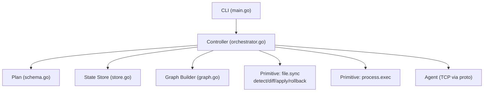
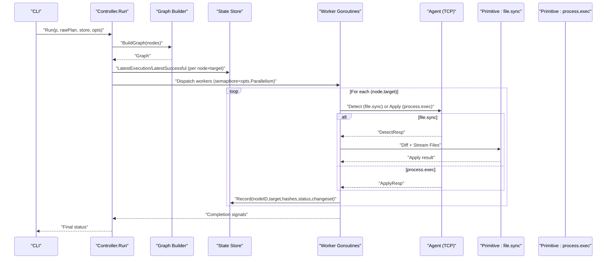
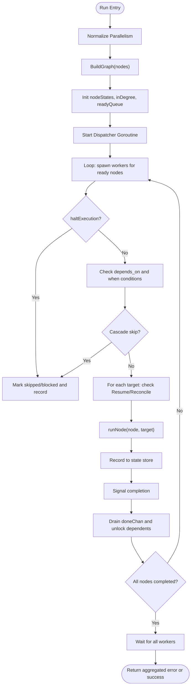
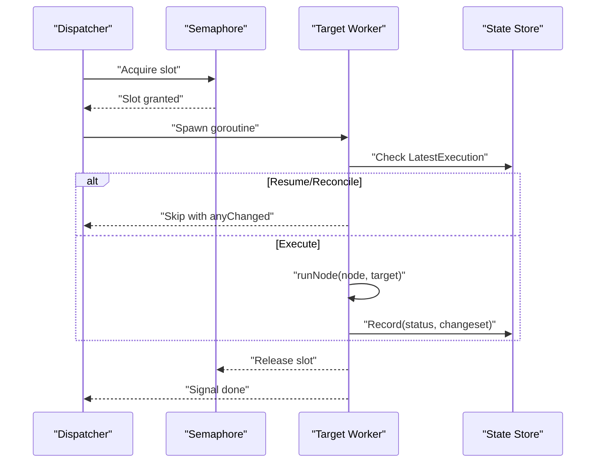
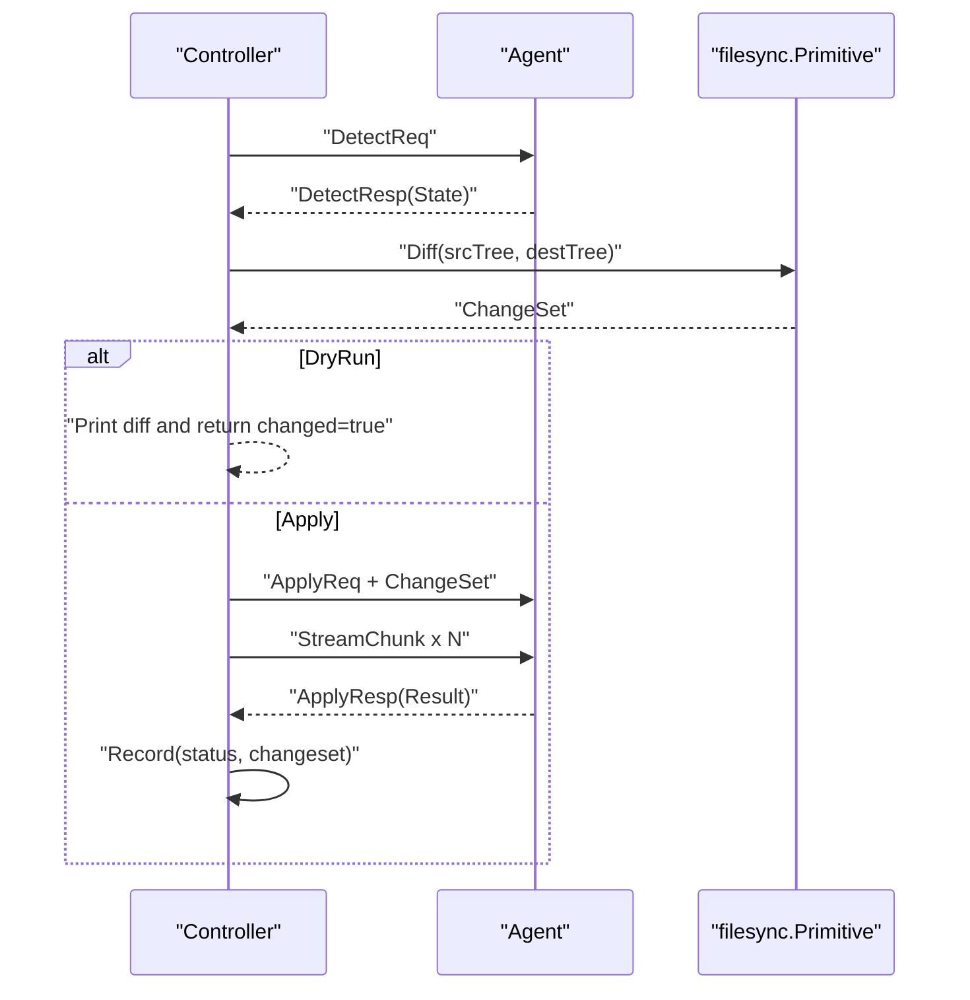
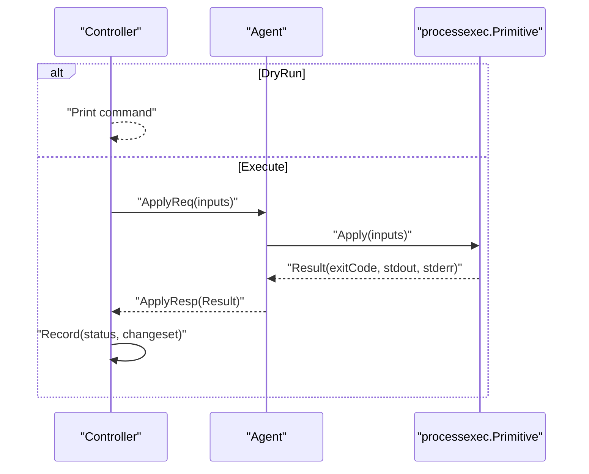
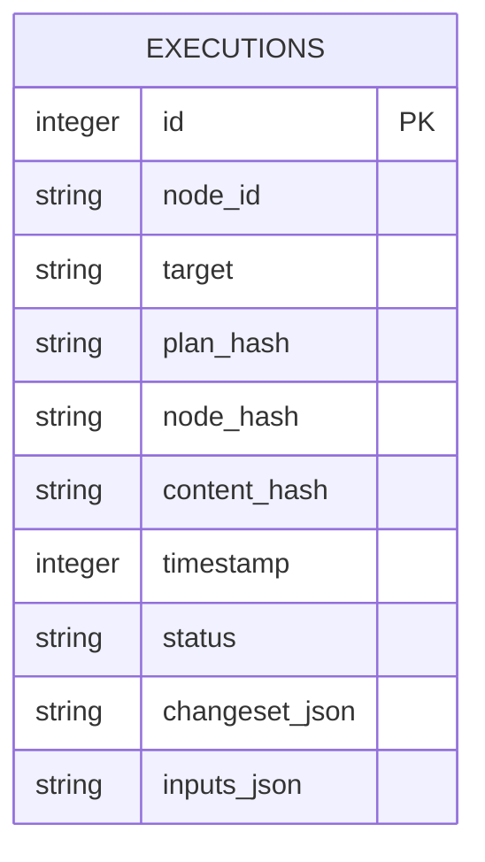
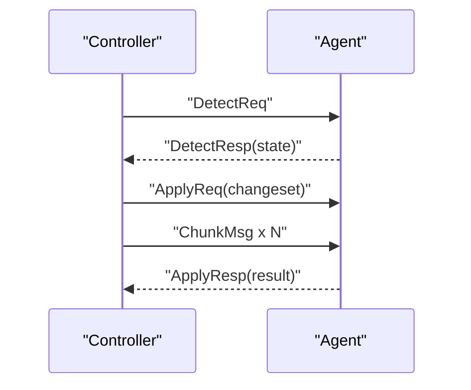
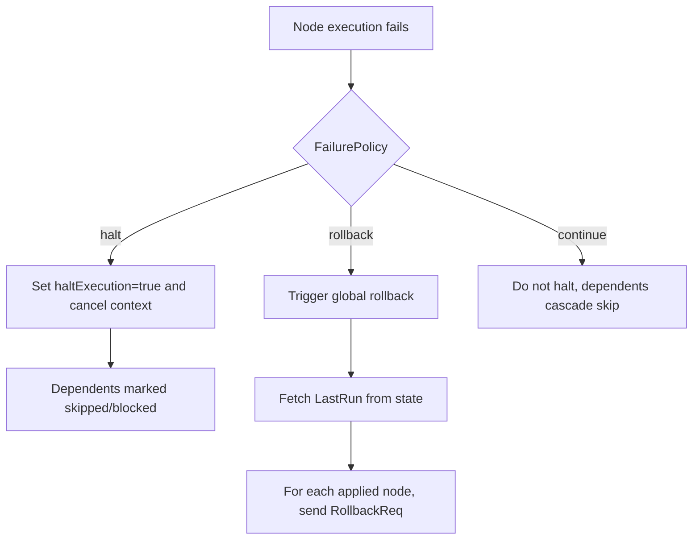
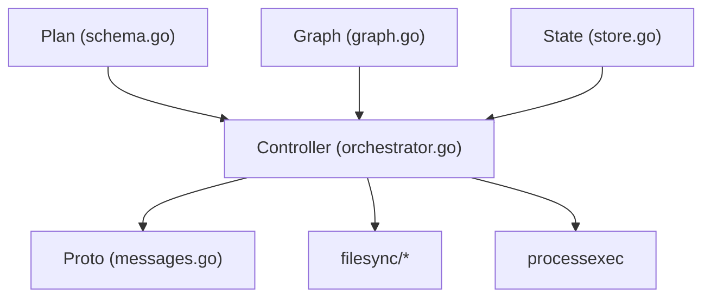

# Orchestrator Design and Control Flow

<cite>
**Referenced Files in This Document**
- [orchestrator.go](file://internal/controller/orchestrator.go)
- [graph.go](file://internal/controller/graph.go)
- [store.go](file://internal/state/store.go)
- [schema.go](file://internal/plan/schema.go)
- [messages.go](file://internal/proto/messages.go)
- [processexec.go](file://internal/primitive/processexec/processexec.go)
- [detect.go](file://internal/primitive/filesync/detect.go)
- [diff.go](file://internal/primitive/filesync/diff.go)
- [apply.go](file://internal/primitive/filesync/apply.go)
- [rollback.go](file://internal/primitive/filesync/rollback.go)
- [main.go](file://cmd/devopsctl/main.go)
- [plan_resume.devops](file://tests/e2e/plan_resume.devops)
- [plan_resume.json](file://tests/e2e/plan_resume.json)
</cite>

## Table of Contents
1. [Introduction](#introduction)
2. [Project Structure](#project-structure)
3. [Core Components](#core-components)
4. [Architecture Overview](#architecture-overview)
5. [Detailed Component Analysis](#detailed-component-analysis)
6. [Dependency Analysis](#dependency-analysis)
7. [Performance Considerations](#performance-considerations)
8. [Troubleshooting Guide](#troubleshooting-guide)
9. [Conclusion](#conclusion)
10. [Appendices](#appendices)

## Introduction
This document explains the orchestrator design and control flow for the execution engine. It focuses on the Run function implementation, execution options configuration, and the end-to-end control flow from plan loading through execution completion. It documents the RunOptions struct, the main execution loop, worker goroutine management, and coordination among state management, primitive operations, and agent communication. Concrete examples are included to illustrate node execution, target distribution, and termination conditions.

## Project Structure
The orchestrator lives in the controller package and integrates with plan parsing, state persistence, and primitives for file synchronization and process execution. The CLI wires up options and invokes the orchestrator.

**Diagram sources**
- [main.go](file://cmd/devopsctl/main.go#L32-L87)
- [orchestrator.go](file://internal/controller/orchestrator.go#L34-L300)
- [schema.go](file://internal/plan/schema.go#L11-L39)
- [store.go](file://internal/state/store.go#L33-L61)
- [graph.go](file://internal/controller/graph.go#L16-L48)
- [messages.go](file://internal/proto/messages.go#L14-L75)

**Section sources**
- [main.go](file://cmd/devopsctl/main.go#L32-L87)
- [orchestrator.go](file://internal/controller/orchestrator.go#L34-L300)
- [schema.go](file://internal/plan/schema.go#L11-L39)
- [store.go](file://internal/state/store.go#L33-L61)
- [graph.go](file://internal/controller/graph.go#L16-L48)
- [messages.go](file://internal/proto/messages.go#L14-L75)

## Core Components
- RunOptions: Controls execution behavior via DryRun, Parallelism, Resume, and Reconcile flags.
- Run: Top-level orchestration function that builds the execution graph, initializes state, and coordinates workers.
- Graph: Directed acyclic dependency graph built from plan nodes with cycle detection.
- State Store: SQLite-backed append-only log of executions with plan/node hashing for idempotency.
- Primitives: file.sync and process.exec implementations for agent communication and local execution.
- CLI: Applies flags to RunOptions and delegates execution.

Key responsibilities:
- BuildGraph validates dependencies and prepares in-degree counts and adjacency lists.
- Run initializes node states, ready queue, worker dispatcher, and concurrency limiter.
- runNode dispatches to primitive-specific handlers per node type.
- runFileSync and runProcessExec manage agent communication and local execution respectively.
- RollbackLast supports global rollback of the last run.

**Section sources**
- [orchestrator.go](file://internal/controller/orchestrator.go#L26-L32)
- [orchestrator.go](file://internal/controller/orchestrator.go#L34-L300)
- [graph.go](file://internal/controller/graph.go#L16-L83)
- [store.go](file://internal/state/store.go#L33-L84)
- [messages.go](file://internal/proto/messages.go#L14-L75)
- [processexec.go](file://internal/primitive/processexec/processexec.go#L13-L82)
- [detect.go](file://internal/primitive/filesync/detect.go#L19-L70)
- [diff.go](file://internal/primitive/filesync/diff.go#L7-L67)
- [apply.go](file://internal/primitive/filesync/apply.go#L19-L204)
- [rollback.go](file://internal/primitive/filesync/rollback.go#L11-L82)
- [main.go](file://cmd/devopsctl/main.go#L32-L87)

## Architecture Overview
The orchestrator converts a plan into a DAG, then schedules nodes respecting dependencies and concurrency limits. Each node is executed against each of its targets. For each (node × target) pair, the orchestrator decides whether to skip/resume/reconcile, then executes the primitive and records state.

**Diagram sources**
- [orchestrator.go](file://internal/controller/orchestrator.go#L34-L300)
- [graph.go](file://internal/controller/graph.go#L16-L48)
- [store.go](file://internal/state/store.go#L131-L160)
- [messages.go](file://internal/proto/messages.go#L16-L75)
- [detect.go](file://internal/primitive/filesync/detect.go#L19-L70)
- [diff.go](file://internal/primitive/filesync/diff.go#L7-L67)
- [apply.go](file://internal/primitive/filesync/apply.go#L19-L204)
- [processexec.go](file://internal/primitive/processexec/processexec.go#L13-L82)

## Detailed Component Analysis

### RunOptions and Execution Behavior
- DryRun: Skips actual apply; prints diffs or indicates commands would run.
- Parallelism: Concurrency limit for (node × target) executions; defaults to 10 when <= 0.
- Resume: Allows skipping previously-applied nodes if plan and node hashes match and previous status was applied.
- Reconcile: Marks nodes as up-to-date if the last execution had matching plan/node hashes and status applied.

These flags influence early exits and state decisions within the worker loop and per-target execution.

**Section sources**
- [orchestrator.go](file://internal/controller/orchestrator.go#L26-L32)
- [orchestrator.go](file://internal/controller/orchestrator.go#L183-L223)
- [store.go](file://internal/state/store.go#L100-L160)

### Run Function Implementation and Control Flow
High-level steps:
1. Compute plan hash and normalize Parallelism.
2. Build target map and execution graph; validate acyclicity.
3. Initialize node states, in-degree, and ready queue.
4. Set up channels for progress tracking and a WaitGroup for workers.
5. Start a dispatcher goroutine that:
   - Respects haltExecution and failure policy.
   - Checks dependencies and when conditions.
   - Executes runNode for each target in parallel with a semaphore.
   - Records outcomes and cascades skips/blocks.
6. Main loop drains doneChan, unlocks dependents, and continues until all nodes complete.
7. Aggregate errors and return.

**Diagram sources**
- [orchestrator.go](file://internal/controller/orchestrator.go#L34-L300)
- [graph.go](file://internal/controller/graph.go#L16-L83)
- [store.go](file://internal/state/store.go#L68-L84)

**Section sources**
- [orchestrator.go](file://internal/controller/orchestrator.go#L34-L300)

### Worker Goroutine Management
- Semaphore: Limits concurrent target executions per node according to Parallelism.
- Target-level WaitGroup: Ensures all targets for a node are processed before marking node complete.
- Mutex-protected shared state: nodeStates, nodeChanged, haltExecution, and accumulated errors.
- Context cancellation: Stops further target executions when a failure policy halts.

**Diagram sources**
- [orchestrator.go](file://internal/controller/orchestrator.go#L84-L270)
- [store.go](file://internal/state/store.go#L131-L160)

**Section sources**
- [orchestrator.go](file://internal/controller/orchestrator.go#L84-L270)

### Primitive Operations: file.sync
The file.sync primitive follows a detect-diff-apply cycle:
- Detect: Agent reports current destination state.
- Diff: Controller computes ChangeSet from source and destination trees.
- Stream: Controller streams file chunks to the agent.
- Apply: Agent writes files atomically and applies metadata; snapshots are created for rollback.
- Record: Orchestrator persists status and changeset.

**Diagram sources**
- [orchestrator.go](file://internal/controller/orchestrator.go#L313-L442)
- [messages.go](file://internal/proto/messages.go#L16-L75)
- [detect.go](file://internal/primitive/filesync/detect.go#L19-L70)
- [diff.go](file://internal/primitive/filesync/diff.go#L7-L67)
- [apply.go](file://internal/primitive/filesync/apply.go#L19-L204)
- [store.go](file://internal/state/store.go#L68-L84)

**Section sources**
- [orchestrator.go](file://internal/controller/orchestrator.go#L313-L442)
- [detect.go](file://internal/primitive/filesync/detect.go#L19-L70)
- [diff.go](file://internal/primitive/filesync/diff.go#L7-L67)
- [apply.go](file://internal/primitive/filesync/apply.go#L19-L204)
- [messages.go](file://internal/proto/messages.go#L16-L75)

### Primitive Operations: process.exec
The process.exec primitive executes commands locally or remotely depending on the node’s target and implementation:
- DryRun: Prints the command that would be executed.
- Apply: Sends inputs to agent; agent executes locally and returns result with exit code and logs.
- Record: Orchestrator persists status and marks success/applied.

**Diagram sources**
- [orchestrator.go](file://internal/controller/orchestrator.go#L444-L513)
- [processexec.go](file://internal/primitive/processexec/processexec.go#L13-L82)
- [messages.go](file://internal/proto/messages.go#L25-L67)
- [store.go](file://internal/state/store.go#L68-L84)

**Section sources**
- [orchestrator.go](file://internal/controller/orchestrator.go#L444-L513)
- [processexec.go](file://internal/primitive/processexec/processexec.go#L13-L82)

### State Management and Idempotency
- PlanHash: SHA-256 of the raw plan JSON; used to identify runs.
- NodeHash: SHA-256 of node type, target, and inputs; identifies unique execution units.
- LatestExecution: Most recent execution for a node×target; used for Resume.
- LastSuccessful: Last applied execution for idempotency checks.
- Record: Append-only logging of execution outcomes.

**Diagram sources**
- [store.go](file://internal/state/store.go#L17-L31)
- [store.go](file://internal/state/store.go#L68-L84)
- [schema.go](file://internal/plan/schema.go#L54-L76)

**Section sources**
- [store.go](file://internal/state/store.go#L17-L84)
- [schema.go](file://internal/plan/schema.go#L54-L76)

### Agent Communication Protocol
The controller and agent exchange line-delimited JSON messages:
- DetectReq/DetectResp: Discover destination state.
- ApplyReq/ApplyResp: Request application with ChangeSet and stream file chunks.
- RollbackReq/RollbackResp: Request rollback of last apply.

**Diagram sources**
- [messages.go](file://internal/proto/messages.go#L16-L75)
- [orchestrator.go](file://internal/controller/orchestrator.go#L324-L408)

**Section sources**
- [messages.go](file://internal/proto/messages.go#L16-L75)
- [orchestrator.go](file://internal/controller/orchestrator.go#L324-L408)

### Failure Handling and Rollback
- FailurePolicy: halt, continue, or rollback.
- halt/rollback: Sets haltExecution and cancels context; subsequent nodes skip automatically.
- Global rollback: RollbackLast queries the last run and issues rollback requests to agents.

**Diagram sources**
- [orchestrator.go](file://internal/controller/orchestrator.go#L244-L265)
- [store.go](file://internal/state/store.go#L190-L225)
- [rollback.go](file://internal/primitive/filesync/rollback.go#L11-L82)

**Section sources**
- [orchestrator.go](file://internal/controller/orchestrator.go#L244-L265)
- [store.go](file://internal/state/store.go#L190-L225)
- [rollback.go](file://internal/primitive/filesync/rollback.go#L11-L82)

### Example Scenarios and Patterns
- Conditional execution: Nodes with when conditions evaluate dependency changes and may skip.
- Dependency chains: DependsOn enforces topological ordering; in-degree decrements unlock dependents.
- Resume pattern: If Resume is enabled and the last execution matches plan/node hashes and status applied, the node is skipped.
- Reconcile pattern: If Reconcile is enabled and the last execution matches plan/node hashes and status applied, the node is treated as up-to-date.
- Dry-run pattern: Both file.sync and process.exec print planned actions without applying changes.

Concrete examples from the codebase:
- Resume scenario: The test plan demonstrates a chain of nodes with a failing node to illustrate cascading skip and potential rollback.
- CLI flags: The CLI exposes --dry-run, --parallelism, --resume, and --reconcile to configure RunOptions.

**Section sources**
- [orchestrator.go](file://internal/controller/orchestrator.go#L116-L123)
- [orchestrator.go](file://internal/controller/orchestrator.go#L183-L223)
- [plan_resume.devops](file://tests/e2e/plan_resume.devops#L1-L43)
- [plan_resume.json](file://tests/e2e/plan_resume.json#L1-L36)
- [main.go](file://cmd/devopsctl/main.go#L32-L87)
- [main.go](file://cmd/devopsctl/main.go#L93-L146)

## Dependency Analysis
The orchestrator composes several subsystems with clear boundaries:
- Plan: Provides Targets and Nodes with dependencies and inputs.
- Graph: Validates and structures dependencies.
- State: Provides idempotency and rollback hooks.
- Primitives: Encapsulate agent communication and local execution.
- Proto: Defines wire protocol messages.

**Diagram sources**
- [schema.go](file://internal/plan/schema.go#L11-L39)
- [graph.go](file://internal/controller/graph.go#L16-L48)
- [store.go](file://internal/state/store.go#L33-L61)
- [orchestrator.go](file://internal/controller/orchestrator.go#L34-L300)
- [messages.go](file://internal/proto/messages.go#L14-L75)

**Section sources**
- [schema.go](file://internal/plan/schema.go#L11-L39)
- [graph.go](file://internal/controller/graph.go#L16-L48)
- [store.go](file://internal/state/store.go#L33-L61)
- [orchestrator.go](file://internal/controller/orchestrator.go#L34-L300)
- [messages.go](file://internal/proto/messages.go#L14-L75)

## Performance Considerations
- Concurrency: Parallelism controls the number of simultaneous target executions per node. Tune based on network and agent capacity.
- Streaming: File transfers use chunked streaming to avoid large memory buffers.
- Idempotency: Resume and Reconcile reduce redundant work by leveraging stored hashes.
- State I/O: SQLite append-only writes minimize contention; ensure adequate disk performance.

[No sources needed since this section provides general guidance]

## Troubleshooting Guide
Common issues and diagnostics:
- Cycle in dependencies: Detected during graph construction; fix node depends_on references.
- Connection failures to agent: Verify address format and port; ensure agent is listening.
- Partial apply failures: Inspect ApplyResp result and logs; rollback may be partial.
- Missing snapshot for rollback: Indicates no prior snapshot was created or lost.
- Excessive concurrency: Reduce Parallelism to prevent resource contention.

Operational commands:
- List state entries for a node to inspect statuses and timestamps.
- Hash a plan to confirm plan identity for Resume/Reconcile.
- Trigger rollback of the last run to revert applied changes.

**Section sources**
- [graph.go](file://internal/controller/graph.go#L50-L83)
- [messages.go](file://internal/proto/messages.go#L16-L75)
- [store.go](file://internal/state/store.go#L100-L160)
- [apply.go](file://internal/primitive/filesync/apply.go#L185-L190)
- [rollback.go](file://internal/primitive/filesync/rollback.go#L22-L30)
- [main.go](file://cmd/devopsctl/main.go#L161-L192)
- [main.go](file://cmd/devopsctl/main.go#L200-L210)
- [main.go](file://cmd/devopsctl/main.go#L247-L266)

## Conclusion
The orchestrator coordinates plan execution with robust dependency management, concurrency control, and idempotent state tracking. RunOptions tailor behavior for safety and throughput. The design cleanly separates concerns between graph construction, worker scheduling, primitive execution, and state persistence, enabling reliable automation across heterogeneous targets.

[No sources needed since this section summarizes without analyzing specific files]

## Appendices
- Example plans:
  - Resume scenario: [plan_resume.devops](file://tests/e2e/plan_resume.devops#L1-L43), [plan_resume.json](file://tests/e2e/plan_resume.json#L1-L36)
  - Basic file.sync and process.exec: [plan.devops](file://plan.devops#L1-L20)

[No sources needed since this section provides pointers to examples]