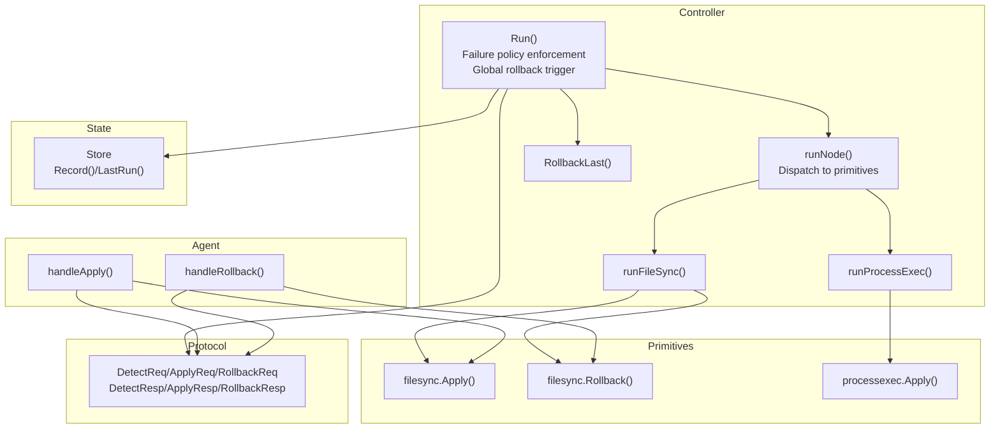
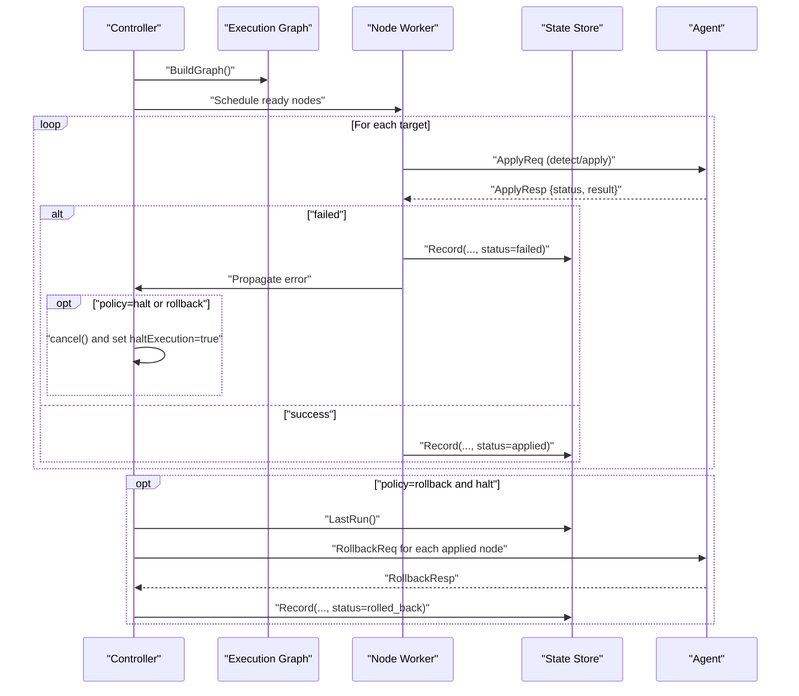
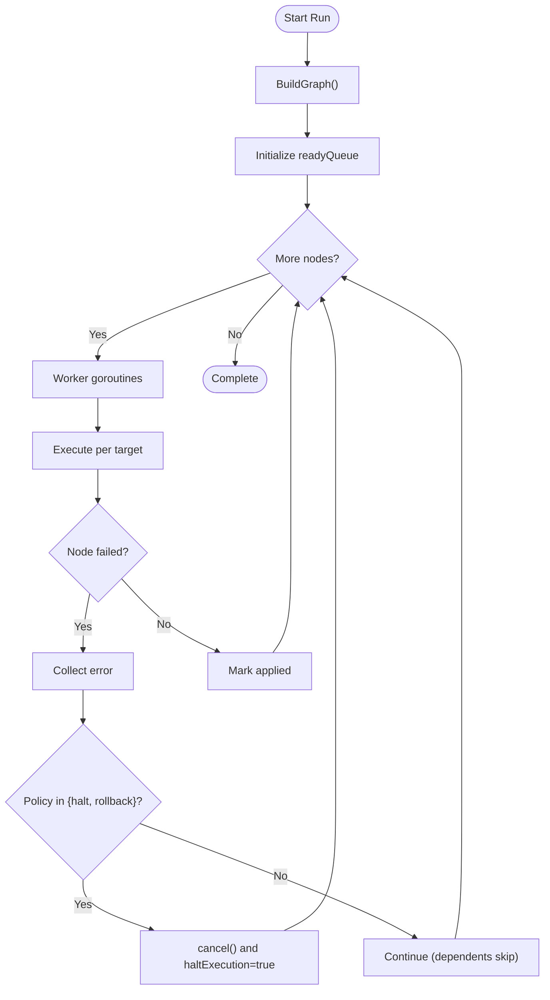
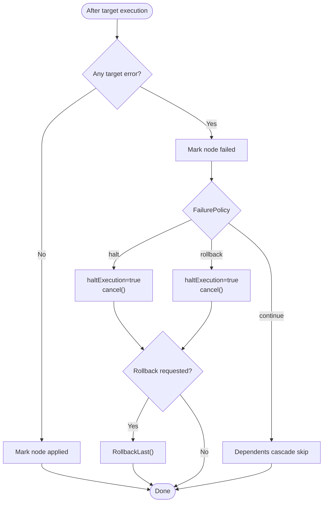
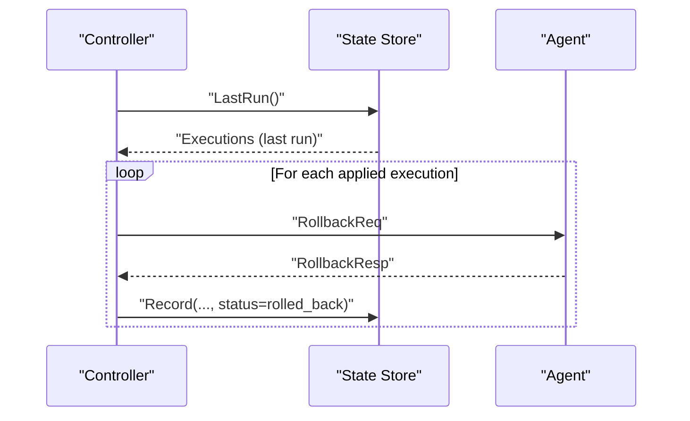
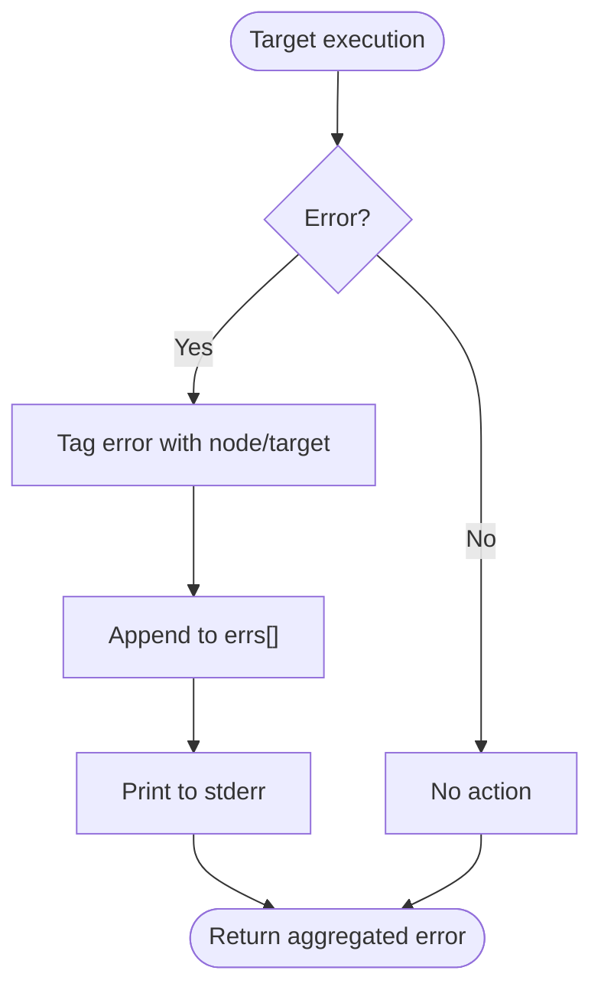
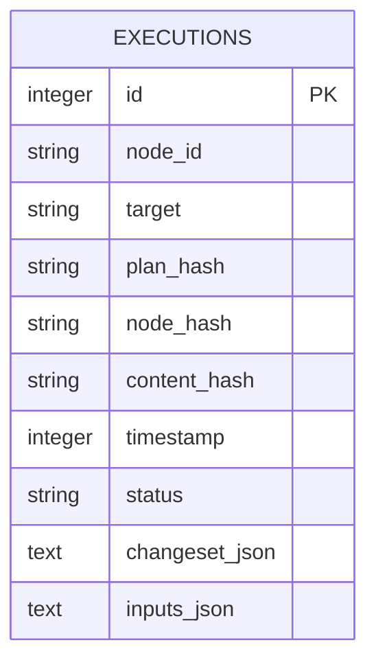
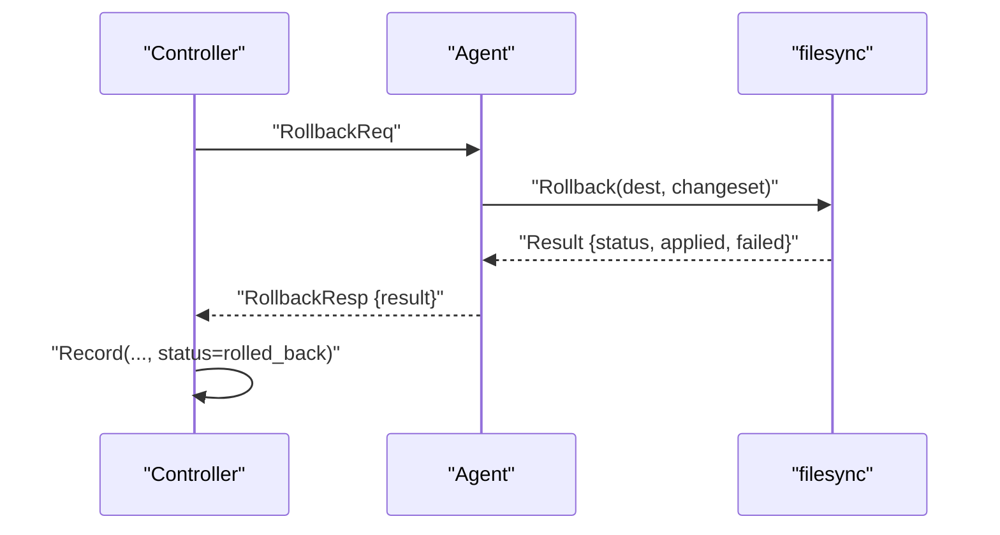
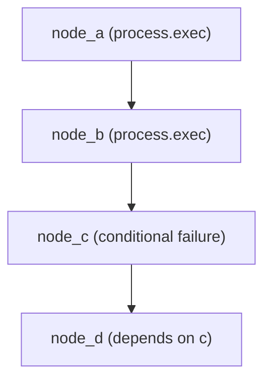
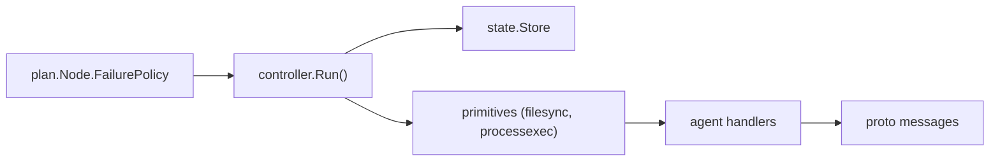

# Termination Handling and Failure Policy Management

<cite>
**Referenced Files in This Document**
- [orchestrator.go](file://internal/controller/orchestrator.go)
- [store.go](file://internal/state/store.go)
- [messages.go](file://internal/proto/messages.go)
- [schema.go](file://internal/plan/schema.go)
- [validate.go](file://internal/plan/validate.go)
- [rollback.go](file://internal/primitive/filesync/rollback.go)
- [apply.go](file://internal/primitive/filesync/apply.go)
- [processexec.go](file://internal/primitive/processexec/processexec.go)
- [handler.go](file://internal/agent/handler.go)
- [server.go](file://internal/agent/server.go)
- [resume_test.sh](file://tests/e2e/resume_test.sh)
- [plan.devops](file://plan.devops)
</cite>

## Table of Contents
1. [Introduction](#introduction)
2. [Project Structure](#project-structure)
3. [Core Components](#core-components)
4. [Architecture Overview](#architecture-overview)
5. [Detailed Component Analysis](#detailed-component-analysis)
6. [Dependency Analysis](#dependency-analysis)
7. [Performance Considerations](#performance-considerations)
8. [Troubleshooting Guide](#troubleshooting-guide)
9. [Conclusion](#conclusion)

## Introduction
This document explains how the system handles execution termination and failure policy management. It covers:
- Execution termination conditions: completion criteria, context cancellation, and graceful shutdown
- Failure policies: halt, continue, rollback, and their impact on execution flow
- Global rollback triggering and coordination
- Error collection and reporting
- Partial failure handling and recovery via state management
- Concrete examples from the codebase showing failure scenarios, rollback coordination, and interruption patterns

## Project Structure
The termination and failure handling spans several packages:
- Controller orchestrates execution, enforces failure policies, coordinates rollbacks, and records state
- State store persists execution outcomes for recovery and reconciliation
- Primitives implement node-specific apply/rollback logic
- Agent handles controller requests and responds with results
- Protocol defines wire messages exchanged during detect/apply/rollback

**Diagram sources**
- [orchestrator.go](file://internal/controller/orchestrator.go#L35-L300)
- [store.go](file://internal/state/store.go#L68-L225)
- [apply.go](file://internal/primitive/filesync/apply.go#L19-L204)
- [rollback.go](file://internal/primitive/filesync/rollback.go#L11-L82)
- [processexec.go](file://internal/primitive/processexec/processexec.go#L13-L82)
- [handler.go](file://internal/agent/handler.go#L88-L173)
- [messages.go](file://internal/proto/messages.go#L14-L75)

**Section sources**
- [orchestrator.go](file://internal/controller/orchestrator.go#L35-L300)
- [store.go](file://internal/state/store.go#L68-L225)
- [messages.go](file://internal/proto/messages.go#L14-L75)

## Core Components
- Orchestrator.Run: Builds the execution graph, schedules nodes, enforces failure policies, triggers global rollback, and records outcomes
- State.Store: Append-only persistence of execution records with status and change sets
- Primitive handlers: filesync.Apply and filesync.Rollback implement atomic apply and rollback; processexec.Apply executes commands locally
- Agent handlers: handleApply and handleRollback translate controller requests into primitive actions and return structured results

Key responsibilities:
- Termination conditions: completion when all nodes finish; context cancellation stops further target executions
- Failure policy enforcement: halt or rollback halts execution and cancels remaining work; continue allows dependents to skip
- Global rollback: RollbackLast replays rollback across the last run’s successful nodes
- Error collection: Accumulates per-target errors and reports aggregated failures

**Section sources**
- [orchestrator.go](file://internal/controller/orchestrator.go#L35-L300)
- [store.go](file://internal/state/store.go#L68-L225)
- [handler.go](file://internal/agent/handler.go#L88-L173)

## Architecture Overview
The controller coordinates node execution across targets, applying failure policies and recording state. On failure, it can trigger primitive-level or global rollbacks. The agent executes actions and returns structured results.

**Diagram sources**
- [orchestrator.go](file://internal/controller/orchestrator.go#L35-L300)
- [store.go](file://internal/state/store.go#L190-L225)
- [handler.go](file://internal/agent/handler.go#L88-L173)
- [messages.go](file://internal/proto/messages.go#L25-L75)

## Detailed Component Analysis

### Execution Termination Conditions
- Completion criteria:
  - Graph completion: all nodes processed and ready queue drained
  - Node completion: all targets for a node finished
- Context cancellation:
  - A shared context is canceled when a halt or rollback policy triggers
  - Workers check context.Done() before starting work to abort early
- Graceful shutdown:
  - Controller waits for all workers to finish (WaitGroup)
  - Agent shuts down gracefully on OS signals

**Diagram sources**
- [orchestrator.go](file://internal/controller/orchestrator.go#L35-L300)

**Section sources**
- [orchestrator.go](file://internal/controller/orchestrator.go#L75-L98)
- [server.go](file://internal/agent/server.go#L20-L50)

### Failure Policy Implementation
Failure policies are defined per node and influence execution flow:
- halt: immediately mark node failed, cancel remaining work, and stop new target executions
- continue: node fails but does not cancel; dependents cascade skip based on upstream status
- rollback: halt/rollback execution and trigger global rollback of the last run

Policy evaluation and enforcement:
- After target execution, if any target fails, the node is marked failed
- If policy is halt or rollback, the controller cancels the context and sets halt flag
- If policy is rollback and halt occurred, the controller triggers global rollback

**Diagram sources**
- [orchestrator.go](file://internal/controller/orchestrator.go#L244-L265)
- [schema.go](file://internal/plan/schema.go#L24-L33)

**Section sources**
- [orchestrator.go](file://internal/controller/orchestrator.go#L244-L265)
- [validate.go](file://internal/plan/validate.go#L65-L67)

### Global Rollback Triggering Mechanism
Global rollback is triggered when a node fails under rollback policy and halt occurs. The controller:
- Fetches the last run’s executions from state
- Issues rollback requests to the agent for each applied node
- Records rollback outcomes in state

**Diagram sources**
- [orchestrator.go](file://internal/controller/orchestrator.go#L618-L652)
- [store.go](file://internal/state/store.go#L190-L225)
- [handler.go](file://internal/agent/handler.go#L147-L173)

**Section sources**
- [orchestrator.go](file://internal/controller/orchestrator.go#L618-L652)
- [store.go](file://internal/state/store.go#L190-L225)

### Error Collection and Reporting
- Per-target errors are collected and tagged with node and target identifiers
- Aggregated errors are printed to standard error and returned as a combined error
- Node-level status is recorded in state for visibility and recovery

**Diagram sources**
- [orchestrator.go](file://internal/controller/orchestrator.go#L225-L244)
- [orchestrator.go](file://internal/controller/orchestrator.go#L293-L299)

**Section sources**
- [orchestrator.go](file://internal/controller/orchestrator.go#L225-L244)
- [orchestrator.go](file://internal/controller/orchestrator.go#L293-L299)

### Relationship Between Failure Policies and State Management
- State records are appended for each node-target execution with status and change set
- Successful apply updates status to applied; failed apply updates to failed
- Global rollback updates status to rolled_back and persists rollback change set
- Resume and reconcile leverage stored state to skip or reconcile unchanged work

**Diagram sources**
- [store.go](file://internal/state/store.go#L17-L31)

**Section sources**
- [store.go](file://internal/state/store.go#L68-L84)
- [store.go](file://internal/state/store.go#L100-L129)
- [store.go](file://internal/state/store.go#L131-L159)
- [store.go](file://internal/state/store.go#L190-L225)

### Primitive-Level Rollback Coordination
- filesync.Apply snapshots pre-change state and writes a snapshot marker
- filesync.Rollback restores files from snapshot and removes newly created files
- Agent.handleRollback invokes filesync.Rollback and returns structured result
- Controller.doRollback sends rollback request to agent and records outcome

**Diagram sources**
- [orchestrator.go](file://internal/controller/orchestrator.go#L554-L583)
- [handler.go](file://internal/agent/handler.go#L147-L173)
- [rollback.go](file://internal/primitive/filesync/rollback.go#L11-L82)

**Section sources**
- [apply.go](file://internal/primitive/filesync/apply.go#L185-L189)
- [rollback.go](file://internal/primitive/filesync/rollback.go#L11-L82)
- [handler.go](file://internal/agent/handler.go#L147-L173)

### Concrete Examples from the Codebase
- E2E test plan demonstrates cascading failure and recovery:
  - Node C depends on node D and fails based on a condition file
  - After fixing the condition, the plan resumes from prior state
- Example plan shows two nodes: file.sync and process.exec

**Diagram sources**
- [resume_test.sh](file://tests/e2e/resume_test.sh#L22-L50)
- [plan.devops](file://plan.devops#L5-L19)

**Section sources**
- [resume_test.sh](file://tests/e2e/resume_test.sh#L58-L76)
- [plan.devops](file://plan.devops#L1-L20)

## Dependency Analysis
The orchestrator coordinates multiple subsystems and depends on:
- Plan schema for node definition and failure policy
- State store for persistence and recovery
- Primitives for apply/rollback logic
- Agent handlers for remote execution

**Diagram sources**
- [schema.go](file://internal/plan/schema.go#L24-L33)
- [orchestrator.go](file://internal/controller/orchestrator.go#L35-L300)
- [store.go](file://internal/state/store.go#L68-L225)
- [handler.go](file://internal/agent/handler.go#L88-L173)
- [messages.go](file://internal/proto/messages.go#L14-L75)

**Section sources**
- [schema.go](file://internal/plan/schema.go#L24-L33)
- [validate.go](file://internal/plan/validate.go#L65-L67)
- [orchestrator.go](file://internal/controller/orchestrator.go#L35-L300)

## Performance Considerations
- Parallelism: controlled via a semaphore to limit concurrent targets
- Early termination: context cancellation prevents unnecessary work when halting
- Streaming: file transfers are streamed to avoid large memory usage
- State indexing: database indices optimize lookups for latest and last run queries

[No sources needed since this section provides general guidance]

## Troubleshooting Guide
Common termination and failure scenarios:
- Context cancellation interrupts ongoing work; verify that workers check context.Done() before starting
- Policy halt vs continue: confirm expected behavior by inspecting node failure_policy
- Global rollback: ensure LastRun returns entries and agent supports rollback for the primitive type
- Partial failures: check state records for failed/applied items and inspect rollback outcomes

Operational tips:
- Resume and reconcile rely on stored state; ensure state.db exists and is readable
- For process.exec, note that rollback is not supported; failures are terminal for that primitive
- Verify agent connectivity and message framing for detect/apply/rollback exchanges

**Section sources**
- [orchestrator.go](file://internal/controller/orchestrator.go#L75-L98)
- [orchestrator.go](file://internal/controller/orchestrator.go#L244-L265)
- [store.go](file://internal/state/store.go#L190-L225)
- [handler.go](file://internal/agent/handler.go#L147-L173)
- [processexec.go](file://internal/primitive/processexec/processexec.go#L13-L82)

## Conclusion
The system implements robust termination handling and failure policy management:
- Clear completion and cancellation semantics
- Configurable failure policies with immediate or deferred effects
- Primitive-level and global rollback coordination
- Comprehensive state management enabling recovery and reconciliation
- Practical examples demonstrate real-world failure and recovery patterns