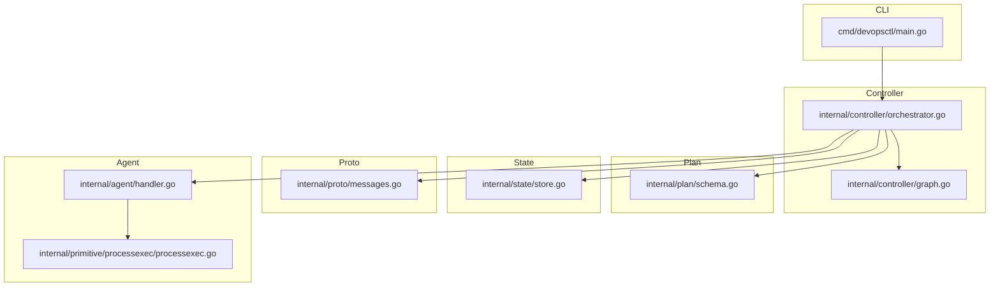
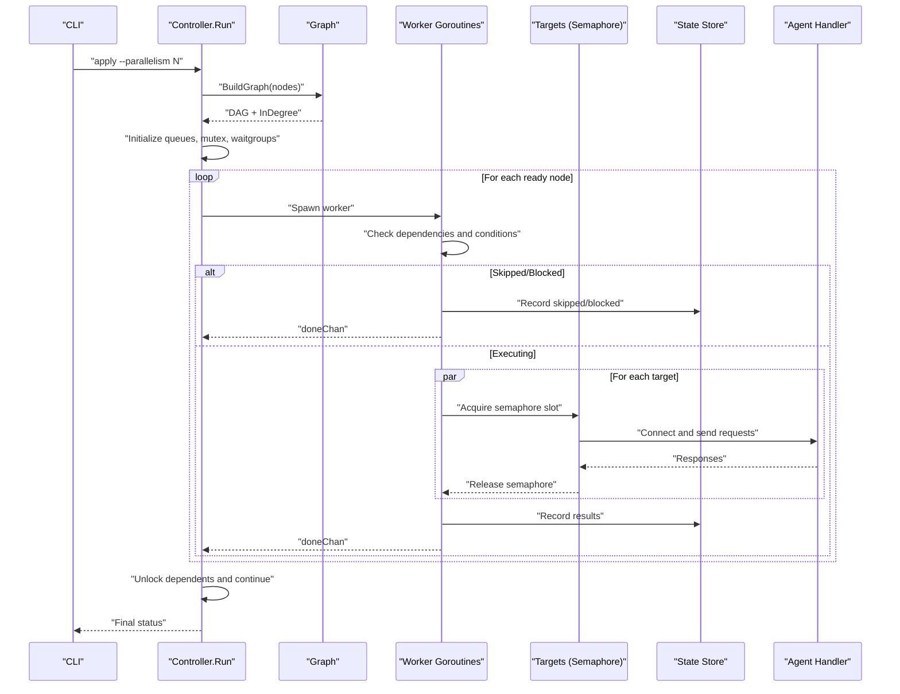
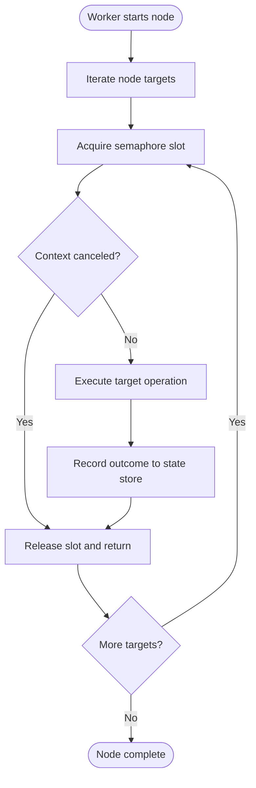
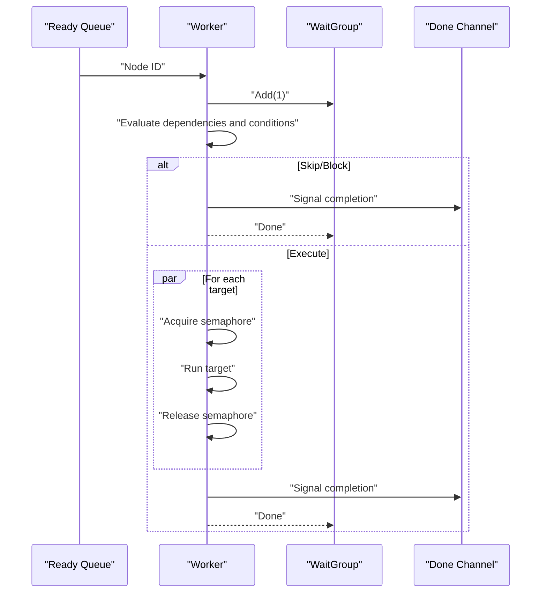
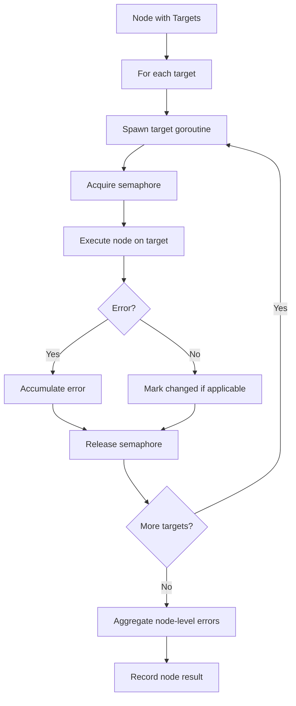
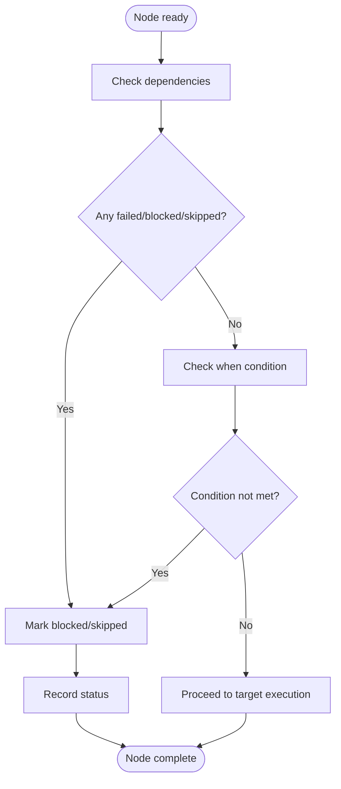
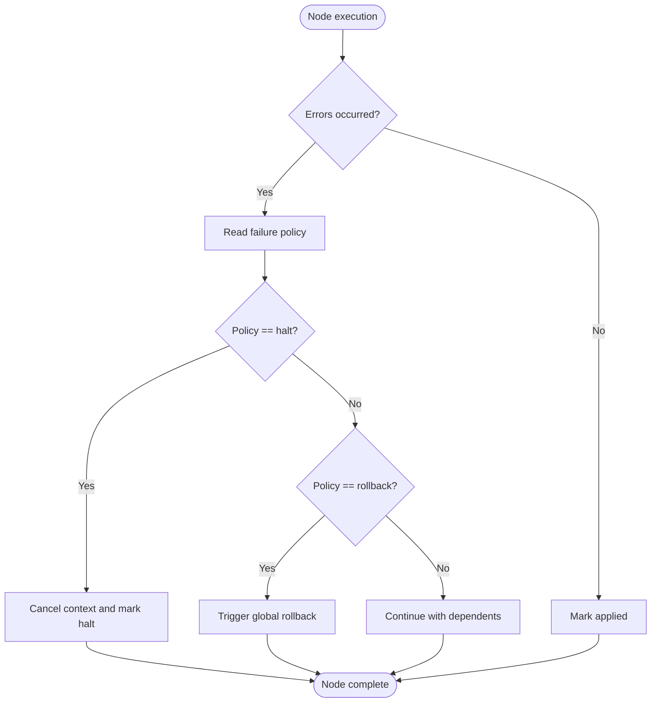
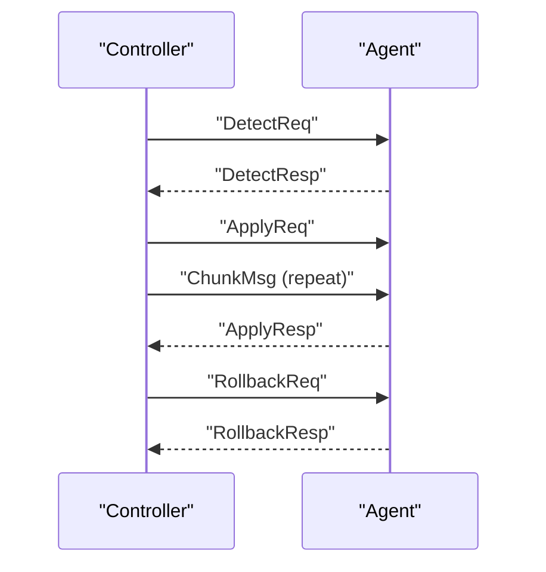
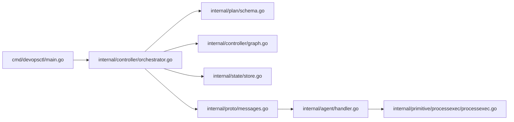

# Parallel Execution Model

<cite>
**Referenced Files in This Document**
- [orchestrator.go](file://internal/controller/orchestrator.go)
- [graph.go](file://internal/controller/graph.go)
- [schema.go](file://internal/plan/schema.go)
- [store.go](file://internal/state/store.go)
- [messages.go](file://internal/proto/messages.go)
- [handler.go](file://internal/agent/handler.go)
- [processexec.go](file://internal/primitive/processexec/processexec.go)
- [main.go](file://cmd/devopsctl/main.go)
</cite>

## Table of Contents
1. [Introduction](#introduction)
2. [Project Structure](#project-structure)
3. [Core Components](#core-components)
4. [Architecture Overview](#architecture-overview)
5. [Detailed Component Analysis](#detailed-component-analysis)
6. [Dependency Analysis](#dependency-analysis)
7. [Performance Considerations](#performance-considerations)
8. [Troubleshooting Guide](#troubleshooting-guide)
9. [Conclusion](#conclusion)

## Introduction
This document explains the parallel execution model used by the orchestrator to execute nodes concurrently across multiple targets while respecting dependencies and resource constraints. It covers the semaphore-based concurrency control, worker goroutine management, target-level parallelism, thread-safety mechanisms, and error propagation in a high-concurrency environment. Practical examples, performance tuning strategies, and scalability considerations are included to help operators configure and operate the system effectively.

## Project Structure
The parallel execution model spans several packages:
- Controller orchestrates execution, builds the dependency graph, and coordinates workers.
- Plan defines the execution graph nodes and targets.
- State persists execution records for resume/reconcile and rollback.
- Proto defines the wire protocol between controller and agent.
- Agent implements the primitives that execute on remote targets.
- CLI exposes flags to tune parallelism and behavior.



**Diagram sources**
- [main.go](file://cmd/devopsctl/main.go#L32-L87)
- [orchestrator.go](file://internal/controller/orchestrator.go#L35-L300)
- [graph.go](file://internal/controller/graph.go#L16-L48)
- [schema.go](file://internal/plan/schema.go#L11-L39)
- [store.go](file://internal/state/store.go#L33-L61)
- [messages.go](file://internal/proto/messages.go#L14-L75)
- [handler.go](file://internal/agent/handler.go#L16-L51)
- [processexec.go](file://internal/primitive/processexec/processexec.go#L13-L82)

**Section sources**
- [main.go](file://cmd/devopsctl/main.go#L32-L87)
- [orchestrator.go](file://internal/controller/orchestrator.go#L35-L300)
- [graph.go](file://internal/controller/graph.go#L16-L48)
- [schema.go](file://internal/plan/schema.go#L11-L39)
- [store.go](file://internal/state/store.go#L33-L61)
- [messages.go](file://internal/proto/messages.go#L14-L75)
- [handler.go](file://internal/agent/handler.go#L16-L51)
- [processexec.go](file://internal/primitive/processexec/processexec.go#L13-L82)

## Core Components
- Orchestrator: Builds the dependency graph, initializes state, and runs nodes in parallel with a target-level semaphore. It coordinates workers via channels and wait groups, enforces failure policies, and records outcomes.
- Graph builder: Constructs a DAG from nodes and validates acyclicity.
- Plan schema: Defines nodes, targets, and dependency/condition semantics.
- State store: Append-only persistence for execution records enabling resume and reconcile.
- Protocol: Line-delimited JSON messages exchanged between controller and agent.
- Agent handler: Implements detect/apply/rollback handlers and delegates to primitives.
- Process executor: Local command execution primitive used by the agent.

Key concurrency primitives:
- Semaphore channel for target-level parallelism.
- Mutex for shared state protection.
- WaitGroup for worker lifecycle.
- Context for cooperative cancellation.
- Channels for ready queue and completion signaling.

**Section sources**
- [orchestrator.go](file://internal/controller/orchestrator.go#L26-L32)
- [orchestrator.go](file://internal/controller/orchestrator.go#L66-L81)
- [graph.go](file://internal/controller/graph.go#L16-L48)
- [schema.go](file://internal/plan/schema.go#L24-L39)
- [store.go](file://internal/state/store.go#L68-L84)
- [messages.go](file://internal/proto/messages.go#L14-L75)
- [handler.go](file://internal/agent/handler.go#L16-L51)
- [processexec.go](file://internal/primitive/processexec/processexec.go#L13-L82)

## Architecture Overview
The orchestrator executes nodes in topological order while allowing multiple targets for the same node to run concurrently. It uses a semaphore to cap target-level concurrency, mutex-protected shared state, and channels to coordinate readiness and completion. Failures propagate according to node failure policies, and the system can roll back or halt depending on configuration.



**Diagram sources**
- [main.go](file://cmd/devopsctl/main.go#L78-L82)
- [orchestrator.go](file://internal/controller/orchestrator.go#L35-L300)
- [graph.go](file://internal/controller/graph.go#L16-L48)
- [store.go](file://internal/state/store.go#L68-L84)
- [messages.go](file://internal/proto/messages.go#L14-L75)
- [handler.go](file://internal/agent/handler.go#L16-L51)

## Detailed Component Analysis

### Semaphore-Based Concurrency Control
The orchestrator employs a target-level semaphore to bound concurrent target executions. Each target execution consumes a slot from the semaphore, and releasing occurs after completion. This ensures that the number of simultaneous target operations does not exceed the configured parallelism limit.

- Semaphore initialization: The semaphore channel capacity equals the configured parallelism.
- Acquire/release: Workers acquire a slot before starting a target execution and release it upon completion.
- Context-aware early exit: Before acquiring a slot, workers check for cancellation to avoid blocking.



**Diagram sources**
- [orchestrator.go](file://internal/controller/orchestrator.go#L80-L81)
- [orchestrator.go](file://internal/controller/orchestrator.go#L169-L171)
- [orchestrator.go](file://internal/controller/orchestrator.go#L174-L178)

**Section sources**
- [orchestrator.go](file://internal/controller/orchestrator.go#L80-L81)
- [orchestrator.go](file://internal/controller/orchestrator.go#L169-L171)
- [orchestrator.go](file://internal/controller/orchestrator.go#L174-L178)

### Worker Goroutine Management
Workers are launched per ready node and coordinate using channels and wait groups:
- Ready queue: Nodes with zero in-degree are sent to a buffered channel for workers to pick up.
- Completion signaling: Each worker signals completion via a done channel.
- WaitGroup: Ensures all worker goroutines finish before returning.



**Diagram sources**
- [orchestrator.go](file://internal/controller/orchestrator.go#L66-L71)
- [orchestrator.go](file://internal/controller/orchestrator.go#L84-L270)
- [orchestrator.go](file://internal/controller/orchestrator.go#L273-L291)

**Section sources**
- [orchestrator.go](file://internal/controller/orchestrator.go#L66-L71)
- [orchestrator.go](file://internal/controller/orchestrator.go#L84-L270)
- [orchestrator.go](file://internal/controller/orchestrator.go#L273-L291)

### Target-Level Parallelism Mechanism
Multiple targets for the same node execute concurrently. The orchestrator iterates the node’s target list, launching a goroutine per target. Each target goroutine:
- Shares the node’s inputs and target address.
- Respects the global semaphore to avoid exceeding parallelism.
- Uses a target-scoped mutex to aggregate errors and track changes.
- Records outcomes to the state store.



**Diagram sources**
- [orchestrator.go](file://internal/controller/orchestrator.go#L163-L237)
- [orchestrator.go](file://internal/controller/orchestrator.go#L239-L260)

**Section sources**
- [orchestrator.go](file://internal/controller/orchestrator.go#L163-L237)
- [orchestrator.go](file://internal/controller/orchestrator.go#L239-L260)

### Dependency-Aware Execution and Conditional Skipping
The orchestrator evaluates dependencies and when conditions before executing a node:
- Cascade skip: If any dependency failed or is blocked, the node is skipped or marked blocked.
- When conditions: If a node specifies a when clause, it checks whether the referenced node’s changed flag matches the expectation.
- Node state tracking: Shared state maps node IDs to statuses (pending, applied, failed, skipped, blocked).



**Diagram sources**
- [orchestrator.go](file://internal/controller/orchestrator.go#L93-L124)
- [orchestrator.go](file://internal/controller/orchestrator.go#L126-L155)

**Section sources**
- [orchestrator.go](file://internal/controller/orchestrator.go#L93-L124)
- [orchestrator.go](file://internal/controller/orchestrator.go#L126-L155)

### Thread Safety Measures
The orchestrator uses multiple synchronization primitives to protect shared state:
- Mutex for node states, changed flags, and error aggregation.
- Target-scoped mutex for aggregating per-node target errors and change flags.
- WaitGroup for coordinating worker lifecycle.
- Context for cooperative cancellation to prevent deadlocks during shutdown.

```mermaid
classDiagram
class Orchestrator {
+RunOptions
+Run()
-nodeStates map
-nodeChanged map
-mu Mutex
-targetMu Mutex
-wg WaitGroup
-sem chan struct{}
-readyQueue chan
-doneChan chan
}
class Graph {
+Nodes map
+Edges map
+InDegree map
}
class StateStore {
+Record()
+LatestExecution()
}
Orchestrator --> Graph : "builds"
Orchestrator --> StateStore : "records"
```

**Diagram sources**
- [orchestrator.go](file://internal/controller/orchestrator.go#L51-L76)
- [orchestrator.go](file://internal/controller/orchestrator.go#L158-L161)
- [graph.go](file://internal/controller/graph.go#L9-L14)
- [store.go](file://internal/state/store.go#L68-L84)

**Section sources**
- [orchestrator.go](file://internal/controller/orchestrator.go#L51-L76)
- [orchestrator.go](file://internal/controller/orchestrator.go#L158-L161)
- [graph.go](file://internal/controller/graph.go#L9-L14)
- [store.go](file://internal/state/store.go#L68-L84)

### Error Propagation and Failure Policies
- Node-level errors are aggregated and recorded. The orchestrator sets the node’s status to failed and applies the failure policy.
- Failure policies:
  - halt: Stops subsequent target executions for the node and cancels the context.
  - rollback: Triggers a global rollback of the last run after marking the node as failed.
  - continue: Allows dependents to continue; cascading skips occur automatically.
- Global rollback: Iterates the last run’s successful entries and triggers agent-level rollback for compatible primitives.



**Diagram sources**
- [orchestrator.go](file://internal/controller/orchestrator.go#L239-L265)
- [orchestrator.go](file://internal/controller/orchestrator.go#L262-L265)
- [orchestrator.go](file://internal/controller/orchestrator.go#L619-L652)

**Section sources**
- [orchestrator.go](file://internal/controller/orchestrator.go#L239-L265)
- [orchestrator.go](file://internal/controller/orchestrator.go#L619-L652)

### Communication Protocol and Agent Interaction
The controller communicates with agents over a line-delimited JSON protocol:
- Detect: Controller requests the agent to report current state.
- Apply: Controller sends a change set and streams file chunks; agent applies and responds.
- Rollback: Controller requests rollback for the last successful apply.



**Diagram sources**
- [messages.go](file://internal/proto/messages.go#L14-L75)
- [handler.go](file://internal/agent/handler.go#L53-L139)
- [orchestrator.go](file://internal/controller/orchestrator.go#L313-L442)

**Section sources**
- [messages.go](file://internal/proto/messages.go#L14-L75)
- [handler.go](file://internal/agent/handler.go#L53-L139)
- [orchestrator.go](file://internal/controller/orchestrator.go#L313-L442)

### Example Scenarios
- Multiple targets for a single node: The orchestrator spawns a goroutine per target, each acquiring a semaphore slot before connecting to the agent. Results are recorded independently for each target.
- Dependency chain: Nodes with zero in-degree are scheduled first; as each node completes, dependents unlock by decrementing their in-degree.
- Conditional execution: A node with a when clause waits for the referenced node’s changed flag to match the expected value before proceeding.
- Failure policy: On failure with halt, the orchestrator cancels remaining target executions for that node and marks the node failed. With rollback, it triggers a global rollback after completion.

**Section sources**
- [orchestrator.go](file://internal/controller/orchestrator.go#L163-L237)
- [orchestrator.go](file://internal/controller/orchestrator.go#L273-L291)
- [orchestrator.go](file://internal/controller/orchestrator.go#L239-L265)

## Dependency Analysis
The orchestrator composes several subsystems:
- CLI provides flags to configure parallelism and behavior.
- Graph builder constructs a DAG and validates acyclicity.
- State store persists execution records for resume/reconcile and rollback.
- Protocol and agent handler implement the wire protocol and primitives.



**Diagram sources**
- [main.go](file://cmd/devopsctl/main.go#L78-L82)
- [orchestrator.go](file://internal/controller/orchestrator.go#L35-L300)
- [schema.go](file://internal/plan/schema.go#L11-L39)
- [graph.go](file://internal/controller/graph.go#L16-L48)
- [store.go](file://internal/state/store.go#L33-L61)
- [messages.go](file://internal/proto/messages.go#L14-L75)
- [handler.go](file://internal/agent/handler.go#L16-L51)
- [processexec.go](file://internal/primitive/processexec/processexec.go#L13-L82)

**Section sources**
- [main.go](file://cmd/devopsctl/main.go#L78-L82)
- [orchestrator.go](file://internal/controller/orchestrator.go#L35-L300)
- [schema.go](file://internal/plan/schema.go#L11-L39)
- [graph.go](file://internal/controller/graph.go#L16-L48)
- [store.go](file://internal/state/store.go#L33-L61)
- [messages.go](file://internal/proto/messages.go#L14-L75)
- [handler.go](file://internal/agent/handler.go#L16-L51)
- [processexec.go](file://internal/primitive/processexec/processexec.go#L13-L82)

## Performance Considerations
- Parallelism tuning:
  - Increase parallelism to utilize more CPU/network bandwidth when targets are I/O-bound.
  - Reduce parallelism to avoid saturating network or agent resources.
  - Use the CLI flag to set the maximum concurrent node executions.
- Resource management:
  - Limit semaphore slots to match target capacity and agent throughput.
  - Monitor state store writes; ensure adequate disk I/O for frequent recording.
- Network efficiency:
  - Streaming file chunks reduces memory overhead and improves throughput.
- Cancellation:
  - Context cancellation prevents wasted work when halting due to failures.
- Reconcile vs Resume:
  - Reconcile avoids redundant work by comparing node hashes; resume can skip previously applied nodes.

Practical tips:
- Start with a moderate parallelism value and scale up while monitoring agent load and disk throughput.
- For large file syncs, ensure chunk sizes balance latency and overhead.
- Use dry-run to estimate change counts before applying.

**Section sources**
- [main.go](file://cmd/devopsctl/main.go#L86-L87)
- [orchestrator.go](file://internal/controller/orchestrator.go#L37-L39)
- [orchestrator.go](file://internal/controller/orchestrator.go#L174-L178)
- [orchestrator.go](file://internal/controller/orchestrator.go#L313-L442)
- [store.go](file://internal/state/store.go#L68-L84)

## Troubleshooting Guide
Common issues and resolutions:
- Excessive contention:
  - Symptoms: Slow progress despite high parallelism.
  - Resolution: Lower parallelism to match agent capacity; monitor agent logs.
- Deadlocks:
  - Symptoms: Workers stuck waiting for semaphore or completion.
  - Resolution: Verify that all goroutines release the semaphore and signal completion; ensure context cancellation is respected.
- Dependency failures:
  - Symptoms: Nodes remain skipped or blocked.
  - Resolution: Inspect node states and fix upstream failures; adjust when conditions.
- State inconsistencies:
  - Symptoms: Inconsistent resume/reconcile behavior.
  - Resolution: Verify state store health and ensure consistent node hashing.
- Rollback failures:
  - Symptoms: Rollback not triggered or partial rollback.
  - Resolution: Confirm rollback-safe primitives and inspect agent responses.

Operational commands:
- List state entries to inspect execution history.
- Use dry-run to preview changes before applying.
- Adjust parallelism and retry with reduced concurrency if needed.

**Section sources**
- [orchestrator.go](file://internal/controller/orchestrator.go#L239-L265)
- [orchestrator.go](file://internal/controller/orchestrator.go#L619-L652)
- [store.go](file://internal/state/store.go#L100-L160)
- [main.go](file://cmd/devopsctl/main.go#L168-L189)

## Conclusion
The orchestrator’s parallel execution model combines a semaphore-based target-level concurrency control with dependency-aware scheduling, robust error propagation, and resilient state management. By carefully tuning parallelism, leveraging conditional execution, and using the provided failure policies, operators can achieve efficient and safe automation across multiple targets while respecting resource constraints. The design supports scalability through careful synchronization and protocol-driven agent interactions.