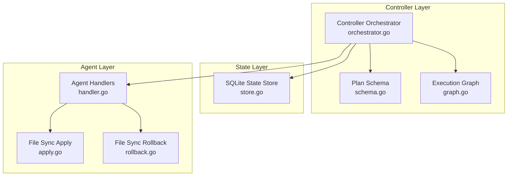
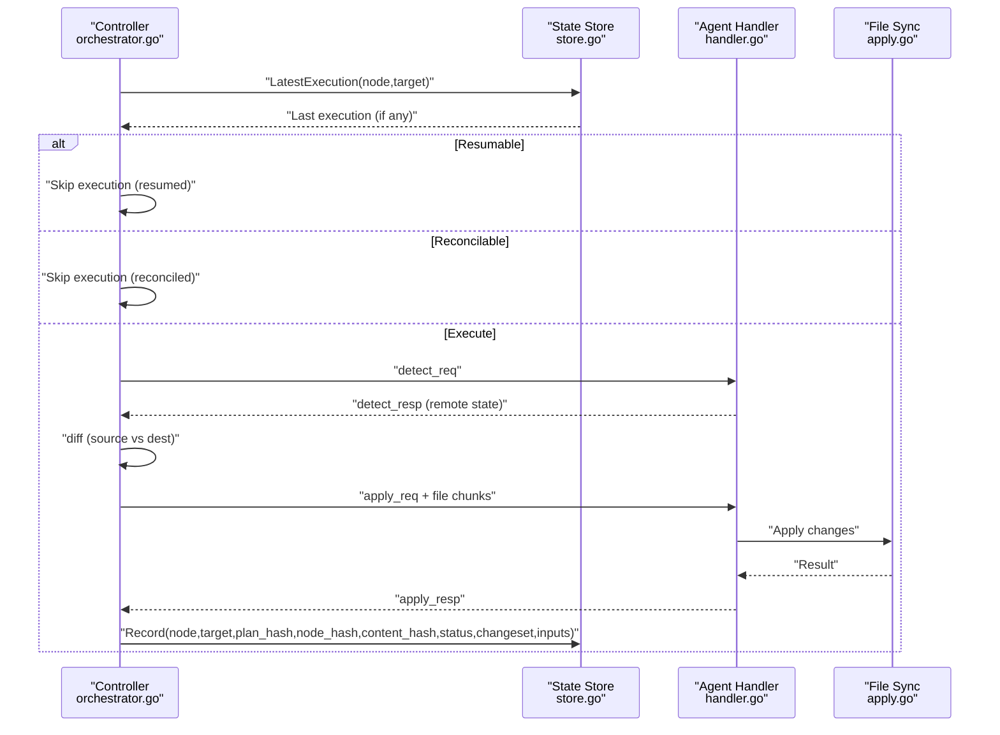
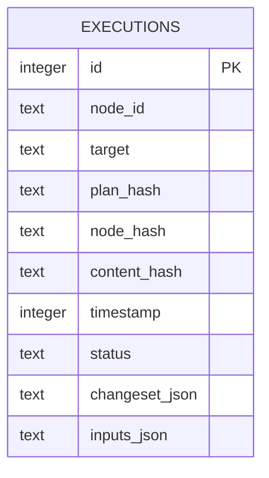
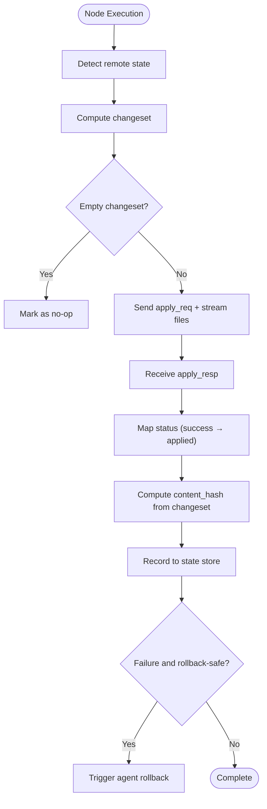
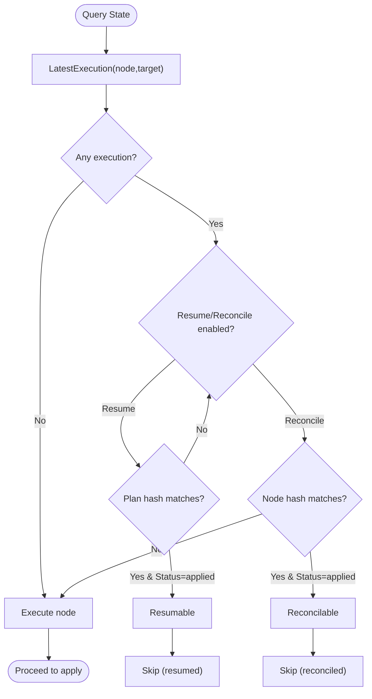
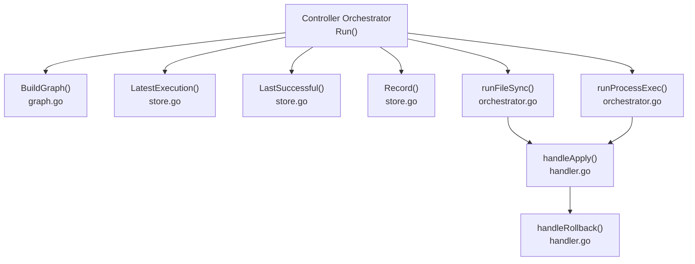

# State Management Integration

<cite>
**Referenced Files in This Document**
- [store.go](file://internal/state/store.go)
- [orchestrator.go](file://internal/controller/orchestrator.go)
- [messages.go](file://internal/proto/messages.go)
- [schema.go](file://internal/plan/schema.go)
- [graph.go](file://internal/controller/graph.go)
- [apply.go](file://internal/primitive/filesync/apply.go)
- [rollback.go](file://internal/primitive/filesync/rollback.go)
- [handler.go](file://internal/agent/handler.go)
- [plan_resume.devops](file://tests/e2e/plan_resume.devops)
- [plan_resume.json](file://tests/e2e/plan_resume.json)
</cite>

## Table of Contents
1. [Introduction](#introduction)
2. [Project Structure](#project-structure)
3. [Core Components](#core-components)
4. [Architecture Overview](#architecture-overview)
5. [Detailed Component Analysis](#detailed-component-analysis)
6. [Dependency Analysis](#dependency-analysis)
7. [Performance Considerations](#performance-considerations)
8. [Troubleshooting Guide](#troubleshooting-guide)
9. [Conclusion](#conclusion)

## Introduction
This document explains how the execution engine integrates with state management to provide reliable, resumable, and reconcilable operations. It covers:
- How execution results are recorded during node execution and persisted to the SQLite database
- How the orchestrator queries state for resume and reconcile decisions
- The state schema used to store execution metadata, change sets, and rollback information
- Examples of state-based decision-making (resumability via plan/node hashes)
- Relationship between state persistence and execution guarantees (atomicity and consistency)
- Cleanup, archival, and maintenance operations

## Project Structure
The state management system spans three layers:
- State storage: SQLite-backed append-only store
- Orchestrator: Decision logic for resuming, reconciling, and recording outcomes
- Agents: Primitive execution and rollback handlers

**Diagram sources**
- [orchestrator.go](file://internal/controller/orchestrator.go#L35-L300)
- [store.go](file://internal/state/store.go#L38-L84)
- [schema.go](file://internal/plan/schema.go#L11-L76)
- [graph.go](file://internal/controller/graph.go#L9-L84)
- [handler.go](file://internal/agent/handler.go#L16-L51)
- [apply.go](file://internal/primitive/filesync/apply.go#L19-L204)
- [rollback.go](file://internal/primitive/filesync/rollback.go#L11-L82)

**Section sources**
- [orchestrator.go](file://internal/controller/orchestrator.go#L35-L300)
- [store.go](file://internal/state/store.go#L17-L31)
- [schema.go](file://internal/plan/schema.go#L11-L76)
- [graph.go](file://internal/controller/graph.go#L9-L84)
- [handler.go](file://internal/agent/handler.go#L16-L51)

## Core Components
- State Store: Manages SQLite database initialization, schema migration, and CRUD operations for executions
- Orchestrator: Drives execution, evaluates resumability/reconcilability, persists outcomes, and triggers rollbacks
- Protocol Messages: Define wire protocol for detect, apply, and rollback operations
- File Sync Primitives: Implement apply and rollback semantics with snapshot-based rollback
- Agent Handlers: Translate controller requests into agent-side actions

Key responsibilities:
- Append-only state recording after each node-target execution
- Deterministic resumability via plan hash and node hash comparisons
- Reconciliation via node hash comparison against last-applied state
- Rollback coordination between controller and agent

**Section sources**
- [store.go](file://internal/state/store.go#L38-L84)
- [orchestrator.go](file://internal/controller/orchestrator.go#L180-L225)
- [messages.go](file://internal/proto/messages.go#L14-L75)
- [apply.go](file://internal/primitive/filesync/apply.go#L19-L204)
- [rollback.go](file://internal/primitive/filesync/rollback.go#L11-L82)
- [handler.go](file://internal/agent/handler.go#L88-L173)

## Architecture Overview
The execution engine follows a detect-diff-apply pattern with state-driven resumability and reconciliation.

**Diagram sources**
- [orchestrator.go](file://internal/controller/orchestrator.go#L180-L225)
- [store.go](file://internal/state/store.go#L131-L160)
- [handler.go](file://internal/agent/handler.go#L53-L139)
- [apply.go](file://internal/primitive/filesync/apply.go#L19-L204)
- [store.go](file://internal/state/store.go#L68-L84)

## Detailed Component Analysis

### State Schema and Persistence
The state schema captures execution metadata and outcomes for deterministic resumability and reconciliation.

- Indexes: Composite index on (node_id, target) supports fast per-node-target lookups
- Migration: Backward-compatible schema evolution adds missing columns for plan_hash, node_hash, and inputs_json
- Append-only: New records inserted per execution; no updates to existing rows

Persistence flow:
- After successful apply, controller computes content_hash from changeset and records execution with status mapped from agent result
- Skipped nodes (due to dependencies or conditions) are recorded with a placeholder content_hash and appropriate status
- Process.exec nodes record a special content_hash indicating no changeset

**Diagram sources**
- [store.go](file://internal/state/store.go#L17-L31)
- [store.go](file://internal/state/store.go#L68-L84)

**Section sources**
- [store.go](file://internal/state/store.go#L17-L31)
- [store.go](file://internal/state/store.go#L38-L61)
- [store.go](file://internal/state/store.go#L68-L84)

### State Recording During Node Execution
Recording occurs after apply completes and before potential rollback:

- Content hash: SHA-256 of serialized changeset for content-based deduplication
- Inputs capture: Controller inputs plus target address for reproducibility
- Status mapping: "success" normalized to "applied" for consistency

**Diagram sources**
- [orchestrator.go](file://internal/controller/orchestrator.go#L313-L442)
- [store.go](file://internal/state/store.go#L68-L84)

**Section sources**
- [orchestrator.go](file://internal/controller/orchestrator.go#L313-L442)
- [messages.go](file://internal/proto/messages.go#L25-L67)

### State Query Mechanisms for Resume and Reconcile
The orchestrator uses two primary queries to decide whether to skip, resume, or re-execute:

- LatestExecution: Most recent execution for a node-target (regardless of status)
- LastSuccessful: Most recent "applied" execution for a node-target

Decision logic:
- Resumability: If Resume is enabled and plan_hash matches the current run’s plan_hash, and the latest execution status is "applied", then skip execution and mark as resumed
- Reconcilability: If Reconcile is enabled and the latest execution status is "applied" and node_hash equals the current node hash, then skip execution and mark as reconciled

Node hash derivation:
- Deterministic hash of node type, target ID, and inputs ensures reconciliation correctness across runs

**Diagram sources**
- [orchestrator.go](file://internal/controller/orchestrator.go#L180-L225)
- [store.go](file://internal/state/store.go#L131-L160)
- [schema.go](file://internal/plan/schema.go#L54-L76)

**Section sources**
- [orchestrator.go](file://internal/controller/orchestrator.go#L180-L225)
- [store.go](file://internal/state/store.go#L100-L160)
- [schema.go](file://internal/plan/schema.go#L54-L76)

### State-Based Decision Examples
- Determining resumability: Compare plan_hash from latest execution with the current run’s plan hash; if equal and last status is "applied", resume
- Determining resumability for process.exec: Even if no changeset, resume if plan_hash matches and last status is "applied"
- Determining reconcilability: Compare node_hash derived from node definition and target; if equal and last status is "applied", reconcile

These decisions prevent redundant work and maintain idempotent behavior across runs.

**Section sources**
- [orchestrator.go](file://internal/controller/orchestrator.go#L187-L196)
- [schema.go](file://internal/plan/schema.go#L54-L76)

### Relationship Between State Persistence and Execution Guarantees
- Atomicity: Each execution outcome is recorded as a single append-only insert; the orchestrator records after apply completes and before initiating agent rollback
- Consistency: Queries use consistent snapshots of the state database; composite index on (node_id, target) ensures predictable lookups
- Isolation: WAL mode improves concurrency; migrations add missing columns transparently
- Durability: SQLite persists to disk; errors are logged and surfaced to the caller

Rollback coordination:
- Controller triggers agent-level rollback when apply fails and rollback is safe
- On successful rollback, controller records a "rolled_back" status with the original changeset and inputs

**Section sources**
- [store.go](file://internal/state/store.go#L49-L61)
- [orchestrator.go](file://internal/controller/orchestrator.go#L430-L439)
- [orchestrator.go](file://internal/controller/orchestrator.go#L618-L652)

### Cleanup, Archival, and Maintenance Operations
- Snapshot-based rollback: File sync primitives create snapshots for rollback; these are cleaned up after rollback
- State retention: The state store maintains an append-only log; no automatic pruning is implemented
- Manual maintenance: Users can manage the SQLite database file located under the user’s home directory for state archival or migration

Operational notes:
- Snapshot marker file (.devopsctl_last_snap) is removed after rollback
- Rollback for process.exec is not supported; agent handler returns a failure result with rollback-safe set to false

**Section sources**
- [apply.go](file://internal/primitive/filesync/apply.go#L185-L189)
- [rollback.go](file://internal/primitive/filesync/rollback.go#L65-L68)
- [handler.go](file://internal/agent/handler.go#L156-L163)
- [store.go](file://internal/state/store.go#L38-L61)

## Dependency Analysis
The orchestrator coordinates multiple subsystems to achieve resumable and reconcilable execution.

**Diagram sources**
- [orchestrator.go](file://internal/controller/orchestrator.go#L35-L300)
- [graph.go](file://internal/controller/graph.go#L16-L47)
- [store.go](file://internal/state/store.go#L100-L160)
- [handler.go](file://internal/agent/handler.go#L88-L173)

**Section sources**
- [orchestrator.go](file://internal/controller/orchestrator.go#L35-L300)
- [graph.go](file://internal/controller/graph.go#L16-L47)
- [store.go](file://internal/state/store.go#L100-L160)
- [handler.go](file://internal/agent/handler.go#L88-L173)

## Performance Considerations
- Query efficiency: Composite index on (node_id, target) minimizes lookup cost for per-node-target state
- Hash computation: Changeset hashing is O(n) in number of changed paths; keep change sets minimal
- Concurrency: WAL mode improves concurrent reads/writes; avoid long transactions
- Network I/O: Streaming file chunks reduces memory pressure during apply

[No sources needed since this section provides general guidance]

## Troubleshooting Guide
Common scenarios and remedies:
- No previous execution found: LatestExecution returns nil; execution proceeds normally
- Resume disabled: Orchestrator ignores plan_hash match; executes node as usual
- Reconcile disabled: Orchestrator ignores node_hash match; executes node as usual
- Process.exec rollback: Agent reports rollback not supported; controller does not record rollback state
- State record failures: Errors are logged as warnings; execution continues but state may be incomplete

Validation aids:
- End-to-end plans demonstrate dependency chains and failure policies suitable for testing resume/reconcile behavior

**Section sources**
- [store.go](file://internal/state/store.go#L100-L160)
- [orchestrator.go](file://internal/controller/orchestrator.go#L187-L196)
- [handler.go](file://internal/agent/handler.go#L156-L163)
- [plan_resume.devops](file://tests/e2e/plan_resume.devops#L1-L43)
- [plan_resume.json](file://tests/e2e/plan_resume.json#L1-L36)

## Conclusion
The state management integration provides robust resumability and reconciliation by:
- Persisting deterministic execution outcomes with plan/node hashes
- Using state queries to skip redundant work when safe
- Coordinating agent-level rollbacks for failure recovery
- Maintaining an append-only, WAL-enabled SQLite store for durability and performance

This design enables idempotent, observable, and recoverable automation across heterogeneous targets.