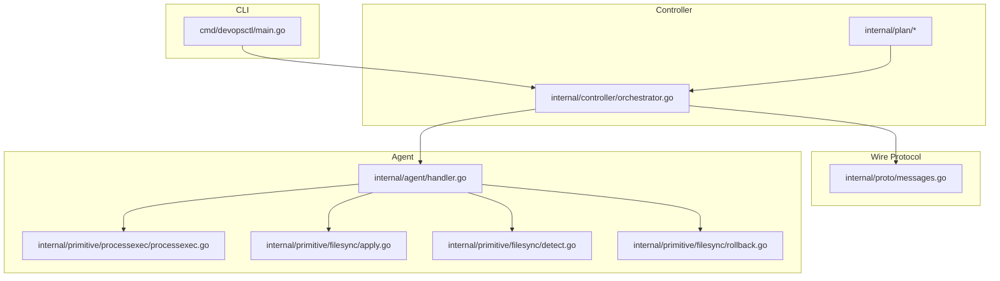
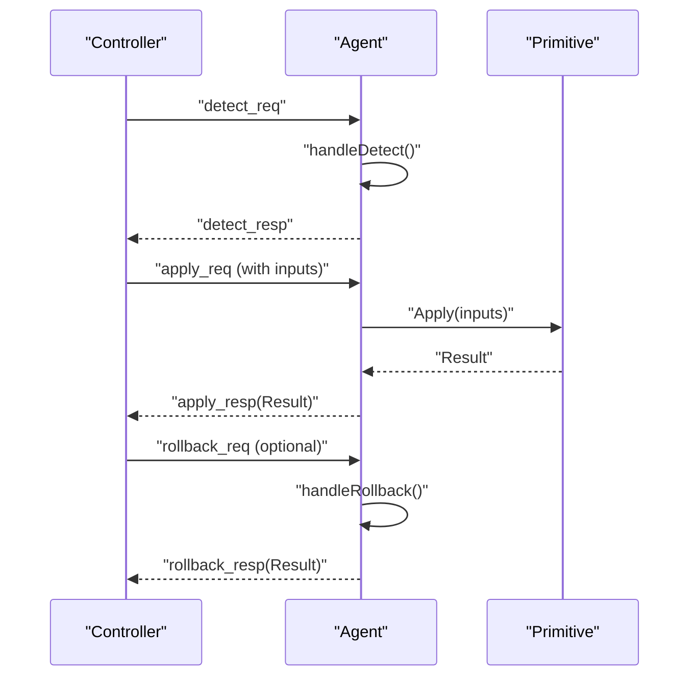
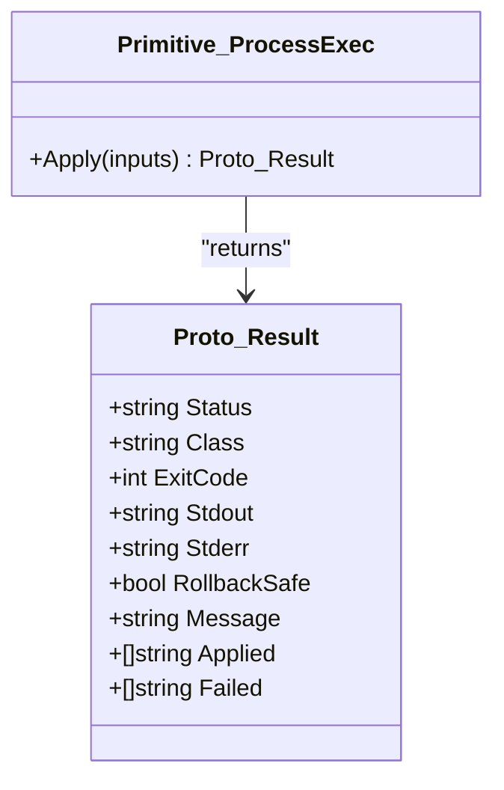
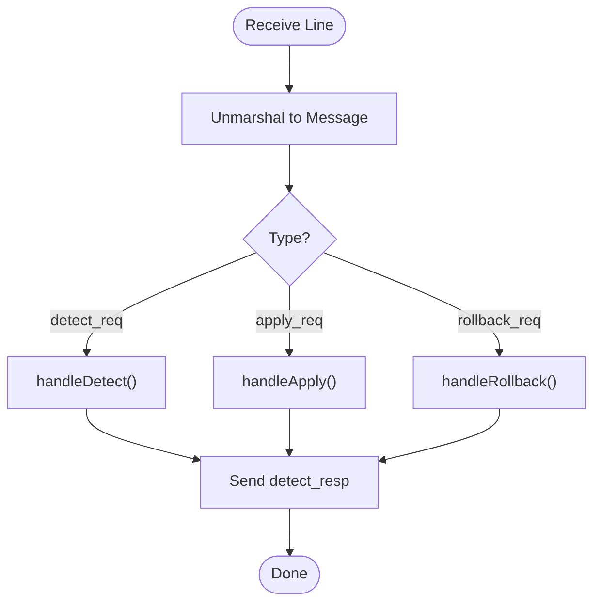
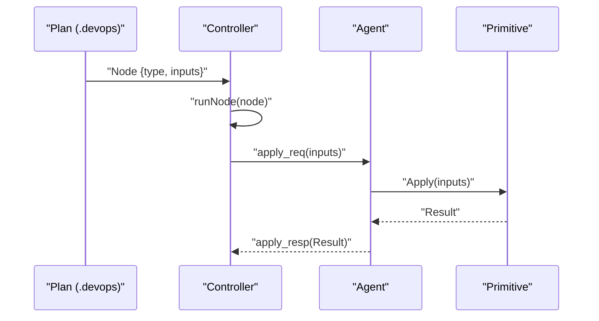
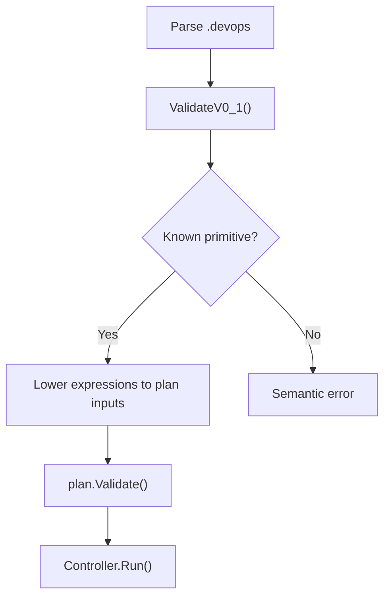
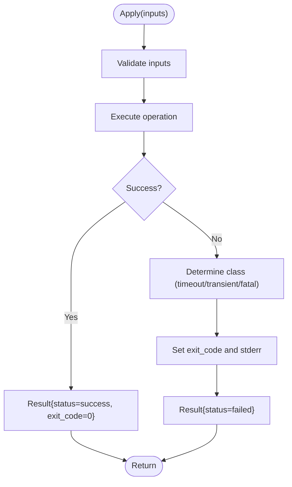
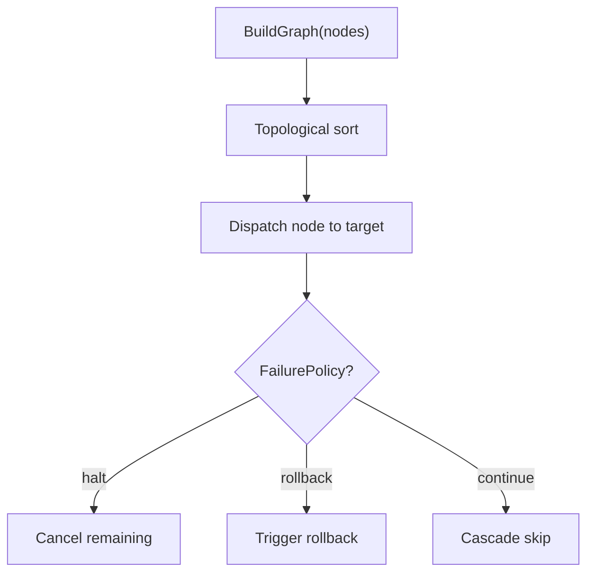
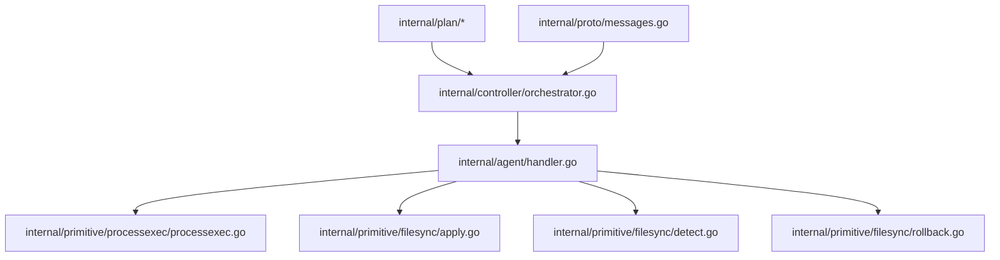

# Extending Primitives

<cite>
**Referenced Files in This Document**
- [processexec.go](file://internal/primitive/processexec/processexec.go)
- [messages.go](file://internal/proto/messages.go)
- [orchestrator.go](file://internal/controller/orchestrator.go)
- [schema.go](file://internal/plan/schema.go)
- [validate.go](file://internal/plan/validate.go)
- [handler.go](file://internal/agent/handler.go)
- [apply.go](file://internal/primitive/filesync/apply.go)
- [detect.go](file://internal/primitive/filesync/detect.go)
- [rollback.go](file://internal/primitive/filesync/rollback.go)
- [validate.go](file://internal/devlang/validate.go)
- [lower.go](file://internal/devlang/lower.go)
- [main.go](file://cmd/devopsctl/main.go)
</cite>

## Table of Contents
1. [Introduction](#introduction)
2. [Project Structure](#project-structure)
3. [Core Components](#core-components)
4. [Architecture Overview](#architecture-overview)
5. [Detailed Component Analysis](#detailed-component-analysis)
6. [Dependency Analysis](#dependency-analysis)
7. [Performance Considerations](#performance-considerations)
8. [Troubleshooting Guide](#troubleshooting-guide)
9. [Conclusion](#conclusion)
10. [Appendices](#appendices)

## Introduction
This document explains how to extend DevOpsCtl with custom primitive operations. It covers the primitive interface design, the wire protocol used by the controller and agent, required function signatures, parameter handling, result reporting, registration of new primitive types, invocation from .devops plan nodes, and best practices. It also provides step-by-step examples and templates for building robust, idempotent, and secure primitives.

## Project Structure
DevOpsCtl organizes primitives under internal/primitive/<name>, with the wire protocol defined in internal/proto/messages.go. The controller orchestrates execution via internal/controller/orchestrator.go, while the agent implements handlers in internal/agent/handler.go. Plans are defined in .devops files and lowered into internal/plan structures for execution.

**Diagram sources**
- [main.go](file://cmd/devopsctl/main.go#L32-L84)
- [orchestrator.go](file://internal/controller/orchestrator.go#L34-L311)
- [messages.go](file://internal/proto/messages.go#L10-L116)
- [handler.go](file://internal/agent/handler.go#L16-L189)
- [processexec.go](file://internal/primitive/processexec/processexec.go#L13-L82)
- [apply.go](file://internal/primitive/filesync/apply.go#L19-L204)
- [detect.go](file://internal/primitive/filesync/detect.go#L19-L70)
- [rollback.go](file://internal/primitive/filesync/rollback.go#L11-L82)

**Section sources**
- [main.go](file://cmd/devopsctl/main.go#L32-L84)
- [orchestrator.go](file://internal/controller/orchestrator.go#L34-L311)
- [messages.go](file://internal/proto/messages.go#L7-L116)
- [handler.go](file://internal/agent/handler.go#L16-L189)

## Core Components
- Primitive interface: Each primitive exposes a function Apply(inputs map[string]any) proto.Result. The agent’s handler invokes this function for process.exec and routes other types to specialized implementations.
- Wire protocol: Line-delimited JSON messages define detect_req, apply_req, rollback_req, and corresponding responses. The controller and agent exchange these to coordinate detection, application, and rollback.
- Execution engine: The controller builds an execution graph from plan nodes, enforces dependencies and conditions, and dispatches apply/rollback requests to agents.
- Plan model: Nodes carry type, targets, dependencies, failure policy, inputs, and a deterministic hash used for state tracking.

Key responsibilities:
- Primitive implementations: Validate inputs, perform work, and report structured results.
- Agent handler: Route requests to the correct primitive and stream file chunks for file.sync.
- Controller orchestrator: Manage concurrency, state persistence, and failure policies.

**Section sources**
- [processexec.go](file://internal/primitive/processexec/processexec.go#L13-L82)
- [messages.go](file://internal/proto/messages.go#L10-L116)
- [handler.go](file://internal/agent/handler.go#L88-L139)
- [orchestrator.go](file://internal/controller/orchestrator.go#L302-L311)
- [schema.go](file://internal/plan/schema.go#L24-L76)

## Architecture Overview
The controller and agent communicate over TCP using line-delimited JSON. The controller sends detect_req for discovery, apply_req for changes (including file chunks for file.sync), and rollback_req for reversal. The agent responds with detect_resp, apply_resp, and rollback_resp containing a Result.

**Diagram sources**
- [messages.go](file://internal/proto/messages.go#L16-L75)
- [handler.go](file://internal/agent/handler.go#L53-L139)
- [orchestrator.go](file://internal/controller/orchestrator.go#L313-L442)

## Detailed Component Analysis

### Primitive Interface Design
- Function signature: Apply(inputs map[string]any) proto.Result
- Inputs: Arbitrary map of any type; primitives must validate required fields and coerce types safely.
- Result: proto.Result includes status, class, exit code, stdout/stderr, rollback safety, and legacy fields for compatibility.

**Diagram sources**
- [processexec.go](file://internal/primitive/processexec/processexec.go#L13-L82)
- [messages.go](file://internal/proto/messages.go#L103-L116)

**Section sources**
- [processexec.go](file://internal/primitive/processexec/processexec.go#L13-L82)
- [messages.go](file://internal/proto/messages.go#L103-L116)

### Wire Protocol and Message Types
- Envelope: All messages include a type field. The agent reads one line at a time and routes by type.
- Requests:
  - detect_req: NodeID, Primitive, Inputs
  - apply_req: NodeID, Primitive, PlanHash, ChangeSet
  - rollback_req: NodeID, Primitive, PlanHash
- Responses:
  - detect_resp: NodeID, State, Error
  - apply_resp: NodeID, Result, Error
  - rollback_resp: NodeID, Result, Error
- Streaming: File chunks are sent as chunk messages until a sentinel EOF marker.

**Diagram sources**
- [messages.go](file://internal/proto/messages.go#L10-L75)
- [handler.go](file://internal/agent/handler.go#L16-L51)

**Section sources**
- [messages.go](file://internal/proto/messages.go#L7-L116)
- [handler.go](file://internal/agent/handler.go#L16-L51)

### Registration and Invocation from Plan Nodes
- Registration: New primitive types are integrated by adding a case in the controller’s runNode routing and the agent’s handler switch. Currently supported types include file.sync and process.exec.
- Invocation: The controller selects the appropriate runX method based on node.Type and sends apply_req with node inputs. The agent’s handleApply delegates to the matching primitive’s Apply function.

**Diagram sources**
- [orchestrator.go](file://internal/controller/orchestrator.go#L302-L311)
- [handler.go](file://internal/agent/handler.go#L88-L106)

**Section sources**
- [orchestrator.go](file://internal/controller/orchestrator.go#L302-L311)
- [handler.go](file://internal/agent/handler.go#L88-L106)

### Parameter Handling and Validation
- Plan-level validation: Ensures required attributes for each type (e.g., file.sync requires src and dest; process.exec requires cmd and cwd).
- Primitive-level validation: Apply functions must validate inputs and return structured failures via Result.
- DSL lowering: The .devops compiler lowers string literals and non-empty lists of string literals into plan inputs.

**Diagram sources**
- [validate.go](file://internal/devlang/validate.go#L112-L207)
- [lower.go](file://internal/devlang/lower.go#L67-L90)
- [validate.go](file://internal/plan/validate.go#L69-L90)

**Section sources**
- [validate.go](file://internal/devlang/validate.go#L112-L207)
- [lower.go](file://internal/devlang/lower.go#L67-L90)
- [validate.go](file://internal/plan/validate.go#L69-L90)

### Result Reporting Mechanisms
- Success: Status "success", optional stdout/stderr, exit code 0, rollback safety flag set appropriately.
- Failure: Status "failed", class indicating transient/fatal, exit code populated, stderr with diagnostics.
- Partial: Used by file.sync to indicate applied and failed subsets; controller treats partial as failed unless policy allows continuation.

**Diagram sources**
- [processexec.go](file://internal/primitive/processexec/processexec.go#L49-L81)

**Section sources**
- [processexec.go](file://internal/primitive/processexec/processexec.go#L49-L81)

### Relationship to Dependency Resolution and Execution Graph
- The controller builds a directed acyclic graph from nodes, enforcing depends_on edges and when conditions.
- Execution proceeds in topological order; failures trigger cascading skips or rollbacks depending on failure policy.
- Node hashing includes type, target, and inputs to uniquely identify units of execution for state tracking.

**Diagram sources**
- [orchestrator.go](file://internal/controller/orchestrator.go#L46-L291)
- [schema.go](file://internal/plan/schema.go#L54-L76)

**Section sources**
- [orchestrator.go](file://internal/controller/orchestrator.go#L46-L291)
- [schema.go](file://internal/plan/schema.go#L54-L76)

### Step-by-Step Examples

#### Example 1: Basic Command Execution (process.exec)
- Define a node with type "process.exec" and inputs cmd (non-empty list of strings) and cwd (string).
- The controller sends apply_req with inputs; the agent calls the process.exec primitive’s Apply function.
- The primitive validates cmd and cwd, executes the command with optional timeout, and returns a Result.

Implementation pattern:
- Validate inputs in Apply.
- Build command from inputs and run with context cancellation and optional timeout.
- Capture stdout/stderr and set exit code; classify errors and set status accordingly.

**Section sources**
- [validate.go](file://internal/plan/validate.go#L79-L87)
- [processexec.go](file://internal/primitive/processexec/processexec.go#L13-L82)
- [handler.go](file://internal/agent/handler.go#L98-L105)

#### Example 2: File Synchronization (file.sync)
- The controller performs detect → diff → apply with streaming file chunks.
- The agent’s handleApply streams chunks to filesync.Apply, which writes atomically and snapshots for rollback.
- Rollback restores from the snapshot directory and removes newly created files.

Implementation pattern:
- Implement Apply(dest, cs, inputs, chunkReader) to stream and apply changes in a safe order.
- Implement Rollback(dest, cs) to restore snapshots and clean up.
- Keep track of rollback safety and return appropriate statuses.

**Section sources**
- [orchestrator.go](file://internal/controller/orchestrator.go#L313-L442)
- [handler.go](file://internal/agent/handler.go#L88-L139)
- [apply.go](file://internal/primitive/filesync/apply.go#L19-L204)
- [rollback.go](file://internal/primitive/filesync/rollback.go#L11-L82)

#### Example 3: Custom Primitive (conceptual)
- Choose a unique type name (e.g., myorg.myop).
- Add a case in controller.runNode and agent.handler to route to your primitive.
- Implement Apply(inputs map[string]any) proto.Result in internal/primitive/myop/.
- Validate inputs and return structured Result with status, class, exit_code, stdout/stderr, and rollback safety.
- Register the type in the DSL validator and plan schema if you want to support .devops syntax.

[No sources needed since this section provides conceptual guidance]

### Templates and Boilerplate Patterns
- Minimal Apply template: Validate required inputs, perform operation, populate Result fields, and return.
- Streaming Apply template: Accept a chunkReader function, stream chunks, and apply changes in a safe order.
- Error classification template: Distinguish transient vs fatal errors; set class and exit_code accordingly.

[No sources needed since this section provides conceptual guidance]

### Security Considerations
- Validate and sanitize all inputs; avoid shell injection when executing commands.
- Restrict file operations to intended destinations; enforce permissions and ownership carefully.
- Use timeouts and cancellations to prevent hanging operations.
- Limit primitive capabilities to least privilege; avoid unnecessary system access.

[No sources needed since this section provides general guidance]

### Testing Strategies
- Unit tests for primitives: Verify Apply returns correct Result for normal and error cases.
- Integration tests: Simulate controller-agent communication using the wire protocol.
- End-to-end tests: Compile .devops plans, run apply/reconcile/rollback, and assert state transitions.

[No sources needed since this section provides general guidance]

## Dependency Analysis
The controller orchestrator depends on plan definitions and the wire protocol to dispatch work to agents. The agent handler depends on primitive packages and the wire protocol to execute Apply and rollback. The plan module validates node semantics and inputs.

**Diagram sources**
- [orchestrator.go](file://internal/controller/orchestrator.go#L34-L311)
- [handler.go](file://internal/agent/handler.go#L88-L139)
- [messages.go](file://internal/proto/messages.go#L10-L116)

**Section sources**
- [orchestrator.go](file://internal/controller/orchestrator.go#L34-L311)
- [handler.go](file://internal/agent/handler.go#L88-L139)
- [messages.go](file://internal/proto/messages.go#L10-L116)

## Performance Considerations
- Streaming file transfers: Use chunked transfer to avoid loading entire files into memory.
- Concurrency: Tune parallelism to balance throughput and resource usage.
- Idempotency: Design primitives to tolerate repeated application without side effects.
- Logging: Emit concise logs and include structured fields for observability.

[No sources needed since this section provides general guidance]

## Troubleshooting Guide
Common issues and resolutions:
- Unknown primitive type: Ensure the type is registered in controller.runNode and agent.handler.
- Missing required inputs: Add validation in both plan-level and primitive-level Apply.
- Timeout or transient failures: Set class appropriately and rely on retry or rollback policies.
- Rollback not triggered: Confirm rollback safety and failure policy settings.

**Section sources**
- [validate.go](file://internal/plan/validate.go#L69-L90)
- [processexec.go](file://internal/primitive/processexec/processexec.go#L56-L76)
- [handler.go](file://internal/agent/handler.go#L147-L173)

## Conclusion
Extending DevOpsCtl with custom primitives involves implementing Apply, integrating with the wire protocol, registering the type in both controller and agent, and ensuring robust validation, error handling, and idempotency. By following the patterns shown here, you can add powerful, reliable operations to your execution plans.

[No sources needed since this section summarizes without analyzing specific files]

## Appendices

### Best Practices Checklist
- Validate inputs early and fail fast.
- Return structured Result with accurate status and class.
- Support timeouts and cancellations.
- Keep operations idempotent when possible.
- Use streaming for large data transfers.
- Log meaningful stdout/stderr for diagnostics.
- Implement rollback when feasible.

[No sources needed since this section provides general guidance]