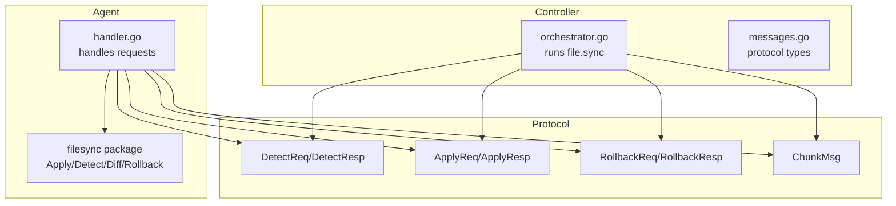
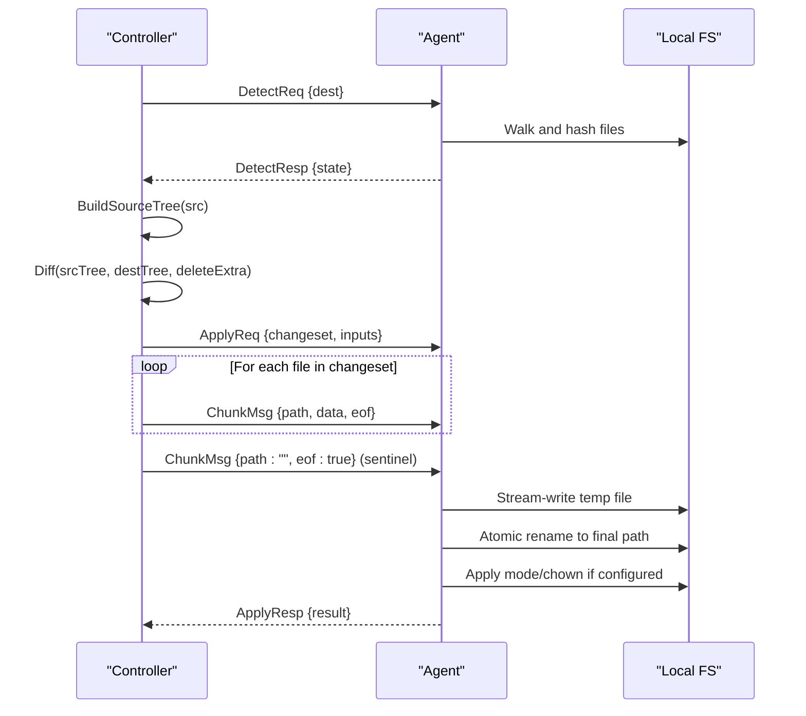
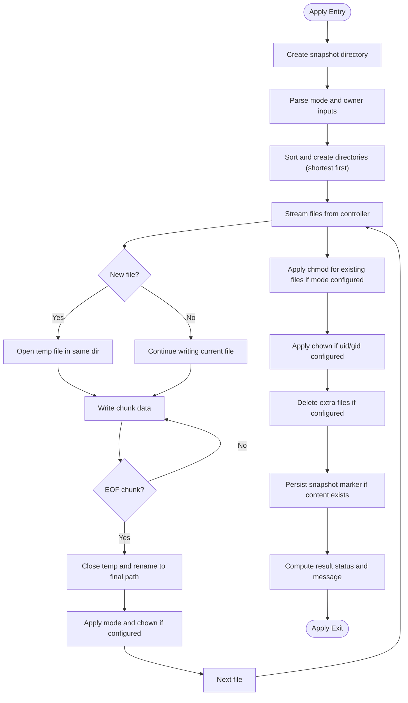
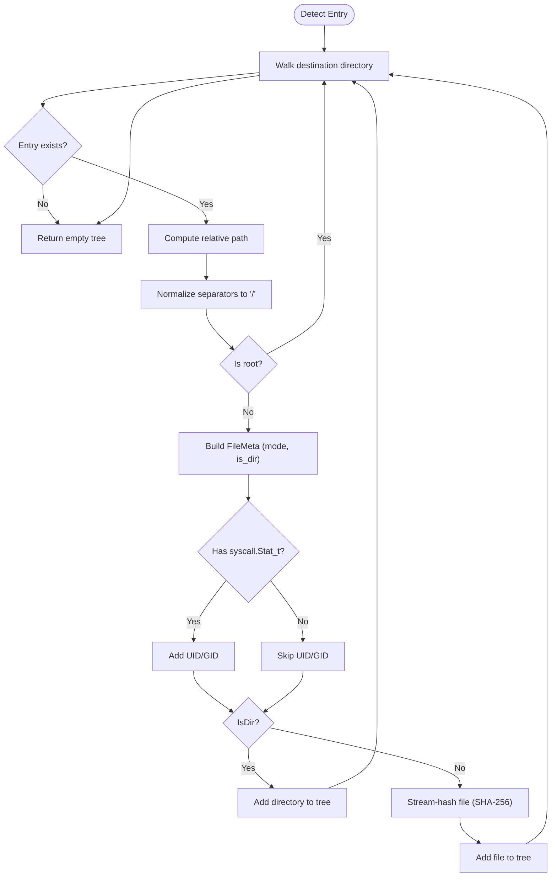
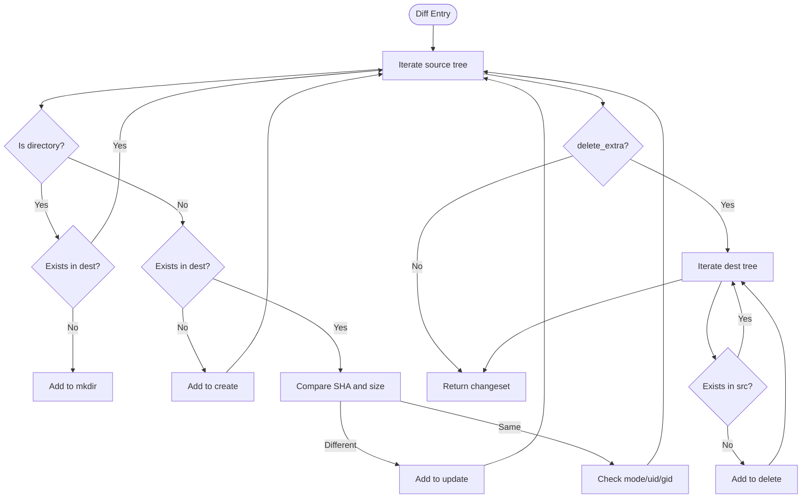
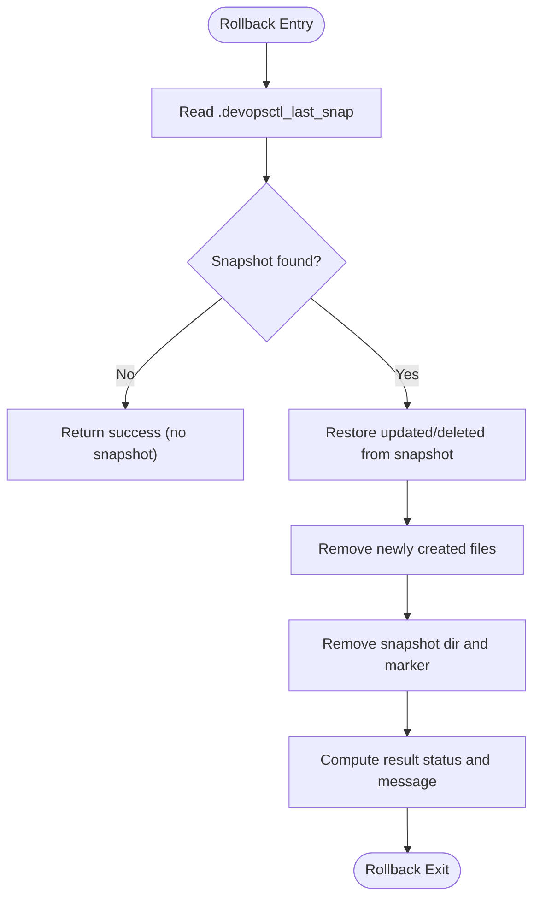
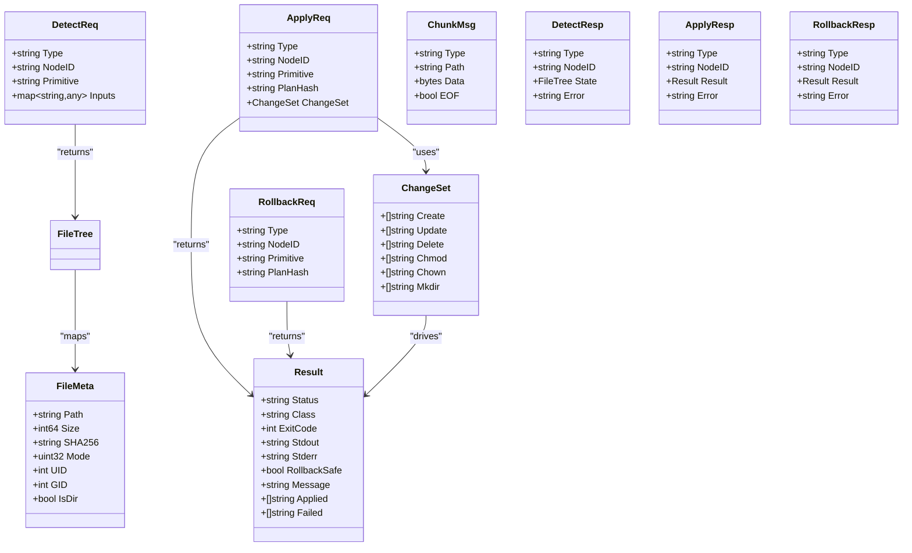
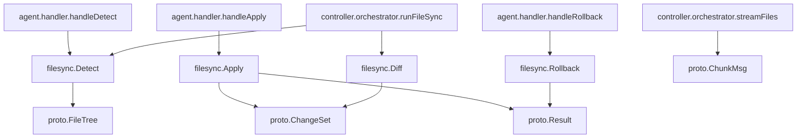

# File Synchronization Primitive

<cite>
**Referenced Files in This Document**
- [apply.go](file://internal/primitive/filesync/apply.go)
- [detect.go](file://internal/primitive/filesync/detect.go)
- [diff.go](file://internal/primitive/filesync/diff.go)
- [rollback.go](file://internal/primitive/filesync/rollback.go)
- [messages.go](file://internal/proto/messages.go)
- [handler.go](file://internal/agent/handler.go)
- [orchestrator.go](file://internal/controller/orchestrator.go)
- [plan.devops](file://plan.devops)
- [filesync_test.go](file://internal/primitive/filesync/filesync_test.go)
</cite>

## Table of Contents
1. [Introduction](#introduction)
2. [Project Structure](#project-structure)
3. [Core Components](#core-components)
4. [Architecture Overview](#architecture-overview)
5. [Detailed Component Analysis](#detailed-component-analysis)
6. [Dependency Analysis](#dependency-analysis)
7. [Performance Considerations](#performance-considerations)
8. [Troubleshooting Guide](#troubleshooting-guide)
9. [Conclusion](#conclusion)
10. [Appendices](#appendices)

## Introduction
This document explains the file synchronization primitive used by DevOpsCtl to reconcile local filesystem states across agents. It focuses on the Apply function that executes changesets on local filesystems with streaming transfer capabilities, directory creation ordering, atomic file operations, and permission management. It also documents the change detection algorithms in detect.go, diff calculation in diff.go, and the rollback mechanism in rollback.go. Configuration options such as mode and owner settings, parameter specifications, return value formats, practical examples, and troubleshooting guidance are included.

## Project Structure
The file synchronization primitive is implemented in the filesync package and integrates with the controller and agent through a line-delimited JSON protocol.

**Diagram sources**
- [orchestrator.go](file://internal/controller/orchestrator.go#L320-L442)
- [handler.go](file://internal/agent/handler.go#L16-L189)
- [messages.go](file://internal/proto/messages.go#L14-L117)

**Section sources**
- [orchestrator.go](file://internal/controller/orchestrator.go#L320-L442)
- [handler.go](file://internal/agent/handler.go#L16-L189)
- [messages.go](file://internal/proto/messages.go#L14-L117)

## Core Components
- Detect: Walks the destination directory and builds a FileTree snapshot with streaming SHA-256 hashing for files.
- Diff: Computes the changeset between source and destination trees, including create, update, delete, chmod, chown, and mkdir actions.
- Apply: Executes the changeset on the local filesystem with streaming file transfer, atomic file replacement, and permission management.
- Rollback: Restores the destination to the state before the last apply using snapshot directories.

**Section sources**
- [detect.go](file://internal/primitive/filesync/detect.go#L19-L70)
- [diff.go](file://internal/primitive/filesync/diff.go#L7-L67)
- [apply.go](file://internal/primitive/filesync/apply.go#L19-L204)
- [rollback.go](file://internal/primitive/filesync/rollback.go#L11-L82)

## Architecture Overview
The file synchronization flow consists of:
- Detect phase: Controller requests agent to scan destination state.
- Diff phase: Controller compares source and destination trees to compute a changeset.
- Apply phase: Controller streams file chunks to the agent, which writes atomically and applies permissions.
- Rollback phase: Agent restores previous state using snapshots.

**Diagram sources**
- [orchestrator.go](file://internal/controller/orchestrator.go#L324-L411)
- [handler.go](file://internal/agent/handler.go#L88-L139)
- [apply.go](file://internal/primitive/filesync/apply.go#L19-L204)
- [messages.go](file://internal/proto/messages.go#L16-L75)

## Detailed Component Analysis

### Apply: Streaming File Transfer and Atomic Operations
Apply executes a changeset on the local filesystem with the following steps:
- Directory creation ordering: Sort directories by length (shortest first) to ensure parent directories are created before children.
- Streaming file transfer: Reads ChunkMsg lines from the controller and writes to temporary files in the same directory as the destination path.
- Atomic file replacement: After writing, closes the temporary file and renames it to the final path, ensuring no partial files remain.
- Permission management: Applies mode immediately after rename and chown if numeric uid/gid are provided.
- Deletion: Optionally deletes extra files not present in the source tree, snapshotting them first.

Key behaviors:
- Snapshot directory naming uses a timestamp suffix to avoid collisions.
- The snapshot directory marker is persisted to enable rollback.
- Status and message reporting reflect success, partial, or failed outcomes.

**Diagram sources**
- [apply.go](file://internal/primitive/filesync/apply.go#L19-L204)

**Section sources**
- [apply.go](file://internal/primitive/filesync/apply.go#L19-L204)

### Detect: FileTree Snapshot with Streaming Hashing
Detect walks the destination directory and returns a FileTree with:
- Relative paths normalized to forward slashes.
- Directory entries marked with IsDir.
- File entries include size, mode, and SHA-256 hash computed via streaming (no full-buffering).
- UID/GID captured on systems that support it.

**Diagram sources**
- [detect.go](file://internal/primitive/filesync/detect.go#L19-L70)

**Section sources**
- [detect.go](file://internal/primitive/filesync/detect.go#L19-L70)

### Diff: Efficient Changeset Calculation
Diff computes the delta between source and destination trees:
- Create: file exists in source but not in destination.
- Update: file exists in both but SHA or size differ.
- Delete: file exists in destination but not in source (only when delete_extra is true).
- Chmod: mode differs for files that exist in both.
- Chown: uid or gid differs for files that exist in both.
- Mkdir: directory needed in destination.

It also provides an IsEmpty helper to detect no-op changesets.

**Diagram sources**
- [diff.go](file://internal/primitive/filesync/diff.go#L7-L67)

**Section sources**
- [diff.go](file://internal/primitive/filesync/diff.go#L7-L67)

### Rollback: Snapshot-Based Restoration
Rollback restores the destination to the state before the last apply:
- Reads the snapshot directory path from a marker file.
- Restores updated and deleted files from the snapshot back to the destination.
- Removes newly created files (those in changeset.Create) that have no snapshot.
- Cleans up snapshot directory and marker.

**Diagram sources**
- [rollback.go](file://internal/primitive/filesync/rollback.go#L11-L82)

**Section sources**
- [rollback.go](file://internal/primitive/filesync/rollback.go#L11-L82)

### Protocol Types and Message Flow
The protocol defines request/response envelopes and the ChunkMsg used for streaming file data.

**Diagram sources**
- [messages.go](file://internal/proto/messages.go#L14-L117)

**Section sources**
- [messages.go](file://internal/proto/messages.go#L14-L117)

## Dependency Analysis
The filesync package integrates with the controller and agent through the protocol types and handlers.

**Diagram sources**
- [apply.go](file://internal/primitive/filesync/apply.go#L19-L204)
- [detect.go](file://internal/primitive/filesync/detect.go#L19-L70)
- [diff.go](file://internal/primitive/filesync/diff.go#L7-L67)
- [rollback.go](file://internal/primitive/filesync/rollback.go#L11-L82)
- [messages.go](file://internal/proto/messages.go#L14-L117)
- [handler.go](file://internal/agent/handler.go#L53-L173)
- [orchestrator.go](file://internal/controller/orchestrator.go#L320-L442)

**Section sources**
- [apply.go](file://internal/primitive/filesync/apply.go#L19-L204)
- [detect.go](file://internal/primitive/filesync/detect.go#L19-L70)
- [diff.go](file://internal/primitive/filesync/diff.go#L7-L67)
- [rollback.go](file://internal/primitive/filesync/rollback.go#L11-L82)
- [messages.go](file://internal/proto/messages.go#L14-L117)
- [handler.go](file://internal/agent/handler.go#L53-L173)
- [orchestrator.go](file://internal/controller/orchestrator.go#L320-L442)

## Performance Considerations
- Streaming hashing: Detect computes SHA-256 by streaming file content without buffering entire files, reducing memory usage.
- Streaming transfer: Controller sends file chunks to the agent, avoiding full-buffering of large files.
- Chunk size: Both Detect and streamFiles use 256 KB chunks for efficient I/O.
- Directory ordering: Sorting directories by length ensures minimal parent-child dependency issues and reduces failures.
- Atomic writes: Temporary files are renamed atomically, preventing partial writes and race conditions.

[No sources needed since this section provides general guidance]

## Troubleshooting Guide
Common issues and resolutions:
- Partial apply status: Indicates some operations failed while others succeeded. Review the Failed list in the Result and inspect logs for the specific paths.
- Missing snapshot: Rollback returns success with a message indicating no snapshot was found. Ensure Apply ran successfully and persisted the snapshot marker.
- Permission errors: Verify numeric uid/gid inputs and ensure the agent process has sufficient privileges to change ownership and modes.
- Large file transfers: Confirm network stability and chunk sizes. Streaming minimizes memory usage but still requires reliable connections.
- Directory creation failures: Check parent directory permissions and ensure the sort order is respected (shortest first).

**Section sources**
- [apply.go](file://internal/primitive/filesync/apply.go#L191-L202)
- [rollback.go](file://internal/primitive/filesync/rollback.go#L22-L29)

## Conclusion
The file synchronization primitive provides a robust, streaming-based mechanism to reconcile filesystem states across agents. It emphasizes atomicity, permission control, and safety through snapshots and rollback. The detect, diff, apply, and rollback components work together to deliver efficient and reliable file synchronization suitable for production DevOps workflows.

[No sources needed since this section summarizes without analyzing specific files]

## Appendices

### Configuration Options and Parameter Specifications
- Inputs supported by Apply (agent-side):
  - dest: destination directory path
  - mode: optional octal permission string (e.g., "0755") parsed as octal
  - owner: optional numeric uid
  - group: optional numeric gid
- Controller-side inputs for file.sync nodes:
  - src: source directory path
  - dest: destination directory path
  - delete_extra: boolean to remove files not present in source
- Protocol messages:
  - DetectReq/DetectResp: request and response for scanning destination state
  - ApplyReq/ApplyResp: request and response for applying changesets with streaming chunks
  - RollbackReq/RollbackResp: request and response for rolling back the last apply
  - ChunkMsg: streaming file data chunks

**Section sources**
- [apply.go](file://internal/primitive/filesync/apply.go#L27-L28)
- [handler.go](file://internal/agent/handler.go#L125-L129)
- [messages.go](file://internal/proto/messages.go#L16-L75)
- [plan.devops](file://plan.devops#L5-L11)

### Practical Examples
- Example .devops plan with file.sync node:
  - Defines a target and a node of type file.sync with src and dest inputs.
- Typical configuration patterns:
  - delete_extra enabled to enforce a strict mirror of source
  - mode and owner/group specified for consistent permissions
- Testing coverage:
  - Detect on non-existent directories returns empty trees
  - Diff detects create, mkdir, update, and delete_extra scenarios
  - IsEmpty correctly identifies no-op changesets

**Section sources**
- [plan.devops](file://plan.devops#L1-L20)
- [filesync_test.go](file://internal/primitive/filesync/filesync_test.go#L12-L110)

### Security Implications and Best Practices
- Atomic file replacement prevents partial writes and race conditions.
- Snapshots enable safe rollback to previous states.
- Numeric uid/gid are required for chown to avoid ambiguous user/group resolution.
- Permissions should be set conservatively and validated post-apply.
- Ensure the agent process has appropriate filesystem permissions for mkdir, chown, and chown operations.

**Section sources**
- [apply.go](file://internal/primitive/filesync/apply.go#L61-L76)
- [apply.go](file://internal/primitive/filesync/apply.go#L109-L115)
- [apply.go](file://internal/primitive/filesync/apply.go#L173-L176)