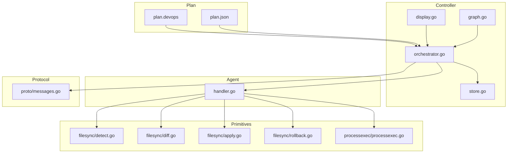
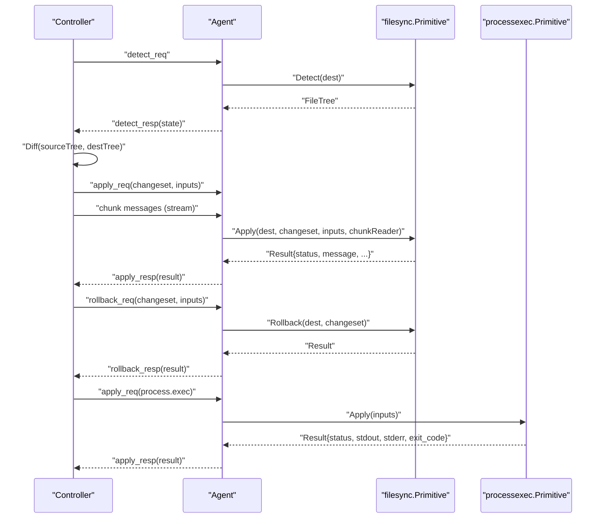
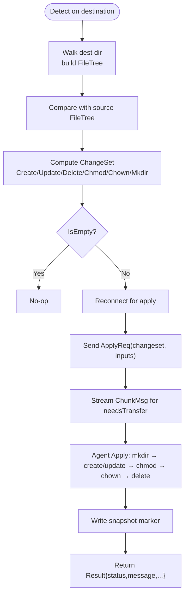
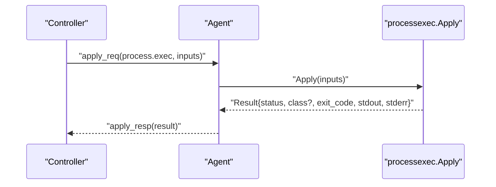
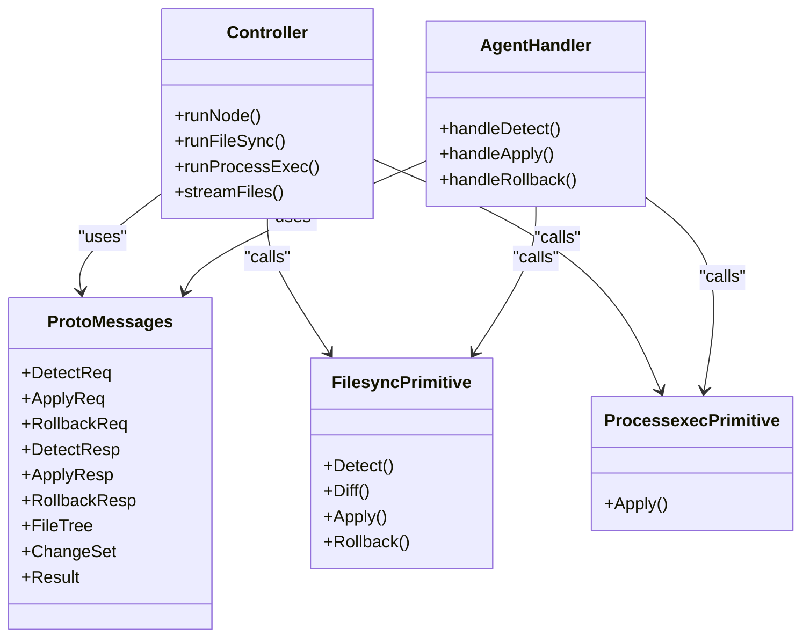
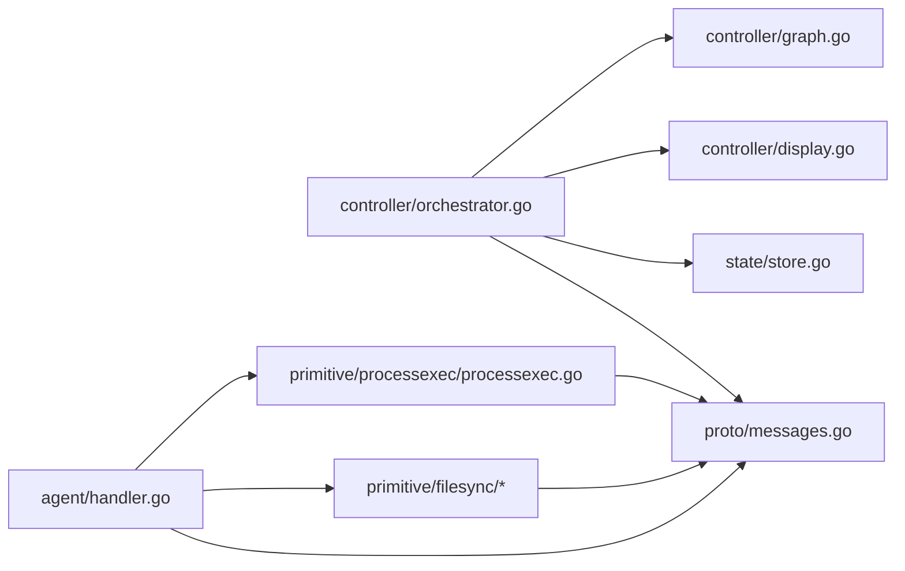
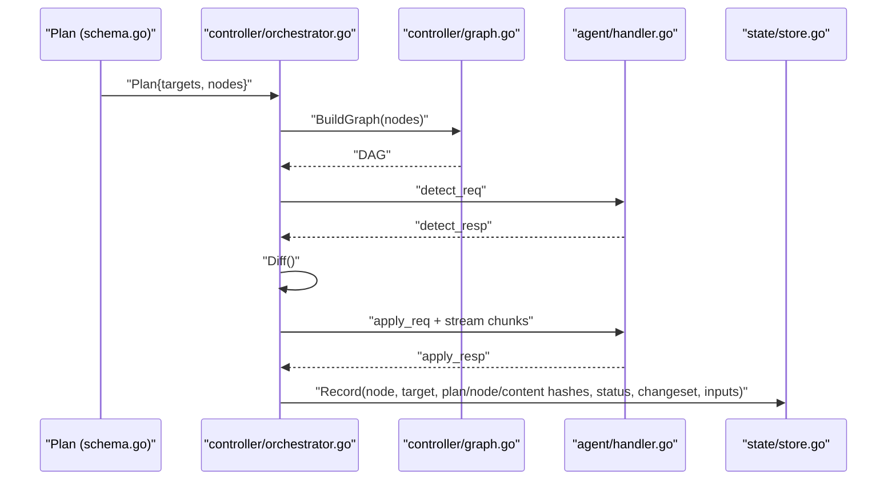

# Primitive Operations

<cite>
**Referenced Files in This Document**
- [messages.go](file://internal/proto/messages.go)
- [schema.go](file://internal/plan/schema.go)
- [validate.go](file://internal/plan/validate.go)
- [orchestrator.go](file://internal/controller/orchestrator.go)
- [display.go](file://internal/controller/display.go)
- [graph.go](file://internal/controller/graph.go)
- [store.go](file://internal/state/store.go)
- [handler.go](file://internal/agent/handler.go)
- [detect.go](file://internal/primitive/filesync/detect.go)
- [diff.go](file://internal/primitive/filesync/diff.go)
- [apply.go](file://internal/primitive/filesync/apply.go)
- [rollback.go](file://internal/primitive/filesync/rollback.go)
- [processexec.go](file://internal/primitive/processexec/processexec.go)
- [plan.devops](file://plan.devops)
- [plan.json](file://plan.json)
</cite>

## Table of Contents
1. [Introduction](#introduction)
2. [Project Structure](#project-structure)
3. [Core Components](#core-components)
4. [Architecture Overview](#architecture-overview)
5. [Detailed Component Analysis](#detailed-component-analysis)
6. [Dependency Analysis](#dependency-analysis)
7. [Performance Considerations](#performance-considerations)
8. [Security Implications](#security-implications)
9. [Troubleshooting Guide](#troubleshooting-guide)
10. [Conclusion](#conclusion)
11. [Appendices](#appendices)

## Introduction
This document explains DevOpsCtl’s primitive operations that perform actual infrastructure changes. It focuses on two primitives:
- file.sync: file synchronization with change detection, diff computation, streaming transfer, and rollback
- process.exec: command execution with working directory, timeouts, and exit code handling

It also documents the primitive interface design, how new primitive types can be added, configuration options, parameter specifications, return value formats, and the relationship between primitives and the execution engine. Practical examples and common configuration patterns are included, along with performance considerations, security implications, and troubleshooting guidance.

## Project Structure
DevOpsCtl organizes primitives under internal/primitive, with protocol definitions in internal/proto, orchestration in internal/controller, agent handling in internal/agent, and state persistence in internal/state. Plans define nodes and inputs in plan.devops and plan.json.

**Diagram sources**
- [orchestrator.go](file://internal/controller/orchestrator.go#L303-L311)
- [handler.go](file://internal/agent/handler.go#L16-L51)
- [messages.go](file://internal/proto/messages.go#L14-L75)
- [detect.go](file://internal/primitive/filesync/detect.go#L19-L70)
- [diff.go](file://internal/primitive/filesync/diff.go#L7-L67)
- [apply.go](file://internal/primitive/filesync/apply.go#L19-L204)
- [rollback.go](file://internal/primitive/filesync/rollback.go#L11-L82)
- [processexec.go](file://internal/primitive/processexec/processexec.go#L13-L82)
- [store.go](file://internal/state/store.go#L68-L84)
- [display.go](file://internal/controller/display.go#L18-L43)
- [graph.go](file://internal/controller/graph.go#L9-L48)
- [plan.devops](file://plan.devops#L1-L20)
- [plan.json](file://plan.json#L1-L25)

**Section sources**
- [orchestrator.go](file://internal/controller/orchestrator.go#L303-L311)
- [handler.go](file://internal/agent/handler.go#L16-L51)
- [messages.go](file://internal/proto/messages.go#L14-L75)
- [store.go](file://internal/state/store.go#L68-L84)
- [display.go](file://internal/controller/display.go#L18-L43)
- [graph.go](file://internal/controller/graph.go#L9-L48)
- [plan.devops](file://plan.devops#L1-L20)
- [plan.json](file://plan.json#L1-L25)

## Core Components
- file.sync primitive
  - Detect: builds a FileTree snapshot of the destination directory (streams SHA-256, normalizes paths, captures permissions and ownership where available)
  - Diff: compares source and destination FileTrees to compute Create, Update, Delete, Chmod, Chown, Mkdir actions
  - Apply: safely applies changes via streaming file chunks, atomic writes, metadata updates, optional deletion of extra files, and snapshots for rollback
  - Rollback: restores destination from the last snapshot, removes newly created files without prior version
- process.exec primitive
  - Executes commands locally with cwd, timeout, and exit code classification
  - Returns structured result with stdout/stderr, exit code, and status classification

**Section sources**
- [detect.go](file://internal/primitive/filesync/detect.go#L19-L70)
- [diff.go](file://internal/primitive/filesync/diff.go#L7-L67)
- [apply.go](file://internal/primitive/filesync/apply.go#L19-L204)
- [rollback.go](file://internal/primitive/filesync/rollback.go#L11-L82)
- [processexec.go](file://internal/primitive/processexec/processexec.go#L13-L82)

## Architecture Overview
The execution engine coordinates detect-diff-apply cycles for file.sync and direct apply for process.exec. Controllers and agents communicate over a line-delimited JSON protocol with DetectReq, ApplyReq, RollbackReq and corresponding responses.

**Diagram sources**
- [orchestrator.go](file://internal/controller/orchestrator.go#L313-L442)
- [orchestrator.go](file://internal/controller/orchestrator.go#L444-L513)
- [handler.go](file://internal/agent/handler.go#L53-L86)
- [handler.go](file://internal/agent/handler.go#L88-L139)
- [handler.go](file://internal/agent/handler.go#L147-L173)
- [messages.go](file://internal/proto/messages.go#L16-L75)
- [detect.go](file://internal/primitive/filesync/detect.go#L19-L70)
- [diff.go](file://internal/primitive/filesync/diff.go#L7-L67)
- [apply.go](file://internal/primitive/filesync/apply.go#L19-L204)
- [rollback.go](file://internal/primitive/filesync/rollback.go#L11-L82)
- [processexec.go](file://internal/primitive/processexec/processexec.go#L13-L82)

## Detailed Component Analysis

### File Synchronization Primitive (file.sync)
- Change detection
  - Destination walk: Detect(dir) traverses the destination directory, normalizes paths, captures metadata, and computes SHA-256 via streaming to avoid full-file buffering
  - Source tree: BuildSourceTree(src) mirrors Detect for the controller-side source directory
- Diff calculation
  - Compares FileTrees to produce Create, Update, Delete, Chmod, Chown, Mkdir
  - Supports delete_extra behavior to remove files not present in source
  - IsEmpty detects whether any action is required
- Streaming transfer protocol
  - Controller streams file chunks to the agent after sending ApplyReq with ChangeSet
  - ChunkMsg carries path, binary data, and EOF flag; a sentinel EOF chunk signals end-of-stream
  - Agent reconstructs files atomically using temporary files and rename
- Rollback mechanism
  - Apply creates a snapshot directory and persists a marker file pointing to it
  - Rollback restores overwritten/deleted files from snapshot and removes newly created files without prior version

**Diagram sources**
- [detect.go](file://internal/primitive/filesync/detect.go#L19-L70)
- [diff.go](file://internal/primitive/filesync/diff.go#L7-L67)
- [apply.go](file://internal/primitive/filesync/apply.go#L19-L204)
- [rollback.go](file://internal/primitive/filesync/rollback.go#L11-L82)
- [orchestrator.go](file://internal/controller/orchestrator.go#L373-L411)
- [messages.go](file://internal/proto/messages.go#L25-L49)

**Section sources**
- [detect.go](file://internal/primitive/filesync/detect.go#L19-L70)
- [detect.go](file://internal/primitive/filesync/detect.go#L97-L105)
- [diff.go](file://internal/primitive/filesync/diff.go#L7-L67)
- [apply.go](file://internal/primitive/filesync/apply.go#L19-L204)
- [rollback.go](file://internal/primitive/filesync/rollback.go#L11-L82)
- [orchestrator.go](file://internal/controller/orchestrator.go#L373-L411)
- [messages.go](file://internal/proto/messages.go#L25-L49)

### Process Execution Primitive (process.exec)
- Command execution
  - Accepts cmd as a non-empty array; cwd is required
  - Optional timeout enforces execution limits
  - Captures stdout/stderr and exit code; classifies failures (e.g., timeout)
- Result format
  - Status: success or failed
  - Class: optional classification (e.g., timeout)
  - ExitCode: integer; -1 if not an ExitError
  - Stdout/Stderr: captured output
  - RollbackSafe: false by design (process.exec is not rollbackable)

**Diagram sources**
- [processexec.go](file://internal/primitive/processexec/processexec.go#L13-L82)
- [handler.go](file://internal/agent/handler.go#L98-L106)
- [orchestrator.go](file://internal/controller/orchestrator.go#L444-L513)

**Section sources**
- [processexec.go](file://internal/primitive/processexec/processexec.go#L13-L82)
- [handler.go](file://internal/agent/handler.go#L98-L106)
- [orchestrator.go](file://internal/controller/orchestrator.go#L444-L513)

### Primitive Interface Design and Extensibility
- Protocol contract
  - Messages: DetectReq, ApplyReq, RollbackReq and corresponding responses
  - Inputs are passed through ApplyReq and RollbackReq envelopes
- Controller routing
  - runNode dispatches to runFileSync or runProcessExec based on node.Type
  - Orchestrator handles detect-diff-apply for file.sync and direct apply for process.exec
- Agent dispatch
  - handleConn routes detect/apply/rollback based on message.type
  - For process.exec, agent invokes processexec.Apply; for file.sync, agent invokes filesync.Apply
- Adding a new primitive
  - Implement Apply(inputs map[string]any) proto.Result in a new package under internal/primitive/<name>
  - Extend controller runNode to route new node.Type to a new runXxx function
  - Extend agent handleConn to route new message types or reuse apply_req envelope with new primitive field
  - Update plan validation to require inputs for the new primitive
  - Optionally add rollback support by implementing Rollback(dest string, cs ChangeSet) Result and wiring agent handleRollback

**Diagram sources**
- [messages.go](file://internal/proto/messages.go#L14-L117)
- [orchestrator.go](file://internal/controller/orchestrator.go#L303-L311)
- [handler.go](file://internal/agent/handler.go#L40-L50)
- [detect.go](file://internal/primitive/filesync/detect.go#L19-L70)
- [diff.go](file://internal/primitive/filesync/diff.go#L7-L67)
- [apply.go](file://internal/primitive/filesync/apply.go#L19-L204)
- [rollback.go](file://internal/primitive/filesync/rollback.go#L11-L82)
- [processexec.go](file://internal/primitive/processexec/processexec.go#L13-L82)

**Section sources**
- [messages.go](file://internal/proto/messages.go#L14-L117)
- [orchestrator.go](file://internal/controller/orchestrator.go#L303-L311)
- [handler.go](file://internal/agent/handler.go#L40-L50)
- [detect.go](file://internal/primitive/filesync/detect.go#L19-L70)
- [diff.go](file://internal/primitive/filesync/diff.go#L7-L67)
- [apply.go](file://internal/primitive/filesync/apply.go#L19-L204)
- [rollback.go](file://internal/primitive/filesync/rollback.go#L11-L82)
- [processexec.go](file://internal/primitive/processexec/processexec.go#L13-L82)

## Dependency Analysis
- Controller orchestrates primitives and maintains state
- Agent handles protocol and delegates to primitives
- Primitives depend on shared protocol types
- State store persists execution outcomes

**Diagram sources**
- [orchestrator.go](file://internal/controller/orchestrator.go#L34-L50)
- [handler.go](file://internal/agent/handler.go#L16-L51)
- [messages.go](file://internal/proto/messages.go#L14-L117)
- [store.go](file://internal/state/store.go#L68-L84)
- [display.go](file://internal/controller/display.go#L18-L43)
- [graph.go](file://internal/controller/graph.go#L9-L48)
- [detect.go](file://internal/primitive/filesync/detect.go#L19-L70)
- [diff.go](file://internal/primitive/filesync/diff.go#L7-L67)
- [apply.go](file://internal/primitive/filesync/apply.go#L19-L204)
- [rollback.go](file://internal/primitive/filesync/rollback.go#L11-L82)
- [processexec.go](file://internal/primitive/processexec/processexec.go#L13-L82)

**Section sources**
- [orchestrator.go](file://internal/controller/orchestrator.go#L34-L50)
- [handler.go](file://internal/agent/handler.go#L16-L51)
- [messages.go](file://internal/proto/messages.go#L14-L117)
- [store.go](file://internal/state/store.go#L68-L84)
- [display.go](file://internal/controller/display.go#L18-L43)
- [graph.go](file://internal/controller/graph.go#L9-L48)

## Performance Considerations
- Streaming I/O
  - File hashing and transfers use streaming with fixed chunk size to minimize memory usage
  - Apply writes to temporary files and renames atomically to reduce partial writes risk
- Network efficiency
  - Line-delimited JSON protocol reduces framing overhead
  - Chunk streaming avoids buffering entire files in memory
- Ordering and safety
  - Directory creation ordered shortest-first to ensure parent directories exist before children
  - Atomic rename after write ensures consistent state
- Timeouts
  - process.exec supports configurable timeout to prevent runaway processes

[No sources needed since this section provides general guidance]

## Security Implications
- Privileged operations
  - Chown and chmod are executed on the agent host; ensure inputs are validated and restricted
- Path normalization
  - Paths are normalized and relative to destination/source roots; avoid traversal attacks by relying on controlled inputs
- Snapshot isolation
  - Snapshots are stored under a dedicated directory with restrictive permissions
- Rollback scope
  - process.exec is not rollbackable by design; ensure idempotency or external safeguards for executable steps

[No sources needed since this section provides general guidance]

## Troubleshooting Guide
- file.sync failures
  - Verify dest directory permissions and available disk space
  - Check snapshot marker existence and readability if rollback is needed
  - Inspect diff output to confirm expected changes
- process.exec failures
  - Confirm cmd array and cwd are valid
  - Review exit code and stderr for diagnostics
  - Adjust timeout if process is long-running
- Protocol and connectivity
  - Ensure agent address format and port are correct
  - Validate plan inputs and node types
- State reconciliation
  - Resume or reconcile runs rely on persisted state; check LastSuccessful/LatestExecution queries

**Section sources**
- [rollback.go](file://internal/primitive/filesync/rollback.go#L22-L29)
- [apply.go](file://internal/primitive/filesync/apply.go#L185-L189)
- [processexec.go](file://internal/primitive/processexec/processexec.go#L56-L79)
- [orchestrator.go](file://internal/controller/orchestrator.go#L555-L583)
- [store.go](file://internal/state/store.go#L100-L129)
- [store.go](file://internal/state/store.go#L131-L159)

## Conclusion
DevOpsCtl’s primitives provide robust, streaming, and safe infrastructure changes. The file.sync primitive offers precise change detection, streaming transfer, and reliable rollback, while process.exec delivers controlled command execution with timeouts and clear result reporting. The modular design enables straightforward extension to new primitive types, ensuring consistent behavior across the execution engine.

[No sources needed since this section summarizes without analyzing specific files]

## Appendices

### Primitive Parameter Specifications and Return Values
- file.sync
  - Inputs
    - src: string (source directory path)
    - dest: string (destination directory path)
    - delete_extra: bool or "true" string (optional; remove extra files not in source)
    - mode: octal string (e.g., "0755") (optional; set file permissions)
    - owner: numeric uid (optional)
    - group: numeric gid (optional)
  - Outputs
    - Detect: FileTree (relative paths mapped to FileMeta)
    - Diff: ChangeSet (lists of paths for create/update/delete/chmod/chown/mkdir)
    - Apply: Result (status, message, applied/failed lists, rollback_safe=true)
    - Rollback: Result (status, message, applied/failed lists)
- process.exec
  - Inputs
    - cmd: array of strings (command and arguments)
    - cwd: string (working directory)
    - timeout: number (seconds, optional)
  - Outputs
    - Result (status, class, exit_code, stdout, stderr, rollback_safe=false)

**Section sources**
- [validate.go](file://internal/plan/validate.go#L69-L90)
- [detect.go](file://internal/primitive/filesync/detect.go#L19-L70)
- [diff.go](file://internal/primitive/filesync/diff.go#L7-L67)
- [apply.go](file://internal/primitive/filesync/apply.go#L19-L204)
- [rollback.go](file://internal/primitive/filesync/rollback.go#L11-L82)
- [processexec.go](file://internal/primitive/processexec/processexec.go#L13-L82)

### Relationship Between Primitives and the Execution Engine
- Plan nodes carry type, targets, inputs, dependencies, and failure policy
- Controller builds a dependency graph and executes nodes in topological order
- For each node, controller connects to agent, performs detect-diff-apply, streams file chunks, records state, and triggers rollback if needed
- Agent receives requests, delegates to primitives, and returns structured results

**Diagram sources**
- [schema.go](file://internal/plan/schema.go#L24-L33)
- [graph.go](file://internal/controller/graph.go#L16-L48)
- [orchestrator.go](file://internal/controller/orchestrator.go#L313-L442)
- [handler.go](file://internal/agent/handler.go#L53-L86)
- [store.go](file://internal/state/store.go#L68-L84)

**Section sources**
- [schema.go](file://internal/plan/schema.go#L24-L33)
- [graph.go](file://internal/controller/graph.go#L16-L48)
- [orchestrator.go](file://internal/controller/orchestrator.go#L313-L442)
- [handler.go](file://internal/agent/handler.go#L53-L86)
- [store.go](file://internal/state/store.go#L68-L84)

### Practical Examples
- Example plans
  - DevOps DSL: see plan.devops for file.sync and process.exec nodes
  - JSON plan: see plan.json for equivalent structure
- Common configuration patterns
  - file.sync: specify src and dest; optionally enable delete_extra and set mode/owner/group
  - process.exec: provide cmd array and cwd; optionally set timeout

**Section sources**
- [plan.devops](file://plan.devops#L5-L19)
- [plan.json](file://plan.json#L4-L22)