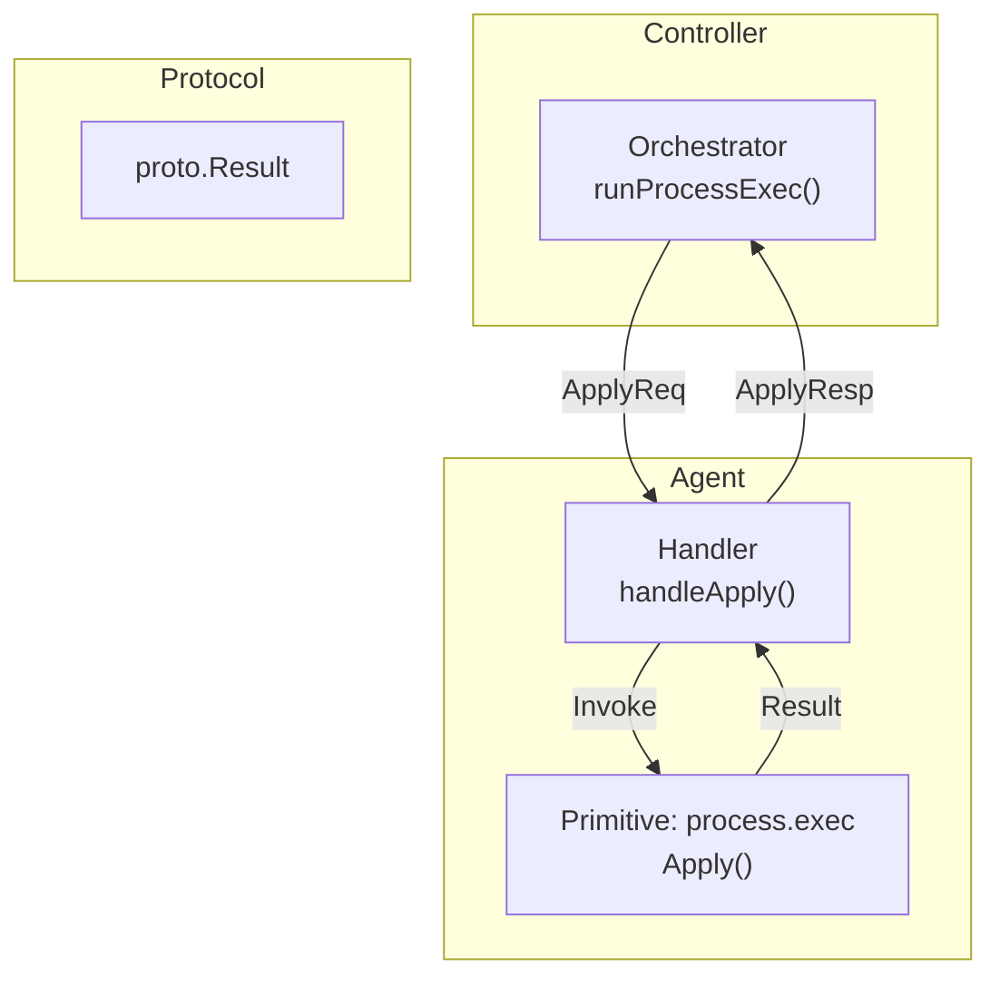
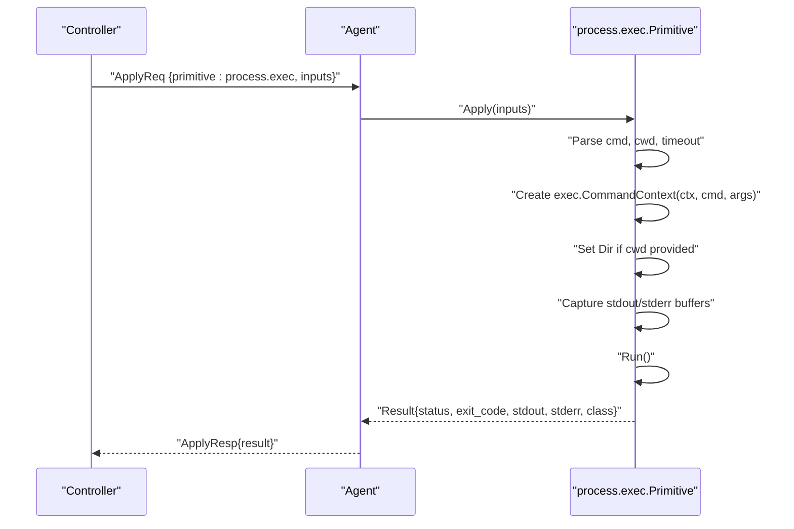
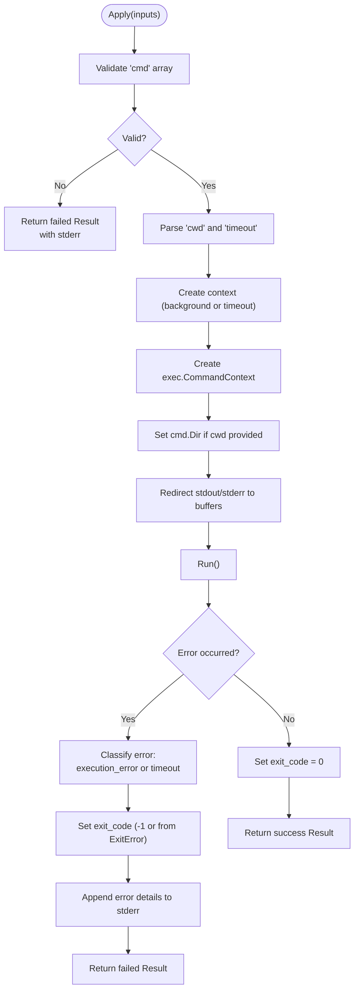
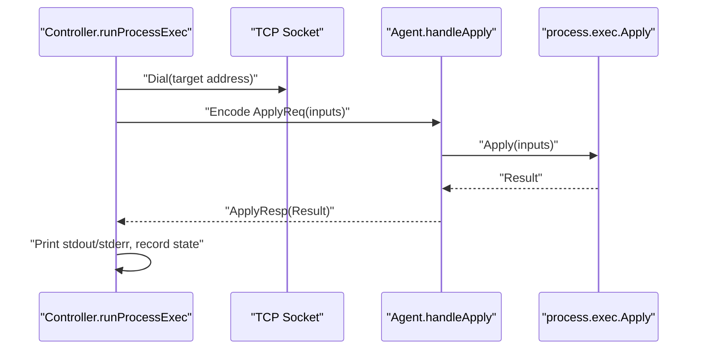
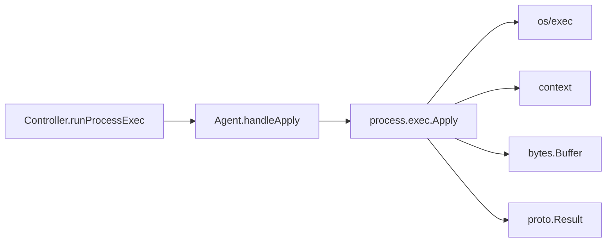

# Process Execution Primitive

<cite>
**Referenced Files in This Document**
- [processexec.go](file://internal/primitive/processexec/processexec.go)
- [messages.go](file://internal/proto/messages.go)
- [handler.go](file://internal/agent/handler.go)
- [orchestrator.go](file://internal/controller/orchestrator.go)
- [validate.go](file://internal/devlang/validate.go)
- [validate.go](file://internal/plan/validate.go)
- [validate_test.go](file://internal/plan/validate_test.go)
- [plan.devops](file://plan.devops)
- [plan.json](file://plan.json)
- [plan_resume.devops](file://tests/e2e/plan_resume.devops)
</cite>

## Table of Contents
1. [Introduction](#introduction)
2. [Project Structure](#project-structure)
3. [Core Components](#core-components)
4. [Architecture Overview](#architecture-overview)
5. [Detailed Component Analysis](#detailed-component-analysis)
6. [Dependency Analysis](#dependency-analysis)
7. [Performance Considerations](#performance-considerations)
8. [Troubleshooting Guide](#troubleshooting-guide)
9. [Conclusion](#conclusion)
10. [Appendices](#appendices)

## Introduction
This document explains the Process Execution Primitive that runs shell commands and processes on target systems. It focuses on the Execute function implementation, covering command execution, working directory management, timeout handling, exit code processing, and stream handling. It also documents configuration options, input parameters, return value formats, error handling, and practical examples from .devops plans. Security considerations, performance implications, and troubleshooting guidance are included.

## Project Structure
The Process Execution Primitive resides under the primitives layer and integrates with the agent and controller layers. The orchestration pipeline sends Apply requests to agents, which execute the primitive locally and return structured results.

**Diagram sources**
- [orchestrator.go](file://internal/controller/orchestrator.go#L444-L513)
- [handler.go](file://internal/agent/handler.go#L90-L106)
- [processexec.go](file://internal/primitive/processexec/processexec.go#L14-L82)
- [messages.go](file://internal/proto/messages.go#L103-L116)

**Section sources**
- [orchestrator.go](file://internal/controller/orchestrator.go#L444-L513)
- [handler.go](file://internal/agent/handler.go#L90-L106)
- [processexec.go](file://internal/primitive/processexec/processexec.go#L1-L82)
- [messages.go](file://internal/proto/messages.go#L103-L116)

## Core Components
- Process Execution Primitive: Executes a command with optional timeout and working directory, captures stdout/stderr, and returns a structured result.
- Protocol Result: Defines the standardized result shape returned by primitives.
- Orchestrator Runner: Sends Apply requests to agents and records outcomes.
- Agent Handler: Dispatches Apply requests to the appropriate primitive.

Key responsibilities:
- Command parsing and argument normalization
- Working directory setting
- Timeout enforcement via context
- Stream capture (stdout/stderr)
- Exit code classification and error reporting
- Dry-run support and logging

**Section sources**
- [processexec.go](file://internal/primitive/processexec/processexec.go#L14-L82)
- [messages.go](file://internal/proto/messages.go#L103-L116)
- [orchestrator.go](file://internal/controller/orchestrator.go#L444-L513)
- [handler.go](file://internal/agent/handler.go#L90-L106)

## Architecture Overview
The primitive is invoked remotely via a JSON wire protocol. The controller initiates execution, the agent executes the process locally, and the result is returned with structured fields.

**Diagram sources**
- [orchestrator.go](file://internal/controller/orchestrator.go#L444-L513)
- [handler.go](file://internal/agent/handler.go#L90-L106)
- [processexec.go](file://internal/primitive/processexec/processexec.go#L14-L82)
- [messages.go](file://internal/proto/messages.go#L103-L116)

## Detailed Component Analysis

### Execute Function Implementation
The Execute function orchestrates command execution with robust error handling and result formatting.

- Input parsing
  - Validates presence and non-emptyness of the command array.
  - Converts mixed-type arguments to strings.
  - Reads optional working directory and timeout values.
- Context and timeout
  - Creates a background context.
  - Applies a timeout via context.WithTimeout when configured.
  - Ensures cancellation is deferred to clean up resources.
- Process creation and configuration
  - Builds exec.CommandContext with the command and arguments.
  - Sets the working directory if provided.
  - Redirects stdout and stderr to in-memory buffers.
- Execution and result construction
  - Runs the command synchronously.
  - Initializes a Result with captured streams.
  - On failure:
    - Classifies as execution_error or timeout depending on context.
    - Extracts exit code when applicable.
    - Appends error details to stderr.
  - On success:
    - Sets exit code to zero.

**Diagram sources**
- [processexec.go](file://internal/primitive/processexec/processexec.go#L14-L82)

**Section sources**
- [processexec.go](file://internal/primitive/processexec/processexec.go#L14-L82)

### Configuration Options and Inputs
- cmd: Non-empty array of command and arguments. Mixed types are converted to strings.
- cwd: Working directory path as a string.
- timeout: Optional numeric timeout in seconds. Zero or omitted disables timeout.

Validation ensures these inputs are present and correctly typed.

**Section sources**
- [processexec.go](file://internal/primitive/processexec/processexec.go#L15-L29)
- [validate.go](file://internal/devlang/validate.go#L176-L205)
- [validate.go](file://internal/plan/validate.go#L78-L85)
- [validate_test.go](file://internal/plan/validate_test.go#L9-L27)

### Return Value Formats
The primitive returns a structured Result with the following fields:
- status: "success" or "failed"
- class: Optional classification ("execution_error", "timeout")
- exit_code: Numeric exit code (0 on success, -1 on non-exit errors, process-specific on ExitError)
- stdout: Captured standard output
- stderr: Captured standard error
- rollback_safe: Always false for process.exec

These fields are defined in the shared protocol.

**Section sources**
- [processexec.go](file://internal/primitive/processexec/processexec.go#L49-L81)
- [messages.go](file://internal/proto/messages.go#L103-L116)

### Stream Handling and Environment
- Streams: stdout and stderr are captured into in-memory buffers and returned in the Result.
- Environment: The primitive does not set environment variables explicitly; it inherits the agent’s environment. There is no explicit mechanism to override environment variables in the current implementation.

Practical implication: If environment isolation is required, consider invoking a shell with explicit environment variables or adjusting the agent’s environment before execution.

**Section sources**
- [processexec.go](file://internal/primitive/processexec/processexec.go#L43-L45)

### Process Lifecycle Management
- Creation: exec.CommandContext is used to create the process with the configured context.
- Execution: cmd.Run blocks until completion or until the context deadline.
- Cleanup: The context cancellation is deferred to ensure resources are released after execution completes.

**Section sources**
- [processexec.go](file://internal/primitive/processexec/processexec.go#L31-L36)
- [processexec.go](file://internal/primitive/processexec/processexec.go#L38-L47)

### Integration with Orchestrator and Agent
- Orchestrator runner:
  - Establishes a TCP connection to the agent.
  - Encodes an ApplyReq with node inputs.
  - Reads the ApplyResp and prints stdout/stderr.
  - Records the outcome in state storage.
  - Treats non-success results as failures.
- Agent handler:
  - Dispatches ApplyReq to the process.exec primitive.
  - Returns ApplyResp with the Result.

**Diagram sources**
- [orchestrator.go](file://internal/controller/orchestrator.go#L444-L513)
- [handler.go](file://internal/agent/handler.go#L90-L106)
- [processexec.go](file://internal/primitive/processexec/processexec.go#L14-L82)

**Section sources**
- [orchestrator.go](file://internal/controller/orchestrator.go#L444-L513)
- [handler.go](file://internal/agent/handler.go#L90-L106)

### Practical Examples from .devops Plans
- Basic command execution:
  - Node type: process.exec
  - Inputs: cmd, cwd
  - Example: running a Go command in a temporary directory.
- Dependency chains:
  - Nodes depend on previous nodes to enforce ordering.
  - Example: a failing node halts downstream execution.

These examples demonstrate real-world usage patterns and dependency management.

**Section sources**
- [plan.devops](file://plan.devops#L13-L19)
- [plan.json](file://plan.json#L14-L22)
- [plan_resume.devops](file://tests/e2e/plan_resume.devops#L5-L11)
- [plan_resume.devops](file://tests/e2e/plan_resume.devops#L13-L20)
- [plan_resume.devops](file://tests/e2e/plan_resume.devops#L22-L33)
- [plan_resume.devops](file://tests/e2e/plan_resume.devops#L35-L42)

## Dependency Analysis
The primitive depends on:
- Standard library packages for process execution and context handling.
- The shared protocol Result definition for output formatting.
- The agent handler to dispatch Apply requests.
- The orchestrator to send Apply requests and interpret results.

**Diagram sources**
- [processexec.go](file://internal/primitive/processexec/processexec.go#L3-L11)
- [handler.go](file://internal/agent/handler.go#L90-L106)
- [orchestrator.go](file://internal/controller/orchestrator.go#L444-L513)
- [messages.go](file://internal/proto/messages.go#L103-L116)

**Section sources**
- [processexec.go](file://internal/primitive/processexec/processexec.go#L3-L11)
- [handler.go](file://internal/agent/handler.go#L90-L106)
- [orchestrator.go](file://internal/controller/orchestrator.go#L444-L513)
- [messages.go](file://internal/proto/messages.go#L103-L116)

## Performance Considerations
- Long-running processes:
  - Use the timeout option to prevent indefinite blocking.
  - Monitor stdout/stderr sizes; large outputs increase memory usage.
- Resource cleanup:
  - Context cancellation ensures timely release of resources after execution.
- Throughput:
  - Batch or parallelize independent process.exec nodes where safe.
  - Avoid heavy I/O-bound commands in tight loops without timeouts.

[No sources needed since this section provides general guidance]

## Troubleshooting Guide
Common issues and resolutions:
- Missing or invalid cmd:
  - Ensure cmd is a non-empty array of strings.
  - Validation errors will indicate missing or malformed cmd.
- Missing cwd:
  - Provide a string cwd; validation enforces this requirement.
- Process exits with non-zero code:
  - Check exit_code and stderr in the Result.
  - Inspect stdout for partial output.
- Timeout:
  - If the context deadline is exceeded, class is set to timeout and stderr includes a timeout message.
- Dry-run:
  - In dry-run mode, the orchestrator logs what would be executed without running the process.

Operational tips:
- Use small, focused commands and capture outputs for diagnostics.
- Prefer explicit working directories to avoid ambiguity.
- Set timeouts for potentially long-running tasks.

**Section sources**
- [validate_test.go](file://internal/plan/validate_test.go#L29-L48)
- [validate_test.go](file://internal/plan/validate_test.go#L51-L72)
- [validate_test.go](file://internal/plan/validate_test.go#L74-L94)
- [processexec.go](file://internal/primitive/processexec/processexec.go#L56-L76)
- [orchestrator.go](file://internal/controller/orchestrator.go#L444-L449)

## Conclusion
The Process Execution Primitive provides a reliable, structured way to execute commands on target systems. It supports timeouts, working directory control, and robust error reporting. By leveraging the protocol-defined Result and integrating with the orchestrator and agent layers, it fits seamlessly into .devops plans. For secure and predictable operation, validate inputs, set timeouts, and manage environment carefully.

[No sources needed since this section summarizes without analyzing specific files]

## Appendices

### Input Parameters Reference
- cmd: Array of command and arguments (non-empty)
- cwd: Working directory path (string)
- timeout: Optional numeric timeout in seconds

**Section sources**
- [processexec.go](file://internal/primitive/processexec/processexec.go#L15-L29)
- [validate.go](file://internal/devlang/validate.go#L176-L205)
- [validate.go](file://internal/plan/validate.go#L78-L85)

### Output Fields Reference
- status: "success" or "failed"
- class: "execution_error" or "timeout"
- exit_code: Numeric exit code
- stdout: Captured standard output
- stderr: Captured standard error
- rollback_safe: false

**Section sources**
- [messages.go](file://internal/proto/messages.go#L103-L116)
- [processexec.go](file://internal/primitive/processexec/processexec.go#L49-L81)

### Example .devops Plan Snippets
- Basic process.exec node with cmd and cwd.
- Dependent nodes enforcing order and demonstrating failure propagation.

**Section sources**
- [plan.devops](file://plan.devops#L13-L19)
- [plan.json](file://plan.json#L14-L22)
- [plan_resume.devops](file://tests/e2e/plan_resume.devops#L5-L11)
- [plan_resume.devops](file://tests/e2e/plan_resume.devops#L13-L20)
- [plan_resume.devops](file://tests/e2e/plan_resume.devops#L22-L33)
- [plan_resume.devops](file://tests/e2e/plan_resume.devops#L35-L42)