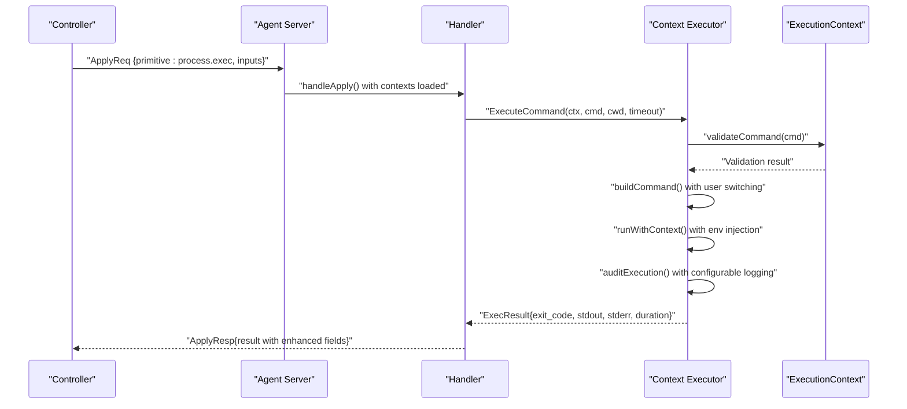
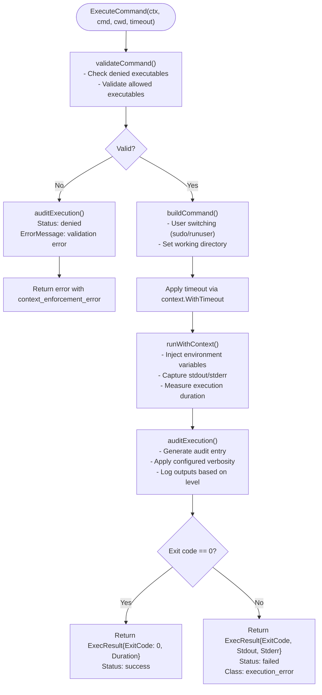
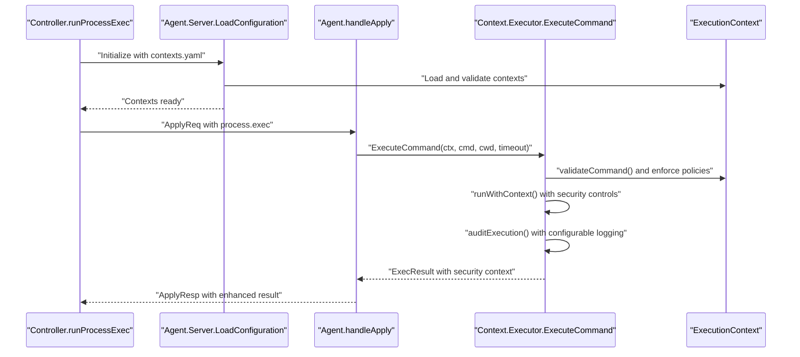
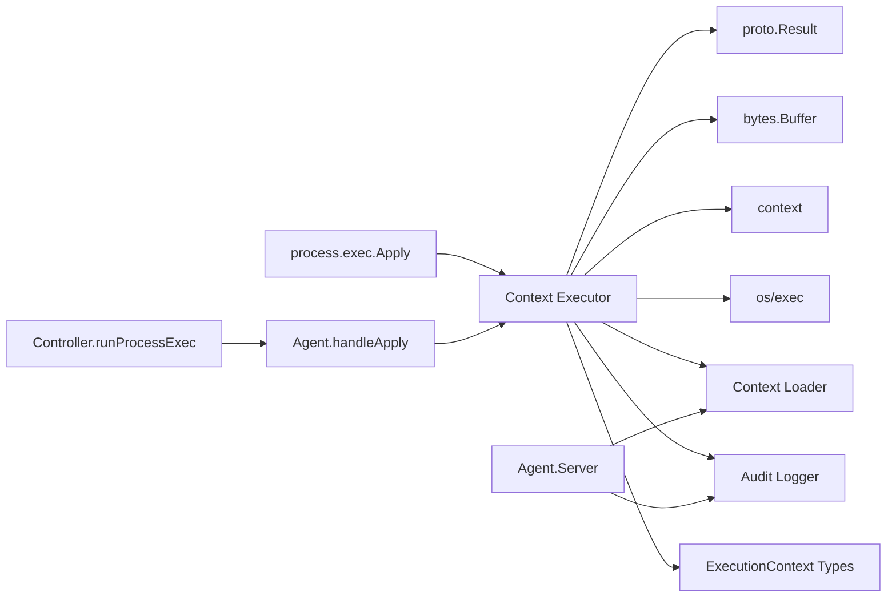

# Process Execution Primitive

<cite>
**Referenced Files in This Document**
- [processexec.go](file://internal/primitive/processexec/processexec.go)
- [executor.go](file://internal/agent/context/executor.go)
- [types.go](file://internal/agent/context/types.go)
- [audit.go](file://internal/agent/context/audit.go)
- [loader.go](file://internal/agent/context/loader.go)
- [primitive_defaults.go](file://internal/agent/context/primitive_defaults.go)
- [handler.go](file://internal/agent/handler.go)
- [server.go](file://internal/agent/server.go)
- [orchestrator.go](file://internal/controller/orchestrator.go)
- [validate.go](file://internal/devlang/validate.go)
- [validate.go](file://internal/plan/validate.go)
- [validate_test.go](file://internal/plan/validate_test.go)
- [messages.go](file://internal/proto/messages.go)
- [plan.devops](file://plan.devops)
- [plan.json](file://plan.json)
- [plan_resume.devops](file://tests/e2e/plan_resume.devops)
- [minimal.yaml](file://examples/contexts/minimal.yaml)
- [multi-tier.yaml](file://examples/contexts/multi-tier.yaml)
</cite>

## Update Summary
**Changes Made**
- Enhanced process execution primitive with execution contexts integration
- Added comprehensive security enforcement capabilities
- Integrated audit logging with configurable verbosity levels
- Updated handler to use context-aware execution
- Added resource limits and environment variable enforcement
- Expanded configuration options for secure process execution

## Table of Contents
1. [Introduction](#introduction)
2. [Project Structure](#project-structure)
3. [Core Components](#core-components)
4. [Architecture Overview](#architecture-overview)
5. [Detailed Component Analysis](#detailed-component-analysis)
6. [Security Enforcement Framework](#security-enforcement-framework)
7. [Audit Logging System](#audit-logging-system)
8. [Dependency Analysis](#dependency-analysis)
9. [Performance Considerations](#performance-considerations)
10. [Troubleshooting Guide](#troubleshooting-guide)
11. [Conclusion](#conclusion)
12. [Appendices](#appendices)

## Introduction
This document explains the enhanced Process Execution Primitive that now operates within a comprehensive security framework. The primitive integrates with execution contexts that provide fine-grained control over process execution, including identity management, privilege escalation, filesystem restrictions, network controls, and detailed audit logging. It focuses on the Execute function implementation with security enforcement, working directory management, timeout handling, exit code processing, and comprehensive stream handling. The system now supports configurable audit levels, resource limits, and environment variable enforcement for secure and auditable process execution.

## Project Structure
The Process Execution Primitive now operates within a sophisticated security framework that includes execution contexts, audit logging, and resource management. The orchestration pipeline integrates with the context system to ensure secure and compliant process execution across different trust levels.

```mermaid
graph TB
subgraph "Controller"
ORCH["Orchestrator<br/>runProcessExec()"]
end
subgraph "Agent"
SERVER["Server<br/>LoadConfiguration()"]
HANDLER["Handler<br/>handleApply()"]
EXECUTOR["Context Executor<br/>ExecuteCommand()"]
END
subgraph "Security Framework"
CONTEXT["ExecutionContext<br/>Security Policy"]
AUDIT["AuditLogger<br/>JSON Lines"]
RESOURCES["Resource Limits<br/>CPU/Memory/Processes"]
end
subgraph "Primitive Layer"
PRIM_PROC["Primitive: process.exec<br/>Apply()"]
end
subgraph "Protocol"
MSG["proto.Result"]
end
ORCH --> |"ApplyReq"| SERVER
SERVER --> |"Load Config"| CONTEXT
SERVER --> |"Init Audit"| AUDIT
SERVER --> |"Handle Conn"| HANDLER
HANDLER --> |"ExecuteCommand"| EXECUTOR
EXECUTOR --> |"Apply Security"| CONTEXT
EXECUTOR --> |"Audit Logs"| AUDIT
EXECUTOR --> |"Resource Limits"| RESOURCES
EXECUTOR --> |"Result"| HANDLER
HANDLER --> |"ApplyResp"| ORCH
```

**Diagram sources**
- [server.go](file://internal/agent/server.go#L27-L47)
- [handler.go](file://internal/agent/handler.go#L198-L228)
- [executor.go](file://internal/agent/context/executor.go#L29-L73)
- [types.go](file://internal/agent/context/types.go#L3-L14)
- [audit.go](file://internal/agent/context/audit.go#L29-L43)

**Section sources**
- [server.go](file://internal/agent/server.go#L27-L47)
- [handler.go](file://internal/agent/handler.go#L198-L228)
- [executor.go](file://internal/agent/context/executor.go#L29-L73)
- [types.go](file://internal/agent/context/types.go#L3-L14)
- [audit.go](file://internal/agent/context/audit.go#L29-L43)

## Core Components
- **Enhanced Process Execution Primitive**: Executes commands within security contexts with comprehensive enforcement
- **Execution Context Manager**: Provides security policy enforcement including identity, privilege, filesystem, and network controls
- **Audit Logging System**: Configurable audit logging with three verbosity levels (minimal, standard, full)
- **Resource Management**: CPU, memory, and process count limitations for controlled execution
- **Environment Enforcement**: Controlled environment variable injection for predictable execution
- **Protocol Result**: Defines standardized result shape with enhanced error classification

Key responsibilities:
- Command validation against execution contexts
- Identity and privilege management with user switching
- Filesystem path restrictions and validation
- Network access controls and monitoring
- Comprehensive audit trail generation
- Resource limit enforcement
- Environment variable injection and isolation
- Timeout enforcement and graceful termination

**Section sources**
- [executor.go](file://internal/agent/context/executor.go#L13-L19)
- [types.go](file://internal/agent/context/types.go#L3-L84)
- [audit.go](file://internal/agent/context/audit.go#L10-L27)
- [handler.go](file://internal/agent/handler.go#L198-L228)

## Architecture Overview
The enhanced primitive now operates within a comprehensive security framework that validates commands against execution contexts, enforces resource limits, manages identities and privileges, and generates detailed audit trails. The system maintains backward compatibility while adding robust security controls.



**Diagram sources**
- [server.go](file://internal/agent/server.go#L27-L47)
- [handler.go](file://internal/agent/handler.go#L198-L228)
- [executor.go](file://internal/agent/context/executor.go#L29-L73)
- [executor.go](file://internal/agent/context/executor.go#L106-L138)

## Detailed Component Analysis

### Enhanced Execute Function Implementation
The Execute function now leverages the context-aware executor with comprehensive security enforcement and audit logging capabilities.

**Updated** Enhanced with execution contexts integration, security enforcement, and audit logging

- **Input parsing and validation**
  - Validates presence and non-emptyness of the command array
  - Converts mixed-type arguments to strings
  - Reads optional working directory and timeout values
- **Context-aware execution**
  - Integrates with ExecutionContext for security policy enforcement
  - Validates commands against allowed/denied executable lists
  - Enforces identity and privilege requirements
  - Applies resource limits and environment variable restrictions
- **Security enforcement pipeline**
  - Command validation against context policies
  - User switching with sudo/runuser integration
  - Filesystem path validation and restrictions
  - Network access controls and monitoring
- **Enhanced result construction**
  - Includes execution duration metrics
  - Comprehensive error classification with context enforcement errors
  - Audit trail integration with configurable verbosity levels
  - Resource usage tracking and limits enforcement



**Diagram sources**
- [executor.go](file://internal/agent/context/executor.go#L29-L73)
- [executor.go](file://internal/agent/context/executor.go#L106-L138)
- [executor.go](file://internal/agent/context/executor.go#L140-L174)
- [executor.go](file://internal/agent/context/executor.go#L176-L228)

**Section sources**
- [executor.go](file://internal/agent/context/executor.go#L29-L73)
- [executor.go](file://internal/agent/context/executor.go#L106-L138)
- [executor.go](file://internal/agent/context/executor.go#L140-L174)
- [executor.go](file://internal/agent/context/executor.go#L176-L228)

### Configuration Options and Security Context Integration
The enhanced primitive now supports comprehensive security configuration through execution contexts:

**Updated** Added execution context integration with security policies

- **cmd**: Non-empty array of command and arguments with context validation
- **cwd**: Working directory path with filesystem permission validation
- **timeout**: Optional numeric timeout in seconds with context enforcement
- **ExecutionContext**: Security policy container with multiple enforcement layers

**Security Context Components:**
- **Identity**: User/group specification for execution identity
- **Privilege**: Allow escalation settings and sudo command restrictions
- **Process**: Allowed/denied executables, environment variables, resource limits
- **Filesystem**: Read-only/writable/denied path restrictions
- **Network**: Access controls and scope limitations
- **Audit**: Configurable logging levels and output capture

**Section sources**
- [types.go](file://internal/agent/context/types.go#L3-L84)
- [loader.go](file://internal/agent/context/loader.go#L55-L121)
- [primitive_defaults.go](file://internal/agent/context/primitive_defaults.go#L14-L25)

### Enhanced Return Value Formats
The primitive now returns comprehensive results with security and audit context:

**Updated** Enhanced result format with security context and audit information

The primitive returns a structured Result with enhanced security and audit fields:
- **status**: "success" or "failed"
- **class**: "execution_error", "timeout", or "context_enforcement_error"
- **exit_code**: Numeric exit code (0 on success, -1 on non-exit errors)
- **stdout**: Captured standard output
- **stderr**: Captured standard error
- **rollback_safe**: Always false for process.exec
- **duration**: Execution time in nanoseconds (added)
- **context_name**: Name of applied execution context (added)
- **execution_user**: Effective execution user (added)
- **trust_level**: Applied trust level (added)

**Section sources**
- [executor.go](file://internal/agent/context/executor.go#L21-L27)
- [executor.go](file://internal/agent/context/executor.go#L176-L228)
- [messages.go](file://internal/proto/messages.go#L103-L116)

### Stream Handling, Environment, and Security Controls
The enhanced system provides comprehensive stream handling with security controls:

**Updated** Added environment variable enforcement and security controls

- **Stream handling**: stdout and stderr captured with configurable audit logging
- **Environment enforcement**: Context-specified environment variables injected into execution
- **Security controls**: 
  - Executable whitelist/blacklist validation
  - User identity and privilege management
  - Filesystem path restrictions and validation
  - Network access controls and monitoring
  - Resource limit enforcement (memory, CPU, processes)

**Practical implications:**
- Environment isolation through controlled variable injection
- Predictable execution behavior through enforced policies
- Comprehensive audit trail for security compliance
- Resource protection through automatic limits

**Section sources**
- [executor.go](file://internal/agent/context/executor.go#L140-L174)
- [executor.go](file://internal/agent/context/executor.go#L106-L138)
- [types.go](file://internal/agent/context/types.go#L46-L52)

### Process Lifecycle Management with Security
The enhanced lifecycle management includes comprehensive security controls:

**Updated** Added security enforcement throughout the execution lifecycle

- **Creation**: Context-aware command building with user switching
- **Validation**: Pre-execution security policy validation
- **Execution**: Secure execution with resource limits and environment controls
- **Monitoring**: Real-time resource usage tracking and enforcement
- **Cleanup**: Graceful cleanup with audit trail generation
- **Auditing**: Configurable logging based on audit level settings

**Section sources**
- [executor.go](file://internal/agent/context/executor.go#L29-L73)
- [executor.go](file://internal/agent/context/executor.go#L176-L228)

### Integration with Enhanced Orchestrator and Agent
The orchestrator now works with the enhanced context system:

**Updated** Enhanced integration with execution contexts and audit logging

- **Server initialization**: Loads execution contexts and initializes audit logging
- **Context resolution**: Resolves appropriate execution context for process.exec
- **Security enforcement**: Applies context policies during command execution
- **Audit integration**: Generates comprehensive audit trails for all executions
- **Result handling**: Processes enhanced results with security context information



**Diagram sources**
- [server.go](file://internal/agent/server.go#L27-L47)
- [handler.go](file://internal/agent/handler.go#L198-L228)
- [executor.go](file://internal/agent/context/executor.go#L29-L73)

**Section sources**
- [server.go](file://internal/agent/server.go#L27-L47)
- [handler.go](file://internal/agent/handler.go#L198-L228)
- [executor.go](file://internal/agent/context/executor.go#L29-L73)

### Practical Examples from .devops Plans
The enhanced system supports secure execution patterns with comprehensive auditing:

**Updated** Added examples with security context integration

- **Basic secure command execution**:
  - Node type: process.exec with security context
  - Inputs: cmd, cwd with context validation
  - Example: running commands in restricted user space with audit logging
- **Multi-tier security execution**:
  - Different contexts for development vs production
  - Example: low trust level for development, high trust for system operations
- **Resource-constrained execution**:
  - Memory and process limits enforcement
  - Example: preventing resource exhaustion in shared environments

**Section sources**
- [minimal.yaml](file://examples/contexts/minimal.yaml#L1-L38)
- [multi-tier.yaml](file://examples/contexts/multi-tier.yaml#L1-L117)
- [plan.devops](file://plan.devops#L13-L19)
- [plan.json](file://plan.json#L14-L22)

## Security Enforcement Framework
The enhanced process execution primitive now operates within a comprehensive security framework that provides multiple layers of protection:

### Execution Context Architecture
The system uses ExecutionContext objects to define security policies:

**Trust Levels:**
- **Low**: Restricted user space execution without privileges
- **Medium**: Limited privilege escalation with controlled commands
- **High**: Full administrative privileges with comprehensive controls

**Security Domains:**
- **Identity Management**: User/group specification and switching
- **Privilege Control**: Sudo command restrictions and escalation policies
- **Process Isolation**: Executable whitelisting/blacklisting
- **Filesystem Protection**: Path-based access controls
- **Network Security**: Access scope and port restrictions
- **Resource Management**: CPU, memory, and process limits

**Section sources**
- [types.go](file://internal/agent/context/types.go#L3-L84)
- [loader.go](file://internal/agent/context/loader.go#L55-L121)

### Command Validation and Enforcement
The system validates commands against security policies before execution:

**Validation Pipeline:**
1. **Executable Validation**: Checks against denied/allowed lists
2. **Path Validation**: Verifies filesystem access permissions
3. **Privilege Validation**: Ensures command aligns with trust level
4. **Resource Validation**: Confirms resource usage limits

**Enforcement Mechanisms:**
- **User Switching**: Automatic sudo/runuser integration
- **Environment Injection**: Controlled variable injection
- **Output Filtering**: Configurable stdout/stderr capture
- **Audit Integration**: Comprehensive logging of all actions

**Section sources**
- [executor.go](file://internal/agent/context/executor.go#L106-L138)
- [executor.go](file://internal/agent/context/executor.go#L75-L104)

## Audit Logging System
The enhanced system provides comprehensive audit logging with configurable verbosity levels:

### Audit Configuration Levels
The system supports three audit levels for different compliance requirements:

**Minimal Level:**
- Basic success/failure indicators
- Essential metadata only
- Low overhead logging

**Standard Level:**
- Command execution details
- Input/output capture
- Execution duration tracking
- Error information

**Full Level:**
- Complete command trace
- Environment variable logging
- Detailed resource usage
- Complete execution context

### Audit Entry Structure
Each audit entry contains comprehensive execution context:

**Required Fields:**
- Timestamp and node identification
- Primitive type and context name
- Execution user and trust level
- Working directory and exit code

**Conditional Fields:**
- Command array (standard/full levels)
- Stdout/stderr capture (standard/full levels)
- Environment variables (full level)
- Duration and error messages

**Section sources**
- [audit.go](file://internal/agent/context/audit.go#L10-L27)
- [executor.go](file://internal/agent/context/executor.go#L176-L228)

## Dependency Analysis
The enhanced primitive now depends on the comprehensive security framework:

**Updated** Added security framework dependencies



**Diagram sources**
- [processexec.go](file://internal/primitive/processexec/processexec.go#L3-L11)
- [handler.go](file://internal/agent/handler.go#L198-L228)
- [executor.go](file://internal/agent/context/executor.go#L13-L19)
- [server.go](file://internal/agent/server.go#L27-L47)

**Section sources**
- [processexec.go](file://internal/primitive/processexec/processexec.go#L3-L11)
- [handler.go](file://internal/agent/handler.go#L198-L228)
- [executor.go](file://internal/agent/context/executor.go#L13-L19)
- [server.go](file://internal/agent/server.go#L27-L47)

## Performance Considerations
The enhanced system introduces additional overhead for security and audit capabilities:

**Performance Impact Analysis:**
- **Security validation**: Command and path validation adds minimal overhead
- **Audit logging**: JSON serialization and file I/O for audit entries
- **Resource monitoring**: Continuous resource usage tracking
- **Environment injection**: Additional process setup time

**Optimization Strategies:**
- **Audit level selection**: Choose appropriate audit level for requirements
- **Context caching**: Reuse validated contexts when possible
- **Batch processing**: Group related operations to minimize overhead
- **Resource tuning**: Adjust resource limits based on workload characteristics

**Section sources**
- [executor.go](file://internal/agent/context/executor.go#L176-L228)
- [audit.go](file://internal/agent/context/audit.go#L45-L58)

## Troubleshooting Guide
Enhanced troubleshooting capabilities for security and audit-related issues:

**Security-related Issues:**
- **Context validation failures**: Check execution context configuration
- **Permission denials**: Verify filesystem and privilege settings
- **Command restrictions**: Review allowed/denied executable lists
- **Identity issues**: Confirm user switching and group permissions

**Audit-related Issues:**
- **Missing audit entries**: Verify audit log path and permissions
- **Incomplete logging**: Check audit level configuration
- **Performance impact**: Review audit overhead and adjust levels
- **Log format issues**: Validate JSON lines format and encoding

**Diagnostic Commands:**
- **Context validation**: Use context loader to validate configuration
- **Audit testing**: Manually trigger audit entries for testing
- **Resource monitoring**: Monitor resource usage against limits
- **Security testing**: Test command validation and enforcement

**Section sources**
- [loader.go](file://internal/agent/context/loader.go#L55-L121)
- [audit.go](file://internal/agent/context/audit.go#L35-L43)
- [executor.go](file://internal/agent/context/executor.go#L106-L138)

## Conclusion
The enhanced Process Execution Primitive now provides a comprehensive security framework that ensures safe, auditable, and compliant process execution. The integration with execution contexts enables fine-grained control over identity, privilege, filesystem access, network connectivity, and resource usage. The configurable audit logging system provides detailed visibility into all execution activities, supporting compliance requirements and security monitoring. By leveraging the enhanced security framework while maintaining backward compatibility, organizations can achieve secure automation at scale with comprehensive oversight and control.

## Appendices

### Enhanced Input Parameters Reference
**Updated** Added security context integration

- **cmd**: Array of command and arguments with context validation
- **cwd**: Working directory path with filesystem permission validation
- **timeout**: Optional numeric timeout in seconds with context enforcement
- **ExecutionContext**: Security policy configuration (via context system)

**Section sources**
- [executor.go](file://internal/agent/context/executor.go#L29-L73)
- [types.go](file://internal/agent/context/types.go#L3-L84)
- [validate.go](file://internal/devlang/validate.go#L176-L205)
- [validate.go](file://internal/plan/validate.go#L78-L85)

### Enhanced Output Fields Reference
**Updated** Added security and audit context fields

- **status**: "success" or "failed"
- **class**: "execution_error", "timeout", or "context_enforcement_error"
- **exit_code**: Numeric exit code
- **stdout**: Captured standard output
- **stderr**: Captured standard error
- **rollback_safe**: false
- **duration**: Execution time in nanoseconds
- **context_name**: Applied execution context name
- **execution_user**: Effective execution user
- **trust_level**: Applied trust level

**Section sources**
- [executor.go](file://internal/agent/context/executor.go#L21-L27)
- [executor.go](file://internal/agent/context/executor.go#L176-L228)
- [messages.go](file://internal/proto/messages.go#L103-L116)

### Enhanced Security Context Configuration
**Updated** Added comprehensive security configuration examples

**Minimal Security Context:**
- Low trust level with restricted user execution
- Basic filesystem access for temporary directories
- Standard audit logging with output capture
- Resource limits for safety

**Multi-Tier Security Contexts:**
- Development: Low trust with user-space execution
- Staging: Medium trust with limited privilege escalation
- Production: High trust with full administrative access
- Compliance: Full audit with environment logging

**Section sources**
- [minimal.yaml](file://examples/contexts/minimal.yaml#L1-L38)
- [multi-tier.yaml](file://examples/contexts/multi-tier.yaml#L1-L117)

### Example .devops Plan Snippets with Security Contexts
**Updated** Added security context integration examples

- **Secure process.exec node** with execution context configuration
- **Multi-context deployment** with different security levels
- **Compliance-focused execution** with full audit logging
- **Resource-constrained operations** with automatic limits

**Section sources**
- [plan.devops](file://plan.devops#L13-L19)
- [plan.json](file://plan.json#L14-L22)
- [minimal.yaml](file://examples/contexts/minimal.yaml#L1-L38)
- [multi-tier.yaml](file://examples/contexts/multi-tier.yaml#L1-L117)