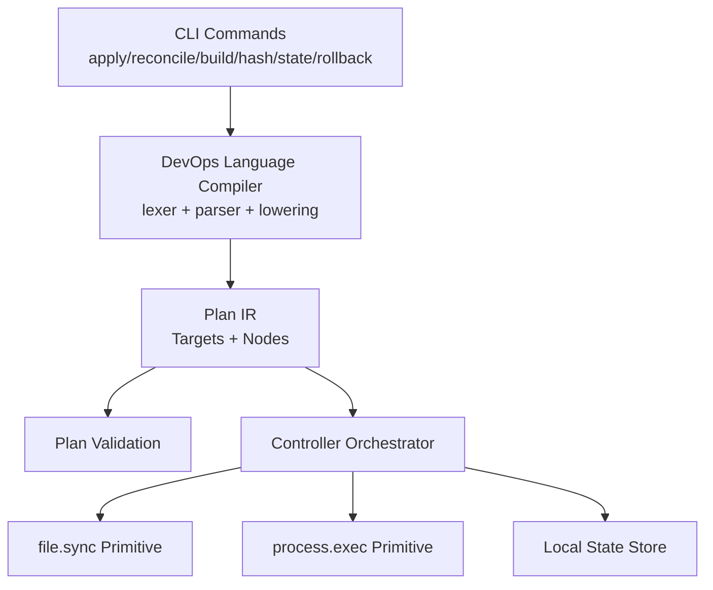
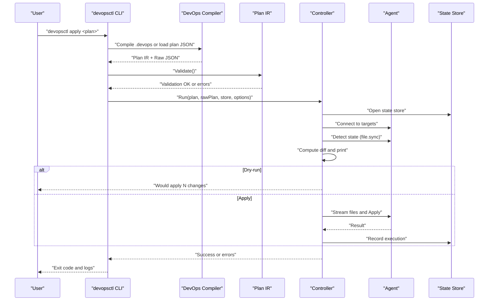
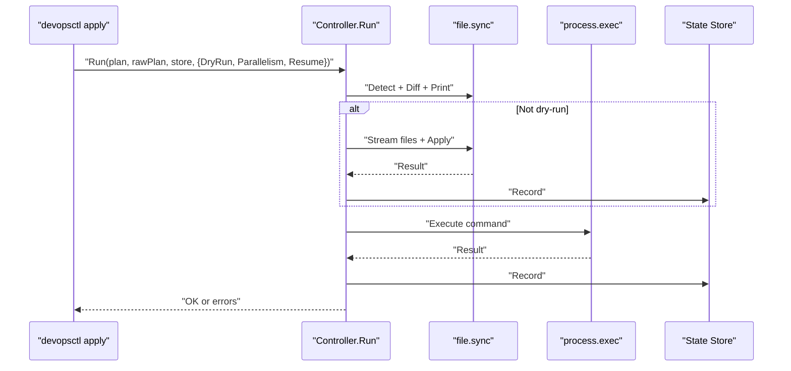
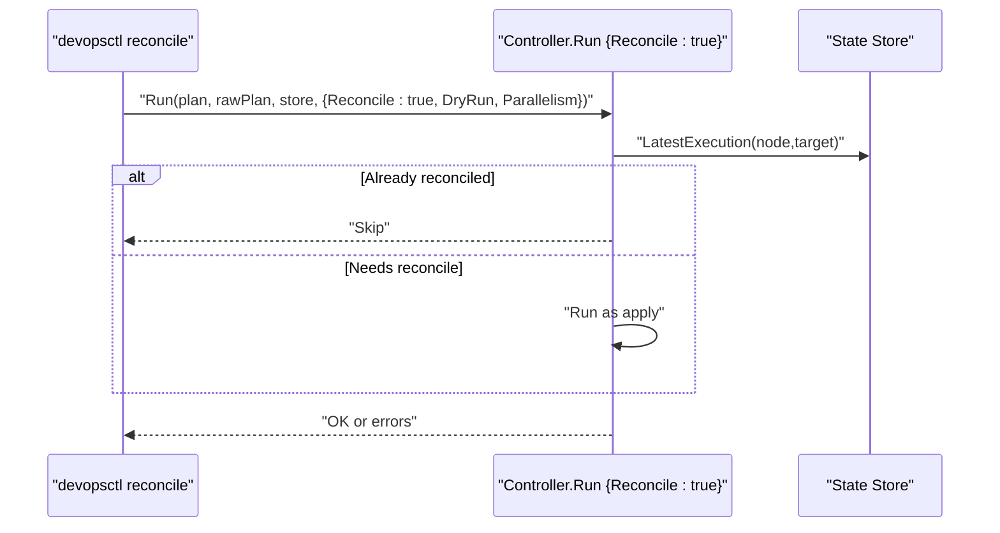
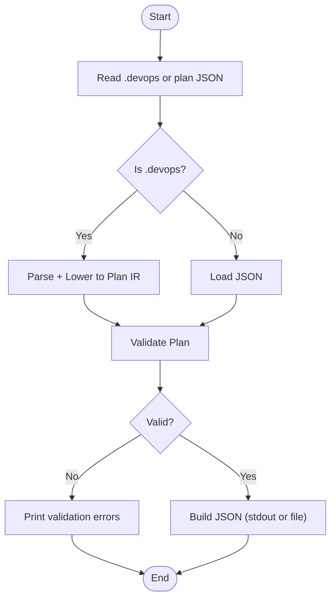
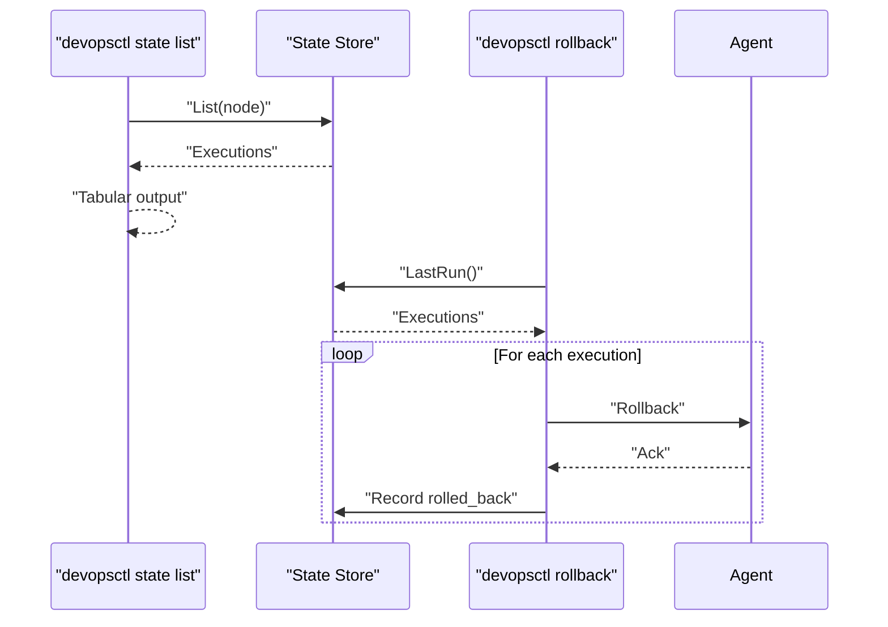
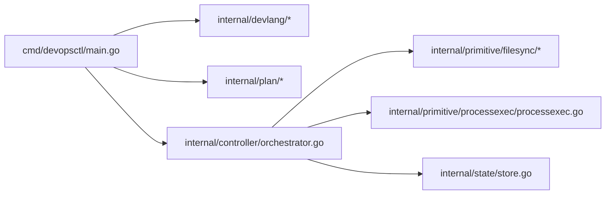

# Basic Usage Examples

<cite>
**Referenced Files in This Document**
- [main.go](file://cmd/devopsctl/main.go)
- [parser.go](file://internal/devlang/parser.go)
- [lexer.go](file://internal/devlang/lexer.go)
- [ast.go](file://internal/devlang/ast.go)
- [schema.go](file://internal/plan/schema.go)
- [validate.go](file://internal/plan/validate.go)
- [orchestrator.go](file://internal/controller/orchestrator.go)
- [processexec.go](file://internal/primitive/processexec/processexec.go)
- [detect.go](file://internal/primitive/filesync/detect.go)
- [apply.go](file://internal/primitive/filesync/apply.go)
- [store.go](file://internal/state/store.go)
- [plan.devops](file://plan.devops)
- [plan_resume.devops](file://tests/e2e/plan_resume.devops)
</cite>

## Table of Contents
1. [Introduction](#introduction)
2. [Project Structure](#project-structure)
3. [Core Components](#core-components)
4. [Architecture Overview](#architecture-overview)
5. [Detailed Component Analysis](#detailed-component-analysis)
6. [Dependency Analysis](#dependency-analysis)
7. [Performance Considerations](#performance-considerations)
8. [Troubleshooting Guide](#troubleshooting-guide)
9. [Conclusion](#conclusion)
10. [Appendices](#appendices)

## Introduction
This document provides practical, step-by-step examples for using DevOpsCtl to define, compile, validate, and execute execution plans. It focuses on common workflows such as file synchronization and process execution, and demonstrates how to use the apply and reconcile commands. It also covers plan validation, state inspection, rollback operations, and essential command-line flags including dry-run, parallelism, and resume. Best practices for organizing .devops files and structuring complex execution plans are included, along with performance considerations for everyday usage.

## Project Structure
DevOpsCtl is organized around a small set of cohesive packages:
- CLI entrypoint and commands
- DevOps language compiler (lexer, parser, lowering to plan)
- Plan representation and validation
- Controller orchestration and execution
- Primitives for file synchronization and process execution
- Local state storage
- Example plans

**Diagram sources**
- [main.go](file://cmd/devopsctl/main.go#L21-L273)
- [lexer.go](file://internal/devlang/lexer.go#L1-L247)
- [parser.go](file://internal/devlang/parser.go#L1-L495)
- [ast.go](file://internal/devlang/ast.go#L1-L126)
- [schema.go](file://internal/plan/schema.go#L1-L77)
- [validate.go](file://internal/plan/validate.go#L1-L95)
- [orchestrator.go](file://internal/controller/orchestrator.go#L1-L653)
- [apply.go](file://internal/primitive/filesync/apply.go#L1-L252)
- [processexec.go](file://internal/primitive/processexec/processexec.go#L1-L83)
- [store.go](file://internal/state/store.go#L1-L226)

**Section sources**
- [main.go](file://cmd/devopsctl/main.go#L21-L273)
- [schema.go](file://internal/plan/schema.go#L11-L77)

## Core Components
- CLI entrypoint defines commands: apply, reconcile, agent, state, plan, rollback.
- DevOps language: lexer and parser support declarations for targets, nodes, steps, modules, loops, and lets.
- Plan IR: Targets and Nodes with inputs, dependencies, and failure policies.
- Controller: Builds a dependency graph, executes nodes against targets, records state, and supports dry-run, resume, and reconcile.
- Primitives:
  - file.sync: Detects remote state, computes diffs, streams file changes, applies, and snapshots for rollback.
  - process.exec: Executes commands locally via agent and reports results.
- State store: SQLite-backed append-only log of executions with indexes for efficient queries.

**Section sources**
- [main.go](file://cmd/devopsctl/main.go#L27-L273)
- [lexer.go](file://internal/devlang/lexer.go#L6-L32)
- [parser.go](file://internal/devlang/parser.go#L27-L98)
- [ast.go](file://internal/devlang/ast.go#L14-L84)
- [schema.go](file://internal/plan/schema.go#L11-L77)
- [validate.go](file://internal/plan/validate.go#L5-L95)
- [orchestrator.go](file://internal/controller/orchestrator.go#L26-L301)
- [apply.go](file://internal/primitive/filesync/apply.go#L19-L204)
- [processexec.go](file://internal/primitive/processexec/processexec.go#L13-L83)
- [store.go](file://internal/state/store.go#L17-L84)

## Architecture Overview
End-to-end flow from .devops to execution:
- Write .devops with targets and nodes.
- Compile .devops to plan JSON (or load existing plan JSON).
- Validate plan structure and primitives.
- Run apply to execute nodes against targets.
- Optionally reconcile to bring reality in sync with the plan.
- Inspect state and rollback last run if needed.

**Diagram sources**
- [main.go](file://cmd/devopsctl/main.go#L32-L87)
- [orchestrator.go](file://internal/controller/orchestrator.go#L34-L301)
- [apply.go](file://internal/primitive/filesync/apply.go#L19-L204)
- [detect.go](file://internal/primitive/filesync/detect.go#L19-L70)
- [store.go](file://internal/state/store.go#L38-L84)

## Detailed Component Analysis

### Writing and Compiling .devops
- Supported declarations: target, node, step, module, for, let.
- Nodes carry type, targets, depends_on, failure_policy, and primitive inputs.
- Compilation accepts either .devops source or prebuilt plan JSON.

Practical example files:
- Minimal plan with file sync and process execution: [plan.devops](file://plan.devops#L1-L20)
- Multi-node plan with dependencies and conditional failure policy: [plan_resume.devops](file://tests/e2e/plan_resume.devops#L1-L43)

**Section sources**
- [parser.go](file://internal/devlang/parser.go#L27-L98)
- [ast.go](file://internal/devlang/ast.go#L14-L84)
- [main.go](file://cmd/devopsctl/main.go#L43-L66)

### Applying Changes (apply)
- Steps:
  1. Read and compile .devops or load plan JSON.
  2. Validate plan.
  3. Open state store.
  4. Run controller with options: dry-run, parallelism, resume.
- Behavior:
  - file.sync detects remote state, computes diff, prints changes, optionally streams and applies.
  - process.exec executes commands remotely and reports exit code and output.
  - Records execution in state store.

**Diagram sources**
- [main.go](file://cmd/devopsctl/main.go#L32-L87)
- [orchestrator.go](file://internal/controller/orchestrator.go#L34-L301)
- [apply.go](file://internal/primitive/filesync/apply.go#L19-L204)
- [processexec.go](file://internal/primitive/processexec/processexec.go#L13-L83)
- [store.go](file://internal/state/store.go#L68-L84)

**Section sources**
- [main.go](file://cmd/devopsctl/main.go#L32-L87)
- [orchestrator.go](file://internal/controller/orchestrator.go#L302-L311)

### Reconciling Reality to Plan (reconcile)
- Reconcile mode uses recorded state as truth to ensure targets match the plan.
- Skips nodes that are already reconciled; otherwise behaves like apply.

**Diagram sources**
- [main.go](file://cmd/devopsctl/main.go#L93-L146)
- [orchestrator.go](file://internal/controller/orchestrator.go#L180-L223)

**Section sources**
- [main.go](file://cmd/devopsctl/main.go#L93-L146)
- [orchestrator.go](file://internal/controller/orchestrator.go#L180-L223)

### Plan Validation and Build
- Validation checks structural correctness and primitive-specific requirements.
- Build compiles .devops to plan JSON and prints or writes output.

**Diagram sources**
- [main.go](file://cmd/devopsctl/main.go#L218-L244)
- [validate.go](file://internal/plan/validate.go#L5-L95)

**Section sources**
- [main.go](file://cmd/devopsctl/main.go#L194-L245)
- [validate.go](file://internal/plan/validate.go#L5-L95)

### State Inspection and Rollback
- State list shows executions; filter by node.
- Rollback last run triggers agent-level rollback for applicable nodes.

**Diagram sources**
- [main.go](file://cmd/devopsctl/main.go#L161-L192)
- [main.go](file://cmd/devopsctl/main.go#L247-L266)
- [store.go](file://internal/state/store.go#L162-L225)
- [orchestrator.go](file://internal/controller/orchestrator.go#L618-L652)

**Section sources**
- [main.go](file://cmd/devopsctl/main.go#L161-L192)
- [main.go](file://cmd/devopsctl/main.go#L247-L266)
- [store.go](file://internal/state/store.go#L162-L225)
- [orchestrator.go](file://internal/controller/orchestrator.go#L618-L652)

### Command-Line Flags and Options
Common flags:
- apply: --dry-run, --parallelism, --resume
- reconcile: --dry-run, --parallelism
- plan build: --output
- state list: --node
- rollback: --last

Examples:
- Dry-run file sync: devopsctl apply --dry-run <plan>
- Parallelism tuning: devopsctl apply --parallelism 20 <plan>
- Resume interrupted run: devopsctl apply --resume <plan>
- Reconcile: devopsctl reconcile --dry-run <plan>
- Build plan JSON: devopsctl plan build --output plan.json file.devops
- Inspect state: devopsctl state list --node <node-id>
- Rollback last run: devopsctl rollback --last

**Section sources**
- [main.go](file://cmd/devopsctl/main.go#L85-L87)
- [main.go](file://cmd/devopsctl/main.go#L145-L146)
- [main.go](file://cmd/devopsctl/main.go#L244-L244)
- [main.go](file://cmd/devopsctl/main.go#L191-L191)
- [main.go](file://cmd/devopsctl/main.go#L265-L265)

### Practical Workflow Examples

#### File Synchronization
Goal: Sync a local directory to a remote destination via agent.

Steps:
1. Define target with address and node of type file.sync with src and dest.
2. Build plan JSON from .devops.
3. Validate plan.
4. Apply to execute sync.

Example plan: [plan.devops](file://plan.devops#L1-L20)

**Section sources**
- [plan.devops](file://plan.devops#L1-L20)
- [schema.go](file://internal/plan/schema.go#L18-L33)
- [validate.go](file://internal/plan/validate.go#L69-L78)
- [apply.go](file://internal/primitive/filesync/apply.go#L19-L204)

#### Process Execution
Goal: Execute a command on a target.

Steps:
1. Define target and node of type process.exec with cmd and cwd.
2. Build and validate plan.
3. Apply to execute.

Example plan: [plan.devops](file://plan.devops#L13-L19)

**Section sources**
- [plan.devops](file://plan.devops#L13-L19)
- [validate.go](file://internal/plan/validate.go#L79-L87)
- [processexec.go](file://internal/primitive/processexec/processexec.go#L13-L83)

#### Multi-Target Deployment
Goal: Deploy to multiple targets with dependencies.

Steps:
1. Define multiple targets.
2. Define nodes targeting those targets and use depends_on to sequence.
3. Build, validate, and apply.

Example plan: [plan_resume.devops](file://tests/e2e/plan_resume.devops#L1-L43)

**Section sources**
- [plan_resume.devops](file://tests/e2e/plan_resume.devops#L1-L43)
- [schema.go](file://internal/plan/schema.go#L24-L33)
- [validate.go](file://internal/plan/validate.go#L47-L57)

#### Conditional Execution and Failure Policy
Goal: Skip nodes unless a dependency changed, and control failure propagation.

Steps:
1. Use when conditions and failure_policy on nodes.
2. Build, validate, and apply.

Example plan: [plan_resume.devops](file://tests/e2e/plan_resume.devops#L1-L43)

**Section sources**
- [plan_resume.devops](file://tests/e2e/plan_resume.devops#L1-L43)
- [validate.go](file://internal/plan/validate.go#L59-L67)

### Best Practices
- Naming:
  - Use descriptive target and node IDs.
  - Keep primitive inputs consistent (e.g., cmd arrays, src/dest paths).
- Organization:
  - Group related nodes in modules or separate .devops files.
  - Use depends_on to enforce ordering; leverage when conditions to minimize unnecessary work.
- Idempotency:
  - Prefer primitives designed to be idempotent (e.g., file.sync).
- Safety:
  - Use --dry-run to preview changes.
  - Set failure_policy to "halt" or "rollback" for critical nodes.
  - Use reconcile to recover from partial failures.

[No sources needed since this section provides general guidance]

## Dependency Analysis
Key relationships:
- CLI depends on compiler, plan, controller, and state.
- Controller depends on plan IR, primitives, and state.
- Primitives depend on protocol messages and local filesystem APIs.
- State store persists execution history.

**Diagram sources**
- [main.go](file://cmd/devopsctl/main.go#L14-L18)
- [orchestrator.go](file://internal/controller/orchestrator.go#L1-L22)

**Section sources**
- [main.go](file://cmd/devopsctl/main.go#L14-L18)
- [orchestrator.go](file://internal/controller/orchestrator.go#L1-L22)

## Performance Considerations
- Parallelism:
  - Tune --parallelism to balance throughput and resource usage.
  - Default is 10; increase cautiously on powerful hosts.
- Streaming:
  - file.sync streams file chunks to reduce memory footprint.
- State indexing:
  - SQLite indices speed up lookups for resume and reconcile.
- Idempotency:
  - Use reconcile to avoid redundant work when state is already aligned.

[No sources needed since this section provides general guidance]

## Troubleshooting Guide
Common issues and resolutions:
- Compilation errors:
  - Verify .devops syntax; check for missing braces, quotes, or unexpected tokens.
  - Use plan build to catch compile-time errors early.
- Validation failures:
  - Ensure targets have address, nodes have type and targets, and primitives have required inputs.
  - Fix unknown target or node references in depends_on or when conditions.
- Execution problems:
  - Use --dry-run to preview changes.
  - Increase --parallelism if I/O-bound; reduce if CPU-bound.
  - Resume interrupted runs with --resume.
  - For critical failures, use --resume with failure_policy "rollback" or run rollback --last.

**Section sources**
- [main.go](file://cmd/devopsctl/main.go#L49-L58)
- [validate.go](file://internal/plan/validate.go#L5-L95)
- [orchestrator.go](file://internal/controller/orchestrator.go#L180-L223)
- [main.go](file://cmd/devopsctl/main.go#L252-L265)

## Conclusion
DevOpsCtl enables concise, programming-first automation through .devops files. By combining plan compilation, validation, and controller-driven execution with primitives for file synchronization and process execution, teams can implement reliable, auditable deployments. Use dry-run, parallelism, and resume to refine workflows, and rely on state inspection and rollback for safe operations.

[No sources needed since this section summarizes without analyzing specific files]

## Appendices

### Example Plans
- Minimal file sync and process execution: [plan.devops](file://plan.devops#L1-L20)
- Multi-node with dependencies: [plan_resume.devops](file://tests/e2e/plan_resume.devops#L1-L43)

**Section sources**
- [plan.devops](file://plan.devops#L1-L20)
- [plan_resume.devops](file://tests/e2e/plan_resume.devops#L1-L43)