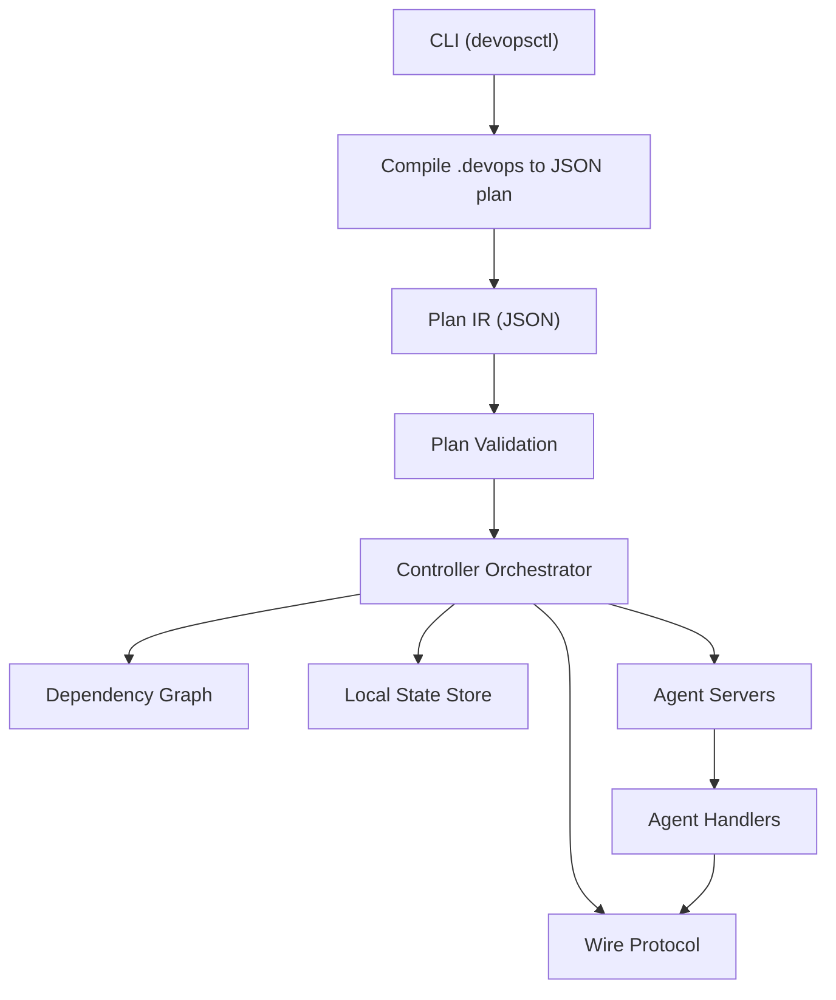
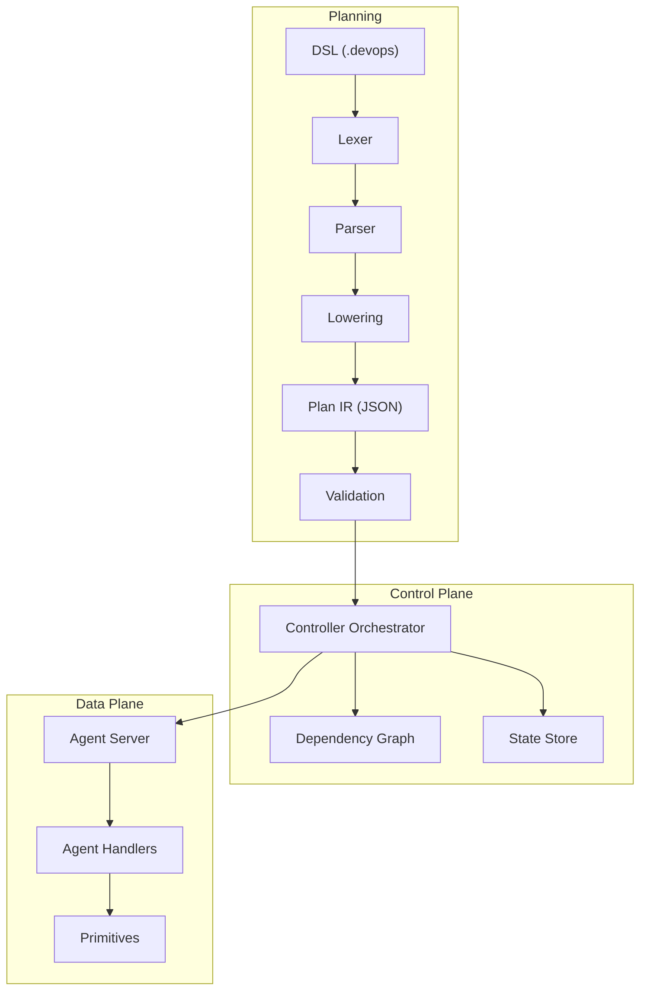
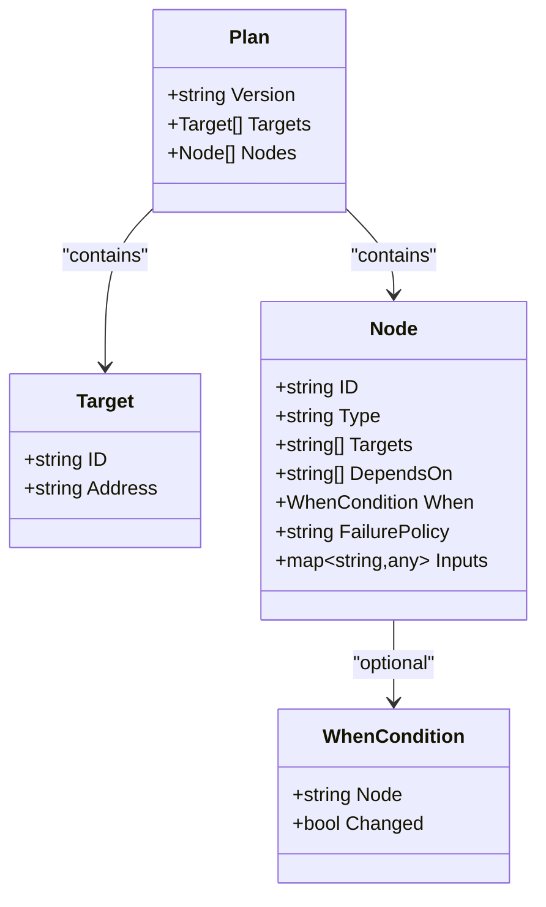
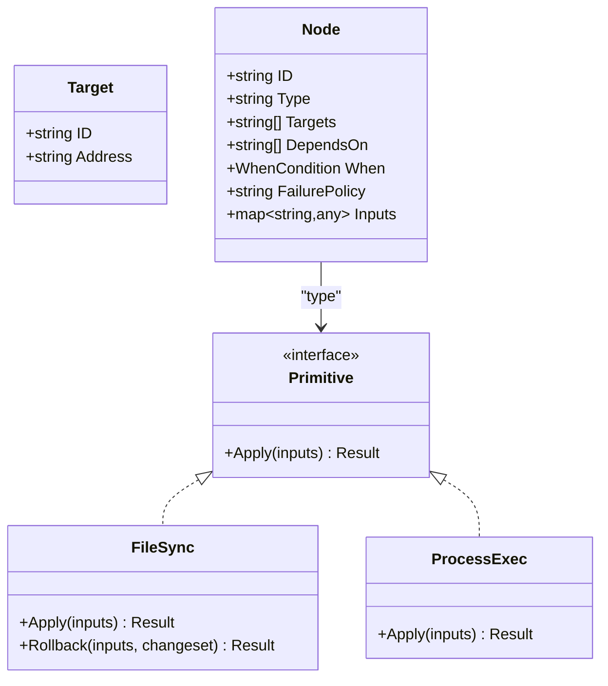
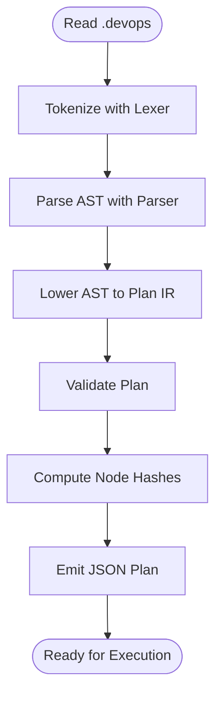
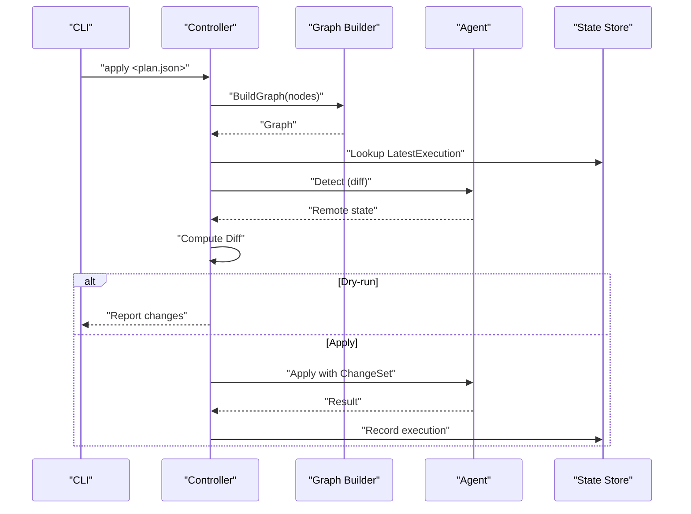
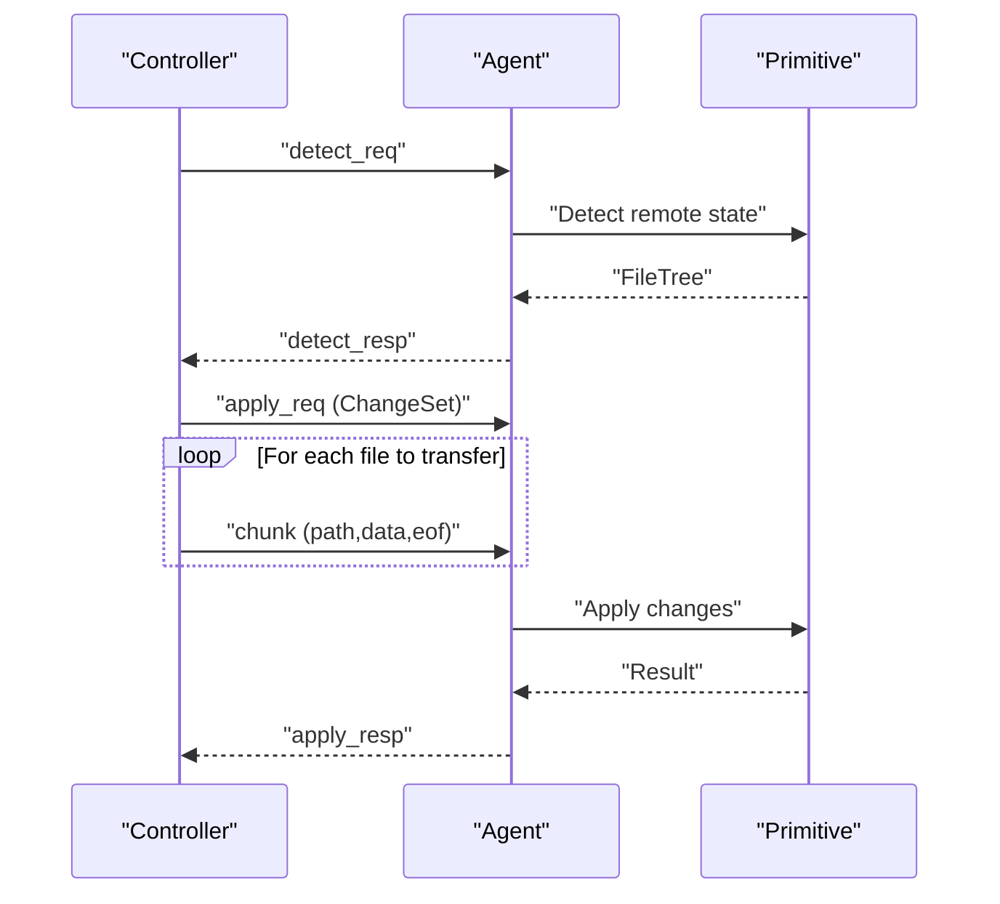
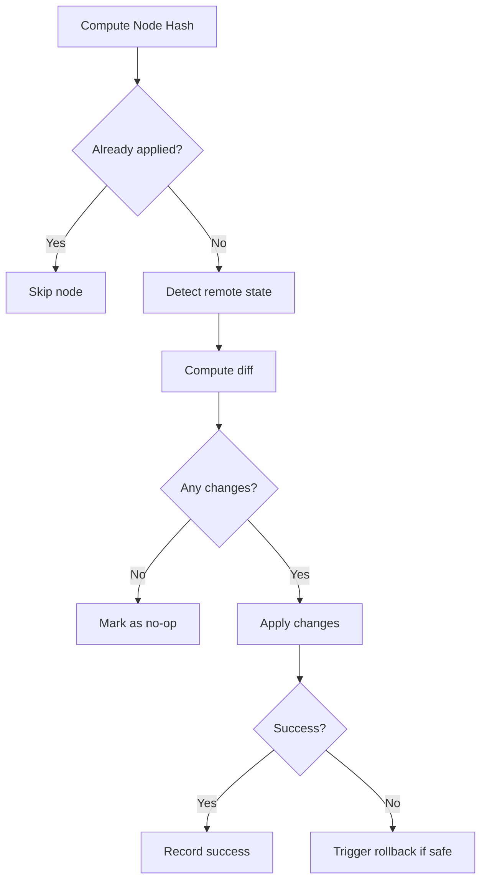
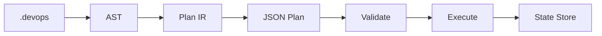
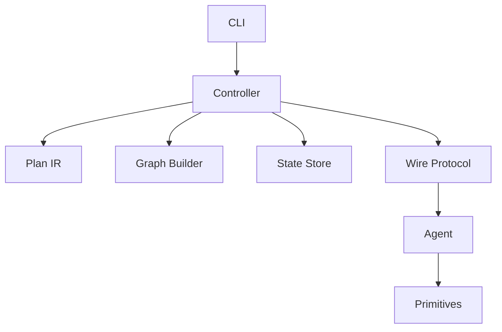

# Core Concepts

<cite>
**Referenced Files in This Document**
- [main.go](file://cmd/devopsctl/main.go)
- [lexer.go](file://internal/devlang/lexer.go)
- [parser.go](file://internal/devlang/parser.go)
- [ast.go](file://internal/devlang/ast.go)
- [lower.go](file://internal/devlang/lower.go)
- [schema.go](file://internal/plan/schema.go)
- [validate.go](file://internal/plan/validate.go)
- [graph.go](file://internal/controller/graph.go)
- [orchestrator.go](file://internal/controller/orchestrator.go)
- [messages.go](file://internal/proto/messages.go)
- [server.go](file://internal/agent/server.go)
- [handler.go](file://internal/agent/handler.go)
- [store.go](file://internal/state/store.go)
- [processexec.go](file://internal/primitive/processexec/processexec.go)
</cite>

## Table of Contents
1. [Introduction](#introduction)
2. [Project Structure](#project-structure)
3. [Core Components](#core-components)
4. [Architecture Overview](#architecture-overview)
5. [Detailed Component Analysis](#detailed-component-analysis)
6. [Dependency Analysis](#dependency-analysis)
7. [Performance Considerations](#performance-considerations)
8. [Troubleshooting Guide](#troubleshooting-guide)
9. [Conclusion](#conclusion)

## Introduction
This document explains the core concepts of DevOpsCtl with a focus on its programming-first approach to infrastructure automation. Unlike purely declarative DevOps tools that describe desired end-state, DevOpsCtl uses .devops source files to express imperative intent. These files compile into JSON execution plans that drive a controller orchestrator. The orchestrator coordinates distributed execution via an agent-server architecture, enforcing idempotent operations, dependency-aware scheduling, and robust state management for progress tracking and rollbacks.

## Project Structure
DevOpsCtl is organized around a small set of cohesive packages:
- CLI entrypoint and commands
- A domain-specific language (DSL) for .devops files (lexer, parser, lowering)
- Plan IR and validation
- Controller orchestration (graph building, execution, state)
- Wire protocol between controller and agents
- Agent daemon and handlers
- Local state store

**Diagram sources**
- [main.go](file://cmd/devopsctl/main.go#L32-L87)
- [lexer.go](file://internal/devlang/lexer.go#L1-L247)
- [parser.go](file://internal/devlang/parser.go#L28-L39)
- [lower.go](file://internal/devlang/lower.go#L10-L65)
- [schema.go](file://internal/plan/schema.go#L11-L52)
- [validate.go](file://internal/plan/validate.go#L7-L94)
- [graph.go](file://internal/controller/graph.go#L16-L48)
- [orchestrator.go](file://internal/controller/orchestrator.go#L34-L300)
- [messages.go](file://internal/proto/messages.go#L14-L75)
- [server.go](file://internal/agent/server.go#L15-L51)
- [handler.go](file://internal/agent/handler.go#L16-L51)
- [store.go](file://internal/state/store.go#L33-L84)

**Section sources**
- [main.go](file://cmd/devopsctl/main.go#L21-L273)
- [lexer.go](file://internal/devlang/lexer.go#L1-L247)
- [parser.go](file://internal/devlang/parser.go#L27-L39)
- [lower.go](file://internal/devlang/lower.go#L9-L65)
- [schema.go](file://internal/plan/schema.go#L11-L52)
- [validate.go](file://internal/plan/validate.go#L7-L94)
- [graph.go](file://internal/controller/graph.go#L9-L48)
- [orchestrator.go](file://internal/controller/orchestrator.go#L34-L300)
- [messages.go](file://internal/proto/messages.go#L7-L75)
- [server.go](file://internal/agent/server.go#L15-L51)
- [handler.go](file://internal/agent/handler.go#L16-L51)
- [store.go](file://internal/state/store.go#L33-L84)

## Core Components
- Programming-first DSL: .devops files define targets and nodes with imperative semantics. The lexer/tokenizer recognizes keywords and literals; the parser builds an AST; lowering transforms the AST into a plan IR.
- Execution plan: A JSON plan with Targets and Nodes, validated for correctness and completeness.
- Controller orchestrator: Builds a dependency graph, schedules nodes, coordinates agent execution, and persists state.
- Agent-server: Stateless TCP server per target that handles detect, apply, and rollback requests.
- Wire protocol: Line-delimited JSON messages for detect, apply, rollback, and streaming file chunks.
- State management: Append-only SQLite store tracking plan/node hashes, change sets, and execution outcomes.

**Section sources**
- [ast.go](file://internal/devlang/ast.go#L14-L83)
- [lexer.go](file://internal/devlang/lexer.go#L6-L32)
- [parser.go](file://internal/devlang/parser.go#L27-L39)
- [lower.go](file://internal/devlang/lower.go#L10-L65)
- [schema.go](file://internal/plan/schema.go#L11-L33)
- [validate.go](file://internal/plan/validate.go#L7-L94)
- [graph.go](file://internal/controller/graph.go#L9-L48)
- [orchestrator.go](file://internal/controller/orchestrator.go#L34-L300)
- [messages.go](file://internal/proto/messages.go#L14-L75)
- [server.go](file://internal/agent/server.go#L15-L51)
- [handler.go](file://internal/agent/handler.go#L16-L51)
- [store.go](file://internal/state/store.go#L33-L84)

## Architecture Overview
DevOpsCtl separates planning from execution. Planning is imperative in .devops and lowers to a canonical plan. Execution is orchestrated centrally with dependency awareness and distributed to agents. The controller enforces idempotency and rollback safety, while the agent executes primitives against remote targets.

**Diagram sources**
- [lexer.go](file://internal/devlang/lexer.go#L41-L57)
- [parser.go](file://internal/devlang/parser.go#L27-L39)
- [lower.go](file://internal/devlang/lower.go#L10-L65)
- [schema.go](file://internal/plan/schema.go#L11-L33)
- [validate.go](file://internal/plan/validate.go#L7-L94)
- [graph.go](file://internal/controller/graph.go#L16-L48)
- [orchestrator.go](file://internal/controller/orchestrator.go#L34-L300)
- [server.go](file://internal/agent/server.go#L15-L51)
- [handler.go](file://internal/agent/handler.go#L16-L51)

## Detailed Component Analysis

### Programming-First vs Declarative DevOps
- Imperative control: .devops declares targets and nodes with explicit inputs, dependencies, and failure policies. This enables programmatic composition and dynamic behavior.
- Declarative alternatives: Tools that describe desired state without explicit step sequencing often require reconciliation loops and converge to state. DevOpsCtl’s approach lets you script precise ordering and branching.
- Benefits in DevOpsCtl: Clear control flow, deterministic scheduling, and explicit rollback triggers.

[No sources needed since this section explains conceptual differences without analyzing specific files]

### Execution Plans as the Central Abstraction
- Plan IR: JSON structure containing version, targets, and nodes. Each node specifies type, targets, dependencies, optional conditions, failure policy, and inputs.
- Hashing: Nodes are hashed with type, target, and inputs to uniquely identify units of execution. This supports idempotency and resume/reconcile semantics.
- Validation: Structural and semantic checks ensure completeness and correctness before execution.

**Diagram sources**
- [schema.go](file://internal/plan/schema.go#L11-L39)

**Section sources**
- [schema.go](file://internal/plan/schema.go#L11-L77)
- [validate.go](file://internal/plan/validate.go#L7-L94)

### Targets, Nodes, and Primitives
- Targets: Remote destinations identified by an address (host:port). The controller dispatches work to these targets.
- Nodes: Atomic units of work with a type and inputs. They declare which targets to run on and how they depend on other nodes.
- Primitives: Built-in operations executed by agents. Examples include file synchronization and process execution. Each primitive defines its own inputs and behavior.

**Diagram sources**
- [schema.go](file://internal/plan/schema.go#L18-L33)
- [processexec.go](file://internal/primitive/processexec/processexec.go#L13-L82)
- [handler.go](file://internal/agent/handler.go#L90-L139)

**Section sources**
- [schema.go](file://internal/plan/schema.go#L18-L33)
- [processexec.go](file://internal/primitive/processexec/processexec.go#L13-L82)
- [handler.go](file://internal/agent/handler.go#L90-L139)

### Compilation from .devops to JSON Execution Plans
- Lexing: Converts source bytes into tokens (keywords, identifiers, strings, operators).
- Parsing: Builds an AST from tokens with error recovery.
- Lowering: Translates AST into the canonical plan IR, preserving only supported expressions.
- Plan hashing: Computes a stable hash for each node to support idempotency and resume.

**Diagram sources**
- [lexer.go](file://internal/devlang/lexer.go#L41-L57)
- [parser.go](file://internal/devlang/parser.go#L27-L39)
- [lower.go](file://internal/devlang/lower.go#L10-L65)
- [schema.go](file://internal/plan/schema.go#L54-L76)

**Section sources**
- [lexer.go](file://internal/devlang/lexer.go#L41-L247)
- [parser.go](file://internal/devlang/parser.go#L27-L495)
- [lower.go](file://internal/devlang/lower.go#L10-L91)
- [schema.go](file://internal/plan/schema.go#L54-L76)

### Controller Orchestrator: Execution Flow and Scheduling
- Dependency graph: Constructs a DAG from node dependencies and validates acyclicity.
- Scheduling: Uses in-degree counting and a ready queue to process nodes in dependency order.
- Parallelism: Limits concurrent target executions with a semaphore.
- Failure policy: Supports halt, continue, and rollback; cascades skips and halts as configured.
- Resume and reconcile: Uses stored state to skip already-applied nodes or reconcile to current state.

**Diagram sources**
- [orchestrator.go](file://internal/controller/orchestrator.go#L34-L300)
- [graph.go](file://internal/controller/graph.go#L16-L84)
- [messages.go](file://internal/proto/messages.go#L16-L75)
- [store.go](file://internal/state/store.go#L131-L160)

**Section sources**
- [orchestrator.go](file://internal/controller/orchestrator.go#L34-L300)
- [graph.go](file://internal/controller/graph.go#L16-L84)

### Agent-Server Architecture and Wire Protocol
- Agent server: Listens on a TCP address and spawns a handler goroutine per connection.
- Handlers: Support detect, apply, and rollback requests. They are stateless per connection and rely on controller-side state for coordination.
- Wire protocol: Line-delimited JSON messages with envelopes. Apply requests are followed by file chunk messages for streaming.

**Diagram sources**
- [server.go](file://internal/agent/server.go#L21-L50)
- [handler.go](file://internal/agent/handler.go#L16-L51)
- [messages.go](file://internal/proto/messages.go#L14-L75)
- [orchestrator.go](file://internal/controller/orchestrator.go#L313-L442)

**Section sources**
- [server.go](file://internal/agent/server.go#L15-L51)
- [handler.go](file://internal/agent/handler.go#L16-L189)
- [messages.go](file://internal/proto/messages.go#L14-L117)
- [orchestrator.go](file://internal/controller/orchestrator.go#L313-L442)

### Idempotent Operation Model and Rollbacks
- Idempotency: Node hashing and state records ensure that re-running a plan with identical inputs does not cause unintended changes.
- Change sets: The controller computes diffs and streams only necessary file updates to agents.
- Rollback: On failure or explicit rollback policy, the controller triggers agent-level rollback with the recorded change set.

**Diagram sources**
- [schema.go](file://internal/plan/schema.go#L54-L76)
- [orchestrator.go](file://internal/controller/orchestrator.go#L180-L235)
- [store.go](file://internal/state/store.go#L68-L84)

**Section sources**
- [schema.go](file://internal/plan/schema.go#L54-L76)
- [orchestrator.go](file://internal/controller/orchestrator.go#L180-L235)
- [store.go](file://internal/state/store.go#L68-L84)

### Relationship Between Planning, Validation, Execution, and State Persistence
- Planning: .devops -> AST -> Plan IR -> JSON
- Validation: Structural and semantic checks on plan
- Execution: Build graph -> schedule -> dispatch to agents -> persist state
- State: Append-only records of plan/node hashes, change sets, and outcomes

**Diagram sources**
- [lexer.go](file://internal/devlang/lexer.go#L41-L57)
- [parser.go](file://internal/devlang/parser.go#L27-L39)
- [lower.go](file://internal/devlang/lower.go#L10-L65)
- [validate.go](file://internal/plan/validate.go#L7-L94)
- [orchestrator.go](file://internal/controller/orchestrator.go#L34-L300)
- [store.go](file://internal/state/store.go#L68-L84)

**Section sources**
- [lexer.go](file://internal/devlang/lexer.go#L41-L57)
- [parser.go](file://internal/devlang/parser.go#L27-L39)
- [lower.go](file://internal/devlang/lower.go#L10-L65)
- [validate.go](file://internal/plan/validate.go#L7-L94)
- [orchestrator.go](file://internal/controller/orchestrator.go#L34-L300)
- [store.go](file://internal/state/store.go#L68-L84)

## Dependency Analysis
The controller depends on the plan IR, graph builder, state store, and wire protocol. Agents depend on primitives and the wire protocol. The CLI wires everything together.

**Diagram sources**
- [main.go](file://cmd/devopsctl/main.go#L32-L87)
- [orchestrator.go](file://internal/controller/orchestrator.go#L34-L300)
- [graph.go](file://internal/controller/graph.go#L16-L48)
- [store.go](file://internal/state/store.go#L33-L84)
- [messages.go](file://internal/proto/messages.go#L14-L75)
- [server.go](file://internal/agent/server.go#L15-L51)
- [handler.go](file://internal/agent/handler.go#L16-L51)

**Section sources**
- [main.go](file://cmd/devopsctl/main.go#L32-L87)
- [orchestrator.go](file://internal/controller/orchestrator.go#L34-L300)
- [graph.go](file://internal/controller/graph.go#L16-L48)
- [store.go](file://internal/state/store.go#L33-L84)
- [messages.go](file://internal/proto/messages.go#L14-L75)
- [server.go](file://internal/agent/server.go#L15-L51)
- [handler.go](file://internal/agent/handler.go#L16-L51)

## Performance Considerations
- Parallelism: Control concurrency with the parallelism flag to balance throughput and resource usage.
- Streaming transfers: File chunks minimize memory overhead during apply.
- State indexing: SQLite indices on node/target improve query performance for resume/reconcile.
- Hashing: Stable hashing avoids redundant work and supports idempotent reruns.

[No sources needed since this section provides general guidance]

## Troubleshooting Guide
- Compilation failures: Check lexer/parser errors printed by the CLI; fix syntax or unsupported constructs.
- Plan validation errors: Ensure targets/nodes have required fields and references are valid.
- Execution errors: Review controller logs for agent connect/read/write issues; inspect agent error responses.
- State inspection: Use the state list command to review recent executions and statuses.
- Rollback: Trigger a targeted rollback or use the rollback command to revert the last run.

**Section sources**
- [main.go](file://cmd/devopsctl/main.go#L43-L66)
- [validate.go](file://internal/plan/validate.go#L7-L94)
- [orchestrator.go](file://internal/controller/orchestrator.go#L313-L442)
- [store.go](file://internal/state/store.go#L162-L188)

## Conclusion
DevOpsCtl’s programming-first model, centered on execution plans and imperative .devops sources, provides fine-grained control over infrastructure operations. The controller orchestrator coordinates distributed execution with dependency-aware scheduling, idempotent operations, and robust state management. The agent-server architecture and line-delimited JSON wire protocol enable reliable, incremental changes with explicit rollback safety.