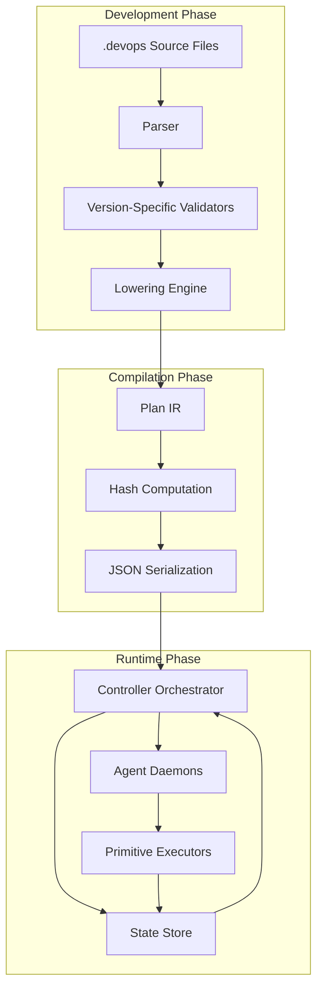
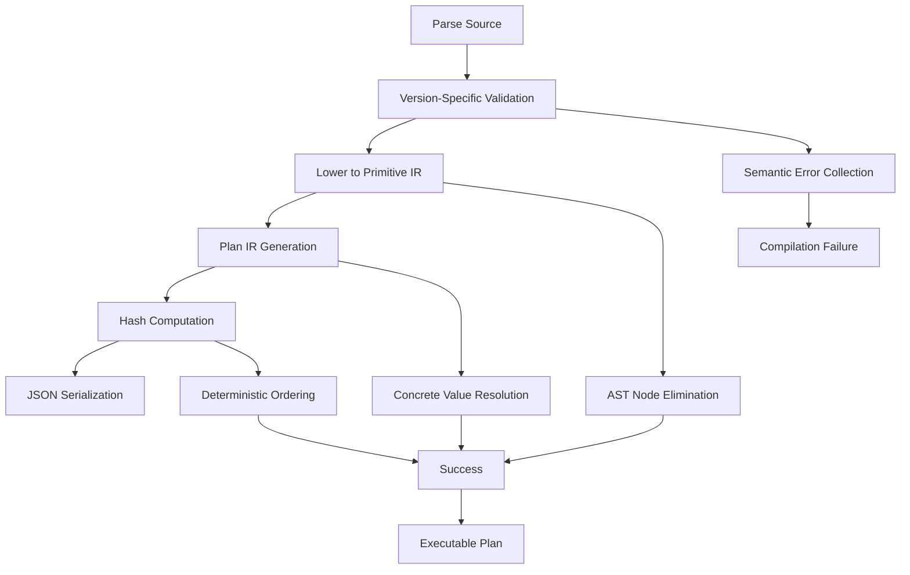
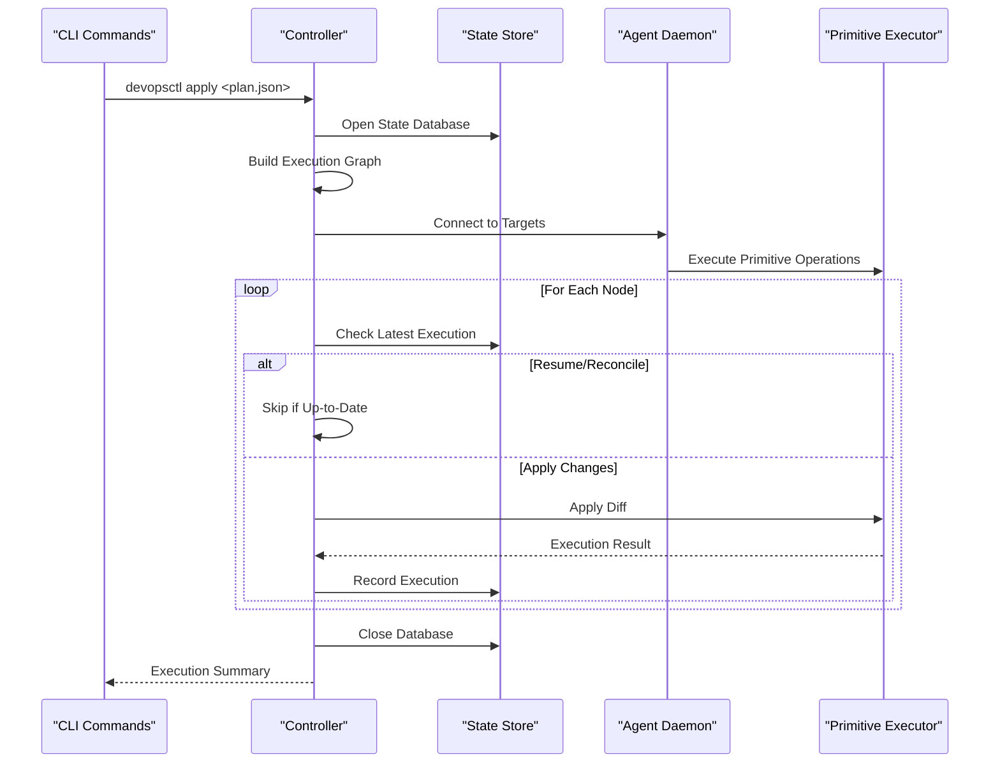
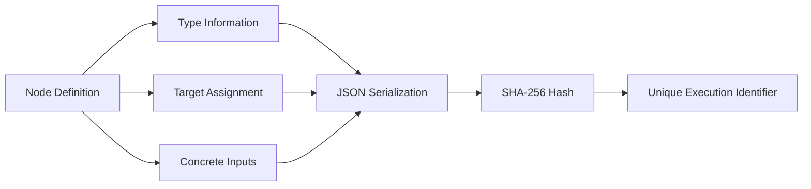
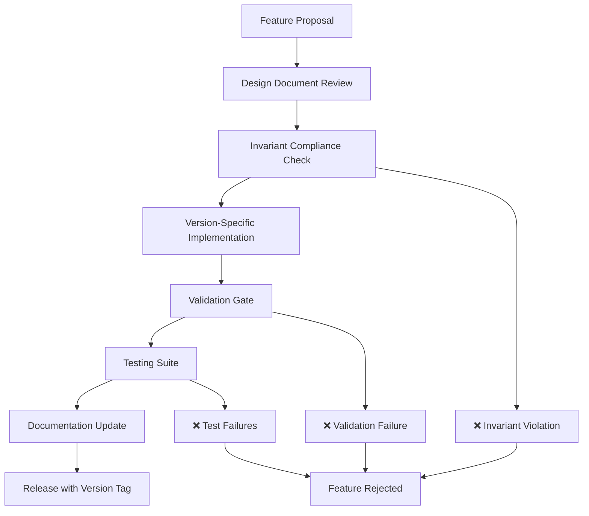

# Design Principles and Architectural Invariants

<cite>
**Referenced Files in This Document**
- [DESIGN.md](file://DESIGN.md)
- [ARCHITECTURAL_AUDIT.md](file://.qoder/ARCHITECTURAL_AUDIT.md)
- [INVARIANT_CHECKLIST.md](file://.qoder/INVARIANT_CHECKLIST.md)
- [main.go](file://cmd/devopsctl/main.go)
- [schema.go](file://internal/plan/schema.go)
- [validate.go](file://internal/plan/validate.go)
- [orchestrator.go](file://internal/controller/orchestrator.go)
- [server.go](file://internal/agent/server.go)
- [messages.go](file://internal/proto/messages.go)
- [store.go](file://internal/state/store.go)
- [ast.go](file://internal/devlang/ast.go)
- [lower.go](file://internal/devlang/lower.go)
- [validate.go](file://internal/devlang/validate.go)
- [compile_test.go](file://internal/devlang/compile_test.go)
- [detect.go](file://internal/primitive/filesync/detect.go)
- [processexec.go](file://internal/primitive/processexec/processexec.go)
</cite>

## Table of Contents
1. [Introduction](#introduction)
2. [Core Design Principles](#core-design-principles)
3. [Architectural Invariants](#architectural-invariants)
4. [System Architecture](#system-architecture)
5. [Compiler Pipeline](#compiler-pipeline)
6. [Runtime Execution Model](#runtime-execution-model)
7. [Hash Integrity and Determinism](#hash-integrity-and-determinism)
8. [Feature Evolution Strategy](#feature-evolution-strategy)
9. [Quality Assurance Framework](#quality-assurance-framework)
10. [Conclusion](#conclusion)

## Introduction

This document establishes the foundational design principles and architectural invariants that govern the devopsctl system. The architecture follows a strict separation between compilation and execution phases, ensuring that all language features compile away to flat, deterministic primitives that the runtime can execute without learning new concepts.

The system is built on four non-negotiable invariants that guarantee long-term stability, auditability, and maintainability. These principles enable the executor to remain "boring" while complexity grows upward in the compiler layer.

## Core Design Principles

### Compile-Time-Only Philosophy

The fundamental principle is that **all language features must compile away completely**. The runtime never learns new concepts - it only understands primitive operations that are fully expanded during compilation.

Key characteristics:
- No runtime conditionals or loops
- No dynamic code loading
- No mutable state during execution
- All high-level constructs eliminated by lowering phase

### Executor Independence

The runtime can be swapped, extended, or parallelized without affecting language semantics. This isolation enables:
- Multiple execution backends (cloud, distributed, batch)
- Easy migration between execution strategies
- Independent scaling of execution capacity

### Long-Term Stability

Plans compiled today will execute correctly years from now without requiring runtime updates or version detection.

## Architectural Invariants

### Invariant 1: Lowering Is a One-Way Door

**Requirement**: After lowering, only primitive constructs remain in the final plan.

**What survives lowering**:
- ✅ Nodes (with concrete primitive types)
- ✅ Targets (with concrete addresses)  
- ✅ Concrete input values

**What must NOT survive**:
- ❌ `step` references
- ❌ `for` loops
- ❌ `let` bindings
- ❌ `param` declarations
- ❌ `import` statements
- ❌ Any AST constructs beyond primitives

**Verification**: The runtime plan schema contains only `Plan`, `Target`, `Node`, and `WhenCondition` types - no language constructs remain.

### Invariant 2: Hashes Are Computed After Full Expansion

**Requirement**: Hash computation occurs on the fully expanded plan, not on source code or intermediate representations.

**Guarantees**:
- Step-based vs manual expansion produce identical hashes
- Import safety (imported content affects hash)
- Refactoring without semantic change
- Deterministic builds across environments

**Implementation**: Node hash computation uses final primitive node definitions with concrete values.

### Invariant 3: Deterministic Order Everywhere

**Requirement**: Compilation must be deterministic and reproducible across all phases.

**Ordering requirements**:
- Step expansion: Topological order (for nested steps)
- For-loop unrolling: List iteration order (preserve source order)
- Import resolution: Sorted import paths (deterministic file order)
- Node emission: Sorted by node ID (if using maps)

**Protection mechanism**: If iteration order depends on maps, keys must be sorted first.

### Invariant 4: Validation Is Version-Strict

**Requirement**: Language validation uses hard version gates, not feature detection.

**Implementation pattern**:
- Each `ValidateV0_X` function explicitly rejects unsupported constructs
- Returns clear, actionable errors
- Never uses "best effort" parsing
- Never silently ignores unknown features

**Prevention**: Silent semantic drift between versions, accidental feature backports, CI surprises from version mismatches.

## System Architecture

**Diagram sources**
- [main.go](file://cmd/devopsctl/main.go#L21-L104)
- [orchestrator.go](file://internal/controller/orchestrator.go#L34-L99)
- [schema.go](file://internal/plan/schema.go#L11-L16)

## Compiler Pipeline

The compilation pipeline follows a strict three-phase process:

**Diagram sources**
- [validate.go](file://internal/devlang/validate.go#L417-L453)
- [lower.go](file://internal/devlang/lower.go#L9-L65)
- [schema.go](file://internal/plan/schema.go#L54-L76)

### Phase 1: Parsing and AST Construction

The parser constructs language-specific AST nodes that capture the source structure precisely. Each AST node maintains position information for accurate error reporting.

### Phase 2: Version-Specific Validation

Each language version has dedicated validation logic that:
- Explicitly rejects unsupported constructs
- Performs type checking and semantic analysis
- Builds symbol tables and environment mappings
- Validates primitive-specific requirements

### Phase 3: Lowering to Primitive IR

The lowering phase eliminates all high-level constructs:
- Steps are expanded to concrete nodes
- Let bindings are resolved to concrete values
- For-loops are unrolled to individual nodes
- Import statements are resolved to concrete definitions

## Runtime Execution Model

**Diagram sources**
- [main.go](file://cmd/devopsctl/main.go#L33-L99)
- [orchestrator.go](file://internal/controller/orchestrator.go#L34-L299)
- [store.go](file://internal/state/store.go#L38-L61)

### Execution Graph Construction

The controller builds a directed acyclic graph (DAG) from the plan's dependency relationships. The graph ensures:
- Topological ordering for deterministic execution
- Cycle detection for dependency validation
- Parallel execution where dependencies permit

### State Management

The state store maintains an append-only log of all execution attempts:
- Plan-level hash tracking
- Node-level execution history
- Change set recording for rollback capability
- Timestamp-based ordering for recovery

## Hash Integrity and Determinism

### Node Hash Calculation

Each node generates a unique hash based on its primitive type, target assignment, and concrete input values. The hash computation ensures:

**Diagram sources**
- [schema.go](file://internal/plan/schema.go#L54-L76)

### Plan Hash Computation

The plan-level hash captures the entire execution intent and is computed from the serialized plan JSON. This ensures that semantically equivalent plans produce identical hashes regardless of their textual representation.

### Deterministic Ordering Mechanisms

Multiple layers ensure deterministic behavior:
- JSON marshaling uses sorted map keys (Go standard guarantee)
- Node hash generation relies on deterministic JSON serialization
- Map iteration in compilation uses sorted key traversal
- Import resolution follows alphabetical ordering

## Feature Evolution Strategy

### Version-Gated Development

New features follow a strict version-gating approach:

### Feature-Specific Design Locks

| Version | Feature | Implementation Status | Deterministic Order | Hash Impact |
|---------|---------|----------------------|-------------------|-------------|
| v0.4 | Reusable Steps | ✅ Stable | Topological order | Includes step bodies |
| v0.5 | Nested Steps + For-Loops | 🔧 In Design | DFS traversal + list order | Transitive dependencies |
| v0.6 | Step Parameters | 🔧 In Design | Sorted parameter order | Parameter declarations |
| v0.7 | Step Libraries | 🔧 In Design | Sorted import paths | Content-hash inclusion |

### Backward Compatibility Guarantees

- Older versions reject newer constructs with explicit errors
- No feature detection or silent fallback mechanisms
- All validation functions operate independently per version
- Error messages include version requirements for clarity

## Quality Assurance Framework

### Invariant Enforcement Checklist

The invariant checklist ensures architectural integrity:

**Pre-Implementation Verification**:
- [ ] Feature compiles away completely
- [ ] No runtime execution logic required  
- [ ] Deterministic expansion order achievable
- [ ] Clear hash computation strategy defined

**Implementation Verification**:
- [ ] AST nodes properly documented with position info
- [ ] Version-specific validation isolated to single function
- [ ] All high-level constructs eliminated in lowering
- [ ] Hash includes all transitive dependencies

**Post-Implementation Verification**:
- [ ] Hash stability golden tests pass
- [ ] Deterministic compilation across platforms
- [ ] Comprehensive positive/negative test coverage
- [ ] E2E workflow testing completed

### Automated Architecture Audit

The `.qoder/ARCHITECTURAL_AUDIT.md` provides continuous verification:

- **Invariant 1**: Confirmed through AST elimination verification
- **Invariant 2**: Verified through hash computation timing analysis  
- **Invariant 3**: Monitored for deterministic ordering compliance
- **Invariant 4**: Ensured through version-strict validation enforcement

## Conclusion

The devopsctl architecture demonstrates exceptional architectural discipline through its adherence to four fundamental invariants. This design enables:

**Executor Independence**: Multiple execution backends can be developed without affecting language semantics
**Long-Term Stability**: Plans remain executable across years without runtime updates
**Auditability**: Hash uniqueness guarantees execution behavior traceability
**Maintainability**: Clear separation between compilation and execution phases

The quality assurance framework, including the invariant checklist and automated architecture audit, ensures that new features maintain architectural integrity. This foundation positions the system for safe evolution toward v0.5 and beyond while preserving the core principles that make the architecture robust and maintainable.

The compile-time-only philosophy, combined with strict version gating and deterministic behavior, creates a system where complexity grows upward (in the compiler) rather than downward (in the runtime), enabling long-term maintainability and extensibility.