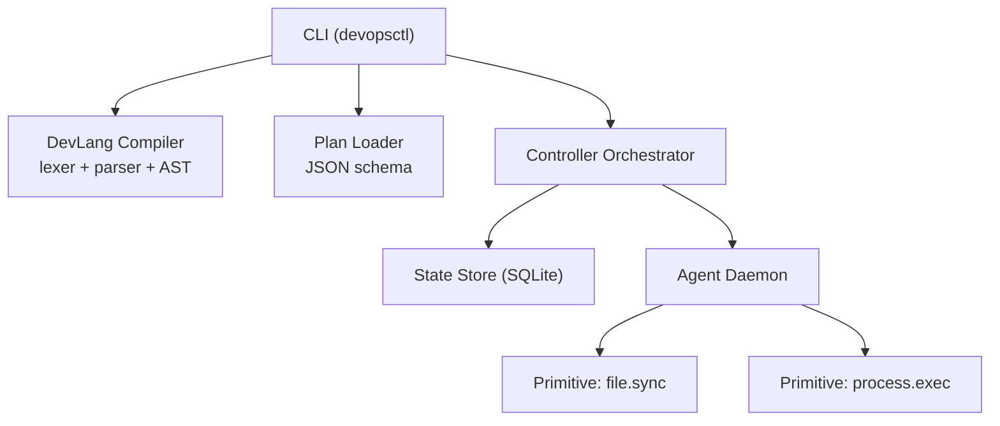
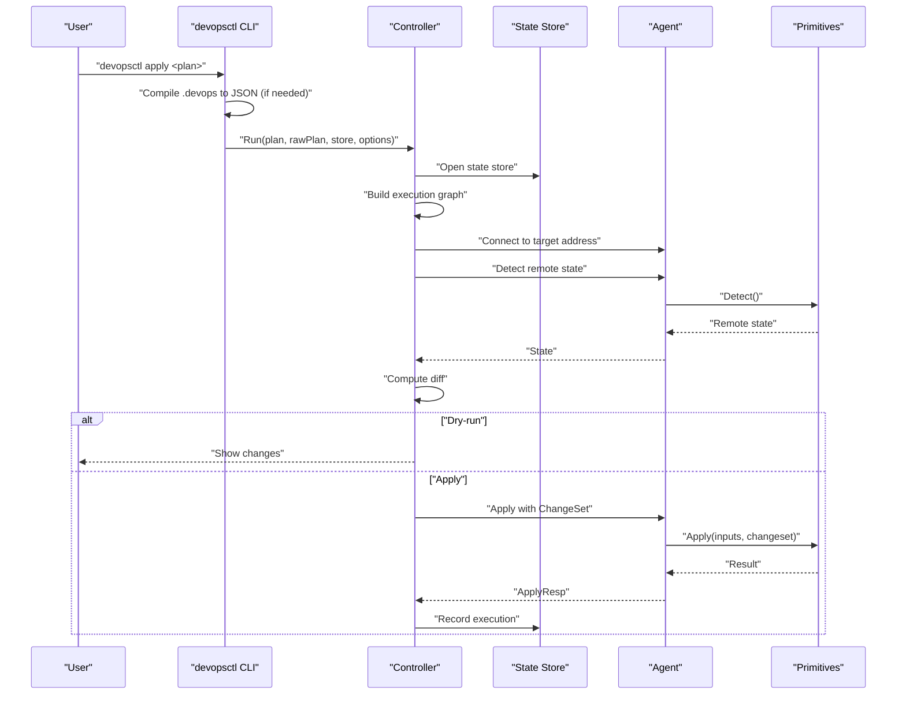
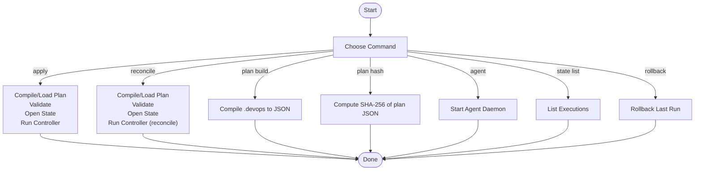
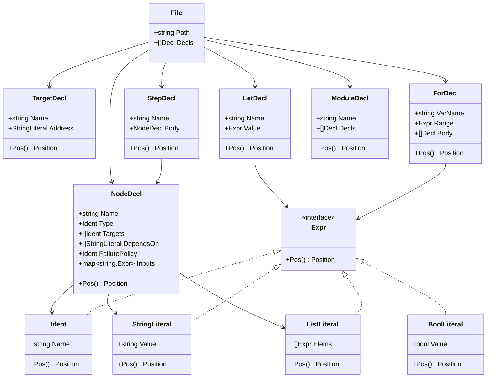
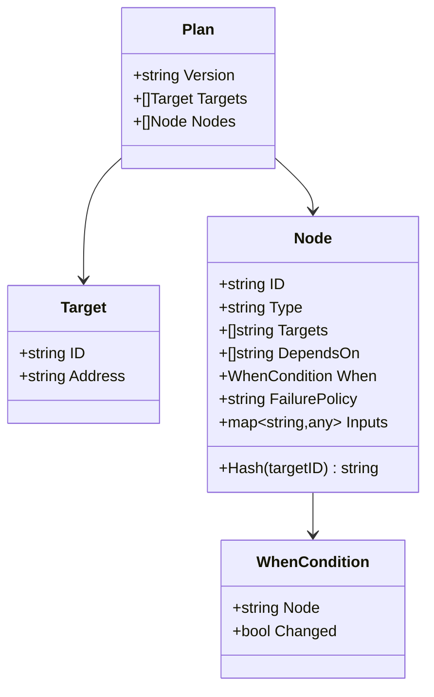
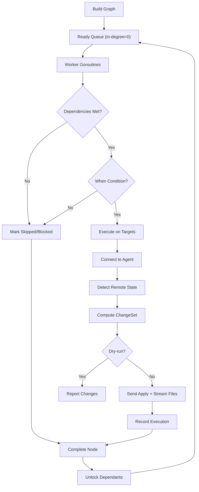
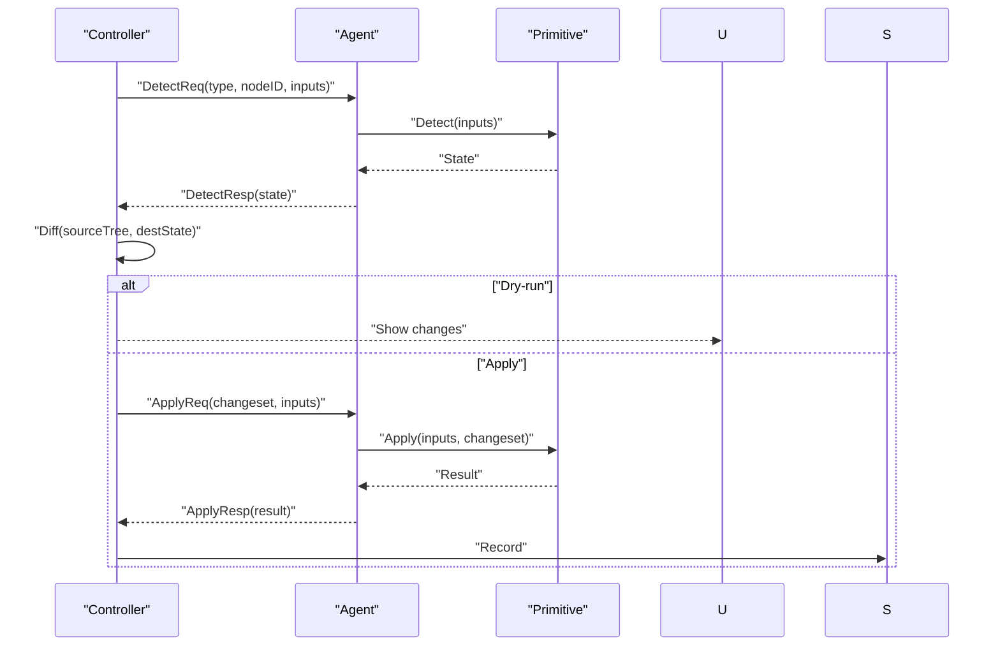
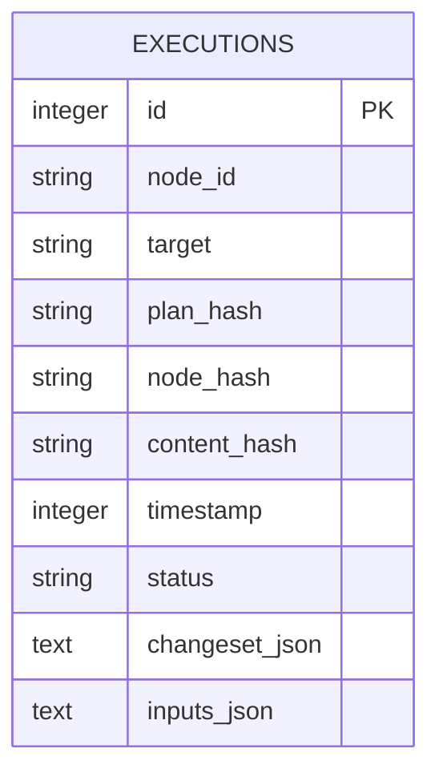
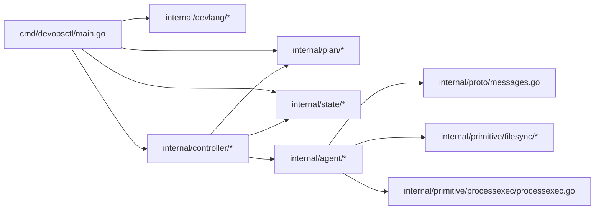

# Getting Started

<cite>
**Referenced Files in This Document**
- [main.go](file://cmd/devopsctl/main.go)
- [go.mod](file://go.mod)
- [lexer.go](file://internal/devlang/lexer.go)
- [parser.go](file://internal/devlang/parser.go)
- [ast.go](file://internal/devlang/ast.go)
- [schema.go](file://internal/plan/schema.go)
- [processexec.go](file://internal/primitive/processexec/processexec.go)
- [orchestrator.go](file://internal/controller/orchestrator.go)
- [server.go](file://internal/agent/server.go)
- [store.go](file://internal/state/store.go)
- [plan.devops](file://plan.devops)
- [plan.json](file://plan.json)
</cite>

## Table of Contents
1. [Introduction](#introduction)
2. [Project Structure](#project-structure)
3. [Core Components](#core-components)
4. [Architecture Overview](#architecture-overview)
5. [Detailed Component Analysis](#detailed-component-analysis)
6. [Dependency Analysis](#dependency-analysis)
7. [Performance Considerations](#performance-considerations)
8. [Troubleshooting Guide](#troubleshooting-guide)
9. [Conclusion](#conclusion)
10. [Appendices](#appendices)

## Introduction
DevOpsCtl is a programming-first DevOps execution engine. Instead of configuring infrastructure through external DSLs or GUIs, you write declarative plans in a small domain language (.devops) that compile to a portable execution plan. You then run the plan against one or more targets (remote or local machines) via agents. This approach treats infrastructure as programmable code: version it, review it, and iterate on it like application code.

Key benefits over traditional tools:
- Plans are code: linting, formatting, diffs, and CI checks apply.
- Deterministic execution: the controller validates and executes a strict graph of nodes with explicit dependencies.
- Idempotent state tracking: persistent records enable safe resumes, reconciliation, and rollbacks.
- Extensible primitives: file synchronization and process execution are built-in; others can be added.

## Project Structure
At a high level, DevOpsCtl consists of:
- CLI entrypoint and command wiring
- A small .devops language (lexer, parser, AST)
- Plan representation and validation
- Controller orchestrator (graph building, scheduling, state)
- Agent daemon (accepts TCP connections, applies primitives)
- Primitives (file.sync, process.exec)
- Local state store (SQLite)

**Diagram sources**
- [main.go](file://cmd/devopsctl/main.go#L21-L273)
- [lexer.go](file://internal/devlang/lexer.go#L1-L247)
- [parser.go](file://internal/devlang/parser.go#L1-L495)
- [ast.go](file://internal/devlang/ast.go#L1-L126)
- [schema.go](file://internal/plan/schema.go#L1-L77)
- [orchestrator.go](file://internal/controller/orchestrator.go#L1-L653)
- [server.go](file://internal/agent/server.go#L1-L51)
- [store.go](file://internal/state/store.go#L1-L226)

**Section sources**
- [main.go](file://cmd/devopsctl/main.go#L21-L273)
- [go.mod](file://go.mod#L1-L14)

## Core Components
- CLI: Provides commands to compile .devops to JSON, apply or reconcile plans, start agents, inspect state, compute plan hashes, and rollback.
- DevLang: Lexes and parses .devops into an AST; later lowered into a plan.
- Plan: JSON schema representing Targets and Nodes with inputs, dependencies, and policies.
- Controller: Builds a dependency graph, schedules nodes, coordinates agents, tracks state, and enforces policies.
- Agent: Accepts TCP connections and applies primitives on the host.
- Primitives: Built-in operations like file synchronization and process execution.
- State: Append-only SQLite store for execution history and reconciliation.

**Section sources**
- [main.go](file://cmd/devopsctl/main.go#L21-L273)
- [schema.go](file://internal/plan/schema.go#L11-L77)
- [orchestrator.go](file://internal/controller/orchestrator.go#L34-L300)
- [server.go](file://internal/agent/server.go#L15-L51)
- [store.go](file://internal/state/store.go#L33-L226)

## Architecture Overview
End-to-end flow for applying a plan:
1. Author a .devops file with targets and nodes.
2. Compile to JSON (or pass .devops directly).
3. Controller loads the plan, builds a dependency graph, and schedules nodes.
4. For each (node × target) pair, the controller connects to the agent, detects differences, streams changes if needed, and records state.

**Diagram sources**
- [main.go](file://cmd/devopsctl/main.go#L32-L87)
- [orchestrator.go](file://internal/controller/orchestrator.go#L34-L311)
- [store.go](file://internal/state/store.go#L38-L84)

## Detailed Component Analysis

### CLI Commands and Workflow
- apply: Compiles .devops to JSON if needed, validates the plan, opens state, and runs the controller with optional dry-run, parallelism, and resume.
- reconcile: Same as apply but reconciles to match the plan using recorded state as truth.
- plan build: Compiles .devops to JSON and prints or writes to file.
- plan hash: Prints the SHA-256 fingerprint of a plan JSON.
- agent: Starts the agent daemon on a configurable address.
- state list: Lists executions from the local state store.
- rollback: Rolls back the last run using stored change sets.

**Diagram sources**
- [main.go](file://cmd/devopsctl/main.go#L21-L273)

**Section sources**
- [main.go](file://cmd/devopsctl/main.go#L21-L273)

### Language Fundamentals: .devops
- Tokens include keywords (target, node, let, module, step, for, in), identifiers, strings, booleans, and operators.
- Declarations supported include target, node, let, for, step, module.
- The parser constructs an AST with positions for diagnostics.

**Diagram sources**
- [lexer.go](file://internal/devlang/lexer.go#L3-L32)
- [ast.go](file://internal/devlang/ast.go#L14-L126)
- [parser.go](file://internal/devlang/parser.go#L27-L495)

**Section sources**
- [lexer.go](file://internal/devlang/lexer.go#L1-L247)
- [parser.go](file://internal/devlang/parser.go#L1-L495)
- [ast.go](file://internal/devlang/ast.go#L1-L126)

### Plan Schema and Execution Model
- Plan: Top-level structure with version, targets, and nodes.
- Target: Named endpoint with an address.
- Node: Unit of work with type, target bindings, dependencies, optional conditions, failure policy, and inputs.
- Node hashing: Deterministic hash of type, target, and inputs enables idempotent state tracking.

**Diagram sources**
- [schema.go](file://internal/plan/schema.go#L11-L77)

**Section sources**
- [schema.go](file://internal/plan/schema.go#L1-L77)

### Controller Orchestration
- Graph building: Constructs adjacency lists and in-degree counts from node dependencies.
- Scheduling: Uses a ready queue and worker goroutines to execute nodes respecting dependencies and policies.
- Per-target execution: For each node × target, the controller connects to the agent, performs detect-diff-apply, streams file chunks when needed, and records state.
- Policies: failure_policy controls behavior on failure (halt, continue, rollback).
- Resuming and reconciling: Uses stored execution records to skip or reconcile unchanged work.

**Diagram sources**
- [orchestrator.go](file://internal/controller/orchestrator.go#L34-L300)
- [orchestrator.go](file://internal/controller/orchestrator.go#L302-L513)

**Section sources**
- [orchestrator.go](file://internal/controller/orchestrator.go#L26-L300)

### Agent and Primitives
- Agent: Listens on a TCP address, accepts connections, and handles apply/rollback requests.
- file.sync: Implemented in the controller as a detect-diff-apply pipeline with streaming.
- process.exec: Executes commands locally with optional timeout and working directory; returns structured result.

**Diagram sources**
- [server.go](file://internal/agent/server.go#L15-L51)
- [orchestrator.go](file://internal/controller/orchestrator.go#L313-L442)
- [processexec.go](file://internal/primitive/processexec/processexec.go#L13-L82)

**Section sources**
- [server.go](file://internal/agent/server.go#L1-L51)
- [processexec.go](file://internal/primitive/processexec/processexec.go#L1-L83)

### State Management
- SQLite-backed append-only store with index on node/target pairs.
- Records include node_id, target, plan_hash, node_hash, content_hash, timestamp, status, changeset, and inputs.
- Supports queries for last successful, latest execution, listing per node, and last run by plan hash.

**Diagram sources**
- [store.go](file://internal/state/store.go#L17-L31)

**Section sources**
- [store.go](file://internal/state/store.go#L33-L226)

## Dependency Analysis
- CLI depends on devlang, plan, controller, and state packages.
- Controller depends on plan, state, primitives, and proto messages.
- Agent depends on proto messages and primitives.
- Primitives depend on proto.Result.

**Diagram sources**
- [main.go](file://cmd/devopsctl/main.go#L4-L18)
- [orchestrator.go](file://internal/controller/orchestrator.go#L1-L22)
- [server.go](file://internal/agent/server.go#L1-L13)

**Section sources**
- [main.go](file://cmd/devopsctl/main.go#L4-L18)
- [go.mod](file://go.mod#L1-L14)

## Performance Considerations
- Parallelism: Control max concurrent target executions with the parallelism flag.
- Streaming: File transfers are streamed in chunks to reduce memory overhead.
- State indexing: Index on node_id and target accelerates lookups for resume/reconcile.
- Failure policy: Using rollback can mitigate partial failures but may incur extra work.

[No sources needed since this section provides general guidance]

## Troubleshooting Guide
Common setup and execution issues:
- Go runtime requirement: The project requires Go 1.18 or newer. Ensure your environment meets this version requirement before building or running.
- Missing agent: The controller connects to targets via TCP. Ensure the agent is running on the target’s address/port before applying.
- Permission errors: The state database is created under the user’s home directory. Verify write permissions to the home directory.
- Plan validation failures: The controller validates the plan before execution. Fix reported validation errors and retry.
- Unsupported primitive: Only supported primitives are executed. Verify node.type matches a supported type.
- Timeout or execution errors: process.exec returns structured results with exit codes and classes. Inspect stderr and exit code for diagnostics.

**Section sources**
- [go.mod](file://go.mod#L3-L3)
- [server.go](file://internal/agent/server.go#L21-L35)
- [store.go](file://internal/state/store.go#L38-L61)
- [orchestrator.go](file://internal/controller/orchestrator.go#L67-L72)
- [processexec.go](file://internal/primitive/processexec/processexec.go#L47-L79)

## Conclusion
DevOpsCtl lets you define and execute infrastructure as programmable code. Start by writing a .devops file, compile it to JSON, run an agent on targets, and apply the plan. Use the controller’s state tracking to resume, reconcile, and rollback safely. As you grow, extend primitives and integrate with your CI/CD workflows.

[No sources needed since this section summarizes without analyzing specific files]

## Appendices

### Installation and Setup
- Install prerequisites:
  - Go 1.18 or newer
  - Git (to clone the repository)
- Build the CLI:
  - Clone the repository and build the binary using the Go toolchain.
- Start an agent:
  - Run the agent command on the target host to listen on the configured address.
- Prepare a plan:
  - Write a .devops file with targets and nodes, or compile an existing .devops to JSON.

**Section sources**
- [go.mod](file://go.mod#L3-L3)
- [main.go](file://cmd/devopsctl/main.go#L148-L159)
- [server.go](file://internal/agent/server.go#L21-L35)

### First Steps: Writing Your First .devops
- Define a target with an address.
- Define nodes:
  - file.sync: specify src and dest paths.
  - process.exec: specify cmd array and optional cwd.
- Compile to JSON:
  - Use the plan build command to compile .devops to JSON.
- Apply the plan:
  - Ensure the agent is running on the target address, then run apply with the plan.

**Section sources**
- [plan.devops](file://plan.devops#L1-L20)
- [plan.json](file://plan.json#L1-L25)
- [main.go](file://cmd/devopsctl/main.go#L194-L245)
- [main.go](file://cmd/devopsctl/main.go#L32-L87)

### Basic CLI Commands Quick Reference
- devopsctl plan build <file.devops>: Compile .devops to JSON.
- devopsctl plan hash <plan.json>: Print SHA-256 fingerprint.
- devopsctl apply <plan>: Apply a plan (supports .devops or JSON).
- devopsctl reconcile <plan>: Reconcile to match plan using recorded state.
- devopsctl agent: Start the agent daemon.
- devopsctl state list [--node]: List executions from state store.
- devopsctl rollback --last: Rollback the last run.

**Section sources**
- [main.go](file://cmd/devopsctl/main.go#L194-L266)

### Practical Examples
- File synchronization:
  - Define a node with type file.sync and inputs src and dest.
  - Apply the plan; the controller computes a diff and streams changes if needed.
- Simple process execution:
  - Define a node with type process.exec and inputs cmd and cwd.
  - Apply the plan; the controller executes the command and reports results.

**Section sources**
- [plan.devops](file://plan.devops#L5-L19)
- [plan.json](file://plan.json#L4-L23)
- [processexec.go](file://internal/primitive/processexec/processexec.go#L13-L82)
- [orchestrator.go](file://internal/controller/orchestrator.go#L444-L513)