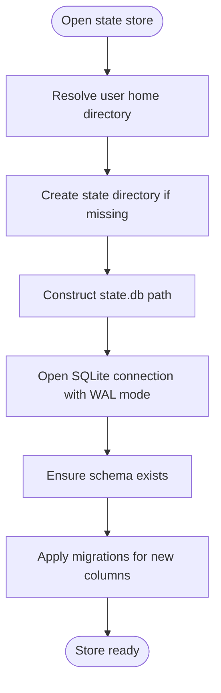
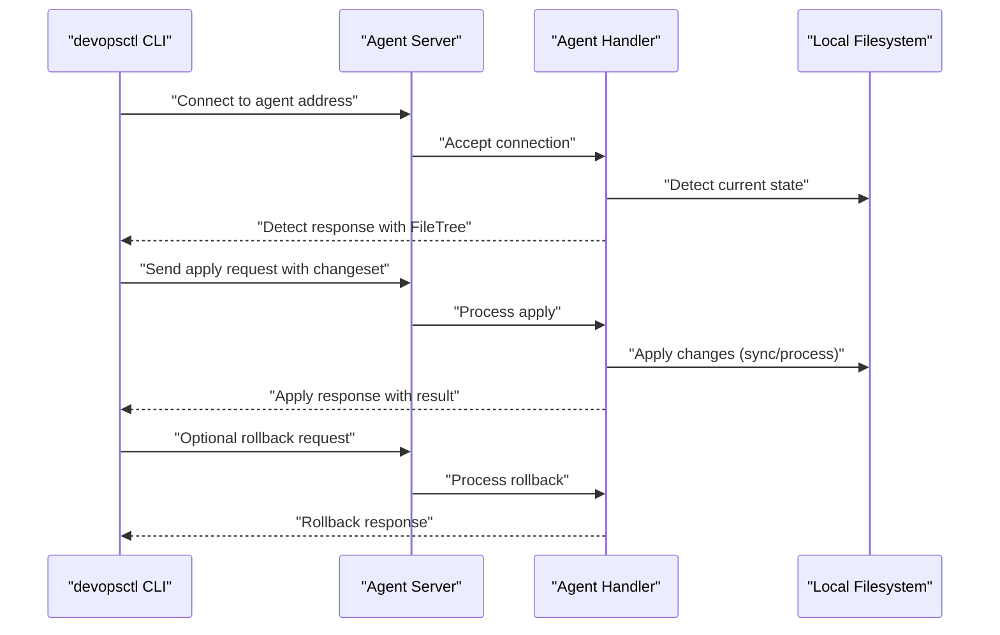

# Installation and Setup

<cite>
**Referenced Files in This Document**
- [go.mod](file://go.mod)
- [cmd/devopsctl/main.go](file://cmd/devopsctl/main.go)
- [internal/state/store.go](file://internal/state/store.go)
- [internal/agent/server.go](file://internal/agent/server.go)
- [internal/agent/handler.go](file://internal/agent/handler.go)
- [internal/proto/messages.go](file://internal/proto/messages.go)
- [internal/primitive/processexec/processexec.go](file://internal/primitive/processexec/processexec.go)
- [plan.devops](file://plan.devops)
- [test_e2e.sh](file://test_e2e.sh)
</cite>

## Table of Contents
1. [Introduction](#introduction)
2. [System Requirements](#system-requirements)
3. [Supported Operating Systems and Architectures](#supported-operating-systems-and-architectures)
4. [Prerequisites](#prerequisites)
5. [Installation Methods](#installation-methods)
6. [Environment Setup](#environment-setup)
7. [Network Configuration and Ports](#network-configuration-and-ports)
8. [Local State Database Initialization](#local-state-database-initialization)
9. [Initial Configuration](#initial-configuration)
10. [Verification and Basic Connectivity Testing](#verification-and-basic-connectivity-testing)
11. [Troubleshooting Guide](#troubleshooting-guide)
12. [Conclusion](#conclusion)

## Introduction
This guide provides end-to-end installation and setup instructions for DevOpsCtl. It covers system requirements, supported platforms, prerequisites, building from source, verifying the installation, and preparing the environment for agent-based operations. It also documents the local state database location and initialization behavior, along with network configuration and port requirements for agent communication.

## System Requirements
- Go runtime: Version 1.18 or later is required by the project module definition.
- Operating systems: The project is written in Go and is portable across major OS families. The agent uses a standard TCP listener, so any platform supporting Go and TCP networking is suitable.
- Architectures: The project is built with Go’s cross-platform toolchain; binaries can be produced for common architectures via Go’s build system.

**Section sources**
- [go.mod](file://go.mod#L1-L14)

## Supported Operating Systems and Architectures
- Operating systems: Linux, macOS, Windows (any modern desktop/server OS supported by Go).
- Architectures: amd64, arm64, and other architectures supported by Go’s toolchain. Cross-compilation is possible using standard Go build flags.

[No sources needed since this section provides general guidance]

## Prerequisites
- Go toolchain: Version 1.18 or newer is required.
- Git (optional, for cloning the repository).
- Standard Unix/Linux/macOS or Windows developer tools (compilers, linkers, etc.).

**Section sources**
- [go.mod](file://go.mod#L1-L14)

## Installation Methods

### Build from Source Using Go Modules
Follow these steps to compile DevOpsCtl from source:
1. Ensure the Go toolchain meets the required version.
2. Clone or prepare the repository locally.
3. Build the CLI:
   - Navigate to the repository root.
   - Run the Go build command to produce the devopsctl binary.
4. Verify the binary:
   - Execute the binary with a help flag to confirm it runs.

Notes:
- The project uses Go modules and third-party dependencies managed via go.mod.
- The CLI entry point resides under the cmd directory and integrates multiple internal packages.

**Section sources**
- [go.mod](file://go.mod#L1-L14)
- [cmd/devopsctl/main.go](file://cmd/devopsctl/main.go#L1-L273)

### Install Pre-built Binaries
- Download a pre-built binary appropriate for your OS/architecture from the project’s distribution channel (if available).
- Make the binary executable and place it in a directory on your PATH.
- Verify installation by running the CLI with a help flag.

[No sources needed since this section provides general guidance]

### Package Manager Installations
- If available, install DevOpsCtl via your OS package manager (e.g., Homebrew on macOS, apt on Debian/Ubuntu, etc.).
- Confirm installation by invoking the CLI with a help flag.

[No sources needed since this section provides general guidance]

## Environment Setup
- GOPATH and PATH:
  - Ensure your shell’s PATH includes the directory containing the devopsctl binary.
  - If you are developing or building locally, set GOPATH appropriately for your workspace.
- Development environment:
  - Use a recent Go version compatible with the module definition.
  - Keep dependencies managed via Go modules; run module tidy if needed.

**Section sources**
- [go.mod](file://go.mod#L1-L14)
- [cmd/devopsctl/main.go](file://cmd/devopsctl/main.go#L1-L273)

## Network Configuration and Ports
- Agent listener:
  - The agent listens on a configurable TCP address and port. By default, it binds to a port suitable for local testing.
  - The agent accepts connections and processes controller requests over a simple line-delimited JSON protocol.
- Port requirements:
  - Choose a free TCP port on the target host for the agent.
  - Ensure outbound and inbound traffic is permitted on the chosen port between the controller and agent hosts.
- Firewall settings:
  - Allow TCP ingress on the agent’s listening port from the controller host.
  - Ensure the controller can reach the agent’s address and port.

**Section sources**
- [cmd/devopsctl/main.go](file://cmd/devopsctl/main.go#L148-L160)
- [internal/agent/server.go](file://internal/agent/server.go#L20-L50)
- [internal/agent/handler.go](file://internal/agent/handler.go#L16-L51)
- [internal/proto/messages.go](file://internal/proto/messages.go#L1-L117)
- [plan.devops](file://plan.devops#L1-L20)

## Local State Database Initialization
- Location:
  - The local state database is stored under the user’s home directory in a hidden folder. On first access, the directory and database file are created automatically.
- Schema:
  - The state database is SQLite-backed and initialized with a schema that tracks execution records, statuses, hashes, and related metadata.
- Behavior:
  - On opening the store, the system ensures the directory exists and initializes the schema if needed.
  - Existing databases are migrated to include new columns as required.

**Diagram sources**
- [internal/state/store.go](file://internal/state/store.go#L38-L61)

**Section sources**
- [internal/state/store.go](file://internal/state/store.go#L1-L226)

## Initial Configuration
- Target and node configuration:
  - Define targets and nodes in either JSON or .devops format. Targets specify the agent address and port.
  - Example configurations demonstrate a local target bound to the agent’s default address and port.
- Example plan files:
  - A .devops example is included to show target and node definitions.
  - A JSON plan example is used by the end-to-end test script to configure a local target and nodes.

**Section sources**
- [plan.devops](file://plan.devops#L1-L20)
- [test_e2e.sh](file://test_e2e.sh#L35-L53)

## Verification and Basic Connectivity Testing
- Build the CLI:
  - Compile the project to produce the devopsctl binary.
- Start the agent:
  - Launch the agent with a chosen address/port.
- Run a simple plan:
  - Use a minimal plan (e.g., a file sync node) to validate that the agent responds and applies changes.
- Idempotency and drift checks:
  - Repeatedly apply the same plan to verify idempotency.
  - Modify source content to confirm drift detection and reconciliation.
- Process execution:
  - Include a process execution node to validate command execution on the agent host.
- Plan hashing:
  - Compute the SHA-256 fingerprint of the plan to ensure integrity checks.
- State inspection:
  - List state entries to confirm execution records are persisted.

**Diagram sources**
- [cmd/devopsctl/main.go](file://cmd/devopsctl/main.go#L148-L160)
- [internal/agent/server.go](file://internal/agent/server.go#L20-L50)
- [internal/agent/handler.go](file://internal/agent/handler.go#L16-L51)
- [internal/proto/messages.go](file://internal/proto/messages.go#L14-L76)
- [internal/primitive/processexec/processexec.go](file://internal/primitive/processexec/processexec.go#L13-L83)

**Section sources**
- [test_e2e.sh](file://test_e2e.sh#L21-L317)

## Troubleshooting Guide
- Dependency conflicts:
  - Ensure the Go version meets the module requirement.
  - Clean and re-fetch dependencies if necessary.
- Permission problems:
  - Verify the agent has permissions to access the destination directory for file synchronization.
  - Ensure the process execution node has permission to run the specified command in the working directory.
- Port binding issues:
  - Confirm the chosen port is free and not blocked by firewall rules.
  - Check for conflicting services on the same port.
- State database errors:
  - Verify the user home directory is writable.
  - Ensure the state directory exists and is accessible.
- Protocol mismatches:
  - Confirm the controller and agent use compatible plan formats and message types.

**Section sources**
- [go.mod](file://go.mod#L1-L14)
- [internal/state/store.go](file://internal/state/store.go#L38-L61)
- [internal/agent/server.go](file://internal/agent/server.go#L20-L50)
- [internal/agent/handler.go](file://internal/agent/handler.go#L16-L51)
- [internal/primitive/processexec/processexec.go](file://internal/primitive/processexec/processexec.go#L13-L83)

## Conclusion
You can install DevOpsCtl by building from source with a compatible Go version, using pre-built binaries, or installing via a package manager. Configure the agent’s address and port, ensure network access, and initialize the local state database automatically. Use the included examples and end-to-end script to validate installation and connectivity. If issues arise, review Go version compatibility, permissions, ports, and state database accessibility.