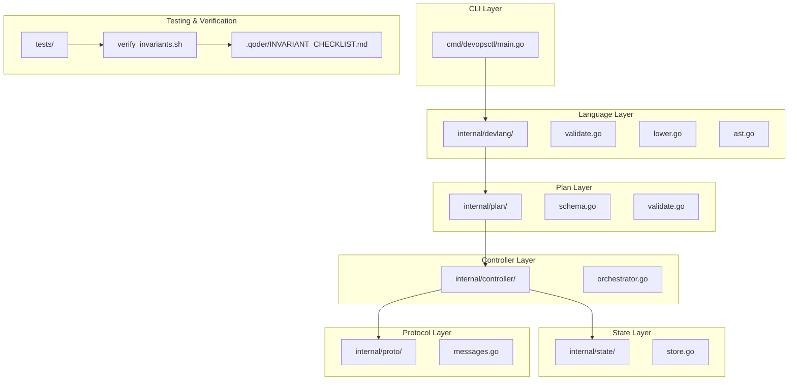
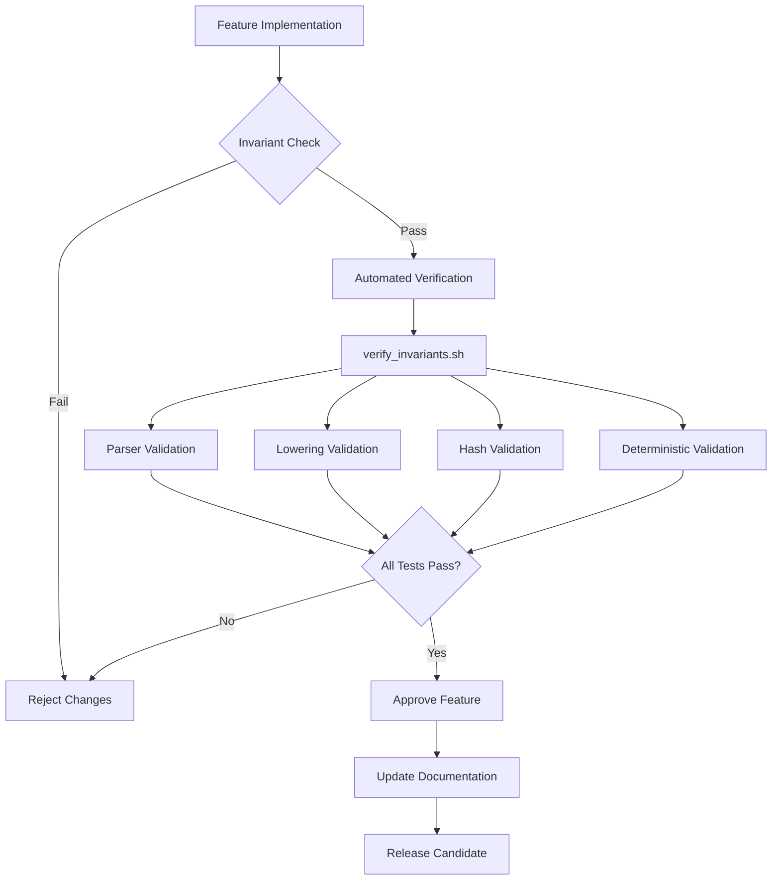
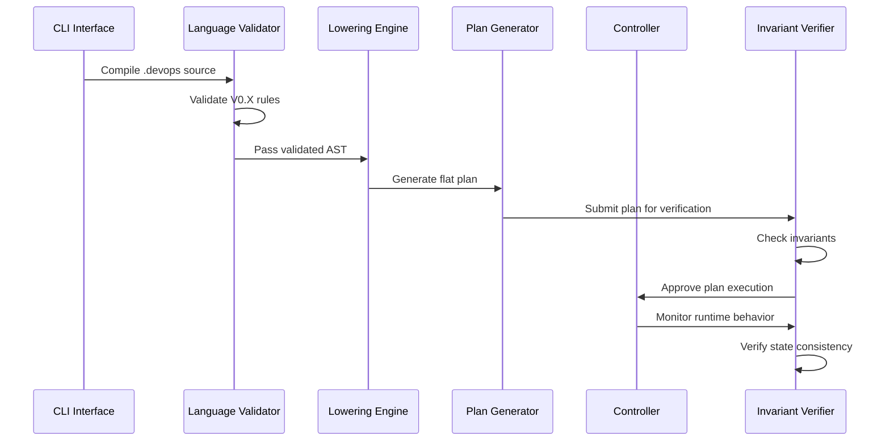
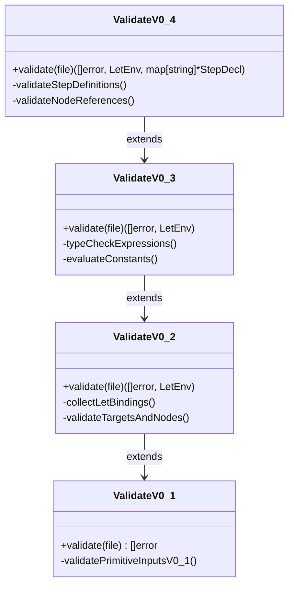
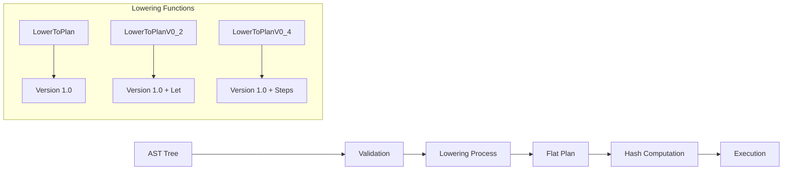
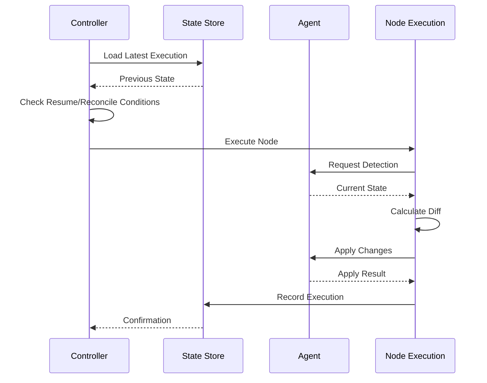
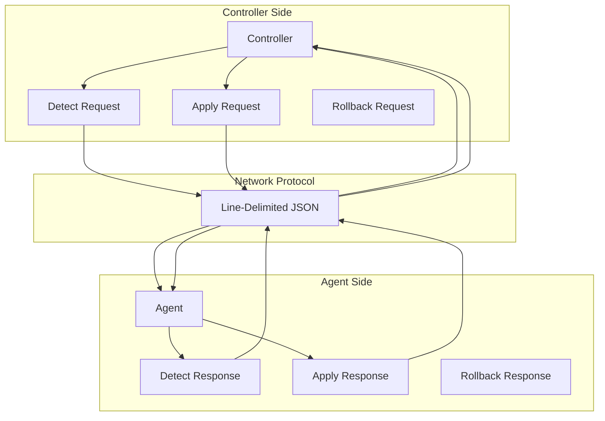
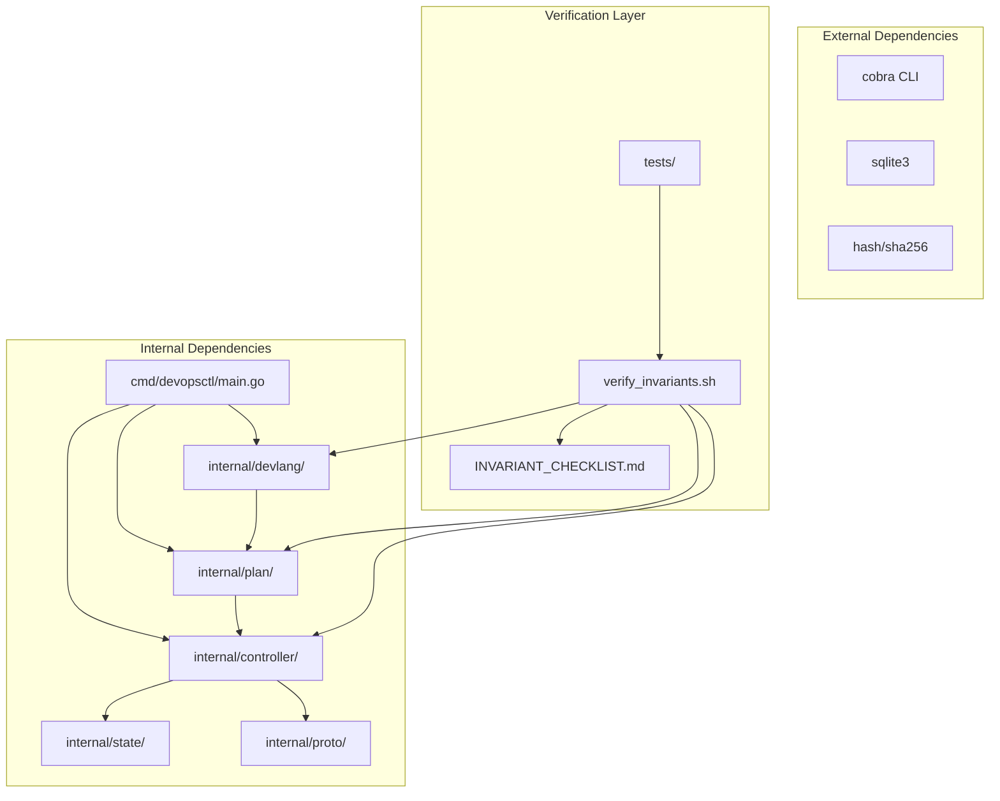

# Invariant Verification Framework

<cite>
**Referenced Files in This Document**
- [main.go](file://cmd/devopsctl/main.go)
- [DESIGN.md](file://DESIGN.md)
- [verify_invariants.sh](file://verify_invariants.sh)
- [validate.go](file://internal/devlang/validate.go)
- [lower.go](file://internal/devlang/lower.go)
- [schema.go](file://internal/plan/schema.go)
- [validate.go](file://internal/plan/validate.go)
- [orchestrator.go](file://internal/controller/orchestrator.go)
- [store.go](file://internal/state/store.go)
- [messages.go](file://internal/proto/messages.go)
- [INVARIANT_CHECKLIST.md](file://.qoder/INVARIANT_CHECKLIST.md)
- [step_basic.devops](file://tests/v0_4/valid/step_basic.devops)
- [step_duplicate.devops](file://tests/v0_4/invalid/step_duplicate.devops)
- [step_undefined.devops](file://tests/v0_4/invalid/step_undefined.devops)
</cite>

## Table of Contents
1. [Introduction](#introduction)
2. [Project Structure](#project-structure)
3. [Core Components](#core-components)
4. [Architecture Overview](#architecture-overview)
5. [Invariant Verification Framework](#invariant-verification-framework)
6. [Detailed Component Analysis](#detailed-component-analysis)
7. [Dependency Analysis](#dependency-analysis)
8. [Performance Considerations](#performance-considerations)
9. [Troubleshooting Guide](#troubleshooting-guide)
10. [Conclusion](#conclusion)

## Introduction

The Invariant Verification Framework is a comprehensive quality assurance system designed to ensure architectural integrity across the devopsctl codebase. This framework enforces four fundamental invariants that guarantee deterministic, reproducible, and auditable DevOps execution plans. The system operates through automated scripts, rigorous validation processes, and continuous monitoring to prevent architectural drift and maintain long-term stability.

The framework is built upon the principle that "All language features compile to flat, deterministic primitives" and that "The runtime NEVER learns new concepts." These principles form the foundation for maintaining consistency across language versions and ensuring that execution remains predictable and verifiable.

## Project Structure

The devopsctl project follows a layered architecture with clear separation of concerns:

**Diagram sources**
- [main.go](file://cmd/devopsctl/main.go#L1-L324)
- [validate.go](file://internal/devlang/validate.go#L1-L1050)
- [schema.go](file://internal/plan/schema.go#L1-L77)

The project structure demonstrates clear architectural boundaries with the CLI layer serving as the entry point, followed by language processing, plan generation, controller orchestration, state management, and protocol communication layers.

**Section sources**
- [main.go](file://cmd/devopsctl/main.go#L1-L324)
- [DESIGN.md](file://DESIGN.md#L1-L334)

## Core Components

The Invariant Verification Framework consists of several interconnected components that work together to maintain architectural integrity:

### Four Fundamental Invariants

The framework enforces four non-negotiable architectural invariants:

1. **Lowering Is a One-Way Door**: Ensures all high-level constructs are eliminated during compilation
2. **Hashes Are Computed After Full Expansion**: Guarantees deterministic hash computation
3. **Deterministic Order Everywhere**: Maintains reproducible compilation across environments
4. **Validation Is Version-Strict**: Prevents feature backports and maintains version isolation

### Verification Infrastructure

The framework includes automated verification scripts, comprehensive test suites, and architectural checklists:

**Diagram sources**
- [verify_invariants.sh](file://verify_invariants.sh#L1-L156)
- [INVARIANT_CHECKLIST.md](file://.qoder/INVARIANT_CHECKLIST.md#L1-L162)

**Section sources**
- [DESIGN.md](file://DESIGN.md#L13-L81)
- [verify_invariants.sh](file://verify_invariants.sh#L1-L156)
- [INVARIANT_CHECKLIST.md](file://.qoder/INVARIANT_CHECKLIST.md#L1-L162)

## Architecture Overview

The Invariant Verification Framework operates through a multi-layered validation system that ensures compliance with architectural principles:

**Diagram sources**
- [main.go](file://cmd/devopsctl/main.go#L33-L100)
- [validate.go](file://internal/devlang/validate.go#L417-L453)
- [lower.go](file://internal/devlang/lower.go#L9-L65)
- [orchestrator.go](file://internal/controller/orchestrator.go#L34-L300)

The architecture ensures that all language features are validated against the four invariants before any execution occurs, preventing architectural violations from reaching production systems.

## Invariant Verification Framework

### Invariant 1: Lowering Is a One-Way Door

This invariant ensures that all high-level language constructs are completely eliminated during compilation, leaving only primitive operations in the final execution plan.

**Verification Mechanisms:**
- Runtime schema validation to prevent language constructs in plan files
- Controller independence verification to ensure no language package imports
- Automated grep-based checks for remaining high-level constructs

**Implementation Details:**
The framework validates that the final plan contains only:
- Nodes with concrete primitive types
- Targets with concrete addresses  
- Concrete input values
- No step, for, let, param, or import references

**Section sources**
- [DESIGN.md](file://DESIGN.md#L15-L31)
- [verify_invariants.sh](file://verify_invariants.sh#L35-L63)
- [lower.go](file://internal/devlang/lower.go#L180-L282)

### Invariant 2: Hashes Are Computed After Full Expansion

This invariant guarantees that hash computation occurs only after all high-level constructs have been expanded to their primitive equivalents.

**Verification Mechanisms:**
- Hash computation location validation in plan package
- Expansion order verification through deterministic compilation
- Cross-platform hash stability testing

**Implementation Details:**
The hash computation operates on the fully expanded plan, ensuring that:
- Step-based and manual expansions produce identical hashes
- Import safety is maintained through content hashing
- Refactoring without semantic change preserves hash values

**Section sources**
- [DESIGN.md](file://DESIGN.md#L32-L46)
- [verify_invariants.sh](file://verify_invariants.sh#L66-L79)
- [schema.go](file://internal/plan/schema.go#L54-L76)

### Invariant 3: Deterministic Order Everywhere

This invariant ensures that all compilation processes maintain consistent ordering across different environments and platforms.

**Verification Mechanisms:**
- Map iteration order validation in lowering processes
- Compilation reproducibility testing across platforms
- Expansion order documentation and enforcement

**Implementation Details:**
The framework enforces deterministic behavior through:
- Sorted map key iteration for all iteration processes
- Consistent step expansion order in topological sorting
- Deterministic import resolution order
- Fixed node emission order by node ID

**Section sources**
- [DESIGN.md](file://DESIGN.md#L47-L64)
- [verify_invariants.sh](file://verify_invariants.sh#L82-L94)
- [validate.go](file://internal/devlang/validate.go#L717-L1011)

### Invariant 4: Validation Is Version-Strict

This invariant maintains strict version boundaries, preventing features from leaking between language versions.

**Verification Mechanisms:**
- Version-specific validation function presence
- Feature rejection for unsupported versions
- Clear error messaging with version requirements

**Implementation Details:**
Each validation function explicitly rejects unsupported constructs and provides actionable error messages. The framework prevents:
- Silent semantic drift between versions
- Accidental feature backports
- CI surprises from version mismatches

**Section sources**
- [DESIGN.md](file://DESIGN.md#L65-L81)
- [verify_invariants.sh](file://verify_invariants.sh#L97-L112)
- [validate.go](file://internal/devlang/validate.go#L196-L315)

## Detailed Component Analysis

### Language Validation System

The language validation system enforces version-specific rules through dedicated validation functions:

**Diagram sources**
- [validate.go](file://internal/devlang/validate.go#L196-L315)
- [validate.go](file://internal/devlang/validate.go#L23-L194)
- [validate.go](file://internal/devlang/validate.go#L493-L677)
- [validate.go](file://internal/devlang/validate.go#L717-L1011)

**Section sources**
- [validate.go](file://internal/devlang/validate.go#L1-L1050)

### Plan Generation and Lowering

The lowering process transforms high-level AST constructs into flat, executable plans:

**Diagram sources**
- [lower.go](file://internal/devlang/lower.go#L9-L65)
- [lower.go](file://internal/devlang/lower.go#L92-L148)
- [lower.go](file://internal/devlang/lower.go#L180-L282)

**Section sources**
- [lower.go](file://internal/devlang/lower.go#L1-L283)

### Controller Orchestration and State Management

The controller manages execution while maintaining state consistency:

**Diagram sources**
- [orchestrator.go](file://internal/controller/orchestrator.go#L34-L300)
- [store.go](file://internal/state/store.go#L68-L84)

**Section sources**
- [orchestrator.go](file://internal/controller/orchestrator.go#L1-L653)
- [store.go](file://internal/state/store.go#L1-L226)

### Protocol Communication

The framework uses a line-delimited JSON protocol for reliable communication:

**Diagram sources**
- [messages.go](file://internal/proto/messages.go#L1-L117)

**Section sources**
- [messages.go](file://internal/proto/messages.go#L1-L117)

## Dependency Analysis

The Invariant Verification Framework establishes clear dependency relationships that enforce architectural boundaries:

**Diagram sources**
- [main.go](file://cmd/devopsctl/main.go#L4-L19)
- [verify_invariants.sh](file://verify_invariants.sh#L1-L156)

The dependency analysis reveals a clean separation where the CLI layer depends on language processing, which generates plans consumed by the controller layer. The verification layer operates independently to ensure compliance without affecting core functionality.

**Section sources**
- [main.go](file://cmd/devopsctl/main.go#L1-L324)
- [verify_invariants.sh](file://verify_invariants.sh#L1-L156)

## Performance Considerations

The Invariant Verification Framework is designed with performance optimization in mind:

### Hash Computation Efficiency
- Hash computation occurs only after full expansion, avoiding redundant calculations
- Deterministic ordering eliminates cache misses from inconsistent iteration
- Content-based hashing ensures efficient change detection

### Execution Optimization
- Flat plan structure enables optimal execution without runtime interpretation
- Deterministic compilation reduces CI pipeline variability
- State persistence minimizes redundant operations

### Scalability Factors
- Parallel execution limits prevent resource exhaustion
- Incremental state updates reduce database overhead
- Efficient change set computation optimizes network transfer

## Troubleshooting Guide

Common issues and their resolution strategies:

### Invariant Violation Detection

**Symptoms:**
- Compilation fails with version-specific error messages
- Hash mismatch between equivalent plans
- Non-deterministic compilation output
- Runtime errors indicating unsupported constructs

**Resolution Steps:**
1. Run the invariant verification script: `./verify_invariants.sh`
2. Review specific error messages from validation functions
3. Check for missing version validation functions
4. Verify lowering process eliminates all high-level constructs

### Common Error Scenarios

**Step Definition Conflicts:**
- Duplicate step names cause validation failures
- Step names conflicting with primitive types are rejected
- Undefined step references trigger compilation errors

**Hash Stability Issues:**
- Non-deterministic map iteration affects hash computation
- Missing expansion order documentation causes reproducibility problems
- Inconsistent import resolution impacts hash consistency

**Section sources**
- [verify_invariants.sh](file://verify_invariants.sh#L21-L33)
- [validate.go](file://internal/devlang/validate.go#L811-L829)
- [schema.go](file://internal/plan/schema.go#L54-L76)

## Conclusion

The Invariant Verification Framework represents a comprehensive approach to maintaining architectural integrity in the devopsctl system. Through its four fundamental invariants, automated verification mechanisms, and rigorous testing protocols, the framework ensures that the system remains deterministic, reproducible, and auditable across all language versions.

The framework's success lies in its prevention-focused approach, where architectural violations are caught early in the development process rather than discovered during runtime. This proactive strategy enables long-term maintainability while preserving the system's core principles of simplicity and predictability.

Key achievements of the framework include:
- Complete elimination of high-level constructs from runtime plans
- Deterministic hash computation ensuring reproducible builds
- Strict version boundaries preventing feature leakage
- Comprehensive automated verification reducing human error

The framework serves as both a quality assurance mechanism and a design constraint, guiding developers toward solutions that align with the project's architectural principles while maintaining flexibility for future enhancements.