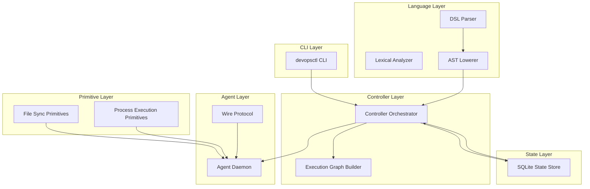
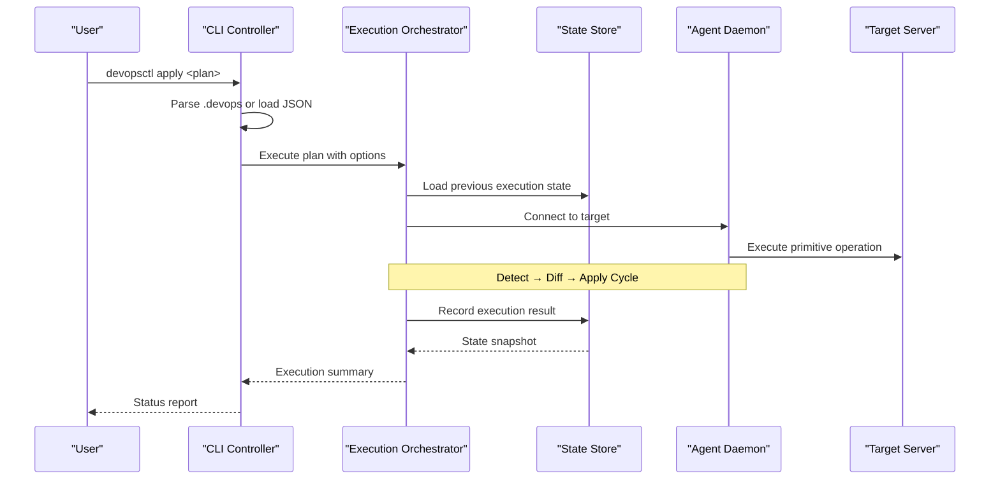
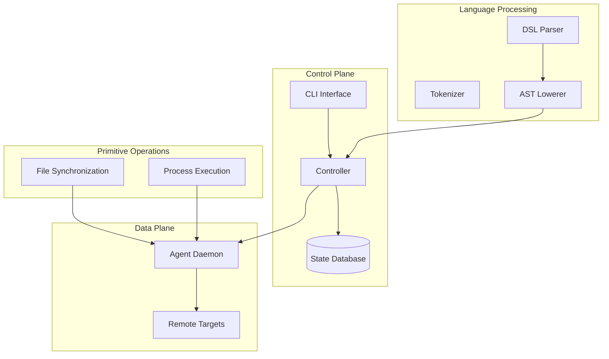
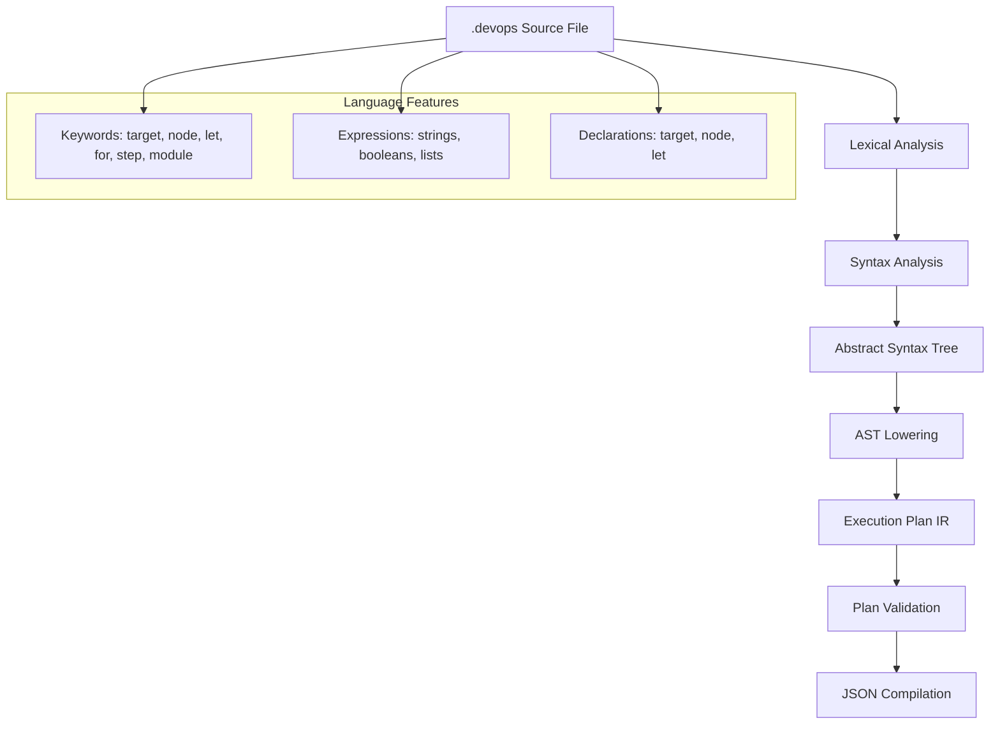
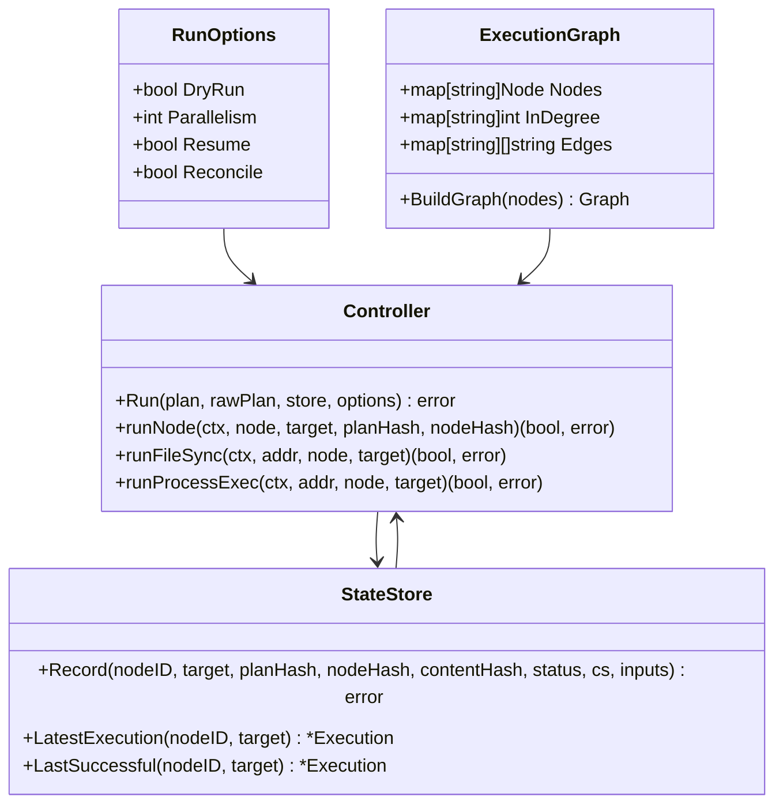
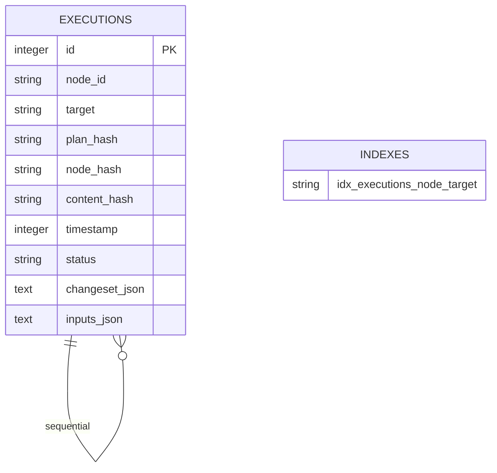
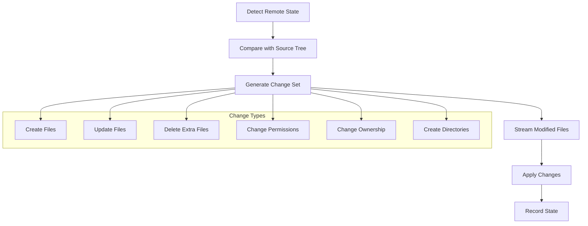
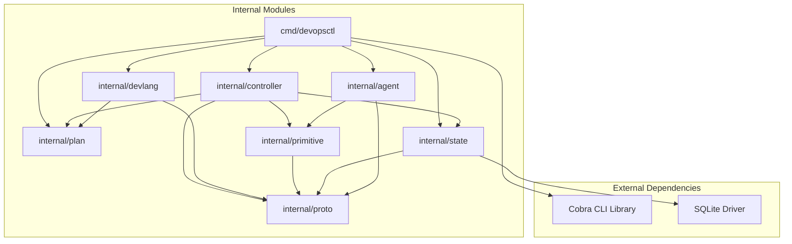

# Project Overview

<cite>
**Referenced Files in This Document**
- [README.md](file://README.md)
- [DESIGN.md](file://DESIGN.md)
- [main.go](file://cmd/devopsctl/main.go)
- [orchestrator.go](file://internal/controller/orchestrator.go)
- [parser.go](file://internal/devlang/parser.go)
- [schema.go](file://internal/plan/schema.go)
- [store.go](file://internal/state/store.go)
- [processexec.go](file://internal/primitive/processexec/processexec.go)
- [messages.go](file://internal/proto/messages.go)
- [server.go](file://internal/agent/server.go)
- [lexer.go](file://internal/devlang/lexer.go)
- [lower.go](file://internal/devlang/lower.go)
- [plan.devops](file://plan.devops)
- [plan.json](file://plan.json)
- [go.mod](file://go.mod)
</cite>

## Update Summary
**Changes Made**
- Enhanced introduction with comprehensive README integration providing extensive user guidance
- Updated installation and quick start sections with detailed setup instructions
- Expanded CLI command documentation with comprehensive examples and flags
- Added language version support documentation with feature matrix
- Integrated practical examples demonstrating common use cases
- Enhanced architecture section with README's architectural explanations
- Updated development and testing information with comprehensive coverage

## Table of Contents
1. [Introduction](#introduction)
2. [Core Concepts](#core-concepts)
3. [Installation](#installation)
4. [Quick Start](#quick-start)
5. [Usage](#usage)
6. [Language Versions](#language-versions)
7. [Examples](#examples)
8. [Architecture](#architecture)
9. [Development](#development)
10. [Project Structure](#project-structure)
11. [Core Components](#core-components)
12. [Architecture Overview](#architecture-overview)
13. [Detailed Component Analysis](#detailed-component-analysis)
14. [Dependency Analysis](#dependency-analysis)
15. [Performance Considerations](#performance-considerations)
16. [Troubleshooting Guide](#troubleshooting-guide)
17. [Conclusion](#conclusion)

## Introduction

DevOpsCtl is a programming-first DevOps automation tool with deterministic execution and state management. It represents a paradigm shift in infrastructure automation by combining the flexibility of programming languages with the reliability of DevOps practices. The tool compiles high-level `.devops` plans into flat, deterministic primitives for distributed execution, providing idempotent operations, dependency resolution, parallel execution, and comprehensive state tracking.

**Key Philosophy**: DevOpsCtl treats infrastructure as code by enabling developers to write automation logic in a familiar programming paradigm rather than relying on declarative YAML or JSON configurations. The system follows the principle that "all language features compile to flat, deterministic primitives" - ensuring that the runtime never learns new concepts and complexity grows upward (language) rather than downward (runtime).

**Core Capabilities**:
- Declarative Language: Write infrastructure plans in the `.devops` language
- Deterministic Compilation: All high-level constructs compile to flat primitives
- Dependency Resolution: Automatic dependency graph construction and execution
- Parallel Execution: Concurrent node execution with configurable parallelism
- State Management: Built-in state tracking for idempotent operations
- Reconciliation: Detect and correct infrastructure drift automatically
- Resume Capability: Resume failed executions from the last successful state
- Dry-Run Mode: Preview changes before applying them
- Rollback Support: Reverse previous executions safely
- Distributed Execution: Agent-based architecture for remote target management

**Relationship to Traditional DevOps Tools**: DevOpsCtl complements rather than replaces existing DevOps ecosystems. While Terraform/AWS CloudFormation provide programmatic control over infrastructure provisioning, Ansible/Puppet offer flexible automation beyond static playbooks, and Kubernetes enables container orchestration with custom logic, DevOpsCtl adds programming capabilities to deployment workflows through its custom DSL and distributed execution model.

**Section sources**
- [README.md](file://README.md#L1-L528)
- [DESIGN.md](file://DESIGN.md#L1-L334)

## Core Concepts

DevOpsCtl introduces several fundamental concepts that form the foundation of its programming-first approach:

- **Target**: A remote machine or environment where operations execute (identified by address)
- **Node**: A unit of work with a specific primitive type (e.g., `file.sync`, `process.exec`)
- **Primitive**: Built-in operation types (file synchronization, process execution)
- **Plan**: A collection of targets and nodes that define the desired state
- **State Store**: Local SQLite database tracking execution history
- **Agent**: Daemon running on target machines to execute primitives

These concepts work together to create a cohesive system where infrastructure automation becomes as straightforward as writing application code, with clear abstractions for managing distributed operations.

**Section sources**
- [README.md](file://README.md#L34-L42)

## Installation

### Prerequisites

DevOpsCtl requires the following prerequisites:
- Go 1.18 or higher
- Linux, macOS, or Windows operating systems

### Build from Source

The project can be built from source using the standard Go build process:

```bash
# Clone the repository
git clone https://github.com/yourusername/devopsctl.git
cd devopsctl

# Build the binary
go build -o devopsctl ./cmd/devopsctl

# (Optional) Move to PATH
sudo mv devopsctl /usr/local/bin/
```

### Verify Installation

After installation, verify that DevOpsCtl is working correctly:

```bash
devopsctl --version
```

This should display the current version of DevOpsCtl (currently 0.6.0-dev).

**Section sources**
- [README.md](file://README.md#L43-L68)
- [go.mod](file://go.mod#L1-L14)

## Quick Start

### 1. Start the Agent

First, start the DevOpsCtl agent on the target machine (or localhost for testing):

```bash
devopsctl agent --addr 127.0.0.1:7700
```

The agent runs in the foreground. Keep this terminal open or run it as a background service. The agent serves as the execution endpoint on target machines, handling primitive operations and maintaining state locally.

### 2. Create Your First Plan

Create a file named `plan.devops` with the following content:

```hcl
target "local" {
  address = "127.0.0.1:7700"
}

node "hello" {
  type    = process.exec
  targets = [local]
  
  cmd = ["echo", "Hello from devopsctl!"]
  cwd = "/tmp"
}
```

This simple plan defines a target (localhost) and a node that executes a shell command. The plan demonstrates the basic structure of DevOpsCtl's `.devops` language.

### 3. Apply the Plan

Execute the plan against the configured target:

```bash
# Compile and apply the plan
devopsctl apply plan.devops

# Or preview changes first
devopsctl apply --dry-run plan.devops
```

The `apply` command automatically compiles `.devops` source files to JSON plans and executes them against the specified targets.

### 4. Check State

View the execution history and state:

```bash
# View execution history
devopsctl state list
```

This command displays all execution records from the state store, showing the results of previous operations.

**Section sources**
- [README.md](file://README.md#L70-L116)

## Usage

### Writing Plans

Plans are written in the `.devops` language, which provides a structured approach to defining infrastructure automation. The language supports various constructs for building complex automation scenarios.

#### Targets

Define where operations will execute:

```hcl
target "production" {
  address = "192.168.1.100:7700"
}

target "staging" {
  address = "192.168.1.101:7700"
}
```

Targets represent remote machines or environments where operations will execute. Each target has a unique identifier and an address specifying how to connect to it.

#### Nodes

Define operations to perform:

```hcl
# File synchronization
node "deploy-app" {
  type    = file.sync
  targets = [production]
  
  src  = "./build"
  dest = "/var/www/myapp"
}

# Process execution
node "restart-service" {
  type       = process.exec
  targets    = [production]
  depends_on = ["deploy-app"]
  
  cmd = ["systemctl", "restart", "myapp"]
  cwd = "/var/www/myapp"
}
```

Nodes represent individual units of work within execution plans. They specify the primitive type to execute, the targets where execution occurs, and the inputs required for the operation.

#### Variables (Let Bindings)

Use variables for reusable values:

```hcl
let app_name = "myapp"
let base_dir = "/var/www"
let full_path = base_dir + "/" + app_name

node "deploy" {
  type    = file.sync
  targets = [local]
  src     = "./build"
  dest    = full_path
}
```

Variables (also called let bindings) provide a way to define reusable values that can be referenced throughout the plan.

#### Expressions (v0.3+)

Use expressions for dynamic values:

```hcl
let is_prod = true
let log_level = is_prod ? "error" : "debug"
let backup_enabled = is_prod && true
let deploy_path = is_prod ? "/var/www/prod" : "/var/www/dev"

node "configure" {
  type    = process.exec
  targets = [local]
  cmd     = ["echo", log_level]
}
```

Expressions enable dynamic behavior in plans, supporting boolean logic, string concatenation, and ternary operations.

**Section sources**
- [README.md](file://README.md#L117-L194)

## Language Versions

DevOpsCtl supports multiple language versions with incremental features, allowing users to choose the appropriate level of functionality for their needs:

| Version | Features | Status |
|---------|----------|--------|
| v0.1 | Targets, Nodes, Primitives | ✅ Stable |
| v0.2 | Let bindings (variables) | ✅ Stable |
| v0.3 | Expressions (ternary, operators, concat) | ✅ Stable |
| v0.4 | Reusable steps (macros) | ✅ Stable |
| v0.5 | Nested steps, For-loops | 🔧 In Development |
| v0.6 | Step parameters | 🔧 In Development |
| v0.7 | Step libraries (imports) | 🔧 Planned |

**Default version**: v0.3

Specify version with `--lang` flag:
```bash
devopsctl apply --lang v0.4 plan.devops
```

Each version maintains strict validation and deterministic behavior, ensuring that language features compile away completely to primitives without runtime understanding of high-level constructs.

**Section sources**
- [README.md](file://README.md#L315-L334)
- [DESIGN.md](file://DESIGN.md#L308-L318)

## Examples

### Basic File Synchronization

A simple example demonstrating file synchronization across a single target:

```hcl
target "webserver" {
  address = "192.168.1.100:7700"
}

node "sync-website" {
  type    = file.sync
  targets = [webserver]
  
  src  = "./dist"
  dest = "/var/www/html"
}
```

This example shows how to deploy static website files to a remote web server using the file synchronization primitive.

### Multi-Step Deployment with Dependencies

Complex deployments involving multiple sequential operations:

```hcl
target "app-server" {
  address = "10.0.1.50:7700"
}

node "deploy-code" {
  type    = file.sync
  targets = [app-server]
  src     = "./build"
  dest    = "/opt/myapp"
}

node "install-deps" {
  type       = process.exec
  targets    = [app-server]
  depends_on = ["deploy-code"]
  cmd        = ["npm", "install", "--production"]
  cwd        = "/opt/myapp"
}

node "restart-app" {
  type       = process.exec
  targets    = [app-server]
  depends_on = ["install-deps"]
  cmd        = ["systemctl", "restart", "myapp"]
}
```

This example demonstrates a complete deployment pipeline with proper dependency management and sequential execution.

### Environment-Specific Configuration

Dynamic configuration based on environment variables:

```hcl
target "prod" {
  address = "prod.example.com:7700"
}

target "dev" {
  address = "dev.example.com:7700"
}

let is_production = true
let app_dir = is_production ? "/var/www/prod" : "/var/www/dev"
let config_file = is_production ? "config.prod.json" : "config.dev.json"

node "deploy" {
  type    = file.sync
  targets = is_production ? [prod] : [dev]
  src     = "./dist"
  dest    = app_dir
}

node "configure" {
  type       = process.exec
  targets    = is_production ? [prod] : [dev]
  depends_on = ["deploy"]
  cmd        = ["cp", config_file, "config.json"]
  cwd        = app_dir
}
```

This example shows how to use expressions to create environment-specific deployments.

### Parallel Multi-Target Deployment

Deploying to multiple targets simultaneously:

```hcl
target "web1" {
  address = "web1.example.com:7700"
}

target "web2" {
  address = "web2.example.com:7700"
}

target "web3" {
  address = "web3.example.com:7700"
}

node "deploy-all" {
  type    = file.sync
  targets = [web1, web2, web3]
  src     = "./dist"
  dest    = "/var/www/html"
}
```

This example demonstrates how to deploy the same content to multiple servers in parallel.

**Section sources**
- [README.md](file://README.md#L336-L436)

## Architecture

DevOpsCtl follows a compile-to-primitives architecture that ensures deterministic execution and state management:

```
.devops Source → Parser → AST → Validator → Lowering → Flat Plan (JSON)
                                                            ↓
                                                      Orchestrator
                                                            ↓
                                                  Dependency Graph Builder
                                                            ↓
                                                      Parallel Executor
                                                            ↓
                                                  Agent Communication
                                                            ↓
                                                Primitives (file.sync, process.exec)
```

### Key Principles

1. **All language features compile to flat primitives** - No high-level constructs survive compilation
2. **Hashes are computed after full expansion** - Ensures deterministic builds
3. **Deterministic order everywhere** - Reproducible across environments
4. **Validation is version-strict** - Explicit feature gates per version

### Components

- **Compiler** (`internal/devlang/`): Lexer, parser, AST, validator, lowering
- **Plan Schema** (`internal/plan/`): JSON plan structure and validation
- **Controller** (`internal/controller/`): Orchestrator, graph builder, execution engine
- **Primitives** (`internal/primitive/`): File sync, process execution
- **State Store** (`internal/state/`): SQLite-based execution tracking
- **Agent** (`internal/agent/`): Remote execution daemon and protocol
- **CLI** (`cmd/devopsctl/`): Command-line interface

**Section sources**
- [README.md](file://README.md#L438-L472)
- [DESIGN.md](file://DESIGN.md#L1-L81)

## Development

### Running Tests

The project includes comprehensive testing infrastructure:

```bash
# Unit tests
go test ./...

# Language version tests
./test_v0_3.sh
./test_v0_4.sh
./test_v0_5.sh
./test_v0_6.sh

# Hash stability tests
./test_hash_stability.sh

# End-to-end tests
./test_e2e.sh
```

### Project Structure

```
devopsctl/
├── cmd/devopsctl/          # CLI entry point
├── internal/
│   ├── agent/              # Agent server and handler
│   ├── controller/         # Orchestrator and execution engine
│   ├── devlang/            # Language compiler (lexer, parser, AST)
│   ├── plan/               # Plan schema and validation
│   ├── primitive/          # Built-in primitives
│   ├── proto/              # Protocol messages
│   └── state/              # State store implementation
├── tests/                  # Language version tests
│   ├── v0_3/
│   ├── v0_4/
│   ├── v0_5/
│   └── v0_6/
├── DESIGN.md               # Architecture principles
├── LANGUAGE_VERSIONS.md    # Version feature matrix
└── README.md               # This file
```

### Contributing

Contributions are welcome! Please follow the design principles documented in [DESIGN.md](DESIGN.md). The project maintains strict architectural invariants that ensure long-term stability and deterministic behavior.

**Section sources**
- [README.md](file://README.md#L473-L527)

## Project Structure

The project follows a layered architecture with clear separation of concerns:



**Diagram sources**
- [main.go](file://cmd/devopsctl/main.go#L21-L273)
- [orchestrator.go](file://internal/controller/orchestrator.go#L34-L300)
- [parser.go](file://internal/devlang/parser.go#L27-L78)
- [schema.go](file://internal/plan/schema.go#L11-L33)

**Section sources**
- [main.go](file://cmd/devopsctl/main.go#L1-L273)
- [go.mod](file://go.mod#L1-L14)

## Core Components

### CLI Command Interface

DevOpsCtl provides a comprehensive command-line interface with six primary commands:

#### Main Commands
- **apply**: Executes an execution plan against target servers
- **reconcile**: Brings reality in sync with the planned state using recorded state as truth
- **agent**: Starts the DevOpsCtl agent daemon on a target machine
- **state**: Inspects the local state store for execution history
- **plan**: Manages execution plans (hash computation and compilation)
- **rollback**: Rolls back the last execution

#### Command Options
Each command supports specific flags for fine-tuned execution control:
- **apply/reconcile**: `--dry-run`, `--parallelism`, `--resume`
- **agent**: `--addr` for TCP address binding
- **state**: `--node` filtering
- **plan**: `--output` for compiled plan storage

### Execution Engine Architecture

The execution engine operates through a sophisticated multi-stage pipeline:



**Diagram sources**
- [main.go](file://cmd/devopsctl/main.go#L32-L87)
- [orchestrator.go](file://internal/controller/orchestrator.go#L34-L300)
- [store.go](file://internal/state/store.go#L68-L84)

**Section sources**
- [main.go](file://cmd/devopsctl/main.go#L21-L273)

## Architecture Overview

DevOpsCtl implements a distributed architecture with clear separation between control plane and data plane:



**Diagram sources**
- [orchestrator.go](file://internal/controller/orchestrator.go#L1-L653)
- [server.go](file://internal/agent/server.go#L15-L51)
- [messages.go](file://internal/proto/messages.go#L1-L117)

### Design Principles

The architecture adheres to several key principles:

1. **Layered Abstraction**: Clear separation between CLI, controller, primitives, and state management
2. **Idempotent Operations**: All operations can be safely retried without side effects
3. **State-Driven Execution**: Execution decisions are based on recorded state rather than assumptions
4. **Distributed Control**: Centralized planning with distributed execution
5. **Extensible Primitives**: Modular primitive system allowing custom operations

**Section sources**
- [orchestrator.go](file://internal/controller/orchestrator.go#L1-L653)

## Detailed Component Analysis

### Language Processing Pipeline

DevOpsCtl implements a complete compiler pipeline for its custom DSL:



**Diagram sources**
- [lexer.go](file://internal/devlang/lexer.go#L42-L100)
- [parser.go](file://internal/devlang/parser.go#L27-L78)
- [lower.go](file://internal/devlang/lower.go#L9-L65)

#### Lexer Implementation
The lexer provides comprehensive tokenization for the DevOps language, supporting:
- **Special tokens**: EOF, ILLEGAL
- **Identifiers & literals**: IDENT, STRING, BOOL
- **Keywords**: Comprehensive keyword set for DSL construction
- **Operators & punctuation**: Full operator support for expressions

#### Parser Implementation
The recursive descent parser handles complex language constructs:
- **Target declarations**: Define remote server connections
- **Node declarations**: Specify execution units with inputs and dependencies
- **Expression parsing**: Support for strings, booleans, and lists
- **Error recovery**: Graceful handling of syntax errors

#### AST Lowering
The lowering phase transforms AST into executable plan representation:
- **Type conversion**: String literals to primitive types
- **Identifier resolution**: Target and node references
- **Validation**: Structural validation of plan elements

**Section sources**
- [lexer.go](file://internal/devlang/lexer.go#L1-L200)
- [parser.go](file://internal/devlang/parser.go#L1-L495)
- [lower.go](file://internal/devlang/lower.go#L1-L91)

### Controller Orchestration

The controller implements sophisticated execution orchestration:



**Diagram sources**
- [orchestrator.go](file://internal/controller/orchestrator.go#L26-L32)
- [orchestrator.go](file://internal/controller/orchestrator.go#L46-L300)
- [store.go](file://internal/state/store.go#L33-L66)

#### Execution Flow Management
The controller manages complex execution flows with:
- **Topological sorting**: Deterministic execution order based on dependencies
- **Parallel execution**: Configurable concurrency with target-level semaphores
- **Failure handling**: Comprehensive error propagation and rollback mechanisms
- **State persistence**: Append-only state recording for auditability

#### Primitive Execution Strategies
Different primitive types follow distinct execution patterns:
- **File synchronization**: Detect → Diff → Apply cycle with streaming file transfer
- **Process execution**: Local command execution with timeout and output capture

**Section sources**
- [orchestrator.go](file://internal/controller/orchestrator.go#L1-L653)

### State Management System

DevOpsCtl implements a robust state management system:



**Diagram sources**
- [store.go](file://internal/state/store.go#L17-L31)

#### State Persistence Model
The state system provides:
- **Append-only design**: Immutable execution history for auditability
- **Schema evolution**: Backward compatible schema modifications
- **Index optimization**: Efficient query performance on execution queries
- **JSON serialization**: Flexible storage of complex data structures

#### Execution Tracking
State records capture comprehensive execution metadata:
- **Plan identification**: SHA-256 hash for plan uniqueness
- **Node identification**: Per-target node execution tracking
- **Change detection**: Content hash for idempotent operations
- **Result recording**: Structured outcome reporting

**Section sources**
- [store.go](file://internal/state/store.go#L1-L226)

### Primitive Operations

DevOpsCtl provides specialized primitives for common infrastructure tasks:

#### File Synchronization Primitive
The file sync primitive implements a sophisticated three-stage process:



**Diagram sources**
- [orchestrator.go](file://internal/controller/orchestrator.go#L313-L442)

#### Process Execution Primitive
The process execution primitive provides:
- **Command execution**: Local process execution with configurable working directory
- **Timeout support**: Configurable execution timeouts
- **Output capture**: Complete stdout/stderr capture
- **Exit code reporting**: Structured exit code and error classification

**Section sources**
- [processexec.go](file://internal/primitive/processexec/processexec.go#L1-L83)

## Dependency Analysis

The project maintains clean dependency relationships:



**Diagram sources**
- [go.mod](file://go.mod#L5-L8)
- [main.go](file://cmd/devopsctl/main.go#L4-L18)

### Module Coupling Analysis

The architecture demonstrates excellent modularity:
- **Low coupling**: Modules interact primarily through well-defined interfaces
- **High cohesion**: Each module focuses on a specific responsibility
- **Interface stability**: Clear boundaries prevent cascading changes
- **Testability**: Well-separated modules enable comprehensive testing

**Section sources**
- [go.mod](file://go.mod#L1-L14)

## Performance Considerations

### Execution Optimization

The controller implements several performance optimizations:
- **Parallel execution**: Configurable concurrency with target-level semaphores
- **Efficient state queries**: Optimized database queries for execution history
- **Streaming transfers**: Chunked file streaming prevents memory exhaustion
- **Connection reuse**: TCP connection pooling reduces overhead

### Memory Management

The system employs careful memory management strategies:
- **Streaming file processing**: Large file transfers use streaming rather than buffering
- **Garbage collection friendly**: Minimal allocations during hot paths
- **Resource cleanup**: Proper resource cleanup in error conditions

## Troubleshooting Guide

### Common Issues and Solutions

#### Connection Problems
- **Symptom**: Agents fail to connect to controller
- **Solution**: Verify network connectivity and port availability
- **Debugging**: Check agent logs and network firewall rules

#### State Corruption
- **Symptom**: Execution inconsistencies or repeated failures
- **Solution**: Reset state database or use reconciliation mode
- **Prevention**: Regular state backups and monitoring

#### Timeout Issues
- **Symptom**: Long-running operations failing
- **Solution**: Increase timeout values or optimize primitive operations
- **Monitoring**: Track execution duration and resource usage

### Debugging Tools

The CLI provides comprehensive debugging capabilities:
- **Verbose logging**: Detailed execution traces
- **State inspection**: Historical execution analysis
- **Dry-run mode**: Safe preview of planned changes
- **Resume capability**: Fault-tolerant execution recovery

**Section sources**
- [main.go](file://cmd/devopsctl/main.go#L85-L87)
- [main.go](file://cmd/devopsctl/main.go#L145-L146)

## Conclusion

DevOpsCtl represents a paradigm shift in infrastructure automation by combining the flexibility of programming languages with the reliability of DevOps practices. Its layered architecture, comprehensive state management, and extensible primitive system provide a solid foundation for modern infrastructure automation needs.

The project successfully bridges the gap between traditional DevOps tooling and modern programming practices, offering developers familiar abstractions while maintaining the operational reliability expected in production environments. Through its programming-first approach, DevOpsCtl enables teams to express complex infrastructure logic naturally, reducing cognitive complexity and improving maintainability.

The integration of comprehensive README documentation transforms DevOpsCtl from a code-only project to a well-documented tool, providing extensive user guidance, installation instructions, quick start examples, and architectural explanations that complement the existing technical documentation. This documentation enhancement ensures that both beginners and experienced developers can effectively utilize and contribute to the project.

Future development directions include expanding the primitive library, enhancing the DSL with advanced programming constructs, and integrating with popular DevOps ecosystems while preserving the core programming-first philosophy established by the project's design principles.

**Section sources**
- [README.md](file://README.md#L521-L528)
- [DESIGN.md](file://DESIGN.md#L250-L278)