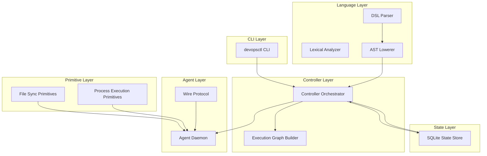
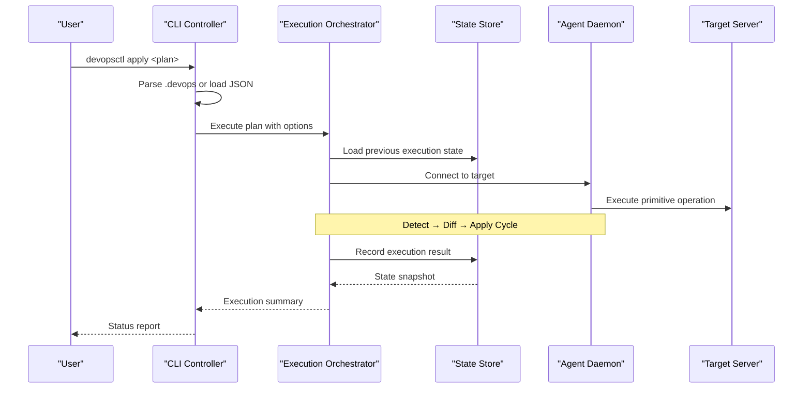
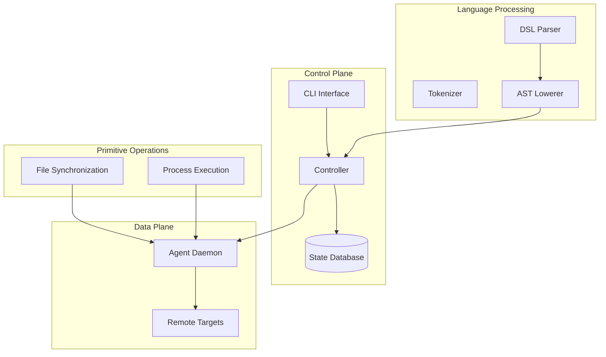
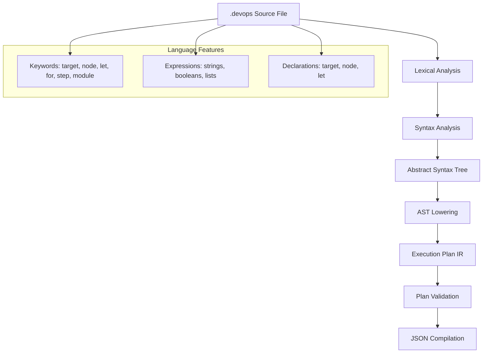
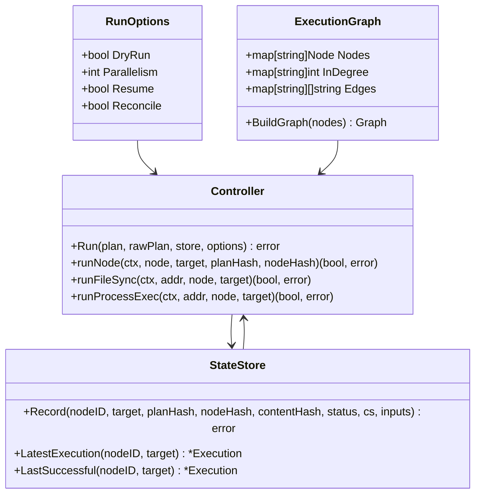
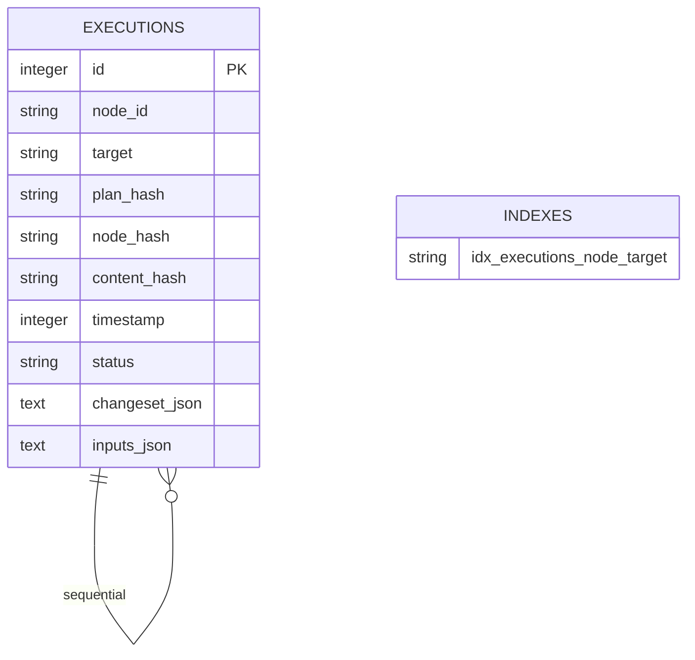
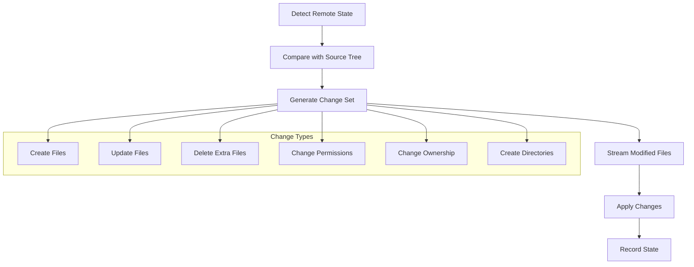
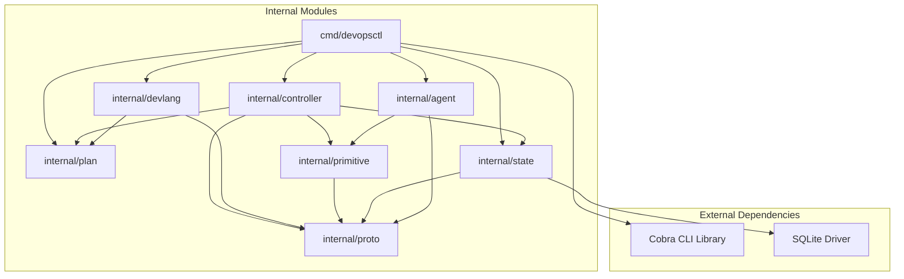

# Project Overview

<cite>
**Referenced Files in This Document**
- [main.go](file://cmd/devopsctl/main.go)
- [orchestrator.go](file://internal/controller/orchestrator.go)
- [parser.go](file://internal/devlang/parser.go)
- [schema.go](file://internal/plan/schema.go)
- [store.go](file://internal/state/store.go)
- [processexec.go](file://internal/primitive/processexec/processexec.go)
- [messages.go](file://internal/proto/messages.go)
- [server.go](file://internal/agent/server.go)
- [lexer.go](file://internal/devlang/lexer.go)
- [lower.go](file://internal/devlang/lower.go)
- [plan.devops](file://plan.devops)
- [plan.json](file://plan.json)
- [go.mod](file://go.mod)
</cite>

## Table of Contents
1. [Introduction](#introduction)
2. [Project Structure](#project-structure)
3. [Core Components](#core-components)
4. [Architecture Overview](#architecture-overview)
5. [Detailed Component Analysis](#detailed-component-analysis)
6. [Dependency Analysis](#dependency-analysis)
7. [Performance Considerations](#performance-considerations)
8. [Troubleshooting Guide](#troubleshooting-guide)
9. [Conclusion](#conclusion)

## Introduction

DevOpsCtl is a programming-first DevOps execution engine designed to transform infrastructure automation through a custom Domain-Specific Language (.devops files). Unlike traditional DevOps tools that rely on declarative YAML or JSON configurations, DevOpsCtl treats infrastructure as code by enabling developers to write automation logic in a familiar programming paradigm.

### Core Philosophy

The project embodies the philosophy that infrastructure should be treated as code, where:
- **Execution Plans** define automated workflows as structured programs
- **Targets** represent remote servers or environments as first-class programming constructs
- **Primitives** provide composable building blocks for infrastructure operations
- **Nodes** represent individual units of work within execution plans

### Relationship to Traditional DevOps Tools

DevOpsCtl complements rather than replaces existing DevOps ecosystems:
- **Terraform/AWS CloudFormation**: Provides programmatic control over infrastructure provisioning
- **Ansible/Puppet**: Offers flexible automation beyond static playbooks
- **Kubernetes**: Enables container orchestration with custom logic
- **CI/CD Pipelines**: Adds programming capabilities to deployment workflows

Traditional tools often require separate configuration files and complex templating systems. DevOpsCtl consolidates these concerns into a unified programming model where infrastructure automation becomes as straightforward as writing application code.

## Project Structure

The project follows a layered architecture with clear separation of concerns:

**Diagram sources**
- [main.go](file://cmd/devopsctl/main.go#L21-L273)
- [orchestrator.go](file://internal/controller/orchestrator.go#L34-L300)
- [parser.go](file://internal/devlang/parser.go#L27-L78)
- [schema.go](file://internal/plan/schema.go#L11-L33)

**Section sources**
- [main.go](file://cmd/devopsctl/main.go#L1-L273)
- [go.mod](file://go.mod#L1-L14)

## Core Components

### CLI Command Interface

DevOpsCtl provides a comprehensive command-line interface with six primary commands:

#### Main Commands
- **apply**: Executes an execution plan against target servers
- **reconcile**: Brings reality in sync with the planned state using recorded state as truth
- **agent**: Starts the DevOpsCtl agent daemon on a target machine
- **state**: Inspects the local state store for execution history
- **plan**: Manages execution plans (hash computation and compilation)
- **rollback**: Rolls back the last execution

#### Command Options
Each command supports specific flags for fine-tuned execution control:
- **apply/reconcile**: `--dry-run`, `--parallelism`, `--resume`
- **agent**: `--addr` for TCP address binding
- **state**: `--node` filtering
- **plan**: `--output` for compiled plan storage

### Execution Engine Architecture

The execution engine operates through a sophisticated multi-stage pipeline:

**Diagram sources**
- [main.go](file://cmd/devopsctl/main.go#L32-L87)
- [orchestrator.go](file://internal/controller/orchestrator.go#L34-L300)
- [store.go](file://internal/state/store.go#L68-L84)

**Section sources**
- [main.go](file://cmd/devopsctl/main.go#L21-L273)

## Architecture Overview

DevOpsCtl implements a distributed architecture with clear separation between control plane and data plane:

**Diagram sources**
- [orchestrator.go](file://internal/controller/orchestrator.go#L1-L653)
- [server.go](file://internal/agent/server.go#L15-L51)
- [messages.go](file://internal/proto/messages.go#L1-L117)

### Design Principles

The architecture adheres to several key principles:

1. **Layered Abstraction**: Clear separation between CLI, controller, primitives, and state management
2. **Idempotent Operations**: All operations can be safely retried without side effects
3. **State-Driven Execution**: Execution decisions are based on recorded state rather than assumptions
4. **Distributed Control**: Centralized planning with distributed execution
5. **Extensible Primitives**: Modular primitive system allowing custom operations

## Detailed Component Analysis

### Language Processing Pipeline

DevOpsCtl implements a complete compiler pipeline for its custom DSL:

**Diagram sources**
- [lexer.go](file://internal/devlang/lexer.go#L42-L100)
- [parser.go](file://internal/devlang/parser.go#L27-L78)
- [lower.go](file://internal/devlang/lower.go#L9-L65)

#### Lexer Implementation
The lexer provides comprehensive tokenization for the DevOps language, supporting:
- **Special tokens**: EOF, ILLEGAL
- **Identifiers & literals**: IDENT, STRING, BOOL
- **Keywords**: Comprehensive keyword set for DSL construction
- **Operators & punctuation**: Full operator support for expressions

#### Parser Implementation
The recursive descent parser handles complex language constructs:
- **Target declarations**: Define remote server connections
- **Node declarations**: Specify execution units with inputs and dependencies
- **Expression parsing**: Support for strings, booleans, and lists
- **Error recovery**: Graceful handling of syntax errors

#### AST Lowering
The lowering phase transforms AST into executable plan representation:
- **Type conversion**: String literals to primitive types
- **Identifier resolution**: Target and node references
- **Validation**: Structural validation of plan elements

**Section sources**
- [lexer.go](file://internal/devlang/lexer.go#L1-L200)
- [parser.go](file://internal/devlang/parser.go#L1-L495)
- [lower.go](file://internal/devlang/lower.go#L1-L91)

### Controller Orchestration

The controller implements sophisticated execution orchestration:

**Diagram sources**
- [orchestrator.go](file://internal/controller/orchestrator.go#L26-L32)
- [orchestrator.go](file://internal/controller/orchestrator.go#L46-L300)
- [store.go](file://internal/state/store.go#L33-L66)

#### Execution Flow Management
The controller manages complex execution flows with:
- **Topological sorting**: Deterministic execution order based on dependencies
- **Parallel execution**: Configurable concurrency with target-level semaphores
- **Failure handling**: Comprehensive error propagation and rollback mechanisms
- **State persistence**: Append-only state recording for auditability

#### Primitive Execution Strategies
Different primitive types follow distinct execution patterns:
- **File synchronization**: Detect → Diff → Apply cycle with streaming file transfer
- **Process execution**: Local command execution with timeout and output capture

**Section sources**
- [orchestrator.go](file://internal/controller/orchestrator.go#L1-L653)

### State Management System

DevOpsCtl implements a robust state management system:

**Diagram sources**
- [store.go](file://internal/state/store.go#L17-L31)

#### State Persistence Model
The state system provides:
- **Append-only design**: Immutable execution history for auditability
- **Schema evolution**: Backward compatible schema modifications
- **Index optimization**: Efficient query performance on execution queries
- **JSON serialization**: Flexible storage of complex data structures

#### Execution Tracking
State records capture comprehensive execution metadata:
- **Plan identification**: SHA-256 hash for plan uniqueness
- **Node identification**: Per-target node execution tracking
- **Change detection**: Content hash for idempotent operations
- **Result recording**: Structured outcome reporting

**Section sources**
- [store.go](file://internal/state/store.go#L1-L226)

### Primitive Operations

DevOpsCtl provides specialized primitives for common infrastructure tasks:

#### File Synchronization Primitive
The file sync primitive implements a sophisticated three-stage process:

**Diagram sources**
- [orchestrator.go](file://internal/controller/orchestrator.go#L313-L442)

#### Process Execution Primitive
The process execution primitive provides:
- **Command execution**: Local process execution with configurable working directory
- **Timeout support**: Configurable execution timeouts
- **Output capture**: Complete stdout/stderr capture
- **Exit code reporting**: Structured exit code and error classification

**Section sources**
- [processexec.go](file://internal/primitive/processexec/processexec.go#L1-L83)

## Dependency Analysis

The project maintains clean dependency relationships:

**Diagram sources**
- [go.mod](file://go.mod#L5-L8)
- [main.go](file://cmd/devopsctl/main.go#L4-L18)

### Module Coupling Analysis

The architecture demonstrates excellent modularity:
- **Low coupling**: Modules interact primarily through well-defined interfaces
- **High cohesion**: Each module focuses on a specific responsibility
- **Interface stability**: Clear boundaries prevent cascading changes
- **Testability**: Well-separated modules enable comprehensive testing

**Section sources**
- [go.mod](file://go.mod#L1-L14)

## Performance Considerations

### Execution Optimization

The controller implements several performance optimizations:
- **Parallel execution**: Configurable concurrency with target-level semaphores
- **Efficient state queries**: Optimized database queries for execution history
- **Streaming transfers**: Chunked file streaming prevents memory exhaustion
- **Connection reuse**: TCP connection pooling reduces overhead

### Memory Management

The system employs careful memory management strategies:
- **Streaming file processing**: Large file transfers use streaming rather than buffering
- **Garbage collection friendly**: Minimal allocations during hot paths
- **Resource cleanup**: Proper resource cleanup in error conditions

## Troubleshooting Guide

### Common Issues and Solutions

#### Connection Problems
- **Symptom**: Agents fail to connect to controller
- **Solution**: Verify network connectivity and port availability
- **Debugging**: Check agent logs and network firewall rules

#### State Corruption
- **Symptom**: Execution inconsistencies or repeated failures
- **Solution**: Reset state database or use reconciliation mode
- **Prevention**: Regular state backups and monitoring

#### Timeout Issues
- **Symptom**: Long-running operations failing
- **Solution**: Increase timeout values or optimize primitive operations
- **Monitoring**: Track execution duration and resource usage

### Debugging Tools

The CLI provides comprehensive debugging capabilities:
- **Verbose logging**: Detailed execution traces
- **State inspection**: Historical execution analysis
- **Dry-run mode**: Safe preview of planned changes
- **Resume capability**: Fault-tolerant execution recovery

**Section sources**
- [main.go](file://cmd/devopsctl/main.go#L85-L87)
- [main.go](file://cmd/devopsctl/main.go#L145-L146)

## Conclusion

DevOpsCtl represents a paradigm shift in infrastructure automation by combining the flexibility of programming languages with the reliability of DevOps practices. Its layered architecture, comprehensive state management, and extensible primitive system provide a solid foundation for modern infrastructure automation needs.

The project successfully bridges the gap between traditional DevOps tooling and modern programming practices, offering developers familiar abstractions while maintaining the operational reliability expected in production environments. Through its programming-first approach, DevOpsCtl enables teams to express complex infrastructure logic naturally, reducing cognitive complexity and improving maintainability.

Future development directions include expanding the primitive library, enhancing the DSL with advanced programming constructs, and integrating with popular DevOps ecosystems while preserving the core programming-first philosophy.