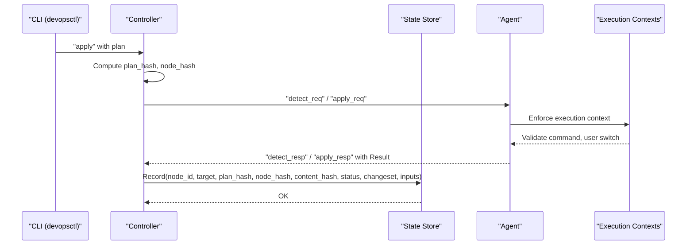
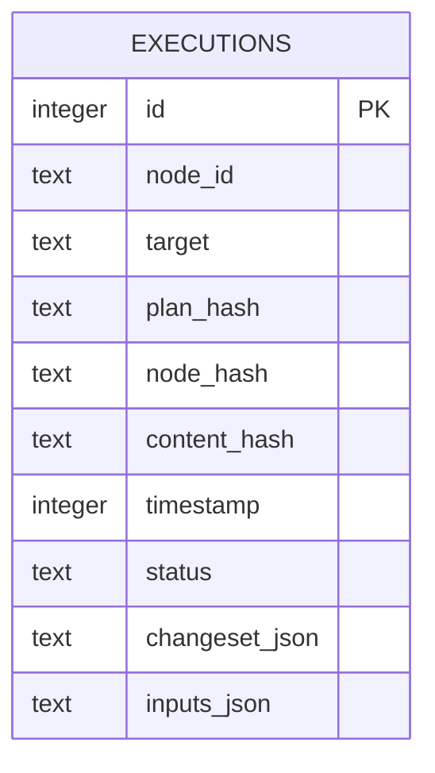
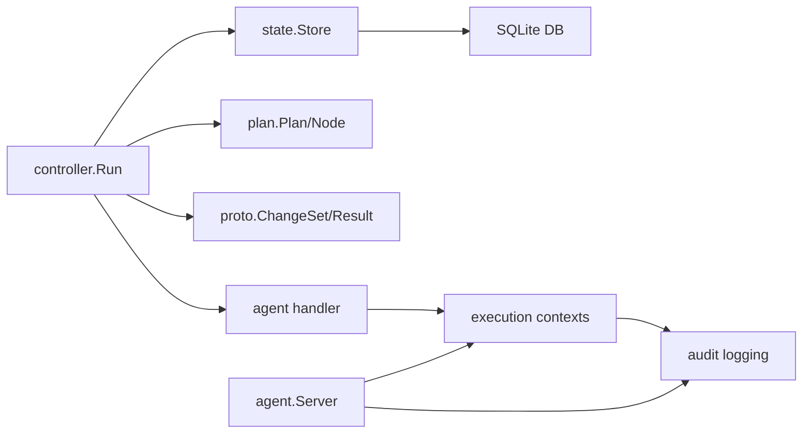

# State Management

<cite>
**Referenced Files in This Document**
- [store.go](file://internal/state/store.go)
- [orchestrator.go](file://internal/controller/orchestrator.go)
- [messages.go](file://internal/proto/messages.go)
- [main.go](file://cmd/devopsctl/main.go)
- [schema.go](file://internal/plan/schema.go)
- [rollback.go](file://internal/primitive/filesync/rollback.go)
- [handler.go](file://internal/agent/handler.go)
- [display.go](file://internal/controller/display.go)
- [resume_test.sh](file://tests/e2e/resume_test.sh)
- [audit.go](file://internal/agent/context/audit.go)
- [executor.go](file://internal/agent/context/executor.go)
- [types.go](file://internal/agent/context/types.go)
- [loader.go](file://internal/agent/context/loader.go)
- [server.go](file://internal/agent/server.go)
- [minimal.yaml](file://examples/contexts/minimal.yaml)
- [multi-tier.yaml](file://examples/contexts/multi-tier.yaml)
</cite>

## Update Summary
**Changes Made**
- Added comprehensive execution contexts audit trails with security compliance tracking
- Enhanced state management with execution context enforcement and comprehensive logging
- Integrated security compliance tracking through trust levels and audit configurations
- Added detailed execution logging with configurable audit levels (minimal, standard, full)

## Table of Contents
1. [Introduction](#introduction)
2. [Project Structure](#project-structure)
3. [Core Components](#core-components)
4. [Architecture Overview](#architecture-overview)
5. [Detailed Component Analysis](#detailed-component-analysis)
6. [Dependency Analysis](#dependency-analysis)
7. [Performance Considerations](#performance-considerations)
8. [Troubleshooting Guide](#troubleshooting-guide)
9. [Conclusion](#conclusion)
10. [Appendices](#appendices)

## Introduction
This document describes the DevOpsCtl state management system that persists execution outcomes locally using an SQLite database. The system has been enhanced with execution contexts audit trails, security compliance tracking, and comprehensive execution logging. It covers the SQLite-based state persistence architecture, execution tracking and auditing capabilities, and the state database schema. It also documents the execution record structure, data validation and business rules, data access patterns, lifecycle management, security, backup, and recovery. Practical examples of state queries and inspection commands are included.

## Project Structure
The state management system centers around a single SQLite database file located under the user's home directory, enhanced with execution context enforcement and comprehensive audit logging. The CLI integrates state operations into commands for inspecting execution history, rolling back the last run, and managing execution contexts.

```mermaid
graph TB
subgraph "CLI"
M["cmd/devopsctl/main.go<br/>Commands: apply, reconcile, state, rollback,<br/>agent with audit logging"]
end
subgraph "Controller"
C["internal/controller/orchestrator.go<br/>Run, runFileSync, runProcessExec"]
end
subgraph "State Store"
S["internal/state/store.go<br/>Open, Record, List, LastRun,<br/>LastSuccessful, LatestExecution"]
end
subgraph "Protocol"
P["internal/proto/messages.go<br/>ChangeSet, Result, ApplyReq/Rsp,<br/>RollbackReq/Rsp"]
end
subgraph "Plan"
PL["internal/plan/schema.go<br/>Plan, Node, Target, Hash"]
end
subgraph "Agent"
A["internal/agent/handler.go<br/>Rollback handler, context enforcement"]
end
subgraph "Execution Contexts"
EC["internal/agent/context/<br/>audit.go, executor.go, types.go, loader.go"]
end
subgraph "Agent Server"
AS["internal/agent/server.go<br/>LoadConfiguration, ListenAndServe"]
end
subgraph "DB"
DB["~/.devopsctl/state.db<br/>executions table + index"]
end
M --> C
C --> S
C --> P
C --> PL
C --> A
S --> DB
A --> EC
AS --> EC
AS --> DB
```

**Diagram sources**
- [main.go](file://cmd/devopsctl/main.go#L200-L218)
- [orchestrator.go](file://internal/controller/orchestrator.go#L34-L300)
- [store.go](file://internal/state/store.go#L38-L66)
- [messages.go](file://internal/proto/messages.go#L94-L116)
- [schema.go](file://internal/plan/schema.go#L11-L77)
- [handler.go](file://internal/agent/handler.go#L156-L173)
- [audit.go](file://internal/agent/context/audit.go#L1-L64)
- [executor.go](file://internal/agent/context/executor.go#L1-L307)
- [types.go](file://internal/agent/context/types.go#L1-L84)
- [loader.go](file://internal/agent/context/loader.go#L1-L122)
- [server.go](file://internal/agent/server.go#L1-L90)

**Section sources**
- [main.go](file://cmd/devopsctl/main.go#L200-L218)
- [store.go](file://internal/state/store.go#L38-L66)

## Core Components
- State Store: Manages a local SQLite database, initializes schema, records execution outcomes, and provides queries for execution history.
- Controller: Orchestrates plan execution, computes hashes, decides resumption/reconciliation, and persists state after each node-target operation.
- Protocol: Defines the ChangeSet and Result structures used to capture diffs and outcomes.
- Plan: Provides plan-level and node-level hashing to identify unique units of execution and link state to plan runs.
- Agent: Handles rollback requests, enforces execution contexts, and provides structured results with comprehensive audit logging.
- Execution Contexts: Security framework that defines trust levels, identity, privilege, filesystem, process, network, and audit configurations for controlled execution environments.

Key responsibilities:
- Append-only execution records with deterministic hashing for idempotency and resumption.
- Indexing on node_id and target to optimize per-node and per-target queries.
- Status normalization (e.g., "success" -> "applied") for consistent auditing.
- Security compliance tracking through trust levels and audit configurations.
- Comprehensive execution logging with configurable audit levels.
- Execution context enforcement for process primitives with user switching and privilege escalation.

**Section sources**
- [store.go](file://internal/state/store.go#L17-L31)
- [store.go](file://internal/state/store.go#L68-L84)
- [store.go](file://internal/state/store.go#L100-L160)
- [store.go](file://internal/state/store.go#L162-L225)
- [orchestrator.go](file://internal/controller/orchestrator.go#L34-L300)
- [messages.go](file://internal/proto/messages.go#L94-L116)
- [schema.go](file://internal/plan/schema.go#L54-L77)
- [audit.go](file://internal/agent/context/audit.go#L10-L27)
- [executor.go](file://internal/agent/context/executor.go#L13-L19)
- [types.go](file://internal/agent/context/types.go#L3-L14)

## Architecture Overview
The state management architecture is SQLite-backed and append-only, enhanced with execution context enforcement and comprehensive audit logging. The controller writes execution records after each node-target operation, capturing plan/node hashes, content hash, status, changeset, and inputs. The agent enforces execution contexts for process primitives, generating detailed audit entries for security compliance tracking. The CLI exposes commands to list executions, manage execution contexts, and roll back the last run.



**Diagram sources**
- [main.go](file://cmd/devopsctl/main.go#L200-L218)
- [orchestrator.go](file://internal/controller/orchestrator.go#L34-L300)
- [store.go](file://internal/state/store.go#L68-L84)
- [messages.go](file://internal/proto/messages.go#L16-L75)
- [handler.go](file://internal/agent/handler.go#L92-L160)
- [executor.go](file://internal/agent/context/executor.go#L29-L73)

## Detailed Component Analysis

### State Database Schema
The state database stores a single table, executions, with fields for node identity, plan linkage, content fingerprint, timing, status, and serialized artifacts.



- Primary key: id (autoincrement)
- Composite index: executions_node_target_idx on (node_id, target)
- Constraints:
  - node_id, target, plan_hash, node_hash, content_hash, timestamp, status, changeset_json are NOT NULL
  - status accepts a constrained set of values
  - Default values exist for plan_hash, node_hash, inputs_json

Status values observed in code:
- pending, skipped, applied, failed, rolled_back, blocked

**Diagram sources**
- [store.go](file://internal/state/store.go#L17-L31)

**Section sources**
- [store.go](file://internal/state/store.go#L17-L31)

### Execution Record Structure
Each execution record captures:
- Identity: node_id, target
- Plan linkage: plan_hash, node_hash
- Content fingerprint: content_hash
- Timing: timestamp
- Outcome: status
- Artifacts: changeset_json (ChangeSet), inputs_json (map of inputs)

Fields are populated during controller execution and persisted via Store.Record.

**Section sources**
- [store.go](file://internal/state/store.go#L86-L98)
- [store.go](file://internal/state/store.go#L68-L84)
- [messages.go](file://internal/proto/messages.go#L94-L101)
- [orchestrator.go](file://internal/controller/orchestrator.go#L413-L429)
- [orchestrator.go](file://internal/controller/orchestrator.go#L492-L506)

### Enhanced Execution Contexts and Security Compliance
The system now includes comprehensive execution contexts with security compliance tracking:

#### Execution Context Structure
- **ExecutionContext**: Defines the security and runtime envelope for primitive execution
- **Trust Levels**: Low (restricted), Medium (moderate), High (administrative)
- **Identity**: User, group, and supplementary group configuration
- **Privilege**: Escalation rules with sudo command restrictions
- **Filesystem**: Path restrictions with read/write/deny precedence
- **Process**: Executable controls, environment enforcement, and resource limits
- **Network**: Access controls with scope configuration
- **Audit**: Configurable logging requirements (minimal, standard, full)

#### Security Compliance Features
- **Command Validation**: Prevents execution of denied executables
- **User Switching**: Supports both runuser and sudo privilege escalation
- **Path Validation**: Enforces filesystem restrictions for file operations
- **Resource Limits**: Memory, CPU, and process count constraints
- **Audit Logging**: Structured JSON entries with configurable verbosity

**Section sources**
- [types.go](file://internal/agent/context/types.go#L3-L84)
- [executor.go](file://internal/agent/context/executor.go#L13-L138)
- [audit.go](file://internal/agent/context/audit.go#L10-L27)
- [loader.go](file://internal/agent/context/loader.go#L55-L121)

### Comprehensive Execution Logging
The agent generates detailed audit entries for all primitive executions:

#### Audit Entry Structure
- **Timestamp**: Execution start time
- **NodeID**: Identifies the executing node
- **PrimitiveType**: Type of primitive executed
- **ContextName**: Name of execution context used
- **ExecutionUser**: Effective user for execution
- **TrustLevel**: Security trust level applied
- **Command**: Executable and arguments (level-dependent)
- **WorkingDir**: Execution working directory
- **ExitCode**: Process exit code
- **Status**: success, failed, or denied
- **Stdout/Stderr**: Captured output (level-dependent)
- **Environment**: Environment variables (level-dependent)
- **Duration**: Execution time
- **ErrorMessage**: Error details for failures

#### Audit Levels
- **Minimal**: Success/failure indicators only
- **Standard**: Includes command details and output capture
- **Full**: Complete execution context with environment variables

**Section sources**
- [audit.go](file://internal/agent/context/audit.go#L10-L27)
- [executor.go](file://internal/agent/context/executor.go#L176-L228)

### Data Validation and Business Rules
- Plan-level and node-level hashing:
  - Plan hash is derived from the raw plan JSON.
  - Node hash is derived from node type, target, and inputs.
- Resumption and reconciliation:
  - Resume checks plan_hash and status "applied" to skip identical work.
  - Reconcile compares node_hash to detect drift and marks nodes as unchanged if no changes.
- Status normalization:
  - "success" is normalized to "applied" for persistence.
- Failure policy:
  - Supported values: halt, continue, rollback; enforced by plan validation and controller logic.
- Rollback safety:
  - process.exec is not rollbackable; file.sync rollback is supported.
- Execution Context Enforcement:
  - Validates commands against context restrictions before execution.
  - Enforces user switching and privilege escalation rules.
  - Logs all execution attempts with appropriate audit level.

**Section sources**
- [schema.go](file://internal/plan/schema.go#L54-L77)
- [orchestrator.go](file://internal/controller/orchestrator.go#L34-L300)
- [orchestrator.go](file://internal/controller/orchestrator.go#L618-L652)
- [handler.go](file://internal/agent/handler.go#L156-L173)
- [validate.go](file://internal/plan/validate.go#L65-L90)
- [executor.go](file://internal/agent/context/executor.go#L106-L138)

### Data Access Patterns
Common queries exposed by the state store:
- List all executions for a node (most recent first)
- Retrieve the most recent execution for a node+target
- Retrieve the most recent "applied" execution for a node+target
- Retrieve all executions from the most recent plan run

These are implemented by SQL queries that scan the executions table and leverage the composite index on (node_id, target).

Practical CLI usage:
- List executions for a node: devopsctl state list --node=<node-id>
- Rollback last run: devopsctl rollback --last
- Start agent with execution contexts: devopsctl agent --contexts=/path/to/contexts.yaml --audit-log=/var/log/devopsctl-audit.log

**Section sources**
- [store.go](file://internal/state/store.go#L162-L188)
- [store.go](file://internal/state/store.go#L190-L225)
- [store.go](file://internal/state/store.go#L100-L160)
- [main.go](file://cmd/devopsctl/main.go#L223-L251)
- [main.go](file://cmd/devopsctl/main.go#L200-L218)
- [main.go](file://cmd/devopsctl/main.go#L327-L346)

### Execution Tracking and Auditing
- Append-only logging ensures immutable audit trail.
- Timestamps enable chronological ordering.
- Status values provide outcome visibility.
- Changeset and inputs are stored as JSON for reproducibility and inspection.
- Execution contexts provide comprehensive security compliance tracking.
- Audit logs capture detailed information about all primitive executions.

**Section sources**
- [store.go](file://internal/state/store.go#L68-L84)
- [display.go](file://internal/controller/display.go#L18-L43)
- [audit.go](file://internal/agent/context/audit.go#L29-L64)

### Rollback Information and Recovery
- RollbackLast retrieves the most recent plan run and triggers agent-level rollback for applicable nodes.
- The system records "rolled_back" status for nodes that were successfully rolled back.
- Agent handlers enforce rollback safety (e.g., process.exec cannot be rolled back).

**Section sources**
- [orchestrator.go](file://internal/controller/orchestrator.go#L618-L652)
- [rollback.go](file://internal/primitive/filesync/rollback.go#L11-L82)
- [handler.go](file://internal/agent/handler.go#L156-L173)

### Data Lifecycle Management
- Retention: No automatic cleanup is implemented in code.
- Cleanup: Users can remove the state database file to reset state.
- Ephemeral nature: The state store is local and not replicated.
- Audit log management: Separate from state database, managed independently.

Lifecycle actions visible in tests:
- Deleting the state database file to reset state before resuming.

**Section sources**
- [resume_test.sh](file://tests/e2e/resume_test.sh#L54-L56)

### Execution Context Configuration Examples
The system supports multiple execution context tiers:

#### Minimal Context Example
- Low trust level for safe user-space execution
- Restricted filesystem access
- Denies destructive commands
- Standard audit logging with output capture

#### Multi-Tier Context Example
- **Safe User Space**: Low trust, restricted access, denies system commands
- **Application Manager**: Medium trust, allows system services, controlled escalation
- **System Admin**: High trust, full privileges, comprehensive audit logging

**Section sources**
- [minimal.yaml](file://examples/contexts/minimal.yaml#L1-L38)
- [multi-tier.yaml](file://examples/contexts/multi-tier.yaml#L1-L117)

## Dependency Analysis
The state store is a thin wrapper around SQLite with explicit schema initialization and migration for backward compatibility. The controller coordinates hashing, resumption, reconciliation, and state persistence. The protocol defines the structures used to persist changesets and results. The execution contexts framework provides comprehensive security enforcement and audit logging capabilities.



**Diagram sources**
- [store.go](file://internal/state/store.go#L33-L36)
- [orchestrator.go](file://internal/controller/orchestrator.go#L34-L300)
- [messages.go](file://internal/proto/messages.go#L94-L116)
- [schema.go](file://internal/plan/schema.go#L11-L77)
- [server.go](file://internal/agent/server.go#L27-L47)
- [audit.go](file://internal/agent/context/audit.go#L29-L43)

**Section sources**
- [store.go](file://internal/state/store.go#L33-L36)
- [orchestrator.go](file://internal/controller/orchestrator.go#L34-L300)
- [messages.go](file://internal/proto/messages.go#L94-L116)
- [schema.go](file://internal/plan/schema.go#L11-L77)
- [server.go](file://internal/agent/server.go#L27-L47)

## Performance Considerations
- SQLite WAL mode is enabled for improved concurrency.
- Composite index on (node_id, target) supports efficient per-node and per-target queries.
- JSON serialization/deserialization occurs for changeset and inputs; keep inputs minimal for large-scale usage.
- Append-only writes avoid frequent updates, reducing write contention.
- Audit logging uses JSON Lines format for efficient streaming and processing.
- Execution context validation adds minimal overhead for enhanced security.

## Troubleshooting Guide
Common issues and remedies:
- State database corruption or unexpected behavior:
  - Reset state by removing the SQLite file and rerun.
- Resume not working as expected:
  - Verify plan_hash and node_hash match expectations; check status is "applied".
- Rollback not triggered:
  - Ensure node type supports rollback; process.exec nodes are not rollbackable.
- Execution context validation errors:
  - Check context configuration for proper trust levels and user settings.
  - Verify executable permissions and filesystem restrictions.
- Audit logging issues:
  - Ensure audit log file path is writable and accessible.
  - Check audit level configuration for desired verbosity.
- Inspecting state:
  - Use devopsctl state list to review execution outcomes and timestamps.
- Managing execution contexts:
  - Validate context YAML syntax and required fields.
  - Check for duplicate context names and invalid trust levels.

**Section sources**
- [resume_test.sh](file://tests/e2e/resume_test.sh#L54-L56)
- [handler.go](file://internal/agent/handler.go#L156-L173)
- [main.go](file://cmd/devopsctl/main.go#L223-L251)
- [loader.go](file://internal/agent/context/loader.go#L55-L121)
- [audit.go](file://internal/agent/context/audit.go#L35-L43)

## Conclusion
DevOpsCtl's enhanced state management system provides a robust, SQLite-backed, append-only audit trail for execution outcomes, now augmented with comprehensive execution context enforcement and security compliance tracking. The system enables resumption, reconciliation, and targeted rollback through deterministic hashing and structured status reporting, while providing detailed audit logging for security and compliance purposes. The execution contexts framework ensures controlled execution environments with configurable trust levels, privilege escalation, and comprehensive audit capabilities. While no automated retention or archival is implemented, the design supports straightforward manual lifecycle management and safe recovery practices with enhanced security guarantees.

## Appendices

### Database Schema Diagram


**Diagram sources**
- [store.go](file://internal/state/store.go#L17-L31)

### Execution Record Fields Reference
- node_id: Identifier of the node
- target: Target identifier
- plan_hash: SHA-256 of the plan JSON
- node_hash: SHA-256 of node type, target, and inputs
- content_hash: SHA-256 of the changeset (or a placeholder for process.exec)
- timestamp: Unix seconds
- status: One of pending, skipped, applied, failed, rolled_back, blocked
- changeset_json: Serialized ChangeSet
- inputs_json: Serialized inputs map

**Section sources**
- [store.go](file://internal/state/store.go#L86-L98)
- [messages.go](file://internal/proto/messages.go#L94-L101)
- [orchestrator.go](file://internal/controller/orchestrator.go#L413-L429)
- [orchestrator.go](file://internal/controller/orchestrator.go#L492-L506)

### Execution Context Configuration Reference
- **Trust Levels**: low, medium, high
- **Identity**: user, group, groups
- **Privilege**: allow_escalation, sudo_commands, no_password
- **Filesystem**: readable_paths, writable_paths, denied_paths
- **Process**: allowed_executables, denied_executables, environment, resource_limits
- **Network**: allow_network, allowed_ports, scope
- **Audit**: level, log_stdout, log_stderr, log_env

**Section sources**
- [types.go](file://internal/agent/context/types.go#L3-L84)
- [minimal.yaml](file://examples/contexts/minimal.yaml#L1-L38)
- [multi-tier.yaml](file://examples/contexts/multi-tier.yaml#L1-L117)

### Practical Examples

- List executions for a specific node:
  - Command: devopsctl state list --node=<node-id>
  - Behavior: Returns rows ordered by timestamp descending

- Rollback the last run:
  - Command: devopsctl rollback --last
  - Behavior: Fetches the most recent plan run and triggers agent-level rollback for applicable nodes; records "rolled_back" status

- Resume a plan:
  - Command: devopsctl apply <plan> --resume
  - Behavior: Skips nodes whose plan_hash and node_hash match the last "applied" execution

- Reconcile a plan:
  - Command: devopsctl reconcile <plan>
  - Behavior: Compares node_hash to detect drift; marks nodes as unchanged if no changes

- Start agent with execution contexts:
  - Command: devopsctl agent --contexts=/path/to/contexts.yaml --audit-log=/var/log/devopsctl-audit.log
  - Behavior: Loads execution contexts and enables comprehensive audit logging

- Configure execution context:
  - Example: minimal.yaml for safe user-space execution
  - Example: multi-tier.yaml for comprehensive security levels

**Section sources**
- [main.go](file://cmd/devopsctl/main.go#L223-L251)
- [main.go](file://cmd/devopsctl/main.go#L200-L218)
- [main.go](file://cmd/devopsctl/main.go#L327-L346)
- [orchestrator.go](file://internal/controller/orchestrator.go#L180-L235)
- [orchestrator.go](file://internal/controller/orchestrator.go#L618-L652)
- [minimal.yaml](file://examples/contexts/minimal.yaml#L1-L38)
- [multi-tier.yaml](file://examples/contexts/multi-tier.yaml#L1-L117)

### Data Security, Backup, and Recovery
- Security:
  - State database resides under the user's home directory with restrictive permissions.
  - Execution contexts provide comprehensive security enforcement with trust levels and privilege controls.
  - Audit logs capture detailed execution information for compliance tracking.
- Backup:
  - Back up the entire ~/.devopsctl directory to preserve state and execution contexts.
  - Audit logs should be backed up separately if compliance requires retention.
- Recovery:
  - To recover from corruption or drift, remove the state database file and rerun the plan; use --resume to minimize redundant work.
  - Execution contexts can be reloaded from YAML configuration files.
  - Audit logs can be rotated and archived independently of state data.

**Section sources**
- [store.go](file://internal/state/store.go#L38-L66)
- [resume_test.sh](file://tests/e2e/resume_test.sh#L54-L56)
- [server.go](file://internal/agent/server.go#L27-L47)
- [audit.go](file://internal/agent/context/audit.go#L35-L43)

### Audit Logging Analysis Examples
Audit logs can be analyzed using standard JSON processing tools:

- View recent executions: `tail -f /var/log/devopsctl-audit.log | jq .`
- Find failed executions: `jq 'select(.status == "failed")' /var/log/devopsctl-audit.log`
- List all contexts used: `jq -r '.context_name' /var/log/devopsctl-audit.log | sort | uniq`

**Section sources**
- [audit.go](file://internal/agent/context/audit.go#L45-L58)
- [README.md](file://README.md#L546-L569)