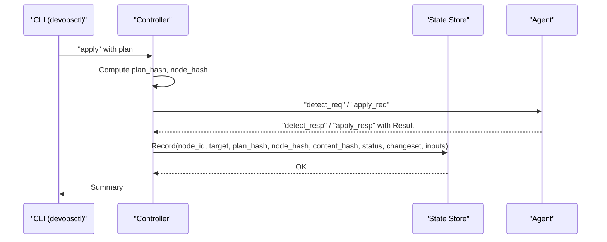
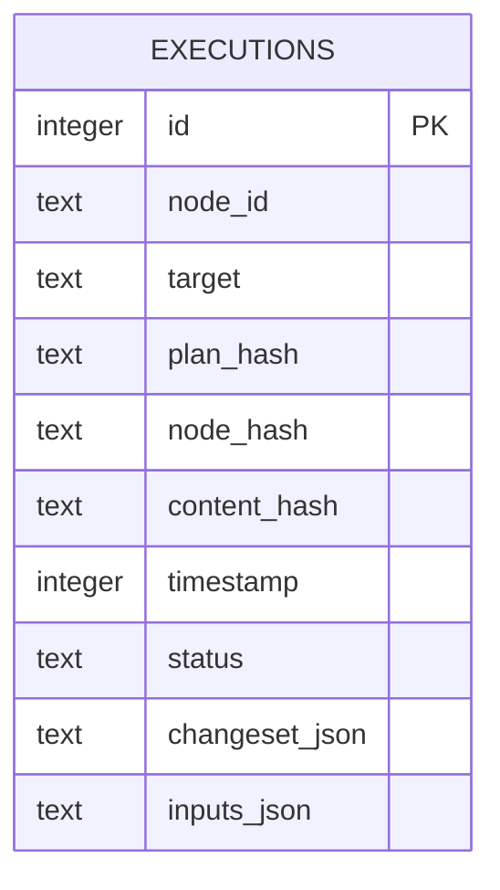
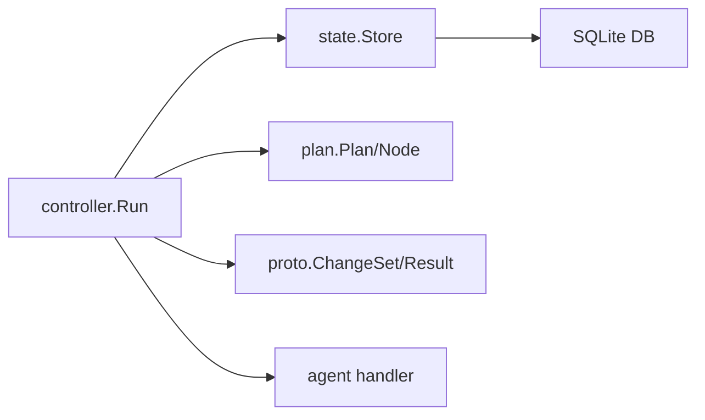

# State Management

<cite>
**Referenced Files in This Document**
- [store.go](file://internal/state/store.go)
- [orchestrator.go](file://internal/controller/orchestrator.go)
- [messages.go](file://internal/proto/messages.go)
- [main.go](file://cmd/devopsctl/main.go)
- [schema.go](file://internal/plan/schema.go)
- [rollback.go](file://internal/primitive/filesync/rollback.go)
- [handler.go](file://internal/agent/handler.go)
- [display.go](file://internal/controller/display.go)
- [resume_test.sh](file://tests/e2e/resume_test.sh)
</cite>

## Table of Contents
1. [Introduction](#introduction)
2. [Project Structure](#project-structure)
3. [Core Components](#core-components)
4. [Architecture Overview](#architecture-overview)
5. [Detailed Component Analysis](#detailed-component-analysis)
6. [Dependency Analysis](#dependency-analysis)
7. [Performance Considerations](#performance-considerations)
8. [Troubleshooting Guide](#troubleshooting-guide)
9. [Conclusion](#conclusion)
10. [Appendices](#appendices)

## Introduction
This document describes the DevOpsCtl state management system that persists execution outcomes locally using an SQLite database. It covers the SQLite-based state persistence architecture, execution tracking and auditing capabilities, and the state database schema. It also documents the execution record structure, data validation and business rules, data access patterns, lifecycle management, security, backup, and recovery. Practical examples of state queries and inspection commands are included.

## Project Structure
The state management system centers around a single SQLite database file located under the user’s home directory. The CLI integrates state operations into commands for inspecting execution history and rolling back the last run.

```mermaid
graph TB
subgraph "CLI"
M["cmd/devopsctl/main.go<br/>Commands: apply, reconcile, state, rollback"]
end
subgraph "Controller"
C["internal/controller/orchestrator.go<br/>Run, runFileSync, runProcessExec"]
end
subgraph "State Store"
S["internal/state/store.go<br/>Open, Record, List, LastRun,<br/>LastSuccessful, LatestExecution"]
end
subgraph "Protocol"
P["internal/proto/messages.go<br/>ChangeSet, Result, ApplyReq/Rsp,<br/>RollbackReq/Rsp"]
end
subgraph "Plan"
PL["internal/plan/schema.go<br/>Plan, Node, Target, Hash"]
end
subgraph "Agent"
A["internal/agent/handler.go<br/>Rollback handler"]
end
subgraph "DB"
DB["~/.devopsctl/state.db<br/>executions table + index"]
end
M --> C
C --> S
C --> P
C --> PL
C --> A
S --> DB
```

**Diagram sources**
- [main.go](file://cmd/devopsctl/main.go#L32-L88)
- [orchestrator.go](file://internal/controller/orchestrator.go#L34-L300)
- [store.go](file://internal/state/store.go#L38-L66)
- [messages.go](file://internal/proto/messages.go#L94-L116)
- [schema.go](file://internal/plan/schema.go#L11-L77)
- [handler.go](file://internal/agent/handler.go#L156-L173)

**Section sources**
- [main.go](file://cmd/devopsctl/main.go#L32-L88)
- [store.go](file://internal/state/store.go#L38-L66)

## Core Components
- State Store: Manages a local SQLite database, initializes schema, records execution outcomes, and provides queries for execution history.
- Controller: Orchestrates plan execution, computes hashes, decides resumption/reconciliation, and persists state after each node-target operation.
- Protocol: Defines the ChangeSet and Result structures used to capture diffs and outcomes.
- Plan: Provides plan-level and node-level hashing to identify unique units of execution and link state to plan runs.
- Agent: Handles rollback requests and responds with structured results.

Key responsibilities:
- Append-only execution records with deterministic hashing for idempotency and resumption.
- Indexing on node_id and target to optimize per-node and per-target queries.
- Status normalization (e.g., "success" -> "applied") for consistent auditing.

**Section sources**
- [store.go](file://internal/state/store.go#L17-L31)
- [store.go](file://internal/state/store.go#L68-L84)
- [store.go](file://internal/state/store.go#L100-L160)
- [store.go](file://internal/state/store.go#L162-L225)
- [orchestrator.go](file://internal/controller/orchestrator.go#L34-L300)
- [messages.go](file://internal/proto/messages.go#L94-L116)
- [schema.go](file://internal/plan/schema.go#L54-L77)

## Architecture Overview
The state management architecture is SQLite-backed and append-only. The controller writes execution records after each node-target operation, capturing plan/node hashes, content hash, status, changeset, and inputs. The CLI exposes commands to list executions and roll back the last run.



**Diagram sources**
- [main.go](file://cmd/devopsctl/main.go#L32-L88)
- [orchestrator.go](file://internal/controller/orchestrator.go#L34-L300)
- [store.go](file://internal/state/store.go#L68-L84)
- [messages.go](file://internal/proto/messages.go#L16-L75)

## Detailed Component Analysis

### State Database Schema
The state database stores a single table, executions, with fields for node identity, plan linkage, content fingerprint, timing, status, and serialized artifacts.



- Primary key: id (autoincrement)
- Composite index: executions_node_target_idx on (node_id, target)
- Constraints:
  - node_id, target, plan_hash, node_hash, content_hash, timestamp, status, changeset_json are NOT NULL
  - status accepts a constrained set of values
  - Default values exist for plan_hash, node_hash, inputs_json

Status values observed in code:
- pending, skipped, applied, failed, rolled_back, blocked

**Diagram sources**
- [store.go](file://internal/state/store.go#L17-L31)

**Section sources**
- [store.go](file://internal/state/store.go#L17-L31)

### Execution Record Structure
Each execution record captures:
- Identity: node_id, target
- Plan linkage: plan_hash, node_hash
- Content fingerprint: content_hash
- Timing: timestamp
- Outcome: status
- Artifacts: changeset_json (ChangeSet), inputs_json (map of inputs)

Fields are populated during controller execution and persisted via Store.Record.

**Section sources**
- [store.go](file://internal/state/store.go#L86-L98)
- [store.go](file://internal/state/store.go#L68-L84)
- [messages.go](file://internal/proto/messages.go#L94-L101)
- [orchestrator.go](file://internal/controller/orchestrator.go#L413-L429)
- [orchestrator.go](file://internal/controller/orchestrator.go#L492-L506)

### Data Validation and Business Rules
- Plan-level and node-level hashing:
  - Plan hash is derived from the raw plan JSON.
  - Node hash is derived from node type, target, and inputs.
- Resumption and reconciliation:
  - Resume checks plan_hash and status "applied" to skip identical work.
  - Reconcile compares node_hash to detect drift and marks nodes as unchanged if no changes.
- Status normalization:
  - "success" is normalized to "applied" for persistence.
- Failure policy:
  - Supported values: halt, continue, rollback; enforced by plan validation and controller logic.
- Rollback safety:
  - process.exec is not rollbackable; file.sync rollback is supported.

**Section sources**
- [schema.go](file://internal/plan/schema.go#L54-L77)
- [orchestrator.go](file://internal/controller/orchestrator.go#L34-L300)
- [orchestrator.go](file://internal/controller/orchestrator.go#L618-L652)
- [handler.go](file://internal/agent/handler.go#L156-L173)
- [validate.go](file://internal/plan/validate.go#L65-L90)

### Data Access Patterns
Common queries exposed by the state store:
- List all executions for a node (most recent first)
- Retrieve the most recent execution for a node+target
- Retrieve the most recent "applied" execution for a node+target
- Retrieve all executions from the most recent plan run

These are implemented by SQL queries that scan the executions table and leverage the composite index on (node_id, target).

Practical CLI usage:
- List executions for a node: devopsctl state list --node=<node-id>
- Rollback last run: devopsctl rollback --last

**Section sources**
- [store.go](file://internal/state/store.go#L162-L188)
- [store.go](file://internal/state/store.go#L190-L225)
- [store.go](file://internal/state/store.go#L100-L160)
- [main.go](file://cmd/devopsctl/main.go#L161-L192)
- [main.go](file://cmd/devopsctl/main.go#L247-L266)

### Execution Tracking and Auditing
- Append-only logging ensures immutable audit trail.
- Timestamps enable chronological ordering.
- Status values provide outcome visibility.
- Changeset and inputs are stored as JSON for reproducibility and inspection.

**Section sources**
- [store.go](file://internal/state/store.go#L68-L84)
- [display.go](file://internal/controller/display.go#L18-L43)

### Rollback Information and Recovery
- RollbackLast retrieves the most recent plan run and triggers agent-level rollback for applicable nodes.
- The system records "rolled_back" status for nodes that were successfully rolled back.
- Agent handlers enforce rollback safety (e.g., process.exec cannot be rolled back).

**Section sources**
- [orchestrator.go](file://internal/controller/orchestrator.go#L618-L652)
- [rollback.go](file://internal/primitive/filesync/rollback.go#L11-L82)
- [handler.go](file://internal/agent/handler.go#L156-L173)

### Data Lifecycle Management
- Retention: No automatic cleanup is implemented in code.
- Cleanup: Users can remove the state database file to reset state.
- Ephemeral nature: The state store is local and not replicated.

Lifecycle actions visible in tests:
- Deleting the state database file to reset state before resuming.

**Section sources**
- [resume_test.sh](file://tests/e2e/resume_test.sh#L54-L56)

## Dependency Analysis
The state store is a thin wrapper around SQLite with explicit schema initialization and migration for backward compatibility. The controller coordinates hashing, resumption, reconciliation, and state persistence. The protocol defines the structures used to persist changesets and results.



**Diagram sources**
- [store.go](file://internal/state/store.go#L33-L36)
- [orchestrator.go](file://internal/controller/orchestrator.go#L34-L300)
- [messages.go](file://internal/proto/messages.go#L94-L116)
- [schema.go](file://internal/plan/schema.go#L11-L77)

**Section sources**
- [store.go](file://internal/state/store.go#L33-L36)
- [orchestrator.go](file://internal/controller/orchestrator.go#L34-L300)
- [messages.go](file://internal/proto/messages.go#L94-L116)
- [schema.go](file://internal/plan/schema.go#L11-L77)

## Performance Considerations
- SQLite WAL mode is enabled for improved concurrency.
- Composite index on (node_id, target) supports efficient per-node and per-target queries.
- JSON serialization/deserialization occurs for changeset and inputs; keep inputs minimal for large-scale usage.
- Append-only writes avoid frequent updates, reducing write contention.

[No sources needed since this section provides general guidance]

## Troubleshooting Guide
Common issues and remedies:
- State database corruption or unexpected behavior:
  - Reset state by removing the SQLite file and rerun.
- Resume not working as expected:
  - Verify plan_hash and node_hash match expectations; check status is "applied".
- Rollback not triggered:
  - Ensure node type supports rollback; process.exec nodes are not rollbackable.
- Inspecting state:
  - Use devopsctl state list to review execution outcomes and timestamps.

**Section sources**
- [resume_test.sh](file://tests/e2e/resume_test.sh#L54-L56)
- [handler.go](file://internal/agent/handler.go#L156-L173)
- [main.go](file://cmd/devopsctl/main.go#L161-L192)

## Conclusion
DevOpsCtl’s state management system provides a robust, SQLite-backed, append-only audit trail for execution outcomes. It enables resumption, reconciliation, and targeted rollback through deterministic hashing and structured status reporting. While no automated retention or archival is implemented, the design supports straightforward manual lifecycle management and safe recovery practices.

[No sources needed since this section summarizes without analyzing specific files]

## Appendices

### Database Schema Diagram


**Diagram sources**
- [store.go](file://internal/state/store.go#L17-L31)

### Execution Record Fields Reference
- node_id: Identifier of the node
- target: Target identifier
- plan_hash: SHA-256 of the plan JSON
- node_hash: SHA-256 of node type, target, and inputs
- content_hash: SHA-256 of the changeset (or a placeholder for process.exec)
- timestamp: Unix seconds
- status: One of pending, skipped, applied, failed, rolled_back, blocked
- changeset_json: Serialized ChangeSet
- inputs_json: Serialized inputs map

**Section sources**
- [store.go](file://internal/state/store.go#L86-L98)
- [messages.go](file://internal/proto/messages.go#L94-L101)
- [orchestrator.go](file://internal/controller/orchestrator.go#L413-L429)
- [orchestrator.go](file://internal/controller/orchestrator.go#L492-L506)

### Practical Examples

- List executions for a specific node:
  - Command: devopsctl state list --node=<node-id>
  - Behavior: Returns rows ordered by timestamp descending

- Rollback the last run:
  - Command: devopsctl rollback --last
  - Behavior: Fetches the most recent plan run and triggers agent-level rollback for applicable nodes; records "rolled_back" status

- Resume a plan:
  - Command: devopsctl apply <plan> --resume
  - Behavior: Skips nodes whose plan_hash and node_hash match the last "applied" execution

- Reconcile a plan:
  - Command: devopsctl reconcile <plan>
  - Behavior: Compares node_hash to detect drift; marks nodes as unchanged if no changes

**Section sources**
- [main.go](file://cmd/devopsctl/main.go#L161-L192)
- [main.go](file://cmd/devopsctl/main.go#L247-L266)
- [orchestrator.go](file://internal/controller/orchestrator.go#L180-L235)
- [orchestrator.go](file://internal/controller/orchestrator.go#L618-L652)

### Data Security, Backup, and Recovery
- Security:
  - State database resides under the user’s home directory with restrictive permissions.
- Backup:
  - Back up the entire ~/.devopsctl directory to preserve state.
- Recovery:
  - To recover from corruption or drift, remove the state database file and rerun the plan; use --resume to minimize redundant work.

**Section sources**
- [store.go](file://internal/state/store.go#L38-L66)
- [resume_test.sh](file://tests/e2e/resume_test.sh#L54-L56)