# Testing and Validation

<cite>
**Referenced Files in This Document**
- [compile_test.go](file://internal/devlang/compile_test.go)
- [validate.go](file://internal/devlang/validate.go)
- [lower.go](file://internal/devlang/lower.go)
- [lexer.go](file://internal/devlang/lexer.go)
- [parser.go](file://internal/devlang/parser.go)
- [ast.go](file://internal/devlang/ast.go)
- [test_e2e.sh](file://test_e2e.sh)
- [resume_test.sh](file://tests/e2e/resume_test.sh)
- [plan_resume.devops](file://tests/e2e/plan_resume.devops)
- [plan_resume.json](file://tests/e2e/plan_resume.json)
- [plan_test.go](file://internal/plan/plan_test.go)
- [validate_test.go](file://internal/plan/validate_test.go)
- [filesync_test.go](file://internal/primitive/filesync/filesync_test.go)
- [orchestrator.go](file://internal/controller/orchestrator.go)
- [store.go](file://internal/state/store.go)
- [diff.go](file://internal/primitive/filesync/diff.go)
- [rollback.go](file://internal/primitive/filesync/rollback.go)
- [processexec.go](file://internal/primitive/processexec/processexec.go)
- [server.go](file://internal/agent/server.go)
- [schema.go](file://internal/plan/schema.go)
- [test_v0_4.sh](file://test_v0_4.sh)
- [test_v0_5.sh](file://test_v0_5.sh)
- [test_v0_6.sh](file://test_v0_6.sh)
- [step_basic.devops](file://tests/v0_4/valid/step_basic.devops)
- [step_comprehensive.devops](file://tests/v0_4/valid/step_comprehensive.devops)
- [step_multiple_targets.devops](file://tests/v0_4/valid/step_multiple_targets.devops)
- [step_override_inputs.devops](file://tests/v0_4/valid/step_override_inputs.devops)
- [step_with_lets.devops](file://tests/v0_4/valid/step_with_lets.devops)
- [step_duplicate.devops](file://tests/v0_4/invalid/step_duplicate.devops)
- [step_nested.devops](file://tests/v0_4/invalid/step_nested.devops)
- [step_primitive_collision.devops](file://tests/v0_4/invalid/step_primitive_collision.devops)
- [step_undefined.devops](file://tests/v0_4/invalid/step_undefined.devops)
- [step_unknown_primitive.devops](file://tests/v0_4/invalid/step_unknown_primitive.devops)
- [step_with_depends_on.devops](file://tests/v0_4/invalid/step_with_depends_on.devops)
- [step_with_targets.devops](file://tests/v0_4/invalid/step_with_targets.devops)
- [with_step.devops](file://tests/v0_4/hash_stability/with_step.devops)
- [without_step.devops](file://tests/v0_4/hash_stability/without_step.devops)
- [comprehensive.devops](file://tests/v0_5/valid/comprehensive.devops)
- [for_basic.devops](file://tests/v0_5/valid/for_basic.devops)
- [for_multiple_loops.devops](file://tests/v0_5/valid/for_multiple_loops.devops)
- [for_with_let_range.devops](file://tests/v0_5/valid/for_with_let_range.devops)
- [for_with_lets.devops](file://tests/v0_5/valid/for_with_lets.devops)
- [nested_step_basic.devops](file://tests/v0_5/valid/nested_step_basic.devops)
- [nested_step_deep.devops](file://tests/v0_5/valid/nested_step_deep.devops)
- [nested_step_override.devops](file://tests/v0_5/valid/nested_step_override.devops)
- [for_non_list_range.devops](file://tests/v0_5/invalid/for_non_list_range.devops)
- [nested_step_cycle_direct.devops](file://tests/v0_5/invalid/nested_step_cycle_direct.devops)
- [nested_step_cycle_indirect.devops](file://tests/v0_5/invalid/nested_step_cycle_indirect.devops)
- [nested_step_self_reference.devops](file://tests/v0_5/invalid/nested_step_self_reference.devops)
- [for_loop_generated.devops](file://tests/v0_5/hash_stability/for_loop_generated.devops)
- [for_loop_manual.devops](file://tests/v0_5/hash_stability/for_loop_manual.devops)
- [step_expanded.devops](file://tests/v0_5/hash_stability/step_expanded.devops)
- [step_nested.devops](file://tests/v0_5/hash_stability/step_nested.devops)
- [param_basic.devops](file://tests/v0_6/valid/param_basic.devops)
- [param_required.devops](file://tests/v0_6/valid/param_required.devops)
- [param_duplicate.devops](file://tests/v0_6/invalid/param_duplicate.devops)
- [param_missing_required.devops](file://tests/v0_6/invalid/param_missing_required.devops)
- [param_with_default.devops](file://tests/v0_6/hash_stability/param_with_default.devops)
- [param_manual_expansion.devops](file://tests/v0_6/hash_stability/param_manual_expansion.devops)
- [LANGUAGE_VERSIONS.md](file://LANGUAGE_VERSIONS.md)
- [DESIGN.md](file://DESIGN.md)
- [main.go](file://cmd/devopsctl/main.go)
</cite>

## Update Summary
**Changes Made**
- Added comprehensive test coverage for v0.6 language version including parameter validation tests, hash stability verification, and parameter substitution testing
- Updated testing methodology to include parameterized step testing with typed parameters and default values
- Enhanced DevLang compiler section to include v0.6 parameter validation and substitution functionality
- Updated language version documentation to reflect v0.6 parameter features and testing coverage

## Table of Contents
1. [Introduction](#introduction)
2. [Project Structure](#project-structure)
3. [Core Components](#core-components)
4. [Architecture Overview](#architecture-overview)
5. [Detailed Component Analysis](#detailed-component-analysis)
6. [Dependency Analysis](#dependency-analysis)
7. [Performance Considerations](#performance-considerations)
8. [Troubleshooting Guide](#troubleshooting-guide)
9. [Conclusion](#conclusion)
10. [Appendices](#appendices)

## Introduction
This document provides comprehensive testing and validation guidance for DevOpsCtl. It covers:
- End-to-end (e2e) testing framework and scenarios
- Resume testing and state recovery mechanisms
- Unit test coverage for the devlang compiler, controller orchestrator, and primitive operations
- Integration testing strategies for full workflows from .devops compilation to execution and state persistence
- Validation procedures for plan correctness, execution success, and rollback functionality
- Guidelines for writing custom tests, managing test data, and CI setup
- Performance testing approaches, load testing, and stress testing
- Debugging techniques for test failures, log analysis, and environment troubleshooting

## Project Structure
DevOpsCtl's testing assets are organized across:
- E2E shell scripts and plans for end-to-end validation
- Unit tests under internal packages for plan, devlang, controller, state, and primitives
- Primitive-specific tests for file synchronization and process execution
- **New** v0.6 language feature test suites with comprehensive parameter validation, hash stability testing, and parameter substitution scenarios
- **Updated** v0.5 language feature test suites with for-loop functionality, nested step validation, and hash stability testing
- **Updated** v0.4 language feature test suites with step reuse functionality and hash stability validation

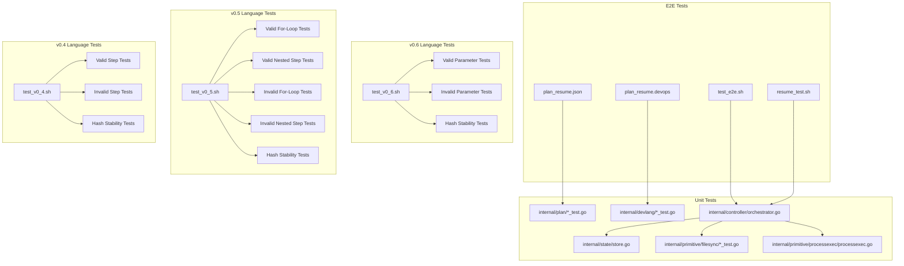

**Diagram sources**
- [test_e2e.sh](file://test_e2e.sh#L1-L317)
- [resume_test.sh](file://tests/e2e/resume_test.sh#L1-L81)
- [plan_resume.devops](file://tests/e2e/plan_resume.devops#L1-L43)
- [plan_resume.json](file://tests/e2e/plan_resume.json#L1-L36)
- [test_v0_6.sh](file://test_v0_6.sh#L1-L37)
- [param_basic.devops](file://tests/v0_6/valid/param_basic.devops#L1-L18)
- [param_required.devops](file://tests/v0_6/valid/param_required.devops#L1-L19)
- [param_duplicate.devops](file://tests/v0_6/invalid/param_duplicate.devops#L1-L19)
- [param_missing_required.devops](file://tests/v0_6/invalid/param_missing_required.devops#L1-L17)
- [param_with_default.devops](file://tests/v0_6/hash_stability/param_with_default.devops#L1-L18)
- [param_manual_expansion.devops](file://tests/v0_6/hash_stability/param_manual_expansion.devops#L1-L11)
- [test_v0_5.sh](file://test_v0_5.sh#L1-L34)
- [comprehensive.devops](file://tests/v0_5/valid/comprehensive.devops#L1-L39)
- [for_basic.devops](file://tests/v0_5/valid/for_basic.devops#L1-L21)
- [nested_step_basic.devops](file://tests/v0_5/valid/nested_step_basic.devops#L1-L21)
- [for_non_list_range.devops](file://tests/v0_5/invalid/for_non_list_range.devops#L1-L16)
- [nested_step_self_reference.devops](file://tests/v0_5/invalid/nested_step_self_reference.devops#L1-L16)
- [for_loop_manual.devops](file://tests/v0_5/hash_stability/for_loop_manual.devops#L1-L27)
- [step_expanded.devops](file://tests/v0_5/hash_stability/step_expanded.devops#L1-L14)
- [test_v0_4.sh](file://test_v0_4.sh#L1-L71)
- [step_basic.devops](file://tests/v0_4/valid/step_basic.devops#L1-L17)
- [step_duplicate.devops](file://tests/v0_4/invalid/step_duplicate.devops#L1-L23)
- [with_step.devops](file://tests/v0_4/hash_stability/with_step.devops#L1-L16)
- [plan_test.go](file://internal/plan/plan_test.go#L1-L62)
- [compile_test.go](file://internal/devlang/compile_test.go#L1-L219)
- [validate_test.go](file://internal/plan/validate_test.go#L1-L95)
- [lexer.go](file://internal/devlang/lexer.go#L1-L288)
- [parser.go](file://internal/devlang/parser.go#L1-L495)
- [ast.go](file://internal/devlang/ast.go#L1-L126)
- [validate.go](file://internal/devlang/validate.go#L1052-L1558)
- [lower.go](file://internal/devlang/lower.go#L284-L479)
- [orchestrator.go](file://internal/controller/orchestrator.go#L1-L653)
- [store.go](file://internal/state/store.go#L1-L226)
- [filesync_test.go](file://internal/primitive/filesync/filesync_test.go#L1-L111)
- [processexec.go](file://internal/primitive/processexec/processexec.go#L1-L83)

**Section sources**
- [test_e2e.sh](file://test_e2e.sh#L1-L317)
- [resume_test.sh](file://tests/e2e/resume_test.sh#L1-L81)
- [plan_resume.devops](file://tests/e2e/plan_resume.devops#L1-L43)
- [plan_resume.json](file://tests/e2e/plan_resume.json#L1-L36)
- [test_v0_6.sh](file://test_v0_6.sh#L1-L37)
- [test_v0_5.sh](file://test_v0_5.sh#L1-L34)
- [test_v0_4.sh](file://test_v0_4.sh#L1-L71)

## Core Components
- DevOps language compiler (lexer, parser, AST): Validates and lowers .devops declarations to plan nodes with support for language versions 0.1, 0.2, 0.3, 0.4, 0.5, and **v0.6**.
- Controller orchestrator: Executes plans end-to-end, manages concurrency, failure policies, resume/reconcile, and state persistence.
- State store: SQLite-backed append-only execution log for plan/node hashes, change sets, and inputs.
- Primitives:
  - file.sync: Detects remote state, computes diffs, streams file content, and supports rollback via snapshots.
  - process.exec: Executes commands locally and reports exit code and output.

Key testing areas:
- Plan loading and validation
- Devlang lexer/parser correctness across all language versions
- Controller graph execution, failure propagation, and resume/reconcile
- Primitive diff/update/delete/mkdir behavior and rollback semantics
- State integrity and idempotency
- **New** v0.6 language feature testing including parameter validation, parameter substitution, and hash stability
- **Updated** v0.5 language feature testing including for-loops, nested steps, validation, and hash stability
- **Updated** v0.4 language feature testing including step reuse, validation, and hash stability

**Section sources**
- [lexer.go](file://internal/devlang/lexer.go#L1-L288)
- [parser.go](file://internal/devlang/parser.go#L1-L495)
- [ast.go](file://internal/devlang/ast.go#L1-L126)
- [validate.go](file://internal/devlang/validate.go#L1052-L1558)
- [lower.go](file://internal/devlang/lower.go#L284-L479)
- [orchestrator.go](file://internal/controller/orchestrator.go#L1-L653)
- [store.go](file://internal/state/store.go#L1-L226)
- [diff.go](file://internal/primitive/filesync/diff.go#L1-L87)
- [rollback.go](file://internal/primitive/filesync/rollback.go#L1-L83)
- [processexec.go](file://internal/primitive/processexec/processexec.go#L1-L83)

## Architecture Overview
The e2e test suite validates the end-to-end pipeline: CLI invokes controller orchestration, which communicates with an agent over TCP, executes primitives, persists state, and supports resume/reconcile and rollback.

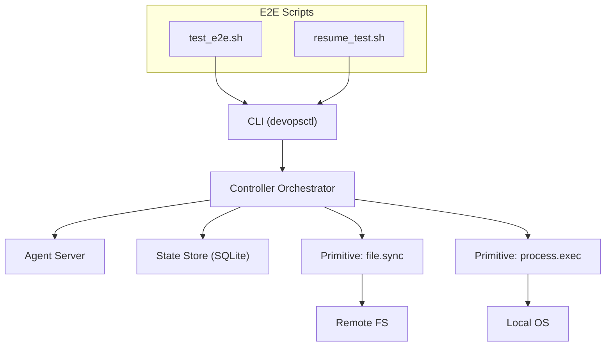

**Diagram sources**
- [test_e2e.sh](file://test_e2e.sh#L1-L317)
- [resume_test.sh](file://tests/e2e/resume_test.sh#L1-L81)
- [server.go](file://internal/agent/server.go#L1-L51)
- [orchestrator.go](file://internal/controller/orchestrator.go#L1-L653)
- [store.go](file://internal/state/store.go#L1-L226)
- [processexec.go](file://internal/primitive/processexec/processexec.go#L1-L83)
- [diff.go](file://internal/primitive/filesync/diff.go#L1-L87)

## Detailed Component Analysis

### End-to-End Test Suite
The e2e suite validates:
- File synchronization baseline
- .devops language compilation and application
- Idempotency and drift detection
- Process execution success and failure classification
- Rollback boundaries and state listing
- Plan fingerprint hashing and reconciliation
- Execution graph, dependencies, and failure policy behavior
- Resume and reconcile flows

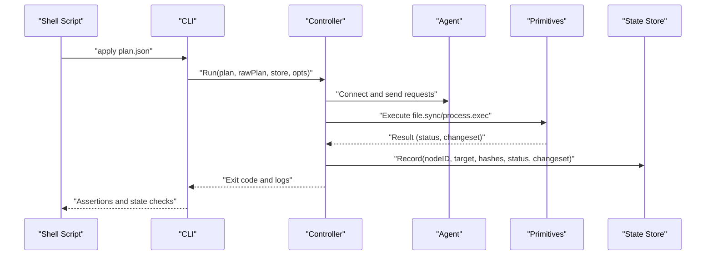

**Diagram sources**
- [test_e2e.sh](file://test_e2e.sh#L1-L317)
- [orchestrator.go](file://internal/controller/orchestrator.go#L34-L300)
- [store.go](file://internal/state/store.go#L68-L84)

**Section sources**
- [test_e2e.sh](file://test_e2e.sh#L1-L317)

### Resume Testing and State Recovery
The resume test script demonstrates:
- Building the CLI, starting an agent, and preparing a plan with a failing node
- Running the plan to completion with a failure at a specific node
- Inspecting state before and after fixing the condition
- Resuming execution and verifying continued progress
- Reconciling a modified plan and asserting idempotent behavior

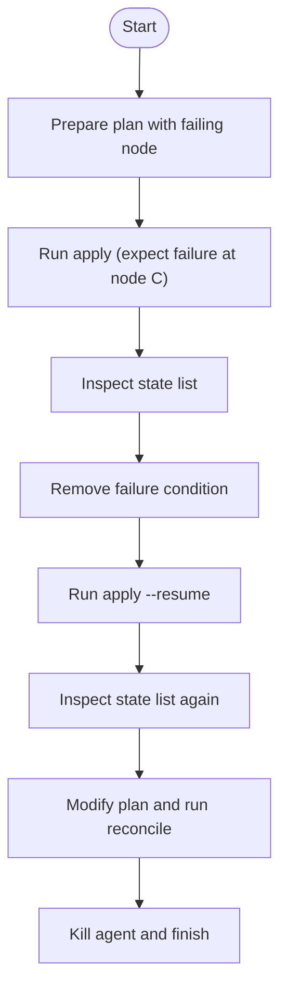

**Diagram sources**
- [resume_test.sh](file://tests/e2e/resume_test.sh#L1-L81)
- [plan_resume.devops](file://tests/e2e/plan_resume.devops#L1-L43)
- [plan_resume.json](file://tests/e2e/plan_resume.json#L1-L36)

**Section sources**
- [resume_test.sh](file://tests/e2e/resume_test.sh#L1-L81)
- [plan_resume.devops](file://tests/e2e/plan_resume.devops#L1-L43)
- [plan_resume.json](file://tests/e2e/plan_resume.json#L1-L36)

### Plan Loading and Validation
Unit tests validate:
- Successful load and validation of a minimal plan
- Missing fields and unknown target references produce validation errors
- process.exec node validation ensures required fields (cmd, cwd) are present

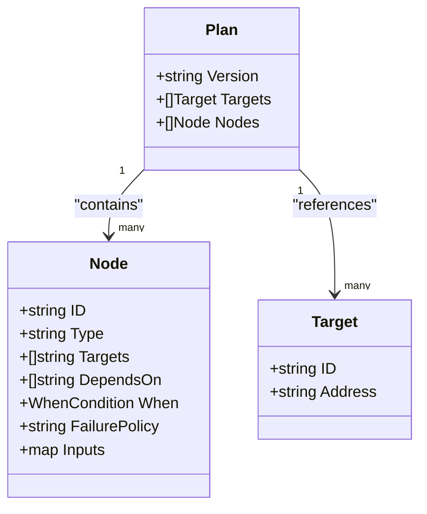

**Diagram sources**
- [schema.go](file://internal/plan/schema.go#L11-L40)

**Section sources**
- [plan_test.go](file://internal/plan/plan_test.go#L1-L62)
- [validate_test.go](file://internal/plan/validate_test.go#L1-L95)
- [schema.go](file://internal/plan/schema.go#L11-L77)

### DevLang Compiler (Lexer, Parser, AST)
**Updated** Comprehensive unit tests have been added for the DevOps language compiler and validator, providing extensive coverage for compilation pipeline, cross-format validation, and semantic validation logic for language versions 0.1, 0.2, 0.3, 0.4, 0.5, and **v0.6**.

Coverage includes:
- Tokenization of keywords, identifiers, strings, booleans, and operators
- Parsing of target, node, let, for, step, and module declarations
- **New** Parameter parsing and validation for v0.6 language version
- Expression parsing for strings, booleans, identifiers, and lists
- Error reporting with position information
- Compilation pipeline validation from .devops to plan JSON
- Cross-format validation ensuring .devops and JSON plans produce identical results
- Semantic validation for language version 0.1 constraints
- **New** v0.6 validation supporting typed parameters with defaults, parameter substitution, and parameter precedence rules
- **New** LowerToPlanV0_6 function for parameter resolution, substitution, and comprehensive plan generation

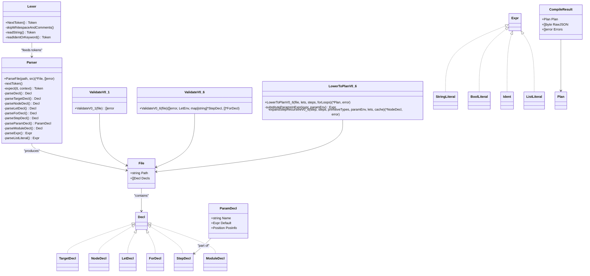

**Diagram sources**
- [lexer.go](file://internal/devlang/lexer.go#L1-L288)
- [parser.go](file://internal/devlang/parser.go#L1-L495)
- [ast.go](file://internal/devlang/ast.go#L60-L82)
- [compile_test.go](file://internal/devlang/compile_test.go#L1-L219)
- [validate.go](file://internal/devlang/validate.go#L1669-L1713)
- [lower.go](file://internal/devlang/lower.go#L725-L869)

**Section sources**
- [lexer.go](file://internal/devlang/lexer.go#L1-L288)
- [parser.go](file://internal/devlang/parser.go#L1-L495)
- [ast.go](file://internal/devlang/ast.go#L60-L82)
- [compile_test.go](file://internal/devlang/compile_test.go#L1-L219)
- [validate.go](file://internal/devlang/validate.go#L1669-L1713)
- [lower.go](file://internal/devlang/lower.go#L725-L869)

### v0.6 Language Feature Testing
**New** The v0.6 language testing infrastructure provides comprehensive validation for parameterized step functionality:

#### Test Runner Infrastructure
The `test_v0_6.sh` script automates testing of v0.6 language features:
- Builds the devopsctl binary
- Tests valid parameter scenarios (basic parameters with defaults, required parameters)
- Tests invalid parameter scenarios (duplicate parameter names, missing required parameters)
- Validates hash stability between parameter-based and manual expansion

#### Valid Parameter Scenarios
- **Basic parameter with default**: Simple parameter with default value assignment
- **Required parameter**: Parameter without default that must be provided at node instantiation
- **Multiple parameters**: Combination of required and optional parameters in single step
- **Parameter substitution**: Parameters resolved during step expansion and substituted into node inputs

#### Invalid Parameter Scenarios
- **Duplicate parameter names**: Parameters with identical names within same step definition
- **Missing required parameter**: Node instantiation without providing required parameter value
- **Type mismatch**: Parameter default type does not match parameter type specification

#### Hash Stability Testing
Ensures consistent plan hashing between:
- Parameter-based compilation (`param_with_default.devops`)
- Manual expansion compilation (`param_manual_expansion.devops`)

Both should produce identical hash values, guaranteeing deterministic plan evaluation.

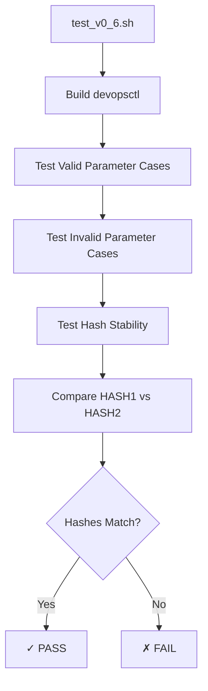

**Diagram sources**
- [test_v0_6.sh](file://test_v0_6.sh#L1-L37)
- [param_with_default.devops](file://tests/v0_6/hash_stability/param_with_default.devops#L1-L18)
- [param_manual_expansion.devops](file://tests/v0_6/hash_stability/param_manual_expansion.devops#L1-L11)

**Section sources**
- [test_v0_6.sh](file://test_v0_6.sh#L1-L37)
- [param_basic.devops](file://tests/v0_6/valid/param_basic.devops#L1-L18)
- [param_required.devops](file://tests/v0_6/valid/param_required.devops#L1-L19)
- [param_duplicate.devops](file://tests/v0_6/invalid/param_duplicate.devops#L1-L19)
- [param_missing_required.devops](file://tests/v0_6/invalid/param_missing_required.devops#L1-L17)
- [param_with_default.devops](file://tests/v0_6/hash_stability/param_with_default.devops#L1-L18)
- [param_manual_expansion.devops](file://tests/v0_6/hash_stability/param_manual_expansion.devops#L1-L11)

### v0.5 Language Feature Testing
**Updated** The v0.5 language testing infrastructure provides comprehensive validation for advanced language features:

#### Test Runner Infrastructure
The `test_v0_5.sh` script automates testing of v0.5 language features:
- Builds the devopsctl binary
- Tests valid for-loop scenarios (basic, multiple loops, let ranges, and comprehensive cases)
- Tests valid nested step scenarios (basic, deep nesting, and input overrides)
- Tests invalid for-loop scenarios (non-list ranges)
- Tests invalid nested step scenarios (self-references, direct/indirect cycles)
- Validates hash stability between generated and manual expansions

#### Valid For-Loop Scenarios
- **Basic for-loop**: Simple compile-time loop unrolling with string literals
- **Multiple independent loops**: Concurrent processing of different loop variables
- **For-loop with let range**: Dynamic range resolution using let bindings
- **For-loop with let expressions**: Complex expressions within loop bodies
- **Comprehensive for-loop + nested steps**: Advanced integration of both features

#### Valid Nested Step Scenarios
- **Basic nested step**: Simple step referencing another step
- **Deep nested step**: Multi-level step inheritance chains
- **Nested step with input overrides**: Node-level overrides for step-defined defaults

#### Invalid For-Loop Scenarios
- **Non-list range**: For-loops require list literals, not strings or other types

#### Invalid Nested Step Scenarios
- **Self-referencing steps**: Direct circular dependencies
- **Direct/indirect cycles**: Multi-step circular dependencies
- **Unknown step references**: Steps referencing non-existent step definitions

#### Hash Stability Testing
Ensures consistent plan hashing between:
- Generated for-loop plans (`for_loop_generated.devops`)
- Manually expanded for-loop plans (`for_loop_manual.devops`)
- Expanded step plans (`step_expanded.devops`)
- Nested step plans (`step_nested.devops`)

Both should produce identical hash values, guaranteeing deterministic plan evaluation.

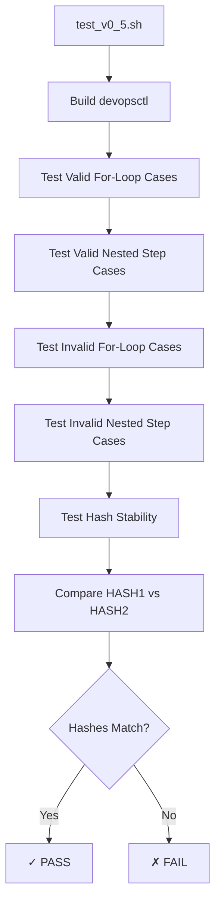

**Diagram sources**
- [test_v0_5.sh](file://test_v0_5.sh#L1-L34)
- [for_loop_manual.devops](file://tests/v0_5/hash_stability/for_loop_manual.devops#L1-L27)
- [step_expanded.devops](file://tests/v0_5/hash_stability/step_expanded.devops#L1-L14)

**Section sources**
- [test_v0_5.sh](file://test_v0_5.sh#L1-L34)
- [comprehensive.devops](file://tests/v0_5/valid/comprehensive.devops#L1-L39)
- [for_basic.devops](file://tests/v0_5/valid/for_basic.devops#L1-L21)
- [for_multiple_loops.devops](file://tests/v0_5/valid/for_multiple_loops.devops#L1-L27)
- [for_with_let_range.devops](file://tests/v0_5/valid/for_with_let_range.devops#L1-L21)
- [for_with_lets.devops](file://tests/v0_5/valid/for_with_lets.devops#L1-L21)
- [nested_step_basic.devops](file://tests/v0_5/valid/nested_step_basic.devops#L1-L21)
- [nested_step_deep.devops](file://tests/v0_5/valid/nested_step_deep.devops#L1-L21)
- [nested_step_override.devops](file://tests/v0_5/valid/nested_step_override.devops#L1-L21)
- [for_non_list_range.devops](file://tests/v0_5/invalid/for_non_list_range.devops#L1-L16)
- [nested_step_cycle_direct.devops](file://tests/v0_5/invalid/nested_step_cycle_direct.devops#L1-L21)
- [nested_step_cycle_indirect.devops](file://tests/v0_5/invalid/nested_step_cycle_indirect.devops#L1-L21)
- [nested_step_self_reference.devops](file://tests/v0_5/invalid/nested_step_self_reference.devops#L1-L16)
- [for_loop_manual.devops](file://tests/v0_5/hash_stability/for_loop_manual.devops#L1-L27)
- [step_expanded.devops](file://tests/v0_5/hash_stability/step_expanded.devops#L1-L14)
- [step_nested.devops](file://tests/v0_5/hash_stability/step_nested.devops#L1-L14)

### v0.4 Language Feature Testing
**Updated** The v0.4 language testing infrastructure provides comprehensive validation for step reuse functionality:

#### Test Runner Infrastructure
The `test_v0_4.sh` script automates testing of v0.4 language features:
- Builds the devopsctl binary
- Tests valid step scenarios (basic, comprehensive, multiple targets, input overrides, let bindings)
- Tests invalid step scenarios (duplicates, nested steps, primitive collisions, undefined steps, unknown primitives, invalid dependencies)
- Validates hash stability between step-based and manually expanded plans

#### Valid Step Scenarios
- **Basic step definition**: Simple file.sync step with basic usage
- **Comprehensive step**: Multiple steps with different primitives, failure policies, and dependencies
- **Multiple targets**: Single step reused across multiple deployment targets
- **Input overrides**: Node-level input overrides for step-defined defaults
- **Let bindings**: Steps using let expressions for dynamic configuration

#### Invalid Step Scenarios
- **Duplicate step names**: Prevented during semantic validation
- **Nested steps**: Steps cannot contain other steps
- **Primitive collisions**: Steps cannot shadow primitive types
- **Undefined steps**: References to non-existent steps cause validation errors
- **Unknown primitives**: Steps with invalid primitive types
- **Invalid dependencies**: Steps with depends_on or targets in step definitions

#### Hash Stability Testing
Ensures consistent plan hashing between:
- Step-based compilation (`with_step.devops`)
- Manually expanded compilation (`without_step.devops`)

Both should produce identical hash values, guaranteeing deterministic plan evaluation.

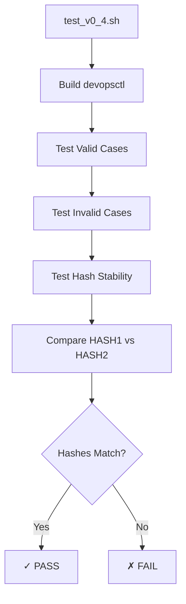

**Diagram sources**
- [test_v0_4.sh](file://test_v0_4.sh#L1-L71)
- [with_step.devops](file://tests/v0_4/hash_stability/with_step.devops#L1-L16)
- [without_step.devops](file://tests/v0_4/hash_stability/without_step.devops#L1-L12)

**Section sources**
- [test_v0_4.sh](file://test_v0_4.sh#L1-L71)
- [step_basic.devops](file://tests/v0_4/valid/step_basic.devops#L1-L17)
- [step_comprehensive.devops](file://tests/v0_4/valid/step_comprehensive.devops#L1-L48)
- [step_multiple_targets.devops](file://tests/v0_4/valid/step_multiple_targets.devops#L1-L27)
- [step_override_inputs.devops](file://tests/v0_4/valid/step_override_inputs.devops#L1-L18)
- [step_with_lets.devops](file://tests/v0_4/valid/step_with_lets.devops#L1-L22)
- [step_duplicate.devops](file://tests/v0_4/invalid/step_duplicate.devops#L1-L23)
- [step_nested.devops](file://tests/v0_4/invalid/step_nested.devops#L1-L22)
- [step_primitive_collision.devops](file://tests/v0_4/invalid/step_primitive_collision.devops#L1-L15)
- [step_undefined.devops](file://tests/v0_4/invalid/step_undefined.devops#L1-L10)
- [step_unknown_primitive.devops](file://tests/v0_4/invalid/step_unknown_primitive.devops#L1-L15)
- [step_with_depends_on.devops](file://tests/v0_4/invalid/step_with_depends_on.devops#L1-L17)
- [step_with_targets.devops](file://tests/v0_4/invalid/step_with_targets.devops#L1-L21)
- [with_step.devops](file://tests/v0_4/hash_stability/with_step.devops#L1-L16)
- [without_step.devops](file://tests/v0_4/hash_stability/without_step.devops#L1-L12)

### Controller Orchestrator
Key behaviors validated by e2e and unit tests:
- Build execution graph from nodes and dependencies
- Parallel execution with configurable parallelism
- Failure policy handling (halt, continue, rollback)
- Resume and reconcile logic using plan/node hashes
- State recording per node-target combination
- RollbackLast for last run recovery

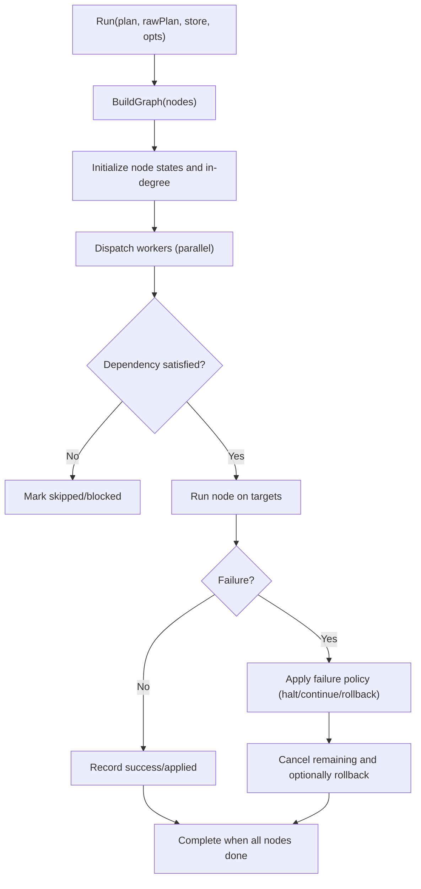

**Diagram sources**
- [orchestrator.go](file://internal/controller/orchestrator.go#L34-L300)
- [store.go](file://internal/state/store.go#L68-L84)

**Section sources**
- [orchestrator.go](file://internal/controller/orchestrator.go#L1-L653)
- [store.go](file://internal/state/store.go#L1-L226)

### Primitive Operations
- file.sync:
  - Detect remote state, compute diff (create/update/delete/chmod/chown/mkdir), stream files, persist state, and rollback via snapshot restoration
- process.exec:
  - Execute commands with timeout, capture stdout/stderr, classify exit codes and timeouts, and report non-rollback-safe results

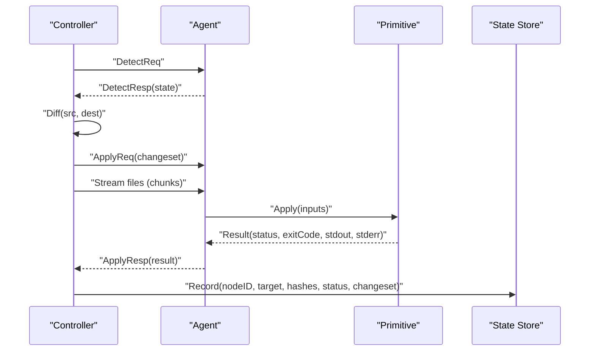

**Diagram sources**
- [orchestrator.go](file://internal/controller/orchestrator.go#L313-L442)
- [diff.go](file://internal/primitive/filesync/diff.go#L1-L87)
- [rollback.go](file://internal/primitive/filesync/rollback.go#L1-L83)
- [processexec.go](file://internal/primitive/processexec/processexec.go#L1-L83)
- [store.go](file://internal/state/store.go#L68-L84)

**Section sources**
- [diff.go](file://internal/primitive/filesync/diff.go#L1-L87)
- [rollback.go](file://internal/primitive/filesync/rollback.go#L1-L83)
- [processexec.go](file://internal/primitive/processexec/processexec.go#L1-L83)

## Dependency Analysis
Testing dependencies across components:

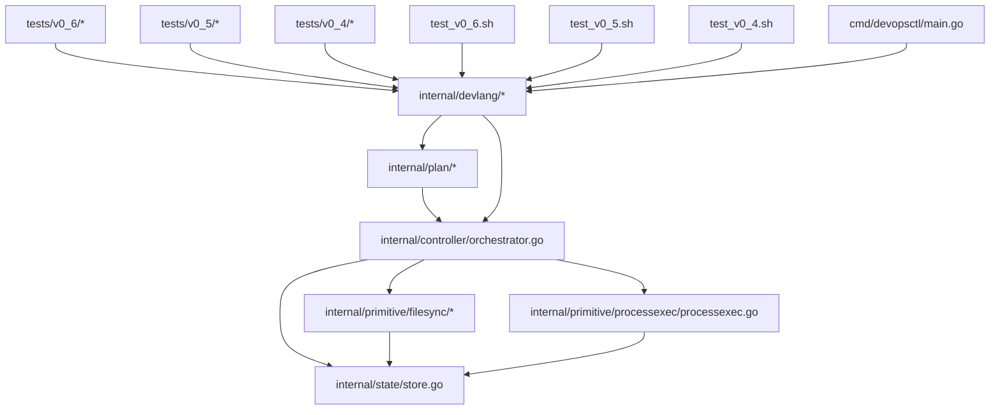

**Diagram sources**
- [plan_test.go](file://internal/plan/plan_test.go#L1-L62)
- [compile_test.go](file://internal/devlang/compile_test.go#L1-L219)
- [validate_test.go](file://internal/plan/validate_test.go#L1-L95)
- [lexer.go](file://internal/devlang/lexer.go#L1-L288)
- [parser.go](file://internal/devlang/parser.go#L1-L495)
- [ast.go](file://internal/devlang/ast.go#L1-L126)
- [validate.go](file://internal/devlang/validate.go#L1052-L1558)
- [lower.go](file://internal/devlang/lower.go#L284-L479)
- [orchestrator.go](file://internal/controller/orchestrator.go#L1-L653)
- [store.go](file://internal/state/store.go#L1-L226)
- [filesync_test.go](file://internal/primitive/filesync/filesync_test.go#L1-L111)
- [processexec.go](file://internal/primitive/processexec/processexec.go#L1-L83)
- [test_v0_6.sh](file://test_v0_6.sh#L1-L37)
- [test_v0_5.sh](file://test_v0_5.sh#L1-L34)
- [test_v0_4.sh](file://test_v0_4.sh#L1-L71)
- [main.go](file://cmd/devopsctl/main.go#L56-L65)

**Section sources**
- [plan_test.go](file://internal/plan/plan_test.go#L1-L62)
- [compile_test.go](file://internal/devlang/compile_test.go#L1-L219)
- [validate_test.go](file://internal/plan/validate_test.go#L1-L95)
- [lexer.go](file://internal/devlang/lexer.go#L1-L288)
- [parser.go](file://internal/devlang/parser.go#L1-L495)
- [ast.go](file://internal/devlang/ast.go#L1-L126)
- [validate.go](file://internal/devlang/validate.go#L1052-L1558)
- [lower.go](file://internal/devlang/lower.go#L284-L479)
- [orchestrator.go](file://internal/controller/orchestrator.go#L1-L653)
- [store.go](file://internal/state/store.go#L1-L226)
- [filesync_test.go](file://internal/primitive/filesync/filesync_test.go#L1-L111)
- [processexec.go](file://internal/primitive/processexec/processexec.go#L1-L83)
- [test_v0_6.sh](file://test_v0_6.sh#L1-L37)
- [test_v0_5.sh](file://test_v0_5.sh#L1-L34)
- [test_v0_4.sh](file://test_v0_4.sh#L1-L71)
- [main.go](file://cmd/devopsctl/main.go#L56-L65)

## Performance Considerations
- Parallelism tuning: Adjust worker count to balance throughput and resource contention.
- Streaming efficiency: Large file transfers are chunked; ensure network stability and adequate buffer sizes.
- State writes: SQLite WAL mode improves concurrency; avoid excessive small writes by batching where appropriate.
- Failure policy impact: "continue" allows partial progress; "rollback" incurs extra round-trips for recovery.
- Idempotency and reconciliation reduce redundant work by skipping unchanged nodes.
- **New** Step expansion overhead: v0.4 step reuse adds compilation complexity but enables better plan organization and reuse.
- **New** For-loop unrolling overhead: v0.5 for-loops are unrolled at compile time, potentially increasing plan size but improving runtime performance.
- **New** Parameter resolution overhead: v0.6 parameters add compile-time resolution complexity but enable powerful step customization.
- **New** Hash stability validation: v0.6 introduces additional validation steps to ensure consistent plan hashing across different compilation paths.
- **Updated** v0.5 hash stability validation: Enhanced validation steps to ensure consistent plan hashing across different compilation paths.
- **Updated** v0.4 hash stability validation: Enhanced validation steps to ensure consistent plan hashing across different compilation paths.

## Troubleshooting Guide
Common issues and remedies:
- Agent connectivity failures: Verify agent address/port and firewall rules; confirm the agent is started before applying plans.
- Plan validation errors: Ensure required fields (e.g., cmd, cwd for process.exec) are present and typed correctly.
- Resume not working: Confirm plan/node hashes match stored records; ensure the last run corresponds to the same plan hash.
- Rollback not triggered: Check that the primitive supports rollback and that rollback markers/snapshots exist.
- State inconsistencies: Use state listing to inspect node statuses and change sets; rebuild state by re-applying plans if necessary.
- Timeout and process failures: Review process execution logs and adjust timeouts; validate command availability and permissions.
- **New** v0.6 parameter compilation errors: Verify parameter declarations are properly formatted, unique names are used, and parameter types match defaults.
- **New** v0.6 parameter substitution errors: Check that parameter references resolve correctly during step expansion and that required parameters are provided.
- **New** Hash stability issues: Ensure parameter-based and manual expansion plans are functionally equivalent; check for differences in parameter values or dependency ordering.
- **Updated** v0.5 step compilation errors: Verify step definitions are properly formatted, unique names are used, and step references resolve correctly.
- **Updated** v0.5 for-loop errors: Ensure loop ranges are list literals and loop variables are properly substituted in node names and inputs.
- **Updated** v0.5 hash stability issues: Ensure step-based and expanded plans are functionally equivalent; check for differences in input values or dependency ordering.
- **Updated** v0.4 step compilation errors: Verify step definitions are properly formatted, unique names are used, and step references resolve correctly.
- **Updated** v0.4 hash stability issues: Ensure step-based and expanded plans are functionally equivalent; check for differences in input values or dependency ordering.

**Section sources**
- [test_e2e.sh](file://test_e2e.sh#L1-L317)
- [resume_test.sh](file://tests/e2e/resume_test.sh#L1-L81)
- [orchestrator.go](file://internal/controller/orchestrator.go#L554-L583)
- [store.go](file://internal/state/store.go#L100-L159)
- [test_v0_6.sh](file://test_v0_6.sh#L1-L37)
- [test_v0_5.sh](file://test_v0_5.sh#L1-L34)
- [test_v0_4.sh](file://test_v0_4.sh#L1-L71)

## Conclusion
DevOpsCtl's testing framework combines robust e2e shell scripts with focused unit tests across the devlang compiler, controller orchestrator, state store, and primitive operations. The recent addition of comprehensive unit tests for the DevOps language compiler and validator significantly enhances the reliability and correctness of the compilation pipeline.

**New additions** include a complete v0.6 language testing infrastructure with:
- Automated test runner for parameterized step functionality including typed parameters and default values
- Extensive valid/invalid scenario coverage for parameter validation and parameter substitution
- Comprehensive hash stability validation ensuring deterministic plan evaluation across different compilation paths
- Advanced error handling for complex semantic violations in parameter declarations and substitutions
- Parameter precedence rules validation ensuring proper parameter resolution order

**Updated enhancements** include:
- Complete v0.5 language testing infrastructure with for-loop functionality and nested step validation
- Automated test runner for advanced language feature validation
- Extensive valid/invalid scenario coverage for for-loop constructs and nested step hierarchies
- Comprehensive hash stability validation ensuring deterministic plan evaluation across different compilation paths
- Advanced error handling for complex semantic violations in nested step dependencies and for-loop constraints
- Complete v0.4 language testing infrastructure with step reuse functionality and hash stability validation
- Automated test runner for step reuse scenarios
- Extensive valid/invalid scenario coverage for step definitions
- Comprehensive error handling for step-related semantic violations

These enhancements enable continuous validation of advanced language features while maintaining backward compatibility and ensuring reliable end-to-end execution workflows. The v0.6 parameter system represents a significant milestone in step customization and code reuse capabilities.

## Appendices

### Writing Custom Tests
- E2E tests: Extend the existing shell scripts to add new scenarios (e.g., additional primitives, failure modes, concurrency limits).
- Unit tests:
  - Plan: Add test cases for edge cases in plan validation and schema compliance.
  - DevLang: Add lexer/parser tests for new keywords or expressions, and expand semantic validation tests for language version 0.1 constraints.
  - **New** v0.6: Add tests for parameter scenarios, parameter substitution, hash stability, and error conditions including parameter precedence and type checking.
  - **Updated** v0.5: Add tests for for-loop scenarios, nested step validation, hash stability, and error conditions.
  - **Updated** v0.4: Add tests for step reuse scenarios, hash stability validation, and error conditions.
  - Controller: Add tests for failure policy combinations and resume conditions.
  - Primitives: Add tests for boundary conditions (large diffs, permission changes, timeouts).

**Section sources**
- [plan_test.go](file://internal/plan/plan_test.go#L1-L62)
- [compile_test.go](file://internal/devlang/compile_test.go#L1-L219)
- [validate_test.go](file://internal/plan/validate_test.go#L1-L95)
- [filesync_test.go](file://internal/primitive/filesync/filesync_test.go#L1-L111)
- [test_e2e.sh](file://test_e2e.sh#L1-L317)
- [test_v0_6.sh](file://test_v0_6.sh#L1-L37)
- [test_v0_5.sh](file://test_v0_5.sh#L1-L34)
- [test_v0_4.sh](file://test_v0_4.sh#L1-L71)

### Test Data Management
- Use temporary directories for each test run to isolate state and artifacts.
- Maintain minimal reproducible plans for regression testing.
- Snapshot and compare state logs to assert idempotency and drift handling.
- Leverage cross-format validation tests to ensure .devops and JSON plans produce identical results.
- **New** v0.6 test organization: Separate valid/invalid test cases and hash stability tests for better maintainability, including parameter-specific test scenarios.
- **Updated** v0.5 test organization: Separate valid/invalid test cases and hash stability tests for better maintainability.
- **Updated** v0.4 test organization: Separate valid/invalid test cases and hash stability tests for better maintainability.

**Section sources**
- [test_e2e.sh](file://test_e2e.sh#L6-L19)
- [resume_test.sh](file://tests/e2e/resume_test.sh#L16-L52)
- [compile_test.go](file://internal/devlang/compile_test.go#L88-L116)
- [test_v0_6.sh](file://test_v0_6.sh#L1-L37)
- [test_v0_5.sh](file://test_v0_5.sh#L1-L34)
- [test_v0_4.sh](file://test_v0_4.sh#L1-L71)

### Continuous Integration Setup
- Build the CLI in CI and run both e2e and unit tests.
- Export and archive state database files for post-mortem analysis.
- Gate merges on passing e2e and unit tests; consider parallelizing slow tests.
- Include comprehensive DevOps language compiler tests in CI pipeline.
- **New** v0.6 testing: Add test_v0_6.sh to CI pipeline for parameterized step feature validation.
- **Updated** v0.5 testing: Add test_v0_5.sh to CI pipeline for advanced language feature validation.
- **Updated** v0.4 testing: Add test_v0_4.sh to CI pipeline for step reuse feature validation.

**Section sources**
- [test_e2e.sh](file://test_e2e.sh#L21-L22)
- [resume_test.sh](file://tests/e2e/resume_test.sh#L8-L9)
- [compile_test.go](file://internal/devlang/compile_test.go#L1-L219)
- [test_v0_6.sh](file://test_v0_6.sh#L1-L37)
- [test_v0_5.sh](file://test_v0_5.sh#L1-L34)
- [test_v0_4.sh](file://test_v0_4.sh#L1-L71)

### Performance, Load, and Stress Testing
- Measure end-to-end latency across varying numbers of nodes and targets.
- Simulate network partitions and agent unavailability to validate resilience and resume behavior.
- Stress file synchronization with large change sets and concurrent targets.
- Test compilation pipeline performance with complex .devops files containing multiple targets, nodes, for-loops, nested steps, and parameterized steps.
- **New** v0.6 performance testing: Evaluate parameter resolution overhead and hash computation costs for large plans with repeated parameter usage.
- **Updated** v0.5 performance testing: Evaluate for-loop unrolling overhead and nested step expansion costs for large plans with repeated usage patterns.
- **Updated** v0.4 performance testing: Evaluate step expansion overhead and hash computation costs for large plans with repeated step usage.

### Debugging Techniques for v0.6 Features
- **Parameter debugging**: Use verbose logging to trace parameter resolution, substitution, and precedence rules during step expansion.
- **Hash stability analysis**: Compare intermediate representations between parameter-based and manual compilation paths.
- **Error localization**: Focus on specific semantic validation errors for parameter declarations and substitutions.
- **Integration testing**: Combine v0.6 tests with e2e scenarios to validate end-to-end parameterized step functionality.
- **Debugging techniques for v0.5 features**: Use verbose logging to trace loop unrolling and variable substitution, similar debugging approaches apply.
- **Debugging techniques for v0.4 features**: Use verbose logging to trace step resolution and macro expansion, similar debugging approaches apply.

**Section sources**
- [test_v0_6.sh](file://test_v0_6.sh#L23-L30)
- [lower.go](file://internal/devlang/lower.go#L725-L869)
- [validate.go](file://internal/devlang/validate.go#L1669-L1713)
- [test_v0_5.sh](file://test_v0_5.sh#L23-L30)
- [lower.go](file://internal/devlang/lower.go#L338-L389)
- [validate.go](file://internal/devlang/validate.go#L1198-L1222)
- [test_v0_4.sh](file://test_v0_4.sh#L23-L30)
- [lower.go](file://internal/devlang/lower.go#L436-L479)
- [validate.go](file://internal/devlang/validate.go#L1514-L1520)