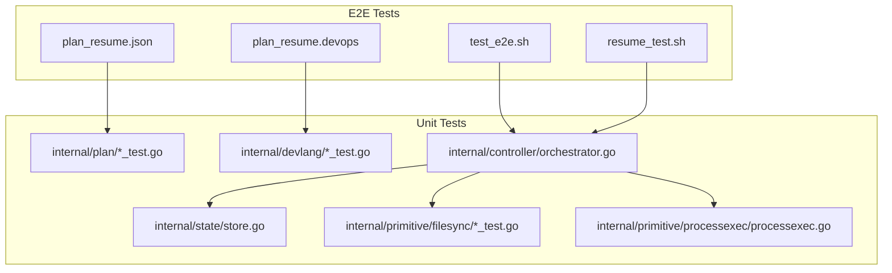
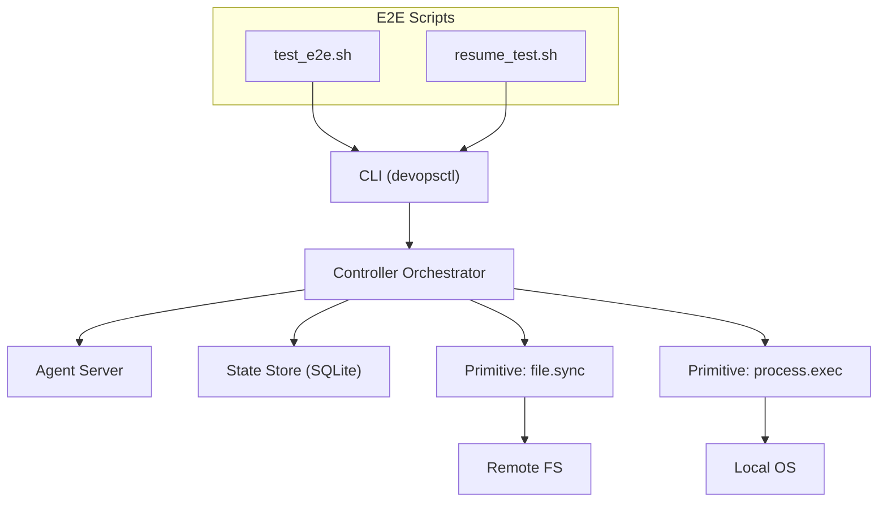
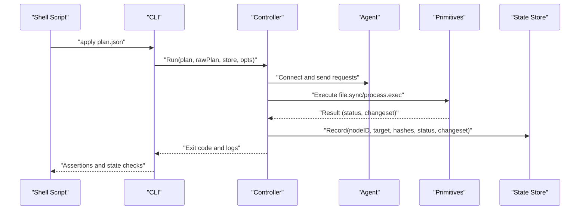
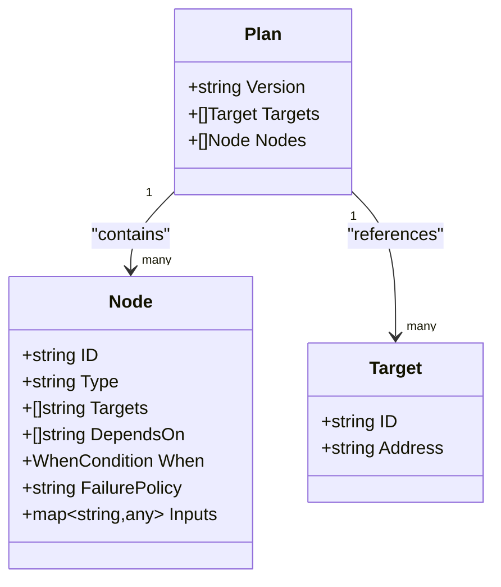
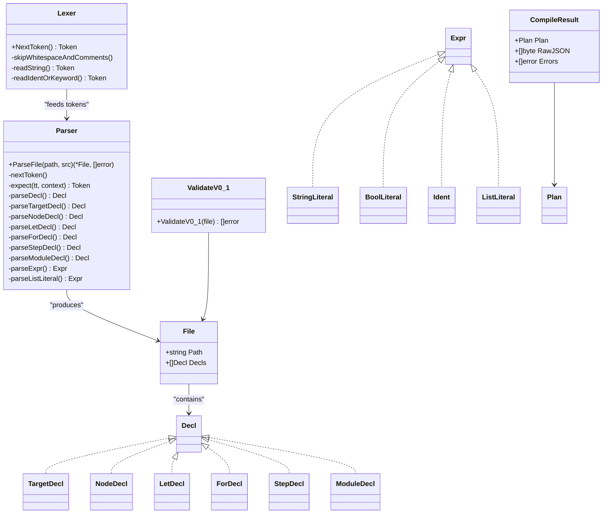
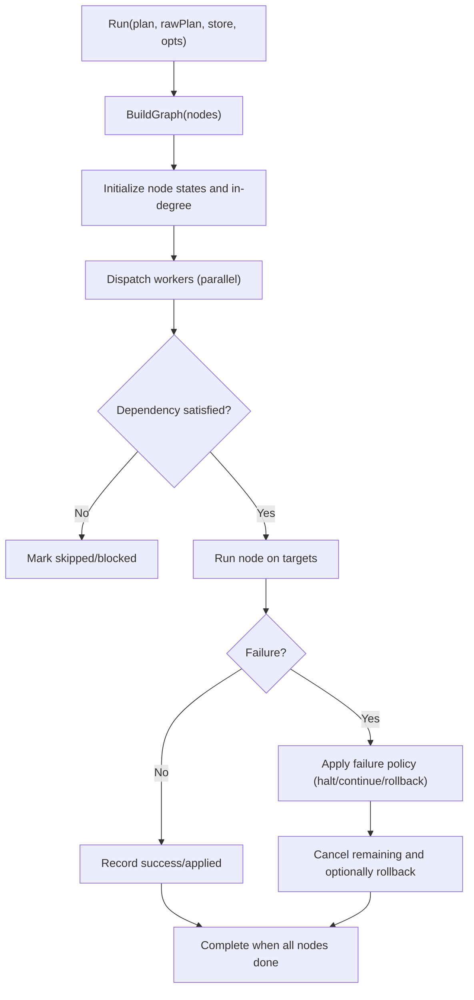
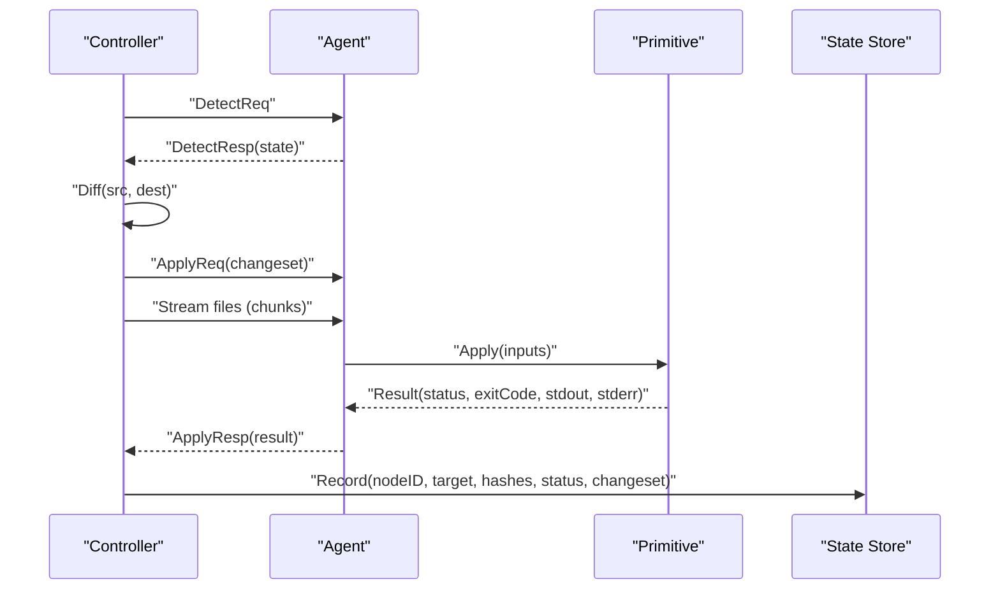
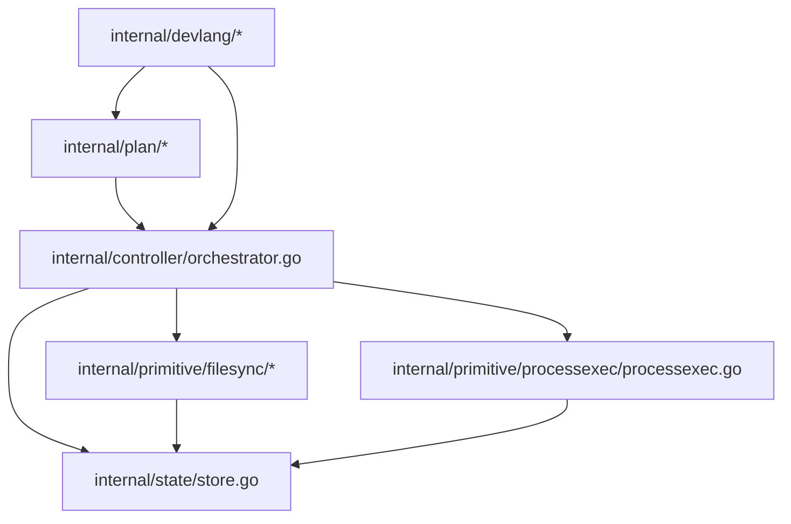

# Testing and Validation

<cite>
**Referenced Files in This Document**
- [compile_test.go](file://internal/devlang/compile_test.go)
- [validate.go](file://internal/devlang/validate.go)
- [lower.go](file://internal/devlang/lower.go)
- [lexer.go](file://internal/devlang/lexer.go)
- [parser.go](file://internal/devlang/parser.go)
- [ast.go](file://internal/devlang/ast.go)
- [test_e2e.sh](file://test_e2e.sh)
- [resume_test.sh](file://tests/e2e/resume_test.sh)
- [plan_resume.devops](file://tests/e2e/plan_resume.devops)
- [plan_resume.json](file://tests/e2e/plan_resume.json)
- [plan_test.go](file://internal/plan/plan_test.go)
- [validate_test.go](file://internal/plan/validate_test.go)
- [filesync_test.go](file://internal/primitive/filesync/filesync_test.go)
- [orchestrator.go](file://internal/controller/orchestrator.go)
- [store.go](file://internal/state/store.go)
- [diff.go](file://internal/primitive/filesync/diff.go)
- [rollback.go](file://internal/primitive/filesync/rollback.go)
- [processexec.go](file://internal/primitive/processexec/processexec.go)
- [server.go](file://internal/agent/server.go)
- [schema.go](file://internal/plan/schema.go)
</cite>

## Update Summary
**Changes Made**
- Added comprehensive unit tests for DevOps language compiler and validator
- Enhanced compilation pipeline testing with cross-format validation
- Expanded semantic validation logic coverage for language version 0.1
- Updated DevLang compiler section to reflect new test coverage
- Added new compilation and validation test categories

## Table of Contents
1. [Introduction](#introduction)
2. [Project Structure](#project-structure)
3. [Core Components](#core-components)
4. [Architecture Overview](#architecture-overview)
5. [Detailed Component Analysis](#detailed-component-analysis)
6. [Dependency Analysis](#dependency-analysis)
7. [Performance Considerations](#performance-considerations)
8. [Troubleshooting Guide](#troubleshooting-guide)
9. [Conclusion](#conclusion)
10. [Appendices](#appendices)

## Introduction
This document provides comprehensive testing and validation guidance for DevOpsCtl. It covers:
- End-to-end (e2e) testing framework and scenarios
- Resume testing and state recovery mechanisms
- Unit test coverage for the devlang compiler, controller orchestrator, and primitive operations
- Integration testing strategies for full workflows from .devops compilation to execution and state persistence
- Validation procedures for plan correctness, execution success, and rollback functionality
- Guidelines for writing custom tests, managing test data, and CI setup
- Performance testing approaches, load testing, and stress testing
- Debugging techniques for test failures, log analysis, and environment troubleshooting

## Project Structure
DevOpsCtl's testing assets are organized across:
- E2E shell scripts and plans for end-to-end validation
- Unit tests under internal packages for plan, devlang, controller, state, and primitives
- Primitive-specific tests for file synchronization and process execution

**Diagram sources**
- [test_e2e.sh](file://test_e2e.sh#L1-L317)
- [resume_test.sh](file://tests/e2e/resume_test.sh#L1-L81)
- [plan_resume.devops](file://tests/e2e/plan_resume.devops#L1-L43)
- [plan_resume.json](file://tests/e2e/plan_resume.json#L1-L36)
- [plan_test.go](file://internal/plan/plan_test.go#L1-L62)
- [compile_test.go](file://internal/devlang/compile_test.go#L1-L219)
- [validate_test.go](file://internal/plan/validate_test.go#L1-L95)
- [lexer.go](file://internal/devlang/lexer.go#L1-L247)
- [parser.go](file://internal/devlang/parser.go#L1-L495)
- [ast.go](file://internal/devlang/ast.go#L1-L126)
- [orchestrator.go](file://internal/controller/orchestrator.go#L1-L653)
- [store.go](file://internal/state/store.go#L1-L226)
- [filesync_test.go](file://internal/primitive/filesync/filesync_test.go#L1-L111)
- [processexec.go](file://internal/primitive/processexec/processexec.go#L1-L83)

**Section sources**
- [test_e2e.sh](file://test_e2e.sh#L1-L317)
- [resume_test.sh](file://tests/e2e/resume_test.sh#L1-L81)
- [plan_resume.devops](file://tests/e2e/plan_resume.devops#L1-L43)
- [plan_resume.json](file://tests/e2e/plan_resume.json#L1-L36)

## Core Components
- DevOps language compiler (lexer, parser, AST): Validates and lowers .devops declarations to plan nodes.
- Controller orchestrator: Executes plans end-to-end, manages concurrency, failure policies, resume/reconcile, and state persistence.
- State store: SQLite-backed append-only execution log for plan/node hashes, change sets, and inputs.
- Primitives:
  - file.sync: Detects remote state, computes diffs, streams file content, and supports rollback via snapshots.
  - process.exec: Executes commands locally and reports exit code and output.

Key testing areas:
- Plan loading and validation
- Devlang lexer/parser correctness
- Controller graph execution, failure propagation, and resume/reconcile
- Primitive diff/update/delete/mkdir behavior and rollback semantics
- State integrity and idempotency

**Section sources**
- [lexer.go](file://internal/devlang/lexer.go#L1-L247)
- [parser.go](file://internal/devlang/parser.go#L1-L495)
- [ast.go](file://internal/devlang/ast.go#L1-L126)
- [orchestrator.go](file://internal/controller/orchestrator.go#L1-L653)
- [store.go](file://internal/state/store.go#L1-L226)
- [diff.go](file://internal/primitive/filesync/diff.go#L1-L87)
- [rollback.go](file://internal/primitive/filesync/rollback.go#L1-L83)
- [processexec.go](file://internal/primitive/processexec/processexec.go#L1-L83)

## Architecture Overview
The e2e test suite validates the end-to-end pipeline: CLI invokes controller orchestration, which communicates with an agent over TCP, executes primitives, persists state, and supports resume/reconcile and rollback.

**Diagram sources**
- [test_e2e.sh](file://test_e2e.sh#L1-L317)
- [resume_test.sh](file://tests/e2e/resume_test.sh#L1-L81)
- [server.go](file://internal/agent/server.go#L1-L51)
- [orchestrator.go](file://internal/controller/orchestrator.go#L1-L653)
- [store.go](file://internal/state/store.go#L1-L226)
- [processexec.go](file://internal/primitive/processexec/processexec.go#L1-L83)
- [diff.go](file://internal/primitive/filesync/diff.go#L1-L87)

## Detailed Component Analysis

### End-to-End Test Suite
The e2e suite validates:
- File synchronization baseline
- .devops language compilation and application
- Idempotency and drift detection
- Process execution success and failure classification
- Rollback boundaries and state listing
- Plan fingerprint hashing and reconciliation
- Execution graph, dependencies, and failure policy behavior
- Resume and reconcile flows

**Diagram sources**
- [test_e2e.sh](file://test_e2e.sh#L1-L317)
- [orchestrator.go](file://internal/controller/orchestrator.go#L34-L300)
- [store.go](file://internal/state/store.go#L68-L84)

**Section sources**
- [test_e2e.sh](file://test_e2e.sh#L1-L317)

### Resume Testing and State Recovery
The resume test script demonstrates:
- Building the CLI, starting an agent, and preparing a plan with a failing node
- Running the plan to completion with a failure at a specific node
- Inspecting state before and after fixing the condition
- Resuming execution and verifying continued progress
- Reconciling a modified plan and asserting idempotent behavior

**Diagram sources**
- [resume_test.sh](file://tests/e2e/resume_test.sh#L1-L81)
- [plan_resume.devops](file://tests/e2e/plan_resume.devops#L1-L43)
- [plan_resume.json](file://tests/e2e/plan_resume.json#L1-L36)

**Section sources**
- [resume_test.sh](file://tests/e2e/resume_test.sh#L1-L81)
- [plan_resume.devops](file://tests/e2e/plan_resume.devops#L1-L43)
- [plan_resume.json](file://tests/e2e/plan_resume.json#L1-L36)

### Plan Loading and Validation
Unit tests validate:
- Successful load and validation of a minimal plan
- Missing fields and unknown target references produce validation errors
- process.exec node validation ensures required fields (cmd, cwd) are present

**Diagram sources**
- [schema.go](file://internal/plan/schema.go#L11-L40)

**Section sources**
- [plan_test.go](file://internal/plan/plan_test.go#L1-L62)
- [validate_test.go](file://internal/plan/validate_test.go#L1-L95)
- [schema.go](file://internal/plan/schema.go#L11-L77)

### DevLang Compiler (Lexer, Parser, AST)
**Updated** Comprehensive unit tests have been added for the DevOps language compiler and validator, providing extensive coverage for compilation pipeline, cross-format validation, and semantic validation logic for language version 0.1.

Coverage includes:
- Tokenization of keywords, identifiers, strings, booleans, and operators
- Parsing of target, node, let, for, step, and module declarations
- Expression parsing for strings, booleans, identifiers, and lists
- Error reporting with position information
- Compilation pipeline validation from .devops to plan JSON
- Cross-format validation ensuring .devops and JSON plans produce identical results
- Semantic validation for language version 0.1 constraints

**Diagram sources**
- [lexer.go](file://internal/devlang/lexer.go#L1-L247)
- [parser.go](file://internal/devlang/parser.go#L1-L495)
- [ast.go](file://internal/devlang/ast.go#L1-L126)
- [compile_test.go](file://internal/devlang/compile_test.go#L1-L219)
- [validate.go](file://internal/devlang/validate.go#L1-L265)

**Section sources**
- [lexer.go](file://internal/devlang/lexer.go#L1-L247)
- [parser.go](file://internal/devlang/parser.go#L1-L495)
- [ast.go](file://internal/devlang/ast.go#L1-L126)
- [compile_test.go](file://internal/devlang/compile_test.go#L1-L219)
- [validate.go](file://internal/devlang/validate.go#L1-L265)

### Controller Orchestrator
Key behaviors validated by e2e and unit tests:
- Build execution graph from nodes and dependencies
- Parallel execution with configurable parallelism
- Failure policy handling (halt, continue, rollback)
- Resume and reconcile logic using plan/node hashes
- State recording per node-target combination
- RollbackLast for last run recovery

**Diagram sources**
- [orchestrator.go](file://internal/controller/orchestrator.go#L34-L300)
- [store.go](file://internal/state/store.go#L68-L84)

**Section sources**
- [orchestrator.go](file://internal/controller/orchestrator.go#L1-L653)
- [store.go](file://internal/state/store.go#L1-L226)

### Primitive Operations
- file.sync:
  - Detect remote state, compute diff (create/update/delete/chmod/chown/mkdir), stream files, persist state, and rollback via snapshot restoration
- process.exec:
  - Execute commands with timeout, capture stdout/stderr, classify exit codes and timeouts, and report non-rollback-safe results

**Diagram sources**
- [orchestrator.go](file://internal/controller/orchestrator.go#L313-L442)
- [diff.go](file://internal/primitive/filesync/diff.go#L1-L87)
- [rollback.go](file://internal/primitive/filesync/rollback.go#L1-L83)
- [processexec.go](file://internal/primitive/processexec/processexec.go#L1-L83)
- [store.go](file://internal/state/store.go#L68-L84)

**Section sources**
- [diff.go](file://internal/primitive/filesync/diff.go#L1-L87)
- [rollback.go](file://internal/primitive/filesync/rollback.go#L1-L83)
- [processexec.go](file://internal/primitive/processexec/processexec.go#L1-L83)

## Dependency Analysis
Testing dependencies across components:

**Diagram sources**
- [plan_test.go](file://internal/plan/plan_test.go#L1-L62)
- [compile_test.go](file://internal/devlang/compile_test.go#L1-L219)
- [validate_test.go](file://internal/plan/validate_test.go#L1-L95)
- [lexer.go](file://internal/devlang/lexer.go#L1-L247)
- [parser.go](file://internal/devlang/parser.go#L1-L495)
- [ast.go](file://internal/devlang/ast.go#L1-L126)
- [validate.go](file://internal/devlang/validate.go#L1-L265)
- [lower.go](file://internal/devlang/lower.go#L1-L90)
- [orchestrator.go](file://internal/controller/orchestrator.go#L1-L653)
- [store.go](file://internal/state/store.go#L1-L226)
- [filesync_test.go](file://internal/primitive/filesync/filesync_test.go#L1-L111)
- [processexec.go](file://internal/primitive/processexec/processexec.go#L1-L83)

**Section sources**
- [plan_test.go](file://internal/plan/plan_test.go#L1-L62)
- [compile_test.go](file://internal/devlang/compile_test.go#L1-L219)
- [validate_test.go](file://internal/plan/validate_test.go#L1-L95)
- [lexer.go](file://internal/devlang/lexer.go#L1-L247)
- [parser.go](file://internal/devlang/parser.go#L1-L495)
- [ast.go](file://internal/devlang/ast.go#L1-L126)
- [validate.go](file://internal/devlang/validate.go#L1-L265)
- [lower.go](file://internal/devlang/lower.go#L1-L90)
- [orchestrator.go](file://internal/controller/orchestrator.go#L1-L653)
- [store.go](file://internal/state/store.go#L1-L226)
- [filesync_test.go](file://internal/primitive/filesync/filesync_test.go#L1-L111)
- [processexec.go](file://internal/primitive/processexec/processexec.go#L1-L83)

## Performance Considerations
- Parallelism tuning: Adjust worker count to balance throughput and resource contention.
- Streaming efficiency: Large file transfers are chunked; ensure network stability and adequate buffer sizes.
- State writes: SQLite WAL mode improves concurrency; avoid excessive small writes by batching where appropriate.
- Failure policy impact: "continue" allows partial progress; "rollback" incurs extra round-trips for recovery.
- Idempotency and reconciliation reduce redundant work by skipping unchanged nodes.

## Troubleshooting Guide
Common issues and remedies:
- Agent connectivity failures: Verify agent address/port and firewall rules; confirm the agent is started before applying plans.
- Plan validation errors: Ensure required fields (e.g., cmd, cwd for process.exec) are present and typed correctly.
- Resume not working: Confirm plan/node hashes match stored records; ensure the last run corresponds to the same plan hash.
- Rollback not triggered: Check that the primitive supports rollback and that rollback markers/snapshots exist.
- State inconsistencies: Use state listing to inspect node statuses and change sets; rebuild state by re-applying plans if necessary.
- Timeout and process failures: Review process execution logs and adjust timeouts; validate command availability and permissions.

**Section sources**
- [test_e2e.sh](file://test_e2e.sh#L1-L317)
- [resume_test.sh](file://tests/e2e/resume_test.sh#L1-L81)
- [orchestrator.go](file://internal/controller/orchestrator.go#L554-L583)
- [store.go](file://internal/state/store.go#L100-L159)

## Conclusion
DevOpsCtl's testing framework combines robust e2e shell scripts with focused unit tests across the devlang compiler, controller orchestrator, state store, and primitive operations. The recent addition of comprehensive unit tests for the DevOps language compiler and validator significantly enhances the reliability and correctness of the compilation pipeline. Together, they validate correctness, resilience, and recoverability from failures, while enabling continuous improvement through CI-friendly scripts and deterministic assertions.

## Appendices

### Writing Custom Tests
- E2E tests: Extend the existing shell scripts to add new scenarios (e.g., additional primitives, failure modes, concurrency limits).
- Unit tests:
  - Plan: Add test cases for edge cases in plan validation and schema compliance.
  - DevLang: Add lexer/parser tests for new keywords or expressions, and expand semantic validation tests for language version 0.1 constraints.
  - Controller: Add tests for failure policy combinations and resume conditions.
  - Primitives: Add tests for boundary conditions (large diffs, permission changes, timeouts).

**Section sources**
- [plan_test.go](file://internal/plan/plan_test.go#L1-L62)
- [compile_test.go](file://internal/devlang/compile_test.go#L1-L219)
- [validate_test.go](file://internal/plan/validate_test.go#L1-L95)
- [filesync_test.go](file://internal/primitive/filesync/filesync_test.go#L1-L111)
- [test_e2e.sh](file://test_e2e.sh#L1-L317)

### Test Data Management
- Use temporary directories for each test run to isolate state and artifacts.
- Maintain minimal reproducible plans for regression testing.
- Snapshot and compare state logs to assert idempotency and drift handling.
- Leverage cross-format validation tests to ensure .devops and JSON plans produce identical results.

**Section sources**
- [test_e2e.sh](file://test_e2e.sh#L6-L19)
- [resume_test.sh](file://tests/e2e/resume_test.sh#L16-L52)
- [compile_test.go](file://internal/devlang/compile_test.go#L88-L116)

### Continuous Integration Setup
- Build the CLI in CI and run both e2e and unit tests.
- Export and archive state database files for post-mortem analysis.
- Gate merges on passing e2e and unit tests; consider parallelizing slow tests.
- Include comprehensive DevOps language compiler tests in CI pipeline.

**Section sources**
- [test_e2e.sh](file://test_e2e.sh#L21-L22)
- [resume_test.sh](file://tests/e2e/resume_test.sh#L8-L9)
- [compile_test.go](file://internal/devlang/compile_test.go#L1-L219)

### Performance, Load, and Stress Testing
- Measure end-to-end latency across varying numbers of nodes and targets.
- Simulate network partitions and agent unavailability to validate resilience and resume behavior.
- Stress file synchronization with large change sets and concurrent targets.
- Test compilation pipeline performance with complex .devops files containing multiple targets and nodes.